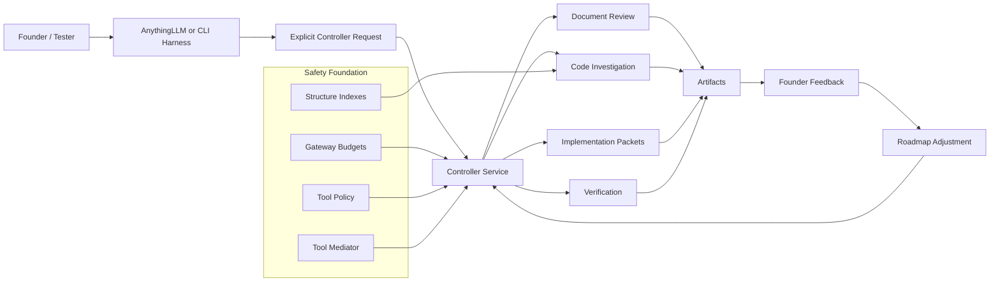
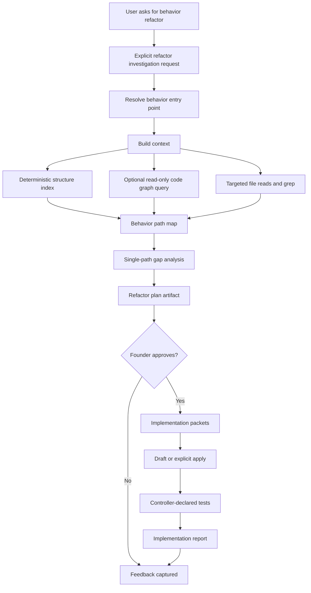

# Actionable Workflow Roadmap

This roadmap translates the shipped controller, documenter, structure-index, implementation, and tool-policy work into founder-testable workflows.

The current risk is not missing infrastructure. The risk is continuing to add infrastructure without producing workflows that can be used, tested, and criticized in normal development sessions.

## Current Alignment

The project should keep its existing architecture:

- explicit controller requests, not implicit repo-wide chat behavior
- controller-owned discovery, sequencing, state, artifact writing, and tool policy
- role/model calls limited to bounded packets
- read-only target repository defaults
- deterministic artifacts that can be inspected without session history

The project now needs a more product-shaped loop:

```text
founder/tester request -> explicit workflow -> bounded artifacts -> hands-on use -> feedback -> next workflow increment
```

## 10,000 Foot View



## 1,000 Foot Refactor Workflow Target

The near-term product target is a workflow that can start at the logic beginning point for a behavior, investigate whether there is more than one path for that behavior, produce a plan, and then feed bounded implementation packets into the existing implementation workflow.



## Next Shippable Workflow Increments

### 1. Workflow Catalog For Harness Testing

Status: Next

Create a small catalog of explicit controller request envelopes that a founder/tester can paste into AnythingLLM or run from scripts.

Acceptance criteria:

- each catalog entry has a concrete request payload
- each entry names expected artifacts
- each entry explains what feedback the tester should provide
- no workflow is triggered by ordinary natural language alone

### 2. Read-Only Code Context Lookup

Status: Next

Expose a controller-owned workflow for targeted code lookup. It should use existing deterministic structure indexes first, and may use a curated read-only CodeGraphContext adapter when relationship queries are useful.

Initial request shape:

```json
{
  "workflow": "code_context.lookup",
  "target_root": "C:/agentic_agents",
  "query": "find callers and callees of build_plan",
  "max_results": 25
}
```

Acceptance criteria:

- output is a bounded artifact and compact harness response
- target root remains allowlisted
- raw CodeGraphContext MCP tools are not exposed wholesale
- indexing, watching, delete, bundle load, package indexing, and raw Cypher are not model-visible by default
- stale or unavailable graph state is reported as a warning, not hidden

### 3. Code Investigation Plan

Status: Planned

Create a read-only investigation workflow that starts from a behavior, symbol, file, or user-described concern and returns an investigation artifact.

The workflow should answer:

- what is the likely beginning point of the logic
- what files and symbols participate
- whether multiple code paths appear to implement the same behavior
- what tests currently cover the behavior
- what implementation packets would be needed to change it safely

Acceptance criteria:

- no repository mutation
- deterministic source references where possible
- every claim links to file paths, symbols, line ranges, tool outputs, or explicit uncertainty
- output can feed an implementation packet draft without a model inventing target files

### 4. Single-Path Refactor Workflow

Status: Planned

Compose investigation, approval, implementation packets, and verification into a founder-testable refactor path.

Acceptance criteria:

- begins with a read-only investigation report
- requires approval before draft/apply
- produces implementation packets with exact files, operations, acceptance criteria, and verification commands
- uses the existing implementation workflow instead of creating a parallel edit path
- preserves failed verification and resume state

### 5. Feedback Capture

Status: Planned

Add a lightweight feedback artifact for founder/tester use after each workflow run.

Acceptance criteria:

- records what was useful, wrong, missing, too slow, or too noisy
- links feedback to workflow ID, run ID, artifacts, and request payload
- does not require editing large JSON reports by hand
- feeds roadmap updates without relying on conversation memory

## Near-Term Work Queue

1. Add harness workflow catalog examples.
2. Add `code_context.lookup` as a read-only controller workflow.
3. Add a curated CodeGraphContext adapter only after the lookup workflow has a narrow schema.
4. Add code investigation artifacts that can produce implementation packet candidates.
5. Compose a `refactor.single_path` workflow from investigation plus the existing implementation workflow.

## Do Not Do Yet

- Do not add a broad external agent framework just to show progress.
- Do not expose the full CodeGraphContext MCP server to model-visible tools.
- Do not let role prompts choose repo traversal, manifest creation, chunk selection, or write policy.
- Do not make AnythingLLM natural-language chat silently trigger repository workflows.
- Do not build a second implementation path beside the existing implementation workflow.

## Success Signal

The project is moving forward when a tester can run a named workflow, inspect bounded artifacts, give specific feedback, and see that feedback change the next workflow increment.
