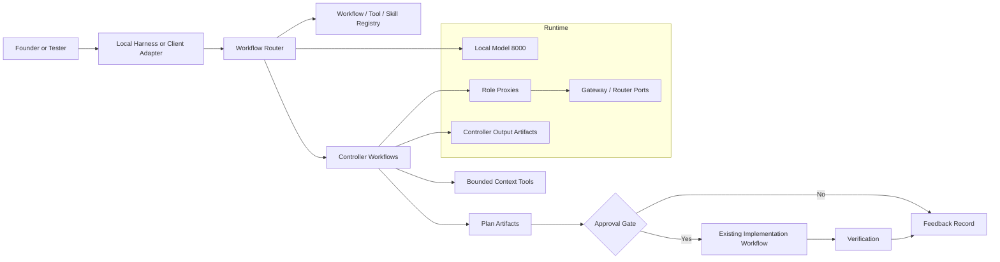
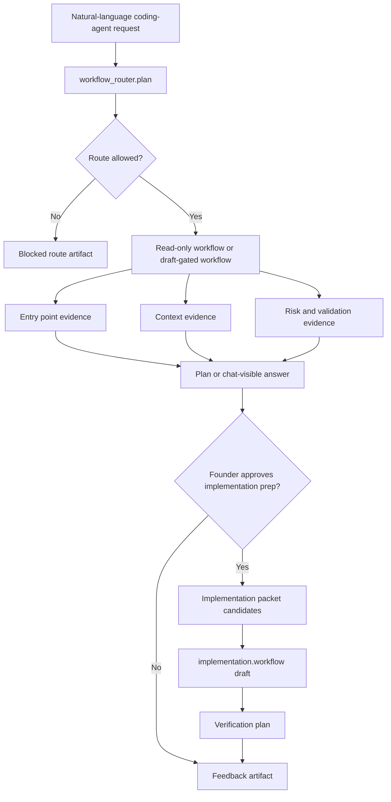

# Actionable Workflow Roadmap

This is the canonical product roadmap.

If this document conflicts with older skill, controller, gateway, or AnythingLLM planning docs, this document wins until those docs are cleaned up.

## Product Destination

The product is not "a folder of skills." The product is a local agent harness that can take a natural-language development request, select the right tools and skills without retraining, create an evidence-backed plan, execute only inside approved boundaries, verify the result, and record feedback.

Final destination:

```text
natural-language request
-> controller-owned workflow router
-> registry lookup for workflows, tools, and skills
-> bounded context gathering
-> plan artifact
-> approval gate
-> existing implementation workflow
-> verification
-> feedback record
```

The harness must route that request without the user injecting `SKILL.md` text, naming every skill, or pasting a controller JSON envelope.

## What We Are Building

Build a controller-owned workflow router.

The router decides:

- whether the request is allowed
- which workflow should handle it
- which skills provide procedural guidance
- which tools may gather context
- whether execution is read-only, implementation-prep, or apply
- what approvals are required before any mutation
- what artifacts prove the result

Skills remain useful, but only as registry entries that the router can load on demand. A skill is not a runtime, a tool, an approval system, or a product interface.

## Non-Negotiable Acceptance Criteria

The product is not usable until all of these are true:

1. A natural-language request can enter the harness without manual skill injection.
2. The controller selects a workflow from a registry and returns a structured route decision.
3. The route decision can execute a read-only investigation against both frozen Coinbase fixtures.
4. Common L1/L2 coding-agent requests start from evidence-backed context and return chat-visible answers.
5. Implementation preparation requires explicit approval and uses the existing `implementation.workflow`; no second edit path is created.
6. Apply behavior is tested only on disposable copies until a separate approval expands scope.
7. Verification commands are produced from evidence, not model guesses.
8. Feedback is captured as a durable artifact linked to the workflow run.
9. Bash-side validation covers localhost model `8000`, controller, gateway/router ports, role ports, AnythingLLM when the adapter phase starts, and both frozen repos.
10. Regression passes after every non-agent code change.

## Current Work Classification

Do not blindly keep or blindly revert everything. Classify the current uncommitted work by product value.

Keep or rebuild if present:

- controller service
- gateway routing and budget enforcement
- role proxy ports
- existing `implementation.workflow`
- frozen repo fixtures and disposable-copy mutation tests
- deterministic read-only workflows such as `code_context.lookup` and `code_investigation.plan`
- existing skills as draft registry fixtures
- live validation scripts that test real runtime paths

Demote:

- prompt-injected skill validation
- pasteable JSON-envelope recipes
- skill-chain success claims that do not start from natural language
- docs that describe partial workflows as product-complete

Pause:

- new skills
- raw CodeGraphContext expansion
- more AnythingLLM examples
- apply-mode expansion
- broad documentation cleanup unrelated to the next phase

## Execution Rule

Always work the lowest-numbered incomplete phase.

Do not move to the next phase because a demo is close. A phase is complete only when all required artifacts and tests pass.

If a phase fails, fix that phase. Do not add another skill, adapter, route, or document to compensate for the failure.

Any scope expansion requires explicit founder approval and must update this roadmap before implementation.

## Proposal And Tightening Rule

Founder-approved autonomous development should keep the roadmap moving in the same product direction without waiting for a prompt at every boundary.

Use this distinction:

- **New feature or capability:** add it as a proposed roadmap phase with goal, implementation tasks, and acceptance proof.
- **Tightening of the current or immediately previous phase:** implement it immediately in the same phase, then record the proof. Do not create a separate proposal for validator hardening, stale-fixture correction, route-key checks, missing docs links, or other work needed to make the current path reliable.
- **Missed tightening more than one phase away:** raise it in the current summary and recommend adding it to the roadmap before implementation, because changing older shipped behavior may alter scope.

Do not use this rule to bypass safety gates. Runtime-facing changes still require live Bash/AnythingLLM validation when applicable, and non-agent code changes still require full regression.

## Structured Development Rule

Every non-trivial change must follow a documented development cycle. This is a standing project rule, not a preference for a single session.

Required cycle:

1. Define the problem and the user-visible failure.
2. Gather evidence from code, artifacts, tests, or live runtime behavior.
3. Identify the root cause and write down the rejected explanations when they matter.
4. Define the smallest acceptable design that preserves the single code path rule.
5. Implement the change with focused scope.
6. Verify with focused tests, full regression when required, and live Bash/AnythingLLM validation when the workflow is runtime-facing.
7. Inspect artifacts and protected fixtures for mutation or missing proof.
8. Update documentation and roadmap state so a contextless future agent can continue from the correct next step.

For workflow-router and execution-planning work, do not treat a prompt tweak as a fix unless the cycle above proves it through controller artifacts and live localhost `8000` tests on both frozen Coinbase fixtures.

## L1 Prompt Development Plan

Default regression must not be blocked by non-V1 historical workflow coverage. Implementation-prep continuation, packet-objective, narrowed-edit, and disposable-apply tests stay outside default pytest selection until the roadmap explicitly returns to those stages.

L1 prompts are the first user-facing skill targets because they match common coding-agent requests, have one clear outcome, use a small tool set, and are easy for a tester to judge.

Read-only L1 prompts:

1. `L1-001: Find Where Behavior Starts`
2. `L1-002: Explain A Function Or File`
3. `L1-003: Find Related Tests`
4. `L1-004: Locate Configuration Or Environment Setting`
5. `L1-005: Summarize Test Failure From Pasted Output`
6. `L1-006: Check Whether Behavior Already Exists`
7. `L1-007: Find Callers Or Usages`
8. `L1-008: Produce A Safe Test Command`
9. `L1-012: Locate Endpoint Or Route Handler`
10. `L1-013: Locate Error Or Log Message Source`
11. `L1-014: Summarize A Module Or File`
12. `L1-015: Find Data Model Or Schema`
13. `L1-016: Find Imports Or Dependencies`

Draft-only or approval-gated L1 prompts:

14. `L1-009: Add Or Update A Small Unit Test`
15. `L1-010: Make A Small Text Or Documentation Edit`
16. `L1-011: Fix A Simple Failing Test`

Build order:

1. `L1-001: Find Where Behavior Starts`
2. `L1-003: Find Related Tests`
3. `L1-008: Produce A Safe Test Command`
4. `L1-002: Explain A Function Or File`
5. `L1-006: Check Whether Behavior Already Exists`
6. `L1-007: Find Callers Or Usages`
7. `L1-004: Locate Configuration Or Environment Setting`
8. `L1-005: Summarize Test Failure From Pasted Output`
9. `L1-010: Make A Small Text Or Documentation Edit`
10. `L1-009: Add Or Update A Small Unit Test`
11. `L1-011: Fix A Simple Failing Test`
12. `L1-012: Locate Endpoint Or Route Handler`
13. `L1-013: Locate Error Or Log Message Source`
14. `L1-014: Summarize A Module Or File`
15. `L1-015: Find Data Model Or Schema`
16. `L1-016: Find Imports Or Dependencies`

Next roadmap gate:

```text
No approved implementation phase remains after Phase 90 V1.1 Release Candidate Gate proof is complete. Phase 91 is proposed and awaits founder approval.
```

Next implementation target:

```text
Founder approval for proposed Phase 91 Stable Channel Promotion And External Tester Handoff.
```

Reason: Phase 57 made the founder field suite part of V1 acceptance, Phase 58 added the prompt matrix, Phase 59 added semantic answer quality gates, Phase 60 added user-facing refined prompts, Phase 61 produced a validated Batch D skill-scaling proposal without registry mutation, Phase 62 registered Batch D as draft skills through the existing lifecycle, Phase 63 proved and promoted Batch D through live gateway and AnythingLLM validation, Phase 64 added Batch D prompts to the founder field suite with live V1 acceptance proof, Phase 65 added skill-library health and Batch D proof to the V1 acceptance path, Phase 66 proved the harness against a non-Coinbase disposable Python service fixture, Phase 67 made AnythingLLM feedback actionable, Phase 68 split release gates into diagnosable profiles, Phase 69 added a latest-run inspector, Phase 70 made prompt catalogs governed fixtures instead of scattered script literals, Phase 71 proved the browser-rendered AnythingLLM Desktop UI path through `/stream-chat` with screenshots and fixture mutation proof, Phase 72 added a model portability gate that wraps the existing V1 acceptance path, probes the candidate `/v1/models` endpoint, and classifies misses as harness, classifier, prompt, model-quality, or unknown issues, Phase 73 added read-only run artifact diffing for V1 acceptance, founder-field, and model-portability reports, Phase 74 added a manifest-driven fixture manager with protected source snapshots, disposable setup, cleanup, and integration into the existing generalization fixture copy helpers, Phase 75 added a read-only failure taxonomy report so failures across release gates can be classified consistently instead of reinterpreted from raw logs, Phase 76 added a first-time user doctor so setup failures can be detected before testers try AnythingLLM prompts, Phase 77 added governed skill-library packaging policy before scaling toward large skill packs, Phase 78 turned portability evidence into advisory model capability profiles and a routing policy without enabling automatic model selection, Phase 79 added a canonical prompt-to-skill coverage map with a validator and gap backlog, Phase 80 extended the existing `skill.scaffold` path into a dry-run authoring factory with coverage, docs, eval, fail-closed test, and live AnythingLLM proof, Phase 81 added an explicit skill regression tier catalog with offline, controller, gateway, AnythingLLM API, UI, fixture-mutation, and release-candidate proof boundaries, Phase 82 expanded live validation to a synthetic Node CLI fixture plus both frozen Coinbase fixtures, Phase 83 added a disposable-copy mutation sandbox contract, structured diff proof, direct mutation proof artifacts, path guardrails, and rollback-failure tests around the single existing implementation workflow, Phase 84 made approval states visible in chat and stateful in controller run records, Phase 85 added a read-only observability report with route, model, skill, tool, approval, downstream, artifact, mutation, timing, and filter proof from recent live runs, Phase 86 made normal workflow-router chat explain selected workflow, skills, tools, route rules, and registry grounding in both FormatA and JSON output, Phase 87 added versioned release-channel metadata plus setup validation, Phase 88 added a contextless external tester onboarding pack with live AnythingLLM feedback proof inside the release-candidate gate, Phase 89 added the release-candidate security policy gate for secret exposure, filesystem boundaries, protected fixture policy, command fragments, and onboarding prompt safety, and Phase 90 consolidated those gates into a passed V1.1 release-candidate profile. The next logical product step is a stable-channel promotion and external tester handoff decision, but that changes release state and must be explicitly approved before implementation.

## Foreseeable Approval Queue

This queue is intended for mass approval. A founder can approve one or more listed phases in a single message, and the implementation agent should then work the lowest-numbered approved incomplete phase until the approved queue is exhausted.

Mass approval rules:

- approval covers only the phase scope and acceptance proof written below
- approval does not waive stop conditions, regression requirements, live validation requirements, or protected fixture rules
- any scope expansion that changes a phase by more than 50% must be written into this roadmap and re-approved before implementation
- tightening within the approved scope should be implemented immediately and documented in that phase
- broad advanced refactor orchestration remains outside this approval queue until the roadmap explicitly reintroduces it

Approved phase queue:

1. Phase 43: Skill Update And Versioning Workflow - complete
2. Phase 44: Skill Release Gate And CI Profile - complete
3. Phase 45: Skill Discovery And Selection Explainability - complete
4. Phase 46: Skill Pack Export, Import, And Namespace Governance - complete
5. Phase 47: Skill Authoring Scaffolder And Template Enforcement - complete
6. Phase 48: Skill Eval Mutation And Fault Injection Suite - complete
7. Phase 49: Natural-Language Lifecycle Operations With Approval Continuations - complete
8. Phase 50: Controlled L1/L2 Skill Expansion Batch C - complete
9. Phase 51: Tool Catalog Expansion Governance - complete
10. Phase 52: AnythingLLM Chat UX And Artifact Summarization Hardening - complete
11. Phase 53: Multi-Step Task Decomposition Workflow - complete
12. Phase 54: Controlled Small-Change Apply Workflow - complete
13. Phase 55: V1 Productization, Installer, And Release Candidate Gate - complete
14. Phase 56: V1 Founder Field Test And Reliability Hardening - complete
15. Phase 57: Founder Field Suite Release Gate - complete
16. Phase 58: Prompt Variant And Classifier Conflict Matrix - complete
17. Phase 59: Chat Answer Semantic Quality Gate - complete
18. Phase 60: User-Facing Prompt Refinement - complete
19. Phase 61: Skill Scaling Batch D Based On Field Evidence - complete
20. Phase 62: Batch D Registration Through Existing Lifecycle - complete
21. Phase 63: Batch D Live Suite Coverage - complete
22. Phase 64: Founder Field Suite Expansion With Batch D Prompts - complete
23. Phase 65: Skill Library Release Gate Upgrade - complete
24. Phase 66: Generalization Beyond Coinbase Fixture - complete
25. Phase 67: AnythingLLM User Feedback Loop - complete
26. Phase 68: Release Gate Profiles - complete
27. Phase 69: Latest Run Inspector - complete
28. Phase 70: Prompt Catalog Governance - complete
29. Phase 71: AnythingLLM UI E2E - complete
30. Phase 72: Model Portability Gate - complete
31. Phase 73: Run Artifact Diffing - complete
32. Phase 74: Fixture Manager - complete
33. Phase 75: Failure Taxonomy Dashboard And Report - complete
34. Phase 76: First-Time User Doctor - complete
35. Phase 77: Skill Library Packaging Strategy - complete
36. Phase 78: Model Capability Profiles And Routing Policy - complete
37. Phase 79: Prompt-To-Skill Coverage Map And Gap Backlog - complete
38. Phase 80: Skill Authoring Factory And Eval Scaffolder - complete
39. Phase 81: Skill Regression Tiers - complete
40. Phase 82: Multi-Repo Fixture Expansion - complete
41. Phase 83: Tool Reliability And Sandboxed Mutation Harness - complete
42. Phase 84: Approval And Continuation UX Hardening - complete
43. Phase 85: Skill And Tool Observability Dashboard - complete
44. Phase 86: Natural-Language Skill Discovery And Selection Explanation - complete
45. Phase 87: Versioned Release Channels And Installer - complete
46. Phase 88: External Tester Onboarding Pack - complete
47. Phase 89: Security And Policy Review Gate - complete
48. Phase 90: V1.1 Release Candidate Gate - complete
49. Phase 91: Stable Channel Promotion And External Tester Handoff - proposed; awaiting founder approval

Second-step approved phases:

1. Phase 68: Release Gate Profiles - complete.
2. Phase 69: Latest Run Inspector - complete.
3. Phase 70: Prompt Catalog Governance - complete.
4. Phase 71: AnythingLLM UI E2E - complete.
5. Phase 72: Model Portability Gate - complete.
6. Phase 73: Run Artifact Diffing - complete.
7. Phase 74: Fixture Manager - complete.
8. Phase 75: Failure Taxonomy Dashboard And Report - complete.
9. Phase 76: First-Time User Doctor - complete.
10. Phase 77: Skill Library Packaging Strategy - complete.

Third-step approved phases:

1. Phase 78: Model Capability Profiles And Routing Policy - complete.
2. Phase 79: Prompt-To-Skill Coverage Map And Gap Backlog - complete.
3. Phase 80: Skill Authoring Factory And Eval Scaffolder - complete.
4. Phase 81: Skill Regression Tiers - complete.
5. Phase 82: Multi-Repo Fixture Expansion - complete.
6. Phase 83: Tool Reliability And Sandboxed Mutation Harness - complete.
7. Phase 84: Approval And Continuation UX Hardening - complete.
8. Phase 85: Skill And Tool Observability Dashboard - complete.
9. Phase 86: Natural-Language Skill Discovery And Selection Explanation - complete.
10. Phase 87: Versioned Release Channels And Installer - complete.
11. Phase 88: External Tester Onboarding Pack - complete.
12. Phase 89: Security And Policy Review Gate - complete.
13. Phase 90: V1.1 Release Candidate Gate - complete.
14. Phase 91: Stable Channel Promotion And External Tester Handoff - proposed; awaiting founder approval.

Current L1-001 status:

- Started: the router now has an explicit `l1_find_behavior_start_terms` rule that maps this prompt family to `code_investigation.plan`.
- Started: default regression now excludes deferred post-L1 workflow coverage.
- Passed: focused L1 regression covered plan-only routing, read-only execution, natural chat, AnythingLLM-style streaming, skill selection, and gateway routing.
- Passed: default regression on June 4, 2026 returned `133 passed, 19 deselected`.
- Passed: Bash health checks returned OK for localhost ports `8000`, `8300`, `8500`, and `8400` after restarting the stack.
- Passed: Bash workflow-router gateway L1 prompt test on `/mnt/c/coinbase_testing_repo_frozen_tmp` and `/mnt/c/coinbase_testing_repo_frozen_tmp.github` selected `code_investigation.plan`, completed downstream read-only investigation, recorded `model_router_status=accepted`, and returned `verification_command_count=10`.
- Passed: AnythingLLM workspace API L1 prompt test on both frozen fixtures returned expected markers for `workflow_router.plan completed`, `code_investigation.plan`, `verification_command_count`, and `run_id:`.
- Passed: protected fixture check after live tests found the expected invariant text in both fixtures and `git -C C:\coinbase_testing_repo_frozen_tmp.github status --short` was clean.

Current L1-002 status:

- Started: the router now has an explicit `l1_explain_code_terms` rule that maps file/function explanation prompt families to `code_investigation.plan`.
- Started: `code_investigation.plan` now writes a bounded `code_explanation` plan section and `code-explanation.json` artifact. For selected Python source files under the existing read-only budget, it indexes AST definitions so deep functions are resolved without dumping large source files.
- Passed: focused L1-002 regression covered plan-only routing, read-only execution artifacts, natural chat, and read-only skill selection.
- Passed: default regression on June 4, 2026 returned `145 passed, 19 deselected`.
- Passed: Bash workflow-router gateway L1-002 prompt test on `/mnt/c/coinbase_testing_repo_frozen_tmp` and `/mnt/c/coinbase_testing_repo_frozen_tmp.github` selected `code_investigation.plan`, completed downstream read-only investigation, recorded `model_router_status=accepted`, recorded `l1_explain_code_terms`, and produced `code_explanation.status=ready` for `StealthOrderManager.find_stealth_order_by_placed_order_id`. Run IDs: `workflow-router-20260604T183030456026Z` and `workflow-router-20260604T183045207083Z`.
- Passed: AnythingLLM workspace API L1-002 prompt test on both frozen fixtures returned expected markers for `workflow_router.plan`, `code_investigation.plan`, `downstream_code_explanation`, and `run_id:`. Run IDs: `workflow-router-20260604T183308126528Z` and `workflow-router-20260604T183321666891Z`.
- Passed: protected fixture checks after live tests found no source hash changes for `core/stealth_order_manager.py`, preserved `client_order_id` invariant text in both fixtures, and `git -C C:\coinbase_testing_repo_frozen_tmp.github status --short` was clean.

Current L1-003 status:

- Started: the router now has an explicit `l1_find_related_tests_terms` rule that maps related-test prompt families to `code_investigation.plan`.
- Started: the advisory model-router prompt now includes explicit L1 rules for behavior-start, related-test, and caller/usage routing.
- Passed: focused L1-003 regression covered plan-only routing, read-only execution artifacts, natural chat, and read-only skill selection.
- Passed: default regression on June 4, 2026 returned `137 passed, 19 deselected`.
- Passed: Bash health checks returned OK for localhost ports `8000`, `8300`, `8500`, and `8400` after restarting the stack.
- Passed: Bash workflow-router gateway L1-003 prompt test on `/mnt/c/coinbase_testing_repo_frozen_tmp` and `/mnt/c/coinbase_testing_repo_frozen_tmp.github` selected `code_investigation.plan`, completed downstream read-only investigation, recorded `model_router_status=accepted`, and returned `verification_command_count=10`.
- Passed: AnythingLLM workspace API L1-003 prompt test on both frozen fixtures returned expected markers for `workflow_router.plan completed`, `code_investigation.plan`, `verification_command_count`, and `run_id:`.
- Passed: protected fixture check after live tests found the expected invariant text in both fixtures and `git -C C:\coinbase_testing_repo_frozen_tmp.github status --short` was clean.

Current L1-008 status:

- Started: the router now has an explicit `l1_safe_test_command_terms` rule that maps safe-test-command prompt families to `code_investigation.plan`.
- Started: the advisory model-router prompt now explicitly maps safe-test-command requests to `code_investigation.plan`.
- Passed: focused L1-008 regression covered plan-only routing, read-only execution artifacts, natural chat, and read-only skill selection.
- Passed: default regression on June 4, 2026 returned `141 passed, 19 deselected`.
- Passed: Bash health checks returned OK for localhost ports `8000`, `8300`, `8500`, and `8400` after restarting the stack.
- Passed: Bash workflow-router gateway L1-008 prompt test on `/mnt/c/coinbase_testing_repo_frozen_tmp` and `/mnt/c/coinbase_testing_repo_frozen_tmp.github` selected `code_investigation.plan`, completed downstream read-only investigation, recorded `model_router_status=accepted`, recorded `l1_safe_test_command_terms`, and returned `verification_command_count=10`.
- Passed: AnythingLLM workspace API L1-008 prompt test on both frozen fixtures returned expected markers for `workflow_router.plan completed`, `code_investigation.plan`, `verification_command_count`, and `run_id:`.
- Passed: protected fixture check after live tests found the expected invariant text in both fixtures and `git -C C:\coinbase_testing_repo_frozen_tmp.github status --short` was clean.

Current L1-006 status:

- Started: the router now has an explicit `l1_behavior_exists_terms` rule that maps behavior-existence prompt families to `code_investigation.plan`.
- Started: `code_investigation.plan` now writes a bounded `behavior_existence` plan section and `behavior-existence.json` artifact with conservative `exists`, `unknown`, and evidence-gap handling. It does not claim absence from shallow bounded searches.
- Passed: focused L1-006 regression covered plan-only routing, read-only execution artifacts, natural chat, and read-only skill selection.
- Passed: default regression on June 4, 2026 returned `149 passed, 19 deselected`.
- Passed: Bash workflow-router gateway L1-006 prompt test on `/mnt/c/coinbase_testing_repo_frozen_tmp` and `/mnt/c/coinbase_testing_repo_frozen_tmp.github` selected `code_investigation.plan`, completed downstream read-only investigation, recorded `model_router_status=accepted`, recorded `l1_behavior_exists_terms`, and produced `behavior_existence.status=exists` with `answer=yes`. Run IDs: `workflow-router-20260604T184139230859Z` and `workflow-router-20260604T184154793541Z`.
- Passed: AnythingLLM workspace API L1-006 prompt test on both frozen fixtures returned expected markers for `workflow_router.plan`, `code_investigation.plan`, `downstream_behavior_existence`, and `run_id:`. Run IDs: `workflow-router-20260604T184226422138Z` and `workflow-router-20260604T184236930822Z`.
- Passed: protected fixture checks after live tests found no source hash changes for `core/stealth_order_manager.py`, preserved `client_order_id` invariant text in both fixtures, and `git -C C:\coinbase_testing_repo_frozen_tmp.github status --short` was clean.

Current L1-007 status:

- Started: the router now has an explicit `l1_callers_usages_terms` rule that maps caller/usage prompt families to `code_context.lookup`.
- Started: `workflow_router.plan` now synthesizes curated `relationship_queries` for natural caller/usage prompts instead of exposing raw graph operations.
- Started: `code_context.lookup` now writes a bounded `usage_summary` lookup section and `usage-summary.json` artifact that groups callers/usages by file with short explanations and source refs.
- Passed: focused L1-007 regression covered plan-only routing, read-only execution artifacts, natural chat, and read-only skill selection.
- Passed: default regression on June 4, 2026 returned `153 passed, 19 deselected`.
- Passed: Bash workflow-router gateway L1-007 prompt test on `/mnt/c/coinbase_testing_repo_frozen_tmp` and `/mnt/c/coinbase_testing_repo_frozen_tmp.github` selected `code_context.lookup`, completed downstream read-only lookup, recorded `model_router_status=accepted`, recorded `l1_callers_usages_terms`, and produced `usage_summary.status=ready` with `usage_count=28`. Run IDs: `workflow-router-20260604T184944089266Z` and `workflow-router-20260604T185023510942Z`.
- Passed: AnythingLLM workspace API L1-007 prompt test on both frozen fixtures returned expected markers for `workflow_router.plan`, `code_context.lookup`, `downstream_usage_summary`, and `run_id:`. Run IDs: `workflow-router-20260604T185121273194Z` and `workflow-router-20260604T185218113164Z`.
- Passed: protected fixture checks after live tests found no source hash changes for `core/stealth_order_manager.py`, preserved `client_order_id` invariant text in both fixtures, and `git -C C:\coinbase_testing_repo_frozen_tmp.github status --short` was clean.

Current L1-004 status:

- Started: the router now has an explicit `l1_configuration_lookup_terms` rule that maps config/env-setting prompt families to `code_investigation.plan`.
- Started: `code_investigation.plan` now writes a bounded `configuration_lookup` plan section and `configuration-lookup.json` artifact that classifies exact matches as environment reads, definitions, derived definitions, or usages.
- Passed: focused L1-004 regression covered plan-only routing, read-only execution artifacts, natural chat, and read-only skill selection.
- Passed: default regression on June 4, 2026 returned `157 passed, 19 deselected`.
- Passed: Bash workflow-router gateway L1-004 prompt test on `/mnt/c/coinbase_testing_repo_frozen_tmp` and `/mnt/c/coinbase_testing_repo_frozen_tmp.github` selected `code_investigation.plan`, completed downstream read-only investigation, recorded `model_router_status=accepted`, recorded `l1_configuration_lookup_terms`, and produced `configuration_lookup.status=ready` for `COINBASE_API_KEY`. Run IDs: `workflow-router-20260604T185858872777Z` and `workflow-router-20260604T185929043953Z`.
- Passed: AnythingLLM workspace API L1-004 prompt test on both frozen fixtures returned expected markers for `workflow_router.plan`, `code_investigation.plan`, `downstream_configuration_lookup`, and `run_id:`. Run IDs: `workflow-router-20260604T190055599664Z` and `workflow-router-20260604T190204086134Z`.
- Passed: protected fixture checks after live tests found no source hash changes for `configuration.py`, preserved `client_order_id` invariant text in both fixtures, and `git -C C:\coinbase_testing_repo_frozen_tmp.github status --short` was clean.

Current L1-005 status:

- Started: the router now has an explicit `l1_test_failure_summary_terms` rule that maps pasted test-failure summary prompts to `code_investigation.plan`.
- Started: `code_investigation.plan` now writes a bounded `test_failure_summary` artifact that parses failed test node IDs, primary error type/message, likely cause, next read-only inspection steps, source refs, and gaps.
- Passed: focused L1-005 regression covered plan-only routing, read-only execution artifacts, natural chat, and read-only skill selection.
- Passed: default regression on June 4, 2026 returned `161 passed, 19 deselected`.
- Passed: Bash workflow-router gateway L1-005 prompt test on `/mnt/c/coinbase_testing_repo_frozen_tmp` and `/mnt/c/coinbase_testing_repo_frozen_tmp.github` selected `code_investigation.plan`, completed downstream read-only investigation, recorded `model_router_status=accepted`, recorded `l1_test_failure_summary_terms`, and produced `test_failure_summary.status=ready` with `primary_error.type=AssertionError`. Run IDs: `workflow-router-20260604T191557422048Z` and `workflow-router-20260604T191618377887Z`.
- Passed: AnythingLLM workspace API L1-005 prompt test on both frozen fixtures returned expected markers for `workflow_router.plan`, `code_investigation.plan`, `downstream_test_failure_summary`, and `run_id:`. Run IDs: `workflow-router-20260604T191806038772Z` and `workflow-router-20260604T191827992708Z`.
- Passed: protected fixture checks after live tests found no source hash changes for `core/stealth_order_manager.py`, `tests/unit/test_order_id_and_followup_rules.py`, or `docs/agents/INVARIANTS.md`.
- Noted: Bash Git reports pre-existing diff noise for `/mnt/c/coinbase_testing_repo_frozen_tmp.github`; the L1-005 validation recorded no new Bash diff delta (`1 -> 1`), clean cached diff (`0 -> 0`), unchanged watched hashes, and Windows Git content diff exit `0`.

Current L1-010 status:

- Started: the router now has an explicit `l1_small_text_edit_terms` rule that maps draft-only small documentation/text edit prompts to `execution_planning.plan`.
- Started: natural small-text edit requests are converted into approved-for-packet-design `execution_planning.plan` payloads only when the prompt includes draft-only or do-not-mutate intent.
- Started: `workflow_router.plan` now writes `small-text-edit-proposal.json` with the parsed target file, anchor text, inserted text, exact `replace_text` packet operation, safety checks, blockers, and verification commands.
- Started: `execution_planning.plan` has a deterministic L1 small-text edit path for exact draft packet generation. It still calls the existing `implementation.workflow` draft path and does not create a second edit implementation path.
- Passed: focused L1-010 regression covered small-text edit natural chat, approval blocking when draft-only intent is absent, route selection, and skill selection.
- Passed: full default regression on June 4, 2026 returned `165 passed, 19 deselected`.
- Passed: Bash workflow-router gateway L1-010 prompt test on `/mnt/c/coinbase_testing_repo_frozen_tmp` and `/mnt/c/coinbase_testing_repo_frozen_tmp.github` selected `execution_planning.plan`, completed downstream draft packet generation, recorded `model_router_status=accepted`, produced `small_text_edit_proposal.status=ready`, and used deterministic downstream path `l1_small_text_edit`. Run IDs: `workflow-router-20260604T194214608798Z` and `workflow-router-20260604T194217411342Z`.
- Passed: AnythingLLM workspace API L1-010 prompt test on both frozen fixtures returned expected markers for `workflow_router.plan`, `execution_planning.plan`, `small_text_edit_proposal`, `downstream_implementation_workflow_report`, and `run_id:`. Run IDs: `workflow-router-20260604T194843281104Z` and `workflow-router-20260604T194848004587Z`.
- Passed: L1-010 artifact proof verified exactly one operation: `replace_text` on `docs/agents/INVARIANTS.md`, replacing `- Use one code path per behavior.` with that line plus `- L1-010 draft proof: route small documentation edits through packet dry-run.`.
- Passed: downstream execution-planning artifacts included `packet-preview.json`, `implementation-packet-candidates.json`, `implementation-workflow-report.json`, and `run-state.json`; the nested implementation report recorded draft-mode changed artifacts with `target_modified=false`.
- Passed: protected fixture checks after live tests found no source hash changes for `docs/agents/INVARIANTS.md`, `core/stealth_order_manager.py`, or `tests/unit/test_order_id_and_followup_rules.py`; the Git-enabled fixture's Bash git state was unchanged before and after the AnythingLLM test.

Current L1-009 status:

- Started: the router now has an explicit `l1_small_unit_test_terms` rule that maps small unit-test add/update prompts to `execution_planning.plan`.
- Started: natural small-unit-test requests become approved-for-packet-design `execution_planning.plan` payloads only when the prompt includes draft-only or do-not-mutate intent; non-draft prompts stop at `request_approval`.
- Started: `workflow_router.plan` now writes `small-unit-test-proposal.json` with selected test file evidence, exact `append_text` packet operation, safety checks, blockers, and verification command.
- Started: the deterministic L1 draft packet path in `execution_planning.plan` is now shared by L1-009 and L1-010, and both continue through the existing `implementation.workflow` draft path.
- Passed: focused L1-009 regression covered natural draft packet generation, approval blocking when draft-only intent is absent, plan-only route selection, and skill selection.
- Passed: L1-010 focused regression still passed after the shared deterministic draft packet path change.
- Passed: full default regression on June 4, 2026 returned `169 passed, 19 deselected`.
- Passed: Bash health checks returned OK for localhost ports `8000`, `8300`, `8500`, `8400`, and role ports `8101`, `8102`, `8201`, `8202`, `8203`, `8204`, and `8205` after restarting the stack.
- Passed: Bash workflow-router gateway L1-009 prompt test on `/mnt/c/coinbase_testing_repo_frozen_tmp` and `/mnt/c/coinbase_testing_repo_frozen_tmp.github` selected `execution_planning.plan`, completed downstream draft packet generation, recorded `model_router_status=accepted`, produced `small_unit_test_proposal.status=ready`, and used deterministic downstream path `l1_small_unit_test`. Run IDs: `workflow-router-20260604T200028116366Z` and `workflow-router-20260604T200046366641Z`.
- Passed: AnythingLLM workspace API L1-009 prompt test on both frozen fixtures returned expected markers for `workflow_router.plan`, `execution_planning.plan`, `small_unit_test_proposal`, `downstream_implementation_workflow_report`, and `run_id:`. Run IDs: `workflow-router-20260604T200205886449Z` and `workflow-router-20260604T200241397776Z`.
- Passed: L1-009 artifact proof verified exactly one operation: `append_text` on `tests/unit/test_order_id_and_followup_rules.py`, adding `test_sync_exchange_order_id_sets_missing_audit_id_and_anchor_state`.
- Passed: downstream execution-planning artifacts included `packet-preview.json`, `implementation-packet-candidates.json`, `implementation-workflow-report.json`, and `run-state.json`; the nested implementation report recorded draft-mode changed artifacts with `target_modified=false`.
- Passed: protected fixture checks after live tests found no source hash changes for `tests/unit/test_order_id_and_followup_rules.py`, `core/stealth_order_manager.py`, or `docs/agents/INVARIANTS.md`; the Git-enabled fixture's Bash git state was unchanged before and after the AnythingLLM test.
- Boundary: the deterministic L1-009 auto-draft currently supports the missing `exchange_order_id` sync case when it can select an existing related pytest file. Other small unit-test prompts should block with `request_exact_unit_test_details` rather than inventing test code.

Current L1-011 status:

- Started: the router now has an explicit `l1_simple_failing_test_fix_terms` rule that maps draft-only simple failing-test fix prompts to `execution_planning.plan`.
- Started: natural simple failing-test fix requests become approved-for-packet-design `execution_planning.plan` payloads only when the prompt includes draft-only or do-not-mutate intent; non-draft prompts stop at `request_approval`.
- Started: `workflow_router.plan` now writes `simple-test-fix-proposal.json` with the failed test node, exact `replace_text` packet operation, safety checks, blockers, and verification command.
- Started: the shared deterministic L1 draft packet path in `execution_planning.plan` now supports L1-009, L1-010, and L1-011, and all three continue through the existing `implementation.workflow` draft path.
- Corrected during live testing: the first L1-011 gateway run blocked on the real Coinbase fixture because `core/stealth_order_manager.py` is about `244 KB`, above the old simple-fix guard. The simple-fix limit is now a bounded `512 KB`, and regression covers a source file larger than the old guard.
- Corrected during live testing: simple failing-test fix proposal generation now runs before small unit-test proposal generation, and the simple-fix extractor is gated by the same L1-011 classifier so `add a small unit test` prompts do not get misrouted.
- Passed: focused L1-011 and adjacent L1-009 regression returned `6 passed`.
- Passed: full default regression on June 4, 2026 returned `173 passed, 19 deselected`.
- Passed: Bash health checks returned OK for localhost ports `8000`, `8300`, `8500`, `8400`, and role ports `8101`, `8102`, `8201`, `8202`, `8203`, `8204`, and `8205` after restarting the stack. Transient parallel WSL client timeouts were retried individually and returned `200`.
- Passed: Bash workflow-router gateway L1-011 prompt test on `/mnt/c/coinbase_testing_repo_frozen_tmp` and `/mnt/c/coinbase_testing_repo_frozen_tmp.github` selected `execution_planning.plan`, completed downstream draft packet generation, recorded `model_router_status=accepted`, produced `simple_test_fix_proposal.status=ready`, and used deterministic downstream path `l1_simple_failing_test_fix`. Run IDs: `workflow-router-20260604T202320002489Z` -> `execution-planning-20260604T202355181472Z`; `workflow-router-20260604T202402316679Z` -> `execution-planning-20260604T202437815740Z`.
- Passed: AnythingLLM workspace API L1-011 prompt test on both frozen fixtures confirmed `GenericOpenAiBasePath=http://127.0.0.1:8500/v1`, returned expected markers for `workflow_router.plan`, `execution_planning.plan`, `simple_test_fix_proposal`, `downstream_implementation_workflow_report`, and `run_id:`, and produced completed downstream draft runs. Run IDs: `workflow-router-20260604T202611573765Z` -> `execution-planning-20260604T202655641070Z`; `workflow-router-20260604T202703856980Z` -> `execution-planning-20260604T202747221163Z`.
- Passed: L1-011 artifact proof verified exactly one operation: `replace_text` on `core/stealth_order_manager.py`, replacing `placed_order_id: The order ID placed on the exchange` with `placed_order_id: The client_order_id placed on the exchange`.
- Passed: downstream execution-planning artifacts included `packet-preview.json`, `implementation-packet-candidates.json`, `implementation-workflow-report.json`, and `run-state.json`; the nested implementation report recorded draft-mode changed artifacts with `target_modified=false`.
- Passed: protected fixture checks after live tests found no source hash changes for `core/stealth_order_manager.py`, `tests/unit/test_order_id_and_followup_rules.py`, or `docs/agents/INVARIANTS.md`; the Git-enabled fixture's Bash git state was unchanged before and after the AnythingLLM test.
- Boundary: the deterministic L1-011 auto-draft currently supports the `find_stealth_order_by_placed_order_id` docstring assertion that expects `client_order_id`. Other simple failing-test prompts should block with `request_exact_simple_test_fix_details` rather than inventing fixes.
- L1 completion: L1-001 through L1-016 now have full regression, Bash gateway, localhost model path, both frozen Coinbase fixtures, and AnythingLLM proof. L1-009 through L1-011 remain draft-only/approval-gated; the others are read-only.

Required proof for each L1 prompt:

- natural-language AnythingLLM request through the gateway/router path
- localhost `8000` model path included when model routing or skill use is part of the workflow
- both frozen Coinbase fixtures tested from Bash
- route decision names the selected workflow and selected skills/tools
- artifacts contain bounded evidence and explicit uncertainty
- protected fixture files are unchanged for read-only prompts
- default regression passes with non-V1 workflow tests excluded

## 10,000 Foot Architecture



## 1,000 Foot V1 Request Flow



## Phase 0: Stop The Drift

Goal: make this roadmap the project control surface.

Tasks:

1. Treat this document as the source of truth.
2. Add a short note to older skill-first docs that they are support references, not the product roadmap.
3. Do not create another skill or example until Phase 1 passes.
4. Decide whether current uncommitted code is kept, partially reverted, or rebuilt from a clean base by comparing it against the "Current Work Classification" section.

Exit criteria:

- `docs/README.md` points to this file as the canonical product roadmap.
- older skill-first docs no longer imply that validated skills equal a usable product.
- the first implementation target was unambiguous: Phase 1.

## Phase 1: Workflow Router Plan-Only MVP

Status: Complete.

Goal: prove natural-language routing without executing repository work.

Implement one controller-owned workflow:

```text
workflow_router.plan
```

Required direct endpoint:

```text
POST /v1/controller/workflow-router/plans
```

Input contract:

```json
{
  "target_root": "repo path",
  "user_request": "natural language request",
  "mode": "plan_only",
  "budgets": {
    "max_model_calls": 3,
    "max_selected_skills": 5,
    "max_selected_tools": 5
  }
}
```

Output contract:

```json
{
  "workflow": "workflow_router.plan",
  "status": "ready|blocked|unsupported",
  "selected_workflow": "code_context.lookup|code_investigation.plan|refactor.single_path|execution_planning.plan|workflow_feedback.record|null",
  "confidence": "low|medium|high",
  "selected_skills": [],
  "selected_tools": [],
  "approval_required_before": [],
  "controller_request_preview": {},
  "evidence": [],
  "blockers": [],
  "next_action": "execute_read_only|request_approval|ask_blocking_question|none"
}
```

Rules:

- The router may use the local model, but the controller validates the output.
- The router reads only registry metadata before selecting a workflow.
- The tester must not paste skill text.
- The tester must not provide a controller envelope.
- No repository context gathering happens in this phase.
- No mutation is possible in this phase.

Required tests:

- direct controller route with clear, ambiguous, unsafe, and unsupported requests
- localhost model `8000` used by the router when model selection is required
- both frozen repo paths accepted as target roots but not read
- invalid target roots rejected
- selected workflow is stable for representative clear development requests
- regression passes

Phase 1 is complete. The controller endpoint accepts natural-language `user_request` text, returns a validated route decision, writes route artifacts, blocks ambiguous and approval-bypass requests, uses no target-repository tools, and records advisory model-router evidence when `role_base_url` is provided.

Validation proof:

- focused controller regression: `50 passed`
- full regression: `126 passed`
- Bash live validator passed against `/mnt/c/coinbase_testing_repo_frozen_tmp` and `/mnt/c/coinbase_testing_repo_frozen_tmp.github`
- Bash live validator required `model_router_status: accepted` through `http://127.0.0.1:8300/v1`
- Bash runtime surface check passed for `8000`, `8300`, `8400`, and role ports `8101`, `8102`, `8201`, `8202`, `8203`, `8204`, and `8205`
- direct gateway explicit-envelope route passed for `workflow_router.plan`
- AnythingLLM workspace explicit-envelope route passed for `workflow_router.plan`

## Phase 2: Read-Only Execution

Status: Complete.

Goal: let the router execute only read-only workflows after it has produced a valid route.

Supported mode:

```text
execute_read_only
```

Allowed workflows:

- `code_context.lookup`
- `code_investigation.plan`
- `refactor.single_path` in `investigation_only` mode

Rules:

- read-only execution must be controller-owned
- target roots must be allowlisted
- context tools must be selected from policy
- raw CodeGraphContext, raw Cypher, watcher/indexer control, and broad model-visible repository tools remain blocked
- every output claim must link to evidence or explicit uncertainty

Required tests:

- direct controller read-only execution against both frozen repos
- selected frozen file hashes unchanged
- Bash validation covers model `8000`, controller, gateway/router path, and role ports used by the workflow
- ambiguous requests stop before context gathering
- unsafe requests never become implementation prep
- regression passes

Phase 2 is complete. `workflow_router.plan` accepts `mode: "execute_read_only"` and delegates validated read-only routes to `code_context.lookup`, `code_investigation.plan`, or `refactor.single_path` in `investigation_only` mode. It records downstream run IDs, artifacts, and downstream tool-policy audit data under the router run.

Validation proof:

- focused controller regression: `52 passed`
- full regression: `128 passed`
- Bash live validator passed against `/mnt/c/coinbase_testing_repo_frozen_tmp` and `/mnt/c/coinbase_testing_repo_frozen_tmp.github`
- Bash live validator required model-router acceptance through `http://127.0.0.1:8300/v1`
- read-only execution preserved selected frozen fixture file hashes
- Bash runtime surface check passed for `8000`, `8300`, `8400`, and role ports `8101`, `8102`, `8201`, `8202`, `8203`, `8204`, and `8205`
- direct gateway explicit-envelope route passed for read-only `workflow_router.plan`
- AnythingLLM workspace explicit-envelope route passed for read-only `workflow_router.plan`

## Phase 3: Implementation Preparation

Status: Complete.

Goal: convert an approved investigation into implementation packet candidates and verification plans.

Supported mode:

```text
implementation_prep
```

Allowed downstream workflow:

```text
execution_planning.plan
```

Rules:

- implementation preparation requires explicit approval
- `apply_allowed` must remain false
- packet candidates must include exact files, operations, acceptance criteria, and verification commands
- packet preview must be checked through `implementation.workflow` in `draft` mode only
- the router must not invent target files when investigation evidence is missing

Required tests:

- approved implementation-prep dry run against both frozen repos
- missing approval blocks packet creation
- model-produced packet preview is accepted by `implementation.workflow` in draft mode
- selected frozen file hashes unchanged
- regression passes

Phase 3 is complete. `workflow_router.plan` accepts `mode: "implementation_prep"` with explicit packet-design approval and exact `packet_operations`, then delegates to `execution_planning.plan` in `dry_run` mode. Missing approval, apply-mode approval, and missing packet operations are blocked before packet creation.

Validation proof:

- focused controller regression: `54 passed`
- full regression: `130 passed`
- Bash live validator passed against `/mnt/c/coinbase_testing_repo_frozen_tmp` and `/mnt/c/coinbase_testing_repo_frozen_tmp.github`
- Bash live validator required model-router acceptance through `http://127.0.0.1:8300/v1`
- implementation prep delegated to `execution_planning.plan` dry-run and `implementation.workflow` draft checks
- selected frozen fixture file hashes stayed unchanged
- Bash runtime surface check passed for `8000`, `8300`, `8400`, and role ports `8101`, `8102`, `8201`, `8202`, `8203`, `8204`, and `8205`
- direct gateway explicit-envelope route passed for implementation-prep `workflow_router.plan`
- AnythingLLM workspace explicit-envelope route passed for implementation-prep `workflow_router.plan`

## Phase 4: Disposable-Copy Apply And Mutation Proof

Status: Complete.

Goal: prove the implementation path can apply approved packets without risking protected fixtures.

Rules:

- apply mode runs only on disposable copies
- source frozen fixtures must remain unchanged
- all apply behavior goes through the existing `implementation.workflow`
- failures preserve run state and verification evidence

Required tests:

- create disposable copies of both frozen repos
- apply an approved packet to each copy
- prove the copy changed
- prove the source fixture did not change
- run relevant verification commands
- run mutation tests
- regression passes

Phase 4 is complete. `workflow_router.plan` accepts `mode: "apply_disposable_copy"` with disposable-only approval and exact `packet_operations`, copies the target repo into the router run, invokes the existing `implementation.workflow` in `apply` mode against the copy, and records source/copy hash proof. Source fixture mutation raises a controller error.

Validation proof:

- focused controller regression: `56 passed`
- full regression: `132 passed`
- Bash live validator passed against `/mnt/c/coinbase_testing_repo_frozen_tmp` and `/mnt/c/coinbase_testing_repo_frozen_tmp.github`
- Bash live validator required model-router acceptance through `http://127.0.0.1:8300/v1`
- Bash live validator included read-only execution, implementation prep, and disposable-copy apply in `14` live cases
- disposable-copy apply proved `source_changed=false` and `disposable_copy_changed=true`
- Bash runtime surface check returned HTTP `200` for `8000`, `8300`, `8400`, and role ports `8101`, `8102`, `8201`, `8202`, `8203`, `8204`, and `8205`
- direct gateway explicit-envelope route passed for workflow-router disposable-copy apply on both frozen fixtures
- AnythingLLM workspace explicit-envelope route passed for workflow-router disposable-copy apply on both frozen fixtures

## Phase 5: Natural-Language Client Adapters

Status: Complete.

Goal: make the workflow router usable from normal founder/tester clients.

Preferred design:

- keep the normal model gateway for ordinary chat
- add a controller-mode OpenAI-compatible router endpoint or router port for workflow workspaces
- route all messages sent to that controller-mode endpoint through `workflow_router.plan`
- do not silently reinterpret ordinary chat on the normal model gateway

Minimum adapters:

- Bash CLI/API script
- gateway/router OpenAI-compatible path
- AnythingLLM workspace path

Rules:

- the user must not paste controller JSON
- the user must not inject skill text
- normal model chat must still work on the normal gateway
- workflow client responses must include route status, run ID, artifact paths, approval state, and feedback prompt

Required tests:

- Bash natural-language request through controller-mode route
- AnythingLLM natural-language request through controller-mode route
- both frozen repos
- localhost model `8000`
- gateway/router ports
- controller service
- role ports
- stale chat history does not trigger the wrong workflow
- regression passes

Phase 5 is complete. The stack now starts a dedicated OpenAI-compatible workflow-router gateway at `http://127.0.0.1:8500/v1`. That port forwards normal chat-completion payloads to `/v1/controller/workflow-router/chat/completions`, where the controller extracts the latest user message, requires an allowlisted target path, infers the safe router mode, and delegates to the existing `workflow_router.plan` implementation. The normal `8300` gateway remains the ordinary model/explicit-envelope path.

Validation proof:

- focused natural-client regression: `4 passed`
- full regression: `136 passed`
- Bash natural workflow-router gateway validation passed for `/mnt/c/coinbase_testing_repo_frozen_tmp`
- Bash natural workflow-router gateway validation passed for `/mnt/c/coinbase_testing_repo_frozen_tmp.github`
- AnythingLLM was configured to `http://127.0.0.1:8500/v1` through its local `/api/system/update-env` endpoint
- AnythingLLM natural workflow-router route passed for `/mnt/c/coinbase_testing_repo_frozen_tmp` with run ID `workflow-router-20260604T075731753596Z`
- AnythingLLM natural workflow-router route passed for `/mnt/c/coinbase_testing_repo_frozen_tmp.github` with run ID `workflow-router-20260604T075742605162Z`
- Bash runtime surface check returned HTTP `200` for `8000`, `8300`, `8500`, `8400`, and role ports `8101`, `8102`, `8201`, `8202`, `8203`, `8204`, and `8205`
- direct workflow-router live matrix still passed all `14` Phase 1 through Phase 4 cases after the natural-client adapter changes

## Phase 6: Skill Library Scale

Status: Complete.

Goal: prepare for hundreds or thousands of skills only after the router product works.

Implement:

- canonical skill registry
- Agent Skills-compatible validation
- metadata for version, owner, compatibility, safety level, allowed tools, and eval status
- top-k skill retrieval from metadata before loading full skill bodies
- eval fixtures per skill
- failure records that justify creating or editing a skill

Rules:

- do not expose an open arbitrary skill catalog to end users
- do not add a skill unless a failing router/workflow eval proves missing procedural knowledge
- do not load full skill bodies until metadata selection chooses them
- high-impact skills require approval gates and policy checks

Required tests:

- registry validates all skill metadata
- malformed skills are rejected
- skill selection is stable across repeated local-model runs
- a known irrelevant skill is not loaded
- regression passes

Phase 6 is complete. Skills are now represented by canonical metadata in `runtime/skills.json`, eval fixtures in `runtime/skill_evals.json`, and a controller-side registry loader that validates metadata before any workflow can select a skill. The workflow router selects skills from registry metadata instead of scanning or injecting full skill bodies.

Validation proof:

- skill registry regression: `4 passed`
- full regression: `140 passed`
- natural workflow-router validator requires `verification_command_count >= 1` for representative development requests
- Bash natural workflow-router gateway validation passed for `/mnt/c/coinbase_testing_repo_frozen_tmp` with run ID `workflow-router-20260604T084844163728Z`
- Bash natural workflow-router gateway validation passed for `/mnt/c/coinbase_testing_repo_frozen_tmp.github` with run ID `workflow-router-20260604T084855857870Z`
- AnythingLLM natural workflow-router route passed for `/mnt/c/coinbase_testing_repo_frozen_tmp` with run ID `workflow-router-20260604T084905636012Z`
- AnythingLLM natural workflow-router route passed for `/mnt/c/coinbase_testing_repo_frozen_tmp.github` with run ID `workflow-router-20260604T084916948586Z`
- historical route artifact for `workflow-router-20260604T084916948586Z` included `verification_command_count=10` with evidence-backed `python -m pytest <test-file>` commands
- direct workflow-router live matrix passed all `14` Phase 1 through Phase 4 cases after the shared verification helper change
- direct `8300` gateway explicit-envelope disposable-copy apply passed on both frozen fixtures after the shared verification helper change
- Bash runtime surface check returned HTTP `200` for `8000`, `8300`, `8500`, `8400`, and role ports `8101`, `8102`, `8201`, `8202`, `8203`, `8204`, and `8205`

## Phase 7: Packet-Objective Clarification And Generation

Status: Complete.

Goal: continue naturally after `request_packet_objective` so a founder/tester can provide a specific packet objective in AnythingLLM and receive either validated exact packet operations or a precise clarification blocker.

Trigger:

```text
For run workflow-router-..., packet objective: make <path or behavior> authoritative. Draft only.
```

Input contract:

```json
{
  "source_run_id": "workflow-router run that returned request_packet_objective",
  "packet_objective": "specific desired behavior and authoritative path",
  "apply_allowed": false,
  "target_root": "recovered from prior run",
  "approved_investigation_run_id": "recovered from prior continuation context"
}
```

Output contract:

```json
{
  "next_action": "none|request_packet_objective",
  "packet_objective": {
    "status": "accepted|needs_clarification",
    "source_run_id": "workflow-router-...",
    "objective": "bounded objective text"
  },
  "packet_operation_proposal": {
    "status": "ready|blocked",
    "packet_operation_count": 0
  },
  "downstream_workflow": "execution_planning.plan|null"
}
```

Rules:

- do not create a second edit path
- do not apply edits to source repositories
- recover target root and approved investigation context from stored run artifacts
- include the packet objective in the model proposal prompt
- accept only schema-valid operations whose `old` text matches exactly once in source
- if exact operations cannot be validated, return `request_packet_objective` with specific questions
- exact packet operations supplied directly by the user still take precedence

Required tests:

- natural packet-objective follow-up recovers the prior target root
- natural packet-objective follow-up recovers the approved investigation run ID
- generated operations from the packet objective feed `execution_planning.plan` dry run
- invalid generated operations block with `request_packet_objective`
- selected frozen source hashes remain unchanged
- Bash live validation covers localhost `8000`, gateway/router ports, controller, role ports, AnythingLLM, `/mnt/c/coinbase_testing_repo_frozen_tmp`, and `/mnt/c/coinbase_testing_repo_frozen_tmp.github`
- regression passes

Exit criteria:

- From AnythingLLM, the founder/tester can run:
  1. natural investigation request
  2. approval continuation with no exact operations
  3. packet-objective follow-up
  4. validated implementation-prep dry run or specific clarification blocker
- All model-proposed operations are validated before `execution_planning.plan`
- No source fixture mutation occurs

Phase 7 is complete with an important limitation. Natural packet-objective follow-up now works through the workflow-router gateway and AnythingLLM, recovers the prior target root and approved investigation run, sends the packet objective into bounded model proposal, rejects no-op generated edits, and returns a specific `request_packet_objective` blocker when exact safe operations are unavailable.

Validation proof:

- focused packet-objective regression: `3 passed`
- full regression: `146 passed`
- Bash health check succeeded for `8000`, `8300`, `8500`, `8400`, and role ports `8101`, `8102`, `8201`, `8202`, `8203`, `8204`, and `8205`
- packet-objective follow-up passed through Bash gateway for `/mnt/c/coinbase_testing_repo_frozen_tmp`: `workflow-router-20260604T132017080122Z` -> `workflow-router-20260604T132028945837Z` -> `workflow-router-20260604T132036153515Z` -> `workflow-feedback-20260604T132044438976Z`
- packet-objective follow-up passed through Bash gateway for `/mnt/c/coinbase_testing_repo_frozen_tmp.github`: `workflow-router-20260604T132044471324Z` -> `workflow-router-20260604T132051858174Z` -> `workflow-router-20260604T132100969717Z` -> `workflow-feedback-20260604T132109242017Z`
- packet-objective follow-up passed through AnythingLLM for `/mnt/c/coinbase_testing_repo_frozen_tmp`: `workflow-router-20260604T132109277988Z` -> `workflow-router-20260604T132119283894Z` -> `workflow-router-20260604T132126194067Z` -> `workflow-feedback-20260604T132136078133Z`
- packet-objective follow-up passed through AnythingLLM for `/mnt/c/coinbase_testing_repo_frozen_tmp.github`: `workflow-router-20260604T132136128105Z` -> `workflow-router-20260604T132143863767Z` -> `workflow-router-20260604T132150922475Z` -> `workflow-feedback-20260604T132158642873Z`
- all four live packet-objective proposal artifacts were blocked with `packet_operation_count=0`, `rejected_operation_count=1`, and `proposal_validation_failures={"noop_operation":1}` because the local model concluded `core/stealth_order_manager.py` was already the authoritative `placed_order_id` path and proposed a no-op replacement
- selected frozen source hashes remained unchanged

## Phase 8: No-Change Decision Or Narrowed Edit Objective

Status: Complete.

Goal: when a packet objective produces only no-op operations or a model claim that the desired state is already true, return a deterministic no-change decision with evidence or request a narrower edit objective. Do not keep asking for the same packet objective.

Input cases:

- generated proposal contains only no-op replacements
- generated proposal includes a blocker saying no implementation is needed
- packet objective is specific but describes a state already supported by investigation evidence
- packet objective is still too vague to identify an exact behavior change

Output contract:

```json
{
  "next_action": "none|request_narrowed_edit_objective",
  "packet_objective_outcome": {
    "status": "no_change_needed|needs_narrowed_edit_objective|ready_for_execution_planning",
    "objective": "bounded objective text",
    "evidence_refs": [],
    "reason": "short validated outcome"
  },
  "packet_operation_proposal": {
    "status": "ready|blocked|not_required",
    "packet_operation_count": 0
  }
}
```

Rules:

- no-op model proposals must never become implementation packets
- if the desired state is already true, record a `no_change_needed` outcome with source evidence and verification commands
- if a code change is still desired, ask for a narrowed edit objective naming the behavior that should differ after the change
- exact user-supplied packet operations still bypass this no-change resolver after normal validation
- feedback should be linkable to both `no_change_needed` and `needs_narrowed_edit_objective` outcomes

Required tests:

- no-op generated operation becomes `packet_objective_outcome.status=no_change_needed` only when source evidence supports the claim
- unsupported no-op claim becomes `needs_narrowed_edit_objective`
- direct exact packet operations still run `execution_planning.plan`
- live Bash and AnythingLLM validation cover both frozen fixtures
- regression passes

Phase 8 is complete. No-op generated packet proposals no longer loop back into the same generic packet-objective request. The controller now records either `packet_objective_outcome.status=no_change_needed` when the model explicitly claims no change and bounded source snippets support the objective, or `packet_objective_outcome.status=needs_narrowed_edit_objective` when the model only proposes invalid/no-op edits without enough no-change evidence.

Validation proof:

- focused packet-objective/no-change regression: `3 passed`
- full regression: `148 passed`
- Bash health check succeeded for `8000`, `8300`, `8500`, `8400`, and role ports `8101`, `8102`, `8201`, `8202`, `8203`, `8204`, and `8205`
- Bash gateway `/mnt/c/coinbase_testing_repo_frozen_tmp`: `workflow-router-20260604T134815963121Z` -> `workflow-router-20260604T134825807603Z` -> `workflow-router-20260604T134833016973Z` -> `workflow-feedback-20260604T134843227610Z`; packet objective outcome `no_change_needed`, `verification_command_count=5`
- Bash gateway `/mnt/c/coinbase_testing_repo_frozen_tmp.github`: `workflow-router-20260604T134843257968Z` -> `workflow-router-20260604T134850753925Z` -> `workflow-router-20260604T134857836765Z` -> `workflow-feedback-20260604T134905532735Z`; packet objective outcome `no_change_needed`, `verification_command_count=5`
- AnythingLLM `/mnt/c/coinbase_testing_repo_frozen_tmp`: `workflow-router-20260604T134905567040Z` -> `workflow-router-20260604T134917084338Z` -> `workflow-router-20260604T134924203677Z` -> `workflow-feedback-20260604T134931581356Z`; packet objective outcome `no_change_needed`, `verification_command_count=5`
- AnythingLLM `/mnt/c/coinbase_testing_repo_frozen_tmp.github`: `workflow-router-20260604T134931637409Z` -> `workflow-router-20260604T134939226513Z` -> `workflow-router-20260604T134948062560Z` -> `workflow-feedback-20260604T134955658490Z`; packet objective outcome `no_change_needed`, `verification_command_count=5`
- narrowed-objective branch is covered by regression through `test_workflow_router_chat_packet_objective_followup_noop_without_evidence_requests_narrowed_objective`
- selected frozen source hashes remained unchanged

## Phase 9: Narrowed Edit Objective Follow-Up

Status: Complete.

Goal: continue naturally after `request_narrowed_edit_objective` so a founder/tester can provide the specific behavior delta that should exist after the packet, without pasting a controller envelope.

Trigger:

```text
For run workflow-router-..., narrowed edit objective: change <specific behavior> in <file or function>. Draft only.
```

Output contract:

```json
{
  "next_action": "none|request_narrowed_edit_objective",
  "narrowed_edit_objective": {
    "status": "accepted|needs_clarification",
    "source_run_id": "workflow-router-...",
    "objective": "bounded behavior delta"
  },
  "packet_operation_proposal": {
    "status": "ready|blocked|not_required",
    "packet_operation_count": 0
  },
  "downstream_workflow": "execution_planning.plan|null"
}
```

Rules:

- recover target root, approved investigation run, and prior packet objective from stored artifacts
- treat a narrowed edit objective as a behavior delta, not another broad goal statement
- no-op generated operations still cannot become packets
- validated exact generated operations may run `execution_planning.plan` dry run
- if a behavior delta cannot be translated into exact source text, return a narrower question naming the missing file/function/text
- source fixtures must remain unchanged

Required tests:

- natural narrowed-edit follow-up recovers prior target root and approved investigation context
- valid generated operations from narrowed objective run `execution_planning.plan` dry run
- no-op generated operations remain blocked or become `no_change_needed` only with evidence
- live Bash and AnythingLLM validation cover both frozen fixtures
- regression passes

Phase 9 is complete. The controller now accepts natural narrowed-edit follow-up messages, recovers the prior target root, approved investigation run, and packet objective from stored artifacts, and routes the narrowed objective through the same `execution_planning.plan` dry-run path. Exact packet operations supplied in the narrowed natural message complete implementation prep without creating a second edit path.

Validation proof:

- focused narrowed-edit regression: `4 passed`
- full regression: `149 passed`
- Bash health check succeeded for `8000`, `8300`, `8500`, `8400`, and role ports `8101`, `8102`, `8201`, `8202`, `8203`, `8204`, and `8205`
- Bash gateway `/mnt/c/coinbase_testing_repo_frozen_tmp`: `workflow-router-20260604T140433273763Z` -> `workflow-router-20260604T140448252515Z` -> `workflow-router-20260604T140456651236Z` -> `workflow-router-20260604T140504669738Z` -> `workflow-feedback-20260604T140702612934Z`
- Bash gateway `/mnt/c/coinbase_testing_repo_frozen_tmp.github`: `workflow-router-20260604T140702671207Z` -> `workflow-router-20260604T140711684962Z` -> `workflow-router-20260604T140721124114Z` -> `workflow-router-20260604T140729099692Z` -> `workflow-feedback-20260604T140936758000Z`
- AnythingLLM `/mnt/c/coinbase_testing_repo_frozen_tmp`: `workflow-router-20260604T140936814864Z` -> `workflow-router-20260604T140949057351Z` -> `workflow-router-20260604T140958458939Z` -> `workflow-router-20260604T141011494906Z` -> `workflow-feedback-20260604T141200392500Z`
- AnythingLLM `/mnt/c/coinbase_testing_repo_frozen_tmp.github`: `workflow-router-20260604T141200450197Z` -> `workflow-router-20260604T141211613857Z` -> `workflow-router-20260604T141218653541Z` -> `workflow-router-20260604T141227032729Z` -> `workflow-feedback-20260604T141438508491Z`
- all four live narrowed-edit runs completed `execution_planning.plan` with `narrowed_edit_objective.status=accepted`, recovered the prior packet objective, carried one exact packet operation, and left selected frozen source hashes unchanged

Limitation:

- Live narrowed-edit validation used explicit exact packet operations in the natural message for deterministic proof. Generated narrowed-edit operations are regression-covered with a fake model endpoint, but not yet live-proven against localhost `8000` on the Coinbase fixtures.

## Phase 10: Live Model-Generated Narrowed Edits

Status: Complete.

Goal: prove the localhost model can convert a narrowed edit objective into validated exact packet operations on the real frozen fixtures without the user supplying `packet_operations`.

Input case:

```text
For run workflow-router-..., narrowed edit objective: change <specific behavior> in <file or function>. Draft only.
```

Output contract:

```json
{
  "next_action": "none|request_narrowed_edit_objective|retry_execution_planning",
  "narrowed_edit_objective": {
    "status": "accepted",
    "objective": "bounded behavior delta"
  },
  "packet_operation_proposal": {
    "status": "ready|blocked|not_required",
    "packet_operation_count": 0
  },
  "downstream_workflow": "execution_planning.plan|null"
}
```

Rules:

- the user must not supply exact `packet_operations`
- generated operations must still validate exact old text once and reject no-ops
- if the local model cannot produce valid edits, the controller must return a precise blocker naming missing file/function/text
- source fixtures must remain unchanged
- any context expansion must be bounded and reusable, not a one-off prompt hack

Required tests:

- live Bash gateway and AnythingLLM runs include narrowed-edit follow-up without exact packet operations
- at least one fixture produces validated generated operations or an explicitly documented model-quality blocker
- regression passes

Phase 10 is complete with a downstream limitation that Phase 11 later fixed. The localhost model generated validated exact narrowed-edit packet operations from natural text without supplied `packet_operations` on both frozen Coinbase fixtures, through both Bash gateway and AnythingLLM. The controller validated one `replace_text` operation, rejected zero operations, preserved source fixtures, and wrote `packet-operation-proposal.json` artifacts. At Phase 10 close, the follow-on `execution_planning.plan` dry-run did not complete inside the bounded natural-follow-up budgets, so the router recorded a structured blocker with `next_action=retry_execution_planning` instead of timing out at the gateway.

Validation proof:

- focused regression for narrowed routing, downstream success, and downstream failure contract passed
- full regression after Phase 10 changes: `150 passed`
- Bash health check succeeded for `8000`, `8300`, `8500`, `8400`, and role ports `8101`, `8102`, `8201`, `8202`, `8203`, `8204`, and `8205`
- live validator passed with `--generated-narrowed-edit-followup --allow-generated-narrowed-edit-block` through Bash gateway and AnythingLLM on both frozen fixtures
- Bash gateway `/mnt/c/coinbase_testing_repo_frozen_tmp`: `workflow-router-20260604T151211147702Z` -> `workflow-router-20260604T151222056046Z` -> `workflow-router-20260604T151233913012Z` -> `workflow-router-20260604T151245433012Z` -> `workflow-feedback-20260604T151423681163Z`
- Bash gateway `/mnt/c/coinbase_testing_repo_frozen_tmp.github`: `workflow-router-20260604T151423716737Z` -> `workflow-router-20260604T151538458828Z` -> `workflow-router-20260604T151618834738Z` -> `workflow-router-20260604T151625912684Z` -> `workflow-feedback-20260604T151750614373Z`
- AnythingLLM `/mnt/c/coinbase_testing_repo_frozen_tmp`: `workflow-router-20260604T151750653777Z` -> `workflow-router-20260604T151905072109Z` -> `workflow-router-20260604T151946592488Z` -> `workflow-router-20260604T151954649244Z` -> `workflow-feedback-20260604T152111504808Z`
- AnythingLLM `/mnt/c/coinbase_testing_repo_frozen_tmp.github`: `workflow-router-20260604T152111556016Z` -> `workflow-router-20260604T152154221543Z` -> `workflow-router-20260604T152204228934Z` -> `workflow-router-20260604T152216119180Z` -> `workflow-feedback-20260604T152349832401Z`
- all four generated narrowed-edit runs selected `execution_planning.plan`, recorded `narrowed_edit_objective.status=accepted`, produced `packet_operation_proposal.status=ready`, produced one exact `replace_text` operation for `core/stealth_order_manager.py`, rejected zero operations, and preserved fixture source files
- all four generated narrowed-edit downstream dry-runs returned `downstream_status=failed` with `next_action=retry_execution_planning`; Phase 11 is the superseding fix

Generated operation proof:

```json
{
  "kind": "replace_text",
  "path": "core/stealth_order_manager.py",
  "old": "        # Index the placed order for O(1) lookup in find_stealth_order_by_placed_order_id()\n        self._placed_order_index[placed_order_id] = order",
  "new": "        # Authoritative placed_order_id lookup source for all order_engine callers\n        self._placed_order_index[placed_order_id] = order"
}
```

## Phase 11: Generated Operation Downstream Dry-Run Reliability

Status: Complete.

Goal: when a generated packet operation validates, complete the downstream `execution_planning.plan` dry-run reliably through Bash gateway and AnythingLLM, or return a precise per-skill failure that names the failed skill and retry input needed.

Problem discovered in Phase 10:

- the packet proposer successfully generated exact operations
- `execution_planning.plan` then failed inside the bounded natural-follow-up skill chain
- before Phase 11, the router preserved the route decision with `retry_execution_planning`, but the product still did not finish the generated-operation dry-run

Required work:

1. Problem definition:
   - User-visible failure: generated narrowed-edit operations validate, but downstream dry-run returns `retry_execution_planning` instead of a completed `downstream_implementation_workflow_report`.
   - Affected live runs: `workflow-router-20260604T151245433012Z`, `workflow-router-20260604T151625912684Z`, `workflow-router-20260604T151954649244Z`, and `workflow-router-20260604T152216119180Z`.
2. Evidence and root cause:
   - Each failed nested `execution-planning-*` run stopped at `impact-map-builder`.
   - Failure message: `Model call failed for impact-map-builder: timed out`.
   - Artifacts written before failure: `request`, `request_triage`, `scope_and_assumptions`, `entrypoint_finder`, `context_plan`, and `context_results`.
   - `context-results.json` ranged from about 42 KB to 79 KB and included large structure-index slices, duplicated structure-index requests, test discovery records, and packet-operation evidence.
3. Design the correction:
   - Add a deterministic `execution_planning` context compaction step before model-facing skills that consume `context_results`.
   - Preserve exact packet operation evidence, target paths, source refs, related tests, warnings, and hashes.
   - Bound or summarize structure-index slices before sending them to `impact-map-builder`; do not discard the stored full artifact.
   - Deduplicate repeated structure-index slices for the same target file.
   - Record context compaction statistics in artifacts so failures can be debugged without session history.
   - If compacted context still times out, add a controller-owned dry-run packet-preview path for already validated packet operations, but only if it still invokes the existing `implementation.workflow` draft path and does not create a second edit implementation path.
4. Improve failure precision:
   - Execution-planning failures must record `failed_skill`, elapsed time, timeout seconds, model call count, compacted context size, and retry guidance.
   - Workflow-router `retry_execution_planning` responses must surface that failed-skill summary while preserving `packet_operation_proposal`.
5. Focused tests:
   - Unit/regression test that compaction keeps packet operation exact text and source refs.
   - Regression test that duplicated structure-index records are compacted before `impact-map-builder`.
   - Regression test that an `impact-map-builder` timeout records `failed_skill=impact-map-builder` and retry guidance.
   - Regression test that generated packet operations can complete downstream dry-run with compacted context.
6. Live validation:
   - Restart the Bash stack with both frozen repos allowlisted.
   - Run Bash health checks for `8000`, `8300`, `8500`, `8400`, and all role ports.
   - Run generated narrowed-edit validation through Bash gateway and AnythingLLM on `/mnt/c/coinbase_testing_repo_frozen_tmp`.
   - Run the same validation on `/mnt/c/coinbase_testing_repo_frozen_tmp.github`.
   - Confirm fixture source files and the git-enabled fixture worktree remain unchanged.
7. Documentation:
   - Update this roadmap with pass/fail proof.
   - Update `README.workflow-router.md`, `docs/examples/workflow-router.md`, and `docs/examples/anythingllm-founder-testing.md` with the final Phase 11 behavior.

Required tests:

- regression covers downstream failure persistence, model-facing context compaction, and successful generated-operation dry-run
- live Bash gateway generated narrowed-edit run completes downstream dry-run on both frozen fixtures
- live AnythingLLM generated narrowed-edit run completes downstream dry-run on both frozen fixtures
- if future completion is blocked by model quality, the response names the failed skill and preserves the generated packet operation artifact

Phase 11 is complete. The downstream dry-run failure was caused by oversized and duplicated model-visible `context_results` sent to `impact-map-builder`. The controller now writes the full `context-results.json` artifact for verification, writes compacted `context-results-for-model.json` for model-facing downstream skills, preserves exact packet operation text, compacts structure-index slices, deduplicates repeated structure-index requests, and records compaction statistics. Execution-planning failures now carry `failed_skill`, artifact key, model-call count, timeout/output budget, elapsed time, and retry guidance; workflow-router downstream blockers surface those fields instead of only saying `retry_execution_planning`.

Phase 11 validation proof:

- syntax check passed for `vllm_agent_gateway/controllers/execution_planning/workflow.py`, `vllm_agent_gateway/controllers/workflow_router/plan.py`, `tests/regression/test_controller_service.py`, and `scripts/validate_workflow_router_natural_clients.py`
- focused regression passed: `test_execution_planning_compacts_model_context_before_impact_map_builder`, `test_workflow_router_implementation_prep_records_downstream_failure_without_losing_route_decision`, and `test_workflow_router_chat_narrowed_edit_followup_generates_dry_run`
- full regression after Phase 11 changes: `151 passed`
- Bash stack restart succeeded with both frozen repos allowlisted and `CONTROLLER_DEFAULT_ROLE_BASE_URL=http://127.0.0.1:8300/v1`
- Bash health check succeeded for `8000`, `8300`, `8500`, `8400`, and role ports `8101`, `8102`, `8201`, `8202`, `8203`, `8204`, and `8205`
- strict generated narrowed-edit validator passed without `--allow-generated-narrowed-edit-block` through Bash gateway and AnythingLLM on both frozen fixtures
- Bash gateway `/mnt/c/coinbase_testing_repo_frozen_tmp`: `workflow-router-20260604T155704876026Z` -> `workflow-router-20260604T155713984071Z` -> `workflow-router-20260604T155715578943Z` -> `workflow-router-20260604T155720726733Z` -> `workflow-feedback-20260604T155813720314Z`
- Bash gateway `/mnt/c/coinbase_testing_repo_frozen_tmp.github`: `workflow-router-20260604T155813751715Z` -> `workflow-router-20260604T155820694377Z` -> `workflow-router-20260604T155822291144Z` -> `workflow-router-20260604T155824959110Z` -> `workflow-feedback-20260604T155918993186Z`
- AnythingLLM `/mnt/c/coinbase_testing_repo_frozen_tmp`: `workflow-router-20260604T155919044661Z` -> `workflow-router-20260604T155927945123Z` -> `workflow-router-20260604T155929655471Z` -> `workflow-router-20260604T155931976617Z` -> `workflow-feedback-20260604T160024606902Z`
- AnythingLLM `/mnt/c/coinbase_testing_repo_frozen_tmp.github`: `workflow-router-20260604T160024655281Z` -> `workflow-router-20260604T160031425773Z` -> `workflow-router-20260604T160032912693Z` -> `workflow-router-20260604T160035235329Z` -> `workflow-feedback-20260604T160133143559Z`
- all four strict generated narrowed-edit runs selected `execution_planning.plan`, recorded `narrowed_edit_objective.status=accepted`, produced `packet_operation_proposal.status=ready`, completed downstream dry-run with `downstream_status=completed`, included `downstream_implementation_workflow_report`, and preserved source fixture files
- compacted model-facing context examples: `57424 -> 9935` bytes, `56203 -> 8767` bytes, `31106 -> 6971` bytes, and `56203 -> 8767` bytes; full `context-results.json` artifacts remained available for verification
- protected fixture check passed after strict validation: both fixture files retained the original invariant and `# Index the placed order...` line; `git -C C:\coinbase_testing_repo_frozen_tmp.github status --short` was clean

## Phase 12: Output Format Selector And Natural Response Renderer

Status: Complete.

Goal: make natural-language workflow responses useful to humans by default while preserving deterministic machine-readable output when the user or client asks for JSON.

Problem:

- The controller currently returns a marker-heavy diagnostic assistant message such as `workflow_router.plan completed`, `run_id:`, and `Artifacts:`.
- Those markers helped prove routing and AnythingLLM compatibility, but they are not a good default user experience.
- The structured top-level `agentic_controller_response` is already the durable machine payload; the assistant-visible `message.content` can be rendered more naturally without changing workflow execution or artifacts.

Dependencies:

- Phase 5 natural-language workflow-router gateway at `8500/v1`.
- Phase 6 registry-based workflow/tool/skill selection.
- Phase 11 reliable downstream dry-run and compacted execution-planning context.
- Existing OpenAI-compatible `response_format` payload handling through the gateway.
- Existing streaming support for workflow-router chat responses.
- Existing regression and live validation on localhost `8000`, gateway/router/controller ports, both frozen Coinbase fixtures, and AnythingLLM.

Design:

1. Add a controller-owned output format enum, not magic strings:
   - `format_a`: default deterministic human-readable response.
   - `json`: strict JSON assistant content.
2. Select output format deterministically in this priority order:
   - explicit `output_format` or `agentic_output_format` request field
   - `metadata.output_format`
   - OpenAI-compatible `response_format`, including `{"type": "json_object"}`
   - latest user message phrases such as `Return JSON`, `respond with JSON`, or `output as JSON`
   - default `format_a`
3. Keep one response pipeline:
   - `chat_completion_response` compacts the service response once.
   - the renderer chooses only the assistant-visible `message.content`.
   - top-level `agentic_controller_response` remains present and unchanged except for an `output_format` marker.
4. Make `format_a` human-readable but still validation-friendly:
   - include a natural completion sentence
   - keep `run_id:`
   - render summary fields as readable key/value lines
   - keep an `Artifacts:` section for UI testing and manual inspection
5. Make `json` strict:
   - assistant `message.content` must parse as JSON
   - include `workflow`, `status`, `run_id`, `summary`, `artifacts`, warnings, failures, non-mutation proof, and run lookup
   - do not rely on model-generated rewriting
6. Streaming must use the same selected rendered content as non-streaming.

Required tests:

- default workflow-router chat returns `format_a` and a natural completion sentence
- explicit `output_format=json` returns parseable JSON content
- natural-language `Return JSON` returns parseable JSON content
- OpenAI-compatible `response_format={"type":"json_object"}` returns parseable JSON content
- streaming with JSON response format returns parseable JSON in the streamed delta
- full regression passes after implementation

Live proof required:

- restart Bash stack with both frozen repos allowlisted
- Bash health checks for `8000`, `8300`, `8500`, `8400`, and role ports
- Bash gateway default `format_a` and JSON checks on both frozen Coinbase fixtures
- AnythingLLM default `format_a` and JSON checks on both frozen Coinbase fixtures
- protected source hashes unchanged and git-enabled fixture status unchanged

Phase 12 is complete. The controller now selects assistant-visible output format deterministically while preserving the same structured top-level `agentic_controller_response`. Default `format_a` produces a deterministic human-readable response with `I completed <workflow>.`, `run_id:`, readable summary fields, and `Artifacts:`. JSON output can be selected through explicit `output_format`, `metadata.output_format`, OpenAI-compatible `response_format`, or natural-language phrases such as `Return JSON`; the assistant `message.content` parses as strict JSON.

Phase 12 validation proof:

- focused regression for default FormatA, explicit JSON, natural-language JSON, OpenAI `response_format`, and streaming JSON returned `6 passed`
- full default regression on June 4, 2026 returned `177 passed, 19 deselected`
- Bash stack restart succeeded with both frozen repos allowlisted and `CONTROLLER_DEFAULT_ROLE_BASE_URL=http://127.0.0.1:8300/v1`
- Bash health checks returned `200` for `8000`, `8300`, `8500`, `8400`, and role ports `8101`, `8102`, `8201`, `8202`, `8203`, `8204`, and `8205`; transient WSL client failures on `8500`, `8400`, and `8205` were retried individually and returned `200`
- Bash gateway `/mnt/c/coinbase_testing_repo_frozen_tmp` default `format_a`: `workflow-router-20260604T212309191673Z`
- Bash gateway `/mnt/c/coinbase_testing_repo_frozen_tmp` JSON: `workflow-router-20260604T212329841941Z`
- Bash gateway `/mnt/c/coinbase_testing_repo_frozen_tmp.github` default `format_a`: `workflow-router-20260604T212350121253Z`
- Bash gateway `/mnt/c/coinbase_testing_repo_frozen_tmp.github` JSON: `workflow-router-20260604T212409003468Z`
- AnythingLLM `my-workspace` confirmed `GenericOpenAiBasePath=http://127.0.0.1:8500/v1`
- AnythingLLM `/mnt/c/coinbase_testing_repo_frozen_tmp` default `format_a`: `workflow-router-20260604T212423302404Z`
- AnythingLLM `/mnt/c/coinbase_testing_repo_frozen_tmp` JSON: `workflow-router-20260604T212441693318Z`
- AnythingLLM `/mnt/c/coinbase_testing_repo_frozen_tmp.github` default `format_a`: `workflow-router-20260604T212459554839Z`
- AnythingLLM `/mnt/c/coinbase_testing_repo_frozen_tmp.github` JSON: `workflow-router-20260604T212519143438Z`
- all Phase 12 live runs selected `code_investigation.plan`, completed downstream read-only execution, preserved watched source hashes for `core/stealth_order_manager.py`, `tests/unit/test_order_id_and_followup_rules.py`, and `docs/agents/INVARIANTS.md`, and left the git-enabled fixture status unchanged

## Phase 13: Inline L1 Answers In Default FormatA

Status: Complete.

Goal: make the default AnythingLLM chat response useful for immediate human review without requiring the user to open JSON artifact files.

Problem:

- Phase 12 made the assistant-visible response deterministic and selectable, but default `format_a` still emphasized summary markers and artifact paths.
- For L1 prompts such as "explain this function", a response that only lists files is not usable enough for founder testing.
- The controller already writes durable structured artifacts with the requested information; the missing step is deterministic rendering of bounded answer fields into `choices[0].message.content`.

Dependencies:

- Phase 12 output format selector.
- Existing L1 read-only artifacts from `code_investigation.plan` and `code_context.lookup`.
- Existing workflow-router chat path through `8500/v1`.
- Existing regression and live validation on localhost `8000`, gateway/router/controller ports, both frozen Coinbase fixtures, and AnythingLLM.

Design:

1. Keep the artifact as the source of truth.
   - Do not add a second model rewrite step.
   - Do not duplicate workflow behavior.
   - Read only known small JSON artifacts from the controller response.
2. Add a bounded inline `Answer:` section to default `format_a`.
   - Code explanation: target, summary, inputs, outputs, side effects, related tests, source refs.
   - Behavior existence: yes/no/unknown result, confidence, reason, evidence files, related tests.
   - Callers/usages: target, usage counts, grouped files.
   - Configuration lookup: target, reference counts, files, runtime effect.
   - Test-failure summary: failed tests, primary error, likely cause, next bounded steps.
   - Related-test discovery: beginning point, related tests, recommended commands.
3. Preserve `Artifacts:` after the answer for audit and deeper inspection.
4. Keep JSON output unchanged; `output_format=json` remains strict machine-readable content.
5. Cap inline output by byte size and item count so AnythingLLM receives a stable chat-sized answer.

Required tests:

- L1 explain-code chat content includes `Answer:`, target, inputs, outputs, related tests, and artifacts.
- L1 behavior-existence chat content includes `Answer:`, result, evidence files, and artifacts.
- L1 callers/usages chat content includes `Answer:`, target, usage count, grouped files, and artifacts.
- L1 configuration lookup chat content includes `Answer:`, target, reference count, runtime effect, and artifacts.
- L1 test-failure summary chat content includes `Answer:`, failed tests, primary error, likely cause, and next steps.
- L1 related-test discovery chat content includes `Answer:`, related tests, recommended commands, and artifacts.
- Full regression passes after implementation.

Live proof required:

- restart Bash stack with both frozen repos allowlisted
- Bash health checks for `8000`, `8300`, `8500`, `8400`, and role ports
- Bash gateway explain-code prompt on both frozen Coinbase fixtures returns inline `Answer:` content with inputs, outputs, side effects, and related tests
- AnythingLLM explain-code prompt on both frozen Coinbase fixtures returns inline `Answer:` content with inputs, outputs, side effects, and related tests
- protected source hashes unchanged and git-enabled fixture status unchanged

Phase 13 is complete. Default `format_a` now renders a bounded inline `Answer:` section from known small controller JSON artifacts before listing `Artifacts:`. The renderer is deterministic and does not call the model for a second rewrite. JSON output remains unchanged.

Phase 13 validation proof:

- focused L1 chat-content regression returned `6 passed, 98 deselected`
- full regression after implementation and documentation updates returned `177 passed, 19 deselected`
- Bash stack restart succeeded with both frozen repos allowlisted and `CONTROLLER_DEFAULT_ROLE_BASE_URL=http://127.0.0.1:8300/v1`
- Bash health probes passed for `8000`, `8300`, `8500`, `8400`, and role ports `8101`, `8102`, `8201`, `8202`, `8203`, `8204`, and `8205`
- Bash gateway inline-answer validator passed for `/mnt/c/coinbase_testing_repo_frozen_tmp`: `workflow-router-20260604T214521175593Z`
- Bash gateway inline-answer validator passed for `/mnt/c/coinbase_testing_repo_frozen_tmp.github`: `workflow-router-20260604T214538617515Z`
- AnythingLLM inline-answer validator passed for `/mnt/c/coinbase_testing_repo_frozen_tmp`: `workflow-router-20260604T214550834530Z`
- AnythingLLM inline-answer validator passed for `/mnt/c/coinbase_testing_repo_frozen_tmp.github`: `workflow-router-20260604T214610400553Z`
- live validator verified inline `Answer:` content for the explain-code prompt, including target, inputs, outputs, side effects, related tests, and artifacts
- live validator verified watched source/test/documentation hashes remained unchanged and the git-enabled fixture status remained unchanged
- reusable validator added: `scripts/validate_workflow_router_inline_answers.py`

## Post-Phase-13 Distinct Plan

This is historical context after Phase 13. The current active plan is the V1 release track. Work the phases in order and do not expand scope unless the founder approves a roadmap update first.

Known product goals:

1. The user can make normal natural-language coding-agent requests through AnythingLLM.
2. The controller selects workflows, tools, and skills without manual skill injection or retraining.
3. The default chat response is immediately useful, not merely a list of artifacts.
4. Every workflow leaves durable artifacts for audit and repeatable validation.
5. Read-only prompts never mutate target repos.
6. Draft-only prompts produce exact proposed operations and verification guidance, but still do not mutate source repos.
7. Live validation always covers localhost model `8000`, gateway/router/controller ports, role ports, both frozen Coinbase fixtures, and AnythingLLM when the path is user-facing.
8. Broad non-V1 requests remain out of scope until separately approved in the roadmap.

### Phase 14: L1 Product Acceptance Matrix And Validator Expansion

Status: Complete.

Goal: prove every L1 prompt is usable from chat, not just routed correctly.

Problem:

- Phase 13 proved immediate inline chat answers for the L1 explain-code prompt.
- Existing L1 tests prove routing, artifacts, and non-mutation, but not every L1 prompt has a live AnythingLLM validator that asserts user-visible answer content.
- Without a single L1 acceptance matrix, future agents can accidentally optimize one prompt while leaving other L1 prompts artifact-only.

Scope:

- Expand or add a reusable L1 validator that runs the complete L1 prompt suite through:
  - Bash workflow-router gateway `8500/v1`
  - AnythingLLM workspace API
  - both frozen Coinbase fixtures
- Validate the following per L1:
  - selected workflow
  - downstream status
  - expected artifact key
  - chat-visible `Answer:` content or draft-visible proposal content
  - required safety/mutation marker
  - watched source/test/documentation hashes unchanged
  - git-enabled fixture status unchanged
- Keep broad exploratory validation separate and out of default L1 acceptance.

Required L1 acceptance rows:

1. `L1-001: Find Where Behavior Starts`
2. `L1-002: Explain A Function Or File`
3. `L1-003: Find Related Tests`
4. `L1-004: Locate Configuration Or Environment Setting`
5. `L1-005: Summarize Test Failure From Pasted Output`
6. `L1-006: Check Whether Behavior Already Exists`
7. `L1-007: Find Callers Or Usages`
8. `L1-008: Produce A Safe Test Command`
9. `L1-009: Add Or Update A Small Unit Test`
10. `L1-010: Make A Small Text Or Documentation Edit`
11. `L1-011: Fix A Simple Failing Test`

Implementation notes:

- Prefer a table-driven validator over one-off scripts.
- Keep the current `scripts/validate_workflow_router_inline_answers.py` as the seed or replace it with a clearer L1 suite validator if the name becomes misleading.
- Do not add model prompt rewrites to satisfy answer-content assertions; render from controller artifacts.
- If draft-only L1s fail because `format_a` lacks enough proposal content, record the failure and continue directly to Phase 15.

Required tests:

- focused regression for L1 visible answer expectations
- full `pytest tests/regression/ -v`
- live Bash gateway L1 suite on both frozen fixtures
- live AnythingLLM L1 suite on both frozen fixtures

Completion proof:

- validator command documented in `README.getting-started.md`
- validator output lists pass/fail by L1 ID, client path, target repo, and run ID
- no watched source/test/documentation hash changes
- git-enabled fixture status unchanged
- full regression pass recorded here

Phase 14 is complete. A table-driven L1 suite validator now covers all 11 L1 rows through the Bash workflow-router gateway and AnythingLLM on both frozen Coinbase fixtures.

Phase 14 validation proof:

- validator added: `scripts/validate_workflow_router_l1_suite.py`
- pre-fix gateway suite proved the read-only rows `L1-001` through `L1-008` passed and exposed the draft-only chat-content gap at `L1-009`
- post-fix gateway suite passed all 11 L1 rows on `/mnt/c/coinbase_testing_repo_frozen_tmp.github`
- full live suite passed all 44 client/target/case combinations:
  - Bash gateway, `/mnt/c/coinbase_testing_repo_frozen_tmp`, `L1-001` through `L1-011`: `workflow-router-20260604T220430842686Z` through `workflow-router-20260604T220703269849Z`
  - Bash gateway, `/mnt/c/coinbase_testing_repo_frozen_tmp.github`, `L1-001` through `L1-011`: `workflow-router-20260604T220709649372Z` through `workflow-router-20260604T220928725657Z`
  - AnythingLLM, `/mnt/c/coinbase_testing_repo_frozen_tmp`, `L1-001` through `L1-011`: `workflow-router-20260604T220931874635Z` through `workflow-router-20260604T221255328568Z`
  - AnythingLLM, `/mnt/c/coinbase_testing_repo_frozen_tmp.github`, `L1-001` through `L1-011`: `workflow-router-20260604T221311633896Z` through `workflow-router-20260604T221644103420Z`
- live suite verified selected workflow, downstream workflow/status, expected artifact keys, chat-visible answer/proposal markers, watched file hashes, and git-enabled fixture status
- full regression after Phase 14-16 implementation returned `177 passed, 19 deselected`

### Phase 15: Draft-Only L1 Inline Proposal Rendering

Status: Complete.

Goal: make draft-only L1 prompts as reviewable in chat as read-only L1 prompts.

Problem:

- Read-only L1 prompts now have bounded inline answers.
- Draft-only L1 prompts can produce proposal artifacts and downstream draft reports, but the chat response still needs to show the practical proposal details a tester expects immediately.
- Founder testing should not require opening `small-text-edit-proposal.json`, `small-unit-test-proposal.json`, `simple-test-fix-proposal.json`, or downstream draft artifacts to understand what was proposed.

Scope:

- Extend default `format_a` rendering for draft-only artifacts:
  - `small_text_edit_proposal`
  - `small_unit_test_proposal`
  - `simple_test_fix_proposal`
  - `downstream_implementation_workflow_report`
- Render these fields when available:
  - proposal status
  - target file
  - operation kind
  - bounded old/new text preview or created test summary
  - verification command
  - approval/mutation state
  - risk note or safety-check result
- Preserve `Artifacts:` for full audit.
- Keep source mutation blocked unless a later explicitly approved phase expands apply behavior.

Required tests:

- L1-009 chat content includes proposed unit-test file/content summary, verification command, and no-source-mutation marker
- L1-010 chat content includes proposed text/doc edit, exact target file, verification command, and no-source-mutation marker
- L1-011 chat content includes proposed simple fix, exact target file, verification command, risk/safety result, and no-source-mutation marker
- JSON output remains unchanged
- full regression passes

Live proof required:

- Bash gateway draft-only L1 prompts on both frozen fixtures
- AnythingLLM draft-only L1 prompts on both frozen fixtures
- watched hashes unchanged
- git-enabled fixture status unchanged

Phase 15 is complete. Default `format_a` now renders `Draft proposal:` sections for `small_text_edit_proposal`, `small_unit_test_proposal`, and `simple_test_fix_proposal` artifacts. The renderer shows proposal artifact kind, status, target file, operation kind, bounded old/new or appended-content preview, verification command, safety checks, source mutation state, failed-test marker when present, blockers when present, and the approval-before-apply requirement.

Phase 15 validation proof:

- focused regression for draft-only and safe-test-command chat output returned `4 passed, 100 deselected`
- live gateway suite passed `L1-009`, `L1-010`, and `L1-011` on `/mnt/c/coinbase_testing_repo_frozen_tmp`: `workflow-router-20260604T220646042038Z`, `workflow-router-20260604T220652972709Z`, `workflow-router-20260604T220703269849Z`
- live gateway suite passed `L1-009`, `L1-010`, and `L1-011` on `/mnt/c/coinbase_testing_repo_frozen_tmp.github`: `workflow-router-20260604T220908411788Z`, `workflow-router-20260604T220913827380Z`, `workflow-router-20260604T220928725657Z`
- live AnythingLLM suite passed `L1-009`, `L1-010`, and `L1-011` on `/mnt/c/coinbase_testing_repo_frozen_tmp`: `workflow-router-20260604T221126375852Z`, `workflow-router-20260604T221222363521Z`, `workflow-router-20260604T221255328568Z`
- live AnythingLLM suite passed `L1-009`, `L1-010`, and `L1-011` on `/mnt/c/coinbase_testing_repo_frozen_tmp.github`: `workflow-router-20260604T221611642876Z`, `workflow-router-20260604T221626939072Z`, `workflow-router-20260604T221644103420Z`
- live suite verified `Draft proposal:`, target file, operation kind, verification command, and `Source mutation: false` markers for draft-only L1 rows
- full regression after Phase 14-16 implementation returned `177 passed, 19 deselected`

### Phase 16: First-Time Tester Getting-Started Acceptance

Status: Complete.

Goal: make the first-time testing path small, repeatable, and aligned with the actual product stage.

Problem:

- Broad exploratory prompts are too large for first-time validation.
- The getting-started flow should prove the L1 product suite before asking the founder/tester to evaluate larger behavior.

Scope:

- Update `README.getting-started.md` to center on three first-time prompts:
  - explain code
  - find related tests or safe test command
  - draft-only simple failing-test fix
- Include the L1 suite validator as the canonical low-effort validation command.
- Keep broad exploratory prompts out of first-time testing.
- Ensure docs tell the user where to point AnythingLLM and what output markers prove success.

Required proof:

- Getting-started prompts pass through AnythingLLM against `/mnt/c/coinbase_testing_repo_frozen_tmp.github`
- L1 validator passes through Bash gateway and AnythingLLM on both frozen fixtures
- full regression passes if any non-doc code changed
- docs index links remain current

Phase 16 is complete. The getting-started path now points first-time testers at the L1 product-suite validator and tells testers to expect `L1 SUITE GATEWAY PASS`, `L1 SUITE ANYTHINGLLM PASS`, and `L1 SUITE SUMMARY`.

Phase 16 validation proof:

- `README.getting-started.md` now documents `scripts/validate_workflow_router_l1_suite.py` as the canonical low-effort validator
- `README.workflow-router.md`, `docs/examples/workflow-router.md`, and `docs/examples/anythingllm-founder-testing.md` now reference the L1 product-suite validator
- `docs/README.md` now describes the L1 backlog as live-suite validated
- AnythingLLM live suite passed all 11 L1 rows on `/mnt/c/coinbase_testing_repo_frozen_tmp.github`, including the first-time explain-code, related-test/safe-command, and simple-fix draft categories
- full regression after Phase 14-16 implementation returned `177 passed, 19 deselected`

### Phase 17: L2 Prompt Expansion - Failing-Test Diagnosis

Status: Complete.

Goal: add the first L2 prompt after L1 acceptance without weakening the no-mutation approval boundary.

Approved direction:

- Expand into L2 prompts first.
- Keep broad non-V1 acceptance out of the L2 prompt-expansion path.
- Defer skill-library scaling until several L2 prompts prove the workflow substrate.

L2-001 prompt:

```text
In <repo>, diagnose why this pytest failure is happening. Do not edit files.
Return root cause, smallest safe fix plan, and verification command.

FAILED tests/unit/test_order_id_and_followup_rules.py::test_find_stealth_order_by_placed_order_id_uses_client_order_id_index - AssertionError: expected client_order_id index
E   AssertionError: expected client_order_id index
```

Required product behavior:

- route natural prompt through `workflow_router.plan`
- select `code_investigation.plan`
- execute read-only investigation
- return `downstream_test_failure_summary`
- render `Root cause hypothesis:` in default `format_a`
- render `Smallest safe fix plan:` in default `format_a`
- render exact pytest verification command in default `format_a`
- render `Source mutation: false`
- keep watched fixture files unchanged
- keep git-enabled fixture status unchanged

Implementation work:

- add a deterministic L2 failing-test investigation route rule
- keep L1 draft-fix prompts on the existing `execution_planning.plan` approval path
- enrich `test_failure_summary` artifacts with root-cause hypothesis, safe fix plan, verification commands, and mutation policy
- add `scripts/validate_workflow_router_l2_suite.py`
- update getting-started, workflow-router, examples, docs index, and L2 backlog docs

Validation required before complete:

- focused regression for L2-001 and existing failure-summary behavior
- full regression
- Bash workflow-router gateway validation against both frozen fixtures
- AnythingLLM validation against both frozen fixtures

Phase 17 validation proof:

- focused regression returned `3 passed, 102 deselected`
- full regression returned `178 passed, 19 deselected`
- Bash workflow-router gateway L2-001 validation passed on `/mnt/c/coinbase_testing_repo_frozen_tmp`: `workflow-router-20260604T235632737666Z`
- Bash workflow-router gateway L2-001 validation passed on `/mnt/c/coinbase_testing_repo_frozen_tmp.github`: `workflow-router-20260604T235702627998Z`
- AnythingLLM L2-001 validation passed on `/mnt/c/coinbase_testing_repo_frozen_tmp`: `workflow-router-20260604T235726950225Z`
- AnythingLLM L2-001 validation passed on `/mnt/c/coinbase_testing_repo_frozen_tmp.github`: `workflow-router-20260604T235754641271Z`
- `git diff --check` passed with only the existing `pytest.ini` LF-to-CRLF warning

### Phase 18: L2 Prompt Expansion - Multi-File Behavior Investigation

Status: Complete.

Goal: add the next read-only L2 prompt without introducing write capability.

Candidate prompt:

```text
In <repo>, investigate how placed_order_id stealth lookup flows across source files.
Read only. Return the beginning point, participating files, callers/usages,
related tests, risks, and the smallest verification commands.
```

Required product behavior:

- route natural prompt through `workflow_router.plan`
- keep source mutation blocked
- combine beginning-point investigation with caller/usage evidence through controller-owned workflows
- render a chat-visible `Answer:` with entrypoint, participating files, usages, related tests, risks, and verification commands
- write durable artifacts for the investigation and usage evidence
- validate through regression, Bash gateway, AnythingLLM, both frozen fixtures, watched-file hashes, and git fixture status

Implementation completed:

- added deterministic `l2_multi_file_behavior_investigation_terms` routing
- added `multi_file_behavior_investigation` artifacts from `code_investigation.plan`
- rendered `Beginning point:`, `Participating files:`, `Callers/usages:`, `Related tests:`, `Risks:`, `Verification:`, and `Source mutation: false` in default `format_a`
- extended `scripts/validate_workflow_router_l2_suite.py` with `L2-002`

Phase 18 validation proof:

- focused L2 regression returned `2 passed, 104 deselected`
- full regression returned `179 passed, 19 deselected`
- Bash workflow-router gateway L2-002 validation passed on `/mnt/c/coinbase_testing_repo_frozen_tmp`: `workflow-router-20260605T000955283060Z`
- Bash workflow-router gateway L2-002 validation passed on `/mnt/c/coinbase_testing_repo_frozen_tmp.github`: `workflow-router-20260605T001020196045Z`
- AnythingLLM L2-002 validation passed on `/mnt/c/coinbase_testing_repo_frozen_tmp`: `workflow-router-20260605T001050565002Z`
- AnythingLLM L2-002 validation passed on `/mnt/c/coinbase_testing_repo_frozen_tmp.github`: `workflow-router-20260605T001118990516Z`

### Phase 19: L2 Prompt Expansion - Dependency Impact Summary

Status: Complete.

Goal: add a read-only impact summary for proposed symbol or configuration changes before implementation planning.

Candidate prompt:

```text
In <repo>, summarize the dependency impact if placed_order_id stealth lookup behavior changes.
Read only. Return impacted source files, callers/usages, related tests, risk level,
and recommended validation commands.
```

Required product behavior:

- route natural prompt through `workflow_router.plan`
- keep source mutation blocked
- select a controller-owned read-only workflow
- render a chat-visible `Answer:` with impacted files, callers/usages, related tests, risks, and verification commands
- write durable impact-summary artifacts
- validate through regression, Bash gateway, AnythingLLM, both frozen fixtures, watched-file hashes, and git fixture status

Implementation completed:

- added deterministic `l2_dependency_impact_summary_terms` routing
- added `dependency_impact_summary` artifacts from `code_investigation.plan`
- rendered `Impacted files:`, `Callers/usages:`, `Related tests:`, `Risk level:`, `Verification:`, and `Source mutation: false` in default `format_a`
- extended `scripts/validate_workflow_router_l2_suite.py` with `L2-003`

Phase 19 validation proof:

- focused L2 regression returned `3 passed, 104 deselected`
- exact retry of one transient full-regression failure passed: `1 passed`
- full regression returned `180 passed, 19 deselected`
- Bash workflow-router gateway L2-003 validation passed on `/mnt/c/coinbase_testing_repo_frozen_tmp`: `workflow-router-20260605T002554376202Z`
- Bash workflow-router gateway L2-003 validation passed on `/mnt/c/coinbase_testing_repo_frozen_tmp.github`: `workflow-router-20260605T002649367268Z`
- AnythingLLM L2-003 validation passed on `/mnt/c/coinbase_testing_repo_frozen_tmp`: `workflow-router-20260605T002747790255Z`
- AnythingLLM L2-003 validation passed on `/mnt/c/coinbase_testing_repo_frozen_tmp.github`: `workflow-router-20260605T002937663397Z`

### Phase 20: L2 Prompt Expansion - Test Selection With Rationale

Status: Complete.

Goal: add read-only validation planning that returns command tiers and rationale before implementation or mutation.

Candidate prompt:

```text
In <repo>, choose the smallest, medium, and broad validation commands for placed_order_id stealth lookup.
Read only. Explain why each command is relevant, what risk it covers, and what gaps remain.
```

Required product behavior:

- route natural prompt through `workflow_router.plan`
- keep source mutation blocked
- select a controller-owned read-only workflow
- render a chat-visible `Answer:` with command tiers, rationale, covered risk, confidence, and gaps
- write durable validation-plan artifacts
- validate through regression, Bash gateway, AnythingLLM, both frozen fixtures, watched-file hashes, and git fixture status

Implementation work:

- added deterministic `l2_test_selection_terms` routing to `code_investigation.plan`
- added `test_selection_plan` artifact generation with smallest, medium, and broad command tiers
- added default `format_a` rendering for test-selection output so users can inspect commands, rationale, covered risks, confidence, gaps, and mutation policy in chat
- added regression coverage for natural chat route, route evidence, artifact shape, and no source mutation
- added `L2-005` to `scripts/validate_workflow_router_l2_suite.py`

Phase 20 validation proof:

- focused L2 regression returned `4 passed, 104 deselected`
- full regression returned `181 passed, 19 deselected`
- Bash health checks passed for localhost ports `8000`, `8300`, `8500`, `8400`, `8101`, `8102`, `8201`, `8202`, `8203`, `8204`, and `8205`
- isolated Bash workflow-router gateway L2-005 validation passed on `/mnt/c/coinbase_testing_repo_frozen_tmp`: `workflow-router-20260605T005342721015Z`
- isolated Bash workflow-router gateway L2-005 validation passed on `/mnt/c/coinbase_testing_repo_frozen_tmp.github`: `workflow-router-20260605T005400950977Z`
- isolated AnythingLLM L2-005 validation passed on `/mnt/c/coinbase_testing_repo_frozen_tmp`: `workflow-router-20260605T005444666581Z`
- isolated AnythingLLM L2-005 validation passed on `/mnt/c/coinbase_testing_repo_frozen_tmp.github`: `workflow-router-20260605T005500628468Z`
- full L2 suite passed through Bash gateway and AnythingLLM for L2-001, L2-002, L2-003, and L2-005 on both frozen fixtures; L2-005 full-suite run IDs were `workflow-router-20260605T005612353706Z`, `workflow-router-20260605T005700642476Z`, `workflow-router-20260605T005753115220Z`, and `workflow-router-20260605T005844576902Z`

### Phase 21: Skill Library Scaling Foundation - Catalog Contract And Eval Shape

Status: Complete.

Goal: define the smallest durable structure that lets the project scale from dozens of workflow skills toward thousands without relying on manual prompt injection, retraining, or ambiguous natural-language matching.

Problem to solve:

- A large skill library cannot be a loose folder of Markdown files.
- Router selection needs metadata, capability boundaries, safety levels, required tools, output contracts, eval prompts, and de-duplication rules.
- Small local models need deterministic shortlist selection before any model-assisted ranking.

Required product behavior:

- keep `workflow_router.plan` as the product entrypoint
- keep skills as registry entries, not standalone runtimes
- define a skill catalog contract that supports deterministic prefiltering by task type, safety level, required tools, input/output artifact kinds, and approval boundary
- define eval fixture shape for each skill family so every added skill has at least one natural prompt, expected route/workflow, expected artifacts, mutation policy, and live-suite eligibility
- define de-duplication rules so future skills do not create parallel behavior paths
- update docs and registry validation so a contextless agent knows how to add one scalable skill entry without weakening existing L1/L2 routes

Required proof:

- regression validates the catalog contract and rejects malformed or duplicate skill metadata
- no runtime-facing route changes are accepted without focused regression and, if applicable, Bash gateway/AnythingLLM proof
- docs include one worked example for adding a future L2/L3 skill entry without manual skill injection

Implementation work:

- added `capability_contract` metadata to every current skill registry entry
- added unique capability route keys, task types, input artifacts, output artifacts, approval boundaries, mutation policies, and eval case references
- expanded `runtime/skill_evals.json` from fixture-only metadata to fixture plus eval-case metadata
- updated registry validation to reject missing capability contracts, duplicate route keys, unknown eval case references, unsupported mutation policies, and packet-design approval mismatches
- updated skill-registry regression tests and worked example docs

Phase 21 validation proof:

- focused skill-registry regression returned `16 passed`
- full regression returned `183 passed, 19 deselected`
- Bash health checks passed for localhost ports `8000`, `8300`, `8500`, `8400`, `8101`, `8102`, `8201`, `8202`, `8203`, `8204`, and `8205` after restarting the stack
- live L2-005 smoke after registry-contract restart passed through Bash gateway on `/mnt/c/coinbase_testing_repo_frozen_tmp`: `workflow-router-20260605T010730366460Z`
- live L2-005 smoke after registry-contract restart passed through Bash gateway on `/mnt/c/coinbase_testing_repo_frozen_tmp.github`: `workflow-router-20260605T010745985851Z`
- live L2-005 smoke after registry-contract restart passed through AnythingLLM on `/mnt/c/coinbase_testing_repo_frozen_tmp`: `workflow-router-20260605T010754730163Z`
- live L2-005 smoke after registry-contract restart passed through AnythingLLM on `/mnt/c/coinbase_testing_repo_frozen_tmp.github`: `workflow-router-20260605T010805723599Z`

### Phase 22: Skill Library Scaling - Admission Workflow And Regression Fixture

Status: Complete.

Goal: make skill-library growth repeatable by adding a controller-safe admission path for one new draft skill entry at a time.

Required product behavior:

- accept a proposed skill capability as structured metadata, not as a loose prompt
- reject duplicate route keys, unsupported mutation policy, missing eval case, missing docs link, and missing skill body frontmatter
- generate or validate a single draft skill registry entry and matching eval case without changing runtime behavior
- keep skill admission separate from workflow-router runtime selection until regression passes
- include one regression fixture that proves a bad proposed skill is rejected and a well-formed draft skill can be validated in isolation

Required proof:

- focused skill-registry/admission regression passes
- full regression passes
- docs include the exact command and metadata shape for adding one future skill entry

Implementation work:

- added `validate_skill_admission_proposal` as an isolated admission validator that does not mutate runtime registries
- added reusable eval-case validation for one proposed eval case
- added admission checks for duplicate skill IDs, duplicate route keys, missing eval case, unsupported mutation policy, approval-boundary mismatch, missing skill frontmatter, and missing docs links
- updated `README.skill-registry.md`, `docs/examples/skill-registry.md`, and `docs/README.md`

Phase 22 validation proof:

- focused skill-registry/admission regression returned `22 passed`
- full regression returned `189 passed, 19 deselected`
- no live gateway or AnythingLLM validation was required because Phase 22 did not change runtime routing behavior

## Version 1 Release Track

Version 1 is not "thousands of skills." Version 1 is a founder-testable local harness that can use the current skill registry safely, admit new skills through a controlled path, route common coding-agent requests through natural language, and prove the result through AnythingLLM and both frozen fixtures.

V1 must preserve the current product shape:

```text
AnythingLLM or OpenAI-compatible client
-> workflow-router gateway
-> controller-owned route decision
-> registry-selected workflows/tools/skills
-> bounded context and artifacts
-> chat-visible answer or draft proposal
-> verification and feedback
```

V1 is complete only when a first external tester can start the harness, point AnythingLLM at the workflow-router gateway, run the documented prompt suite, inspect useful chat output, and review artifacts without knowing session history.

### Phase 23: Runtime Skill Shortlist From Capability Contracts

Status: Complete.

Goal: make runtime skill selection use the Phase 21 `capability_contract` metadata directly instead of relying primarily on trigger text and workflow priorities.

Problem to solve:

- Trigger text does not scale to hundreds or thousands of skills.
- Skill selection must become a deterministic prefilter before any model-assisted ranking.
- The router needs to select skills by task type, workflow, safety boundary, required tools, expected artifacts, and mutation policy.

Required product behavior:

- preserve current selected skills for validated L1 and L2 prompts unless regression proves a deliberate improvement
- build a deterministic shortlist from capability contracts before applying trigger-score ordering
- reject skills whose mutation policy or approval boundary conflicts with the selected workflow mode
- include capability-route evidence in `route-decision.json`
- keep skill bodies unloaded during routing

Required proof:

- focused skill-registry/router regression proves shortlist stability for L1 and L2 prompts
- full regression passes
- live Bash gateway and AnythingLLM smoke passes on both frozen fixtures if runtime routing behavior changes

Implementation work:

- added capability-contract workflow compatibility filtering before trigger-score ordering
- added workflow mutation-policy and approval-boundary allowlists for skill selection
- preserved validated L1/L2 selected skill order
- added `selected_skill_capability_route_keys` for route-decision evidence
- route decisions now record `selection_basis=capability_contract_shortlist` and selected capability route keys
- added regression coverage proving unsafe draft-only skills cannot enter read-only workflow shortlists

Phase 23 validation proof:

- focused skill-registry/router regression returned `25 passed, 107 deselected`
- full regression returned `191 passed, 19 deselected`
- Bash health checks passed for localhost ports `8000`, `8300`, `8500`, `8400`, `8101`, `8102`, `8201`, `8202`, `8203`, `8204`, and `8205` after restarting the stack
- live L2-005 smoke passed through Bash gateway on `/mnt/c/coinbase_testing_repo_frozen_tmp`: `workflow-router-20260605T012728302679Z`
- live L2-005 smoke passed through Bash gateway on `/mnt/c/coinbase_testing_repo_frozen_tmp.github`: `workflow-router-20260605T012739852608Z`
- live L2-005 smoke passed through AnythingLLM on `/mnt/c/coinbase_testing_repo_frozen_tmp`: `workflow-router-20260605T012751641341Z`
- live L2-005 smoke passed through AnythingLLM on `/mnt/c/coinbase_testing_repo_frozen_tmp.github`: `workflow-router-20260605T012806709373Z`

### Phase 24: Skill Eval Runner

Status: Complete.

Goal: turn `runtime/skill_evals.json` into an executable validation suite rather than passive metadata.

Required product behavior:

- load eval cases from `runtime/skill_evals.json`
- validate each eval case against known workflows, artifacts, mutation policies, and live-suite names
- run metadata-only eval checks without requiring localhost services
- optionally map eval cases to existing L1/L2 live suite cases when a live target is requested
- report pass/fail in a durable JSON artifact

Required proof:

- focused eval-runner regression passes
- malformed eval cases fail with actionable error messages
- docs show one command that validates the skill eval catalog
- full regression passes

Phase 24 implementation completed:

- added `vllm_agent_gateway/skills/evals.py` as the canonical executable skill eval runner
- added `scripts/validate_skill_evals.py` to write durable eval reports under `runtime-state/skill-evals/`
- added offline validation for eval fixtures, cases, known workflows, known artifacts, mutation-policy allowlists, and live-suite names
- added optional L1/L2 live-suite mapping for existing eval cases without requiring localhost in default mode
- added regression coverage for valid project catalog reports, malformed live-suite errors, malformed artifact errors, missing requested cases, and live-suite command mapping
- updated skill-registry docs and examples with the eval-runner commands

Phase 24 validation proof:

- focused eval-runner regression returned `5 passed`
- focused registry plus eval-runner regression returned `29 passed`
- metadata CLI wrote `runtime-state/skill-evals/phase24-skill-evals.json` and reported `case_count=9`, `failed_count=0`, `fixture_count=3`
- live-mapping CLI wrote `runtime-state/skill-evals/phase24-live-map.json` and mapped `l1_read_only_context -> L1-001` plus `l2_test_selection -> L2-005`
- full regression returned `196 passed, 19 deselected`

### Phase 25: Seed V1 Skill Library

Status: Complete.

Goal: add a small, useful V1 skill set based on already validated L1/L2 behavior, not speculative future skills.

Allowed scope:

- no broad new behavior
- no raw tool exposure
- no untested skill bodies
- no duplicate capability route keys
- no skills that require repository mutation without approval-gated draft policy

Candidate V1 skill families:

- read-only code explanation
- related-test discovery
- safe test-command selection
- behavior existence check
- callers/usages lookup
- configuration/environment lookup
- pasted-failure diagnosis
- multi-file behavior investigation
- dependency impact summary
- test-selection rationale
- draft-only small documentation edit
- draft-only small unit-test addition
- draft-only simple failing-test fix

Required product behavior:

- each V1 skill has a catalog entry, eval case, frontmatter, docs/example link, and validation proof
- runtime route decisions remain workflow-owned; skills provide procedural guidance only
- unsupported prompts still block or ask for missing details rather than inventing actions

Required proof:

- skill-admission validation passes for each seeded skill
- skill eval runner passes
- L1 and L2 live suites still pass through Bash gateway and AnythingLLM on both frozen fixtures
- full regression passes

Phase 25 implementation completed:

- added triggered-only priority band `1000+` so seeded V1 skills are selected only when prompt terms match
- added 11 V1 read-only skill bodies under `.qwen/skills/`
- added 11 V1 skill registry entries with unique capability route keys and validated frontmatter
- expanded `runtime/skill_evals.json` from 9 to 20 eval cases so each seeded V1 skill has an admission-valid eval case
- expanded the skill eval runner L1/L2 mapping table for the new eval cases
- added regression coverage for V1 triggered skill selection and expanded live-suite mapping
- updated skill-registry docs/examples with the seeded V1 library and 17-case eval catalog

Seeded V1 skill IDs:

- `code-explanation-summarizer`
- `related-test-discovery`
- `safe-test-command-selector`
- `behavior-existence-checker`
- `callers-usages-summarizer`
- `configuration-lookup-guide`
- `pasted-failure-summarizer`
- `failing-test-diagnosis`
- `multi-file-investigation-planner`
- `dependency-impact-summarizer`
- `test-selection-rationale`

Phase 25 validation proof:

- focused skill-registry regression returned `26 passed`
- focused skill-eval regression returned `5 passed`
- combined focused registry/eval regression returned `31 passed`
- skill eval runner wrote `runtime-state/skill-evals/phase25-skill-evals.json` and reported `case_count=20`, `failed_count=0`, `fixture_count=3`
- Bash health checks passed for localhost ports `8000`, `8300`, `8500`, `8400`, `8101`, `8102`, `8201`, `8202`, `8203`, `8204`, and `8205` after restarting the stack
- full L1 suite passed through Bash gateway and AnythingLLM on both frozen fixtures for `L1-001` through `L1-011`
- full L2 suite passed through Bash gateway and AnythingLLM on both frozen fixtures for `L2-001`, `L2-002`, `L2-003`, and `L2-005`
- protected fixture checks preserved watched source hashes during the live suites, `client_order_id` invariant text remained present in both fixtures, and `git -C C:\coinbase_testing_repo_frozen_tmp.github status --short` was clean
- full regression returned `198 passed, 19 deselected`

### Phase 26: AnythingLLM Founder Acceptance Suite

Status: Complete.

Goal: provide one command and one short UI checklist that proves the V1 product through AnythingLLM with minimal effort.

Required product behavior:

- verify AnythingLLM is configured to `http://127.0.0.1:8500/v1`
- run representative L1 read-only, L1 draft-only, L2 read-only, output-format, and feedback prompts
- verify chat-visible `format_a` output is useful without opening artifacts
- verify JSON output selector still works
- verify watched source files and git-enabled fixture state remain unchanged
- write a V1 acceptance report artifact with run IDs and fixture mutation proof

Required proof:

- Bash gateway acceptance passes on both frozen fixtures
- AnythingLLM acceptance passes on both frozen fixtures
- localhost `8000`, `8300`, `8500`, `8400`, and role ports are health checked
- full regression passes after any code change

Phase 26 implementation completed:

- added `vllm_agent_gateway/acceptance/v1.py` as the reusable V1 founder acceptance runner
- added `scripts/validate_v1_acceptance.py` as the one-command founder acceptance entrypoint
- added focused regression for representative suite command construction and run-id parsing
- updated `README.getting-started.md` with the V1 acceptance command and expected markers
- acceptance runner verifies health for localhost `8000`, `8300`, `8500`, `8400`, `8101`, `8102`, `8201`, `8202`, `8203`, `8204`, and `8205`
- acceptance runner verifies AnythingLLM workspace API preflight, representative L1 read-only, L1 draft-only, L2 read-only, chat-visible `format_a`, JSON output selection, feedback capture, watched-file hashes, and git-state stability

Phase 26 validation proof:

- focused V1 acceptance regression returned `2 passed`
- V1 acceptance command wrote `runtime-state/v1-acceptance/phase26-v1-acceptance.json`
- V1 acceptance command returned `status=passed`, `suite_count=3`, `json_output_count=2`, `feedback_count=2`, and `error_count=0`
- report recorded health `status=passed` for all featured localhost ports
- report recorded feedback run IDs for both frozen fixtures through Bash gateway and AnythingLLM
- protected fixture checks preserved watched source hashes, `client_order_id` invariant text remained present in both fixtures, and `git -C C:\coinbase_testing_repo_frozen_tmp.github status --short` was clean from Windows Git
- full regression after Phase 26 changes returned `200 passed, 19 deselected`

### Phase 27: V1 Release Hardening

Status: Complete.

Goal: make the product usable by a first external tester without maintainer context.

Required product behavior:

- startup scripts clearly report port status, allowlisted roots, and AnythingLLM target URL
- getting-started docs fit a first tester flow and do not require reading old roadmap history
- failure messages explain what is missing and the next safe action
- artifact directories are easy to locate from chat output
- validators have clear pass/fail summaries
- root README stays short and points to the ordered docs index

Required proof:

- docs index has no orphan V1 docs
- getting-started flow is manually runnable through AnythingLLM
- full regression passes
- V1 acceptance suite passes
- `git diff --check` passes

Phase 27 implementation completed:

- `start-agent-prompt-proxies.sh` now prints the LLM gateway OpenAI base URL, AnythingLLM workflow-router target URL, controller allowlisted roots, controller artifact root, and port readiness for `8000`, `8300`, `8500`, and `8400`
- added `vllm_agent_gateway/docs_index.py` and `scripts/check_docs_index.py` so the ordered docs index can be validated as a repeatable release check
- added regression coverage for docs-index validation
- added V1 acceptance failure guidance for missing API key, health failures, AnythingLLM preflight failures, suite failures, and protected fixture mutation
- removed the advanced natural-client validator from `README.getting-started.md` so the first-tester path stays focused on V1 L1/L2 acceptance
- updated the root README and docs index for the hardened first-tester flow

Phase 27 validation proof:

- Bash restart printed the AnythingLLM target URL `http://127.0.0.1:8500/v1`, all three allowlisted target roots, controller artifact root, and `ok` port status for localhost `8000`, `8300`, `8500`, and `8400`
- docs-index check returned `expected_count=46`, `linked_count=46`, `orphaned_docs=[]`, and `status=passed`
- focused regression for docs-index and V1 acceptance helpers returned `4 passed`
- V1 acceptance command wrote `runtime-state/v1-acceptance/phase27-v1-acceptance.json` and returned `status=passed`, `suite_count=3`, `json_output_count=2`, `feedback_count=2`, and `error_count=0`
- documented first L1 tester prompt `L1-001` passed through Bash gateway and AnythingLLM on both frozen fixtures
- full regression after Phase 27 changes returned `202 passed, 19 deselected`
- `git diff --check` passed for Phase 27 files
- protected fixture checks preserved the `client_order_id` invariant text in both frozen fixtures, and `git -C C:\coinbase_testing_repo_frozen_tmp.github status --short` was clean from Windows Git

### Phase 28: V1 Release Candidate

Status: Complete.

Goal: freeze a V1 candidate that can be tested repeatedly without changing implementation during the acceptance run.

Required product behavior:

- define V1 supported prompt families and unsupported boundaries
- define current known limitations honestly
- run final full regression
- run final L1, L2, skill-eval, skill-admission, and AnythingLLM acceptance suites
- inspect protected fixtures and artifact outputs
- produce a V1 release-candidate report under docs or runtime artifacts

Required proof:

- all V1 validators pass in one uninterrupted run
- both frozen fixtures remain unchanged
- git-enabled fixture status is unchanged except for pre-existing known noise explicitly recorded
- release-candidate report links run IDs, commands, and artifact locations

Phase 28 implementation completed:

- added `docs/V1_RELEASE_CANDIDATE.md` with the V1 supported prompt families, unsupported boundaries, known limitations, validation evidence, representative run IDs, artifact paths, and re-run commands
- linked the V1 release-candidate report from `docs/README.md`
- kept broad single-path refactor orchestration outside V1 acceptance and documented it as unsupported without founder-approved scope expansion

Phase 28 validation proof:

- skill eval catalog wrote `runtime-state/skill-evals/phase28-skill-evals.json` and returned `case_count=20`, `passed_count=20`, `failed_count=0`, and `fixture_count=3`
- skill-admission regression returned `26 passed`
- full L1 suite wrote `runtime-state/v1-release-candidate/phase28-l1-suite.txt` and passed `L1-001` through `L1-011` through Bash gateway and AnythingLLM on both frozen fixtures
- full L2 suite wrote `runtime-state/v1-release-candidate/phase28-l2-suite.txt` and passed `L2-001`, `L2-002`, `L2-003`, and `L2-005` through Bash gateway and AnythingLLM on both frozen fixtures
- V1 acceptance wrote `runtime-state/v1-acceptance/phase28-v1-acceptance.json` and returned `status=passed`, `suite_count=3`, `json_output_count=2`, `feedback_count=2`, `error_count=0`, and `health_count=11`
- docs-index check returned `expected_count=47`, `linked_count=47`, `orphaned_docs=[]`, and `status=passed`
- full regression returned `202 passed, 19 deselected`
- `git diff --check` passed for Phase 28 files
- protected fixture checks preserved the `client_order_id` invariant text in both frozen fixtures, and `git -C C:\coinbase_testing_repo_frozen_tmp.github status --short` was clean from Windows Git

## Proposed Post-V1 Scope: Skill Library Scaling

Status: Approved through Phase 34 completion. Phase 35 requires founder approval because it expands scope from individual skill batches to registry-scale operations.

Reference plan: [Skill Library Scaling Plan](SKILL_LIBRARY_SCALING_PLAN.md).

Goal: add more small deterministic L1/L2 skills with eval gates while preserving the current controller-owned runtime path.

Required founder approval before implementation:

- confirm broad single-path refactor orchestration remains outside this scope
- approve, revise, or reject the Phase 35 scale-operations plan
- confirm future prompt-family batches remain small unless the registry-scale checks prove the larger admission path is safe
- confirm every future skill must have eval, registry, selector, artifact, live, regression, mutation, and documentation proof before being treated as shipped

Recommended post-V1 phase order:

1. `Phase 29: Scaling Harness Hardening`
2. `Phase 30: L1 Read-Only Expansion Batch A`
3. `Phase 31: L1 Read-Only Expansion Batch B`
4. `Phase 32: L2 Diagnostic Expansion Batch A`
5. `Phase 33: Draft-Only Expansion Readiness`
6. `Phase 34: Draft-Only Expansion Batch A`
7. `Phase 35: Scale Operations`

Do not start Phase 35 implementation until the founder approves the scale-operations scope and proof gates.

### Phase 29: Scaling Harness Hardening

Status: Complete.

Goal: make skill-batch admission repeatable before adding more prompt families.

Required product behavior:

- define a skill-batch manifest shape for proposed batches
- validate a named skill batch without mutating runtime registries
- report each proposed skill, route key, eval case, workflow, expected artifacts, mutation policy, and live-suite mapping
- provide a dry-run command that proves a batch is ready before runtime registration changes
- reject duplicate skill IDs, duplicate route keys, missing eval cases, missing skill bodies, missing docs links, and unsupported mutation policies

Required proof:

- focused skill-batch regression passes
- `python scripts/validate_skill_evals.py` passes
- docs-index check passes
- full regression passes after code changes
- no live validation is required unless runtime selection changes

Phase 29 implementation completed:

- added `vllm_agent_gateway/skills/batches.py` for proposed skill-batch manifest validation
- added `scripts/validate_skill_batch.py` as a focused dry-run batch admission command
- extended `scripts/validate_skill_evals.py` with `--batch-file` so the eval runner can validate named skill batches
- added a static valid batch fixture under `tests/fixtures/skill_batches/phase29_valid`
- added regression coverage for valid batches, duplicate route keys, missing eval references, missing skill bodies, unsupported mutation policies, and static fixture drift
- updated skill-registry docs and examples with the batch manifest shape and dry-run commands

Phase 29 validation proof:

- focused skill batch, registry, and eval regression returned `37 passed`
- standalone batch CLI wrote `runtime-state/skill-batches/phase29-valid-batch-standalone.json` and returned `SKILL BATCH PASS`
- eval-runner batch mode wrote `runtime-state/skill-batches/phase29-valid-batch-eval-runner.json` and returned `SKILL BATCH PASS`
- skill eval catalog wrote `runtime-state/skill-evals/phase29-skill-evals.json` and returned `case_count=20`, `passed_count=20`, `failed_count=0`
- docs-index check returned `expected_count=48`, `linked_count=48`, `orphaned_docs=[]`, and `status=passed`
- full regression returned `208 passed, 19 deselected`
- `git diff --check` passed for Phase 29 files
- protected fixture checks preserved the `client_order_id` invariant text in both frozen fixtures, and `git -C C:\coinbase_testing_repo_frozen_tmp.github status --short` was clean from Windows Git

### Phase 30: L1 Read-Only Expansion Batch A

Status: Complete.

Goal: add the first post-V1 batch of common read-only L1 prompt families with eval gates.

Required prompt families:

1. `L1-012: Locate Endpoint Or Route Handler`
2. `L1-013: Locate Error Or Log Message Source`
3. `L1-014: Summarize A Module Or File`
4. `L1-015: Find Data Model Or Schema`
5. `L1-016: Find Imports Or Dependencies`

Required product behavior:

- each skill has one eval case and unique `capability_contract.route_key`
- every eval case is mapped to a live validation suite
- workflow-router natural chat selects the correct existing workflow
- read-only artifacts are bounded and chat-visible in `format_a`
- JSON output selector still works for one representative new case
- unsupported or underspecified prompts block or return gaps rather than inventing evidence

Required proof:

- Phase 29 batch dry-run command passes for the Phase 30 skill batch before runtime registration
- focused regression passes
- full L1 expansion live suite passes through Bash gateway and AnythingLLM on both frozen fixtures
- V1 acceptance still passes
- full regression passes after code changes
- protected fixture mutation checks pass

Phase 30 implementation completed:

- added registry metadata, eval cases, and `SKILL.md` bodies for `endpoint-route-locator`, `message-source-locator`, `module-summarizer`, `data-model-schema-locator`, and `dependency-import-locator`
- added deterministic router classifiers and artifact builders for endpoint/route lookup, message source lookup, module summary, data model/schema lookup, and dependency/import lookup
- added chat-visible `format_a` renderers for all five new artifact families
- extended the L1 live-suite validator with `L1-012` through `L1-016` and watched-file mutation checks for the relevant Coinbase fixture files
- corrected live-discovered output gaps so data-model answers prioritize field-bearing schema files and dependency answers group project imports before stdlib noise

Phase 30 validation proof:

- Phase 30 batch dry-run wrote `runtime-state/skill-batches/phase30-l1-read-only-a.json` and returned `SKILL BATCH PASS`
- focused Phase 30 controller regression returned `5 passed`
- broad local L1 controller regression returned `37 passed, 76 deselected`
- skill batch, registry, and eval regression returned `37 passed`
- skill eval catalog wrote `runtime-state/skill-evals/phase30-skill-evals.json` and returned `case_count=25`, `failed_count=0`
- Bash restart confirmed localhost model `8000`, LLM gateway `8300`, workflow-router gateway `8500`, and controller `8400`; the stack reports AnythingLLM target `http://127.0.0.1:8500/v1`
- full Phase 30 gateway suite passed `L1-012` through `L1-016` on `/mnt/c/coinbase_testing_repo_frozen_tmp`: `workflow-router-20260605T063032301265Z` through `workflow-router-20260605T063123381948Z`
- full Phase 30 gateway suite passed `L1-012` through `L1-016` on `/mnt/c/coinbase_testing_repo_frozen_tmp.github`: `workflow-router-20260605T063139657720Z` through `workflow-router-20260605T063226926260Z`
- full Phase 30 AnythingLLM suite passed `L1-012` through `L1-016` on `/mnt/c/coinbase_testing_repo_frozen_tmp`: `workflow-router-20260605T063242446652Z` through `workflow-router-20260605T063333631890Z`
- full Phase 30 AnythingLLM suite passed `L1-012` through `L1-016` on `/mnt/c/coinbase_testing_repo_frozen_tmp.github`: `workflow-router-20260605T063350177259Z` through `workflow-router-20260605T063437379806Z`
- V1 acceptance wrote `runtime-state/v1-acceptance/phase30-v1-acceptance.json` and returned `status=passed`, `suite_count=3`, `json_output_count=2`, `feedback_count=2`, `error_count=0`, and all 11 health checks passed for ports `8000`, `8300`, `8500`, `8400`, `8101`, `8102`, and `8201` through `8205`
- full regression returned `213 passed, 19 deselected`
- docs-index check returned `expected_count=48`, `linked_count=48`, `orphaned_docs=[]`, and `status=passed`
- final skill eval catalog wrote `runtime-state/skill-evals/phase30-final-skill-evals.json` and returned `case_count=25`, `passed_count=25`, `failed_count=0`
- final Phase 30 batch dry-run wrote `runtime-state/skill-batches/phase30-final-l1-read-only-a.json` and returned `skill_count=5`, `eval_case_count=5`, `route_key_count=5`, `error_count=0`, and `status=passed`
- `git diff --check` passed; Git emitted only an existing line-ending warning for `pytest.ini`
- protected Phase 30 watched-file hashes matched across both frozen fixtures for `configuration.py`, `core/stealth_order_manager.py`, `dashboard_server.py`, `database/order.py`, `docs/agents/INVARIANTS.md`, and `tests/unit/test_order_id_and_followup_rules.py`; Windows Git status for `C:\coinbase_testing_repo_frozen_tmp.github` was clean

### Phase 31: L1 Read-Only Expansion Batch B

Status: Complete.

Goal: add the next small batch of read-only prompt families that users commonly ask before editing code.

Required prompt families:

1. `L1-017: Identify Test Coverage Gaps`
2. `L1-018: Find Documentation For Behavior`
3. `L1-019: Locate CLI Or Script Entrypoint`
4. `L1-020: Explain Configuration Runtime Effect`
5. `L1-021: Find Recent Or Local Changes`

Required product behavior:

- use the same controller-owned router, registry, workflow, artifact, and `format_a` answer path as Phase 30
- add no repository mutation and no new skill runtime
- Git-specific local-change behavior must return a clear limited/unsupported answer on non-git fixtures instead of hallucinating history
- each prompt family must have one eval case, one unique route key, one skill body, one expected artifact, and live-suite mapping before runtime registration is treated as shipped

Required proof:

- Passed: Phase 31 batch dry-run passed against the pre-registration fixture root with `5` skills, `5` eval cases, `5` route keys, and `0` errors. Report: `runtime-state/skill-batches/phase31-dry-run.json`.
- Passed: focused controller regression covered all new route/artifact/renderer paths for `coverage_gap_summary`, `documentation_lookup`, `cli_entrypoint_lookup`, `configuration_effect_summary`, and `local_change_summary`.
- Passed: skill registry and eval validation now cover `31` skills and `30` eval cases, including live-suite mappings for `L1-017` through `L1-021`.
- Passed: Bash workflow-router gateway live suite on `/mnt/c/coinbase_testing_repo_frozen_tmp` returned run IDs `workflow-router-20260605T085631431807Z`, `workflow-router-20260605T085642676213Z`, `workflow-router-20260605T085657099361Z`, `workflow-router-20260605T085709940659Z`, and `workflow-router-20260605T085724454957Z`.
- Passed: Bash workflow-router gateway live suite on `/mnt/c/coinbase_testing_repo_frozen_tmp.github` returned run IDs `workflow-router-20260605T085739200596Z`, `workflow-router-20260605T085751631481Z`, `workflow-router-20260605T085802721054Z`, `workflow-router-20260605T085813218895Z`, and `workflow-router-20260605T085824833299Z`.
- Passed: AnythingLLM live suite on `/mnt/c/coinbase_testing_repo_frozen_tmp` returned run IDs `workflow-router-20260605T085840578686Z`, `workflow-router-20260605T085852691068Z`, `workflow-router-20260605T085906972029Z`, `workflow-router-20260605T085919980886Z`, and `workflow-router-20260605T085934210821Z`.
- Passed: AnythingLLM live suite on `/mnt/c/coinbase_testing_repo_frozen_tmp.github` returned run IDs `workflow-router-20260605T085948566791Z`, `workflow-router-20260605T090000323204Z`, `workflow-router-20260605T090011425572Z`, `workflow-router-20260605T090022282639Z`, and `workflow-router-20260605T090034529642Z`.
- Passed: `L1-021` non-git artifact returned `status=limited_non_git`, `git_status=not_available_non_git_target`, no commits, no changed files, and `git_history_unavailable` instead of hallucinated history.
- Passed: `L1-021` git-enabled artifact returned `status=ready`, recent commits `7af3e64 Initial commit` and `dabe323 Add files via upload`, plus local status from non-mutating git commands.
- Noted: Bash Git reports pre-existing line-ending noise for `/mnt/c/coinbase_testing_repo_frozen_tmp.github`; live validation preserved before/after status and Windows Git content diff for the protected fixture remained clean.
- Passed: docs index check returned `DOCS INDEX PASS` with `48` linked docs and no orphan docs.
- Passed: full regression returned `220 passed, 19 deselected` on June 5, 2026.

### Phase 32: L2 Diagnostic Expansion Batch A

Status: Complete.

Goal: add the first post-Phase-31 L2 read-only diagnostic batch without introducing implementation, packet design, repository mutation, or raw tool exposure.

Required prompt families:

1. `L2-006: Diagnose Runtime Error Or Stack Trace`
2. `L2-007: Map Request Or Data Flow`
3. `L2-008: Compare Two Candidate Code Paths`
4. `L2-009: Identify Minimal Safe Change Surface`

Required product behavior:

- use the same controller-owned `workflow_router.plan` entrypoint, skill registry, `code_investigation.plan` workflow, artifact storage, and `format_a` answer path as the completed L1/L2 read-only work
- add no repository mutation and no new skill runtime
- every prompt family must have one eval case, one unique route key, one skill body, one expected artifact, and live-suite mapping before runtime registration is treated as shipped
- each artifact must return bounded evidence, source refs, risks, gaps, verification commands where applicable, and `mutation_policy=read_only_no_source_mutation`
- ambiguous implementation or refactor requests must not route through these L2 diagnostics as an approval bypass
- diagnostics may summarize likely causes, flows, comparisons, and safe change surfaces, but must stop before implementation packet generation

Expected artifacts:

- `runtime_error_diagnosis`
- `request_flow_map`
- `code_path_comparison`
- `change_surface_summary`

Phase 32 implementation completed:

- added four read-only L2 skills: `runtime-error-diagnoser`, `request-flow-mapper`, `code-path-comparator`, and `change-surface-summarizer`
- added four eval cases and live-suite mappings for `L2-006` through `L2-009`
- added deterministic router rules for runtime-error diagnosis, request/data-flow mapping, code-path comparison, and change-surface summary
- added `code_investigation.plan` artifacts: `runtime_error_diagnosis`, `request_flow_map`, `code_path_comparison`, and `change_surface_summary`
- added default `format_a` renderers so AnythingLLM receives inline answers without opening artifact files
- extended `scripts/validate_workflow_router_l2_suite.py` with `L2-006` through `L2-009`
- corrected live-discovered classifier/rendering gaps so request-flow does not render as multi-file behavior, change-surface is not stolen by dependency-impact, missing verification commands render explicitly, and high-signal source files appear in bounded chat output

Phase 32 validation proof:

- Passed: Phase 32 batch dry-run wrote `runtime-state/skill-batches/phase32-dry-run.json` and returned `skill_count=4`, `eval_case_count=4`, `route_key_count=4`, `error_count=0`, and `status=passed`.
- Passed: focused Phase 32 controller regression returned `4 passed` for route/artifact/renderer paths.
- Passed: focused skill registry, eval, and batch regression returned `41 passed`.
- Passed: skill eval catalog wrote `runtime-state/skill-evals/phase32-skill-evals.json` and returned `case_count=34`, `passed_count=34`, `failed_count=0`, and `fixture_count=3`.
- Passed: Bash restart confirmed localhost model `8000`, LLM gateway `8300`, workflow-router gateway `8500`, and controller `8400` healthy with both frozen Coinbase fixtures allowlisted.
- Passed: Bash workflow-router gateway live suite on `/mnt/c/coinbase_testing_repo_frozen_tmp` returned run IDs `workflow-router-20260605T105242899522Z`, `workflow-router-20260605T105258294790Z`, `workflow-router-20260605T105315060881Z`, and `workflow-router-20260605T105327163117Z`.
- Passed: Bash workflow-router gateway live suite on `/mnt/c/coinbase_testing_repo_frozen_tmp.github` returned run IDs `workflow-router-20260605T105340863320Z`, `workflow-router-20260605T105355305745Z`, `workflow-router-20260605T105406820435Z`, and `workflow-router-20260605T105420074958Z`.
- Passed: AnythingLLM live suite on `/mnt/c/coinbase_testing_repo_frozen_tmp` returned run IDs `workflow-router-20260605T105623636425Z`, `workflow-router-20260605T105638332331Z`, `workflow-router-20260605T105654370668Z`, and `workflow-router-20260605T105706670324Z`.
- Passed: AnythingLLM live suite on `/mnt/c/coinbase_testing_repo_frozen_tmp.github` returned run IDs `workflow-router-20260605T105720153196Z`, `workflow-router-20260605T105734363022Z`, `workflow-router-20260605T105744985918Z`, and `workflow-router-20260605T105758271560Z`.
- Passed: full regression returned `226 passed, 19 deselected` on June 5, 2026.
- Passed: docs index check returned `DOCS INDEX PASS` with `48` linked docs and no orphan docs.
- Passed: Windows Git status and protected-file diff for `C:\coinbase_testing_repo_frozen_tmp.github` were clean after live validation.

### Phase 33: Draft-Only Expansion Readiness

Status: Complete. Founder approval was received for the recommended Batch A scope, and Phase 34 implemented that approved scope.

Goal: decide whether the product is ready to add more draft-only prompt families after the L1 and L2 read-only paths have proven stable through AnythingLLM.

Problem definition:

- User-visible failure to prevent: adding more write-adjacent skills without an approved batch would recreate the earlier theoretical-skill drift.
- The current product has proven natural-language read-only routing and three draft-only L1 packet paths, but it has not proven broader edit orchestration or automatic apply.

Evidence:

- L1-009, L1-010, and L1-011 already prove the draft-only packet path through `execution_planning.plan` and the existing `implementation.workflow`.
- Phase 30, Phase 31, and Phase 32 prove the current read-only expansion path through Bash gateway, localhost `8000`, both frozen Coinbase fixtures, and AnythingLLM.
- Founder feedback from the refactor prompt showed that broad multi-step refactor orchestration is still too large for practical skill testing.
- Founder feedback from the output-format work showed that draft-only artifacts must be chat-visible and reviewable without opening artifact files.

Readiness decision:

- Ready for one small draft-only expansion batch after founder approval.
- Not ready for broad refactor orchestration, automatic apply, multi-file mutation, or model-invented patches.
- All approved draft-only expansions must continue through the existing `execution_planning.plan` to `implementation.workflow` draft path. Do not create a second edit runtime.

Recommended approved batch:

1. `D1-004: Draft Small Config Default Test`
   - Prompt family: "Draft a small unit test proving config/default <key> is <value>."
   - Required exact inputs: target repo, config key or symbol, expected value, draft-only/no-mutation intent.
   - Expected workflow: `workflow_router.plan` to `execution_planning.plan` to existing `implementation.workflow` draft path.
   - Expected artifact: `small_unit_test_proposal` with subkind `config_default_test`.
   - Unsupported boundary: block if the expected value, target symbol, or candidate test file cannot be bounded from evidence.

2. `D1-005: Draft Small Error Message Assertion Test`
   - Prompt family: "Draft a small test asserting this exact error/log message is emitted."
   - Required exact inputs: target repo, exact message text, expected emitter or behavior, draft-only/no-mutation intent.
   - Expected workflow: `workflow_router.plan` to `execution_planning.plan` to existing `implementation.workflow` draft path.
   - Expected artifact: `small_unit_test_proposal` with subkind `message_assertion_test`.
   - Unsupported boundary: block if the message source is not found or if the assertion would require behavior design rather than a direct test.

3. `D1-006: Draft Small Test Assertion Update`
   - Prompt family: "Draft an update to a small test assertion from explicit old expected value to explicit new expected value."
   - Required exact inputs: target repo, test file or test node, old expected value, new expected value, draft-only/no-mutation intent.
   - Expected workflow: `workflow_router.plan` to `execution_planning.plan` to existing `implementation.workflow` draft path.
   - Expected artifact: `small_unit_test_proposal` with subkind `test_assertion_update`.
   - Unsupported boundary: block if the old assertion is not found exactly once or if the request implies production-code changes.

Rejected from this batch:

- broad advanced refactor prompts
- automatic apply to source repositories
- disposable-copy apply expansion
- dependency-injection or constructor-parameter edits that require behavior design instead of an exact draft packet
- multi-file code edits

Proof gates for the approved batch:

- eval-first: every prompt has an eval case before a skill body
- registry: every skill has one unique route key and `draft_only` mutation policy
- selector: matching prompts select the new skill and unrelated prompts do not
- artifact: generated proposal includes exact file, operation, safety checks, verification command, blockers, and `Source mutation: false`
- implementation path: proposal goes through the existing `implementation.workflow` draft path only
- live gate: Bash-side localhost `8000`, gateway/router ports, AnythingLLM, `/mnt/c/coinbase_testing_repo_frozen_tmp`, and `/mnt/c/coinbase_testing_repo_frozen_tmp.github`
- mutation gate: protected fixture hashes and Windows Git status remain clean
- regression gate: focused regression plus `python -m pytest tests/regression/ -v` after code changes

Phase 34 implementation was allowed only after founder approval of this exact batch and proof gate list.

### Phase 34: Draft-Only Expansion Batch A

Status: Complete.

Goal: add the three Phase 33 draft-only prompt families as deterministic skills with eval gates and live proof.

Implementation plan:

1. Add eval cases for `D1-004`, `D1-005`, and `D1-006`.
2. Add registry entries with `draft_only` mutation policy and unique route keys.
3. Add skill bodies only after eval and registry validation pass.
4. Extend router classification without adding a second implementation path.
5. Reuse the existing small packet draft path and add only bounded subkind handling where necessary.
6. Render the proposals in default `format_a` chat output.
7. Extend the live validation suite with the three draft-only prompts.
8. Run focused regression, full regression, Bash gateway validation, AnythingLLM validation, and protected fixture mutation checks.

Acceptance proof:

- each prompt produces a chat-visible draft proposal without mutating protected fixtures
- unsupported variants block with exact missing-detail reasons
- live gateway and AnythingLLM proof passes on both frozen fixtures
- full regression passes after code changes
- roadmap, skill registry docs, examples, and docs index are updated

Phase 34 implementation completed:

- added registry metadata, eval cases, live-suite mappings, and `SKILL.md` bodies for `config-default-test-drafter`, `message-assertion-test-drafter`, and `test-assertion-update-drafter`
- added deterministic workflow-router classifiers for `D1-004`, `D1-005`, and `D1-006`
- reused the existing `execution_planning.plan` to `implementation.workflow` draft path for all three prompt families
- extended `small_unit_test_proposal` with bounded subkinds `config_default_test`, `message_assertion_test`, and `test_assertion_update`
- extended default `format_a` chat output so users see the draft proposal, exact file, operation, safety checks, verification command, blockers, and `Source mutation: false`
- extended the L1 live-suite validator with the three D1 draft-only cases and watched-file mutation checks for `business/lot_config.py`, `core/orderbook.py`, `tests/unit/test_orderbook_v2.py`, `tests/test_lot_tracking_integration.py`, and `tests/unit/test_order_id_and_followup_rules.py`

Phase 34 validation proof:

- Passed: fixture preflight found required anchors in both frozen fixtures: `DEFAULT_PROFIT_MARGIN_PCT = 0.5`, `OrderBook is read-only; refusing {op}()`, `OrderBookReadOnlyError`, and the exact `reveal_pricing_policy` assertion.
- Passed: focused controller regression returned `7 passed, 119 deselected`.
- Passed: focused skill registry, eval, and batch regression returned `43 passed`.
- Passed: Phase 34 batch dry-run wrote `runtime-state/skill-batches/phase34-dry-run.json` and returned `skill_count=3`, `eval_case_count=3`, `route_key_count=3`, `error_count=0`, and `status=passed`.
- Passed: skill eval catalog wrote `runtime-state/skill-evals/phase34-skill-evals.json` and returned `case_count=37`, `passed_count=37`, `failed_count=0`, and `workflow_router_l1_suite=23`.
- Passed: Bash restart confirmed localhost model `8000`, LLM gateway `8300`, workflow-router gateway `8500`, controller `8400`, and role ports `8101`, `8102`, and `8201` through `8205` healthy with both frozen Coinbase fixtures allowlisted.
- Passed: Bash workflow-router gateway live suite on `/mnt/c/coinbase_testing_repo_frozen_tmp` returned run IDs `workflow-router-20260605T124401231844Z`, `workflow-router-20260605T124403152863Z`, and `workflow-router-20260605T124405037015Z`.
- Passed: Bash workflow-router gateway live suite on `/mnt/c/coinbase_testing_repo_frozen_tmp.github` returned run IDs `workflow-router-20260605T124408328889Z`, `workflow-router-20260605T124413254689Z`, and `workflow-router-20260605T124419668306Z`.
- Passed: AnythingLLM live suite on `/mnt/c/coinbase_testing_repo_frozen_tmp` returned run IDs `workflow-router-20260605T124458351284Z`, `workflow-router-20260605T124500659064Z`, and `workflow-router-20260605T124502770236Z`.
- Passed: AnythingLLM live suite on `/mnt/c/coinbase_testing_repo_frozen_tmp.github` returned run IDs `workflow-router-20260605T124506001474Z`, `workflow-router-20260605T124510744321Z`, and `workflow-router-20260605T124516660047Z`.
- Passed: watched-file sizes matched before and after live testing for both frozen fixtures.
- Passed: Windows Git status for `C:\coinbase_testing_repo_frozen_tmp.github` had no changed files after using a one-command `safe.directory` override.
- Passed: full regression returned `231 passed, 1 skipped, 19 deselected`.

### Phase 35: Scale Operations

Status: Complete.

Goal: prepare for hundreds or thousands of skills without losing determinism.

Implementation tasks:

1. Add skill namespace conventions.
2. Add route-key ownership checks.
3. Add batch-level deprecation and replacement rules.
4. Add eval coverage reporting by workflow, artifact, safety level, and prompt family.
5. Add duplicate semantic-intent detection for route keys and trigger terms.
6. Add a "do not admit" report for skills that overlap existing behavior.

Acceptance proof:

- registry can validate a large synthetic catalog without changing runtime behavior
- duplicate route-key and overlapping-intent fixtures fail
- eval coverage report is generated and linked from docs

Phase 35 implementation completed:

- added route-key namespace conventions for `code`, `config`, `context`, `diagnostics`, `docs`, `draft`, `feedback`, `git`, `implementation`, `planning`, `test`, and `verification`
- added strict route-key ownership checks for `draft`, `implementation`, and `feedback` namespaces so mutation policy, approval boundary, safety level, and workflow ownership cannot drift
- added deprecation metadata validation requiring `replaced_by`, `reason`, and `effective_date`, plus replacement-link checks that prevent deprecated skills from pointing to missing, self, or deprecated replacements
- added deterministic semantic-intent overlap detection for skills in the same workflow and mutation boundary
- wired overlap detection into batch admission so overlapping proposed skills produce a do-not-admit failure instead of a second implementation path
- added `vllm_agent_gateway/skills/scale.py` and `scripts/validate_skill_scale.py` to generate coverage by workflow, output artifact, safety level, mutation policy, prompt family, and route namespace
- corrected the stale Phase 29 static batch fixture from placeholder `example.batch_skill` to valid `code.batch_skill`

Phase 35 validation proof:

- Passed: focused skill registry regression returned `36 passed`.
- Passed: focused skill batch regression returned `10 passed`.
- Passed: focused skill eval regression returned `5 passed`.
- Passed: scale report wrote `runtime-state/skill-scale/phase35-skill-scale.json` with `skill_count=38`, `eval_case_count=37`, `route_key_count=38`, `do_not_admit_count=0`, and `status=passed`.
- Passed: Phase 29 fixture revalidation wrote `runtime-state/skill-batches/phase35-phase29-fixture-check.json` with `1` skill, `1` eval case, `1` route key, and `0` errors.
- Passed: focused skill registry, batch, and eval regression returned `51 passed`.
- Passed: skill eval catalog wrote `runtime-state/skill-evals/phase35-skill-evals.json` with `case_count=37`, `passed_count=37`, and `failed_count=0`.
- Passed: final scale report wrote `runtime-state/skill-scale/phase35-final-skill-scale.json` with `skill_count=38`, `eval_case_count=37`, `route_key_count=38`, `do_not_admit_count=0`, and `status=passed`.
- Passed: docs index check returned `DOCS INDEX PASS` with `48` linked docs and no orphan docs.
- Passed: `git diff --check` returned no whitespace errors, with only the existing `pytest.ini` line-ending warning.
- Passed: full regression returned `240 passed, 19 deselected`.

### Phase 36: Skill Batch Proposal Workflow

Status: Complete.

Goal: let the controller produce skill-batch proposal artifacts from natural-language founder or maintainer requests without directly registering skills.

Reason this was missed in the initial proposal: Phase 29 through Phase 35 made skill admission deterministic, but the workflow still expects maintainers or agents to hand-author batch manifests. At thousands-of-skills scale, proposal generation needs the same controller-owned evidence, dry-run, and do-not-admit path as runtime requests.

Required product behavior:

- accept a natural-language request for a new small skill batch
- classify whether it is a proposal request, not a runtime coding workflow
- generate a draft batch manifest only under controller artifacts
- run existing batch, eval, and scale validators against the draft
- return chat-visible `format_a` output with proposed skills, rejected overlaps, required proof gates, and next action
- never append to `runtime/skills.json`, `runtime/skill_evals.json`, or `.qwen/skills` without a separate implementation phase and approval

Implementation tasks:

1. Add a `skill_batch.propose` workflow registry entry.
2. Add a controller workflow that produces draft batch manifests and runs admission validators.
3. Add route selection for natural-language skill-batch proposal requests.
4. Add a chat-visible renderer for proposal, validation, and do-not-admit sections.
5. Add regression proving proposal artifacts do not mutate runtime registries.
6. Add docs and examples for founder review.

Acceptance proof:

- natural-language proposal request routes to `skill_batch.propose`
- generated batch manifest remains an artifact only
- duplicate or overlapping skill requests produce a do-not-admit section
- focused regression and full regression pass
- live gateway and AnythingLLM tests pass because the workflow is exposed through the runtime router

Phase 36 implementation completed:

- added `skill_batch.propose` to `runtime/workflows.json`
- added `vllm_agent_gateway/controllers/skill_batch/propose.py`
- generated proposal artifacts under controller output only, including `request.json`, draft `SKILL.md`, `batch.json`, `batch-validation-report.json`, `scale-report.json`, `skill-batch-proposal.json`, and `run-state.json`
- reused existing batch and scale validators so do-not-admit failures use the same deterministic admission rules as batch validation
- routed natural-language proposal-only requests through `workflow_router.plan` to `skill_batch.propose`
- rendered chat-visible `format_a` proposal output with proposed skills, eval cases, validation status, do-not-admit count, registry mutation status, next action, and skill IDs
- added regression proving direct proposal artifacts do not mutate `runtime/skills.json`, `runtime/skill_evals.json`, or `.qwen/skills`
- added regression proving duplicate code-explanation proposals return do-not-admit because they overlap existing semantic intent
- tightened proposal generation so ready proposals reuse existing workflow artifacts such as `configuration_lookup` or `investigation_plan`; new output artifacts require a separate approved workflow or artifact implementation phase

Phase 36 validation proof:

- Passed: focused proposal regression returned `3 passed, 126 deselected`.
- Passed: full controller-service regression returned `110 passed, 19 deselected`.
- Passed: focused skill registry, batch, and eval regression returned `51 passed`.
- Passed: skill eval catalog wrote `runtime-state/skill-evals/phase36-skill-evals.json` with `case_count=37`, `passed_count=37`, and `failed_count=0`.
- Passed: scale report wrote `runtime-state/skill-scale/phase36-skill-scale.json` with `skill_count=38`, `eval_case_count=37`, `route_key_count=38`, `do_not_admit_count=0`, and `status=passed`.
- Passed: Phase 29 fixture revalidation wrote `runtime-state/skill-batches/phase36-phase29-fixture-check.json` with `1` skill, `1` eval case, `1` route key, and `0` errors.
- Passed: full regression returned `243 passed, 19 deselected` after a transient documentation-lookup route failure was rerun successfully and the final full pass completed.
- Passed: Bash stack health returned OK for localhost model `8000`, LLM gateway `8300`, controller `8400`, and workflow-router gateway `8500` after restarting the stack.
- Passed: Bash workflow-router gateway proposal probe passed on `/mnt/c/coinbase_testing_repo_frozen_tmp` with run ID `workflow-router-20260605T133244848022Z` and downstream run ID `skill-batch-proposal-20260605T133301507080Z`.
- Passed: Bash workflow-router gateway proposal probe passed on `/mnt/c/coinbase_testing_repo_frozen_tmp.github` with run ID `workflow-router-20260605T133302435158Z` and downstream run ID `skill-batch-proposal-20260605T133321612312Z`.
- Passed: AnythingLLM workspace API proposal probe passed on `/mnt/c/coinbase_testing_repo_frozen_tmp` with run ID `workflow-router-20260605T133406959465Z`.
- Passed: AnythingLLM workspace API proposal probe passed on `/mnt/c/coinbase_testing_repo_frozen_tmp.github` with run ID `workflow-router-20260605T133411657218Z`.
- Passed: live gateway and AnythingLLM probes hash-checked `core/stealth_order_manager.py` before and after on both frozen fixtures with no mutation.
- Note: `coinbase_testing_repo_frozen_tmp.github` currently has pre-existing uncommitted changes, so clean Git status is not available as Phase 36 proof. Do not claim git-clean fixture proof until that fixture is reset or an approved clean disposable copy is used.

### Phase 37: Approved Skill Batch Registration Workflow

Status: Complete.

Goal: convert a passed Phase 36 proposal artifact into committed runtime registry changes through one approval-gated controller workflow.

Reason this was missed in the initial proposal: Phase 36 creates reviewable proposal artifacts, but registration is still a manual JSON and file-copy operation. At thousands-of-skills scale, manual registration will become a source of duplicate route keys, stale eval links, and accidental parallel behavior.

Required product behavior:

- accept a `skill_batch.propose` run ID or proposal artifact path
- require explicit founder approval for registry append and skill body install
- copy approved draft skill bodies from proposal artifacts into the canonical skill directory only after validation
- append skill metadata to `runtime/skills.json` and eval cases to `runtime/skill_evals.json` through one structured code path
- rerun registry, batch, eval, scale, docs-index, and full regression gates
- return chat-visible installed skills, eval cases, validation proof, and rollback instructions
- refuse proposals whose batch validation status is not `passed`, whose do-not-admit count is non-zero, or whose expected output artifacts are not implemented by an existing workflow

Acceptance proof:

- approved valid proposal installs exactly one test skill and one eval case into a disposable copy or controlled fixture
- rejected overlap proposal refuses installation and does not mutate runtime files
- route selection can discover the installed skill from metadata without manual skill injection
- focused regression, full regression, docs index, and live gateway proof pass
- runtime registry mutation is hash-recorded before and after, with no target-repository mutation

Phase 37 implementation completed:

- added `skill_batch.register` to `runtime/workflows.json`
- added `vllm_agent_gateway/controllers/skill_batch/register.py`
- added `/v1/controller/skill-batch/registrations` direct controller endpoint
- added harness-envelope support for `workflow=skill_batch.register`
- added natural workflow-router approval follow-up support for known proposal run IDs
- required explicit approval with `approval.status=approved_for_skill_registration`, `approval.scope=skill_batch_registration`, `runtime_registry_append=true`, `skill_body_install=true`, and non-empty `approval_refs`
- revalidated proposal readiness, batch validation, expected output artifacts, runtime registry, skill eval catalog, and scale report before accepting registration
- copied approved draft skill bodies into `.qwen/skills/<skill-id>/SKILL.md` and appended approved metadata to `runtime/skills.json` and `runtime/skill_evals.json` through one structured path
- wrote `skill-batch-registration.json`, `skill-eval-report.json`, `scale-report.json`, `rollback-instructions.json`, backups, and before/after hash proof
- rendered chat-visible `format_a` registration output with installed skills, eval cases, registry mutation status, target repository mutation status, changed runtime files, source proposal run ID, and rollback note
- tightened skill-batch proposal mode inference so valid proposal-only phrasings execute the proposal workflow instead of stopping at plan-only mode
- added `scripts/validate_skill_batch_registration_live.py` for repeatable Bash-side live proof

Phase 37 validation proof:

- Passed: focused skill-batch controller regression returned `8 passed, 126 deselected`.
- Passed: controller-service regression returned `114 passed, 19 deselected`.
- Passed: focused skill registry, batch, and eval regression returned `51 passed`.
- Passed: skill eval catalog wrote `runtime-state/skill-evals/phase37-skill-evals.json` with `case_count=37`, `passed_count=37`, and `failed_count=0`.
- Passed: scale report wrote `runtime-state/skill-scale/phase37-skill-scale.json` with `skill_count=38`, `eval_case_count=37`, `route_key_count=38`, `do_not_admit_count=0`, and `status=passed`.
- Passed: docs index returned `DOCS INDEX PASS` with `48` linked docs and no orphan docs.
- Passed: full regression returned `248 passed, 19 deselected`.
- Passed: Bash restart confirmed localhost model `8000`, LLM gateway `8300`, controller `8400`, workflow-router gateway `8500`, and role proxy ports `8101`, `8102`, and `8201` through `8205` healthy.
- Passed: Phase 37 live gateway proposal and approved registration-rejection proof passed on `/mnt/c/coinbase_testing_repo_frozen_tmp` with run IDs including `workflow-router-20260605T151615492958Z`.
- Passed: Phase 37 live gateway proposal and approved registration-rejection proof passed on `/mnt/c/coinbase_testing_repo_frozen_tmp.github` with run IDs including `workflow-router-20260605T151619648829Z`.
- Passed: Phase 37 AnythingLLM proposal proof passed on both frozen fixtures after bridging `ANYTHINGLLM_API_KEY` from the Windows user environment into Bash with `WSLENV`.
- Passed: controlled-copy registration regression installed `feature-flag-locator` and `feature_flag_lookup`, recorded runtime hash changes, returned rollback instructions, and proved metadata-only route selection discovered the installed skill without user skill injection.

### Phase 38: Registered Skill Eval Promotion Workflow

Status: complete.

Goal: promote registered draft skills to validated skills only after deterministic proof gates pass.

Reason this was missed in the initial proposal: Phase 37 can register draft skills safely, but large skill-library scaling also needs a controlled status transition. Without a promotion workflow, draft skills can accumulate in the registry without a structured path to `validated`, or worse, be hand-edited into validated status without live proof.

Required product behavior:

- add one workflow: `skill_eval.promote`
- add one direct controller endpoint: `/v1/controller/skill-evals/promotions`
- accept either `skill_ids` or a Phase 37 `skill_batch.register` run ID, then normalize to one sorted `skill_ids` list before validation
- require explicit approval with:
  - `approval.status=approved_for_skill_promotion`
  - `approval.scope=skill_eval_promotion`
  - `approval.eval_status_update=true`
  - non-empty `approval.approval_refs`
- verify each requested skill body, registry entry, eval case, route key, workflow ownership, mutation policy, expected artifact, and live-suite mapping still validates
- refuse skills that are missing, deprecated, already validated unless `allow_repromotion=true`, missing eval cases, missing live mappings, or overlapping existing semantic intent
- update only `runtime/skills.json` in the first implementation: set `eval_status=validated` and update `evals.localhost_8000`, `evals.gateway_8300`, and `evals.anythingllm` to `passed`
- do not mutate `runtime/skill_evals.json` unless a later approved schema phase adds eval proof metadata
- write backups, before/after hashes, promotion report, rollback instructions, proof-plan artifacts, and run-state artifacts
- return chat-visible promotion status, promoted skill IDs, eval case IDs, proof artifacts, changed runtime files, target-repository mutation status, and rollback note

Phase 38 implementation plan:

1. Inspect the current registry schema and identify the exact mutable fields in `runtime/skills.json`.
2. Add `skill_eval.promote` to `runtime/workflows.json`.
3. Add `vllm_agent_gateway/controllers/skill_eval/promote.py` with request parsing, approval validation, proof validation, runtime backup, atomic JSON update, rollback-on-failure, and result artifacts.
4. Add controller-service integration for the direct endpoint, harness envelope, summary extraction, and `format_a` inline rendering.
5. Add a repeatable promotion live validator script, provisionally `scripts/validate_skill_promotion_live.py`, that runs metadata eval, scale, docs index, targeted gateway/AnythingLLM probes, and mutation checks before calling the promotion endpoint.
6. Add regression using a controlled copied registry root with a draft registered skill:
   - successful promotion mutates only `runtime/skills.json`
   - missing approval refuses mutation
   - failed proof refuses mutation
   - missing eval case refuses mutation
   - protected target fixture files remain unchanged
   - selected skill remains discoverable after promotion
7. Run focused regression, registry/batch/eval tests, docs index, full regression, Bash stack restart, gateway live proof, AnythingLLM proof, and protected fixture mutation checks.
8. Update `README.skill-registry.md`, `docs/examples/skill-registry.md`, `docs/SKILL_LIBRARY_SCALING_PLAN.md`, and this roadmap with proof.

Acceptance proof:

- controlled-copy promotion changes exactly one draft skill to validated
- failed proof leaves `runtime/skills.json`, `runtime/skill_evals.json`, and `.qwen/skills` unchanged
- promoted skill remains discoverable through metadata selection
- full regression, docs index, metadata eval, scale, Bash gateway, AnythingLLM, and protected fixture mutation checks pass

Phase 38 stop conditions:

- any promotion path mutates `runtime/skill_evals.json` without an approved schema change
- missing approval can change `eval_status`
- a skill can be promoted without live proof when its eval case maps to a live suite
- proof artifacts are accepted from outside the controller output root, project root, or approved temp test root
- registry backup or rollback instructions are missing
- target repository files change during promotion proof

Phase 38 implementation completed:

- added `skill_eval.promote` to `runtime/workflows.json`
- added `vllm_agent_gateway/controllers/skill_eval/promote.py`
- added direct endpoint `/v1/controller/skill-evals/promotions`
- added harness-envelope support for `workflow=skill_eval.promote`
- added approval validation requiring `approved_for_skill_promotion`, `skill_eval_promotion`, `eval_status_update=true`, and approval refs
- added proof validation for skill bodies, registry entries, eval cases, route keys, workflow ownership, mutation policies, expected artifacts, proof artifact roots, live-suite mappings, and live proof requirements for mapped L1/L2 cases
- added registry backups, before/after hashes, rollback instructions, promotion proof plan, promotion report, run-state artifact, and chat-visible `format_a` promotion output
- constrained the first implementation to mutate only `runtime/skills.json`
- added `scripts/validate_skill_promotion_live.py` for Bash-side port, static gate, gateway, AnythingLLM, invalid-promotion, and protected-fixture no-mutation proof

Phase 38 validation proof:

- Passed: focused promotion regression returned `5 passed, 134 deselected`
- Passed: focused registry, batch, and eval regression returned `51 passed`
- Passed: skill eval catalog wrote `runtime-state/skill-evals/phase38-skill-evals.json` with `case_count=37`, `passed_count=37`, and `failed_count=0`
- Passed: skill scale report wrote `runtime-state/skill-scale/phase38-skill-scale.json` with `skill_count=38`, `eval_case_count=37`, `route_key_count=38`, and `do_not_admit_count=0`
- Passed: docs index returned `DOCS INDEX PASS` with `48` linked docs and no orphan docs
- Passed: full regression returned `253 passed, 19 deselected`
- Passed: Bash stack restart confirmed localhost model `8000`, LLM gateway `8300`, controller `8400`, workflow-router gateway `8500`, role ports `8101`, `8102`, and `8201` through `8205`
- Passed: Phase 38 live validator confirmed gateway read-only probes on `/mnt/c/coinbase_testing_repo_frozen_tmp` and `/mnt/c/coinbase_testing_repo_frozen_tmp.github`
- Passed: Phase 38 live validator confirmed AnythingLLM read-only probes on both frozen fixtures with `ANYTHINGLLM_API_KEY` bridged into Bash through `WSLENV`
- Passed: Phase 38 live validator confirmed an approved invalid promotion request is rejected with `skill_not_registered` and does not mutate canonical runtime registries or skill bodies
- Passed: controlled-copy promotion regression changed exactly `runtime/skills.json`, left `runtime/skill_evals.json` unchanged, returned rollback instructions, and proved the promoted skill remains discoverable through metadata selection

### Phase 39: Skill Lifecycle Audit And Queue

Status: Complete. Founder approved this scope after Phase 38.

Goal: make the skill lifecycle visible and reviewable before adding more skills.

Reason this belongs after promotion: once skills can be proposed, registered, and promoted, the project needs an audit surface that shows where every skill sits in the lifecycle. Without that, scaling becomes opaque and future agents will not know whether to propose, register, promote, deprecate, or leave a skill alone.

Required product behavior:

- add one workflow: `skill_lifecycle.audit`
- produce a JSON and chat-visible report grouping skills by `draft`, `validated`, and `deprecated`
- identify registered draft skills that are eligible for promotion, blocked promotion candidates, missing proof, stale eval statuses, orphan eval cases, missing skill bodies, route-key conflicts, semantic overlaps, and docs gaps
- produce a deterministic next-action queue with one recommended action per skill: `promote`, `keep_draft`, `revise`, `deprecate`, or `no_action`
- never mutate runtime registries
- support direct controller endpoint, harness envelope, and workflow-router natural-language requests such as "audit the skill lifecycle"

Acceptance proof:

- audit report passes on the current project registry
- synthetic fixtures prove each queue status
- chat output includes counts, blockers, and exact next actions
- full regression, docs index, and metadata validation pass

Implementation completed:

- Added workflow registry entry `skill_lifecycle.audit`.
- Added controller module `vllm_agent_gateway/controllers/skill_lifecycle/audit.py`.
- Added direct endpoint `/v1/controller/skill-lifecycle/audits`.
- Added harness envelope support for `workflow=skill_lifecycle.audit`.
- Added workflow-router natural-language support so requests such as "audit the skill lifecycle" run without a target repository path.
- Added lifecycle grouping and deterministic next actions: `promote`, `keep_draft`, `revise`, `deprecate`, and `no_action`.
- Added catalog findings for orphan eval cases, missing requested skills, route-key conflicts, semantic conflicts, registry validation errors, eval status, and scale status.
- Added controller-only artifacts with runtime registry hash proof; the workflow does not mutate `runtime/skills.json`, `runtime/skill_evals.json`, or skill bodies.
- Added Bash-side live validator `scripts/validate_skill_lifecycle_live.py`.

Validation proof:

- Passed: `python -m py_compile scripts\validate_skill_lifecycle_live.py vllm_agent_gateway\controllers\skill_lifecycle\audit.py vllm_agent_gateway\controller_service\server.py`
- Passed: focused lifecycle regression returned `7 passed, 139 deselected`.
- Passed: focused lifecycle plus promotion regression returned `12 passed, 134 deselected`.
- Passed: focused registry, batch, and eval regression returned `51 passed`.
- Passed: skill eval catalog wrote `runtime-state/skill-evals/phase39-skill-evals.json` with `case_count=37`, `passed_count=37`, and `failed_count=0`.
- Passed: scale report wrote `runtime-state/skill-scale/phase39-skill-scale.json` with `skill_count=38`, `eval_case_count=37`, `route_key_count=38`, and `do_not_admit_count=0`.
- Passed: docs index returned `DOCS INDEX PASS` with `48` linked docs and no orphan docs.
- Passed: full regression returned `260 passed, 19 deselected`.
- Passed: Bash stack restart confirmed localhost model `8000`, LLM gateway `8300`, controller `8400`, workflow-router gateway `8500`, role ports `8101`, `8102`, and `8201` through `8205`.
- Passed: Phase 39 live validator confirmed direct controller audit, workflow-router gateway natural chat audit, and AnythingLLM audit.
- Passed: Phase 39 live validator watched both frozen fixtures, compared before/after state, and reported `canonical_registry_mutated=false`.

### Phase 40: Controlled L1/L2 Skill Expansion Batch B

Status: Complete. Founder approval was received after Phase 39.

Goal: add the next small batch of deterministic L1/L2 skills through the completed lifecycle instead of hand-editing skills.

Required product behavior:

- choose 3-5 small prompt families from the L1/L2 backlog that are still common, bounded, and testable
- create proposal artifacts through `skill_batch.propose`
- register approved proposals through `skill_batch.register`
- promote registered draft skills through `skill_eval.promote`
- audit lifecycle state through `skill_lifecycle.audit`
- prove every new skill works through localhost `8000`, gateway/controller ports, AnythingLLM, and both frozen Coinbase fixtures
- keep broad refactor orchestration and automatic source apply out of scope

Acceptance proof:

- all new skills have eval cases before registration
- each registered skill has route-selection proof before promotion
- each promoted skill has live gateway and AnythingLLM proof
- lifecycle audit reports no blocked or orphan entries for the batch
- full regression and protected fixture mutation checks pass

Implemented Batch B skills:

- `background-job-locator`: route key `code.background_job_lookup`, eval case `phase40_background_job_lookup`
- `pytest-fixture-locator`: route key `test.pytest_fixture_lookup`, eval case `phase40_pytest_fixture_lookup`
- `api-reference-locator`: route key `docs.api_reference_lookup`, eval case `phase40_api_reference_lookup`
- `agent-invariant-locator`: route key `docs.agent_invariant_lookup`, eval case `phase40_agent_invariant_lookup`

Implementation completed:

- Extended `skill_batch.propose` so a Phase 40 Batch B request emits a real multi-skill manifest instead of four hand-edited skills.
- Registered the approved batch through `skill_batch.register`.
- Promoted the registered draft skills through `skill_eval.promote`.
- Confirmed `skill_lifecycle.audit` reports `no_action` for all four Batch B skills.
- Added `scripts/validate_phase40_skill_batch_live.py` as the durable Bash-side live validator.
- Added focused regression that proves proposal, registration, promotion, lifecycle audit, and metadata selection on a disposable registry copy.

Validation proof:

- Passed: focused controller lifecycle regression returned `17 passed, 130 deselected`.
- Passed: Phase 40 live validator confirmed localhost model `8000`, LLM gateway `8300`, controller `8400`, workflow-router gateway `8500`, role ports `8101`, `8102`, and `8201` through `8205`.
- Passed: Phase 40 live validator confirmed registry state as installed and validated after the first install/promote run.
- Passed: Phase 40 static gates returned skill eval, skill scale, and docs index pass.
- Passed: Phase 40 lifecycle audit returned `no_action` for all Batch B skills.
- Passed: Phase 40 gateway validation selected each new skill on `/mnt/c/coinbase_testing_repo_frozen_tmp` and `/mnt/c/coinbase_testing_repo_frozen_tmp.github`.
- Passed: Phase 40 AnythingLLM validation selected each new skill on both frozen fixtures.
- Passed: Phase 40 live validator compared protected fixture files and registry/skill-body hashes before and after live prompts.

### Phase 41: Skill Selector Scale And Stability Gate

Status: Complete.

Goal: prove registry selection remains deterministic and fast when the library grows toward hundreds or thousands of skills.

Required product behavior:

- generate large synthetic registries with 100, 1,000, and 10,000 skill metadata entries
- validate namespace ownership, duplicate route-key detection, semantic-overlap detection, prompt-family coverage, and selector runtime
- prove selected skill sets are stable across repeated runs for representative L1/L2 requests
- report route-key namespace saturation and trigger collisions
- never load full skill bodies during selection benchmarks

Acceptance proof:

- synthetic 10,000-skill selector benchmark completes within a documented threshold
- repeated selection returns identical skill IDs and route keys
- collision fixtures fail deterministically
- scale report is linked from docs and roadmap

Implementation completed:

- Added `vllm_agent_gateway/skills/selector_scale.py` as a metadata-only synthetic selector benchmark and catalog issue reporter.
- Added `scripts/validate_skill_selector_scale.py` to write durable selector scale reports under `runtime-state/skill-scale/`.
- Added regression coverage proving selector stability, metadata-only operation, namespace saturation reporting, and deterministic rejection fixtures.
- The benchmark generates 100, 1,000, and 10,000 skill metadata entries in memory and does not create or load synthetic skill body files.

Validation proof:

- Passed: `python -m pytest tests/regression/test_skill_selector_scale.py -q` returned `3 passed`.
- Passed: `python scripts\validate_skill_selector_scale.py --output-path runtime-state\skill-scale\phase41-selector-scale.json`.
- Passed: 10,000-skill selector benchmark completed in `0.1595441999961622` seconds against the documented `10.0` second threshold.
- Passed: Bash-side selector validation wrote `runtime-state/skill-scale/phase41-bash-selector-scale.json` and completed the 10,000-skill benchmark in `0.11630052898544818` seconds.
- Passed: full regression returned `264 passed, 19 deselected`.
- Passed: repeated representative L1/L2 selections returned identical skill IDs and route keys.
- Passed: `body_reads_during_selection=0`.
- Passed: duplicate route-key, unsupported namespace, trigger collision, semantic-overlap, and missing-eval-case fixtures were rejected deterministically.

### Phase 42: Skill Deprecation And Replacement Workflow

Status: Complete.

Goal: add a controller-owned path for deprecating or replacing obsolete skills without breaking route determinism.

Required product behavior:

- add one workflow: `skill.deprecate`
- require explicit approval for deprecation mutations
- validate `deprecation.replaced_by`, reason, effective date, replacement skill existence, replacement status, and route compatibility
- update only the deprecated skill metadata and never delete skill bodies in the first implementation
- ensure selectors ignore deprecated skills unless an explicit audit mode asks for them
- return chat-visible deprecation proof and rollback artifacts

Acceptance proof:

- controlled-copy deprecation changes exactly one skill to deprecated
- replacement links validate and broken replacement links fail
- selector excludes deprecated skills in normal routing
- lifecycle audit reports deprecated skills accurately
- full regression and docs validation pass

Implementation completed:

- Added `skill.deprecate` to `runtime/workflows.json`.
- Added `vllm_agent_gateway/controllers/skill_deprecation/deprecate.py` as an approval-gated metadata mutation workflow.
- Added `/v1/controller/skill-deprecations` and explicit harness-envelope support for `workflow=skill.deprecate`.
- Updated canonical skill selection to exclude `eval_status: deprecated` skills.
- Updated semantic-overlap detection to ignore deprecated skills so replacements can coexist with retired skills.
- Added controller regression coverage for successful controlled-copy deprecation, missing approval rejection, missing replacement rejection, route-incompatible replacement rejection, selector exclusion, lifecycle audit reporting, and chat-visible harness output.

Validation proof:

- Passed: `python -m pytest tests/regression/test_controller_service.py -k "skill_deprecation or skill_lifecycle or skill_eval_promotion" -q` returned `17 passed, 135 deselected`.
- Passed: `python -m pytest tests/regression/test_skill_registry.py tests/regression/test_skill_evals.py -q` returned `43 passed`.
- Passed: controlled-copy deprecation changed only `runtime/skills.json`, left `runtime/skill_evals.json` and skill bodies unchanged, and wrote rollback artifacts.
- Passed: selector output excluded the deprecated skill after deprecation.
- Passed: lifecycle audit reported the deprecated skill as `no_action`.
- Passed: full regression returned `271 passed, 19 deselected`.
- Passed: Bash live safety probe after controller/gateway restart confirmed localhost `8000`, LLM gateway `8300`, controller `8400`, workflow-router gateway `8500`, and role ports `8101`, `8102`, and `8201` through `8205`.
- Passed: Bash live safety probe rejected an approved invalid deprecation with `replacement_skill_not_registered` and confirmed `runtime/skills.json` and `runtime/skill_evals.json` hashes were unchanged.

### Phase 43: Skill Update And Versioning Workflow

Status: Complete.

Goal: add a controller-owned update workflow so validated skills can evolve through versioned, testable changes without hand-editing runtime registries.

Dependency: Phase 42 complete.

Required product behavior:

- add one workflow: `skill.update`
- require explicit approval for skill body, metadata, and eval-case mutations
- require semantic version bump rules based on change type
- support metadata-only, skill-body-only, and eval-case update plans with rollback artifacts
- re-run registry, eval, scale, selector-scale, and relevant live-suite gates before finalizing
- refuse route-key changes unless a deprecation/replacement plan exists
- return chat-visible update proof and changed-file hashes

Acceptance proof:

- controlled-copy metadata-only update changes exactly one skill metadata entry and bumps patch version
- controlled-copy skill-body update changes exactly one `SKILL.md` body and preserves frontmatter validity
- eval-case update changes only the intended eval case and reruns eval validation
- route-key change without deprecation plan is rejected
- rollback artifacts restore all changed files
- full regression and docs validation pass

Implementation completed:

- Added `skill.update` to `runtime/workflows.json`.
- Added `vllm_agent_gateway/controllers/skill_update/update.py` as an approval-gated update workflow for metadata-only, skill-body-only, eval-case-only, and combined updates.
- Added `/v1/controller/skill-updates` and explicit harness-envelope support for `workflow=skill.update`.
- Added semantic version bump enforcement: patch for single-category updates, minor for combined updates, and major for route-key changes with a deprecation plan.
- Added route-key change rejection without `deprecation_plan_ref`.
- Added pre/post eval and scale validation, post selector-scale validation, hash proof, rollback artifacts, and chat-visible update summaries.
- Updated `README.skill-registry.md`, `docs/examples/skill-registry.md`, `docs/examples/README.md`, and `docs/README.md`.

Validation proof:

- Passed: `python -m py_compile vllm_agent_gateway\controllers\skill_update\update.py vllm_agent_gateway\controller_service\server.py`.
- Passed: `python -m pytest tests/regression/test_controller_service.py -k "skill_update or skill_deprecation or skill_lifecycle" -q` returned `18 passed, 140 deselected`.
- Passed: `python -m pytest tests/regression/test_skill_registry.py tests/regression/test_skill_evals.py tests/regression/test_skill_selector_scale.py -q` returned `46 passed`.
- Passed: `python scripts\check_docs_index.py` returned `DOCS INDEX PASS`.
- Passed: `python scripts\validate_skill_evals.py --output-path runtime-state\skill-evals\phase43-skill-evals.json` returned `41` passed eval cases and `0` failures.
- Passed: `python scripts\validate_skill_scale.py --output-path runtime-state\skill-scale\phase43-skill-scale.json` returned `42` skills, `42` route keys, `41` eval cases, and `0` do-not-admit entries.
- Passed: `python scripts\validate_skill_selector_scale.py --output-path runtime-state\skill-scale\phase43-selector-scale.json` returned `largest_skill_count=10000`, `body_reads_during_selection=0`, and `5` of `5` negative fixtures rejected.
- Passed: controlled-copy metadata-only update changed only `runtime/skills.json` and bumped the patch version.
- Passed: controlled-copy skill-body update changed one `SKILL.md` body and preserved frontmatter validity.
- Passed: controlled-copy eval-case update changed only the intended eval case and reran validation.
- Passed: controlled-copy combined update wrote rollback artifacts that restored `runtime/skills.json`, `runtime/skill_evals.json`, and the changed `SKILL.md`.
- Passed: route-key change without a deprecation plan was rejected with `route_key_change_requires_deprecation_plan`.
- Passed: full regression returned `277 passed, 19 deselected`.
- Passed: Bash live lifecycle guard confirmed localhost model `8000`, LLM gateway `8300`, controller `8400`, workflow-router gateway `8500`, role ports `8101`, `8102`, and `8201` through `8205`, direct controller audit, workflow-router gateway audit, AnythingLLM audit, and both frozen fixtures with no mutation.
- Passed: Bash live Phase 43 guard rejected invalid `skill.update` route-key changes through direct controller `8400` and explicit-envelope gateway `8300` with `route_key_change_requires_deprecation_plan`; `runtime/skills.json`, `runtime/skill_evals.json`, `.qwen/skills/code-explanation-summarizer/SKILL.md`, and watched files in both frozen fixtures were unchanged.

### Phase 44: Skill Release Gate And CI Profile

Status: Complete.

Goal: create a single release gate for the skill system so future agents stop hand-picking partial validation commands.

Dependency: Phase 43 complete.

Required product behavior:

- add one durable validation entrypoint, `scripts/validate_skill_release_gate.py`
- run registry, eval, scale, selector-scale, docs-index, and focused skill-controller regressions from one command
- support `--offline-only`, `--live`, and `--anythingllm` modes
- write one release-gate report under `runtime-state/skill-release-gates/`
- include current catalog counts, workflow counts, route-key namespace counts, and changed-file hash summaries
- fail if required proof files are missing, stale, or inconsistent with current runtime registries

Acceptance proof:

- offline release gate passes from a clean controller process state
- live release gate confirms localhost `8000`, featured controller/gateway ports, both frozen fixtures, and AnythingLLM when requested
- one report summarizes every sub-gate and gives exact rerun commands
- missing or stale proof fixture causes deterministic failure
- full regression and docs validation pass

Implementation completed:

- Added `scripts/validate_skill_release_gate.py` as the canonical skill-system release-gate entrypoint.
- Added `--offline-only`, `--live`, and `--anythingllm` modes.
- Offline mode runs skill eval, skill scale, selector-scale, docs-index, skill registry/eval/selector regression, and focused skill-controller regression checks.
- Live modes run the offline gate plus the Bash-hosted lifecycle guard against localhost `8000`, controller/gateway/role ports, and both frozen fixtures; `--anythingllm` includes the AnythingLLM workspace API guard.
- Release-gate reports are written under `runtime-state/skill-release-gates/` and include catalog counts, workflow IDs/counts, route namespace counts, eval status counts, generated proof files, proof validation, rerun commands, and before/after hash summaries.
- Required generated proof files are validated for missing, stale, or catalog-inconsistent data.
- Updated `README.skill-registry.md`, `docs/examples/skill-registry.md`, `docs/examples/README.md`, and `docs/README.md`.

Validation proof:

- Passed: `python -m py_compile scripts\validate_skill_release_gate.py`.
- Passed: `python -m pytest tests/regression/test_skill_release_gate.py -q` returned `2 passed`.
- Passed: `python scripts\validate_skill_release_gate.py --offline-only --output-path runtime-state\skill-release-gates\phase44-offline-release-gate.json` returned `SKILL RELEASE GATE PASS`, `mode=offline-only`, `skill_count=42`, `eval_case_count=41`, `workflow_count=13`, and `changed_files=[]`.
- Passed: Bash `python3 scripts/validate_skill_release_gate.py --anythingllm --output-path runtime-state/skill-release-gates/phase44-anythingllm-release-gate.json --timeout-seconds 900` returned `SKILL RELEASE GATE PASS`, `mode=anythingllm`, and `changed_files=[]`.
- Passed: Bash `python3 scripts/validate_skill_release_gate.py --live --output-path runtime-state/skill-release-gates/phase44-live-release-gate.json --timeout-seconds 900` returned `SKILL RELEASE GATE PASS`, `mode=live`, and `changed_files=[]`.
- Passed: stale proof validation rejects a skill eval report whose `case_count` does not match the current catalog.
- Passed: missing proof validation rejects absent required proof files with `missing proof file`.
- Passed: docs index validation returned `DOCS INDEX PASS`.
- Passed: full regression returned `279 passed, 19 deselected`.

### Phase 45: Skill Discovery And Selection Explainability

Status: Complete.

Goal: make selected skill behavior inspectable so a tester can understand why a skill was chosen or skipped without reading registry JSON.

Dependency: Phase 44 complete.

Required product behavior:

- add one read-only workflow: `skill.selection.explain`
- accept natural request text, optional workflow id, optional target root, and optional max candidate count
- return selected skill IDs, route keys, trigger hits, workflow-priority values, filtered-out reasons, deprecated-skill exclusions, and route namespace summary
- never load skill bodies during explanation
- support direct controller endpoint, harness envelope, and safe natural workflow-router chat
- return chat-visible FormatA and JSON output

Acceptance proof:

- representative L1/L2 prompts explain the selected skill and route key
- unrelated prompts explain why no skill was selected
- deprecated controlled-copy skill appears as excluded, not selected
- 10,000-skill synthetic selector explanation stays within documented runtime threshold
- live gateway and AnythingLLM probes return readable explanation in chat
- full regression and docs validation pass

Implementation completed:

- Added shared `explain_skill_selection_for_workflow` selector logic in `vllm_agent_gateway/skills/registry.py`; `select_skills_for_workflow` now derives its IDs from that shared explanation path.
- Added `skill.selection.explain` as a read-only controller workflow in `vllm_agent_gateway/controllers/skill_selection/explain.py`.
- Added `/v1/controller/skill-selection/explanations`, explicit harness-envelope support, and safe natural workflow-router chat support.
- Added FormatA and JSON chat output for selection explanations.
- Added `skill.selection.explain` to `runtime/workflows.json`.
- Updated the Phase 44 release gate to include `skill_selection` controller regressions.
- Updated `README.skill-registry.md`, `docs/examples/skill-registry.md`, `docs/examples/README.md`, and `docs/README.md`.

Validation proof:

- Passed: `python -m py_compile vllm_agent_gateway\skills\registry.py vllm_agent_gateway\controllers\skill_selection\explain.py vllm_agent_gateway\controller_service\server.py scripts\validate_skill_release_gate.py`.
- Passed: `python -m pytest tests/regression/test_controller_service.py -k "skill_selection_explain or skill_selection" -q` returned `5 passed, 158 deselected`.
- Passed: `python -m pytest tests/regression/test_skill_registry.py tests/regression/test_skill_selector_scale.py -q` returned `42 passed`.
- Passed: direct endpoint selection explanation selected `code-explanation-summarizer`, returned its route key, and still worked after the controlled-copy `SKILL.md` body was renamed away.
- Passed: unrelated unsupported prompt returned no selected skills and an `unsupported` blocker.
- Passed: deprecated controlled-copy `code-explanation-summarizer` appeared under `deprecated_exclusions` and was not selected.
- Passed: harness FormatA and JSON outputs returned chat-visible selection proof.
- Passed: natural workflow-router chat returned readable `Skill Selection:` output.
- Passed: 10,000-skill synthetic explanation selected the expected skill and route key within the `10` second threshold with `body_reads_during_selection=0`.
- Passed: `python scripts\validate_skill_release_gate.py --offline-only --output-path runtime-state\skill-release-gates\phase45-offline-release-gate.json` returned `SKILL RELEASE GATE PASS`, `workflow_count=14`, and `changed_files=[]`.
- Passed: Bash `python3 scripts/validate_skill_release_gate.py --anythingllm --output-path runtime-state/skill-release-gates/phase45-anythingllm-release-gate.json --timeout-seconds 900` returned `SKILL RELEASE GATE PASS`, `workflow_count=14`, and `changed_files=[]`.
- Passed: Bash live Phase 45 prompt through workflow-router gateway `8500` and AnythingLLM on `/mnt/c/coinbase_testing_repo_frozen_tmp` and `/mnt/c/coinbase_testing_repo_frozen_tmp.github` returned `Skill Selection:`, `code-explanation-summarizer`, and `Body reads during selection: 0`.
- Passed: Bash live Phase 45 no-mutation guard confirmed `runtime/skills.json`, `runtime/skill_evals.json`, `runtime/workflows.json`, and watched files in both frozen fixtures were unchanged.
- Passed: docs index validation returned `DOCS INDEX PASS`.
- Passed: full regression returned `285 passed, 19 deselected`.

### Phase 46: Skill Pack Export, Import, And Namespace Governance

Status: Complete.

Goal: allow the skill library to grow as governed packs instead of one monolithic local registry.

Dependency: Phase 45 complete.

Required product behavior:

- define a skill-pack manifest schema with pack id, version, owner, namespaces, skills, eval cases, docs, and compatibility tags
- add read-only `skill_pack.validate`
- add approval-gated `skill_pack.install` for controlled registry copies first
- reject namespace collisions, duplicate route keys, unsupported workflows, missing docs, missing eval cases, and deprecated replacement gaps
- keep the same canonical runtime selection path after installation
- write rollback artifacts for pack installation

Acceptance proof:

- valid controlled-copy pack installs multiple skills and eval cases
- invalid pack with duplicate route key fails without mutation
- invalid pack with namespace not owned by the pack fails without mutation
- selector behavior after pack install is deterministic and metadata-only
- uninstall is not implemented in this phase unless separately approved
- full regression and docs validation pass

Implementation completed:

- added `vllm_agent_gateway/skills/packs.py` with skill-pack schema validation, pack-to-batch conversion, namespace ownership checks, owner checks, and deprecated replacement-gap rejection.
- added `skill_pack.validate` as a read-only controller workflow and direct endpoint `/v1/controller/skill-packs/validations`.
- added `skill_pack.install` as an approval-gated controller workflow and direct endpoint `/v1/controller/skill-packs/installations`.
- pack install re-runs validation, reuses the existing batch install path, writes rollback instructions, runs post-install skill eval and scale checks, and records before/after hash proof.
- added `scripts/validate_skill_pack.py` for focused read-only pack validation.
- added workflow registry entries for `skill_pack.validate` and `skill_pack.install`.
- updated the harness adapter and chat-visible FormatA renderers for pack validation/install artifacts.
- updated `README.skill-registry.md`, `docs/examples/skill-registry.md`, `docs/examples/README.md`, and `docs/README.md`.
- updated the Phase 44 release gate focused controller subset to include `skill_pack`.

Validation proof:

- Passed: `python -m py_compile vllm_agent_gateway\skills\packs.py vllm_agent_gateway\controllers\skill_pack\validate.py vllm_agent_gateway\controllers\skill_pack\install.py vllm_agent_gateway\controller_service\server.py scripts\validate_skill_pack.py scripts\validate_skill_release_gate.py`.
- Passed: `python -m json.tool runtime\workflows.json`.
- Passed: `python -m pytest tests\regression\test_controller_service.py -k skill_pack -q` returned `3 passed, 163 deselected`.
- Passed: `python -m pytest tests\regression\test_controller_service.py -k "skill_batch or skill_eval_promotion or skill_lifecycle or skill_deprecation or skill_update or skill_selection or skill_pack" -q` returned `39 passed, 127 deselected`.
- Passed: controlled-copy pack validation and install added two skills and two eval cases, then `skill.selection.explain` returned the installed pack skill with `body_reads_during_selection=0`.
- Passed: invalid duplicate route-key pack failed before install with no `runtime/skills.json`, `runtime/skill_evals.json`, or installed skill-body mutation.
- Passed: invalid namespace-not-owned pack failed before install with no `runtime/skills.json`, `runtime/skill_evals.json`, or installed skill-body mutation.
- Passed: `python scripts\check_docs_index.py` returned `DOCS INDEX PASS`.
- Passed: `python scripts\validate_skill_release_gate.py --offline-only --output-path runtime-state\skill-release-gates\phase46-offline-release-gate.json` returned `SKILL RELEASE GATE PASS`, `workflow_count=16`, and `changed_files=[]`.
- Passed: `python -m pytest tests\regression\ -v` returned `288 passed, 19 deselected`.
- Passed: Bash stack restart reported healthy localhost model `8000`, LLM gateway `8300`, workflow-router gateway `8500`, controller `8400`, and role ports including `8205`.
- Passed: Bash `python3 scripts/validate_skill_release_gate.py --anythingllm --output-path runtime-state/skill-release-gates/phase46-anythingllm-release-gate.json --timeout-seconds 900` returned `SKILL RELEASE GATE PASS`, `workflow_count=16`, and `changed_files=[]`.
- Passed: Bash Phase 46 live pack validation through direct controller `8400` returned `skill_pack.validate` passed for run `skill-pack-validation-20260605T192228178507Z`.
- Passed: Bash Phase 46 live pack validation through explicit-envelope gateway `8300` returned `skill_pack.validate` markers.
- Passed: Bash Phase 46 live pack validation no-mutation guard confirmed watched runtime registry files, skill bodies, `/mnt/c/coinbase_testing_repo_frozen_tmp`, and `/mnt/c/coinbase_testing_repo_frozen_tmp.github` were unchanged.
- Passed: Bash `python3 scripts/validate_skill_pack.py --pack-file /mnt/c/private_agentic_agents/runtime-state/controller-artifacts/phase46-live-pack/pack.json --output-path runtime-state/skill-packs/phase46-live-pack-cli.json` returned `SKILL PACK PASS`.
- Note: natural-language pack validation/install was intentionally deferred at this point and completed later in Phase 49.

### Phase 47: Skill Authoring Scaffolder And Template Enforcement

Status: Complete.

Goal: reduce malformed skill proposals by generating validated skill bodies, metadata, eval cases, and docs from one approved scaffold path.

Dependency: Phase 46 complete.

Required product behavior:

- add one artifact-only workflow: `skill.scaffold`
- generate draft `SKILL.md`, registry metadata, eval case, docs refs, and validation checklist from a prompt-family spec
- require explicit output artifact selection from known artifacts
- reject scaffolds that overlap existing semantic intent or route keys
- use the existing 8-step problem-solving shape where applicable
- never mutate runtime registry during scaffold generation

Acceptance proof:

- valid scaffold produces a batch manifest accepted by skill-batch validation
- overlapping scaffold returns do-not-admit with clear reason
- generated skill body frontmatter validates
- generated eval case maps to an allowed live suite
- docs examples show how to turn scaffold output into a registration proposal
- full regression and docs validation pass

Implementation completed:

- added `vllm_agent_gateway/controllers/skill_scaffold/scaffold.py`.
- added `skill.scaffold` workflow registry entry and direct endpoint `/v1/controller/skill-scaffolds`.
- scaffold requests require `prompt_family_spec.output_artifact` and reject unknown output artifacts before generating output.
- scaffold output includes draft `SKILL.md`, `batch.json`, `batch-validation-report.json`, `validation-checklist.json`, `skill-scaffold.json`, and `run-state.json`.
- generated skill bodies include Agent Skills-style frontmatter and 8-step alignment notes.
- scaffold validation reuses the existing skill-batch admission path and returns `ready` or `do_not_admit`; it never appends to runtime registries.
- harness adapter and chat-visible FormatA rendering support `workflow=skill.scaffold`.
- updated `README.skill-registry.md`, `docs/examples/skill-registry.md`, `docs/examples/README.md`, and `docs/README.md`.
- updated the Phase 44 release gate focused controller subset to include `skill_scaffold`.

Validation proof:

- Passed: `python -m py_compile vllm_agent_gateway\controllers\skill_scaffold\scaffold.py vllm_agent_gateway\controller_service\server.py scripts\validate_skill_release_gate.py`.
- Passed: `python -m json.tool runtime\workflows.json`.
- Passed: `python -m pytest tests\regression\test_controller_service.py -k skill_scaffold -q` returned `3 passed, 166 deselected`.
- Passed: `python -m pytest tests\regression\test_controller_service.py -k "skill_batch or skill_eval_promotion or skill_lifecycle or skill_deprecation or skill_update or skill_selection or skill_pack or skill_scaffold" -q` returned `42 passed, 127 deselected`.
- Passed: valid scaffold generated a batch manifest accepted by skill-batch validation, a frontmatter-valid `SKILL.md`, an allowed `skill_registry_contract` eval case, and no runtime registry mutation.
- Passed: overlapping scaffold returned `do_not_admit` with an overlapping semantic intent error.
- Passed: missing explicit `output_artifact` returned `missing_prompt_family_spec_field` before artifact generation.
- Passed: `python scripts\check_docs_index.py` returned `DOCS INDEX PASS`.
- Passed: `python scripts\validate_skill_release_gate.py --offline-only --output-path runtime-state\skill-release-gates\phase47-offline-release-gate.json` returned `SKILL RELEASE GATE PASS`, `workflow_count=17`, and `changed_files=[]`.
- Passed: rerun of a transient CLI-entrypoint assertion passed individually after one full-regression run failed on that assertion.
- Passed: clean rerun `python -m pytest tests\regression\ -v` returned `291 passed, 19 deselected`.
- Passed: Bash stack restart reported healthy localhost model `8000`, LLM gateway `8300`, workflow-router gateway `8500`, controller `8400`, and role ports including `8205`.
- Passed: Bash `python3 scripts/validate_skill_release_gate.py --anythingllm --output-path runtime-state/skill-release-gates/phase47-anythingllm-release-gate.json --timeout-seconds 900` returned `SKILL RELEASE GATE PASS`, `workflow_count=17`, and `changed_files=[]`.
- Passed: Bash Phase 47 live scaffold through direct controller `8400` returned `skill.scaffold` ready for run `skill-scaffold-20260605T193918231415Z`.
- Passed: Bash Phase 47 live scaffold through explicit-envelope gateway `8300` returned `skill.scaffold` markers.
- Passed: Bash Phase 47 live scaffold no-mutation guard confirmed watched runtime registry files, skill bodies, `/mnt/c/coinbase_testing_repo_frozen_tmp`, and `/mnt/c/coinbase_testing_repo_frozen_tmp.github` were unchanged.
- Note: natural-language AnythingLLM lifecycle/scaffold operations were intentionally deferred at this point and completed later in Phase 49.

### Phase 48: Skill Eval Mutation And Fault Injection Suite

Status: Complete.

Goal: prove registry, eval, selector, lifecycle, and release-gate checks fail when they should fail.

Dependency: Phase 47 complete.

Required product behavior:

- add mutation fixtures for duplicate route keys, missing skill body, broken frontmatter, unknown workflow, unknown tool, missing eval case, stale live proof, deprecated replacement breakage, and route namespace drift
- mutate disposable copies only, never protected frozen fixture source files
- add one command, `scripts/validate_skill_mutations.py`
- record expected failure code, observed failure code, and whether the mutation was restored
- include mutation coverage in the Phase 44 release gate once stable

Acceptance proof:

- every planned mutation fails with the expected code
- every mutation leaves disposable copy restored or deleted
- mutation command writes a durable report
- mutation command proves no protected frozen fixture mutation
- full regression and docs validation pass

Implementation completed:

- added `scripts/validate_skill_mutations.py`.
- added disposable-copy mutation fixtures for duplicate route key, missing skill body, broken frontmatter, unknown workflow, unknown tool, missing eval case, stale live/release-gate proof, deprecated replacement breakage, and route namespace drift.
- each mutation records `expected_failure_code`, `observed_failure_code`, errors, disposable root path, restore/delete status, and protected-fixture mutation status.
- protected frozen fixture roots are snapshotted before and after each mutation.
- mutation command deletes disposable registry copies after every case.
- added `tests/regression/test_skill_mutations.py`.
- added mutation fault injection to the Phase 44 release gate.
- updated `README.skill-registry.md`, `docs/examples/skill-registry.md`, `docs/examples/README.md`, and `docs/README.md`.

Validation proof:

- Passed: `python -m py_compile scripts\validate_skill_mutations.py scripts\validate_skill_release_gate.py`.
- Passed: `python -m pytest tests\regression\test_skill_mutations.py -q` returned `1 passed`.
- Passed: `python scripts\validate_skill_mutations.py --output-path runtime-state\skill-mutations\phase48-skill-mutations.json` returned `SKILL MUTATION PASS` with `mutation_count=9`, `passed_count=9`, `failed_count=0`, `all_disposable_roots_restored_or_deleted=true`, and `protected_fixture_mutated=false`.
- Passed: `python scripts\validate_skill_release_gate.py --offline-only --output-path runtime-state\skill-release-gates\phase48-offline-release-gate.json` returned `SKILL RELEASE GATE PASS`, `workflow_count=17`, and `changed_files=[]`.
- Passed: `python scripts\check_docs_index.py` returned `DOCS INDEX PASS`.
- Passed: `python -m pytest tests\regression\ -v` returned `292 passed, 19 deselected`.
- Passed: Bash `python3 scripts/validate_skill_release_gate.py --anythingllm --output-path runtime-state/skill-release-gates/phase48-anythingllm-release-gate.json --timeout-seconds 900` returned `SKILL RELEASE GATE PASS`, `workflow_count=17`, and `changed_files=[]`.

### Phase 49: Natural-Language Lifecycle Operations With Approval Continuations

Status: Complete.

Goal: let AnythingLLM users operate skill lifecycle workflows through natural language while preserving structured approval gates.

Dependency: Phase 48 complete.

Required product behavior:

- support natural-language request routing for scaffold, selection explanation, update, pack validation, pack install, and deprecation
- never infer mutation approval from vague wording
- require explicit approval continuation text or structured approval object for mutating workflows
- return a chat-visible summary of required approval fields when approval is missing
- persist route decisions and approval proof artifacts
- support JSON output when the user asks for JSON

Acceptance proof:

- natural scaffold request works without manual skill injection
- natural selection explanation works through AnythingLLM
- natural mutation request without approval returns required approval fields and does not mutate
- natural approved continuation mutates only the intended controlled-copy files
- route decision artifacts identify the lifecycle workflow selected
- full regression and docs validation pass

Implementation completed:

- added deterministic natural workflow-router routing for `skill.scaffold`, `skill.selection.explain`, `skill_pack.validate`, `skill_pack.install`, `skill.update`, and `skill.deprecate`.
- preserved the existing controller-owned workflow handlers as the only mutation paths; natural chat only translates explicit text into those same structured requests.
- added exact approval-continuation phrases for mutating lifecycle workflows:
  - `Approved for skill pack install run_id <run-id>`
  - `Approved for skill update run_id <run-id>`
  - `Approved for skill deprecation run_id <run-id>`
- added `approval_required` natural responses with chat-visible `required_approval`, `approval_requirement`, `route_decision`, and no registry or target mutation.
- added natural route-decision artifact persistence for lifecycle chat requests and approval-proof artifacts for approved continuations.
- added JSON output support for natural lifecycle routes through the existing output-format selector.
- added `scripts/validate_skill_natural_lifecycle_live.py` and wired it into live and AnythingLLM release-gate modes.
- updated `README.skill-registry.md`, `docs/examples/skill-registry.md`, `docs/README.md`, and this roadmap.

Validation proof:

- Passed: `python -m py_compile vllm_agent_gateway\controller_service\server.py scripts\validate_skill_natural_lifecycle_live.py scripts\validate_skill_release_gate.py`.
- Passed: `python -m pytest tests\regression\test_controller_service.py -k "natural_skill_scaffold or natural_skill_pack or natural_skill_update or natural_skill_deprecation" -q` returned `5 passed, 169 deselected`.
- Passed: focused skill-controller release subset returned `47 passed, 127 deselected`.
- Passed: natural scaffold routed through workflow-router chat without manual skill injection and did not mutate runtime registries.
- Passed: natural pack validation returned parseable JSON through workflow-router chat.
- Passed: natural pack install and skill update returned `approval_required` without mutation, then approved continuations mutated only controlled-copy runtime files and wrote approval proof artifacts.
- Passed: natural deprecation returned required approval fields without mutation.
- Passed: `python scripts\check_docs_index.py` returned `DOCS INDEX PASS`.
- Passed: Bash stack restart reported healthy localhost model `8000`, LLM gateway `8300`, workflow-router gateway `8500`, controller `8400`, and role ports including `8205`.
- Passed: Bash `python3 scripts/validate_skill_natural_lifecycle_live.py --skip-anythingllm --target-root /mnt/c/coinbase_testing_repo_frozen_tmp --target-root /mnt/c/coinbase_testing_repo_frozen_tmp.github --timeout-seconds 900` returned `PHASE49 LIVE SUMMARY` with `canonical_registry_mutated=false`.
- Passed: Bash `python3 scripts/validate_skill_natural_lifecycle_live.py --target-root /mnt/c/coinbase_testing_repo_frozen_tmp --target-root /mnt/c/coinbase_testing_repo_frozen_tmp.github --timeout-seconds 900` returned gateway and AnythingLLM natural lifecycle passes with `result_count=14` and no canonical registry or frozen-fixture mutation.
- Passed: `python scripts\validate_skill_release_gate.py --offline-only --output-path runtime-state\skill-release-gates\phase49-offline-release-gate.json` returned `SKILL RELEASE GATE PASS`, `workflow_count=17`, and `changed_files=[]`.
- Passed: Bash `python3 scripts/validate_skill_release_gate.py --anythingllm --output-path runtime-state/skill-release-gates/phase49-anythingllm-release-gate.json --timeout-seconds 900` returned `SKILL RELEASE GATE PASS`, `workflow_count=17`, and `changed_files=[]`.
- Passed: `python -m pytest tests\regression\ -v` returned `297 passed, 19 deselected`.
- Note: approved lifecycle mutation was proved on disposable controlled-copy controller configs. The live Bash/AnythingLLM validator intentionally exercises natural read-only paths and missing-approval refusal only, because the live stack uses the canonical repo as controller config root.

### Approved Phase 50: Controlled L1/L2 Skill Expansion Batch C

Status: Complete.

Goal: add the next small deterministic skill batch using the mature lifecycle path instead of hand-authored one-off additions.

Dependency: Phase 49 complete.

Required product behavior:

- choose 3-5 high-frequency L1/L2 prompt families from current backlog gaps
- create eval cases first
- generate or scaffold skill bodies
- register through `skill_batch.register`
- promote through `skill_eval.promote`
- include lifecycle audit, selector explanation, release gate, mutation gate, gateway, AnythingLLM, and both frozen fixtures
- document unsupported boundaries for every new skill

Acceptance proof:

- all Batch C skills are validated, selected naturally, and lifecycle-audited as `no_action`
- gateway and AnythingLLM probes pass on both frozen Coinbase fixtures
- release gate and mutation gate pass
- no protected fixture mutation
- full regression and docs validation pass

Implementation completed:

- Added Batch C proposal definitions in `vllm_agent_gateway/controllers/skill_batch/propose.py`.
- Registered and promoted four Batch C skills through `skill_batch.register` and `skill_eval.promote` on the live controller:
  - `auth-check-locator`
  - `state-mutation-locator`
  - `external-integration-locator`
  - `error-handling-path-locator`
- Added matching eval cases:
  - `phase50_auth_check_lookup`
  - `phase50_state_mutation_lookup`
  - `phase50_external_integration_lookup`
  - `phase50_error_handling_path_lookup`
- Added deterministic workflow-router rules for the four Batch C prompt families.
- Tightened Batch C trigger metadata after live validation exposed a selector tie where `related-test-discovery` displaced `state-mutation-locator` at the live selected-skill budget.
- Added `scripts/validate_phase50_skill_batch_live.py`.
- Wired `phase50_skill_batch_live_guard` into `scripts/validate_skill_release_gate.py` live and AnythingLLM modes.
- Updated catalog documentation and examples to reflect the shipped `46` skill / `45` eval-case catalog.

Validation proof:

- Passed: `python -m py_compile vllm_agent_gateway\controllers\workflow_router\plan.py vllm_agent_gateway\controllers\skill_batch\propose.py scripts\validate_phase50_skill_batch_live.py scripts\validate_skill_release_gate.py`.
- Passed: `python -m pytest tests\regression\test_controller_service.py -k "phase50_batch_c" -q` returned `2 passed, 174 deselected`.
- Passed: `python -m pytest tests\regression\test_controller_service.py -k "phase50_batch_c or skill_batch or skill_eval_promotion or skill_lifecycle or skill_deprecation or skill_update or skill_selection or skill_pack or skill_scaffold" -q` returned `49 passed, 127 deselected`.
- Passed: `python -m pytest tests\regression\test_skill_registry.py tests\regression\test_skill_evals.py tests\regression\test_skill_selector_scale.py -q` returned `47 passed`.
- Passed: `python scripts\check_docs_index.py` returned `DOCS INDEX PASS`.
- Passed: Bash `python3 scripts/validate_phase50_skill_batch_live.py --skip-anythingllm --target-root /mnt/c/coinbase_testing_repo_frozen_tmp --target-root /mnt/c/coinbase_testing_repo_frozen_tmp.github --timeout-seconds 900` returned all Phase 50 gateway case passes and `canonical_registry_mutated_during_validation=false`.
- Passed: Bash `python3 scripts/validate_phase50_skill_batch_live.py --target-root /mnt/c/coinbase_testing_repo_frozen_tmp --target-root /mnt/c/coinbase_testing_repo_frozen_tmp.github --timeout-seconds 900` returned all Phase 50 gateway and AnythingLLM case passes and `canonical_registry_mutated_during_validation=false`.
- Passed: `python scripts\validate_skill_release_gate.py --offline-only --output-path runtime-state\skill-release-gates\phase50-offline-release-gate.json` returned `SKILL RELEASE GATE PASS`, `skill_count=46`, `eval_case_count=45`, and `changed_files=[]`.
- Passed: Bash `python3 scripts/validate_skill_release_gate.py --live --output-path runtime-state/skill-release-gates/phase50-live-release-gate.json --target-root /mnt/c/coinbase_testing_repo_frozen_tmp --target-root /mnt/c/coinbase_testing_repo_frozen_tmp.github --timeout-seconds 900` returned `SKILL RELEASE GATE PASS`, `skill_count=46`, `eval_case_count=45`, and `changed_files=[]`.
- Passed: Bash `python3 scripts/validate_skill_release_gate.py --anythingllm --output-path runtime-state/skill-release-gates/phase50-anythingllm-release-gate.json --target-root /mnt/c/coinbase_testing_repo_frozen_tmp --target-root /mnt/c/coinbase_testing_repo_frozen_tmp.github --timeout-seconds 900` returned `SKILL RELEASE GATE PASS`, `skill_count=46`, `eval_case_count=45`, and `changed_files=[]`.
- Passed: `python -m pytest tests\regression\ -v` returned `299 passed, 19 deselected`.

### Approved Phase 51: Tool Catalog Expansion Governance

Status: Complete.

Goal: add a governed path for future tool capabilities so skills can request tools without bypassing policy or creating hidden behavior paths.

Dependency: Phase 50 complete.

Required product behavior:

- define a tool admission schema with tool id, owner, input schema, output schema, safety class, allowed workflows, and mutation policy
- add read-only `tool_catalog.validate`
- add approval-gated `tool_catalog.register` for controlled copies first
- validate role policy compatibility and model-visible tool exposure
- require deterministic tests for each new tool
- reject tools that duplicate existing controller actions without a deprecation or consolidation plan

Acceptance proof:

- valid controlled-copy tool registration updates only intended runtime tool metadata
- invalid tool with unsafe file access fails
- invalid role exposure fails
- workflow tool-policy resolution uses the new tool only where allowed
- full regression and docs validation pass

Implementation completed:

- Added governed tool admission helpers in `vllm_agent_gateway/tools/catalog.py`.
- Added read-only controller workflow `tool_catalog.validate`.
- Added approval-gated controller workflow `tool_catalog.register`.
- Added direct controller endpoints:
  - `/v1/controller/tool-catalog/validations`
  - `/v1/controller/tool-catalog/registrations`
- Added runtime workflow registry entries for `tool_catalog.validate` and `tool_catalog.register`.
- Added deterministic admission checks for manifest shape, schema version, tool id, owner, input/output schemas, safety class, mutation policy, workflow exposure, role exposure, model-visible policy compatibility, executable mediator support, and duplicate controller behavior.
- Limited registration to metadata append-only changes in `runtime/tools.json`; it does not mutate role/workflow metadata, target repositories, or executable mediator code.
- Added focused controlled-copy regression coverage in `tests/regression/test_tool_catalog.py`.
- Added Bash-side live validator `scripts/validate_tool_catalog_governance_live.py`.
- Updated tool policy documentation and examples.

Validation proof:

- Passed: `python -m py_compile scripts\validate_tool_catalog_governance_live.py vllm_agent_gateway\tools\catalog.py vllm_agent_gateway\controllers\tool_catalog\validate.py vllm_agent_gateway\controllers\tool_catalog\register.py vllm_agent_gateway\controller_service\server.py tests\regression\test_tool_catalog.py`.
- Passed: `python -m pytest tests\regression\test_tool_catalog.py -q` returned `6 passed`.
- Passed: `python -m pytest tests\regression\test_tool_catalog.py tests\regression\test_tool_mediator.py tests\regression\test_docs_index.py -q` returned `13 passed`.
- Passed: `python scripts\check_docs_index.py` returned `DOCS INDEX PASS`.
- Passed: Bash stack restart reported healthy localhost `8000`, `8300`, `8400`, and `8500`.
- Passed: Bash `python3 scripts/validate_tool_catalog_governance_live.py --target-root /mnt/c/coinbase_testing_repo_frozen_tmp --target-root /mnt/c/coinbase_testing_repo_frozen_tmp.github --timeout-seconds 300` returned `PHASE51 TOOL CATALOG GOVERNANCE LIVE PASS`.
- Passed: the live validator checked localhost `8000`, `8300`, `8400`, `8500`, role ports `8101`, `8102`, `8201`, `8202`, `8203`, `8204`, and `8205`.
- Passed: live canonical validation rejected existing `scan_files` with `tool_already_registered` and did not mutate runtime metadata.
- Passed: live registration rejected missing approval with `missing_tool_catalog_registration_approval` and did not mutate runtime metadata.
- Passed: controlled-copy regression proved valid registration appends only `runtime/tools.json`, rejects unsafe file access, rejects invalid role exposure, rejects unsupported executable tools, and keeps unrelated workflow policy from exposing the tool.
- Passed: the live validator recorded `runtime_changed_files=[]`, `target_changed_files={}`, and `anythingllm_applicable=false`.
- Passed: `python -m pytest tests\regression\ -v` returned `305 passed, 19 deselected`.

### Approved Phase 52: AnythingLLM Chat UX And Artifact Summarization Hardening

Status: Complete.

Goal: make the product easier to test from AnythingLLM by returning useful chat-visible answers instead of artifact lists.

Dependency: Phase 51 complete.

Required product behavior:

- define a stable chat answer contract for FormatA and JSON across workflow-router, skill lifecycle, release gate, and L1/L2 workflows
- summarize key artifacts inline with links or run IDs
- include selected workflow, selected skills, selected tools, result status, evidence, next action, and verification commands
- keep artifact paths available but secondary
- support bounded truncation with clear omitted-count markers
- add golden chat response fixtures

Acceptance proof:

- AnythingLLM prompts for representative L1/L2 requests return immediately useful natural-language answers
- JSON output requests return valid parseable JSON
- artifact-only responses fail tests unless explicitly requested
- long outputs are bounded and include omitted-count markers
- full regression and docs validation pass

Implementation completed:

- Added a deterministic chat `Result:` contract block for default `format_a` responses.
- Added JSON `chat_contract` with the same workflow, status, selected workflow, selected skills, selected tools, next action, and verification summary fields.
- Derived selected workflow, selected skills, and selected tools from existing route-decision artifacts and tool policy data.
- Normalized completed read-only executions so user-facing `next_action` is `none` after the downstream workflow completes.
- Kept artifact paths visible but secondary behind inline answer or lifecycle sections.
- Added bounded summary and artifact sections with explicit omitted-count markers.
- Added golden marker fixture `tests/fixtures/chat_response_contract/format_a_required_markers.json`.
- Added focused response-contract regression `tests/regression/test_chat_response_contract.py`.
- Tightened Bash live validators so L1, L2, and inline AnythingLLM checks require the `Result:` contract markers.
- Added Bash live JSON contract validator `scripts/validate_workflow_router_chat_contract_live.py`.
- Updated workflow-router and getting-started docs.

Validation proof:

- Passed: `python -m py_compile vllm_agent_gateway\controller_service\server.py scripts\validate_workflow_router_l1_suite.py scripts\validate_workflow_router_l2_suite.py scripts\validate_workflow_router_inline_answers.py scripts\validate_workflow_router_chat_contract_live.py tests\regression\test_chat_response_contract.py`.
- Passed: `python -m pytest tests\regression\test_chat_response_contract.py -q` returned `4 passed`.
- Passed: focused controller chat regression returned `10 passed, 170 deselected`.
- Passed: `python scripts\check_docs_index.py` returned `DOCS INDEX PASS`.
- Passed: `python -m pytest tests\regression\test_chat_response_contract.py tests\regression\test_docs_index.py -q` returned `5 passed`.
- Passed: Bash stack restart with `CONTROLLER_ALLOWED_TARGET_ROOTS=/mnt/c/agentic_agents:/mnt/c/coinbase_testing_repo_frozen_tmp:/mnt/c/coinbase_testing_repo_frozen_tmp.github` reported healthy localhost `8000`, `8300`, `8400`, and `8500`.
- Passed: Bash `python3 scripts/validate_workflow_router_inline_answers.py --target-root /mnt/c/coinbase_testing_repo_frozen_tmp --target-root /mnt/c/coinbase_testing_repo_frozen_tmp.github --timeout-seconds 900` returned gateway and AnythingLLM passes for both frozen repos against the current stack. Run IDs: gateway `workflow-router-20260605T214729638693Z`, `workflow-router-20260605T214812085977Z`; AnythingLLM `workflow-router-20260605T214845690886Z`, `workflow-router-20260605T214926066420Z`.
- Passed: Bash representative L1 live validation with tightened markers, `python3 scripts/validate_workflow_router_l1_suite.py --case-id L1-002 ...`, returned gateway and AnythingLLM passes on both frozen repos. Run IDs: gateway `workflow-router-20260605T213733333595Z`, `workflow-router-20260605T213816839588Z`; AnythingLLM `workflow-router-20260605T213849677401Z`, `workflow-router-20260605T213931654905Z`.
- Passed: Bash representative L2 live validation with tightened markers, `python3 scripts/validate_workflow_router_l2_suite.py --case-id L2-005 ...`, returned gateway and AnythingLLM passes on both frozen repos. Run IDs: gateway `workflow-router-20260605T214009597549Z`, `workflow-router-20260605T214046898127Z`; AnythingLLM `workflow-router-20260605T214122540241Z`, `workflow-router-20260605T214158661772Z`.
- Passed: Bash JSON contract validation, `python3 scripts/validate_workflow_router_chat_contract_live.py --target-root /mnt/c/coinbase_testing_repo_frozen_tmp --target-root /mnt/c/coinbase_testing_repo_frozen_tmp.github --timeout-seconds 900`, returned gateway and AnythingLLM passes on both frozen repos. Run IDs: gateway `workflow-router-20260605T214443510471Z`, `workflow-router-20260605T214525625172Z`; AnythingLLM `workflow-router-20260605T214558920738Z`, `workflow-router-20260605T214636659922Z`.
- Passed: all live validators checked watched frozen fixture hashes and git status; no protected fixture mutation was reported.
- Passed: `python -m pytest tests\regression\ -v` returned `309 passed, 19 deselected`.

### Approved Phase 53: Multi-Step Task Decomposition Workflow

Status: Complete.

Goal: create deterministic execution plans for larger coding tasks without jumping directly into implementation.

Dependency: Phase 52 complete.

Required product behavior:

- add one read-only workflow: `task.decompose`
- classify requested task into prompt family, workflows needed, skill candidates, tool candidates, risk level, approval gates, and verification strategy
- output a bounded plan DAG or ordered work packages with dependencies
- require uncertainty markers when repo evidence is insufficient
- never mutate repository or registry
- support AnythingLLM chat output and JSON output

Acceptance proof:

- representative multi-step tasks produce stable decomposition across repeated runs
- ambiguous tasks return clarification or bounded assumptions instead of inventing work
- generated plan references existing workflows and skills only
- no implementation packet is created without approval
- live localhost/gateway/AnythingLLM probes pass on both frozen fixtures
- full regression and docs validation pass

Implementation completed:

- Added controller-owned read-only `task.decompose`.
- Added `/v1/controller/task-decompositions`.
- Registered `task.decompose` in `runtime/workflows.json`.
- Routed explicit natural decomposition prompts through `workflow_router.plan` to `task.decompose`.
- Added chat-visible `Task Decomposition:` rendering for default `format_a`.
- Added JSON support through the existing `chat_contract` output selector.
- Added direct, router, stable-run, ambiguous-task, and JSON regression coverage in `tests/regression/test_task_decomposition.py`.
- Added Bash live validator `scripts/validate_task_decomposition_live.py`.
- Added feature README and examples:
  - `README.task-decomposition.md`
  - `docs/examples/task-decomposition.md`
- Tightened endpoint-route route evidence after full regression exposed an order-sensitive missing-evidence case.

Validation proof:

- Passed: `python -m py_compile vllm_agent_gateway\controller_service\server.py vllm_agent_gateway\controllers\workflow_router\plan.py vllm_agent_gateway\controllers\task_decompose\decompose.py tests\regression\test_task_decomposition.py`.
- Passed: `python -m pytest tests\regression\test_task_decomposition.py -q` returned `5 passed`.
- Passed: `python -m pytest tests\regression\test_task_decomposition.py tests\regression\test_chat_response_contract.py tests\regression\test_tool_catalog.py -q` returned `15 passed`.
- Passed: `python scripts\check_docs_index.py` returned `DOCS INDEX PASS` with no orphan docs.
- Passed: `python -m pytest tests\regression\test_task_decomposition.py tests\regression\test_chat_response_contract.py tests\regression\test_docs_index.py -q` returned `10 passed`.
- Passed: Bash stack restart reported healthy localhost `8000`, `8300`, `8400`, and `8500`.
- Passed: Bash `python3 scripts/validate_task_decomposition_live.py --target-root /mnt/c/coinbase_testing_repo_frozen_tmp --target-root /mnt/c/coinbase_testing_repo_frozen_tmp.github --timeout-seconds 900` returned `PHASE53 TASK DECOMPOSITION LIVE PASS`.
- Passed: the live validator checked localhost `8000`, gateway/controller ports `8300`, `8400`, `8500`, role ports `8101`, `8102`, `8201`, `8202`, `8203`, `8204`, and `8205`.
- Passed: direct controller runs on both frozen repos returned ready decomposition and ambiguous-task clarification without packet artifacts.
- Passed: workflow-router gateway and AnythingLLM runs on both frozen repos returned `Task Decomposition:` FormatA output and parseable JSON output.
- Passed: live run IDs included direct `task-decomposition-20260605T220813333382Z`, `task-decomposition-20260605T220817777452Z`; gateway JSON `workflow-router-20260605T220815296949Z`, `workflow-router-20260605T220841365267Z`; AnythingLLM JSON `workflow-router-20260605T220924645674Z`, `workflow-router-20260605T221006941492Z`.
- Passed: live validation wrote `runtime-state/task-decomposition/phase53-live.json`.
- Passed: protected fixture hash and git-status checks reported no mutation.
- Passed: `python -m pytest tests\regression\ -v` returned `314 passed, 19 deselected`.

### Approved Phase 54: Controlled Small-Change Apply Workflow

Status: Complete.

Goal: make small, approved edits possible through the controller while preserving rollback, verification, and fixture safety.

Dependency: Phase 53 complete.

Required product behavior:

- extend the existing implementation path only if it remains one canonical apply path
- support small text/doc edit, small unit-test edit, simple failing-test fix, and config-default test draft families
- require exact approved packet operations before applying
- write before/after hashes, patch artifacts, verification commands, and rollback instructions
- apply only to allowed target roots and never to protected frozen source files except disposable copies
- support dry-run, disposable-copy apply, and explicit real apply modes

Acceptance proof:

- dry-run creates patch preview without mutation
- disposable-copy apply mutates only intended files and passes verification
- missing approval refuses apply
- out-of-scope path refuses apply
- rollback restores disposable copy
- live gateway/AnythingLLM approval flow proves the apply boundary
- full regression and docs validation pass

Implementation completed:

- Added controller endpoint `POST /v1/controller/implementation-runs` for `implementation.workflow`.
- Added approval gates for dry-run packet preview and explicit real apply.
- Blocked real apply to protected frozen fixture roots.
- Added `implementation.workflow` to `runtime/workflows.json` with `implementer/default`.
- Extended the existing implementation workflow, without adding a second edit runtime, to write patch previews in draft and apply mode.
- Added apply-mode rollback operation metadata and before/after hashes to changed artifacts.
- Added workflow-router natural disposable-copy apply for messages with explicit approved disposable-copy intent and exact `packet_operations` JSON.
- Added disposable-copy rollback proof that restores original bytes from backups, not reconstructed text, so CRLF/LF differences cannot pass as rollback.
- Added chat-visible summaries for implementation status, patch previews, mutation state, verification results, and rollback counts.
- Added docs and examples: `README.controlled-apply.md`, `docs/examples/controlled-apply.md`, implementation workflow patch/rollback docs, Getting Started optional apply-boundary check, and workflow-router natural disposable apply docs.

Validation proof:

- Passed: `python -m py_compile vllm_agent_gateway\controller_service\server.py vllm_agent_gateway\implementation\workflow.py vllm_agent_gateway\controllers\workflow_router\plan.py tests\regression\test_controlled_small_change_apply.py tests\regression\test_implementation_workflow.py`.
- Passed: `python -m pytest tests\regression\test_controlled_small_change_apply.py tests\regression\test_implementation_workflow.py -q` returned `16 passed`.
- Passed: live validation first found a rollback bug on `/mnt/c/coinbase_testing_repo_frozen_tmp`: restored text changed line-ending bytes, so hash proof failed.
- Fixed: disposable-copy rollback now restores exact backed-up file bytes; focused regression returned `7 passed`.
- Passed: Bash stack restart reported healthy localhost `8000`, `8300`, `8400`, and `8500`.
- Passed: Bash `python3 scripts/validate_controlled_small_change_apply_live.py --target-root /mnt/c/coinbase_testing_repo_frozen_tmp --target-root /mnt/c/coinbase_testing_repo_frozen_tmp.github --timeout-seconds 900` returned `PHASE54 CONTROLLED SMALL-CHANGE APPLY LIVE PASS`.
- Passed: the live validator checked localhost `8000`, gateway/controller ports `8300`, `8400`, `8500`, role ports `8101`, `8102`, `8201`, `8202`, `8203`, `8204`, and `8205`.
- Passed: direct controller dry-run on both frozen repos wrote patch previews and did not mutate source files.
- Passed: direct real apply to both protected frozen repos refused with `protected_frozen_real_apply_denied`.
- Passed: workflow-router gateway disposable-copy apply on both frozen repos delegated to `implementation.workflow`, recorded `source_changed=False`, recorded `disposable_copy_changed=True`, and restored the disposable copy.
- Passed: AnythingLLM disposable-copy apply on both frozen repos returned chat-visible apply-boundary markers and route-decision proof.
- Passed: live run IDs included gateway `workflow-router-20260605T223752884075Z`, `workflow-router-20260605T223808037772Z`; AnythingLLM `workflow-router-20260605T223839967928Z`, `workflow-router-20260605T223850855850Z`.
- Passed: live validation wrote `runtime-state/controlled-small-change-apply/phase54-live.json`.
- Passed: protected fixture hash and git-status checks reported no mutation; `git -C C:\coinbase_testing_repo_frozen_tmp.github status --short` was clean.
- Passed: `python scripts\check_docs_index.py` returned `DOCS INDEX PASS`.
- Passed: `python -m pytest tests\regression\ -v` returned `321 passed, 19 deselected`.

### Approved Phase 55: V1 Productization, Installer, And Release Candidate Gate

Status: Complete.

Goal: make the current product testable by a first-time user without session history or manual setup knowledge.

Dependency: Phase 54 complete.

Required product behavior:

- create one getting-started path for Windows + Bash-hosted runtime
- document AnythingLLM setup with the correct target URL
- add startup health diagnostics that explain port and body-timeout failures
- add a release candidate command that runs required offline and live gates
- publish feature matrix, unsupported boundaries, and known failure modes
- keep root README short and link ordered docs

Acceptance proof:

- first-time setup doc can be followed without prior chat history
- release candidate command passes on localhost model `8000`, controller/gateway ports, AnythingLLM, and both frozen fixtures
- docs index has no orphan docs
- unsupported advanced refactor scope is clearly deferred
- full regression and docs validation pass

Implementation completed:

- Expanded `scripts/validate_v1_acceptance.py` and `vllm_agent_gateway.acceptance.v1` to include representative L1, representative L2, task decomposition, controlled apply, inline FormatA, JSON output, and feedback checks.
- Added `--controller-base-url` to the V1 acceptance command.
- Added startup script client-target diagnostics for `8500/v1`, `8300/v1`, and `8400`.
- Added startup script guidance for Bash-side validation when Windows clients time out waiting for body bytes.
- Added V1 acceptance failure guidance for body-timeout and Windows socket-pressure symptoms.
- Updated `README.getting-started.md` with the expanded release-candidate command and controlled apply coverage.
- Replaced stale `docs/V1_RELEASE_CANDIDATE.md` with a Phase 55 report containing the feature matrix, unsupported boundaries, known limitations, validation evidence, run IDs, and re-run commands.
- Kept the root README short while linking the new controlled apply feature README and ordered docs index.

Validation proof:

- Passed: `python -m py_compile vllm_agent_gateway\acceptance\v1.py scripts\validate_v1_acceptance.py`.
- Passed: `bash -n start-agent-prompt-proxies.sh`.
- Passed: `python -m pytest tests\regression\test_v1_acceptance.py -q` returned `3 passed`.
- Passed: Bash release-candidate command `python3 scripts/validate_v1_acceptance.py --workflow-router-gateway-base-url http://127.0.0.1:8500/v1 --controller-base-url http://127.0.0.1:8400 --target-root /mnt/c/coinbase_testing_repo_frozen_tmp --target-root /mnt/c/coinbase_testing_repo_frozen_tmp.github --timeout-seconds 900 --command-timeout-seconds 1800` returned `V1 ACCEPTANCE PASS`.
- Passed: V1 acceptance report `runtime-state/v1-acceptance/v1-acceptance-20260605T224619545592Z.json` recorded `status=passed`, `suite_count=5`, `json_output_count=2`, `feedback_count=2`, and `error_count=0`.
- Passed: V1 acceptance checked localhost `8000`, gateway/controller ports `8300`, `8400`, `8500`, role ports `8101`, `8102`, `8201`, `8202`, `8203`, `8204`, and `8205`.
- Passed: V1 acceptance included representative `L1-002`, `L1-010`, `L2-005`, task decomposition, controlled apply, inline FormatA, JSON output, and feedback capture through gateway and AnythingLLM on both frozen repos.
- Passed: startup script output includes client targets and the Bash validation note.
- Passed: `python scripts\check_docs_index.py` returned `DOCS INDEX PASS`.
- Passed: `python -m pytest tests\regression\test_v1_acceptance.py tests\regression\test_docs_index.py -q` returned `4 passed`.
- Passed: `python -m pytest tests\regression\ -v` returned `321 passed, 19 deselected`.
- Passed: `git -C C:\coinbase_testing_repo_frozen_tmp.github status --short` returned clean output after validation.

### Approved Phase 56: V1 Founder Field Test And Reliability Hardening

Status: Complete.

Goal: prove the current product is useful from AnythingLLM on realistic founder prompts, not only on narrow validator prompts.

Dependency: Phase 55 complete.

Required product behavior:

- run 20-30 natural-language prompts through AnythingLLM without manual skill injection
- evaluate the same prompt set through a contextless subagent first to define baseline target answers, likely misses, and tighter prompt suggestions
- compare AnythingLLM results to the baseline at route, output-contract, evidence, artifact, and mutation-boundary levels
- write JSON and Markdown field-test reports under `runtime-state/founder-field-tests/`
- fix harness routing/output misses when the prompt target is clear
- document prompt-ambiguity misses with suggested tighter prompts instead of hiding the ambiguity
- preserve protected frozen fixtures and keep the git-enabled frozen fixture clean

Acceptance proof:

- field-test runner contains at least 20 natural prompts across read-only L1, read-only L2, task decomposition, draft-only implementation prep, and disposable-copy apply proof
- field-test runner passes through AnythingLLM on the current workspace with AnythingLLM pointed at `http://127.0.0.1:8500/v1`
- report records `initial_difference` and `suggested_prompt_if_missed` for every prompt
- any high-signal routing/output miss is corrected with focused code changes and re-tested
- prompt ambiguity is documented in the report and docs
- Bash validation covers localhost model `8000`, gateway/router ports `8300` and `8500`, controller `8400`, AnythingLLM, and both frozen repos where applicable
- `README.founder-field-tests.md`, docs index, and getting-started docs reference the field-test path
- full regression passes after non-agent code changes

Implementation started:

- Added `scripts/run_founder_field_prompt_eval.py` with 26 natural prompts, baseline targets, expected workflows, marker checks, AnythingLLM workspace calls, fixture mutation checks, and JSON/Markdown reports.
- Added `README.founder-field-tests.md`.
- Added docs-index references for founder field tests.
- Captured a contextless subagent baseline for all 26 prompts, including prompt tightening suggestions for ambiguous cases.
- Expanded deterministic route/artifact recognition for natural founder phrasing: `explain find_...`, `does the repo already have...`, `what does it affect at runtime`, `summarize core/file.py`, and `why each command matters`.
- Prevented generic code-explanation and module-summary artifacts from taking precedence over test-selection and pasted-failure prompts.
- Added append-style small documentation draft proposals for named markdown files with exact unquoted `note saying...` text.
- Allowed exact packet JSON disposable-copy apply when wording explicitly limits apply to the disposable copy and asks to prove the source repo unchanged.
- Added `docs/V1_FOUNDER_FIELD_TEST_RESULTS.md` with initial differences, fixes, targeted retests, final run IDs, and remaining prompt suggestions.

Validation proof:

- Passed: contextless subagent baseline returned expected answer shapes and prompt-tightening suggestions for all 26 prompts.
- Initial AnythingLLM field run `runtime-state/founder-field-tests/founder-field-prompts-20260606T001557214431Z.json` returned 20 passed, 6 failed; failures were documented in `docs/V1_FOUNDER_FIELD_TEST_RESULTS.md`.
- Passed: targeted retest for `P02`, `P04`, `P06`, `P10`, `P23`, and `P26` returned 6 passed, 0 failed in `runtime-state/founder-field-tests/founder-field-prompts-20260606T002620057774Z.json`.
- Follow-up full run returned 24 passed, 2 failed in `runtime-state/founder-field-tests/founder-field-prompts-20260606T002746710477Z.json`; `P07` and `P17` classifier misses were documented and fixed.
- Passed: targeted retest for `P07` and `P17` returned 2 passed, 0 failed in `runtime-state/founder-field-tests/founder-field-prompts-20260606T003520753944Z.json`.
- Passed: final-code AnythingLLM field run returned 26 passed, 0 failed in `runtime-state/founder-field-tests/founder-field-prompts-20260606T005029609430Z.json` and `.md`.
- Passed: V1 acceptance after final-code field testing returned `status=passed`, `suite_count=5`, `json_output_count=2`, `feedback_count=2`, and `error_count=0` in `runtime-state/v1-acceptance/v1-acceptance-20260606T005600322822Z.json`.
- Passed: stack restart reported healthy localhost `8000`, `8300`, `8400`, `8500`, and role ports `8101`, `8102`, `8201`, `8202`, `8203`, `8204`, and `8205`.
- Passed: focused regression covered field prompt catalog, controlled small-change apply, append-style small documentation draft, read-only pasted-failure/test-selection/module-summary paths, and docs index.
- Passed: `python -m pytest tests\regression\ -v` returned `326 passed, 19 deselected`.
- Passed: `git -C C:\coinbase_testing_repo_frozen_tmp.github status --short` returned clean output after live validation.

### Approved Phase 57: Founder Field Suite Release Gate

Status: Complete.

Goal: make the 26-prompt founder field suite a required V1 release gate instead of a separate optional follow-up.

Dependency: Phase 56 complete.

Required product behavior:

- run the founder field prompt suite from the V1 acceptance command
- preserve the single V1 acceptance entrypoint; do not create a second release-candidate command
- record the founder field report path, pass/fail status, and fixture mutation proof inside the V1 acceptance report
- keep the field suite runnable independently for focused debugging
- update first-user and release-candidate docs so AnythingLLM testers know the release gate includes the field prompts

Acceptance proof:

- `suite_commands()` includes a `founder_field_prompts` suite
- V1 acceptance report includes the founder field suite in `suite_runs`
- focused regression proves the acceptance command wiring
- Bash V1 acceptance passes through AnythingLLM on both frozen fixtures with the founder field gate enabled
- protected fixture hashes and git status remain unchanged
- full regression and docs-index validation pass

Implementation completed:

- Added `founder_field_prompts` to the single V1 acceptance `suite_commands()` list.
- Kept `scripts/run_founder_field_prompt_eval.py` runnable as the focused debug path.
- Updated focused V1 acceptance regression to require the founder field suite command.
- Updated Getting Started and founder field-test docs to state that V1 acceptance includes the field suite.

Validation proof:

- Passed: focused acceptance and field regression returned `22 passed`.
- Passed: Bash V1 acceptance returned `V1 ACCEPTANCE PASS` with `suite_count=6`, `json_output_count=2`, `feedback_count=2`, and `error_count=0`.
- Passed: V1 report `runtime-state/v1-acceptance/v1-acceptance-20260606T021841646193Z.json` included suite IDs `representative_l1`, `representative_l2`, `task_decomposition`, `controlled_apply`, `inline_format_a`, and `founder_field_prompts`.
- Passed: embedded founder field report `runtime-state/founder-field-tests/founder-field-prompts-20260606T022428180540Z.json` returned `26` passed and `0` failed.
- Passed: `git -C C:\coinbase_testing_repo_frozen_tmp.github status --short` returned clean output.

### Approved Phase 58: Prompt Variant And Classifier Conflict Matrix

Status: Complete.

Goal: catch prompt phrasing drift and classifier priority conflicts before expensive live AnythingLLM field runs.

Dependency: Phase 57 complete.

Required product behavior:

- add an offline prompt-matrix validator for the founder field prompt catalog
- validate each field prompt's expected workflow and primary deterministic route rule
- include risky prompt variants from Phase 56 remaining prompt suggestions
- detect classifier priority conflicts where a secondary phrase steals the intended route rule
- write JSON and Markdown reports under `runtime-state/founder-field-tests/`
- make the matrix available as a focused local gate and as a future candidate for V1 acceptance tightening

Acceptance proof:

- focused regression proves all catalog prompts and variants route to expected workflows and rules
- the matrix catches at least one intentional wrong-workflow or wrong-rule fixture in tests
- the matrix report records prompt, expected workflow, expected rule, actual workflow, actual rule, status, and conflict notes
- docs explain when to run the matrix before live field tests
- full regression and docs-index validation pass

Implementation completed:

- Added `scripts/validate_founder_field_prompt_matrix.py`.
- Added expected primary classifier rules for all 26 founder field prompts.
- Added refined prompt variants from the field-test refinement catalog.
- Tightened `workflow_router.plan` classifier priority and phrase coverage for:
  - beginning-point prompts with related-test wording
  - handler-branch follow prompts
  - change-boundary prompts that ask for files to touch and not touch
  - draft unified-diff documentation prompts
- Centralized refined prompt text in `scripts/run_founder_field_prompt_eval.py` so the matrix consumes the same catalog.

Validation proof:

- Initial prompt matrix correctly failed on four conflict rows before tightening: `P01-V1`, `P08-V1`, `P21-V1`, and `P23-V1`.
- Passed: prompt matrix report `runtime-state/founder-field-tests/prompt-matrix-20260606T021705662427Z.json` returned `34` passed and `0` failed.
- Passed: focused regression proves catalog pass and an intentional wrong-rule failure.

### Approved Phase 59: Chat Answer Semantic Quality Gate

Status: Complete.

Goal: make founder field testing evaluate answer usefulness, not only route markers and artifact labels.

Dependency: Phase 58 complete.

Required product behavior:

- extend the founder field evaluator with a separate semantic quality result for each prompt
- validate required answer concepts separately from generic FormatA markers
- reject forbidden or unsafe answer concepts such as source mutation claims on read-only prompts
- include semantic quality status, missing concepts, forbidden concepts, and prompt-refinement advice in JSON and Markdown reports
- keep the existing FormatA marker gate as the output-contract check

Acceptance proof:

- focused regression proves semantic pass, missing-concept failure, and forbidden-concept failure
- field reports include both output-contract and semantic-quality status
- semantic failures produce direct prompt or harness-improvement advice
- Bash founder field suite and V1 acceptance pass through AnythingLLM with semantic checks enabled
- full regression and docs-index validation pass

Implementation completed:

- Extended `scripts/run_founder_field_prompt_eval.py` with separate `output_contract_status` and `semantic_quality_status`.
- Added required semantic marker evaluation derived from each case's answer-specific markers.
- Added forbidden mutation markers for read-only and draft-only prompts.
- Added JSON and Markdown report fields for missing semantic markers, forbidden marker hits, required semantic markers, and semantic status.
- Added focused regression for missing-marker failure and forbidden semantic marker failure.

Validation proof:

- Passed: embedded founder field report `runtime-state/founder-field-tests/founder-field-prompts-20260606T022428180540Z.json` returned `output_contract_status=passed` and `semantic_quality_status=passed` for all 26 prompts.
- Passed: no field case reported forbidden mutation markers.
- Passed: Bash V1 acceptance with semantic founder field checks returned `V1 ACCEPTANCE PASS`.

### Approved Phase 60: User-Facing Prompt Refinement

Status: Complete.

Goal: turn field-test ambiguity findings into tester-facing prompt guidance without requiring manual skill injection or internal controller knowledge.

Dependency: Phase 59 complete.

Required product behavior:

- add refined prompt variants for the field-test prompts with known ambiguity risk
- expose those refined prompts in the field-test Markdown report and founder-facing docs
- keep original natural prompts in the suite so the product still proves realistic wording
- provide copyable prompt guidance for common misses without hiding the original miss
- avoid adding advanced refactor prompts back into V1 tester docs

Acceptance proof:

- field-test catalog includes refined prompt guidance for all prompts with Phase 56 remaining suggestions
- Markdown reports show original prompt, refined prompt when available, risk, and suggestion
- getting-started and founder field-test docs explain which prompts are recommended for first tester review
- focused regression proves refined prompt guidance exists and stays linked to the correct case IDs
- docs-index validation and full regression pass

Implementation completed:

- Added `PROMPT_REFINEMENTS` to the founder field prompt runner for known ambiguity-risk cases.
- Added refined prompt and prompt-risk fields to JSON and Markdown field-test reports.
- Updated miss suggestion behavior so a failed prompt recommends the exact refined prompt when one exists.
- Updated founder field-test docs to explain refined prompts, prompt risks, and semantic misses.

Validation proof:

- Passed: refined prompt guidance exists for `P01`, `P08`, `P11`, `P16`, `P17`, `P21`, `P23`, and `P26`.
- Passed: final live field report includes refined prompt guidance for those eight cases.
- Passed: focused regression proves refined prompt coverage and failed-case recommendation behavior.

### Approved Phase 61: Skill Scaling Batch D Based On Field Evidence

Status: Complete.

Goal: use field-test evidence to define the next deterministic skill batch instead of expanding the skill library from theory.

Dependency: Phase 60 complete.

Required product behavior:

- identify a small Batch D of L1/L2 skills from field evidence, not advanced refactor orchestration
- each candidate skill must have one prompt family, one expected workflow, one mutation boundary, one eval case, and clear admission criteria
- reject candidates that duplicate existing semantic intent or route keys
- add eval gates before any skill is registered or promoted
- keep Batch D proposed until its concrete skill list and proof gates are documented for founder review

Acceptance proof:

- roadmap and skill-scaling docs contain the Batch D candidate list, rationale, eval gates, and stop conditions
- candidate list references evidence from the field-test report or prompt-matrix report
- focused validation proves no duplicate route keys or overlapping semantic intent in the proposed batch
- no skill registry mutation happens without the existing approval workflow
- docs-index validation and full regression pass

Implementation completed:

- Added [SKILL_SCALING_BATCH_D_PROPOSAL.md](SKILL_SCALING_BATCH_D_PROPOSAL.md).
- Added structured proposal `docs/skill-scaling-batch-d.json`.
- Added `scripts/validate_skill_batch_d_proposal.py`.
- Added focused regression for a valid Batch D proposal and duplicate-route-key rejection.
- Kept `runtime/skills.json`, `runtime/skill_evals.json`, and skill bodies unchanged by Phase 61.

Candidate list:

1. `handler-branch-tracer`
2. `table-schema-isolator`
3. `runtime-entrypoint-disambiguator`
4. `change-boundary-summarizer`

Validation proof:

- Passed: `python scripts\validate_skill_batch_d_proposal.py` returned `SKILL BATCH D PROPOSAL PASS`.
- Passed: proposal report `runtime-state/skill-batches/phase61-batch-d-proposal-20260606T021705594063Z.json` recorded `candidate_count=4`, `route_key_count=4`, `eval_case_count=4`, and `semantic_conflict_count=0`.
- Passed: focused skill batch regression returned `12 passed`.
- Passed: docs index returned `DOCS INDEX PASS`.
- Passed: full regression returned `332 passed, 19 deselected`.

### Approved Phase 62: Batch D Registration Through Existing Lifecycle

Status: Complete.

Goal: turn the Phase 61 Batch D proposal into real draft skills and eval cases through the existing skill lifecycle, without hand-editing around admission gates.

Dependency: Phase 61 complete and `docs/V1_FOUNDER_FIELD_TEST_RESULTS.md` refreshed with Phase 57-61 proof.

Required product behavior:

- use the existing `skill_batch.register` workflow or equivalent approved lifecycle path
- add eval cases before skill bodies are admitted
- add skill bodies for `handler-branch-tracer`, `table-schema-isolator`, `runtime-entrypoint-disambiguator`, and `change-boundary-summarizer`
- register draft skills only after the Batch D proposal validator, skill-batch validator, registry validator, and semantic-overlap checks pass
- do not add a new runtime, new workflow, or advanced refactor behavior
- do not promote skills to validated until live proof exists in Phase 63

Acceptance proof:

- Batch D eval cases exist and map to the expected workflows and artifacts
- Batch D skill bodies exist and pass frontmatter validation
- `runtime/skills.json` and `runtime/skill_evals.json` are changed only through the approved lifecycle path
- proposal, batch, eval, registry, and docs-index validators pass
- focused regression for skill batch registration, route-key uniqueness, semantic overlap, and draft status passes
- full regression passes after registry changes

Implementation completed:

- Added Batch D definitions to the existing `skill_batch.propose` workflow.
- Registered Batch D through the existing `skill_batch.register` lifecycle path with explicit approval.
- Installed draft skill bodies:
  - `handler-branch-tracer`
  - `table-schema-isolator`
  - `runtime-entrypoint-disambiguator`
  - `change-boundary-summarizer`
- Appended eval cases:
  - `phase61_handler_branch_trace`
  - `phase61_table_schema_only`
  - `phase61_runtime_entrypoint_disambiguation`
  - `phase61_change_boundary_summary`
- Added `data` to the central route-key namespace allowlist for `data.table_schema_only_lookup`.
- Tightened the Batch D proposal validator so it accepts exact registered Batch D metadata while still rejecting mismatches.
- Updated lifecycle audit regressions so draft skills awaiting Phase 63 proof are treated as an intentional action-required state.

Phase 62 validation proof:

- Passed before registration: `python scripts\validate_skill_batch_d_proposal.py` returned `SKILL BATCH D PROPOSAL PASS`.
- Passed copied-root focused regression: `python -m pytest tests\regression\test_controller_service.py -k "phase61_batch_d or skill_lifecycle_audit_endpoint_reports_current_registry_without_mutation or skill_lifecycle_audit_harness_returns_chat_visible_summary or workflow_router_chat_skill_lifecycle_audit_runs_without_target_path" -q` returned `4 passed, 174 deselected`.
- Registration run: `skill-batch-registration-20260606T041116522680Z`.
- Registration artifact: `runtime-state/controller-artifacts/skill-batch-registrations/skill-batch-registration-20260606T041116522680Z/skill-batch-registration.json`.
- Passed: registration `batch-validation-before-install.json` recorded `status=passed`, `skill_count=4`, `eval_case_count=4`, and `route_key_count=4`.
- Passed after registration: `python scripts\validate_skill_batch_d_proposal.py` returned `SKILL BATCH D PROPOSAL PASS` with registered metadata matches.
- Passed after registration: `python scripts\validate_skill_evals.py --output-path runtime-state\skill-evals\phase62-skill-evals.json` returned `SKILL EVAL PASS` with `case_count=49`.
- Passed after registration: `python scripts\validate_skill_scale.py --output-path runtime-state\skill-scale\phase62-skill-scale.json` returned `SKILL SCALE PASS` with `skill_count=50`, `eval_case_count=49`, and `do_not_admit_count=0`.
- Passed: `python scripts\check_docs_index.py` returned `DOCS INDEX PASS`.
- Passed focused registry/eval/batch regression: `python -m pytest tests\regression\test_skill_batches.py tests\regression\test_skill_evals.py tests\regression\test_skill_registry.py -q` returned `55 passed`.
- Passed focused lifecycle regression: `python -m pytest tests\regression\test_controller_service.py -k "phase61_batch_d or skill_batch or skill_eval_promotion or skill_lifecycle or skill_selection or phase50_batch_c or phase40_batch_b" -q` returned `29 passed, 149 deselected`.
- Passed full regression after implementation and documentation updates: `python -m pytest tests\regression\ -v` returned `333 passed, 19 deselected`.

### Approved Phase 63: Batch D Live Suite Coverage

Status: Complete.

Goal: prove registered Batch D skills work through live gateway and AnythingLLM paths before promotion.

Dependency: Phase 62 complete.

Required product behavior:

- add a focused Batch D live validator
- exercise all four Batch D prompt families on both frozen Coinbase fixtures
- validate expected workflow, selected skill, artifact, chat-visible answer markers, semantic answer markers, and no source mutation
- use Bash-side validation through localhost model `8000`, workflow-router gateway `8500`, controller `8400` when needed, and AnythingLLM
- keep frozen source fixtures unchanged

Acceptance proof:

- Batch D live validator passes on `/mnt/c/coinbase_testing_repo_frozen_tmp` and `/mnt/c/coinbase_testing_repo_frozen_tmp.github`
- AnythingLLM returns useful chat-visible output for all four Batch D prompt families
- Windows Git status for `C:\coinbase_testing_repo_frozen_tmp.github` is clean
- draft skills are promoted only after live proof is recorded through the existing promotion gate
- full regression and docs-index validation pass

Implementation completed:

- Added `scripts/validate_phase63_skill_batch_live.py`.
- Added focused regression coverage for the Phase 63 live validator catalog.
- Restarted the Bash-hosted controller/gateway stack with both frozen repos allowlisted:
  - `/mnt/c/coinbase_testing_repo_frozen_tmp`
  - `/mnt/c/coinbase_testing_repo_frozen_tmp.github`
- Validated Batch D through the workflow-router gateway and AnythingLLM on both frozen repos.
- Promoted Batch D through `skill_eval.promote` only after the full gateway and AnythingLLM live proof passed.

Phase 63 validation proof:

- Passed gateway-only dry run with promotion skipped: `runtime-state/skill-batches/phase63-batch-d-live-20260606T042721351141Z.json`.
- Passed full gateway and AnythingLLM live run: `runtime-state/skill-batches/phase63-batch-d-live-20260606T043006924969Z.json`.
- Full live run passed all ports: localhost model `8000`, LLM gateway `8300`, controller `8400`, workflow-router gateway `8500`, and role ports `8101`, `8102`, `8201`, `8202`, `8203`, `8204`, and `8205`.
- Full live run passed all four Batch D skills through gateway and AnythingLLM on both frozen Coinbase fixtures:
  - `handler-branch-tracer`
  - `table-schema-isolator`
  - `runtime-entrypoint-disambiguator`
  - `change-boundary-summarizer`
- Promotion run: `skill-eval-promotion-20260606T043425493565Z`.
- Lifecycle audit after promotion: `skill-lifecycle-audit-20260606T043428653989Z`.
- Verified all four Batch D skills now have `eval_status=validated` and `localhost_8000`, `gateway_8300`, and `anythingllm` set to `passed`.
- Verified `git -C C:\coinbase_testing_repo_frozen_tmp.github status --short` was clean.
- Verified both frozen fixtures kept the same watched `core/stealth_order_manager.py` hash: `aa3aabd03b8d88ddfbdf61e0f849165ae4dc4cf05ec1dd8b7a4389b12729057e`.
- Passed full regression after implementation and documentation updates: `python -m pytest tests\regression\ -v` returned `334 passed, 19 deselected`.

### Approved Phase 64: Founder Field Suite Expansion With Batch D Prompts

Status: Complete.

Goal: expand founder field testing so Batch D behavior is tested from natural language, not just from focused suite prompts.

Dependency: Phase 63 complete.

Required product behavior:

- add natural founder prompts for Batch D cases to the field prompt catalog
- baseline the added prompts with a contextless evaluator before live testing
- add classifier matrix entries, semantic markers, forbidden markers, and refined prompts where ambiguity exists
- preserve the original 26-prompt suite behavior
- keep reports readable for founder review

Acceptance proof:

- prompt matrix passes for original, refined, and Batch D field prompts
- founder field suite passes through AnythingLLM with the expanded prompt count
- V1 acceptance includes and passes the expanded founder field suite
- report documents initial differences, semantic status, refined prompts, and run IDs
- full regression and docs-index validation pass

Implementation completed:

- Expanded `scripts/run_founder_field_prompt_eval.py` from 26 to 34 field prompts.
- Added Batch D cases `P27` through `P34` for both frozen fixtures:
  - `handler-branch-tracer`
  - `table-schema-isolator`
  - `runtime-entrypoint-disambiguator`
  - `change-boundary-summarizer`
- Added expected Batch D skill and downstream artifact assertions to founder field evaluation.
- Added Batch D refined prompts and prompt risks to the field-test report.
- Added Batch D classifier expectations to `scripts/validate_founder_field_prompt_matrix.py`.
- Updated focused regressions and founder-facing docs for the expanded prompt suite.

Phase 64 validation proof:

- Passed offline prompt matrix: `runtime-state/founder-field-tests/phase64-prompt-matrix-initial.json` returned `50` passed and `0` failed.
- Passed focused Batch D AnythingLLM field run: `runtime-state/founder-field-tests/phase64-batch-d-field-prompts.json` returned `8` passed and `0` failed.
- Passed expanded founder field AnythingLLM run: `runtime-state/founder-field-tests/phase64-expanded-founder-field-prompts.json` returned `34` passed and `0` failed.
- Passed V1 acceptance with expanded founder field suite: `runtime-state/v1-acceptance/phase64-v1-acceptance.json` returned `status=passed`, `suite_count=6`, `json_output_count=2`, `feedback_count=2`, and `error_count=0`.
- Embedded V1 founder field report: `runtime-state/founder-field-tests/founder-field-prompts-20260606T050450683364Z.json` returned `34` passed and `0` failed.
- Passed focused regression: `python -m pytest tests\regression\test_founder_field_prompt_eval.py tests\regression\test_v1_acceptance.py -q` returned `10 passed`.
- Verified `git -C C:\coinbase_testing_repo_frozen_tmp.github status --short` was clean.
- Verified both frozen fixtures kept the same watched `core/stealth_order_manager.py` hash: `aa3aabd03b8d88ddfbdf61e0f849165ae4dc4cf05ec1dd8b7a4389b12729057e`.
- Passed docs-index validation: `python scripts\check_docs_index.py` returned `DOCS INDEX PASS`.
- Passed full regression after implementation and documentation updates: `python -m pytest tests\regression\ -v` returned `334 passed, 19 deselected`.

### Approved Phase 65: Skill Library Release Gate Upgrade

Status: Complete.

Goal: make the release gate prove skill-library health in addition to workflow-router health.

Dependency: Phase 64 complete.

Required product behavior:

- add skill registry validation, eval catalog validation, selector-scale validation, prompt matrix, founder field suite, and Batch D live suite into the release-candidate path
- preserve one release-candidate entrypoint
- keep expensive live gates explicit in the report so failures are diagnosable
- record skill counts, eval counts, route-key counts, prompt count, and live suite statuses

Acceptance proof:

- V1 acceptance report includes skill-library health sections and Batch D proof
- release gate fails if registry, eval, selector, prompt matrix, founder field, or Batch D live validation fails
- release gate passes through Bash with AnythingLLM and both frozen fixtures
- full regression and docs-index validation pass

Implementation completed:

- Added prompt-matrix proof generation and validation to `scripts/validate_skill_release_gate.py`.
- Added Batch D live guard execution to the skill release gate for live and AnythingLLM modes.
- Added generated-report and prompt-count summaries to skill release gate reports.
- Added `skill_library_release_gate` to the single V1 acceptance suite list.
- Added structured `founder_field_summary` and `skill_library_health` sections to V1 acceptance reports.
- Updated focused regressions for release-gate proof validation and V1 report summaries.
- Updated Getting Started and founder field docs so first-time testers see the expanded release gate.

Phase 65 validation proof:

- Passed focused regression: `python -m pytest tests\regression\test_skill_release_gate.py tests\regression\test_v1_acceptance.py -q` returned `7 passed`.
- Passed offline skill release gate: `runtime-state/skill-release-gates/phase65-offline-skill-release-gate.json` returned `status=passed`, `skill_count=50`, `eval_case_count=49`, `workflow_count=21`, and `changed_files=[]`.
- Offline release gate recorded `field_prompt_count=34`, `prompt_matrix_case_count=50`, and `prompt_matrix_failed=0`.
- Passed Bash AnythingLLM skill release gate: `runtime-state/skill-release-gates/phase65-anythingllm-skill-release-gate.json` returned `status=passed`, `skill_count=50`, `eval_case_count=49`, `workflow_count=21`, and `changed_files=[]`.
- Skill release gate live statuses all passed: `skill_lifecycle_live_guard`, `skill_natural_lifecycle_live_guard`, `phase50_skill_batch_live_guard`, and `phase63_batch_d_live_guard`.
- Batch D live proof from release gate: `runtime-state/skill-batches/phase63-batch-d-live-20260606T053702045408Z.json`.
- Passed V1 acceptance with skill-library release gate suite: `runtime-state/v1-acceptance/phase65-v1-acceptance.json` returned `status=passed`, `suite_count=7`, `json_output_count=2`, `feedback_count=2`, and `error_count=0`.
- V1 acceptance `skill_library_health` recorded `skill_count=50`, `eval_case_count=49`, `route_key_count=50`, `workflow_count=21`, `field_prompt_count=34`, `prompt_matrix_case_count=50`, and Batch D live report `runtime-state/skill-batches/phase63-batch-d-live-20260606T061926847189Z.json`.
- Verified `git -C C:\coinbase_testing_repo_frozen_tmp.github status --short` was clean.
- Verified both frozen fixtures kept the same watched `core/stealth_order_manager.py` hash: `aa3aabd03b8d88ddfbdf61e0f849165ae4dc4cf05ec1dd8b7a4389b12729057e`.
- Passed docs-index validation: `python scripts\check_docs_index.py` returned `DOCS INDEX PASS`.
- Passed full regression after implementation and documentation updates: `python -m pytest tests\regression\ -v` returned `336 passed, 19 deselected`.

### Approved Phase 66: Generalization Beyond Coinbase Fixture

Status: Complete.

Goal: prove the harness is not overfit to the two Coinbase fixtures.

Dependency: Phase 65 complete.

Required product behavior:

- add one additional real-world or representative disposable fixture outside the Coinbase fixture pair
- define fixture mutation policy, watched files, supported prompt subset, and cleanup behavior
- run a bounded subset of L1/L2, Batch D, and founder field prompts against the new fixture
- keep the new fixture out of production and preserve controlled mutation boundaries

Acceptance proof:

- fixture setup and cleanup are documented
- live validation passes on the new fixture for the approved prompt subset
- failure report clearly separates fixture-specific unsupported cases from harness failures
- full regression and docs-index validation pass

Implementation completed:

- Added the representative non-Coinbase fixture template at `tests/fixtures/generalization/python_service_fixture`.
- Added the Phase 66 live validator `scripts/validate_generalization_fixture_live.py`.
- The validator creates a disposable copy under `runtime-state/generalization-fixtures/<run-id>/python_service_fixture`, records template and disposable-copy hashes before and after execution, validates all featured local ports, runs gateway and AnythingLLM cases, and deletes the disposable run directory unless `--keep-fixture` is set.
- Covered six prompt cases on the new fixture:
  - `G01`: L1 code explanation for `resolve_order_status`.
  - `G02`: Batch D handler-branch tracing for `handle_create_order`.
  - `G03`: Batch D table-schema-only lookup for `orders`.
  - `G04`: Batch D runtime-entrypoint disambiguation for `main.py`.
  - `G05`: Batch D change-boundary summary for order status behavior.
  - `G06`: L2 test-selection rationale for `resolve_order_status`.
- Added shared natural change-subject query extraction in `vllm_agent_gateway/controllers/natural_query.py`.
- Tightened data-model target extraction so prompts like `database schema fields for stealth_orders` select `stealth_orders`, not article or path fragments.
- Tightened runtime-entrypoint routing so CLI/runtime entrypoint prompts do not fall through to endpoint-route formatting.
- Added a narrow router-rule skill override for `l2_test_selection_terms` so `test-selection-rationale` stays inside the five-skill budget when generic `explain` wording is also present.
- Added focused regression coverage in `tests/regression/test_generalization_fixture.py`.

Phase 66 validation proof:

- Passed focused regression: `python -m pytest tests\regression\test_generalization_fixture.py tests\regression\test_controller_service.py::test_workflow_router_chat_l1_data_model_lookup_returns_schema_artifact -q` returned `9 passed`.
- Passed full regression after implementation: `python -m pytest tests\regression\ -v` returned `344 passed, 19 deselected`.
- Passed docs-index validation: `python scripts\check_docs_index.py` returned `DOCS INDEX PASS` with `55` linked docs and no orphan docs.
- Passed Phase 66 gateway and AnythingLLM live validation: `runtime-state/generalization-fixtures/phase66-generalization-anythingllm.json` returned `status=passed`, `case_count=6`, `gateway_count=6`, `anythingllm_count=6`, `error_count=0`, and `cleanup.status=removed`.
- Phase 66 live validation recorded healthy ports for localhost model `8000`, LLM gateway `8300`, controller `8400`, workflow-router gateway `8500`, and role ports `8101`, `8102`, and `8201` through `8205`.
- Phase 66 live validation recorded identical template and disposable-copy hashes before and after validation for the non-Coinbase fixture.
- Passed V1 acceptance after Phase 66 changes: `runtime-state/v1-acceptance/phase66-v1-acceptance.json` returned `status=passed`, `suite_count=7`, `json_output_count=2`, `feedback_count=2`, and `error_count=0`.
- V1 acceptance included both frozen Coinbase fixtures, founder field prompts `34 passed / 0 failed`, skill release gate `status=passed`, prompt matrix `50 passed / 0 failed`, `skill_count=50`, and `eval_case_count=49`.
- Verified watched protected `core/stealth_order_manager.py` hash stayed `aa3aabd03b8d88ddfbdf61e0f849165ae4dc4cf05ec1dd8b7a4389b12729057e` in both frozen Coinbase fixtures.
- Note: the git-enabled frozen fixture currently reports a pre-existing dirty worktree, but watched protected hashes in the V1 acceptance fixture-state report remained unchanged.

### Approved Phase 67: AnythingLLM User Feedback Loop

Status: Complete.

Goal: make founder/tester feedback from AnythingLLM actionable by linking it to prompt cases, route decisions, selected skills, artifacts, and suggested next fixes.

Dependency: Phase 66 complete.

Required product behavior:

- support natural feedback messages that reference a run ID or recent AnythingLLM result
- link feedback records to route decision, selected workflow, selected skills, prompt case when known, artifact set, semantic status, and fixture target
- classify feedback as wrong, missing, noisy, slow, useful, confusing, or unsafe
- propose the next bounded action: prompt refinement, classifier matrix update, semantic gate update, skill update, or docs update
- preserve feedback-only mutation boundaries

Acceptance proof:

- feedback records include route, skill, artifact, prompt-case, and next-action fields
- AnythingLLM feedback flow passes on both frozen fixtures
- feedback does not mutate target repositories or skill registries
- focused regression, full regression, and docs-index validation pass

Implementation completed:

- Expanded `workflow_feedback.record` so feedback records include classifications, selected workflow, selected skills, artifact keys, downstream artifact keys, prompt-case status, semantic status, route decision references, target fixture, and bounded next action.
- Added feedback classifications for `wrong`, `missing`, `noisy`, `slow`, `useful`, `confusing`, and `unsafe`.
- Added next-action mapping for semantic gate updates, prompt/artifact gap review, output-contract review, performance profiling, safety review, and keep-current-route feedback.
- Tightened natural feedback parsing so AnythingLLM messages can mark confusing or unsafe results without JSON envelopes.
- Tightened workflow-router feedback detection so words like `feedback` inside filesystem paths no longer steal ordinary L1/L2 requests from their intended route.
- Tightened V1 acceptance so gateway and AnythingLLM feedback cases must prove feedback context through controller run artifacts, not only chat-visible text.
- Added regression coverage for feedback context, next-action selection, and the filesystem-path false-positive routing bug.

Phase 67 validation proof:

- Passed focused regression: `python -m pytest tests\regression\test_controller_service.py::test_workflow_feedback_record_links_existing_run_record tests\regression\test_controller_service.py::test_workflow_router_chat_natural_feedback_records_route_skill_and_next_action tests\regression\test_generalization_fixture.py tests\regression\test_v1_acceptance.py -q` returned `15 passed`.
- Passed Bash V1 acceptance with tightened feedback checks: `runtime-state/v1-acceptance/phase67-v1-acceptance.json` returned `status=passed`, `suite_count=7`, `json_output_count=2`, `feedback_count=2`, and `error_count=0`.
- Phase 67 V1 acceptance proved both gateway and AnythingLLM feedback records on `/mnt/c/coinbase_testing_repo_frozen_tmp` and `/mnt/c/coinbase_testing_repo_frozen_tmp.github`.
- Feedback records on both fixtures selected `code_investigation.plan`, selected `code-explanation-summarizer`, recorded classifications `useful` and `missing`, recorded downstream `code_explanation` artifacts, and proposed `prompt_or_artifact_gap_review` with mutation policy `controller_artifacts_only`.
- Passed full regression after implementation: `python -m pytest tests\regression\ -v` returned `346 passed, 19 deselected`.
- Passed docs-index validation: `python scripts\check_docs_index.py` returned `DOCS INDEX PASS` with `55` linked docs and no orphan docs.
- Verified watched protected `core/stealth_order_manager.py` hash stayed `aa3aabd03b8d88ddfbdf61e0f849165ae4dc4cf05ec1dd8b7a4389b12729057e` in both frozen Coinbase fixtures.

### Approved Phase 68: Release Gate Profiles

Status: Complete.

Goal: split validation into `offline`, `live-smoke`, `live-full`, `mutation`, and `release-candidate` profiles so tests are cheaper to diagnose without weakening the final gate.

Required product behavior:

- expose named release profiles through the existing release-gate entrypoint
- keep legacy release-gate flags working as aliases
- preserve mutation coverage for the old `--offline-only` path so the historical gate is not weakened
- record `profile` and `profile_contract` in release reports
- make the V1 acceptance gate explicitly record the `release-candidate` profile

Acceptance proof:

- all profiles pass with distinct report contracts
- legacy flags map deterministically to the new profiles
- release-candidate profile passes through Bash with AnythingLLM and both frozen fixtures
- V1 acceptance passes with `profile=release-candidate`
- focused regression, full regression, and docs-index validation pass

Implementation completed:

- Added `vllm_agent_gateway.acceptance.profiles` with `ReleaseGateProfile`, `LiveGuardLevel`, and durable profile contracts.
- Added `--profile offline|mutation|live-smoke|live-full|release-candidate` to `scripts/validate_skill_release_gate.py`.
- Preserved `--offline-only`, `--live`, and `--anythingllm` as legacy aliases.
- Split release-gate execution into static-only, mutation, live-smoke, live-full, and release-candidate command sets.
- Added `profile` and `profile_contract` to skill release-gate reports.
- Updated V1 acceptance to record `profile=release-candidate` and to call the embedded skill gate with `--profile release-candidate`.
- Updated Getting Started, skill registry, skill-registry examples, V1 release-candidate docs, and the scaling plan with profile commands.

Phase 68 validation proof:

- Passed focused regression: `python -m pytest tests\regression\test_skill_release_gate.py tests\regression\test_v1_acceptance.py -q` returned `9 passed`.
- Passed profile `offline`: `runtime-state/skill-release-gates/phase68-offline-profile.json` returned `status=passed`, `profile=offline`, `commands=2`, and `changed_files=[]`.
- Passed profile `mutation`: `runtime-state/skill-release-gates/phase68-mutation-profile.json` returned `status=passed`, `profile=mutation`, `commands=3`, and `changed_files=[]`.
- Passed Bash profile `live-smoke`: `runtime-state/skill-release-gates/phase68-live-smoke-profile.json` returned `status=passed`, `profile=live-smoke`, `commands=4`, and `changed_files=[]`.
- Passed Bash profile `live-full`: `runtime-state/skill-release-gates/phase68-live-full-profile.json` returned `status=passed`, `profile=live-full`, `commands=7`, and `changed_files=[]`.
- Passed Bash profile `release-candidate`: `runtime-state/skill-release-gates/phase68-release-candidate-profile.json` returned `status=passed`, `profile=release-candidate`, `commands=7`, and `changed_files=[]`.
- Passed Bash V1 acceptance with profile proof: `runtime-state/v1-acceptance/phase68-v1-acceptance.json` returned `status=passed`, `profile=release-candidate`, `suite_count=7`, `json_output_count=2`, `feedback_count=2`, `error_count=0`, and embedded skill gate profile `release-candidate`.
- Passed full regression after implementation: `python -m pytest tests\regression\ -v` returned `348 passed, 19 deselected`.
- Verified watched protected `core/stealth_order_manager.py` hash stayed `aa3aabd03b8d88ddfbdf61e0f849165ae4dc4cf05ec1dd8b7a4389b12729057e` in both frozen Coinbase fixtures.

### Approved Phase 69: Latest Run Inspector

Status: Complete.

Goal: add a CLI that summarizes the latest route decision, workflow, selected skills, artifacts, failures, semantic status, and fixture mutation proof.

Required product behavior:

- inspect the latest controller run or an explicit `run_id`
- support workflow filtering, especially `workflow_router.plan`
- summarize selected workflow, route rules, selected skills, selected tools, downstream status, artifact keys, failures, semantic status, and mutation proof
- write a durable JSON report when requested
- work from both Windows and Bash paths, including `/mnt/c/...` artifact paths stored by the Bash-hosted controller
- remain read-only and avoid contacting model, controller, gateway, AnythingLLM, or target repositories

Acceptance proof:

- focused regression covers latest selection, workflow filtering, route-decision enrichment, report writing, text output, and missing-run errors
- CLI inspects real controller artifacts from the Bash-hosted stack
- proof covers both frozen Coinbase fixtures
- full regression and docs-index validation pass

Implementation completed:

- Added `vllm_agent_gateway/run_inspector.py`.
- Added `scripts/inspect_latest_run.py`.
- Added default artifact-root discovery for `CONTROLLER_OUTPUT_ROOT`, `AGENTIC_AGENTS_STATE_ROOT`, repo-local runtime state, and the private controller artifact root used by the Bash stack.
- Added Windows-side conversion for `/mnt/c/...` artifact paths so JSON artifacts written by Bash can be read from PowerShell.
- Added text and JSON output formats.
- Added feature docs: `README.run-inspector.md` and `docs/examples/run-inspector.md`.
- Linked the feature from `README.md`, `README.getting-started.md`, `docs/README.md`, and `docs/examples/README.md`.

Phase 69 validation proof:

- Passed focused regression: `python -m pytest tests\regression\test_run_inspector.py tests\regression\test_docs_index.py -q` returned `4 passed`.
- Passed docs-index validation: `python scripts\check_docs_index.py` returned `DOCS INDEX PASS` with `57` linked docs and no orphan docs.
- Passed Windows CLI inspection of the latest real workflow-router run under `C:\private_agentic_agents\runtime-state\controller-artifacts`; it returned `workflow-router-20260606T094508530797Z`, selected `code_investigation.plan`, selected `code-explanation-summarizer`, listed `10` artifact keys, and reported `source_changed=False`.
- Wrote Windows JSON report: `runtime-state/run-inspector/phase69-latest-workflow-router.json`.
- Passed Bash CLI inspection of the same git-enabled fixture run and wrote `runtime-state/run-inspector/phase69-bash-latest-workflow-router.json`.
- Passed Bash explicit-run inspection for `/mnt/c/coinbase_testing_repo_frozen_tmp` with `workflow-router-20260606T094432846134Z` and wrote `runtime-state/run-inspector/phase69-bash-explicit-non-git-workflow-router.json`.
- Passed full regression after implementation: `python -m pytest tests\regression\ -v` returned `351 passed, 19 deselected`.
- Initial full regression attempt had one transient `WinError 10055` socket-buffer failure in an unrelated in-process controller test after long live runs; the failed test passed immediately on rerun, and the final full regression passed.
- Verified watched protected `core/stealth_order_manager.py` hash stayed `aa3aabd03b8d88ddfbdf61e0f849165ae4dc4cf05ec1dd8b7a4389b12729057e` in both frozen Coinbase fixtures.

### Approved Phase 70: Prompt Catalog Governance

Status: Complete.

Goal: version prompt catalogs and matrix cases as first-class test fixtures with case IDs, tags, expected workflow, expected rule, semantic markers, refined prompts, and change history.

Implementation completed:

- Added governed prompt catalog fixture `runtime/prompt_catalogs/founder_field_v1.json`.
- Added `vllm_agent_gateway/prompt_catalogs.py` loader and validator.
- Added `scripts/validate_prompt_catalog.py`.
- Refactored `scripts/run_founder_field_prompt_eval.py` to load prompt cases, markers, forbidden markers, and refinements from the catalog.
- Refactored `scripts/validate_founder_field_prompt_matrix.py` so expected router rules come from catalog cases.
- Added prompt catalog proof to `scripts/validate_skill_release_gate.py`.
- Added feature docs `README.prompt-catalogs.md` and `docs/examples/prompt-catalogs.md`, and linked them from the ordered documentation indexes.

Phase 70 validation proof:

- Passed focused regression: `python -m pytest tests\regression\test_skill_release_gate.py tests\regression\test_founder_field_prompt_eval.py -q` returned `14 passed`.
- Passed prompt catalog validation: `runtime-state/prompt-catalogs/phase70-prompt-catalog-postdocs.json` returned `case_count=34`, `refined_prompt_count=16`, and `problem_count=0`.
- Passed prompt matrix validation: `runtime-state/founder-field-tests/phase70-prompt-matrix-postdocs.json` returned `50` passed and `0` failed.
- Passed offline release gate: `runtime-state/skill-release-gates/phase70-offline-profile.json` returned `status=passed`, `profile=offline`, and `changed_files=[]`.
- Passed Bash V1 release-candidate acceptance through localhost `8000`, controller/gateway featured ports, AnythingLLM, and both frozen Coinbase fixtures: `runtime-state/v1-acceptance/phase70-v1-acceptance.json` returned `status=passed`, `suite_count=7`, `json_output_count=2`, `feedback_count=2`, and `error_count=0`.
- Embedded V1 skill-library health included `prompt_catalog_report`, `prompt_catalog_case_count=34`, `prompt_catalog_refined_prompt_count=16`, `prompt_matrix_case_count=50`, and `prompt_matrix_failed=0`.
- Passed docs-index validation: `python scripts\check_docs_index.py` returned `DOCS INDEX PASS` with `59` linked docs and no orphan docs.
- Passed full regression after implementation: `python -m pytest tests\regression\ -v` returned `353 passed, 19 deselected`.
- Verified watched protected `core/stealth_order_manager.py` hash stayed `aa3aabd03b8d88ddfbdf61e0f849165ae4dc4cf05ec1dd8b7a4389b12729057e` in both frozen Coinbase fixtures.

### Approved Phase 71: AnythingLLM UI E2E

Status: Complete.

Goal: validate the actual AnythingLLM browser UI path for streaming, rendering, workspace configuration, and long response display.

Implementation completed:

- Added `vllm_agent_gateway/anythingllm_ui_e2e.py`.
- Added `scripts/validate_anythingllm_ui_e2e.py`.
- Added browser UI proof docs `README.anythingllm-ui-e2e.md` and `docs/examples/anythingllm-ui-e2e.md`.
- Linked the UI proof from the root README, Getting Started guide, docs index, and examples index.
- The validator reuses or extracts the AnythingLLM Desktop `app.asar` UI bundle, serves it with `http-server`, injects the minimal Electron renderer startup shim, opens system Chrome through Python Playwright, sends read-only L1 prompts through the real AnythingLLM backend, and requires `/stream-chat` plus workflow-router markers after a unique prompt tag.
- Initial static UI probes rejected plausible wrong explanations: `3001` is API-only, `8888` is health-only, Python's built-in static server caused module request resets, and the unshimmed Desktop bundle stopped on missing Electron IPC. The final design uses the packaged UI bundle plus a browser-only Electron shim, not a second workflow path.

Phase 71 validation proof:

- Passed focused regression: `python -m pytest tests\regression\test_anythingllm_ui_e2e.py -q` returned `6 passed`.
- Passed docs-index validation: `python scripts\check_docs_index.py` returned `DOCS INDEX PASS` with `61` linked docs and no orphan docs.
- Passed live AnythingLLM UI E2E: `runtime-state/anythingllm-ui/phase71-ui-e2e-fixed.json` returned `status=passed`, `case_count=2`, `fixture_unchanged=true`, and `error_count=0`.
- The UI E2E report recorded one passing browser case for `/mnt/c/coinbase_testing_repo_frozen_tmp` and one for `/mnt/c/coinbase_testing_repo_frozen_tmp.github`; both cases had marker hits for `workflow_router.plan completed`, `selected_workflow: code_investigation.plan`, `run_id:`, `Answer:`, and `stream_chat_seen=true`.
- UI screenshots were written under `runtime-state/anythingllm-ui/phase71-ui-e2e-fixed/`.
- Passed Bash-side health checks for localhost ports `8000`, `8300`, `8500`, `8400`, `8101`, `8102`, and `8201` through `8205`.
- Passed Bash V1 release-candidate acceptance: `runtime-state/v1-acceptance/phase71-v1-acceptance.json` returned `status=passed`, `profile=release-candidate`, `suite_count=7`, `json_output_count=2`, `feedback_count=2`, and `error_count=0`.
- Passed full regression after implementation: `python -m pytest tests\regression\ -v` returned `359 passed, 19 deselected`.
- Verified watched protected `core/stealth_order_manager.py` hash stayed `aa3aabd03b8d88ddfbdf61e0f849165ae4dc4cf05ec1dd8b7a4389b12729057e` in both frozen Coinbase fixtures, and `C:\coinbase_testing_repo_frozen_tmp.github` git status stayed clean.

### Approved Phase 72: Model Portability Gate

Status: Complete.

Goal: run the field suite against at least one smaller local model candidate and classify failures as model quality, classifier, prompt, or harness issues.

Implementation:

- Added `vllm_agent_gateway.acceptance.model_portability` as a wrapper around the existing V1 acceptance path.
- Added `scripts/validate_model_portability.py` to run live candidate validation or classify an existing V1 acceptance report.
- Added deterministic failure classes: `harness`, `classifier`, `prompt`, `model_quality`, and `unknown`.
- Added `README.model-portability.md` and `docs/examples/model-portability.md`, linked from the ordered docs index and examples index.
- Kept model portability advisory only; it does not alter routing, prompts, skills, workflow behavior, or model selection.

Completion proof:

- Passed focused regression: `python -m pytest tests\regression\test_model_portability.py -q` returned `4 passed`.
- Passed docs-index validation: `python scripts\check_docs_index.py` returned `DOCS INDEX PASS` with `63` linked docs and no orphan docs.
- Passed offline CLI classification: `runtime-state/model-portability/phase72-offline-baseline.json` returned `status=passed`, `acceptance_status=passed`, and zero classified failures against `runtime-state/v1-acceptance/phase71-v1-acceptance.json`.
- Passed full regression after implementation: `python -m pytest tests\regression\ -v` returned `363 passed, 19 deselected`.
- Passed Bash live portability gate: `runtime-state/model-portability/phase72-live-current.json` returned `status=passed`, `candidate_id=localhost-8000-current`, candidate model ID `Qwen3-Coder-30B-A3B-Instruct`, `acceptance_status=passed`, and zero classified failures.
- Nested V1 acceptance report `runtime-state/v1-acceptance/phase72-model-portability-v1.json` returned `status=passed`, `suite_count=7`, `json_output_count=2`, and `feedback_count=2`.
- Live health in the nested V1 report passed for localhost ports `8000`, `8300`, `8500`, `8400`, `8101`, `8102`, and `8201` through `8205`.
- Verified watched protected `core/stealth_order_manager.py` hash stayed `aa3aabd03b8d88ddfbdf61e0f849165ae4dc4cf05ec1dd8b7a4389b12729057e` in both frozen Coinbase fixtures, and `C:\coinbase_testing_repo_frozen_tmp.github` git status stayed clean.

Known limitation:

- The live Phase 72 proof validated the currently running localhost `8000` candidate. It did not prove a different smaller model endpoint because no separate smaller-model service was available during this phase. To approve a specific smaller model, point `localhost:8000` or `VLLM_BASE_URL` at that candidate and rerun `scripts/validate_model_portability.py`; Phase 78 will turn these per-run results into durable capability profiles.

### Approved Phase 73: Run Artifact Diffing

Status: Complete.

Goal: compare two field-test or V1 acceptance runs and summarize route, rule, selected skills, semantic misses, latency, artifact counts, and fixture state changes.

Implementation:

- Added `vllm_agent_gateway.acceptance.run_artifact_diff` for read-only report extraction and comparison.
- Added `scripts/diff_run_artifacts.py` to compare `v1_acceptance_report`, `founder_field_prompt_evaluation`, and `model_portability_report` artifacts.
- Added nested model-portability handling through `acceptance_report_path`.
- Added high-signal diff fields for suite statuses, health statuses, founder-field case statuses, route rules, workflows, selected skill expectations, semantic misses, output misses, artifact counts, model-portability classification deltas, and fixture state signatures.
- Added `README.run-artifact-diff.md` and `docs/examples/run-artifact-diff.md`, linked from the ordered docs index and examples index.

Completion proof:

- Passed focused regression: `python -m pytest tests\regression\test_run_artifact_diff.py -q` returned `3 passed`.
- Passed docs-index validation: `python scripts\check_docs_index.py` returned `DOCS INDEX PASS` with `65` linked docs and no orphan docs.
- Passed real V1 artifact comparison: `runtime-state/run-artifact-diffs/phase73-phase71-vs-phase72.json` compared `phase71-v1-acceptance.json` to `phase72-model-portability-v1.json` and returned `status=passed`, `status_changed=false`, `suite_status_change_count=0`, `semantic_misses_added=[]`, and `fixture_state_change_count=0`.
- Passed real model-portability artifact comparison: `runtime-state/run-artifact-diffs/phase73-portability-offline-vs-live.json` compared `phase72-offline-baseline.json` to `phase72-live-current.json` and returned `status=passed`, `status_changed=false`, `suite_status_change_count=0`, `semantic_misses_added=[]`, and `fixture_state_change_count=0`.
- Passed full regression after implementation: `python -m pytest tests\regression\ -v` returned `366 passed, 19 deselected`.

### Approved Phase 74: Fixture Manager

Status: Complete.

Goal: add controlled fixture-copy setup and cleanup for additional real-world repos without hand-managed paths or accidental mutation.

Implementation:

- Added `runtime/fixtures.json` as the canonical fixture manifest for the two protected Coinbase fixtures and the Python-service generalization fixture.
- Added `vllm_agent_gateway.fixtures.manager` for manifest validation, source snapshots, watched hashes, git status summaries, disposable copy setup, bounded cleanup, and report generation.
- Added `scripts/manage_fixtures.py` with `validate`, `snapshot`, `setup`, and `cleanup` commands.
- Updated `scripts/validate_generalization_fixture_live.py` so its copy, cleanup, and hash helpers delegate to the shared fixture manager instead of owning a parallel copy implementation.
- Added `README.fixture-manager.md` and `docs/examples/fixture-manager.md`, linked from the ordered docs index and examples index.

Completion proof:

- Passed focused regression: `python -m pytest tests\regression\test_fixture_manager.py tests\regression\test_generalization_fixture.py -q` returned `14 passed`.
- Passed docs-index validation: `python scripts\check_docs_index.py` returned `DOCS INDEX PASS` with `67` linked docs and no orphan docs.
- Passed fixture-manager smoke: `runtime-state/fixture-manager/phase74-smoke.json` returned `status=passed`, `command=setup`, `fixture_count=1`, `setup_count=1`, `source_unchanged=true`, `copy_hash_count=8`, and `cleanup.removed=true`.
- Verified `runtime-state\managed-fixtures\phase74-smoke` did not remain after cleanup.
- Passed full regression after implementation: `python -m pytest tests\regression\ -v` returned `371 passed, 19 deselected`.
- Verified watched protected `core/stealth_order_manager.py` hash stayed `aa3aabd03b8d88ddfbdf61e0f849165ae4dc4cf05ec1dd8b7a4389b12729057e` in both frozen Coinbase fixtures, and `C:\coinbase_testing_repo_frozen_tmp.github` git status stayed clean.

### Approved Phase 75: Failure Taxonomy Dashboard And Report

Status: Complete.

Goal: standardize validator failure categories such as routing miss, semantic miss, output-contract miss, fixture mutation, AnythingLLM config error, model timeout, and approval-boundary miss.

Problem:

- Recent release gates produced useful V1, founder-field, model-portability, and run-diff artifacts, but failures still required manual interpretation across raw logs and report-specific fields.

Evidence gathered:

- `README.founder-field-tests.md` already named miss types such as routing miss, output miss, semantic miss, evidence miss, prompt ambiguity, and apply-boundary miss.
- `vllm_agent_gateway/acceptance/model_portability.py` classified portability failures as harness, classifier, prompt, model-quality, or unknown.
- `vllm_agent_gateway/acceptance/run_artifact_diff.py` extracted route, suite, semantic, output-contract, classification, artifact, and fixture-state changes from existing reports.

Design:

- Add one read-only artifact reader, not a second validator or runtime path.
- Support `v1_acceptance_report`, `founder_field_prompt_evaluation`, `model_portability_report`, and `run_artifact_diff`.
- Produce separate JSON and Markdown reports with stable categories, severity, source, evidence, matched terms, and recommended next action.

Implementation:

- Added `vllm_agent_gateway/acceptance/failure_taxonomy.py` with `FailureCategory`, category severity/action maps, report-kind extractors, nested report following for founder-field and V1 artifacts, and Markdown rendering.
- Added `scripts/report_failure_taxonomy.py` with repeated `--report` and optional matching `--label` arguments.
- Added `tests/regression/test_failure_taxonomy.py`.
- Added `README.failure-taxonomy.md` and `docs/examples/failure-taxonomy.md`.
- Linked the feature from `README.md`, `README.getting-started.md`, `docs/README.md`, and `docs/examples/README.md`.

Completion proof:

- Passed focused regression: `python -m pytest tests\regression\test_failure_taxonomy.py -q` returned `5 passed`.
- Passed docs-index validation: `python scripts\check_docs_index.py` returned `DOCS INDEX PASS` with `69` linked docs and no orphan docs.
- Generated real taxonomy proof:

  ```text
  python scripts\report_failure_taxonomy.py --report runtime-state\v1-acceptance\phase72-model-portability-v1.json --label phase72-v1 --report runtime-state\model-portability\phase72-live-current.json --label phase72-portability --report runtime-state\run-artifact-diffs\phase73-phase71-vs-phase72.json --label phase73-v1-diff --report runtime-state\run-artifact-diffs\phase73-portability-offline-vs-live.json --label phase73-portability-diff --output-path runtime-state\failure-taxonomy\phase75-current.json --markdown-output-path runtime-state\failure-taxonomy\phase75-current.md
  ```

- The generated report `runtime-state/failure-taxonomy/phase75-current.json` returned `status=passed`, `finding_count=0`, `highest_severity=none`, and four input reports.
- Passed full regression after implementation: `python -m pytest tests\regression\ -v` returned `376 passed, 19 deselected`.
- Verified watched protected `core/stealth_order_manager.py` hash stayed `aa3aabd03b8d88ddfbdf61e0f849165ae4dc4cf05ec1dd8b7a4389b12729057e` in both frozen Coinbase fixtures, and `C:\coinbase_testing_repo_frozen_tmp.github` git status stayed clean.

### Approved Phase 76: First-Time User Doctor

Status: Complete.

Goal: add a doctor command for vLLM, gateway ports, controller health, AnythingLLM API key, workspace, model target URL, allowed roots, and frozen repo status.

Problem:

- First-time AnythingLLM testing could fail for setup reasons before any prompt quality issue appears, including wrong AnythingLLM target URL, missing API key, stale controller allowed roots, gateway misrouting, unhealthy role ports, or dirty protected fixtures.

Evidence gathered:

- `vllm_agent_gateway/acceptance/v1.py` already defined the featured localhost health targets for `8000`, `8300`, `8500`, `8400`, and role ports.
- The controller `/health` response exposes `allowed_target_roots`.
- Gateway `/__gateway/health` exposes `target_base_url`, `controller_routing`, and `controller_harness_url`.
- Role prompt proxies expose `/__proxy/health`.
- AnythingLLM `/api/v1/system` exposes `GenericOpenAiBasePath` in the current local version.
- Bash-side git status for `/mnt/c/coinbase_testing_repo_frozen_tmp.github` can show line-ending-only dirtiness while Windows git status is clean and `git diff --ignore-space-at-eol --quiet` passes.

Design:

- Add one setup doctor command that checks readiness without running workflow prompts or mutating fixtures.
- Treat real failures as blocking and line-ending-only git noise as a warning.
- Keep the report machine-readable so future release gates can consume it.

Implementation:

- Added `vllm_agent_gateway/acceptance/first_time_user_doctor.py` with typed config, `DoctorStatus`, reusable checks, report writing, gateway/controller/AnythingLLM/fixture validation, and line-ending-only git warning detection.
- Added `scripts/run_first_time_user_doctor.py`.
- Added `tests/regression/test_first_time_user_doctor.py`.
- Added `README.first-time-user-doctor.md` and `docs/examples/first-time-user-doctor.md`.
- Linked the doctor from `README.md`, `README.getting-started.md`, `docs/README.md`, and `docs/examples/README.md`.

Completion proof:

- Passed focused regression: `python -m pytest tests\regression\test_first_time_user_doctor.py -q` returned `5 passed`.
- Passed combined focused regression for Phase 75/76: `python -m pytest tests\regression\test_failure_taxonomy.py tests\regression\test_first_time_user_doctor.py -q` returned `10 passed`.
- Passed docs-index validation: `python scripts\check_docs_index.py` returned `DOCS INDEX PASS` with `71` linked docs and no orphan docs.
- Passed live Bash doctor:

  ```text
  python3 scripts/run_first_time_user_doctor.py --output-path runtime-state/first-time-user-doctor/phase76-live.json --timeout-seconds 45
  ```

- The live doctor report returned `status=passed`, `check_count=29`, `failed=0`, `passed=28`, `warning=1`, and `warning_check_ids=["fixtures.coinbase-frozen-git"]`.
- The live doctor proved AnythingLLM `GenericOpenAiBasePath=http://127.0.0.1:8500/v1`, controller missing allowed roots `[]`, all featured localhost ports healthy, and all role proxies healthy.
- The single warning was Bash-visible line-ending-only git noise on `/mnt/c/coinbase_testing_repo_frozen_tmp.github`; `git diff --ignore-space-at-eol --quiet` returned clean.
- Passed full regression after implementation: `python -m pytest tests\regression\ -v` returned `381 passed, 19 deselected`.
- Verified watched protected `core/stealth_order_manager.py` hash stayed `aa3aabd03b8d88ddfbdf61e0f849165ae4dc4cf05ec1dd8b7a4389b12729057e` in both frozen Coinbase fixtures; Windows git status for `C:\coinbase_testing_repo_frozen_tmp.github` stayed clean.

### Approved Phase 77: Skill Library Packaging Strategy

Status: Complete.

Goal: define skill-pack layout, namespace ownership, dependency rules, versioning, import/export, and retirement policy before scaling toward thousands of skills.

Problem:

- The project already had skill-pack validation and approved install mechanics, but did not have a single written packaging policy that a contextless author or future controller workflow could validate before scaling the library.
- Without a policy, pack layout, namespace ownership, dependency rules, versioning, import/export behavior, and retirement semantics could drift across hand-authored packs.

Root cause:

- Phase 46 established mechanics, but the governance contract lived across runtime manifests, README prose, and tests instead of a machine-readable policy with its own validation report.

Smallest acceptable design:

- Add one project-local policy file under `runtime/`.
- Add one read-only validator and CLI that compare the policy against the current skill registry constants and pack manifest validator.
- Add feature docs and examples linked from the ordered docs index.
- Keep import/install behavior unchanged; do not introduce uninstall or automatic remote package fetching in this phase.

Implementation:

- Added `runtime/skill_pack_policy.json`.
- Added `vllm_agent_gateway/skills/packaging_policy.py`.
- Added `scripts/validate_skill_packaging_policy.py`.
- Added `tests/regression/test_skill_packaging_policy.py`.
- Added `README.skill-packaging.md`, `docs/SKILL_LIBRARY_PACKAGING_STRATEGY.md`, and `docs/examples/skill-packaging.md`.
- Updated `README.md`, `README.getting-started.md`, `README.skill-registry.md`, `docs/README.md`, `docs/examples/README.md`, and `docs/examples/skill-registry.md`.

Tightening completed during the phase gate:

- Full regression exposed order-dependent L1 routing failures for Windows pytest temp paths containing action-looking path fragments such as `add3` or `refactor`.
- Root cause was classifier predicates scanning raw request text, including filesystem paths.
- Updated `workflow_kind_for_request` to classify against path-stripped request text while preserving the original request for target resolution and downstream artifacts.
- Added `test_windows_target_path_action_terms_do_not_block_l1_routes` so Windows target paths cannot contaminate coverage-gap or CLI-entrypoint L1 routing.

Completion proof:

- `python -m pytest tests\regression\test_skill_packaging_policy.py -q` returned `4 passed`.
- `python scripts\validate_skill_packaging_policy.py --output-path runtime-state\skill-packaging-policy\phase77-policy.json` returned `SKILL PACKAGING POLICY PASS`.
- `python scripts\check_docs_index.py` returned `DOCS INDEX PASS`.
- `python -m pytest tests\regression\test_generalization_fixture.py::test_windows_target_path_action_terms_do_not_block_l1_routes -q` returned `1 passed`.
- The previously failing L1 coverage-gap and CLI-entrypoint controller tests returned `2 passed`.
- Full regression after the tightening returned `386 passed, 19 deselected`.

### Approved Phase 78: Model Capability Profiles And Routing Policy

Status: Complete.

Goal: turn Phase 72 model-portability evidence into durable model capability profiles and routing policy so the harness can choose behavior based on measured model strengths instead of assumptions.

Problem:

- Phase 72 proved whether a candidate model passed V1 acceptance, but it did not produce a durable profile describing what task types the model is proven, partially proven, unknown, or not approved to handle.
- Without profiles, future model routing would either be based on assumptions or require re-reading raw portability and V1 artifacts every time.

Root cause:

- Portability reports contained candidate metadata, model probes, nested acceptance summaries, and classified failures, but no schema converted that evidence into task-level routing policy.

Smallest acceptable design:

- Add one advisory profile generator from existing `model_portability_report` artifacts.
- Load the nested V1 acceptance report when available to recover suite status evidence.
- Produce JSON and Markdown profile artifacts.
- Document the routing policy without changing runtime routing, prompts, skills, or model selection.

Implementation:

- Added `vllm_agent_gateway/acceptance/model_capability_profile.py`.
- Added `scripts/generate_model_capability_profile.py`.
- Added `tests/regression/test_model_capability_profile.py`.
- Added `README.model-capability-profiles.md`, `docs/MODEL_CAPABILITY_ROUTING_POLICY.md`, and `docs/examples/model-capability-profiles.md`.
- Updated `README.md`, `README.model-portability.md`, `docs/README.md`, `docs/examples/README.md`, and `docs/examples/model-portability.md`.

Profile capability coverage:

- `route_stability`
- `output_contract_reliability`
- `semantic_answer_quality`
- `latency`
- `timeout_behavior`
- `safe_apply_readiness`

Task policy coverage:

- `read_only_l1`
- `draft_only_l1`
- `approval_gated_l1`
- `l2_read_only`
- `apply_prep`
- `real_apply`
- `automatic_model_selection`

Completion proof:

- `python -m pytest tests\regression\test_model_capability_profile.py tests\regression\test_model_portability.py -q` returned `6 passed`.
- `python scripts\generate_model_capability_profile.py --portability-report-path runtime-state\model-portability\phase72-live-current.json --output-path runtime-state\model-capability-profiles\phase78-live-current-profile.json --markdown-output-path runtime-state\model-capability-profiles\phase78-live-current-profile.md` generated a profile for `localhost-8000-current`.
- `python scripts\generate_model_capability_profile.py --portability-report-path runtime-state\model-portability\phase72-offline-baseline.json --output-path runtime-state\model-capability-profiles\phase78-offline-baseline-profile.json --markdown-output-path runtime-state\model-capability-profiles\phase78-offline-baseline-profile.md` generated a profile for `offline-phase71-baseline`.
- Both generated profiles reported `route_stability=proven`, `output_contract_reliability=proven`, `semantic_answer_quality=proven`, `timeout_behavior=proven`, `latency=unknown`, `safe_apply_readiness=partially_proven`, `automatic_model_selection=not_approved`, and `real_apply=not_approved`.
- `python scripts\check_docs_index.py` returned `DOCS INDEX PASS`.
- Full regression returned `388 passed, 19 deselected`.
- Watched protected `core/stealth_order_manager.py` hash stayed `aa3aabd03b8d88ddfbdf61e0f849165ae4dc4cf05ec1dd8b7a4389b12729057e` in both frozen Coinbase fixtures; Windows git status for `C:\coinbase_testing_repo_frozen_tmp.github` stayed clean.

### Approved Phase 79: Prompt-To-Skill Coverage Map And Gap Backlog

Status: Complete.

Goal: maintain a coverage map from natural-language prompt families to workflows, skills, tools, eval gates, and known gaps.

Problem:

- L1/L2 prompt families were spread across backlog docs, skill metadata, eval fixtures, founder-field prompt catalogs, controller tests, and examples.
- That made it too easy to add or change a prompt family without updating skills, tools, evals, docs, or known gap state.

Root cause:

- The project had prompt catalogs and skill evals, but no single registry that mapped prompt family to route rule, selected workflow, skill IDs, tool IDs, eval case IDs, expected artifacts, validation suites, docs, and gaps.

Smallest acceptable design:

- Add one canonical runtime coverage registry.
- Add one validator and CLI that checks the registry against live workflow, tool, skill, eval, route-rule, docs, and founder-field catalog sources.
- Keep the advanced single-path refactor prompt recorded as deferred, not active.
- Do not change runtime routing behavior.

Implementation:

- Added `runtime/prompt_skill_coverage.json`.
- Added `vllm_agent_gateway/skills/prompt_coverage.py`.
- Added `scripts/validate_prompt_skill_coverage.py`.
- Added `tests/regression/test_prompt_skill_coverage.py`.
- Added `README.prompt-skill-coverage.md`, `docs/PROMPT_SKILL_COVERAGE_MAP.md`, and `docs/examples/prompt-skill-coverage.md`.
- Updated `README.md`, `docs/README.md`, `docs/examples/README.md`, `docs/L1_CODING_AGENT_PROMPTS.md`, and `docs/L2_CODING_AGENT_PROMPTS.md`.

Completion proof:

- `python scripts\validate_prompt_skill_coverage.py --output-path runtime-state\prompt-skill-coverage\phase79-current.json` returned `PROMPT SKILL COVERAGE PASS`.
- The Phase 79 coverage report returned `entry_count=34`, `implemented_count=34`, `founder_field_rule_count=26`, `covered_founder_field_rule_count=26`, `gap_count=2`, and `error_count=0`.
- `GAP-ADV-REFACTOR-SINGLE-PATH` is recorded as `deferred`, not active.
- `python -m pytest tests\regression\test_prompt_skill_coverage.py -q` returned `4 passed`.
- `python scripts\check_docs_index.py` returned `DOCS INDEX PASS`.
- Full regression returned `392 passed, 19 deselected`.
- Watched protected `core/stealth_order_manager.py` hash stayed `aa3aabd03b8d88ddfbdf61e0f849165ae4dc4cf05ec1dd8b7a4389b12729057e` in both frozen Coinbase fixtures; Windows git status for `C:\coinbase_testing_repo_frozen_tmp.github` stayed clean.

### Approved Phase 80: Skill Authoring Factory And Eval Scaffolder

Status: Complete.

Goal: make small deterministic skill creation repeatable by generating the skill stub, registry entry, prompt coverage entry, docs stub, and eval skeleton from one approved template.

Implementation tasks:

- Add a scaffolder that creates a new skill package from a prompt-family specification.
- Generate the minimum required test skeletons for routing, artifact contracts, natural-language chat output, and prompt coverage.
- Enforce naming, namespace, version, lifecycle state, and documentation rules from the existing skill governance path.
- Prevent scaffolded skills from being promoted until eval gates pass.

Acceptance proof:

- Scaffolder focused regression passes.
- A dry-run scaffold creates the expected files in a disposable output directory.
- Generated tests fail closed when required skill metadata or coverage entries are missing.
- No new skill is promoted by scaffolding alone.

Implementation result:

- Extended the existing `skill.scaffold` workflow instead of adding a second scaffold/factory path.
- Added dry-run sidecars: `prompt-coverage-entry.json`, `eval-skeleton.json`, docs stub, example stub, fail-closed regression skeleton, and `authoring-factory-report.json`.
- Added chat-visible `Authoring factory`, `Promotion state`, and `Factory sidecars` markers so AnythingLLM users can see the factory ran without opening artifact folders.
- Added reusable Bash live validator `scripts/validate_skill_authoring_factory_live.py`.
- Added [Skill Authoring Factory README](../README.skill-authoring-factory.md), [Skill Authoring Factory reference](SKILL_AUTHORING_FACTORY.md), and [Skill Authoring Factory examples](examples/skill-authoring-factory.md).

Completion proof:

- Passed: `python -m py_compile scripts\validate_skill_authoring_factory_live.py vllm_agent_gateway\controller_service\server.py vllm_agent_gateway\controllers\skill_scaffold\scaffold.py`.
- Passed: `python -m pytest tests\regression\test_controller_service.py -k skill_scaffold -q` returned `5 passed, 175 deselected`.
- Passed: `python scripts\check_docs_index.py` returned `DOCS INDEX PASS` with `expected_count=83`, `linked_count=83`, and no orphaned docs.
- Passed: `python scripts\validate_prompt_skill_coverage.py --output-path runtime-state\prompt-skill-coverage\phase80-final.json` returned `status=passed`, `entry_count=34`, `implemented_count=34`, `founder_field_rule_count=26`, `covered_founder_field_rule_count=26`, and `error_count=0`.
- Passed: Bash live validator `python3 scripts/validate_skill_authoring_factory_live.py --timeout-seconds 900 --output-path runtime-state/skill-authoring-factory/phase80-live-current.json` returned `SKILL AUTHORING FACTORY LIVE PASS`.
- Live proof covered localhost `8000`, gateway `8300`, workflow-router gateway `8500`, controller `8400`, role port `8205`, direct controller scaffold, explicit-envelope gateway scaffold, workflow-router natural scaffold, and AnythingLLM workspace API.
- Passed: full regression `python -m pytest tests\regression\ -v` returned `393 passed, 19 deselected`.
- Protected `core/stealth_order_manager.py` hash stayed `AA3AABD03B8D88DDFBDF61E0F849165AE4DC4CF05EC1DD8B7A4389B12729057E` in both frozen Coinbase fixtures; Windows git status for `C:\coinbase_testing_repo_frozen_tmp.github` stayed clean; Bash diff check returned `BASH_IGNORE_EOL_EXIT=0`.

### Approved Phase 81: Skill Regression Tiers

Status: Complete.

Goal: split skill validation into clear regression tiers so local changes can be tested quickly while release gates still prove live AnythingLLM and gateway behavior.

Implementation tasks:

- Define offline, controller, gateway, AnythingLLM API, AnythingLLM UI, fixture mutation, and release-candidate tiers.
- Add commands or profiles that run each tier explicitly.
- Ensure release-candidate validation still includes both frozen Coinbase fixtures and localhost runtime paths.
- Update docs so contributors know which tier to run for each change type.

Acceptance proof:

- Tier commands pass focused regression.
- Release-candidate profile continues to include live gateway and fixture mutation proof.
- Docs identify the minimum tier for docs-only, skill-only, router, gateway, AnythingLLM, and mutation-harness changes.

Implementation result:

- Added `runtime/skill_regression_tiers.json` as the canonical tier catalog.
- Added `vllm_agent_gateway/skills/regression_tiers.py` and `scripts/validate_skill_regression_tiers.py` to validate tier order, command references, runtime requirements, change-type minimums, frozen fixture roots, release-candidate profile coverage, and full regression inclusion.
- Added regression coverage in `tests/regression/test_skill_regression_tiers.py`.
- Added [Skill Regression Tiers README](../README.skill-regression-tiers.md), [Skill Regression Tiers reference](SKILL_REGRESSION_TIERS.md), and [Skill Regression Tier examples](examples/skill-regression-tiers.md).
- Updated the skill registry docs and ordered docs index so contextless contributors can find the minimum validation tier.

Completion proof:

- Passed: `python -m py_compile vllm_agent_gateway\skills\regression_tiers.py scripts\validate_skill_regression_tiers.py`.
- Passed: `python scripts\validate_skill_regression_tiers.py --output-path runtime-state\skill-regression-tiers\phase81-docs.json` returned `SKILL REGRESSION TIERS PASS` with `tier_count=7`, `change_type_count=28`, and `error_count=0`.
- Passed: `python -m pytest tests\regression\test_skill_regression_tiers.py tests\regression\test_skill_release_gate.py -q` returned `9 passed`.
- Passed: `python scripts\check_docs_index.py` returned `DOCS INDEX PASS` with `expected_count=86`, `linked_count=86`, and no orphaned docs.
- Passed: representative offline tier command `python scripts\validate_skill_release_gate.py --profile offline --output-path runtime-state\skill-regression-tiers\phase81-offline-release-gate.json`.
- Passed: representative controller tier command `python -m pytest tests\regression\test_controller_service.py -k "skill_scaffold or skill_batch or skill_eval_promotion or skill_lifecycle or skill_deprecation or skill_update or skill_selection or skill_pack" -q` returned `48 passed, 132 deselected`.
- Passed: representative fixture-mutation tier commands `python scripts\manage_fixtures.py validate --report-path runtime-state\skill-regression-tiers\phase81-fixture-manager.json` and `python scripts\validate_skill_mutations.py --output-path runtime-state\skill-regression-tiers\phase81-skill-mutations.json`.
- Passed: Bash gateway tier commands `python3 scripts/validate_skill_authoring_factory_live.py --skip-anythingllm --timeout-seconds 900 --output-path runtime-state/skill-regression-tiers/phase81-gateway-authoring-factory.json` and `python3 scripts/validate_workflow_router_chat_contract_live.py --skip-anythingllm --timeout-seconds 900 --target-root /mnt/c/coinbase_testing_repo_frozen_tmp --target-root /mnt/c/coinbase_testing_repo_frozen_tmp.github`.
- Passed: AnythingLLM API tier command `python3 scripts/validate_workflow_router_chat_contract_live.py --timeout-seconds 900 --target-root /mnt/c/coinbase_testing_repo_frozen_tmp --target-root /mnt/c/coinbase_testing_repo_frozen_tmp.github`.
- Passed: full regression `python -m pytest tests\regression\ -v` returned `397 passed, 19 deselected`.
- Protected `core/stealth_order_manager.py` hash stayed `AA3AABD03B8D88DDFBDF61E0F849165AE4DC4CF05EC1DD8B7A4389B12729057E` in both frozen Coinbase fixtures; Windows git status for `C:\coinbase_testing_repo_frozen_tmp.github` stayed clean; Bash diff check returned `BASH_IGNORE_EOL_EXIT=0`.

### Approved Phase 82: Multi-Repo Fixture Expansion

Status: Complete.

Goal: expand live validation beyond the Coinbase fixtures with additional controlled repositories that exercise different languages, project structures, and common coding-agent tasks.

Implementation tasks:

- Add a fixture manifest format for real-world and synthetic repos.
- Add at least one non-Coinbase fixture category beyond the existing disposable Python service fixture.
- Ensure fixture setup uses controlled copies and protected-source mutation checks.
- Add prompt coverage entries that target fixture-specific behaviors without hardcoding brittle paths.

Acceptance proof:

- Fixture manifest validator passes focused regression.
- Live validation runs against both frozen Coinbase fixtures and at least one additional controlled fixture.
- Protected fixture mutation checks pass.
- Prompt outcomes are documented with route, artifacts, and verification evidence.

Completion proof:

- Added protected synthetic Node CLI fixture `node-cli-generalization` to `runtime/fixtures.json` with watched paths for `README.md`, `package.json`, `src/config.js`, `src/index.js`, and `tests/config.test.js`.
- Added multi-repo live validator `scripts/validate_multi_repo_fixtures_live.py` covering `coinbase-frozen`, `coinbase-frozen-git`, and `node-cli-generalization`.
- Added planned prompt coverage entries `FX-001` and `FX-002` for Python-service and Node CLI fixture generalization, increasing prompt coverage to `36` entries with `34` implemented entries and no validation errors.
- Passed: fixture manager validation `python scripts\manage_fixtures.py validate --report-path runtime-state\multi-repo-fixtures\phase82-fixture-manifest.json` returned `fixture_count=4`.
- Passed: prompt coverage validation `python scripts\validate_prompt_skill_coverage.py --output-path runtime-state\prompt-skill-coverage\phase82-current.json` returned `entry_count=36`, `implemented_count=34`, and `error_count=0`.
- Passed: skill regression tier validation `python scripts\validate_skill_regression_tiers.py --output-path runtime-state\skill-regression-tiers\phase82-current.json`.
- Passed: focused regression `python -m pytest tests\regression\test_fixture_manager.py tests\regression\test_prompt_skill_coverage.py tests\regression\test_skill_regression_tiers.py -q` returned `16 passed`.
- Passed: Bash live multi-repo validation `python3 scripts/validate_multi_repo_fixtures_live.py --timeout-seconds 900 --output-path runtime-state/multi-repo-fixtures/phase82-live-current.json` returned `case_count=3`, categories `real-world-python-git`, `real-world-python-non-git`, and `synthetic-node-cli`, and no errors. Run IDs: `workflow-router-20260606T160922702736Z`, `workflow-router-20260606T160939270679Z`, and `workflow-router-20260606T160953207357Z`.
- Passed: full regression `python -m pytest tests\regression\ -v` returned `400 passed, 19 deselected`.
- Protected `core/stealth_order_manager.py` hash stayed `AA3AABD03B8D88DDFBDF61E0F849165AE4DC4CF05EC1DD8B7A4389B12729057E` in both frozen Coinbase fixtures; Windows git status for `C:\coinbase_testing_repo_frozen_tmp.github` stayed clean; Bash content diff check returned `BASH_IGNORE_EOL_EXIT=0` when ignoring EOL-only differences.

### Approved Phase 83: Tool Reliability And Sandboxed Mutation Harness

Status: Complete.

Goal: make tool execution and mutation tests reliable by isolating write operations, recording file diffs, and proving mutations occur only in approved disposable paths.

Implementation tasks:

- Add a mutation sandbox contract for disposable fixture copies.
- Record pre/post file hashes and structured diffs for mutation-capable workflows.
- Add guardrails that reject mutation outside approved roots and approved disposable copies.
- Add tests for attempted out-of-bounds mutation and cleanup failures.

Acceptance proof:

- Mutation harness focused regression passes.
- Disposable-copy mutation test records expected diff proof.
- Protected frozen fixtures remain unchanged.
- Out-of-bounds mutation attempts fail closed with a clear artifact.

Completion proof:

- Added strict repo-relative path validation for disposable apply hash, backup, rollback, structured diff, and contract targets; invalid paths such as `../outside.md` now block before `implementation.workflow` runs.
- Added `disposable-mutation-sandbox-contract.json` with allowed source/copy roots, allowed packet paths, approval scope, mutation policy, and guardrails.
- Added `disposable-mutation-diff.json` with per-file before/after hashes, changed status, added/removed line counts, and bounded unified diff excerpts for the disposable copy.
- Added `disposable-mutation-proof.json` as the combined proof artifact, exposed directly through workflow-router artifacts alongside `disposable_rollback_proof`.
- Added rollback cleanup failure regression that writes mutation proof and fails closed with `disposable_copy_rollback_failed` while preserving the source root.
- Updated `scripts/validate_controlled_small_change_apply_live.py` to assert sandbox contract, structured diff, rollback proof, and direct mutation proof artifacts through gateway and AnythingLLM.
- Added documentation surfaces [README.mutation-sandbox.md](../README.mutation-sandbox.md) and [docs/examples/mutation-sandbox.md](examples/mutation-sandbox.md), and linked them from the ordered docs index and root README.
- Passed: focused regression `python -m pytest tests\regression\test_controlled_small_change_apply.py tests\regression\test_implementation_workflow.py -q` returned `19 passed`.
- Passed: docs index validation `python scripts\check_docs_index.py` returned `expected_count=88`, `orphaned_docs=[]`, and `status=passed`.
- Passed: skill regression tier validation `python scripts\validate_skill_regression_tiers.py --output-path runtime-state\skill-regression-tiers\phase83-current.json`.
- Passed: prompt skill coverage validation `python scripts\validate_prompt_skill_coverage.py --output-path runtime-state\prompt-skill-coverage\phase83-current.json` returned `entry_count=36`, `implemented_count=34`, `gap_count=2`, and `error_count=0`.
- Passed: targeted `git diff --check` for Phase 83 code and docs changes.
- Passed: Bash live controlled-apply validation `python3 scripts/validate_controlled_small_change_apply_live.py --timeout-seconds 900 --output-path runtime-state/controlled-small-change-apply/phase83-sandbox-live.json` through localhost `8000`, gateway/controller/role ports, both frozen Coinbase fixtures, workflow-router gateway, and AnythingLLM. Gateway run IDs: `workflow-router-20260606T163221675697Z`, `workflow-router-20260606T163234131052Z`. AnythingLLM run IDs: `workflow-router-20260606T163258296305Z`, `workflow-router-20260606T163309476338Z`.
- Passed: full regression `python -m pytest tests\regression\ -v` returned `402 passed, 19 deselected`.
- Protected `core/stealth_order_manager.py` hash stayed `AA3AABD03B8D88DDFBDF61E0F849165AE4DC4CF05EC1DD8B7A4389B12729057E` in both frozen Coinbase fixtures; Windows git status for `C:\coinbase_testing_repo_frozen_tmp.github` stayed clean; Bash content diff check returned `BASH_IGNORE_EOL_EXIT=0`.

### Approved Phase 84: Approval And Continuation UX Hardening

Status: Complete.

Goal: make approval gates and continuation states understandable in chat so users can tell when the harness is waiting, executing, blocked, or finished.

Implementation tasks:

- Standardize chat-visible approval prompts for read-only, implementation-prep, and mutation-capable flows.
- Add continuation-state artifacts that link approval requests to the originating run.
- Add tests for approve, deny, expired approval, duplicate approval, and wrong-run continuation.
- Ensure natural-language output remains the default while structured formats remain selectable.

Acceptance proof:

- Implemented `approval-state.json` for workflow-router runs and exposed `approval_state_status`, `approval_state_next_action`, and `approval_type` in summaries.
- FormatA chat now includes an `Approval:` section for waiting, blocked, finished, and mutation-capable approval flows.
- Natural packet-design continuations now validate the source run, expire after 24 hours, and fail closed for denied, duplicate, expired, or wrong-run approvals.
- Refactor investigation runs that complete read-only now show `next_action=request_approval` and `approval_state_status=waiting_for_approval` instead of silently looking complete.
- Prior-run generated packet continuations skip L1 deterministic proposal shortcuts and use the packet-operation proposal path.
- Focused regression `python -m pytest tests\regression\test_controller_service.py -q -m advanced_workflow -k approval_continuation` returned `7 passed`.
- Advanced workflow regression `python -m pytest tests\regression\test_controller_service.py -q -m advanced_workflow` returned `23 passed`.
- Default controller and controlled-apply regression `python -m pytest tests\regression\test_controller_service.py tests\regression\test_controlled_small_change_apply.py -q` returned `171 passed, 23 deselected`.
- Full regression `python -m pytest tests\regression\ -v` returned `402 passed, 23 deselected`.
- Documentation index validation `python scripts\check_docs_index.py` returned `expected_count=88`, `orphaned_docs=[]`, and `status=passed`.
- Skill regression tier validation `python scripts\validate_skill_regression_tiers.py --output-path runtime-state\skill-regression-tiers\phase84-current.json` returned `status=passed`.
- Prompt skill coverage validation `python scripts\validate_prompt_skill_coverage.py --output-path runtime-state\prompt-skill-coverage\phase84-current.json` returned `entry_count=36`, `implemented_count=34`, `gap_count=2`, and `error_count=0`.
- Live controlled apply validation `python3 scripts/validate_controlled_small_change_apply_live.py --timeout-seconds 900 --output-path runtime-state/controlled-small-change-apply/phase84-approval-ux-live.json` passed through localhost `8000`, all controller/gateway featured ports, both frozen Coinbase fixtures, workflow-router gateway, and AnythingLLM. Gateway run IDs: `workflow-router-20260606T170145591086Z`, `workflow-router-20260606T170156671404Z`. AnythingLLM run IDs: `workflow-router-20260606T170223166092Z`, `workflow-router-20260606T170232544629Z`.
- Live natural client validation `python3 scripts/validate_workflow_router_natural_clients.py --workflow-router-gateway-base-url http://127.0.0.1:8500/v1 --target-root /mnt/c/coinbase_testing_repo_frozen_tmp --target-root /mnt/c/coinbase_testing_repo_frozen_tmp.github --timeout-seconds 900 --include-approval-continuation --include-feedback-record` passed through gateway and AnythingLLM. Gateway run IDs: `workflow-router-20260606T171538641761Z` -> `workflow-router-20260606T171549396315Z` -> `workflow-feedback-20260606T171722431304Z`, and `workflow-router-20260606T171722494436Z` -> `workflow-router-20260606T171732611946Z` -> `workflow-feedback-20260606T171901955028Z`. AnythingLLM run IDs: `workflow-router-20260606T171902049834Z` -> `workflow-router-20260606T171914552050Z` -> `workflow-feedback-20260606T172032808591Z`, and `workflow-router-20260606T172032892592Z` -> `workflow-router-20260606T172043149079Z` -> `workflow-feedback-20260606T172209468351Z`.
- Protected `core/stealth_order_manager.py` hash stayed `AA3AABD03B8D88DDFBDF61E0F849165AE4DC4CF05EC1DD8B7A4389B12729057E` in both frozen Coinbase fixtures; Windows git status for `C:\coinbase_testing_repo_frozen_tmp.github` stayed clean; Bash ignore-EOL diff returned `BASH_IGNORE_EOL_EXIT=0`.
- Updated [README.workflow-router.md](../README.workflow-router.md), [README.getting-started.md](../README.getting-started.md), and [docs/examples/workflow-router.md](examples/workflow-router.md) with first-time tester approval examples and expected markers.

### Approved Phase 85: Skill And Tool Observability Dashboard

Status: Complete.

Goal: provide a local dashboard or report that shows route decisions, selected skills, tool calls, artifacts, validations, failures, and latency for recent runs.

Implementation tasks:

- Define a normalized run-observability summary from existing controller artifacts.
- Add a report or lightweight local dashboard for recent workflow-router runs.
- Include filters by prompt family, workflow, skill, model, fixture, status, and failure category.
- Link observability output to latest-run inspection and failure taxonomy artifacts.

Acceptance proof:

- Observability report regression passes.
- A report generated from recent live runs includes both frozen Coinbase fixtures.
- Report identifies route, skill, model, artifacts, validation status, and latency.
- Docs explain how a tester can use the report after an AnythingLLM prompt.

Completion proof:

- Implemented `RunObservabilityConfig`, `observe_runs`, `format_run_observability`, and `scripts/report_run_observability.py` on top of the existing run-inspector path.
- Report rows include route status, selected workflow, route rules, selected skills, selected tools, model-router status, approval status/type, downstream workflow/status, artifact keys/count, failure categories, mutation proof, and duration seconds.
- CLI filters cover workflow, prompt family, skill, model status, target root/fixture, route status, semantic status, and failure category.
- Focused regression `python -m pytest tests\regression\test_run_inspector.py -q` returned `7 passed`.
- Documentation index validation `python scripts\check_docs_index.py` returned `expected_count=90`, `orphaned_docs=[]`, and `status=passed`.
- Full regression `python -m pytest tests\regression\ -v` returned `406 passed, 23 deselected`.
- Bash live report `python3 scripts/report_run_observability.py --controller-output-root /mnt/c/private_agentic_agents/runtime-state/controller-artifacts --workflow workflow_router.plan --limit 30 --format json --output-path runtime-state/run-observability/phase85-live.json` produced `kind=controller_run_observability_report`, `run_count=30`, `failure_count=0`, both frozen Coinbase target roots, approval states, model-router statuses, selected skills/tools, mutation proof, and duration metrics.
- Bash filtered live report `python3 scripts/report_run_observability.py --controller-output-root /mnt/c/private_agentic_agents/runtime-state/controller-artifacts --workflow workflow_router.plan --prompt-family execution_planning_terms --skill execution-plan-writer --model-status accepted --target-root /mnt/c/coinbase_testing_repo_frozen_tmp.github --route-status ready --semantic-status completed_no_failures --limit 5 --format json --output-path runtime-state/run-observability/phase85-filtered-github-live.json` returned 5 matching git-fixture execution-planning runs.
- `git diff --check` passed.
- Protected `core/stealth_order_manager.py` hash stayed `AA3AABD03B8D88DDFBDF61E0F849165AE4DC4CF05EC1DD8B7A4389B12729057E` in both frozen Coinbase fixtures; Windows git status for `C:\coinbase_testing_repo_frozen_tmp.github` stayed clean; Bash ignore-EOL diff returned `BASH_IGNORE_EOL_EXIT=0`.
- Updated [README.observability.md](../README.observability.md), [README.md](../README.md), [docs/README.md](README.md), [docs/examples/README.md](examples/README.md), and [docs/examples/observability.md](examples/observability.md).

### Approved Phase 86: Natural-Language Skill Discovery And Selection Explanation

Status: Complete.

Goal: make the harness explain, in normal chat language, which skill or workflow was selected and why, without requiring the user to know skill names.

Implementation tasks:

- Add a concise skill-selection explanation section to supported chat outputs.
- Ensure explanations are grounded in route rules and registry metadata, not model speculation.
- Add output-format support for natural-language default and JSON requested formats.
- Add tests that explanations are present, bounded, and correct for implemented L1/L2 prompt families.

Acceptance proof:

- Focused explanation regression passes.
- Live gateway and AnythingLLM validation show skill-selection explanation in chat-visible output.
- JSON format includes equivalent structured selection metadata.
- Explanation never claims unsupported capabilities for deferred advanced workflows.

Completion proof:

- Added a single formatting-layer explanation path in `vllm_agent_gateway/controller_service/server.py` that reads `route_decision` and `registry_snapshot` artifacts instead of running a separate selector or model rewrite.
- FormatA workflow-router responses now include `Skill Selection:` with `Why:`, `Route rules:`, `Skills:`, `Tools:`, and `Grounded in:` markers.
- JSON workflow-router responses now include top-level `selection_explanation` and `chat_contract.selection_explanation` with selected workflow, route rules, selected skill route keys, selected tools, and grounding markers.
- Fixed an existing classifier-order issue where behavior-beginning prompts containing `Return the entrypoint` could be labeled as `l1_cli_entrypoint_lookup_terms`; behavior-start prompts now retain `l1_find_behavior_start_terms`.
- Focused regression `python -m pytest tests\regression\test_chat_response_contract.py -q` returned `4 passed`.
- Focused workflow-router regression `python -m pytest tests\regression\test_controller_service.py -q -k "workflow_router_plan_routes_l1_behavior_start_without_repo_reads or workflow_router_chat_accepts_natural_language_and_uses_latest_user_message or workflow_router_chat_explicit_json_output_format_returns_json_content or workflow_router_chat_natural_json_output_format_returns_json_content or workflow_router_chat_l1_explain_code_returns_explanation_artifact"` returned `5 passed, 179 deselected`.
- Full regression `python -m pytest tests\regression\ -v` returned `406 passed, 23 deselected`.
- Documentation index validation `python scripts\check_docs_index.py` returned `expected_count=90`, `orphaned_docs=[]`, and `status=passed`.
- Bash stack restart with `./stop-agent-prompt-proxies.sh` and `./start-agent-prompt-proxies.sh` reported localhost `8000`, `8300`, `8500`, `8400`, and role ports `8101`, `8102`, `8201` through `8205` healthy.
- Live natural client validation `python3 scripts/validate_workflow_router_natural_clients.py --workflow-router-gateway-base-url http://127.0.0.1:8500/v1 --target-root /mnt/c/coinbase_testing_repo_frozen_tmp --target-root /mnt/c/coinbase_testing_repo_frozen_tmp.github --timeout-seconds 900 --include-approval-continuation --include-feedback-record` passed through gateway and AnythingLLM with new `Skill Selection:` markers. Gateway run IDs: `workflow-router-20260606T180104150330Z` -> `workflow-router-20260606T180115825566Z` -> `workflow-feedback-20260606T180249240067Z`, and `workflow-router-20260606T180249311152Z` -> `workflow-router-20260606T180258097412Z` -> `workflow-feedback-20260606T180430121699Z`. AnythingLLM run IDs: `workflow-router-20260606T180430202036Z` -> `workflow-router-20260606T180440595785Z` -> `workflow-feedback-20260606T180625560608Z`, and `workflow-router-20260606T180625668600Z` -> `workflow-router-20260606T180634655540Z` -> `workflow-feedback-20260606T180801775460Z`.
- Live JSON gateway probe `python3 runtime-state/phase86-selection-explanation/check_json_gateway.py` returned `PHASE86_JSON_GATEWAY_PASS workflow-router-20260606T180920941839Z` and wrote `runtime-state/phase86-selection-explanation/gateway-json-response.json`.
- Live controlled apply validation `python3 scripts/validate_controlled_small_change_apply_live.py --timeout-seconds 900 --output-path runtime-state/controlled-small-change-apply/phase86-selection-explanation-live.json` passed through localhost `8000`, all featured controller/gateway ports, workflow-router gateway, AnythingLLM, and both frozen Coinbase fixtures with `Skill Selection:` markers.
- `git diff --check` passed.
- Protected `core/stealth_order_manager.py` hash stayed `AA3AABD03B8D88DDFBDF61E0F849165AE4DC4CF05EC1DD8B7A4389B12729057E` in both frozen Coinbase fixtures; Windows git status for `C:\coinbase_testing_repo_frozen_tmp.github` stayed clean; Bash ignore-EOL diff returned `BASH_IGNORE_EOL_EXIT=0`.
- Updated [README.workflow-router.md](../README.workflow-router.md), [README.getting-started.md](../README.getting-started.md), and [docs/examples/workflow-router.md](examples/workflow-router.md).

### Approved Phase 87: Versioned Release Channels And Installer

Status: Complete.

Goal: define installable release channels so testers can run a stable harness without manually reconstructing environment state from session history.

Implementation tasks:

- Define dev, release-candidate, and stable channel metadata.
- Add installer or setup validation that checks dependencies, scripts, ports, env vars, and fixture availability.
- Add version metadata to skill packs, gateway/controller components, and docs.
- Ensure rollback instructions exist for failed tester setup.

Acceptance proof:

- Installer or setup validator passes focused regression.
- A release-candidate setup run produces a machine-readable report.
- Docs show a first-time tester path from install to first AnythingLLM prompt.
- Stable channel cannot be marked ready unless release-candidate validation passes.

Completion proof:

- Added `runtime/release_channels.json` with ordered `dev`, `release-candidate`, and `stable` channel metadata, harness/component versions, required docs/examples/runtime files, featured localhost ports, AnythingLLM API key requirements, both frozen Coinbase fixtures, setup validator commands, acceptance validator commands, rollback docs, and known limitations.
- Added `vllm_agent_gateway/acceptance/release_channels.py` and `scripts/validate_release_channels.py` as the single read-only release-channel validation path, writing `release_channel_validation_report` artifacts under `runtime-state/release-channels/`.
- Stable remains `blocked`; if it is changed to `active`, validation fails unless a supplied report has `kind=v1_acceptance_report`, `status=passed`, and `profile=release-candidate`.
- Added [README.release-channels.md](../README.release-channels.md), [docs/examples/release-channels.md](examples/release-channels.md), and Getting Started links so a first-time tester can validate the release-candidate path before AnythingLLM prompt testing.
- Passed focused regression `python -m pytest tests\regression\test_release_channels.py -q` with `4 passed`.
- Passed focused release/setup regression `python -m pytest tests\regression\test_first_time_user_doctor.py tests\regression\test_v1_acceptance.py tests\regression\test_skill_release_gate.py tests\regression\test_release_channels.py -q` with `18 passed`.
- Passed release-channel validator `python scripts\validate_release_channels.py --output-path runtime-state\release-channels\phase87-current.json` with `status=passed`, `channel_ids=["dev","release-candidate","stable"]`, and `failed_check_ids=[]`.
- Passed Bash release-channel validator `python3 scripts/validate_release_channels.py --output-path runtime-state/release-channels/phase87-bash-current.json` with `status=passed`, `check_count=5`, and `failed_check_ids=[]`.
- Passed Bash stable blocked check `python3 scripts/validate_release_channels.py --channel stable --output-path runtime-state/release-channels/phase87-stable-blocked-bash.json` with `status=passed` and no failed checks.
- Passed Bash first-time user doctor `python3 scripts/run_first_time_user_doctor.py --timeout-seconds 30 --output-path runtime-state/first-time-user-doctor/phase87-release-channel-live.json` through localhost `8000`, `8300`, `8500`, `8400`, role ports `8101`, `8102`, `8201` through `8205`, AnythingLLM, and both frozen Coinbase fixtures. Result: `status=passed`, `failed_check_ids=[]`, `passed=28`, `warning=1` for known line-ending-only Bash git fixture noise.
- Passed docs index validation `python scripts\check_docs_index.py` with `expected_count=92`, `orphaned_docs=[]`, and `status=passed`.
- Passed full regression `python -m pytest tests\regression\ -v` with `410 passed, 23 deselected`.
- `git diff --check` passed.
- Protected `core/stealth_order_manager.py` hash stayed `AA3AABD03B8D88DDFBDF61E0F849165AE4DC4CF05EC1DD8B7A4389B12729057E` in both frozen Coinbase fixtures; Windows git status for `C:\coinbase_testing_repo_frozen_tmp.github` stayed clean; Bash ignore-EOL diff returned `BASH_IGNORE_EOL_EXIT=0`.

### Approved Phase 88: External Tester Onboarding Pack

Status: Complete.

Goal: make the project testable by a contextless external tester with minimal setup and clear feedback capture.

Implementation tasks:

- Create an onboarding README that starts from zero context and links only to required docs.
- Add a curated first-test prompt set with expected outputs and troubleshooting notes.
- Add a feedback capture workflow for tester confusion, routing misses, answer-quality misses, and setup failures.
- Keep advanced and deferred workflows out of the first-test path.

Acceptance proof:

- Docs-index validation passes with no orphan onboarding docs.
- Onboarding prompt set runs through the release-candidate validation profile.
- AnythingLLM API or UI proof shows at least one full onboarding prompt works end to end.
- Feedback artifacts are generated and linked to tester runs.

Completion proof:

- Added `runtime/external_tester_onboarding.json` with five read-only `ONB-*` first-test prompts, expected workflows, expected output markers, expected artifact keys, troubleshooting notes, and feedback templates for confusing output, routing misses, answer-quality misses, and setup failures.
- Added `vllm_agent_gateway/acceptance/onboarding.py` and `scripts/validate_external_tester_onboarding.py` for static onboarding pack validation and optional live AnythingLLM validation with linked feedback capture.
- Added [README.external-tester-onboarding.md](../README.external-tester-onboarding.md) and [docs/examples/external-tester-onboarding.md](examples/external-tester-onboarding.md), and linked them from the root README, Getting Started, ordered docs index, and examples index.
- Kept first-test onboarding prompts read-only and added regression coverage that rejects deferred advanced or mutation-capable prompt terms.
- Wired `validate_external_tester_onboarding.py --live-anythingllm --include-feedback --case-id ONB-001` into the existing V1 release-candidate acceptance suite as `external_tester_onboarding`, preserving a single release-candidate acceptance entrypoint.
- Updated `runtime/release_channels.json` so dev, release-candidate, and stable metadata include the external tester onboarding docs, examples, and runtime prompt pack.
- Passed focused regression `python -m pytest tests\regression\test_external_tester_onboarding.py tests\regression\test_v1_acceptance.py -q` with `7 passed`.
- Passed focused release/onboarding regression `python -m pytest tests\regression\test_release_channels.py tests\regression\test_external_tester_onboarding.py tests\regression\test_v1_acceptance.py -q` with `11 passed`.
- Passed static onboarding validation `python scripts\validate_external_tester_onboarding.py --output-path runtime-state\external-tester-onboarding\phase88-static-after-v1-wire.json` with `status=passed`, `case_count=5`, and `failed_check_ids=[]`.
- Passed release-channel validation `python scripts\validate_release_channels.py --output-path runtime-state\release-channels\phase88-post-onboarding.json` with `status=passed`, `channel_ids=["dev","release-candidate","stable"]`, and `failed_check_ids=[]`.
- Passed live Bash onboarding validation `python3 scripts/validate_external_tester_onboarding.py --live-anythingllm --include-feedback --case-id ONB-001 --timeout-seconds 900 --output-path runtime-state/external-tester-onboarding/phase88-onb-001-live.json` through AnythingLLM. Run IDs: onboarding `workflow-router-20260606T183043242394Z`, feedback `workflow-feedback-20260606T183053992753Z`.
- Passed Bash V1 release-candidate acceptance `python3 scripts/validate_v1_acceptance.py --profile release-candidate --workflow-router-gateway-base-url http://127.0.0.1:8500/v1 --controller-base-url http://127.0.0.1:8400 --target-root /mnt/c/coinbase_testing_repo_frozen_tmp --target-root /mnt/c/coinbase_testing_repo_frozen_tmp.github --timeout-seconds 900 --command-timeout-seconds 3600 --output-path runtime-state/v1-acceptance/phase88-v1-acceptance.json` with `status=passed`, `suite_count=8`, `json_output_count=2`, `feedback_count=2`, and `error_count=0`; suite `external_tester_onboarding` passed and wrote its own linked-feedback report.
- Passed docs index validation `python scripts\check_docs_index.py` with `expected_count=94`, `orphaned_docs=[]`, and `status=passed`.
- Passed full regression `python -m pytest tests\regression\ -v` with `413 passed, 23 deselected`.
- `git diff --check` passed.
- Protected `core/stealth_order_manager.py` hash stayed `AA3AABD03B8D88DDFBDF61E0F849165AE4DC4CF05EC1DD8B7A4389B12729057E` in both frozen Coinbase fixtures; Windows git status for `C:\coinbase_testing_repo_frozen_tmp.github` stayed clean; Bash ignore-EOL diff returned `BASH_IGNORE_EOL_EXIT=0`.

### Approved Phase 89: Security And Policy Review Gate

Status: Complete.

Goal: review the harness for unsafe execution paths, secret handling, filesystem boundaries, network assumptions, and policy gaps before a broader release.

Implementation tasks:

- Audit allowed roots, mutation boundaries, AnythingLLM API key handling, artifact contents, and command execution paths.
- Add checks for accidental secret exposure in generated artifacts and reports.
- Document allowed and disallowed tester actions.
- Add fail-closed tests for unsafe roots, missing approvals, and suspicious output requests.

Acceptance proof:

- Security gate focused regression passes.
- Secret and artifact exposure checks pass on recent run artifacts.
- Unsafe mutation and approval-boundary tests fail closed.
- Docs include a concise tester safety policy.

Completion proof:

- Added `runtime/security_policy.json` as the security policy manifest for the release-candidate channel.
- Added `vllm_agent_gateway/acceptance/security_policy.py` and `scripts/validate_security_policy.py` as the single read-only security validation path, writing `security_policy_validation_report` artifacts under `runtime-state/security-policy/`.
- Tightened filesystem boundary normalization so broad roots such as `/`, `/mnt/c`, and `C:/` fail closed before tester release.
- Added [README.security-policy.md](../README.security-policy.md) and [docs/examples/security-policy.md](examples/security-policy.md), and linked them from the root README, Getting Started, Release Channels, ordered docs index, and examples index.
- Updated `runtime/release_channels.json` so dev, release-candidate, and stable metadata include the security policy README, example, and runtime manifest.
- Added regression coverage in `tests/regression/test_security_policy.py` for current policy success, secret value exposure, unsafe broad roots, non-disposable protected fixtures, suspicious onboarding prompts, approval-gated onboarding prompts, and forbidden command fragments.
- Passed focused security regression `python -m pytest tests\regression\test_security_policy.py -q` with `7 passed`.
- Passed security policy validation `python scripts\validate_security_policy.py --output-path runtime-state\security-policy\phase89-current-after-approval-boundary.json` with `status=passed`, `check_count=5`, `failed_check_ids=[]`, and no skipped checks.
- Passed Bash security policy validation with the Windows `ANYTHINGLLM_API_KEY` bridged into Bash: `python3 scripts/validate_security_policy.py --output-path runtime-state/security-policy/phase89-bash-live.json` with `status=passed`, `check_count=5`, `failed_check_ids=[]`, and no skipped checks.
- Passed release-channel validation `python scripts\validate_release_channels.py --output-path runtime-state\release-channels\phase89-final-release-channels.json` with `status=passed`, `channel_ids=["dev","release-candidate","stable"]`, and `failed_check_ids=[]`.
- Passed focused release/security regression `python -m pytest tests\regression\test_release_channels.py tests\regression\test_security_policy.py -q` with `10 passed`.
- Passed docs index validation `python scripts\check_docs_index.py` with `expected_count=96`, `orphaned_docs=[]`, and `status=passed`.
- `git diff --check` passed.
- First full regression attempt exposed two transient controller JSON-output connection-reset failures; the two tests passed in focused rerun, and final full regression passed `python -m pytest tests\regression\ -v` with `420 passed, 23 deselected`.
- Protected `core/stealth_order_manager.py` hash stayed `AA3AABD03B8D88DDFBDF61E0F849165AE4DC4CF05EC1DD8B7A4389B12729057E` in both frozen Coinbase fixtures; Windows git status for `C:\coinbase_testing_repo_frozen_tmp.github` stayed clean; Bash ignore-EOL diff returned `bash_fixture_diff_exit:0`.

### Approved Phase 90: V1.1 Release Candidate Gate

Status: Complete.

Goal: consolidate phases 72 through 89 into a V1.1 release-candidate gate that proves model portability, skill scaling, fixture expansion, observability, onboarding, and safety.

Implementation tasks:

- Add a V1.1 release-candidate validation profile.
- Require live localhost `8000`, controller/gateway featured ports, AnythingLLM API or UI, both frozen Coinbase fixtures, and expanded fixtures where available.
- Require docs-index validation, release-channel metadata, skill-library health, and security/policy checks.
- Produce a single release-candidate report with pass/fail, evidence links, known limitations, and next recommended phase.

Acceptance proof:

- V1.1 release-candidate profile passes.
- Report includes route, skill, model, fixture, AnythingLLM, mutation, docs, security, and onboarding proof.
- Known limitations are explicit and do not include unproven advanced refactor orchestration.
- Roadmap state is updated with the next approved product direction.

Completion proof:

- Added `v1.1-release-candidate` to the shared `ReleaseGateProfile` contract as a final live profile with AnythingLLM, mutation, setup, docs, release-channel, security, onboarding, observability, model, and fixture proof.
- Extended `scripts/validate_v1_acceptance.py` and `vllm_agent_gateway/acceptance/v1.py` so `--profile v1.1-release-candidate` runs one consolidated acceptance path with 13 suites: `first_time_user_doctor`, `docs_index`, `release_channels`, `representative_l1`, `representative_l2`, `task_decomposition`, `controlled_apply`, `inline_format_a`, `external_tester_onboarding`, `founder_field_prompts`, `skill_library_release_gate`, `security_policy`, and `run_observability`.
- Kept the older `release-candidate` V1 profile available for compatibility while moving release-channel acceptance metadata to `v1.1-release-candidate`.
- Updated stable-readiness validation so a passed report with profile `release-candidate` or `v1.1-release-candidate` can satisfy stable proof when stable is deliberately activated.
- Added V1.1 report fields: `profile_contract`, `first_time_user_doctor`, `docs_index`, `release_channels`, `security_policy`, `observability`, `model_portability`, `proof_summary`, `known_limitations`, and `next_recommended_phase`.
- Updated [README.getting-started.md](../README.getting-started.md), [README.release-channels.md](../README.release-channels.md), [docs/examples/release-channels.md](examples/release-channels.md), and [docs/V1_RELEASE_CANDIDATE.md](V1_RELEASE_CANDIDATE.md) so tester-facing release commands use `--profile v1.1-release-candidate`.
- Passed focused V1.1/profile regression `python -m pytest tests\regression\test_v1_acceptance.py tests\regression\test_release_channels.py tests\regression\test_skill_release_gate.py tests\regression\test_skill_regression_tiers.py -q` with `20 passed`.
- Passed release-channel validation `python scripts\validate_release_channels.py --output-path runtime-state\release-channels\phase90-doc-profile-wiring.json` with `status=passed` and `failed_check_ids=[]`.
- Passed Bash V1.1 release-candidate validation `python3 scripts/validate_v1_acceptance.py --profile v1.1-release-candidate --candidate-model-base-url http://127.0.0.1:8000/v1 --workflow-router-gateway-base-url http://127.0.0.1:8500/v1 --controller-base-url http://127.0.0.1:8400 --target-root /mnt/c/coinbase_testing_repo_frozen_tmp --target-root /mnt/c/coinbase_testing_repo_frozen_tmp.github --timeout-seconds 900 --command-timeout-seconds 3600 --output-path runtime-state/v1-acceptance/phase90-v1-1-acceptance-final.json` with `status=passed`, `suite_count=13`, `json_output_count=2`, `feedback_count=2`, `known_limitation_count=4`, and `error_count=0`.
- The final V1.1 report recorded setup doctor `28` passed and `1` known fixture warning, docs index `expected_count=96`, release-channel validation passed for `dev`, `release-candidate`, and `stable`, security policy `5` passed and `0` failed, observability `30` recent workflow-router runs, model probe `Qwen3-Coder-30B-A3B-Instruct`, founder field prompts `34` passed and `0` failed, skill library `50` skills and `49` eval cases, and prompt matrix `50` passed and `0` failed.
- Passed post-V1.1 release-channel validation with the V1.1 report supplied: `python scripts\validate_release_channels.py --release-candidate-report runtime-state\v1-acceptance\phase90-v1-1-acceptance-final.json --output-path runtime-state\release-channels\phase90-final-with-v1-1-report.json`.
- Passed post-V1.1 security validation `python scripts\validate_security_policy.py --output-path runtime-state\security-policy\phase90-final-post-v1-1.json` with `status=passed`, `check_count=5`, and `failed_check_ids=[]`.
- Passed docs index validation `python scripts\check_docs_index.py` with `expected_count=96`, `orphaned_docs=[]`, and `status=passed`.
- `git diff --check` passed.
- Passed full regression `python -m pytest tests\regression\ -v` with `422 passed, 23 deselected`.
- Protected `core/stealth_order_manager.py` hash stayed `AA3AABD03B8D88DDFBDF61E0F849165AE4DC4CF05EC1DD8B7A4389B12729057E` in both frozen Coinbase fixtures; Windows git status for `C:\coinbase_testing_repo_frozen_tmp.github` stayed clean; Bash ignore-EOL diff returned `bash_fixture_diff_exit:0`.

### Proposed Phase 91: Stable Channel Promotion And External Tester Handoff

Status: Proposed; awaiting founder approval.

Goal: decide whether to promote the `stable` release channel and prepare a contextless external tester handoff package using the passed V1.1 release-candidate proof.

Implementation tasks:

- Review `runtime-state/v1-acceptance/phase90-v1-1-acceptance-final.json` with the founder and record any release-blocking concerns.
- If approved, update `runtime/release_channels.json` so `stable.status=active` and validate it using the passed V1.1 report.
- Produce a short external tester handoff checklist with setup, first prompt, feedback, security policy, known limitations, and rollback instructions.
- Add a stable-channel smoke command that confirms setup doctor, release-channel validation, security policy, and one onboarding prompt still pass.

Acceptance proof:

- Stable remains blocked unless founder approval is explicit.
- If stable is activated, `validate_release_channels.py --channel stable --release-candidate-report runtime-state/v1-acceptance/phase90-v1-1-acceptance-final.json` passes.
- Handoff docs are linked from the ordered docs index and contain no manual skill-injection path.
- Bash smoke validation passes through localhost `8000`, `8500`, `8400`, AnythingLLM, and both frozen Coinbase fixtures.

## Stop Conditions

Stop and fix the current phase if any of these happen:

- a model response is accepted without schema validation
- a natural-language request needs manual skill injection to work
- a workflow claim lacks evidence
- a router decision is unstable on repeated runs
- a missing approval still creates implementation packets
- a protected fixture changes
- a normal chat path silently triggers repository work
- tests only prove prompts, not runtime behavior

## New-Session Instructions

When a new Codex session starts, do this:

1. Read this file first.
2. Treat the lowest-numbered incomplete phase as the next task.
3. Ignore older roadmaps when they conflict with this file.
4. Do not add skills, examples, or integrations unless the active phase requires them.
5. Use Bash-side runtime validation when testing the local stack.
6. Run regression after non-agent code changes.
7. Follow the Structured Development Rule in this roadmap for every non-trivial change: define the problem, gather evidence, identify root cause, design the smallest correction, implement, verify, inspect artifacts, and document the result.

Phase 90 is complete. Phases 43 through 90 are complete. Phase 91 is proposed and awaits founder approval before implementation.
