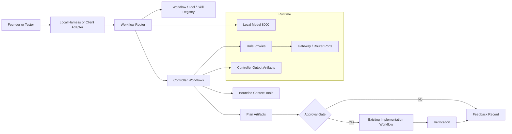
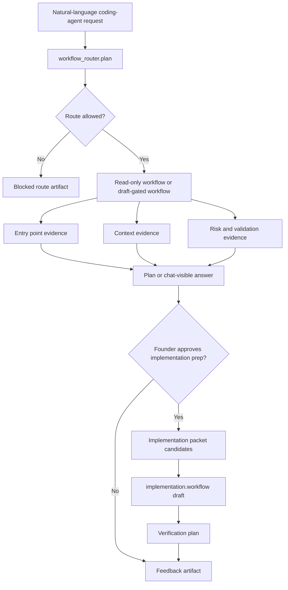

# Actionable Workflow Roadmap

This is the canonical product roadmap.

If this document conflicts with older skill, controller, gateway, or AnythingLLM planning docs, this document wins until those docs are cleaned up.

## Product Destination

The product is not "a folder of skills." The product is a local agent harness that can take a natural-language development request, select the right tools and skills without retraining, create an evidence-backed plan, execute only inside approved boundaries, verify the result, and record feedback.

The product objective also includes large-context usability. The current stable baseline is governed 500k-token project usability through indexing, retrieval, chunking, summarization, artifact paging, evidence selection, and model-context-aware routing. The 384k-token project usability baseline remains preserved as lineage. This is not a promise that the current local model can accept a raw 500k-token prompt. Raw long-context serving remains experimental until a dedicated proof gate validates the model context limit, vLLM configuration, hardware memory, latency, and blind-baseline answer quality.

Final destination:

```text
natural-language request
-> controller-owned workflow router
-> registry lookup for workflows, tools, and skills
-> bounded context gathering
-> plan artifact
-> approval gate
-> existing implementation workflow
-> verification
-> feedback record
```

The harness must route that request without the user injecting `SKILL.md` text, naming every skill, or pasting a controller JSON envelope.

## Approved Product Milestones

The approved milestone gates are maintained in [Project Milestones](PROJECT_MILESTONES.md).

Milestones are durable product-state checkpoints. Roadmap phases should move one or more milestones forward, but a phase is not itself a milestone unless it proves a user-visible product state. The current critical path is:

```text
M1 -> M2 -> M3 -> M4 -> M5 -> M16 -> M6 -> M8 -> M9 -> M12 -> M14
```

M16 is required before durable context-index or retrieval-backed chat closeout because indexing creates persistent derived repository content. M15 promoted governed 500k-token project usability to the stable handoff while preserving the completed 384k baseline as lineage. Large-context usability is achieved through governed indexing, retrieval, chunking, summarization, artifact paging, evidence selection, and model-context-aware routing.

## Persistent Product Priorities

Priority 0 is chat quality development and testing. All other work is secondary unless it directly supports improving or validating chat quality against the current local model, skills, and tools.

For large-context work, Priority 0 is satisfied by useful chat-visible answers over large corpora, not by maximum prompt stuffing. Prefer retrieval-first and evidence-selection designs unless a roadmap-approved raw long-context milestone proves the serving path.

Priority 0 uses blind-baseline-first testing by default. For every chat-quality evaluation, ask a bounded contextless blind agent for the expected answer shape and scoring rubric before showing it any local-model output. Then run the same prompt through the local model via the workflow-router gateway and AnythingLLM when applicable, compare the local answer against the blind baseline, repair the smallest harness gap, and rerun the target prompt plus holdouts. Blind structural audits remain useful for code, roadmap, and artifact review, but they do not replace blind-baseline comparison for chat-answer quality.

The current Priority 0 backlog and execution plan are maintained in [Priority 0 Chat Quality Backlog](PRIORITY0_CHAT_QUALITY_BACKLOG.md). Phases 131 through 156 completed Priority 0 chat-quality release hardening and founder-testing readiness. Phases 157 through 162 are approved for the next founder field-testing and repair batch.

Priority 1 is adding or improving skills and tools that cover gaps found while improving Priority 0.

Priority 2 is maintaining a logical set of future roadmap phases. Raise concerns when proposed or active phases deviate from the original goal: a local agent harness that turns natural-language development requests into evidence-backed, chat-visible, safe, testable work.

Priority 3 is making the local model consistently demonstrate the engineering tenets below. Future phases should move one or more tenets toward contextless-agent auditability.

## Local Model Engineering Tenets

These are the target behaviors for the local model and harness. Each tenet should eventually be auditable by bounded, contextless agents using deterministic artifacts, live localhost tests, and chat-visible output.

1. I can consistently decompose a feature, bug, or requirement into tasks that can be completed, tested, and reviewed independently within a short development cycle.
2. I can identify tasks that remain ambiguous, high-risk, or oversized and further decompose them until implementation scope, acceptance criteria, and dependencies are clear.
3. I can define objective acceptance criteria before implementation begins and use those criteria to determine when work is complete.
4. I can translate business requirements into technical requirements without introducing unnecessary complexity or assumptions.
5. I can estimate development effort using documented assumptions and revise estimates when new information changes scope.
6. I can implement changes incrementally, ensuring that each change produces a functional and testable outcome.
7. I can use version control according to industry standards, including meaningful commits, isolated changesets, and traceable change history.
8. I can review my own code against established coding standards before requesting peer review.
9. I can identify common code quality issues such as duplication, excessive complexity, poor naming, and tight coupling, and remediate them before deployment.
10. I can write and maintain automated tests that validate expected behavior, edge cases, and regression scenarios for the code I develop.
11. I can determine the appropriate testing level, such as unit, integration, end-to-end, or manual validation, for a given change and justify that decision.
12. I can reproduce reported defects reliably, isolate root causes, and verify that implemented fixes resolve the issue without introducing regressions.
13. I can use logs, debugging tools, and observability data to diagnose failures rather than relying on assumptions.
14. I can evaluate whether a solution is simpler, more maintainable, and more testable than available alternatives before implementation.
15. I can identify technical debt created during development and document remediation work separately from feature delivery.
16. I can communicate implementation plans, risks, blockers, and tradeoffs in a manner that allows other engineers to understand and validate my approach.
17. I can participate in code reviews by providing actionable feedback focused on correctness, maintainability, testability, and system impact.
18. I can explain the reasoning behind architectural and implementation decisions using established engineering principles rather than personal preference.
19. I can independently deliver small-to-medium features from requirement intake through deployment while maintaining quality and testing standards.
20. I can mentor less experienced engineers on task decomposition, testing strategy, debugging methodology, code quality practices, and development workflows.

## What We Are Building

Build a controller-owned workflow router.

The router decides:

- whether the request is allowed
- which workflow should handle it
- which skills provide procedural guidance
- which tools may gather context
- whether execution is read-only, implementation-prep, or apply
- what approvals are required before any mutation
- what artifacts prove the result

Skills remain useful, but only as registry entries that the router can load on demand. A skill is not a runtime, a tool, an approval system, or a product interface.

## Non-Negotiable Acceptance Criteria

The product is not usable until all of these are true:

1. A natural-language request can enter the harness without manual skill injection.
2. The controller selects a workflow from a registry and returns a structured route decision.
3. The route decision can execute a read-only investigation against both frozen Coinbase fixtures.
4. Common L1/L2 coding-agent requests start from evidence-backed context and return chat-visible answers.
5. Implementation preparation requires explicit approval and uses the existing `implementation.workflow`; no second edit path is created.
6. Apply behavior is tested only on disposable copies until a separate approval expands scope.
7. Verification commands are produced from evidence, not model guesses.
8. Feedback is captured as a durable artifact linked to the workflow run.
9. Bash-side validation covers localhost model `8000`, controller, gateway/router ports, role ports, AnythingLLM when the adapter phase starts, and both frozen repos.
10. Regression passes after every non-agent code change.

## Current Work Classification

Do not blindly keep or blindly revert everything. Classify the current uncommitted work by product value.

Keep or rebuild if present:

- controller service
- gateway routing and budget enforcement
- role proxy ports
- existing `implementation.workflow`
- frozen repo fixtures and disposable-copy mutation tests
- deterministic read-only workflows such as `code_context.lookup` and `code_investigation.plan`
- existing skills as draft registry fixtures
- live validation scripts that test real runtime paths

Demote:

- prompt-injected skill validation
- pasteable JSON-envelope recipes
- skill-chain success claims that do not start from natural language
- docs that describe partial workflows as product-complete

Pause:

- new skills
- raw CodeGraphContext expansion
- more AnythingLLM examples
- apply-mode expansion
- broad documentation cleanup unrelated to the next phase

## Execution Rule

Always work the lowest-numbered incomplete phase that is approved or automatically approved by milestone mapping.

Phases mapped directly to approved milestones are automatically approved unless the phase entry, founder, or current session explicitly marks them as proposed, not approved, blocked, deferred, or approval-required. Automatic approval does not apply to new milestones, milestone changes, unrelated features, or work that expands a milestone beyond its documented product state, done criteria, and required proof.

Do not move to the next phase because a demo is close. A phase is complete only when all required artifacts and tests pass.

If a phase fails, fix that phase. Do not add another skill, adapter, route, or document to compensate for the failure.

Any scope expansion outside an approved milestone's boundaries requires explicit founder approval and must update this roadmap before implementation.

## Proposal And Tightening Rule

Founder-approved autonomous development should keep the roadmap moving in the same product direction without waiting for a prompt at every boundary.

Use this distinction:

- **New feature or capability:** add it as a proposed roadmap phase with goal, implementation tasks, and acceptance proof.
- **Tightening of the current or immediately previous phase:** implement it immediately in the same phase, then record the proof. Do not create a separate proposal for validator hardening, stale-fixture correction, route-key checks, missing docs links, or other work needed to make the current path reliable.
- **Missed tightening more than one phase away:** raise it in the current summary and recommend adding it to the roadmap before implementation, because changing older shipped behavior may alter scope.

Do not use this rule to bypass safety gates. Runtime-facing changes still require live Bash/AnythingLLM validation when applicable. Non-agent code changes require the verification tier that matches blast radius; full regression remains mandatory at phase close for shared controller/router/formatter behavior, cross-cutting runtime behavior, release-candidate work, or any change whose affected surface cannot be bounded confidently.

## Structured Development Rule

Every non-trivial change must follow a documented development cycle. This is a standing project rule, not a preference for a single session.

Required cycle:

1. Define the problem and the user-visible failure.
2. Gather evidence from code, artifacts, tests, or live runtime behavior.
3. Identify the root cause and write down the rejected explanations when they matter.
4. Define the smallest acceptable design that preserves the single code path rule.
5. Implement the change with focused scope.
6. Verify with the smallest defensible gate for the change class, then broaden only as blast radius requires.
7. Inspect artifacts and protected fixtures for mutation or missing proof.
8. Update documentation and roadmap state so a contextless future agent can continue from the correct next step.

For workflow-router and execution-planning work, do not treat a prompt tweak as a fix unless the cycle above proves it through controller artifacts and live localhost `8000` tests on both frozen Coinbase fixtures.

### Verification Gate Requirements

- Documentation, roadmap, prompt catalog metadata, or agent-instruction-only changes: validate formatting/links or targeted validators as applicable; regression may be skipped.
- Leaf validation scripts, isolated acceptance policies, or narrow tests: run the focused unit/regression tests and validator commands that cover the changed file.
- Workflow-local controller changes: run focused controller/regression tests, live prompt proof when runtime-facing, and full regression once at phase close.
- Shared controller, router, formatter, tool-selection, model-routing, mutation, fixture, or approval behavior: run focused tests first, then full Bash regression before completion.
- Runtime-facing behavior: run focused tests, live Bash validation through the relevant localhost ports, AnythingLLM proof when applicable, both frozen fixture checks, and full Bash regression before completion.
- Cross-cutting, release-candidate, model-portability, skill-library-scale, or unbounded-blast-radius changes: always end with full Bash regression.

Default full Bash regression command:

```bash
python3 -m pytest tests/regression/ -v
```

## L1 Prompt Development Plan

Default regression must not be blocked by non-V1 historical workflow coverage. Implementation-prep continuation, packet-objective, narrowed-edit, and disposable-apply tests stay outside default pytest selection until the roadmap explicitly returns to those stages.

L1 prompts are the first user-facing skill targets because they match common coding-agent requests, have one clear outcome, use a small tool set, and are easy for a tester to judge.

Read-only L1 prompts:

1. `L1-001: Find Where Behavior Starts`
2. `L1-002: Explain A Function Or File`
3. `L1-003: Find Related Tests`
4. `L1-004: Locate Configuration Or Environment Setting`
5. `L1-005: Summarize Test Failure From Pasted Output`
6. `L1-006: Check Whether Behavior Already Exists`
7. `L1-007: Find Callers Or Usages`
8. `L1-008: Produce A Safe Test Command`
9. `L1-012: Locate Endpoint Or Route Handler`
10. `L1-013: Locate Error Or Log Message Source`
11. `L1-014: Summarize A Module Or File`
12. `L1-015: Find Data Model Or Schema`
13. `L1-016: Find Imports Or Dependencies`

Draft-only or approval-gated L1 prompts:

14. `L1-009: Add Or Update A Small Unit Test`
15. `L1-010: Make A Small Text Or Documentation Edit`
16. `L1-011: Fix A Simple Failing Test`

Build order:

1. `L1-001: Find Where Behavior Starts`
2. `L1-003: Find Related Tests`
3. `L1-008: Produce A Safe Test Command`
4. `L1-002: Explain A Function Or File`
5. `L1-006: Check Whether Behavior Already Exists`
6. `L1-007: Find Callers Or Usages`
7. `L1-004: Locate Configuration Or Environment Setting`
8. `L1-005: Summarize Test Failure From Pasted Output`
9. `L1-010: Make A Small Text Or Documentation Edit`
10. `L1-009: Add Or Update A Small Unit Test`
11. `L1-011: Fix A Simple Failing Test`
12. `L1-012: Locate Endpoint Or Route Handler`
13. `L1-013: Locate Error Or Log Message Source`
14. `L1-014: Summarize A Module Or File`
15. `L1-015: Find Data Model Or Schema`
16. `L1-016: Find Imports Or Dependencies`

Next roadmap gate:

```text
Phases 92 through 127 are complete. No later roadmap phase should start until the next Priority 0 backlog item is represented as an approved roadmap phase.
```

Next implementation target:

```text
Prepare the next approved Priority 0 phase from `P0-BB-015` in `docs/PRIORITY0_CHAT_QUALITY_BACKLOG.md`.
Do not resume advanced-refactor work until AnythingLLM answer usefulness and current chat-quality gates remain stable.
```

Reason: Phase 57 made the founder field suite part of V1 acceptance, Phase 58 added the prompt matrix, Phase 59 added semantic answer quality gates, Phase 60 added user-facing refined prompts, Phase 61 produced a validated Batch D skill-scaling proposal without registry mutation, Phase 62 registered Batch D as draft skills through the existing lifecycle, Phase 63 proved and promoted Batch D through live gateway and AnythingLLM validation, Phase 64 added Batch D prompts to the founder field suite with live V1 acceptance proof, Phase 65 added skill-library health and Batch D proof to the V1 acceptance path, Phase 66 proved the harness against a non-Coinbase disposable Python service fixture, Phase 67 made AnythingLLM feedback actionable, Phase 68 split release gates into diagnosable profiles, Phase 69 added a latest-run inspector, Phase 70 made prompt catalogs governed fixtures instead of scattered script literals, Phase 71 proved the browser-rendered AnythingLLM Desktop UI path through `/stream-chat` with screenshots and fixture mutation proof, Phase 72 added a model portability gate that wraps the existing V1 acceptance path, probes the candidate `/v1/models` endpoint, and classifies misses as harness, classifier, prompt, model-quality, or unknown issues, Phase 73 added read-only run artifact diffing for V1 acceptance, founder-field, and model-portability reports, Phase 74 added a manifest-driven fixture manager with protected source snapshots, disposable setup, cleanup, and integration into the existing generalization fixture copy helpers, Phase 75 added a read-only failure taxonomy report so failures across release gates can be classified consistently instead of reinterpreted from raw logs, Phase 76 added a first-time user doctor so setup failures can be detected before testers try AnythingLLM prompts, Phase 77 added governed skill-library packaging policy before scaling toward large skill packs, Phase 78 turned portability evidence into advisory model capability profiles and a routing policy without enabling automatic model selection, Phase 79 added a canonical prompt-to-skill coverage map with a validator and gap backlog, Phase 80 extended the existing `skill.scaffold` path into a dry-run authoring factory with coverage, docs, eval, fail-closed test, and live AnythingLLM proof, Phase 81 added an explicit skill regression tier catalog with offline, controller, gateway, AnythingLLM API, UI, fixture-mutation, and release-candidate proof boundaries, Phase 82 expanded live validation to a synthetic Node CLI fixture plus both frozen Coinbase fixtures, Phase 83 added a disposable-copy mutation sandbox contract, structured diff proof, direct mutation proof artifacts, path guardrails, and rollback-failure tests around the single existing implementation workflow, Phase 84 made approval states visible in chat and stateful in controller run records, Phase 85 added a read-only observability report with route, model, skill, tool, approval, downstream, artifact, mutation, timing, and filter proof from recent live runs, Phase 86 made normal workflow-router chat explain selected workflow, skills, tools, route rules, and registry grounding in both FormatA and JSON output, Phase 87 added versioned release-channel metadata plus setup validation, Phase 88 added a contextless external tester onboarding pack with live AnythingLLM feedback proof inside the release-candidate gate, Phase 89 added the release-candidate security policy gate for secret exposure, filesystem boundaries, protected fixture policy, command fragments, and onboarding prompt safety, Phase 90 consolidated those gates into a passed V1.1 release-candidate profile, Phase 91 promoted stable-channel handoff, Phase 92 converted stable tester and blind-review feedback into fixed current-path issues or explicit Phase 93+ backlog work, Phase 93 added a governed 30-prompt natural-language capability gap backlog with validation gates, Phase 94 added a runtime selector audit contract with stable selected/rejected workflow, skill, and tool proof through Bash gateway, localhost model, controller, both frozen fixtures, and AnythingLLM, Phase 95 added route-owned context-source selection with AST/text/config/test/relationship source audits, unsupported-layout blocking, generated non-Coinbase fixture proof, Bash gateway proof, and AnythingLLM proof, Phase 96 expanded draft-only implementation prep for small text edits and approved-investigation packet prep while preserving `implementation.workflow` as the single implementation path, adding enriched direct/gateway/AnythingLLM proof, fixture digests, verification commands, generic packet seeds, bare README support, and function-definition snippet preference, Phase 97 bound natural packet-design approvals to source run identity, rejected duplicate/denied/wrong-run/target-mismatch/source-apply continuations, added deterministic approval-continuation packet prep, converted workflow-router gateway approval failures into chat-visible OpenAI responses, and proved the path through direct, live Bash gateway, AnythingLLM, both frozen fixtures, all featured ports, and full Bash regression, Phase 98 expanded disposable-copy apply proof for existing-file `append_text`, multi-operation `replace_text` plus `append_text`, source-tree digest guards, chat-visible structured diff summaries, and fail-closed `create_file` refusal through direct, live Bash gateway, AnythingLLM, both frozen fixtures, all featured ports, docs-index proof, and full Bash regression, Phase 99 added four small deterministic Batch E L2 skills with routing proof, evals, prompt coverage, live gateway and AnythingLLM validation on both frozen fixtures, contextless subagent audit hardening, and full Bash regression, Phase 100 converted model capability profiles into an active fail-closed routing gate with chat-visible route evidence, current localhost model proof, task-class enforcement, live gateway and AnythingLLM validation, contextless subagent audit hardening, and full Bash regression, Phase 101 added a Go HTTP service fixture, expanded multi-repo validation across Coinbase, Python service, Node CLI, and Go HTTP layouts, recorded repo-layout limitations, proved gateway plus AnythingLLM paths, kept Coinbase V1.1 acceptance intact, and passed full Bash regression, Phase 102 added versioned dependency-aware task-decomposition work packages, chat-visible FormatA and JSON contracts, advanced-refactor deferral proof, live gateway plus AnythingLLM validation, and full Bash regression, Phase 103 added a productized install/start/validate/reset/rerun command surface over existing setup scripts and proof gates, Phase 104 added read-only eval-driven repair recommendations with contextless verifier hardening and full Bash regression, Phase 105 added a fail-closed advanced-refactor readiness gate with prerequisite evidence validation, pilot-scope limits, live gateway plus AnythingLLM proof, contextless verifier hardening, and full Bash regression, Phase 106 fixed current L1/L2 chat-answer quality regressions with route-aware answer artifact priority, non-git source-ranking repair, committed stable proof retention, deterministic JSON response lifecycle hardening, live gateway plus AnythingLLM proof, contextless verifier hardening, and full Bash regression, Phase 107 made the browser-visible AnythingLLM UI E2E gate semantic with `L1-001` fail-closed wrong-answer markers, `L1-002` holdout proof, screenshots, fixture mutation proof, and full Bash regression, and Phase 108 made generated `runtime-state/` artifacts local-only with a committed proof-retention policy, release-channel hygiene integration, contextless verifier hardening, and full Bash regression.

Phase 109 then added the consolidated release-adherence gate, fixed Bash-hosted UI E2E portability gaps found by the gate, hardened the gate after a bounded contextless audit, proved current localhost model readiness through Bash, AnythingLLM, UI semantic E2E, both frozen fixtures, latency measurement, and full Bash regression, and left the model-profile warning documented as the intentional real-apply boundary rather than an unmeasured latency gap. Phase 110 added a governed semi-well-defined prompt suite, fixed natural read-only mode inference, config/schema/dependency/table lookup generalization gaps, startup fixture allowlisting, and stale skill expectations, then proved 24 natural prompts through gateway and AnythingLLM with live localhost model scoring above the stable thresholds and no fixture mutation. Phase 111 added a closed-loop eval-repair execution gate that converts the Phase 106/107 `L1-001` visible-answer failure into a controlled negative, accepted repair packet, target rerun, `L1-002` holdout rerun, deterministic adjudication, final eval-repair report, and Bash/AnythingLLM/doctor proof with no protected fixture mutation. Phase 112 made the 20 local model engineering tenets measurable with governed coverage, reference validation, docs, and full regression proof. Phase 113 moved Tenets T01-T03 to covered status by adding schema v3 decomposition packages with objective acceptance criteria, oversized-task clarification behavior, deterministic quality and case-catalog gates, live gateway/AnythingLLM proof across Coinbase and non-Coinbase fixtures, bounded recursive audit proof, and full Bash regression. Phase 114 moved Tenets T04-T05 to covered status by adding requirements-translation mode to the existing `task.decompose` path, prompt-derived technical requirements, explicit and rejected assumptions, effort-estimate bands with revision triggers, semantic fail-closed validators, live Bash/AnythingLLM proof across both frozen Coinbase fixtures and the Python service fixture, bounded recursive audit proof, and full Bash regression. Phase 115 moved Tenets T06-T07 to covered status by adding incremental implementation planning to the existing `task.decompose` path, isolated changesets, behavior-specific commit subjects, targeted verification commands, version-control policy, fail-closed validators for vague commit messages and broad pytest commands, live Bash/AnythingLLM proof across both frozen Coinbase fixtures and the Python service fixture, bounded recursive audit proof, and full Bash regression. Phase 116 moved Tenets T08-T09 to covered status by adding blind-baseline code-quality and self-review prompt gates, chat-visible code-quality review artifacts, live gateway/AnythingLLM proof for 10 prompts and 20 responses, contextless verifier proof, and full Bash regression. Phase 117 moved Tenets T10-T13 to covered status by adding a governed defect-diagnosis prompt suite, contextless blind baselines, a unified read-only defect diagnosis answer inside the existing `code_investigation.plan` path, live gateway/AnythingLLM proof across both frozen Coinbase fixtures and the Python service fixture, no-mutation eval proof, contextless verifier proof, and full Bash regression. Phase 118 moved Tenets T14-T18 to covered status by adding governed engineering-judgment prompt cases, contextless blind baselines, a chat-visible `Engineering Judgment:` answer inside the existing `code_investigation.plan` path, live gateway/AnythingLLM proof across both frozen Coinbase fixtures and Python/Go/Node fixtures, no-mutation eval proof, contextless verifier proof, and full Bash regression.

## Foreseeable Approval Queue

This queue is intended for mass approval. A founder can approve one or more listed phases in a single message, and the implementation agent should then work the lowest-numbered approved incomplete phase until the approved queue is exhausted.

Mass approval rules:

- approval covers only the phase scope and acceptance proof written below
- approval does not waive stop conditions, regression requirements, live validation requirements, or protected fixture rules
- any scope expansion that changes a phase by more than 50% must be written into this roadmap and re-approved before implementation
- tightening within the approved scope should be implemented immediately and documented in that phase
- broad advanced refactor orchestration remains outside this approval queue until the roadmap explicitly reintroduces it

Approved phase queue:

1. Phase 43: Skill Update And Versioning Workflow - complete
2. Phase 44: Skill Release Gate And CI Profile - complete
3. Phase 45: Skill Discovery And Selection Explainability - complete
4. Phase 46: Skill Pack Export, Import, And Namespace Governance - complete
5. Phase 47: Skill Authoring Scaffolder And Template Enforcement - complete
6. Phase 48: Skill Eval Mutation And Fault Injection Suite - complete
7. Phase 49: Natural-Language Lifecycle Operations With Approval Continuations - complete
8. Phase 50: Controlled L1/L2 Skill Expansion Batch C - complete
9. Phase 51: Tool Catalog Expansion Governance - complete
10. Phase 52: AnythingLLM Chat UX And Artifact Summarization Hardening - complete
11. Phase 53: Multi-Step Task Decomposition Workflow - complete
12. Phase 54: Controlled Small-Change Apply Workflow - complete
13. Phase 55: V1 Productization, Installer, And Release Candidate Gate - complete
14. Phase 56: V1 Founder Field Test And Reliability Hardening - complete
15. Phase 57: Founder Field Suite Release Gate - complete
16. Phase 58: Prompt Variant And Classifier Conflict Matrix - complete
17. Phase 59: Chat Answer Semantic Quality Gate - complete
18. Phase 60: User-Facing Prompt Refinement - complete
19. Phase 61: Skill Scaling Batch D Based On Field Evidence - complete
20. Phase 62: Batch D Registration Through Existing Lifecycle - complete
21. Phase 63: Batch D Live Suite Coverage - complete
22. Phase 64: Founder Field Suite Expansion With Batch D Prompts - complete
23. Phase 65: Skill Library Release Gate Upgrade - complete
24. Phase 66: Generalization Beyond Coinbase Fixture - complete
25. Phase 67: AnythingLLM User Feedback Loop - complete
26. Phase 68: Release Gate Profiles - complete
27. Phase 69: Latest Run Inspector - complete
28. Phase 70: Prompt Catalog Governance - complete
29. Phase 71: AnythingLLM UI E2E - complete
30. Phase 72: Model Portability Gate - complete
31. Phase 73: Run Artifact Diffing - complete
32. Phase 74: Fixture Manager - complete
33. Phase 75: Failure Taxonomy Dashboard And Report - complete
34. Phase 76: First-Time User Doctor - complete
35. Phase 77: Skill Library Packaging Strategy - complete
36. Phase 78: Model Capability Profiles And Routing Policy - complete
37. Phase 79: Prompt-To-Skill Coverage Map And Gap Backlog - complete
38. Phase 80: Skill Authoring Factory And Eval Scaffolder - complete
39. Phase 81: Skill Regression Tiers - complete
40. Phase 82: Multi-Repo Fixture Expansion - complete
41. Phase 83: Tool Reliability And Sandboxed Mutation Harness - complete
42. Phase 84: Approval And Continuation UX Hardening - complete
43. Phase 85: Skill And Tool Observability Dashboard - complete
44. Phase 86: Natural-Language Skill Discovery And Selection Explanation - complete
45. Phase 87: Versioned Release Channels And Installer - complete
46. Phase 88: External Tester Onboarding Pack - complete
47. Phase 89: Security And Policy Review Gate - complete
48. Phase 90: V1.1 Release Candidate Gate - complete
49. Phase 91: Stable Channel Promotion And External Tester Handoff - complete
50. Phase 92: Founder And External Tester Feedback Triage - complete
51. Phase 93: Natural-Language Capability Gap Backlog - complete
52. Phase 94: Runtime Skill Selection Hardening - complete
53. Phase 95: Context Retrieval Upgrade - complete
54. Phase 96: Implementation-Prep Workflow Expansion - complete
55. Phase 97: Approval UX And Continuation Robustness - complete
56. Phase 98: Disposable Apply Expansion - complete
57. Phase 99: Skill Library Scaling Batch E - complete
58. Phase 100: Model Capability Routing Enforcement - complete
59. Phase 101: Multi-Repository Generalization - complete
60. Phase 102: Multi-Step Execution Planning - complete
61. Phase 103: Productized Installer And Reset Path - complete
62. Phase 104: Eval-Driven Repair Loop - complete
63. Phase 105: Advanced Refactor Readiness Gate - complete

Approved current-model release-readiness phases:

These phases were approved after the post-Phase-105 readiness review found current local-model product gaps that should be closed before any advanced-refactor work resumes.

1. Phase 106: Chat Answer Artifact Priority And L1/L2 Regression Repair - complete
2. Phase 107: AnythingLLM UI Semantic E2E Gate - complete
3. Phase 108: Runtime-State Repository Hygiene And Proof Retention - complete
4. Phase 109: Current Local Model Release-Adherence Gate - complete
5. Phase 110: Semi-Well-Defined Prompt Generalization Suite - complete
6. Phase 111: Closed-Loop Eval Repair Execution Gate - complete

Approved engineering-tenet audit phases:

These phases directly address the local model engineering tenets and should run only after the current chat-quality foundation phases are stable.

1. Phase 112: Engineering Tenet Coverage Matrix - complete
2. Phase 113: Task Decomposition And Acceptance Criteria Tenets - complete
3. Phase 114: Requirements Translation And Estimation Tenets - complete
4. Phase 115: Incremental Implementation And Version-Control Tenets - complete
5. Phase 116: Code Quality And Self-Review Tenets - complete
6. Phase 117: Testing And Defect Diagnosis Tenets - complete
7. Phase 118: Tradeoff, Technical Debt, And Communication Tenets - complete
8. Phase 119: End-To-End Delivery And Mentorship Tenets - complete

Approved Priority 0 governance phases:

1. Phase 120: Baseline Corpus Governance - complete
2. Phase 121: AnythingLLM Answer Usefulness Gate - complete
3. Phase 122: Holdout Prompt Bank - complete
4. Phase 123: Gap Taxonomy Integration - complete
5. Phase 124: Output Format Parity - complete
6. Phase 125: Founder Feedback Loop - complete
7. Phase 126: Corpus-Wide AnythingLLM UI Usefulness - complete
8. Phase 127: Fresh Local-Model Drift Gate - complete
9. Phase 128: Prompt Tightening Recommendation Gate - complete
10. Phase 129: Skill/Tool Coverage Gap Gate - complete
11. Phase 130: Stable Chat Quality Release Gate - complete
12. Phase 131: Stable Release Blocker Closure - complete
13. Phase 132: Stable Release Gate Rerun - complete
14. Phase 133: Founder Testing Handoff Refresh - complete
15. Phase 134: AnythingLLM Founder Smoke Suite - complete
16. Phase 135: Founder Feedback Intake And Classification - complete
17. Phase 136: Chat Quality Release Candidate Snapshot - complete
18. Phase 137: Founder Test Prompt Pack Expansion - complete
19. Phase 138: Chat Transcript Quality Classifier - complete
20. Phase 139: Local Model Regression Watchlist - complete
21. Phase 140: AnythingLLM Session Recovery And Greeting Smoke - complete
22. Phase 141: Gateway And AnythingLLM Port Health Drift Guard - complete
23. Phase 142: Baseline Corpus Promotion Rules - complete
24. Phase 143: Skill/Tool Gap Proposal Intake Gate - complete
25. Phase 144: Natural Output Format Preference E2E - complete
26. Phase 145: Founder Feedback Triage Dashboard - complete
27. Phase 146: Release Notes And Known Limitations - complete
28. Phase 147: External Tester Dry Run - complete
29. Phase 148: Failure-To-Roadmap Proposal Gate - complete
30. Phase 149: Contextless Audit Scorecard - complete
31. Phase 150: Current-Model Compatibility Matrix - complete
32. Phase 151: Skill/Tool Selection Explainability E2E - complete
33. Phase 152: AnythingLLM Conversation State Isolation - complete
34. Phase 153: Stable Release Rollback And Reset Practice - complete
35. Phase 154: Model Swap Smoke Probe - complete
36. Phase 155: V1 Product Readiness Review - complete
37. Phase 156: V1 Stable Release Decision Gate - complete
38. Phase 157: Founder Field Test Round 1 - complete
39. Phase 158: Transcript Quality And Feedback Intake - complete
40. Phase 159: Priority 0 Repair Loop - complete
41. Phase 160: Stable Release Refresh - complete
42. Phase 161: Skill/Tool Gap Batch Proposal - complete
43. Phase 162: Next Founder Handoff Update - complete
44. Phase 163: Post-Restart Runtime Readiness Gate - complete
45. Phase 164: Founder Field Test Round 2 - complete
46. Phase 165: Phase 158 Prompt-Advisory Closure - complete
47. Phase 166: Generic Chat And Vague Prompt Contract - complete
48. Phase 167: AnythingLLM UI Replay Gate - complete
49. Phase 168: Chat Answer Usefulness Tightening - complete
50. Phase 169: Failure-To-Roadmap Proposal Pass - complete
51. Phase 170: Stable Release Refresh And Handoff Update - complete
52. Phase 171: Handler Branch Evidence Repair - complete
53. Phase 172: Minimal Change Surface Boundary Repair - complete
54. Phase 173: Persisted Schema Evidence Repair - Git Fixture - complete
55. Phase 174: Persisted Schema Evidence Repair - Non-Git Fixture - complete
56. Phase 175: Change Boundary Verification Repair - Git Fixture - complete
57. Phase 176: Change Boundary Verification Repair - Non-Git Fixture - complete
58. Phase 177: Post-Repair Stable Proof Refresh - complete
59. Phase 178: Blind-Baseline Delta Report - complete
60. Phase 179: Prompt Corpus Governance V2 - complete
61. Phase 180: Chat Answer Contract Hardening - complete
62. Phase 181: Output Format Selector Stabilization - complete
63. Phase 182: Evidence Relevance Ranking Repair - complete
64. Phase 183: Related-Test Discovery Reliability - complete
65. Phase 184: AnythingLLM UI Replay Expansion - complete
66. Phase 185: Contextless Agent Audit Pack - complete
67. Phase 186: Founder Testing Handoff Refresh - complete
68. Phase 187: Multi-Fixture Prompt Parity Matrix - complete
69. Phase 188: WSL/AnythingLLM Runtime Environment Hardening - complete
70. Phase 189: Evidence Boundary Schema Gate - complete
71. Phase 190: Unsupported Scope Refusal Quality - complete
72. Phase 191: Prompt Family Drift Detection - complete
73. Phase 192: Chat Answer Scoring Automation V2 - complete
74. Phase 193: Skill Registry Readiness Review - complete
75. Phase 194: Skill Authoring Pipeline V2 - complete
76. Phase 195: Release Candidate Founder Trial Pack - complete
77. Phase 196: V1 Product Readiness Reassessment - complete

Second-step approved phases:

1. Phase 68: Release Gate Profiles - complete.
2. Phase 69: Latest Run Inspector - complete.
3. Phase 70: Prompt Catalog Governance - complete.
4. Phase 71: AnythingLLM UI E2E - complete.
5. Phase 72: Model Portability Gate - complete.
6. Phase 73: Run Artifact Diffing - complete.
7. Phase 74: Fixture Manager - complete.
8. Phase 75: Failure Taxonomy Dashboard And Report - complete.
9. Phase 76: First-Time User Doctor - complete.
10. Phase 77: Skill Library Packaging Strategy - complete.

Third-step approved phases:

1. Phase 78: Model Capability Profiles And Routing Policy - complete.
2. Phase 79: Prompt-To-Skill Coverage Map And Gap Backlog - complete.
3. Phase 80: Skill Authoring Factory And Eval Scaffolder - complete.
4. Phase 81: Skill Regression Tiers - complete.
5. Phase 82: Multi-Repo Fixture Expansion - complete.
6. Phase 83: Tool Reliability And Sandboxed Mutation Harness - complete.
7. Phase 84: Approval And Continuation UX Hardening - complete.
8. Phase 85: Skill And Tool Observability Dashboard - complete.
9. Phase 86: Natural-Language Skill Discovery And Selection Explanation - complete.
10. Phase 87: Versioned Release Channels And Installer - complete.
11. Phase 88: External Tester Onboarding Pack - complete.
12. Phase 89: Security And Policy Review Gate - complete.
13. Phase 90: V1.1 Release Candidate Gate - complete.
14. Phase 91: Stable Channel Promotion And External Tester Handoff - complete.

Current L1-001 status:

- Started: the router now has an explicit `l1_find_behavior_start_terms` rule that maps this prompt family to `code_investigation.plan`.
- Started: default regression now excludes deferred post-L1 workflow coverage.
- Passed: focused L1 regression covered plan-only routing, read-only execution, natural chat, AnythingLLM-style streaming, skill selection, and gateway routing.
- Passed: default regression on June 4, 2026 returned `133 passed, 19 deselected`.
- Passed: Bash health checks returned OK for localhost ports `8000`, `8300`, `8500`, and `8400` after restarting the stack.
- Passed: Bash workflow-router gateway L1 prompt test on `/mnt/c/coinbase_testing_repo_frozen_tmp` and `/mnt/c/coinbase_testing_repo_frozen_tmp.github` selected `code_investigation.plan`, completed downstream read-only investigation, recorded `model_router_status=accepted`, and returned `verification_command_count=10`.
- Passed: AnythingLLM workspace API L1 prompt test on both frozen fixtures returned expected markers for `workflow_router.plan completed`, `code_investigation.plan`, `verification_command_count`, and `run_id:`.
- Passed: protected fixture check after live tests found the expected invariant text in both fixtures and `git -C C:\coinbase_testing_repo_frozen_tmp.github status --short` was clean.

Current L1-002 status:

- Started: the router now has an explicit `l1_explain_code_terms` rule that maps file/function explanation prompt families to `code_investigation.plan`.
- Started: `code_investigation.plan` now writes a bounded `code_explanation` plan section and `code-explanation.json` artifact. For selected Python source files under the existing read-only budget, it indexes AST definitions so deep functions are resolved without dumping large source files.
- Passed: focused L1-002 regression covered plan-only routing, read-only execution artifacts, natural chat, and read-only skill selection.
- Passed: default regression on June 4, 2026 returned `145 passed, 19 deselected`.
- Passed: Bash workflow-router gateway L1-002 prompt test on `/mnt/c/coinbase_testing_repo_frozen_tmp` and `/mnt/c/coinbase_testing_repo_frozen_tmp.github` selected `code_investigation.plan`, completed downstream read-only investigation, recorded `model_router_status=accepted`, recorded `l1_explain_code_terms`, and produced `code_explanation.status=ready` for `StealthOrderManager.find_stealth_order_by_placed_order_id`. Run IDs: `workflow-router-20260604T183030456026Z` and `workflow-router-20260604T183045207083Z`.
- Passed: AnythingLLM workspace API L1-002 prompt test on both frozen fixtures returned expected markers for `workflow_router.plan`, `code_investigation.plan`, `downstream_code_explanation`, and `run_id:`. Run IDs: `workflow-router-20260604T183308126528Z` and `workflow-router-20260604T183321666891Z`.
- Passed: protected fixture checks after live tests found no source hash changes for `core/stealth_order_manager.py`, preserved `client_order_id` invariant text in both fixtures, and `git -C C:\coinbase_testing_repo_frozen_tmp.github status --short` was clean.

Current L1-003 status:

- Started: the router now has an explicit `l1_find_related_tests_terms` rule that maps related-test prompt families to `code_investigation.plan`.
- Started: the advisory model-router prompt now includes explicit L1 rules for behavior-start, related-test, and caller/usage routing.
- Passed: focused L1-003 regression covered plan-only routing, read-only execution artifacts, natural chat, and read-only skill selection.
- Passed: default regression on June 4, 2026 returned `137 passed, 19 deselected`.
- Passed: Bash health checks returned OK for localhost ports `8000`, `8300`, `8500`, and `8400` after restarting the stack.
- Passed: Bash workflow-router gateway L1-003 prompt test on `/mnt/c/coinbase_testing_repo_frozen_tmp` and `/mnt/c/coinbase_testing_repo_frozen_tmp.github` selected `code_investigation.plan`, completed downstream read-only investigation, recorded `model_router_status=accepted`, and returned `verification_command_count=10`.
- Passed: AnythingLLM workspace API L1-003 prompt test on both frozen fixtures returned expected markers for `workflow_router.plan completed`, `code_investigation.plan`, `verification_command_count`, and `run_id:`.
- Passed: protected fixture check after live tests found the expected invariant text in both fixtures and `git -C C:\coinbase_testing_repo_frozen_tmp.github status --short` was clean.

Current L1-008 status:

- Started: the router now has an explicit `l1_safe_test_command_terms` rule that maps safe-test-command prompt families to `code_investigation.plan`.
- Started: the advisory model-router prompt now explicitly maps safe-test-command requests to `code_investigation.plan`.
- Passed: focused L1-008 regression covered plan-only routing, read-only execution artifacts, natural chat, and read-only skill selection.
- Passed: default regression on June 4, 2026 returned `141 passed, 19 deselected`.
- Passed: Bash health checks returned OK for localhost ports `8000`, `8300`, `8500`, and `8400` after restarting the stack.
- Passed: Bash workflow-router gateway L1-008 prompt test on `/mnt/c/coinbase_testing_repo_frozen_tmp` and `/mnt/c/coinbase_testing_repo_frozen_tmp.github` selected `code_investigation.plan`, completed downstream read-only investigation, recorded `model_router_status=accepted`, recorded `l1_safe_test_command_terms`, and returned `verification_command_count=10`.
- Passed: AnythingLLM workspace API L1-008 prompt test on both frozen fixtures returned expected markers for `workflow_router.plan completed`, `code_investigation.plan`, `verification_command_count`, and `run_id:`.
- Passed: protected fixture check after live tests found the expected invariant text in both fixtures and `git -C C:\coinbase_testing_repo_frozen_tmp.github status --short` was clean.

Current L1-006 status:

- Started: the router now has an explicit `l1_behavior_exists_terms` rule that maps behavior-existence prompt families to `code_investigation.plan`.
- Started: `code_investigation.plan` now writes a bounded `behavior_existence` plan section and `behavior-existence.json` artifact with conservative `exists`, `unknown`, and evidence-gap handling. It does not claim absence from shallow bounded searches.
- Passed: focused L1-006 regression covered plan-only routing, read-only execution artifacts, natural chat, and read-only skill selection.
- Passed: default regression on June 4, 2026 returned `149 passed, 19 deselected`.
- Passed: Bash workflow-router gateway L1-006 prompt test on `/mnt/c/coinbase_testing_repo_frozen_tmp` and `/mnt/c/coinbase_testing_repo_frozen_tmp.github` selected `code_investigation.plan`, completed downstream read-only investigation, recorded `model_router_status=accepted`, recorded `l1_behavior_exists_terms`, and produced `behavior_existence.status=exists` with `answer=yes`. Run IDs: `workflow-router-20260604T184139230859Z` and `workflow-router-20260604T184154793541Z`.
- Passed: AnythingLLM workspace API L1-006 prompt test on both frozen fixtures returned expected markers for `workflow_router.plan`, `code_investigation.plan`, `downstream_behavior_existence`, and `run_id:`. Run IDs: `workflow-router-20260604T184226422138Z` and `workflow-router-20260604T184236930822Z`.
- Passed: protected fixture checks after live tests found no source hash changes for `core/stealth_order_manager.py`, preserved `client_order_id` invariant text in both fixtures, and `git -C C:\coinbase_testing_repo_frozen_tmp.github status --short` was clean.

Current L1-007 status:

- Started: the router now has an explicit `l1_callers_usages_terms` rule that maps caller/usage prompt families to `code_context.lookup`.
- Started: `workflow_router.plan` now synthesizes curated `relationship_queries` for natural caller/usage prompts instead of exposing raw graph operations.
- Started: `code_context.lookup` now writes a bounded `usage_summary` lookup section and `usage-summary.json` artifact that groups callers/usages by file with short explanations and source refs.
- Passed: focused L1-007 regression covered plan-only routing, read-only execution artifacts, natural chat, and read-only skill selection.
- Passed: default regression on June 4, 2026 returned `153 passed, 19 deselected`.
- Passed: Bash workflow-router gateway L1-007 prompt test on `/mnt/c/coinbase_testing_repo_frozen_tmp` and `/mnt/c/coinbase_testing_repo_frozen_tmp.github` selected `code_context.lookup`, completed downstream read-only lookup, recorded `model_router_status=accepted`, recorded `l1_callers_usages_terms`, and produced `usage_summary.status=ready` with `usage_count=28`. Run IDs: `workflow-router-20260604T184944089266Z` and `workflow-router-20260604T185023510942Z`.
- Passed: AnythingLLM workspace API L1-007 prompt test on both frozen fixtures returned expected markers for `workflow_router.plan`, `code_context.lookup`, `downstream_usage_summary`, and `run_id:`. Run IDs: `workflow-router-20260604T185121273194Z` and `workflow-router-20260604T185218113164Z`.
- Passed: protected fixture checks after live tests found no source hash changes for `core/stealth_order_manager.py`, preserved `client_order_id` invariant text in both fixtures, and `git -C C:\coinbase_testing_repo_frozen_tmp.github status --short` was clean.

Current L1-004 status:

- Started: the router now has an explicit `l1_configuration_lookup_terms` rule that maps config/env-setting prompt families to `code_investigation.plan`.
- Started: `code_investigation.plan` now writes a bounded `configuration_lookup` plan section and `configuration-lookup.json` artifact that classifies exact matches as environment reads, definitions, derived definitions, or usages.
- Passed: focused L1-004 regression covered plan-only routing, read-only execution artifacts, natural chat, and read-only skill selection.
- Passed: default regression on June 4, 2026 returned `157 passed, 19 deselected`.
- Passed: Bash workflow-router gateway L1-004 prompt test on `/mnt/c/coinbase_testing_repo_frozen_tmp` and `/mnt/c/coinbase_testing_repo_frozen_tmp.github` selected `code_investigation.plan`, completed downstream read-only investigation, recorded `model_router_status=accepted`, recorded `l1_configuration_lookup_terms`, and produced `configuration_lookup.status=ready` for `COINBASE_API_KEY`. Run IDs: `workflow-router-20260604T185858872777Z` and `workflow-router-20260604T185929043953Z`.
- Passed: AnythingLLM workspace API L1-004 prompt test on both frozen fixtures returned expected markers for `workflow_router.plan`, `code_investigation.plan`, `downstream_configuration_lookup`, and `run_id:`. Run IDs: `workflow-router-20260604T190055599664Z` and `workflow-router-20260604T190204086134Z`.
- Passed: protected fixture checks after live tests found no source hash changes for `configuration.py`, preserved `client_order_id` invariant text in both fixtures, and `git -C C:\coinbase_testing_repo_frozen_tmp.github status --short` was clean.

Current L1-005 status:

- Started: the router now has an explicit `l1_test_failure_summary_terms` rule that maps pasted test-failure summary prompts to `code_investigation.plan`.
- Started: `code_investigation.plan` now writes a bounded `test_failure_summary` artifact that parses failed test node IDs, primary error type/message, likely cause, next read-only inspection steps, source refs, and gaps.
- Passed: focused L1-005 regression covered plan-only routing, read-only execution artifacts, natural chat, and read-only skill selection.
- Passed: default regression on June 4, 2026 returned `161 passed, 19 deselected`.
- Passed: Bash workflow-router gateway L1-005 prompt test on `/mnt/c/coinbase_testing_repo_frozen_tmp` and `/mnt/c/coinbase_testing_repo_frozen_tmp.github` selected `code_investigation.plan`, completed downstream read-only investigation, recorded `model_router_status=accepted`, recorded `l1_test_failure_summary_terms`, and produced `test_failure_summary.status=ready` with `primary_error.type=AssertionError`. Run IDs: `workflow-router-20260604T191557422048Z` and `workflow-router-20260604T191618377887Z`.
- Passed: AnythingLLM workspace API L1-005 prompt test on both frozen fixtures returned expected markers for `workflow_router.plan`, `code_investigation.plan`, `downstream_test_failure_summary`, and `run_id:`. Run IDs: `workflow-router-20260604T191806038772Z` and `workflow-router-20260604T191827992708Z`.
- Passed: protected fixture checks after live tests found no source hash changes for `core/stealth_order_manager.py`, `tests/unit/test_order_id_and_followup_rules.py`, or `docs/agents/INVARIANTS.md`.
- Noted: Bash Git reports pre-existing diff noise for `/mnt/c/coinbase_testing_repo_frozen_tmp.github`; the L1-005 validation recorded no new Bash diff delta (`1 -> 1`), clean cached diff (`0 -> 0`), unchanged watched hashes, and Windows Git content diff exit `0`.

Current L1-010 status:

- Started: the router now has an explicit `l1_small_text_edit_terms` rule that maps draft-only small documentation/text edit prompts to `execution_planning.plan`.
- Started: natural small-text edit requests are converted into approved-for-packet-design `execution_planning.plan` payloads only when the prompt includes draft-only or do-not-mutate intent.
- Started: `workflow_router.plan` now writes `small-text-edit-proposal.json` with the parsed target file, anchor text, inserted text, exact `replace_text` packet operation, safety checks, blockers, and verification commands.
- Started: `execution_planning.plan` has a deterministic L1 small-text edit path for exact draft packet generation. It still calls the existing `implementation.workflow` draft path and does not create a second edit implementation path.
- Passed: focused L1-010 regression covered small-text edit natural chat, approval blocking when draft-only intent is absent, route selection, and skill selection.
- Passed: full default regression on June 4, 2026 returned `165 passed, 19 deselected`.
- Passed: Bash workflow-router gateway L1-010 prompt test on `/mnt/c/coinbase_testing_repo_frozen_tmp` and `/mnt/c/coinbase_testing_repo_frozen_tmp.github` selected `execution_planning.plan`, completed downstream draft packet generation, recorded `model_router_status=accepted`, produced `small_text_edit_proposal.status=ready`, and used deterministic downstream path `l1_small_text_edit`. Run IDs: `workflow-router-20260604T194214608798Z` and `workflow-router-20260604T194217411342Z`.
- Passed: AnythingLLM workspace API L1-010 prompt test on both frozen fixtures returned expected markers for `workflow_router.plan`, `execution_planning.plan`, `small_text_edit_proposal`, `downstream_implementation_workflow_report`, and `run_id:`. Run IDs: `workflow-router-20260604T194843281104Z` and `workflow-router-20260604T194848004587Z`.
- Passed: L1-010 artifact proof verified exactly one operation: `replace_text` on `docs/agents/INVARIANTS.md`, replacing `- Use one code path per behavior.` with that line plus `- L1-010 draft proof: route small documentation edits through packet dry-run.`.
- Passed: downstream execution-planning artifacts included `packet-preview.json`, `implementation-packet-candidates.json`, `implementation-workflow-report.json`, and `run-state.json`; the nested implementation report recorded draft-mode changed artifacts with `target_modified=false`.
- Passed: protected fixture checks after live tests found no source hash changes for `docs/agents/INVARIANTS.md`, `core/stealth_order_manager.py`, or `tests/unit/test_order_id_and_followup_rules.py`; the Git-enabled fixture's Bash git state was unchanged before and after the AnythingLLM test.

Current L1-009 status:

- Started: the router now has an explicit `l1_small_unit_test_terms` rule that maps small unit-test add/update prompts to `execution_planning.plan`.
- Started: natural small-unit-test requests become approved-for-packet-design `execution_planning.plan` payloads only when the prompt includes draft-only or do-not-mutate intent; non-draft prompts stop at `request_approval`.
- Started: `workflow_router.plan` now writes `small-unit-test-proposal.json` with selected test file evidence, exact `append_text` packet operation, safety checks, blockers, and verification command.
- Started: the deterministic L1 draft packet path in `execution_planning.plan` is now shared by L1-009 and L1-010, and both continue through the existing `implementation.workflow` draft path.
- Passed: focused L1-009 regression covered natural draft packet generation, approval blocking when draft-only intent is absent, plan-only route selection, and skill selection.
- Passed: L1-010 focused regression still passed after the shared deterministic draft packet path change.
- Passed: full default regression on June 4, 2026 returned `169 passed, 19 deselected`.
- Passed: Bash health checks returned OK for localhost ports `8000`, `8300`, `8500`, `8400`, and role ports `8101`, `8102`, `8201`, `8202`, `8203`, `8204`, and `8205` after restarting the stack.
- Passed: Bash workflow-router gateway L1-009 prompt test on `/mnt/c/coinbase_testing_repo_frozen_tmp` and `/mnt/c/coinbase_testing_repo_frozen_tmp.github` selected `execution_planning.plan`, completed downstream draft packet generation, recorded `model_router_status=accepted`, produced `small_unit_test_proposal.status=ready`, and used deterministic downstream path `l1_small_unit_test`. Run IDs: `workflow-router-20260604T200028116366Z` and `workflow-router-20260604T200046366641Z`.
- Passed: AnythingLLM workspace API L1-009 prompt test on both frozen fixtures returned expected markers for `workflow_router.plan`, `execution_planning.plan`, `small_unit_test_proposal`, `downstream_implementation_workflow_report`, and `run_id:`. Run IDs: `workflow-router-20260604T200205886449Z` and `workflow-router-20260604T200241397776Z`.
- Passed: L1-009 artifact proof verified exactly one operation: `append_text` on `tests/unit/test_order_id_and_followup_rules.py`, adding `test_sync_exchange_order_id_sets_missing_audit_id_and_anchor_state`.
- Passed: downstream execution-planning artifacts included `packet-preview.json`, `implementation-packet-candidates.json`, `implementation-workflow-report.json`, and `run-state.json`; the nested implementation report recorded draft-mode changed artifacts with `target_modified=false`.
- Passed: protected fixture checks after live tests found no source hash changes for `tests/unit/test_order_id_and_followup_rules.py`, `core/stealth_order_manager.py`, or `docs/agents/INVARIANTS.md`; the Git-enabled fixture's Bash git state was unchanged before and after the AnythingLLM test.
- Boundary: the deterministic L1-009 auto-draft currently supports the missing `exchange_order_id` sync case when it can select an existing related pytest file. Other small unit-test prompts should block with `request_exact_unit_test_details` rather than inventing test code.

Current L1-011 status:

- Started: the router now has an explicit `l1_simple_failing_test_fix_terms` rule that maps draft-only simple failing-test fix prompts to `execution_planning.plan`.
- Started: natural simple failing-test fix requests become approved-for-packet-design `execution_planning.plan` payloads only when the prompt includes draft-only or do-not-mutate intent; non-draft prompts stop at `request_approval`.
- Started: `workflow_router.plan` now writes `simple-test-fix-proposal.json` with the failed test node, exact `replace_text` packet operation, safety checks, blockers, and verification command.
- Started: the shared deterministic L1 draft packet path in `execution_planning.plan` now supports L1-009, L1-010, and L1-011, and all three continue through the existing `implementation.workflow` draft path.
- Corrected during live testing: the first L1-011 gateway run blocked on the real Coinbase fixture because `core/stealth_order_manager.py` is about `244 KB`, above the old simple-fix guard. The simple-fix limit is now a bounded `512 KB`, and regression covers a source file larger than the old guard.
- Corrected during live testing: simple failing-test fix proposal generation now runs before small unit-test proposal generation, and the simple-fix extractor is gated by the same L1-011 classifier so `add a small unit test` prompts do not get misrouted.
- Passed: focused L1-011 and adjacent L1-009 regression returned `6 passed`.
- Passed: full default regression on June 4, 2026 returned `173 passed, 19 deselected`.
- Passed: Bash health checks returned OK for localhost ports `8000`, `8300`, `8500`, `8400`, and role ports `8101`, `8102`, `8201`, `8202`, `8203`, `8204`, and `8205` after restarting the stack. Transient parallel WSL client timeouts were retried individually and returned `200`.
- Passed: Bash workflow-router gateway L1-011 prompt test on `/mnt/c/coinbase_testing_repo_frozen_tmp` and `/mnt/c/coinbase_testing_repo_frozen_tmp.github` selected `execution_planning.plan`, completed downstream draft packet generation, recorded `model_router_status=accepted`, produced `simple_test_fix_proposal.status=ready`, and used deterministic downstream path `l1_simple_failing_test_fix`. Run IDs: `workflow-router-20260604T202320002489Z` -> `execution-planning-20260604T202355181472Z`; `workflow-router-20260604T202402316679Z` -> `execution-planning-20260604T202437815740Z`.
- Passed: AnythingLLM workspace API L1-011 prompt test on both frozen fixtures confirmed `GenericOpenAiBasePath=http://127.0.0.1:8500/v1`, returned expected markers for `workflow_router.plan`, `execution_planning.plan`, `simple_test_fix_proposal`, `downstream_implementation_workflow_report`, and `run_id:`, and produced completed downstream draft runs. Run IDs: `workflow-router-20260604T202611573765Z` -> `execution-planning-20260604T202655641070Z`; `workflow-router-20260604T202703856980Z` -> `execution-planning-20260604T202747221163Z`.
- Passed: L1-011 artifact proof verified exactly one operation: `replace_text` on `core/stealth_order_manager.py`, replacing `placed_order_id: The order ID placed on the exchange` with `placed_order_id: The client_order_id placed on the exchange`.
- Passed: downstream execution-planning artifacts included `packet-preview.json`, `implementation-packet-candidates.json`, `implementation-workflow-report.json`, and `run-state.json`; the nested implementation report recorded draft-mode changed artifacts with `target_modified=false`.
- Passed: protected fixture checks after live tests found no source hash changes for `core/stealth_order_manager.py`, `tests/unit/test_order_id_and_followup_rules.py`, or `docs/agents/INVARIANTS.md`; the Git-enabled fixture's Bash git state was unchanged before and after the AnythingLLM test.
- Boundary: the deterministic L1-011 auto-draft currently supports the `find_stealth_order_by_placed_order_id` docstring assertion that expects `client_order_id`. Other simple failing-test prompts should block with `request_exact_simple_test_fix_details` rather than inventing fixes.
- L1 completion: L1-001 through L1-016 now have full regression, Bash gateway, localhost model path, both frozen Coinbase fixtures, and AnythingLLM proof. L1-009 through L1-011 remain draft-only/approval-gated; the others are read-only.

Required proof for each L1 prompt:

- natural-language AnythingLLM request through the gateway/router path
- localhost `8000` model path included when model routing or skill use is part of the workflow
- both frozen Coinbase fixtures tested from Bash
- route decision names the selected workflow and selected skills/tools
- artifacts contain bounded evidence and explicit uncertainty
- protected fixture files are unchanged for read-only prompts
- default regression passes with non-V1 workflow tests excluded

## 10,000 Foot Architecture



## 1,000 Foot V1 Request Flow



## Phase 0: Stop The Drift

Goal: make this roadmap the project control surface.

Tasks:

1. Treat this document as the source of truth.
2. Add a short note to older skill-first docs that they are support references, not the product roadmap.
3. Do not create another skill or example until Phase 1 passes.
4. Decide whether current uncommitted code is kept, partially reverted, or rebuilt from a clean base by comparing it against the "Current Work Classification" section.

Exit criteria:

- `docs/README.md` points to this file as the canonical product roadmap.
- older skill-first docs no longer imply that validated skills equal a usable product.
- the first implementation target was unambiguous: Phase 1.

## Phase 1: Workflow Router Plan-Only MVP

Status: Complete.

Goal: prove natural-language routing without executing repository work.

Implement one controller-owned workflow:

```text
workflow_router.plan
```

Required direct endpoint:

```text
POST /v1/controller/workflow-router/plans
```

Input contract:

```json
{
  "target_root": "repo path",
  "user_request": "natural language request",
  "mode": "plan_only",
  "budgets": {
    "max_model_calls": 3,
    "max_selected_skills": 5,
    "max_selected_tools": 5
  }
}
```

Output contract:

```json
{
  "workflow": "workflow_router.plan",
  "status": "ready|blocked|unsupported",
  "selected_workflow": "code_context.lookup|code_investigation.plan|refactor.single_path|execution_planning.plan|workflow_feedback.record|null",
  "confidence": "low|medium|high",
  "selected_skills": [],
  "selected_tools": [],
  "approval_required_before": [],
  "controller_request_preview": {},
  "evidence": [],
  "blockers": [],
  "next_action": "execute_read_only|request_approval|ask_blocking_question|none"
}
```

Rules:

- The router may use the local model, but the controller validates the output.
- The router reads only registry metadata before selecting a workflow.
- The tester must not paste skill text.
- The tester must not provide a controller envelope.
- No repository context gathering happens in this phase.
- No mutation is possible in this phase.

Required tests:

- direct controller route with clear, ambiguous, unsafe, and unsupported requests
- localhost model `8000` used by the router when model selection is required
- both frozen repo paths accepted as target roots but not read
- invalid target roots rejected
- selected workflow is stable for representative clear development requests
- regression passes

Phase 1 is complete. The controller endpoint accepts natural-language `user_request` text, returns a validated route decision, writes route artifacts, blocks ambiguous and approval-bypass requests, uses no target-repository tools, and records advisory model-router evidence when `role_base_url` is provided.

Validation proof:

- focused controller regression: `50 passed`
- full regression: `126 passed`
- Bash live validator passed against `/mnt/c/coinbase_testing_repo_frozen_tmp` and `/mnt/c/coinbase_testing_repo_frozen_tmp.github`
- Bash live validator required `model_router_status: accepted` through `http://127.0.0.1:8300/v1`
- Bash runtime surface check passed for `8000`, `8300`, `8400`, and role ports `8101`, `8102`, `8201`, `8202`, `8203`, `8204`, and `8205`
- direct gateway explicit-envelope route passed for `workflow_router.plan`
- AnythingLLM workspace explicit-envelope route passed for `workflow_router.plan`

## Phase 2: Read-Only Execution

Status: Complete.

Goal: let the router execute only read-only workflows after it has produced a valid route.

Supported mode:

```text
execute_read_only
```

Allowed workflows:

- `code_context.lookup`
- `code_investigation.plan`
- `refactor.single_path` in `investigation_only` mode

Rules:

- read-only execution must be controller-owned
- target roots must be allowlisted
- context tools must be selected from policy
- raw CodeGraphContext, raw Cypher, watcher/indexer control, and broad model-visible repository tools remain blocked
- every output claim must link to evidence or explicit uncertainty

Required tests:

- direct controller read-only execution against both frozen repos
- selected frozen file hashes unchanged
- Bash validation covers model `8000`, controller, gateway/router path, and role ports used by the workflow
- ambiguous requests stop before context gathering
- unsafe requests never become implementation prep
- regression passes

Phase 2 is complete. `workflow_router.plan` accepts `mode: "execute_read_only"` and delegates validated read-only routes to `code_context.lookup`, `code_investigation.plan`, or `refactor.single_path` in `investigation_only` mode. It records downstream run IDs, artifacts, and downstream tool-policy audit data under the router run.

Validation proof:

- focused controller regression: `52 passed`
- full regression: `128 passed`
- Bash live validator passed against `/mnt/c/coinbase_testing_repo_frozen_tmp` and `/mnt/c/coinbase_testing_repo_frozen_tmp.github`
- Bash live validator required model-router acceptance through `http://127.0.0.1:8300/v1`
- read-only execution preserved selected frozen fixture file hashes
- Bash runtime surface check passed for `8000`, `8300`, `8400`, and role ports `8101`, `8102`, `8201`, `8202`, `8203`, `8204`, and `8205`
- direct gateway explicit-envelope route passed for read-only `workflow_router.plan`
- AnythingLLM workspace explicit-envelope route passed for read-only `workflow_router.plan`

## Phase 3: Implementation Preparation

Status: Complete.

Goal: convert an approved investigation into implementation packet candidates and verification plans.

Supported mode:

```text
implementation_prep
```

Allowed downstream workflow:

```text
execution_planning.plan
```

Rules:

- implementation preparation requires explicit approval
- `apply_allowed` must remain false
- packet candidates must include exact files, operations, acceptance criteria, and verification commands
- packet preview must be checked through `implementation.workflow` in `draft` mode only
- the router must not invent target files when investigation evidence is missing

Required tests:

- approved implementation-prep dry run against both frozen repos
- missing approval blocks packet creation
- model-produced packet preview is accepted by `implementation.workflow` in draft mode
- selected frozen file hashes unchanged
- regression passes

Phase 3 is complete. `workflow_router.plan` accepts `mode: "implementation_prep"` with explicit packet-design approval and exact `packet_operations`, then delegates to `execution_planning.plan` in `dry_run` mode. Missing approval, apply-mode approval, and missing packet operations are blocked before packet creation.

Validation proof:

- focused controller regression: `54 passed`
- full regression: `130 passed`
- Bash live validator passed against `/mnt/c/coinbase_testing_repo_frozen_tmp` and `/mnt/c/coinbase_testing_repo_frozen_tmp.github`
- Bash live validator required model-router acceptance through `http://127.0.0.1:8300/v1`
- implementation prep delegated to `execution_planning.plan` dry-run and `implementation.workflow` draft checks
- selected frozen fixture file hashes stayed unchanged
- Bash runtime surface check passed for `8000`, `8300`, `8400`, and role ports `8101`, `8102`, `8201`, `8202`, `8203`, `8204`, and `8205`
- direct gateway explicit-envelope route passed for implementation-prep `workflow_router.plan`
- AnythingLLM workspace explicit-envelope route passed for implementation-prep `workflow_router.plan`

## Phase 4: Disposable-Copy Apply And Mutation Proof

Status: Complete.

Goal: prove the implementation path can apply approved packets without risking protected fixtures.

Rules:

- apply mode runs only on disposable copies
- source frozen fixtures must remain unchanged
- all apply behavior goes through the existing `implementation.workflow`
- failures preserve run state and verification evidence

Required tests:

- create disposable copies of both frozen repos
- apply an approved packet to each copy
- prove the copy changed
- prove the source fixture did not change
- run relevant verification commands
- run mutation tests
- regression passes

Phase 4 is complete. `workflow_router.plan` accepts `mode: "apply_disposable_copy"` with disposable-only approval and exact `packet_operations`, copies the target repo into the router run, invokes the existing `implementation.workflow` in `apply` mode against the copy, and records source/copy hash proof. Source fixture mutation raises a controller error.

Validation proof:

- focused controller regression: `56 passed`
- full regression: `132 passed`
- Bash live validator passed against `/mnt/c/coinbase_testing_repo_frozen_tmp` and `/mnt/c/coinbase_testing_repo_frozen_tmp.github`
- Bash live validator required model-router acceptance through `http://127.0.0.1:8300/v1`
- Bash live validator included read-only execution, implementation prep, and disposable-copy apply in `14` live cases
- disposable-copy apply proved `source_changed=false` and `disposable_copy_changed=true`
- Bash runtime surface check returned HTTP `200` for `8000`, `8300`, `8400`, and role ports `8101`, `8102`, `8201`, `8202`, `8203`, `8204`, and `8205`
- direct gateway explicit-envelope route passed for workflow-router disposable-copy apply on both frozen fixtures
- AnythingLLM workspace explicit-envelope route passed for workflow-router disposable-copy apply on both frozen fixtures

## Phase 5: Natural-Language Client Adapters

Status: Complete.

Goal: make the workflow router usable from normal founder/tester clients.

Preferred design:

- keep the normal model gateway for ordinary chat
- add a controller-mode OpenAI-compatible router endpoint or router port for workflow workspaces
- route all messages sent to that controller-mode endpoint through `workflow_router.plan`
- do not silently reinterpret ordinary chat on the normal model gateway

Minimum adapters:

- Bash CLI/API script
- gateway/router OpenAI-compatible path
- AnythingLLM workspace path

Rules:

- the user must not paste controller JSON
- the user must not inject skill text
- normal model chat must still work on the normal gateway
- workflow client responses must include route status, run ID, artifact paths, approval state, and feedback prompt

Required tests:

- Bash natural-language request through controller-mode route
- AnythingLLM natural-language request through controller-mode route
- both frozen repos
- localhost model `8000`
- gateway/router ports
- controller service
- role ports
- stale chat history does not trigger the wrong workflow
- regression passes

Phase 5 is complete. The stack now starts a dedicated OpenAI-compatible workflow-router gateway at `http://127.0.0.1:8500/v1`. That port forwards normal chat-completion payloads to `/v1/controller/workflow-router/chat/completions`, where the controller extracts the latest user message, requires an allowlisted target path, infers the safe router mode, and delegates to the existing `workflow_router.plan` implementation. The normal `8300` gateway remains the ordinary model/explicit-envelope path.

Validation proof:

- focused natural-client regression: `4 passed`
- full regression: `136 passed`
- Bash natural workflow-router gateway validation passed for `/mnt/c/coinbase_testing_repo_frozen_tmp`
- Bash natural workflow-router gateway validation passed for `/mnt/c/coinbase_testing_repo_frozen_tmp.github`
- AnythingLLM was configured to `http://127.0.0.1:8500/v1` through its local `/api/system/update-env` endpoint
- AnythingLLM natural workflow-router route passed for `/mnt/c/coinbase_testing_repo_frozen_tmp` with run ID `workflow-router-20260604T075731753596Z`
- AnythingLLM natural workflow-router route passed for `/mnt/c/coinbase_testing_repo_frozen_tmp.github` with run ID `workflow-router-20260604T075742605162Z`
- Bash runtime surface check returned HTTP `200` for `8000`, `8300`, `8500`, `8400`, and role ports `8101`, `8102`, `8201`, `8202`, `8203`, `8204`, and `8205`
- direct workflow-router live matrix still passed all `14` Phase 1 through Phase 4 cases after the natural-client adapter changes

## Phase 6: Skill Library Scale

Status: Complete.

Goal: prepare for hundreds or thousands of skills only after the router product works.

Implement:

- canonical skill registry
- Agent Skills-compatible validation
- metadata for version, owner, compatibility, safety level, allowed tools, and eval status
- top-k skill retrieval from metadata before loading full skill bodies
- eval fixtures per skill
- failure records that justify creating or editing a skill

Rules:

- do not expose an open arbitrary skill catalog to end users
- do not add a skill unless a failing router/workflow eval proves missing procedural knowledge
- do not load full skill bodies until metadata selection chooses them
- high-impact skills require approval gates and policy checks

Required tests:

- registry validates all skill metadata
- malformed skills are rejected
- skill selection is stable across repeated local-model runs
- a known irrelevant skill is not loaded
- regression passes

Phase 6 is complete. Skills are now represented by canonical metadata in `runtime/skills.json`, eval fixtures in `runtime/skill_evals.json`, and a controller-side registry loader that validates metadata before any workflow can select a skill. The workflow router selects skills from registry metadata instead of scanning or injecting full skill bodies.

Validation proof:

- skill registry regression: `4 passed`
- full regression: `140 passed`
- natural workflow-router validator requires `verification_command_count >= 1` for representative development requests
- Bash natural workflow-router gateway validation passed for `/mnt/c/coinbase_testing_repo_frozen_tmp` with run ID `workflow-router-20260604T084844163728Z`
- Bash natural workflow-router gateway validation passed for `/mnt/c/coinbase_testing_repo_frozen_tmp.github` with run ID `workflow-router-20260604T084855857870Z`
- AnythingLLM natural workflow-router route passed for `/mnt/c/coinbase_testing_repo_frozen_tmp` with run ID `workflow-router-20260604T084905636012Z`
- AnythingLLM natural workflow-router route passed for `/mnt/c/coinbase_testing_repo_frozen_tmp.github` with run ID `workflow-router-20260604T084916948586Z`
- historical route artifact for `workflow-router-20260604T084916948586Z` included `verification_command_count=10` with evidence-backed `python -m pytest <test-file>` commands
- direct workflow-router live matrix passed all `14` Phase 1 through Phase 4 cases after the shared verification helper change
- direct `8300` gateway explicit-envelope disposable-copy apply passed on both frozen fixtures after the shared verification helper change
- Bash runtime surface check returned HTTP `200` for `8000`, `8300`, `8500`, `8400`, and role ports `8101`, `8102`, `8201`, `8202`, `8203`, `8204`, and `8205`

## Phase 7: Packet-Objective Clarification And Generation

Status: Complete.

Goal: continue naturally after `request_packet_objective` so a founder/tester can provide a specific packet objective in AnythingLLM and receive either validated exact packet operations or a precise clarification blocker.

Trigger:

```text
For run workflow-router-..., packet objective: make <path or behavior> authoritative. Draft only.
```

Input contract:

```json
{
  "source_run_id": "workflow-router run that returned request_packet_objective",
  "packet_objective": "specific desired behavior and authoritative path",
  "apply_allowed": false,
  "target_root": "recovered from prior run",
  "approved_investigation_run_id": "recovered from prior continuation context"
}
```

Output contract:

```json
{
  "next_action": "none|request_packet_objective",
  "packet_objective": {
    "status": "accepted|needs_clarification",
    "source_run_id": "workflow-router-...",
    "objective": "bounded objective text"
  },
  "packet_operation_proposal": {
    "status": "ready|blocked",
    "packet_operation_count": 0
  },
  "downstream_workflow": "execution_planning.plan|null"
}
```

Rules:

- do not create a second edit path
- do not apply edits to source repositories
- recover target root and approved investigation context from stored run artifacts
- include the packet objective in the model proposal prompt
- accept only schema-valid operations whose `old` text matches exactly once in source
- if exact operations cannot be validated, return `request_packet_objective` with specific questions
- exact packet operations supplied directly by the user still take precedence

Required tests:

- natural packet-objective follow-up recovers the prior target root
- natural packet-objective follow-up recovers the approved investigation run ID
- generated operations from the packet objective feed `execution_planning.plan` dry run
- invalid generated operations block with `request_packet_objective`
- selected frozen source hashes remain unchanged
- Bash live validation covers localhost `8000`, gateway/router ports, controller, role ports, AnythingLLM, `/mnt/c/coinbase_testing_repo_frozen_tmp`, and `/mnt/c/coinbase_testing_repo_frozen_tmp.github`
- regression passes

Exit criteria:

- From AnythingLLM, the founder/tester can run:
  1. natural investigation request
  2. approval continuation with no exact operations
  3. packet-objective follow-up
  4. validated implementation-prep dry run or specific clarification blocker
- All model-proposed operations are validated before `execution_planning.plan`
- No source fixture mutation occurs

Phase 7 is complete with an important limitation. Natural packet-objective follow-up now works through the workflow-router gateway and AnythingLLM, recovers the prior target root and approved investigation run, sends the packet objective into bounded model proposal, rejects no-op generated edits, and returns a specific `request_packet_objective` blocker when exact safe operations are unavailable.

Validation proof:

- focused packet-objective regression: `3 passed`
- full regression: `146 passed`
- Bash health check succeeded for `8000`, `8300`, `8500`, `8400`, and role ports `8101`, `8102`, `8201`, `8202`, `8203`, `8204`, and `8205`
- packet-objective follow-up passed through Bash gateway for `/mnt/c/coinbase_testing_repo_frozen_tmp`: `workflow-router-20260604T132017080122Z` -> `workflow-router-20260604T132028945837Z` -> `workflow-router-20260604T132036153515Z` -> `workflow-feedback-20260604T132044438976Z`
- packet-objective follow-up passed through Bash gateway for `/mnt/c/coinbase_testing_repo_frozen_tmp.github`: `workflow-router-20260604T132044471324Z` -> `workflow-router-20260604T132051858174Z` -> `workflow-router-20260604T132100969717Z` -> `workflow-feedback-20260604T132109242017Z`
- packet-objective follow-up passed through AnythingLLM for `/mnt/c/coinbase_testing_repo_frozen_tmp`: `workflow-router-20260604T132109277988Z` -> `workflow-router-20260604T132119283894Z` -> `workflow-router-20260604T132126194067Z` -> `workflow-feedback-20260604T132136078133Z`
- packet-objective follow-up passed through AnythingLLM for `/mnt/c/coinbase_testing_repo_frozen_tmp.github`: `workflow-router-20260604T132136128105Z` -> `workflow-router-20260604T132143863767Z` -> `workflow-router-20260604T132150922475Z` -> `workflow-feedback-20260604T132158642873Z`
- all four live packet-objective proposal artifacts were blocked with `packet_operation_count=0`, `rejected_operation_count=1`, and `proposal_validation_failures={"noop_operation":1}` because the local model concluded `core/stealth_order_manager.py` was already the authoritative `placed_order_id` path and proposed a no-op replacement
- selected frozen source hashes remained unchanged

## Phase 8: No-Change Decision Or Narrowed Edit Objective

Status: Complete.

Goal: when a packet objective produces only no-op operations or a model claim that the desired state is already true, return a deterministic no-change decision with evidence or request a narrower edit objective. Do not keep asking for the same packet objective.

Input cases:

- generated proposal contains only no-op replacements
- generated proposal includes a blocker saying no implementation is needed
- packet objective is specific but describes a state already supported by investigation evidence
- packet objective is still too vague to identify an exact behavior change

Output contract:

```json
{
  "next_action": "none|request_narrowed_edit_objective",
  "packet_objective_outcome": {
    "status": "no_change_needed|needs_narrowed_edit_objective|ready_for_execution_planning",
    "objective": "bounded objective text",
    "evidence_refs": [],
    "reason": "short validated outcome"
  },
  "packet_operation_proposal": {
    "status": "ready|blocked|not_required",
    "packet_operation_count": 0
  }
}
```

Rules:

- no-op model proposals must never become implementation packets
- if the desired state is already true, record a `no_change_needed` outcome with source evidence and verification commands
- if a code change is still desired, ask for a narrowed edit objective naming the behavior that should differ after the change
- exact user-supplied packet operations still bypass this no-change resolver after normal validation
- feedback should be linkable to both `no_change_needed` and `needs_narrowed_edit_objective` outcomes

Required tests:

- no-op generated operation becomes `packet_objective_outcome.status=no_change_needed` only when source evidence supports the claim
- unsupported no-op claim becomes `needs_narrowed_edit_objective`
- direct exact packet operations still run `execution_planning.plan`
- live Bash and AnythingLLM validation cover both frozen fixtures
- regression passes

Phase 8 is complete. No-op generated packet proposals no longer loop back into the same generic packet-objective request. The controller now records either `packet_objective_outcome.status=no_change_needed` when the model explicitly claims no change and bounded source snippets support the objective, or `packet_objective_outcome.status=needs_narrowed_edit_objective` when the model only proposes invalid/no-op edits without enough no-change evidence.

Validation proof:

- focused packet-objective/no-change regression: `3 passed`
- full regression: `148 passed`
- Bash health check succeeded for `8000`, `8300`, `8500`, `8400`, and role ports `8101`, `8102`, `8201`, `8202`, `8203`, `8204`, and `8205`
- Bash gateway `/mnt/c/coinbase_testing_repo_frozen_tmp`: `workflow-router-20260604T134815963121Z` -> `workflow-router-20260604T134825807603Z` -> `workflow-router-20260604T134833016973Z` -> `workflow-feedback-20260604T134843227610Z`; packet objective outcome `no_change_needed`, `verification_command_count=5`
- Bash gateway `/mnt/c/coinbase_testing_repo_frozen_tmp.github`: `workflow-router-20260604T134843257968Z` -> `workflow-router-20260604T134850753925Z` -> `workflow-router-20260604T134857836765Z` -> `workflow-feedback-20260604T134905532735Z`; packet objective outcome `no_change_needed`, `verification_command_count=5`
- AnythingLLM `/mnt/c/coinbase_testing_repo_frozen_tmp`: `workflow-router-20260604T134905567040Z` -> `workflow-router-20260604T134917084338Z` -> `workflow-router-20260604T134924203677Z` -> `workflow-feedback-20260604T134931581356Z`; packet objective outcome `no_change_needed`, `verification_command_count=5`
- AnythingLLM `/mnt/c/coinbase_testing_repo_frozen_tmp.github`: `workflow-router-20260604T134931637409Z` -> `workflow-router-20260604T134939226513Z` -> `workflow-router-20260604T134948062560Z` -> `workflow-feedback-20260604T134955658490Z`; packet objective outcome `no_change_needed`, `verification_command_count=5`
- narrowed-objective branch is covered by regression through `test_workflow_router_chat_packet_objective_followup_noop_without_evidence_requests_narrowed_objective`
- selected frozen source hashes remained unchanged

## Phase 9: Narrowed Edit Objective Follow-Up

Status: Complete.

Goal: continue naturally after `request_narrowed_edit_objective` so a founder/tester can provide the specific behavior delta that should exist after the packet, without pasting a controller envelope.

Trigger:

```text
For run workflow-router-..., narrowed edit objective: change <specific behavior> in <file or function>. Draft only.
```

Output contract:

```json
{
  "next_action": "none|request_narrowed_edit_objective",
  "narrowed_edit_objective": {
    "status": "accepted|needs_clarification",
    "source_run_id": "workflow-router-...",
    "objective": "bounded behavior delta"
  },
  "packet_operation_proposal": {
    "status": "ready|blocked|not_required",
    "packet_operation_count": 0
  },
  "downstream_workflow": "execution_planning.plan|null"
}
```

Rules:

- recover target root, approved investigation run, and prior packet objective from stored artifacts
- treat a narrowed edit objective as a behavior delta, not another broad goal statement
- no-op generated operations still cannot become packets
- validated exact generated operations may run `execution_planning.plan` dry run
- if a behavior delta cannot be translated into exact source text, return a narrower question naming the missing file/function/text
- source fixtures must remain unchanged

Required tests:

- natural narrowed-edit follow-up recovers prior target root and approved investigation context
- valid generated operations from narrowed objective run `execution_planning.plan` dry run
- no-op generated operations remain blocked or become `no_change_needed` only with evidence
- live Bash and AnythingLLM validation cover both frozen fixtures
- regression passes

Phase 9 is complete. The controller now accepts natural narrowed-edit follow-up messages, recovers the prior target root, approved investigation run, and packet objective from stored artifacts, and routes the narrowed objective through the same `execution_planning.plan` dry-run path. Exact packet operations supplied in the narrowed natural message complete implementation prep without creating a second edit path.

Validation proof:

- focused narrowed-edit regression: `4 passed`
- full regression: `149 passed`
- Bash health check succeeded for `8000`, `8300`, `8500`, `8400`, and role ports `8101`, `8102`, `8201`, `8202`, `8203`, `8204`, and `8205`
- Bash gateway `/mnt/c/coinbase_testing_repo_frozen_tmp`: `workflow-router-20260604T140433273763Z` -> `workflow-router-20260604T140448252515Z` -> `workflow-router-20260604T140456651236Z` -> `workflow-router-20260604T140504669738Z` -> `workflow-feedback-20260604T140702612934Z`
- Bash gateway `/mnt/c/coinbase_testing_repo_frozen_tmp.github`: `workflow-router-20260604T140702671207Z` -> `workflow-router-20260604T140711684962Z` -> `workflow-router-20260604T140721124114Z` -> `workflow-router-20260604T140729099692Z` -> `workflow-feedback-20260604T140936758000Z`
- AnythingLLM `/mnt/c/coinbase_testing_repo_frozen_tmp`: `workflow-router-20260604T140936814864Z` -> `workflow-router-20260604T140949057351Z` -> `workflow-router-20260604T140958458939Z` -> `workflow-router-20260604T141011494906Z` -> `workflow-feedback-20260604T141200392500Z`
- AnythingLLM `/mnt/c/coinbase_testing_repo_frozen_tmp.github`: `workflow-router-20260604T141200450197Z` -> `workflow-router-20260604T141211613857Z` -> `workflow-router-20260604T141218653541Z` -> `workflow-router-20260604T141227032729Z` -> `workflow-feedback-20260604T141438508491Z`
- all four live narrowed-edit runs completed `execution_planning.plan` with `narrowed_edit_objective.status=accepted`, recovered the prior packet objective, carried one exact packet operation, and left selected frozen source hashes unchanged

Limitation:

- Live narrowed-edit validation used explicit exact packet operations in the natural message for deterministic proof. Generated narrowed-edit operations are regression-covered with a fake model endpoint, but not yet live-proven against localhost `8000` on the Coinbase fixtures.

## Phase 10: Live Model-Generated Narrowed Edits

Status: Complete.

Goal: prove the localhost model can convert a narrowed edit objective into validated exact packet operations on the real frozen fixtures without the user supplying `packet_operations`.

Input case:

```text
For run workflow-router-..., narrowed edit objective: change <specific behavior> in <file or function>. Draft only.
```

Output contract:

```json
{
  "next_action": "none|request_narrowed_edit_objective|retry_execution_planning",
  "narrowed_edit_objective": {
    "status": "accepted",
    "objective": "bounded behavior delta"
  },
  "packet_operation_proposal": {
    "status": "ready|blocked|not_required",
    "packet_operation_count": 0
  },
  "downstream_workflow": "execution_planning.plan|null"
}
```

Rules:

- the user must not supply exact `packet_operations`
- generated operations must still validate exact old text once and reject no-ops
- if the local model cannot produce valid edits, the controller must return a precise blocker naming missing file/function/text
- source fixtures must remain unchanged
- any context expansion must be bounded and reusable, not a one-off prompt hack

Required tests:

- live Bash gateway and AnythingLLM runs include narrowed-edit follow-up without exact packet operations
- at least one fixture produces validated generated operations or an explicitly documented model-quality blocker
- regression passes

Phase 10 is complete with a downstream limitation that Phase 11 later fixed. The localhost model generated validated exact narrowed-edit packet operations from natural text without supplied `packet_operations` on both frozen Coinbase fixtures, through both Bash gateway and AnythingLLM. The controller validated one `replace_text` operation, rejected zero operations, preserved source fixtures, and wrote `packet-operation-proposal.json` artifacts. At Phase 10 close, the follow-on `execution_planning.plan` dry-run did not complete inside the bounded natural-follow-up budgets, so the router recorded a structured blocker with `next_action=retry_execution_planning` instead of timing out at the gateway.

Validation proof:

- focused regression for narrowed routing, downstream success, and downstream failure contract passed
- full regression after Phase 10 changes: `150 passed`
- Bash health check succeeded for `8000`, `8300`, `8500`, `8400`, and role ports `8101`, `8102`, `8201`, `8202`, `8203`, `8204`, and `8205`
- live validator passed with `--generated-narrowed-edit-followup --allow-generated-narrowed-edit-block` through Bash gateway and AnythingLLM on both frozen fixtures
- Bash gateway `/mnt/c/coinbase_testing_repo_frozen_tmp`: `workflow-router-20260604T151211147702Z` -> `workflow-router-20260604T151222056046Z` -> `workflow-router-20260604T151233913012Z` -> `workflow-router-20260604T151245433012Z` -> `workflow-feedback-20260604T151423681163Z`
- Bash gateway `/mnt/c/coinbase_testing_repo_frozen_tmp.github`: `workflow-router-20260604T151423716737Z` -> `workflow-router-20260604T151538458828Z` -> `workflow-router-20260604T151618834738Z` -> `workflow-router-20260604T151625912684Z` -> `workflow-feedback-20260604T151750614373Z`
- AnythingLLM `/mnt/c/coinbase_testing_repo_frozen_tmp`: `workflow-router-20260604T151750653777Z` -> `workflow-router-20260604T151905072109Z` -> `workflow-router-20260604T151946592488Z` -> `workflow-router-20260604T151954649244Z` -> `workflow-feedback-20260604T152111504808Z`
- AnythingLLM `/mnt/c/coinbase_testing_repo_frozen_tmp.github`: `workflow-router-20260604T152111556016Z` -> `workflow-router-20260604T152154221543Z` -> `workflow-router-20260604T152204228934Z` -> `workflow-router-20260604T152216119180Z` -> `workflow-feedback-20260604T152349832401Z`
- all four generated narrowed-edit runs selected `execution_planning.plan`, recorded `narrowed_edit_objective.status=accepted`, produced `packet_operation_proposal.status=ready`, produced one exact `replace_text` operation for `core/stealth_order_manager.py`, rejected zero operations, and preserved fixture source files
- all four generated narrowed-edit downstream dry-runs returned `downstream_status=failed` with `next_action=retry_execution_planning`; Phase 11 is the superseding fix

Generated operation proof:

```json
{
  "kind": "replace_text",
  "path": "core/stealth_order_manager.py",
  "old": "        # Index the placed order for O(1) lookup in find_stealth_order_by_placed_order_id()\n        self._placed_order_index[placed_order_id] = order",
  "new": "        # Authoritative placed_order_id lookup source for all order_engine callers\n        self._placed_order_index[placed_order_id] = order"
}
```

## Phase 11: Generated Operation Downstream Dry-Run Reliability

Status: Complete.

Goal: when a generated packet operation validates, complete the downstream `execution_planning.plan` dry-run reliably through Bash gateway and AnythingLLM, or return a precise per-skill failure that names the failed skill and retry input needed.

Problem discovered in Phase 10:

- the packet proposer successfully generated exact operations
- `execution_planning.plan` then failed inside the bounded natural-follow-up skill chain
- before Phase 11, the router preserved the route decision with `retry_execution_planning`, but the product still did not finish the generated-operation dry-run

Required work:

1. Problem definition:
   - User-visible failure: generated narrowed-edit operations validate, but downstream dry-run returns `retry_execution_planning` instead of a completed `downstream_implementation_workflow_report`.
   - Affected live runs: `workflow-router-20260604T151245433012Z`, `workflow-router-20260604T151625912684Z`, `workflow-router-20260604T151954649244Z`, and `workflow-router-20260604T152216119180Z`.
2. Evidence and root cause:
   - Each failed nested `execution-planning-*` run stopped at `impact-map-builder`.
   - Failure message: `Model call failed for impact-map-builder: timed out`.
   - Artifacts written before failure: `request`, `request_triage`, `scope_and_assumptions`, `entrypoint_finder`, `context_plan`, and `context_results`.
   - `context-results.json` ranged from about 42 KB to 79 KB and included large structure-index slices, duplicated structure-index requests, test discovery records, and packet-operation evidence.
3. Design the correction:
   - Add a deterministic `execution_planning` context compaction step before model-facing skills that consume `context_results`.
   - Preserve exact packet operation evidence, target paths, source refs, related tests, warnings, and hashes.
   - Bound or summarize structure-index slices before sending them to `impact-map-builder`; do not discard the stored full artifact.
   - Deduplicate repeated structure-index slices for the same target file.
   - Record context compaction statistics in artifacts so failures can be debugged without session history.
   - If compacted context still times out, add a controller-owned dry-run packet-preview path for already validated packet operations, but only if it still invokes the existing `implementation.workflow` draft path and does not create a second edit implementation path.
4. Improve failure precision:
   - Execution-planning failures must record `failed_skill`, elapsed time, timeout seconds, model call count, compacted context size, and retry guidance.
   - Workflow-router `retry_execution_planning` responses must surface that failed-skill summary while preserving `packet_operation_proposal`.
5. Focused tests:
   - Unit/regression test that compaction keeps packet operation exact text and source refs.
   - Regression test that duplicated structure-index records are compacted before `impact-map-builder`.
   - Regression test that an `impact-map-builder` timeout records `failed_skill=impact-map-builder` and retry guidance.
   - Regression test that generated packet operations can complete downstream dry-run with compacted context.
6. Live validation:
   - Restart the Bash stack with both frozen repos allowlisted.
   - Run Bash health checks for `8000`, `8300`, `8500`, `8400`, and all role ports.
   - Run generated narrowed-edit validation through Bash gateway and AnythingLLM on `/mnt/c/coinbase_testing_repo_frozen_tmp`.
   - Run the same validation on `/mnt/c/coinbase_testing_repo_frozen_tmp.github`.
   - Confirm fixture source files and the git-enabled fixture worktree remain unchanged.
7. Documentation:
   - Update this roadmap with pass/fail proof.
   - Update `README.workflow-router.md`, `docs/examples/workflow-router.md`, and `docs/examples/anythingllm-founder-testing.md` with the final Phase 11 behavior.

Required tests:

- regression covers downstream failure persistence, model-facing context compaction, and successful generated-operation dry-run
- live Bash gateway generated narrowed-edit run completes downstream dry-run on both frozen fixtures
- live AnythingLLM generated narrowed-edit run completes downstream dry-run on both frozen fixtures
- if future completion is blocked by model quality, the response names the failed skill and preserves the generated packet operation artifact

Phase 11 is complete. The downstream dry-run failure was caused by oversized and duplicated model-visible `context_results` sent to `impact-map-builder`. The controller now writes the full `context-results.json` artifact for verification, writes compacted `context-results-for-model.json` for model-facing downstream skills, preserves exact packet operation text, compacts structure-index slices, deduplicates repeated structure-index requests, and records compaction statistics. Execution-planning failures now carry `failed_skill`, artifact key, model-call count, timeout/output budget, elapsed time, and retry guidance; workflow-router downstream blockers surface those fields instead of only saying `retry_execution_planning`.

Phase 11 validation proof:

- syntax check passed for `vllm_agent_gateway/controllers/execution_planning/workflow.py`, `vllm_agent_gateway/controllers/workflow_router/plan.py`, `tests/regression/test_controller_service.py`, and `scripts/validate_workflow_router_natural_clients.py`
- focused regression passed: `test_execution_planning_compacts_model_context_before_impact_map_builder`, `test_workflow_router_implementation_prep_records_downstream_failure_without_losing_route_decision`, and `test_workflow_router_chat_narrowed_edit_followup_generates_dry_run`
- full regression after Phase 11 changes: `151 passed`
- Bash stack restart succeeded with both frozen repos allowlisted and `CONTROLLER_DEFAULT_ROLE_BASE_URL=http://127.0.0.1:8300/v1`
- Bash health check succeeded for `8000`, `8300`, `8500`, `8400`, and role ports `8101`, `8102`, `8201`, `8202`, `8203`, `8204`, and `8205`
- strict generated narrowed-edit validator passed without `--allow-generated-narrowed-edit-block` through Bash gateway and AnythingLLM on both frozen fixtures
- Bash gateway `/mnt/c/coinbase_testing_repo_frozen_tmp`: `workflow-router-20260604T155704876026Z` -> `workflow-router-20260604T155713984071Z` -> `workflow-router-20260604T155715578943Z` -> `workflow-router-20260604T155720726733Z` -> `workflow-feedback-20260604T155813720314Z`
- Bash gateway `/mnt/c/coinbase_testing_repo_frozen_tmp.github`: `workflow-router-20260604T155813751715Z` -> `workflow-router-20260604T155820694377Z` -> `workflow-router-20260604T155822291144Z` -> `workflow-router-20260604T155824959110Z` -> `workflow-feedback-20260604T155918993186Z`
- AnythingLLM `/mnt/c/coinbase_testing_repo_frozen_tmp`: `workflow-router-20260604T155919044661Z` -> `workflow-router-20260604T155927945123Z` -> `workflow-router-20260604T155929655471Z` -> `workflow-router-20260604T155931976617Z` -> `workflow-feedback-20260604T160024606902Z`
- AnythingLLM `/mnt/c/coinbase_testing_repo_frozen_tmp.github`: `workflow-router-20260604T160024655281Z` -> `workflow-router-20260604T160031425773Z` -> `workflow-router-20260604T160032912693Z` -> `workflow-router-20260604T160035235329Z` -> `workflow-feedback-20260604T160133143559Z`
- all four strict generated narrowed-edit runs selected `execution_planning.plan`, recorded `narrowed_edit_objective.status=accepted`, produced `packet_operation_proposal.status=ready`, completed downstream dry-run with `downstream_status=completed`, included `downstream_implementation_workflow_report`, and preserved source fixture files
- compacted model-facing context examples: `57424 -> 9935` bytes, `56203 -> 8767` bytes, `31106 -> 6971` bytes, and `56203 -> 8767` bytes; full `context-results.json` artifacts remained available for verification
- protected fixture check passed after strict validation: both fixture files retained the original invariant and `# Index the placed order...` line; `git -C C:\coinbase_testing_repo_frozen_tmp.github status --short` was clean

## Phase 12: Output Format Selector And Natural Response Renderer

Status: Complete.

Goal: make natural-language workflow responses useful to humans by default while preserving deterministic machine-readable output when the user or client asks for JSON.

Problem:

- The controller currently returns a marker-heavy diagnostic assistant message such as `workflow_router.plan completed`, `run_id:`, and `Artifacts:`.
- Those markers helped prove routing and AnythingLLM compatibility, but they are not a good default user experience.
- The structured top-level `agentic_controller_response` is already the durable machine payload; the assistant-visible `message.content` can be rendered more naturally without changing workflow execution or artifacts.

Dependencies:

- Phase 5 natural-language workflow-router gateway at `8500/v1`.
- Phase 6 registry-based workflow/tool/skill selection.
- Phase 11 reliable downstream dry-run and compacted execution-planning context.
- Existing OpenAI-compatible `response_format` payload handling through the gateway.
- Existing streaming support for workflow-router chat responses.
- Existing regression and live validation on localhost `8000`, gateway/router/controller ports, both frozen Coinbase fixtures, and AnythingLLM.

Design:

1. Add a controller-owned output format enum, not magic strings:
   - `format_a`: default deterministic human-readable response.
   - `json`: strict JSON assistant content.
2. Select output format deterministically in this priority order:
   - explicit `output_format` or `agentic_output_format` request field
   - `metadata.output_format`
   - OpenAI-compatible `response_format`, including `{"type": "json_object"}`
   - latest user message phrases such as `Return JSON`, `respond with JSON`, or `output as JSON`
   - default `format_a`
3. Keep one response pipeline:
   - `chat_completion_response` compacts the service response once.
   - the renderer chooses only the assistant-visible `message.content`.
   - top-level `agentic_controller_response` remains present and unchanged except for an `output_format` marker.
4. Make `format_a` human-readable but still validation-friendly:
   - include a natural completion sentence
   - keep `run_id:`
   - render summary fields as readable key/value lines
   - keep an `Artifacts:` section for UI testing and manual inspection
5. Make `json` strict:
   - assistant `message.content` must parse as JSON
   - include `workflow`, `status`, `run_id`, `summary`, `artifacts`, warnings, failures, non-mutation proof, and run lookup
   - do not rely on model-generated rewriting
6. Streaming must use the same selected rendered content as non-streaming.

Required tests:

- default workflow-router chat returns `format_a` and a natural completion sentence
- explicit `output_format=json` returns parseable JSON content
- natural-language `Return JSON` returns parseable JSON content
- OpenAI-compatible `response_format={"type":"json_object"}` returns parseable JSON content
- streaming with JSON response format returns parseable JSON in the streamed delta
- full regression passes after implementation

Live proof required:

- restart Bash stack with both frozen repos allowlisted
- Bash health checks for `8000`, `8300`, `8500`, `8400`, and role ports
- Bash gateway default `format_a` and JSON checks on both frozen Coinbase fixtures
- AnythingLLM default `format_a` and JSON checks on both frozen Coinbase fixtures
- protected source hashes unchanged and git-enabled fixture status unchanged

Phase 12 is complete. The controller now selects assistant-visible output format deterministically while preserving the same structured top-level `agentic_controller_response`. Default `format_a` produces a deterministic human-readable response with `I completed <workflow>.`, `run_id:`, readable summary fields, and `Artifacts:`. JSON output can be selected through explicit `output_format`, `metadata.output_format`, OpenAI-compatible `response_format`, or natural-language phrases such as `Return JSON`; the assistant `message.content` parses as strict JSON.

Phase 12 validation proof:

- focused regression for default FormatA, explicit JSON, natural-language JSON, OpenAI `response_format`, and streaming JSON returned `6 passed`
- full default regression on June 4, 2026 returned `177 passed, 19 deselected`
- Bash stack restart succeeded with both frozen repos allowlisted and `CONTROLLER_DEFAULT_ROLE_BASE_URL=http://127.0.0.1:8300/v1`
- Bash health checks returned `200` for `8000`, `8300`, `8500`, `8400`, and role ports `8101`, `8102`, `8201`, `8202`, `8203`, `8204`, and `8205`; transient WSL client failures on `8500`, `8400`, and `8205` were retried individually and returned `200`
- Bash gateway `/mnt/c/coinbase_testing_repo_frozen_tmp` default `format_a`: `workflow-router-20260604T212309191673Z`
- Bash gateway `/mnt/c/coinbase_testing_repo_frozen_tmp` JSON: `workflow-router-20260604T212329841941Z`
- Bash gateway `/mnt/c/coinbase_testing_repo_frozen_tmp.github` default `format_a`: `workflow-router-20260604T212350121253Z`
- Bash gateway `/mnt/c/coinbase_testing_repo_frozen_tmp.github` JSON: `workflow-router-20260604T212409003468Z`
- AnythingLLM `my-workspace` confirmed `GenericOpenAiBasePath=http://127.0.0.1:8500/v1`
- AnythingLLM `/mnt/c/coinbase_testing_repo_frozen_tmp` default `format_a`: `workflow-router-20260604T212423302404Z`
- AnythingLLM `/mnt/c/coinbase_testing_repo_frozen_tmp` JSON: `workflow-router-20260604T212441693318Z`
- AnythingLLM `/mnt/c/coinbase_testing_repo_frozen_tmp.github` default `format_a`: `workflow-router-20260604T212459554839Z`
- AnythingLLM `/mnt/c/coinbase_testing_repo_frozen_tmp.github` JSON: `workflow-router-20260604T212519143438Z`
- all Phase 12 live runs selected `code_investigation.plan`, completed downstream read-only execution, preserved watched source hashes for `core/stealth_order_manager.py`, `tests/unit/test_order_id_and_followup_rules.py`, and `docs/agents/INVARIANTS.md`, and left the git-enabled fixture status unchanged

## Phase 13: Inline L1 Answers In Default FormatA

Status: Complete.

Goal: make the default AnythingLLM chat response useful for immediate human review without requiring the user to open JSON artifact files.

Problem:

- Phase 12 made the assistant-visible response deterministic and selectable, but default `format_a` still emphasized summary markers and artifact paths.
- For L1 prompts such as "explain this function", a response that only lists files is not usable enough for founder testing.
- The controller already writes durable structured artifacts with the requested information; the missing step is deterministic rendering of bounded answer fields into `choices[0].message.content`.

Dependencies:

- Phase 12 output format selector.
- Existing L1 read-only artifacts from `code_investigation.plan` and `code_context.lookup`.
- Existing workflow-router chat path through `8500/v1`.
- Existing regression and live validation on localhost `8000`, gateway/router/controller ports, both frozen Coinbase fixtures, and AnythingLLM.

Design:

1. Keep the artifact as the source of truth.
   - Do not add a second model rewrite step.
   - Do not duplicate workflow behavior.
   - Read only known small JSON artifacts from the controller response.
2. Add a bounded inline `Answer:` section to default `format_a`.
   - Code explanation: target, summary, inputs, outputs, side effects, related tests, source refs.
   - Behavior existence: yes/no/unknown result, confidence, reason, evidence files, related tests.
   - Callers/usages: target, usage counts, grouped files.
   - Configuration lookup: target, reference counts, files, runtime effect.
   - Test-failure summary: failed tests, primary error, likely cause, next bounded steps.
   - Related-test discovery: beginning point, related tests, recommended commands.
3. Preserve `Artifacts:` after the answer for audit and deeper inspection.
4. Keep JSON output unchanged; `output_format=json` remains strict machine-readable content.
5. Cap inline output by byte size and item count so AnythingLLM receives a stable chat-sized answer.

Required tests:

- L1 explain-code chat content includes `Answer:`, target, inputs, outputs, related tests, and artifacts.
- L1 behavior-existence chat content includes `Answer:`, result, evidence files, and artifacts.
- L1 callers/usages chat content includes `Answer:`, target, usage count, grouped files, and artifacts.
- L1 configuration lookup chat content includes `Answer:`, target, reference count, runtime effect, and artifacts.
- L1 test-failure summary chat content includes `Answer:`, failed tests, primary error, likely cause, and next steps.
- L1 related-test discovery chat content includes `Answer:`, related tests, recommended commands, and artifacts.
- Full regression passes after implementation.

Live proof required:

- restart Bash stack with both frozen repos allowlisted
- Bash health checks for `8000`, `8300`, `8500`, `8400`, and role ports
- Bash gateway explain-code prompt on both frozen Coinbase fixtures returns inline `Answer:` content with inputs, outputs, side effects, and related tests
- AnythingLLM explain-code prompt on both frozen Coinbase fixtures returns inline `Answer:` content with inputs, outputs, side effects, and related tests
- protected source hashes unchanged and git-enabled fixture status unchanged

Phase 13 is complete. Default `format_a` now renders a bounded inline `Answer:` section from known small controller JSON artifacts before listing `Artifacts:`. The renderer is deterministic and does not call the model for a second rewrite. JSON output remains unchanged.

Phase 13 validation proof:

- focused L1 chat-content regression returned `6 passed, 98 deselected`
- full regression after implementation and documentation updates returned `177 passed, 19 deselected`
- Bash stack restart succeeded with both frozen repos allowlisted and `CONTROLLER_DEFAULT_ROLE_BASE_URL=http://127.0.0.1:8300/v1`
- Bash health probes passed for `8000`, `8300`, `8500`, `8400`, and role ports `8101`, `8102`, `8201`, `8202`, `8203`, `8204`, and `8205`
- Bash gateway inline-answer validator passed for `/mnt/c/coinbase_testing_repo_frozen_tmp`: `workflow-router-20260604T214521175593Z`
- Bash gateway inline-answer validator passed for `/mnt/c/coinbase_testing_repo_frozen_tmp.github`: `workflow-router-20260604T214538617515Z`
- AnythingLLM inline-answer validator passed for `/mnt/c/coinbase_testing_repo_frozen_tmp`: `workflow-router-20260604T214550834530Z`
- AnythingLLM inline-answer validator passed for `/mnt/c/coinbase_testing_repo_frozen_tmp.github`: `workflow-router-20260604T214610400553Z`
- live validator verified inline `Answer:` content for the explain-code prompt, including target, inputs, outputs, side effects, related tests, and artifacts
- live validator verified watched source/test/documentation hashes remained unchanged and the git-enabled fixture status remained unchanged
- reusable validator added: `scripts/validate_workflow_router_inline_answers.py`

## Post-Phase-13 Distinct Plan

This is historical context after Phase 13. The current active plan is the V1 release track. Work the phases in order and do not expand scope unless the founder approves a roadmap update first.

Known product goals:

1. The user can make normal natural-language coding-agent requests through AnythingLLM.
2. The controller selects workflows, tools, and skills without manual skill injection or retraining.
3. The default chat response is immediately useful, not merely a list of artifacts.
4. Every workflow leaves durable artifacts for audit and repeatable validation.
5. Read-only prompts never mutate target repos.
6. Draft-only prompts produce exact proposed operations and verification guidance, but still do not mutate source repos.
7. Live validation always covers localhost model `8000`, gateway/router/controller ports, role ports, both frozen Coinbase fixtures, and AnythingLLM when the path is user-facing.
8. Broad non-V1 requests remain out of scope until separately approved in the roadmap.

### Phase 14: L1 Product Acceptance Matrix And Validator Expansion

Status: Complete.

Goal: prove every L1 prompt is usable from chat, not just routed correctly.

Problem:

- Phase 13 proved immediate inline chat answers for the L1 explain-code prompt.
- Existing L1 tests prove routing, artifacts, and non-mutation, but not every L1 prompt has a live AnythingLLM validator that asserts user-visible answer content.
- Without a single L1 acceptance matrix, future agents can accidentally optimize one prompt while leaving other L1 prompts artifact-only.

Scope:

- Expand or add a reusable L1 validator that runs the complete L1 prompt suite through:
  - Bash workflow-router gateway `8500/v1`
  - AnythingLLM workspace API
  - both frozen Coinbase fixtures
- Validate the following per L1:
  - selected workflow
  - downstream status
  - expected artifact key
  - chat-visible `Answer:` content or draft-visible proposal content
  - required safety/mutation marker
  - watched source/test/documentation hashes unchanged
  - git-enabled fixture status unchanged
- Keep broad exploratory validation separate and out of default L1 acceptance.

Required L1 acceptance rows:

1. `L1-001: Find Where Behavior Starts`
2. `L1-002: Explain A Function Or File`
3. `L1-003: Find Related Tests`
4. `L1-004: Locate Configuration Or Environment Setting`
5. `L1-005: Summarize Test Failure From Pasted Output`
6. `L1-006: Check Whether Behavior Already Exists`
7. `L1-007: Find Callers Or Usages`
8. `L1-008: Produce A Safe Test Command`
9. `L1-009: Add Or Update A Small Unit Test`
10. `L1-010: Make A Small Text Or Documentation Edit`
11. `L1-011: Fix A Simple Failing Test`

Implementation notes:

- Prefer a table-driven validator over one-off scripts.
- Keep the current `scripts/validate_workflow_router_inline_answers.py` as the seed or replace it with a clearer L1 suite validator if the name becomes misleading.
- Do not add model prompt rewrites to satisfy answer-content assertions; render from controller artifacts.
- If draft-only L1s fail because `format_a` lacks enough proposal content, record the failure and continue directly to Phase 15.

Required tests:

- focused regression for L1 visible answer expectations
- full `pytest tests/regression/ -v`
- live Bash gateway L1 suite on both frozen fixtures
- live AnythingLLM L1 suite on both frozen fixtures

Completion proof:

- validator command documented in `README.getting-started.md`
- validator output lists pass/fail by L1 ID, client path, target repo, and run ID
- no watched source/test/documentation hash changes
- git-enabled fixture status unchanged
- full regression pass recorded here

Phase 14 is complete. A table-driven L1 suite validator now covers all 11 L1 rows through the Bash workflow-router gateway and AnythingLLM on both frozen Coinbase fixtures.

Phase 14 validation proof:

- validator added: `scripts/validate_workflow_router_l1_suite.py`
- pre-fix gateway suite proved the read-only rows `L1-001` through `L1-008` passed and exposed the draft-only chat-content gap at `L1-009`
- post-fix gateway suite passed all 11 L1 rows on `/mnt/c/coinbase_testing_repo_frozen_tmp.github`
- full live suite passed all 44 client/target/case combinations:
  - Bash gateway, `/mnt/c/coinbase_testing_repo_frozen_tmp`, `L1-001` through `L1-011`: `workflow-router-20260604T220430842686Z` through `workflow-router-20260604T220703269849Z`
  - Bash gateway, `/mnt/c/coinbase_testing_repo_frozen_tmp.github`, `L1-001` through `L1-011`: `workflow-router-20260604T220709649372Z` through `workflow-router-20260604T220928725657Z`
  - AnythingLLM, `/mnt/c/coinbase_testing_repo_frozen_tmp`, `L1-001` through `L1-011`: `workflow-router-20260604T220931874635Z` through `workflow-router-20260604T221255328568Z`
  - AnythingLLM, `/mnt/c/coinbase_testing_repo_frozen_tmp.github`, `L1-001` through `L1-011`: `workflow-router-20260604T221311633896Z` through `workflow-router-20260604T221644103420Z`
- live suite verified selected workflow, downstream workflow/status, expected artifact keys, chat-visible answer/proposal markers, watched file hashes, and git-enabled fixture status
- full regression after Phase 14-16 implementation returned `177 passed, 19 deselected`

### Phase 15: Draft-Only L1 Inline Proposal Rendering

Status: Complete.

Goal: make draft-only L1 prompts as reviewable in chat as read-only L1 prompts.

Problem:

- Read-only L1 prompts now have bounded inline answers.
- Draft-only L1 prompts can produce proposal artifacts and downstream draft reports, but the chat response still needs to show the practical proposal details a tester expects immediately.
- Founder testing should not require opening `small-text-edit-proposal.json`, `small-unit-test-proposal.json`, `simple-test-fix-proposal.json`, or downstream draft artifacts to understand what was proposed.

Scope:

- Extend default `format_a` rendering for draft-only artifacts:
  - `small_text_edit_proposal`
  - `small_unit_test_proposal`
  - `simple_test_fix_proposal`
  - `downstream_implementation_workflow_report`
- Render these fields when available:
  - proposal status
  - target file
  - operation kind
  - bounded old/new text preview or created test summary
  - verification command
  - approval/mutation state
  - risk note or safety-check result
- Preserve `Artifacts:` for full audit.
- Keep source mutation blocked unless a later explicitly approved phase expands apply behavior.

Required tests:

- L1-009 chat content includes proposed unit-test file/content summary, verification command, and no-source-mutation marker
- L1-010 chat content includes proposed text/doc edit, exact target file, verification command, and no-source-mutation marker
- L1-011 chat content includes proposed simple fix, exact target file, verification command, risk/safety result, and no-source-mutation marker
- JSON output remains unchanged
- full regression passes

Live proof required:

- Bash gateway draft-only L1 prompts on both frozen fixtures
- AnythingLLM draft-only L1 prompts on both frozen fixtures
- watched hashes unchanged
- git-enabled fixture status unchanged

Phase 15 is complete. Default `format_a` now renders `Draft proposal:` sections for `small_text_edit_proposal`, `small_unit_test_proposal`, and `simple_test_fix_proposal` artifacts. The renderer shows proposal artifact kind, status, target file, operation kind, bounded old/new or appended-content preview, verification command, safety checks, source mutation state, failed-test marker when present, blockers when present, and the approval-before-apply requirement.

Phase 15 validation proof:

- focused regression for draft-only and safe-test-command chat output returned `4 passed, 100 deselected`
- live gateway suite passed `L1-009`, `L1-010`, and `L1-011` on `/mnt/c/coinbase_testing_repo_frozen_tmp`: `workflow-router-20260604T220646042038Z`, `workflow-router-20260604T220652972709Z`, `workflow-router-20260604T220703269849Z`
- live gateway suite passed `L1-009`, `L1-010`, and `L1-011` on `/mnt/c/coinbase_testing_repo_frozen_tmp.github`: `workflow-router-20260604T220908411788Z`, `workflow-router-20260604T220913827380Z`, `workflow-router-20260604T220928725657Z`
- live AnythingLLM suite passed `L1-009`, `L1-010`, and `L1-011` on `/mnt/c/coinbase_testing_repo_frozen_tmp`: `workflow-router-20260604T221126375852Z`, `workflow-router-20260604T221222363521Z`, `workflow-router-20260604T221255328568Z`
- live AnythingLLM suite passed `L1-009`, `L1-010`, and `L1-011` on `/mnt/c/coinbase_testing_repo_frozen_tmp.github`: `workflow-router-20260604T221611642876Z`, `workflow-router-20260604T221626939072Z`, `workflow-router-20260604T221644103420Z`
- live suite verified `Draft proposal:`, target file, operation kind, verification command, and `Source mutation: false` markers for draft-only L1 rows
- full regression after Phase 14-16 implementation returned `177 passed, 19 deselected`

### Phase 16: First-Time Tester Getting-Started Acceptance

Status: Complete.

Goal: make the first-time testing path small, repeatable, and aligned with the actual product stage.

Problem:

- Broad exploratory prompts are too large for first-time validation.
- The getting-started flow should prove the L1 product suite before asking the founder/tester to evaluate larger behavior.

Scope:

- Update `README.getting-started.md` to center on three first-time prompts:
  - explain code
  - find related tests or safe test command
  - draft-only simple failing-test fix
- Include the L1 suite validator as the canonical low-effort validation command.
- Keep broad exploratory prompts out of first-time testing.
- Ensure docs tell the user where to point AnythingLLM and what output markers prove success.

Required proof:

- Getting-started prompts pass through AnythingLLM against `/mnt/c/coinbase_testing_repo_frozen_tmp.github`
- L1 validator passes through Bash gateway and AnythingLLM on both frozen fixtures
- full regression passes if any non-doc code changed
- docs index links remain current

Phase 16 is complete. The getting-started path now points first-time testers at the L1 product-suite validator and tells testers to expect `L1 SUITE GATEWAY PASS`, `L1 SUITE ANYTHINGLLM PASS`, and `L1 SUITE SUMMARY`.

Phase 16 validation proof:

- `README.getting-started.md` now documents `scripts/validate_workflow_router_l1_suite.py` as the canonical low-effort validator
- `README.workflow-router.md`, `docs/examples/workflow-router.md`, and `docs/examples/anythingllm-founder-testing.md` now reference the L1 product-suite validator
- `docs/README.md` now describes the L1 backlog as live-suite validated
- AnythingLLM live suite passed all 11 L1 rows on `/mnt/c/coinbase_testing_repo_frozen_tmp.github`, including the first-time explain-code, related-test/safe-command, and simple-fix draft categories
- full regression after Phase 14-16 implementation returned `177 passed, 19 deselected`

### Phase 17: L2 Prompt Expansion - Failing-Test Diagnosis

Status: Complete.

Goal: add the first L2 prompt after L1 acceptance without weakening the no-mutation approval boundary.

Approved direction:

- Expand into L2 prompts first.
- Keep broad non-V1 acceptance out of the L2 prompt-expansion path.
- Defer skill-library scaling until several L2 prompts prove the workflow substrate.

L2-001 prompt:

```text
In <repo>, diagnose why this pytest failure is happening. Do not edit files.
Return root cause, smallest safe fix plan, and verification command.

FAILED tests/unit/test_order_id_and_followup_rules.py::test_find_stealth_order_by_placed_order_id_uses_client_order_id_index - AssertionError: expected client_order_id index
E   AssertionError: expected client_order_id index
```

Required product behavior:

- route natural prompt through `workflow_router.plan`
- select `code_investigation.plan`
- execute read-only investigation
- return `downstream_test_failure_summary`
- render `Root cause hypothesis:` in default `format_a`
- render `Smallest safe fix plan:` in default `format_a`
- render exact pytest verification command in default `format_a`
- render `Source mutation: false`
- keep watched fixture files unchanged
- keep git-enabled fixture status unchanged

Implementation work:

- add a deterministic L2 failing-test investigation route rule
- keep L1 draft-fix prompts on the existing `execution_planning.plan` approval path
- enrich `test_failure_summary` artifacts with root-cause hypothesis, safe fix plan, verification commands, and mutation policy
- add `scripts/validate_workflow_router_l2_suite.py`
- update getting-started, workflow-router, examples, docs index, and L2 backlog docs

Validation required before complete:

- focused regression for L2-001 and existing failure-summary behavior
- full regression
- Bash workflow-router gateway validation against both frozen fixtures
- AnythingLLM validation against both frozen fixtures

Phase 17 validation proof:

- focused regression returned `3 passed, 102 deselected`
- full regression returned `178 passed, 19 deselected`
- Bash workflow-router gateway L2-001 validation passed on `/mnt/c/coinbase_testing_repo_frozen_tmp`: `workflow-router-20260604T235632737666Z`
- Bash workflow-router gateway L2-001 validation passed on `/mnt/c/coinbase_testing_repo_frozen_tmp.github`: `workflow-router-20260604T235702627998Z`
- AnythingLLM L2-001 validation passed on `/mnt/c/coinbase_testing_repo_frozen_tmp`: `workflow-router-20260604T235726950225Z`
- AnythingLLM L2-001 validation passed on `/mnt/c/coinbase_testing_repo_frozen_tmp.github`: `workflow-router-20260604T235754641271Z`
- `git diff --check` passed with only the existing `pytest.ini` LF-to-CRLF warning

### Phase 18: L2 Prompt Expansion - Multi-File Behavior Investigation

Status: Complete.

Goal: add the next read-only L2 prompt without introducing write capability.

Candidate prompt:

```text
In <repo>, investigate how placed_order_id stealth lookup flows across source files.
Read only. Return the beginning point, participating files, callers/usages,
related tests, risks, and the smallest verification commands.
```

Required product behavior:

- route natural prompt through `workflow_router.plan`
- keep source mutation blocked
- combine beginning-point investigation with caller/usage evidence through controller-owned workflows
- render a chat-visible `Answer:` with entrypoint, participating files, usages, related tests, risks, and verification commands
- write durable artifacts for the investigation and usage evidence
- validate through regression, Bash gateway, AnythingLLM, both frozen fixtures, watched-file hashes, and git fixture status

Implementation completed:

- added deterministic `l2_multi_file_behavior_investigation_terms` routing
- added `multi_file_behavior_investigation` artifacts from `code_investigation.plan`
- rendered `Beginning point:`, `Participating files:`, `Callers/usages:`, `Related tests:`, `Risks:`, `Verification:`, and `Source mutation: false` in default `format_a`
- extended `scripts/validate_workflow_router_l2_suite.py` with `L2-002`

Phase 18 validation proof:

- focused L2 regression returned `2 passed, 104 deselected`
- full regression returned `179 passed, 19 deselected`
- Bash workflow-router gateway L2-002 validation passed on `/mnt/c/coinbase_testing_repo_frozen_tmp`: `workflow-router-20260605T000955283060Z`
- Bash workflow-router gateway L2-002 validation passed on `/mnt/c/coinbase_testing_repo_frozen_tmp.github`: `workflow-router-20260605T001020196045Z`
- AnythingLLM L2-002 validation passed on `/mnt/c/coinbase_testing_repo_frozen_tmp`: `workflow-router-20260605T001050565002Z`
- AnythingLLM L2-002 validation passed on `/mnt/c/coinbase_testing_repo_frozen_tmp.github`: `workflow-router-20260605T001118990516Z`

### Phase 19: L2 Prompt Expansion - Dependency Impact Summary

Status: Complete.

Goal: add a read-only impact summary for proposed symbol or configuration changes before implementation planning.

Candidate prompt:

```text
In <repo>, summarize the dependency impact if placed_order_id stealth lookup behavior changes.
Read only. Return impacted source files, callers/usages, related tests, risk level,
and recommended validation commands.
```

Required product behavior:

- route natural prompt through `workflow_router.plan`
- keep source mutation blocked
- select a controller-owned read-only workflow
- render a chat-visible `Answer:` with impacted files, callers/usages, related tests, risks, and verification commands
- write durable impact-summary artifacts
- validate through regression, Bash gateway, AnythingLLM, both frozen fixtures, watched-file hashes, and git fixture status

Implementation completed:

- added deterministic `l2_dependency_impact_summary_terms` routing
- added `dependency_impact_summary` artifacts from `code_investigation.plan`
- rendered `Impacted files:`, `Callers/usages:`, `Related tests:`, `Risk level:`, `Verification:`, and `Source mutation: false` in default `format_a`
- extended `scripts/validate_workflow_router_l2_suite.py` with `L2-003`

Phase 19 validation proof:

- focused L2 regression returned `3 passed, 104 deselected`
- exact retry of one transient full-regression failure passed: `1 passed`
- full regression returned `180 passed, 19 deselected`
- Bash workflow-router gateway L2-003 validation passed on `/mnt/c/coinbase_testing_repo_frozen_tmp`: `workflow-router-20260605T002554376202Z`
- Bash workflow-router gateway L2-003 validation passed on `/mnt/c/coinbase_testing_repo_frozen_tmp.github`: `workflow-router-20260605T002649367268Z`
- AnythingLLM L2-003 validation passed on `/mnt/c/coinbase_testing_repo_frozen_tmp`: `workflow-router-20260605T002747790255Z`
- AnythingLLM L2-003 validation passed on `/mnt/c/coinbase_testing_repo_frozen_tmp.github`: `workflow-router-20260605T002937663397Z`

### Phase 20: L2 Prompt Expansion - Test Selection With Rationale

Status: Complete.

Goal: add read-only validation planning that returns command tiers and rationale before implementation or mutation.

Candidate prompt:

```text
In <repo>, choose the smallest, medium, and broad validation commands for placed_order_id stealth lookup.
Read only. Explain why each command is relevant, what risk it covers, and what gaps remain.
```

Required product behavior:

- route natural prompt through `workflow_router.plan`
- keep source mutation blocked
- select a controller-owned read-only workflow
- render a chat-visible `Answer:` with command tiers, rationale, covered risk, confidence, and gaps
- write durable validation-plan artifacts
- validate through regression, Bash gateway, AnythingLLM, both frozen fixtures, watched-file hashes, and git fixture status

Implementation work:

- added deterministic `l2_test_selection_terms` routing to `code_investigation.plan`
- added `test_selection_plan` artifact generation with smallest, medium, and broad command tiers
- added default `format_a` rendering for test-selection output so users can inspect commands, rationale, covered risks, confidence, gaps, and mutation policy in chat
- added regression coverage for natural chat route, route evidence, artifact shape, and no source mutation
- added `L2-005` to `scripts/validate_workflow_router_l2_suite.py`

Phase 20 validation proof:

- focused L2 regression returned `4 passed, 104 deselected`
- full regression returned `181 passed, 19 deselected`
- Bash health checks passed for localhost ports `8000`, `8300`, `8500`, `8400`, `8101`, `8102`, `8201`, `8202`, `8203`, `8204`, and `8205`
- isolated Bash workflow-router gateway L2-005 validation passed on `/mnt/c/coinbase_testing_repo_frozen_tmp`: `workflow-router-20260605T005342721015Z`
- isolated Bash workflow-router gateway L2-005 validation passed on `/mnt/c/coinbase_testing_repo_frozen_tmp.github`: `workflow-router-20260605T005400950977Z`
- isolated AnythingLLM L2-005 validation passed on `/mnt/c/coinbase_testing_repo_frozen_tmp`: `workflow-router-20260605T005444666581Z`
- isolated AnythingLLM L2-005 validation passed on `/mnt/c/coinbase_testing_repo_frozen_tmp.github`: `workflow-router-20260605T005500628468Z`
- full L2 suite passed through Bash gateway and AnythingLLM for L2-001, L2-002, L2-003, and L2-005 on both frozen fixtures; L2-005 full-suite run IDs were `workflow-router-20260605T005612353706Z`, `workflow-router-20260605T005700642476Z`, `workflow-router-20260605T005753115220Z`, and `workflow-router-20260605T005844576902Z`

### Phase 21: Skill Library Scaling Foundation - Catalog Contract And Eval Shape

Status: Complete.

Goal: define the smallest durable structure that lets the project scale from dozens of workflow skills toward thousands without relying on manual prompt injection, retraining, or ambiguous natural-language matching.

Problem to solve:

- A large skill library cannot be a loose folder of Markdown files.
- Router selection needs metadata, capability boundaries, safety levels, required tools, output contracts, eval prompts, and de-duplication rules.
- Small local models need deterministic shortlist selection before any model-assisted ranking.

Required product behavior:

- keep `workflow_router.plan` as the product entrypoint
- keep skills as registry entries, not standalone runtimes
- define a skill catalog contract that supports deterministic prefiltering by task type, safety level, required tools, input/output artifact kinds, and approval boundary
- define eval fixture shape for each skill family so every added skill has at least one natural prompt, expected route/workflow, expected artifacts, mutation policy, and live-suite eligibility
- define de-duplication rules so future skills do not create parallel behavior paths
- update docs and registry validation so a contextless agent knows how to add one scalable skill entry without weakening existing L1/L2 routes

Required proof:

- regression validates the catalog contract and rejects malformed or duplicate skill metadata
- no runtime-facing route changes are accepted without focused regression and, if applicable, Bash gateway/AnythingLLM proof
- docs include one worked example for adding a future L2/L3 skill entry without manual skill injection

Implementation work:

- added `capability_contract` metadata to every current skill registry entry
- added unique capability route keys, task types, input artifacts, output artifacts, approval boundaries, mutation policies, and eval case references
- expanded `runtime/skill_evals.json` from fixture-only metadata to fixture plus eval-case metadata
- updated registry validation to reject missing capability contracts, duplicate route keys, unknown eval case references, unsupported mutation policies, and packet-design approval mismatches
- updated skill-registry regression tests and worked example docs

Phase 21 validation proof:

- focused skill-registry regression returned `16 passed`
- full regression returned `183 passed, 19 deselected`
- Bash health checks passed for localhost ports `8000`, `8300`, `8500`, `8400`, `8101`, `8102`, `8201`, `8202`, `8203`, `8204`, and `8205` after restarting the stack
- live L2-005 smoke after registry-contract restart passed through Bash gateway on `/mnt/c/coinbase_testing_repo_frozen_tmp`: `workflow-router-20260605T010730366460Z`
- live L2-005 smoke after registry-contract restart passed through Bash gateway on `/mnt/c/coinbase_testing_repo_frozen_tmp.github`: `workflow-router-20260605T010745985851Z`
- live L2-005 smoke after registry-contract restart passed through AnythingLLM on `/mnt/c/coinbase_testing_repo_frozen_tmp`: `workflow-router-20260605T010754730163Z`
- live L2-005 smoke after registry-contract restart passed through AnythingLLM on `/mnt/c/coinbase_testing_repo_frozen_tmp.github`: `workflow-router-20260605T010805723599Z`

### Phase 22: Skill Library Scaling - Admission Workflow And Regression Fixture

Status: Complete.

Goal: make skill-library growth repeatable by adding a controller-safe admission path for one new draft skill entry at a time.

Required product behavior:

- accept a proposed skill capability as structured metadata, not as a loose prompt
- reject duplicate route keys, unsupported mutation policy, missing eval case, missing docs link, and missing skill body frontmatter
- generate or validate a single draft skill registry entry and matching eval case without changing runtime behavior
- keep skill admission separate from workflow-router runtime selection until regression passes
- include one regression fixture that proves a bad proposed skill is rejected and a well-formed draft skill can be validated in isolation

Required proof:

- focused skill-registry/admission regression passes
- full regression passes
- docs include the exact command and metadata shape for adding one future skill entry

Implementation work:

- added `validate_skill_admission_proposal` as an isolated admission validator that does not mutate runtime registries
- added reusable eval-case validation for one proposed eval case
- added admission checks for duplicate skill IDs, duplicate route keys, missing eval case, unsupported mutation policy, approval-boundary mismatch, missing skill frontmatter, and missing docs links
- updated `README.skill-registry.md`, `docs/examples/skill-registry.md`, and `docs/README.md`

Phase 22 validation proof:

- focused skill-registry/admission regression returned `22 passed`
- full regression returned `189 passed, 19 deselected`
- no live gateway or AnythingLLM validation was required because Phase 22 did not change runtime routing behavior

## Version 1 Release Track

Version 1 is not "thousands of skills." Version 1 is a founder-testable local harness that can use the current skill registry safely, admit new skills through a controlled path, route common coding-agent requests through natural language, and prove the result through AnythingLLM and both frozen fixtures.

V1 must preserve the current product shape:

```text
AnythingLLM or OpenAI-compatible client
-> workflow-router gateway
-> controller-owned route decision
-> registry-selected workflows/tools/skills
-> bounded context and artifacts
-> chat-visible answer or draft proposal
-> verification and feedback
```

V1 is complete only when a first external tester can start the harness, point AnythingLLM at the workflow-router gateway, run the documented prompt suite, inspect useful chat output, and review artifacts without knowing session history.

### Phase 23: Runtime Skill Shortlist From Capability Contracts

Status: Complete.

Goal: make runtime skill selection use the Phase 21 `capability_contract` metadata directly instead of relying primarily on trigger text and workflow priorities.

Problem to solve:

- Trigger text does not scale to hundreds or thousands of skills.
- Skill selection must become a deterministic prefilter before any model-assisted ranking.
- The router needs to select skills by task type, workflow, safety boundary, required tools, expected artifacts, and mutation policy.

Required product behavior:

- preserve current selected skills for validated L1 and L2 prompts unless regression proves a deliberate improvement
- build a deterministic shortlist from capability contracts before applying trigger-score ordering
- reject skills whose mutation policy or approval boundary conflicts with the selected workflow mode
- include capability-route evidence in `route-decision.json`
- keep skill bodies unloaded during routing

Required proof:

- focused skill-registry/router regression proves shortlist stability for L1 and L2 prompts
- full regression passes
- live Bash gateway and AnythingLLM smoke passes on both frozen fixtures if runtime routing behavior changes

Implementation work:

- added capability-contract workflow compatibility filtering before trigger-score ordering
- added workflow mutation-policy and approval-boundary allowlists for skill selection
- preserved validated L1/L2 selected skill order
- added `selected_skill_capability_route_keys` for route-decision evidence
- route decisions now record `selection_basis=capability_contract_shortlist` and selected capability route keys
- added regression coverage proving unsafe draft-only skills cannot enter read-only workflow shortlists

Phase 23 validation proof:

- focused skill-registry/router regression returned `25 passed, 107 deselected`
- full regression returned `191 passed, 19 deselected`
- Bash health checks passed for localhost ports `8000`, `8300`, `8500`, `8400`, `8101`, `8102`, `8201`, `8202`, `8203`, `8204`, and `8205` after restarting the stack
- live L2-005 smoke passed through Bash gateway on `/mnt/c/coinbase_testing_repo_frozen_tmp`: `workflow-router-20260605T012728302679Z`
- live L2-005 smoke passed through Bash gateway on `/mnt/c/coinbase_testing_repo_frozen_tmp.github`: `workflow-router-20260605T012739852608Z`
- live L2-005 smoke passed through AnythingLLM on `/mnt/c/coinbase_testing_repo_frozen_tmp`: `workflow-router-20260605T012751641341Z`
- live L2-005 smoke passed through AnythingLLM on `/mnt/c/coinbase_testing_repo_frozen_tmp.github`: `workflow-router-20260605T012806709373Z`

### Phase 24: Skill Eval Runner

Status: Complete.

Goal: turn `runtime/skill_evals.json` into an executable validation suite rather than passive metadata.

Required product behavior:

- load eval cases from `runtime/skill_evals.json`
- validate each eval case against known workflows, artifacts, mutation policies, and live-suite names
- run metadata-only eval checks without requiring localhost services
- optionally map eval cases to existing L1/L2 live suite cases when a live target is requested
- report pass/fail in a durable JSON artifact

Required proof:

- focused eval-runner regression passes
- malformed eval cases fail with actionable error messages
- docs show one command that validates the skill eval catalog
- full regression passes

Phase 24 implementation completed:

- added `vllm_agent_gateway/skills/evals.py` as the canonical executable skill eval runner
- added `scripts/validate_skill_evals.py` to write durable eval reports under `runtime-state/skill-evals/`
- added offline validation for eval fixtures, cases, known workflows, known artifacts, mutation-policy allowlists, and live-suite names
- added optional L1/L2 live-suite mapping for existing eval cases without requiring localhost in default mode
- added regression coverage for valid project catalog reports, malformed live-suite errors, malformed artifact errors, missing requested cases, and live-suite command mapping
- updated skill-registry docs and examples with the eval-runner commands

Phase 24 validation proof:

- focused eval-runner regression returned `5 passed`
- focused registry plus eval-runner regression returned `29 passed`
- metadata CLI wrote `runtime-state/skill-evals/phase24-skill-evals.json` and reported `case_count=9`, `failed_count=0`, `fixture_count=3`
- live-mapping CLI wrote `runtime-state/skill-evals/phase24-live-map.json` and mapped `l1_read_only_context -> L1-001` plus `l2_test_selection -> L2-005`
- full regression returned `196 passed, 19 deselected`

### Phase 25: Seed V1 Skill Library

Status: Complete.

Goal: add a small, useful V1 skill set based on already validated L1/L2 behavior, not speculative future skills.

Allowed scope:

- no broad new behavior
- no raw tool exposure
- no untested skill bodies
- no duplicate capability route keys
- no skills that require repository mutation without approval-gated draft policy

Candidate V1 skill families:

- read-only code explanation
- related-test discovery
- safe test-command selection
- behavior existence check
- callers/usages lookup
- configuration/environment lookup
- pasted-failure diagnosis
- multi-file behavior investigation
- dependency impact summary
- test-selection rationale
- draft-only small documentation edit
- draft-only small unit-test addition
- draft-only simple failing-test fix

Required product behavior:

- each V1 skill has a catalog entry, eval case, frontmatter, docs/example link, and validation proof
- runtime route decisions remain workflow-owned; skills provide procedural guidance only
- unsupported prompts still block or ask for missing details rather than inventing actions

Required proof:

- skill-admission validation passes for each seeded skill
- skill eval runner passes
- L1 and L2 live suites still pass through Bash gateway and AnythingLLM on both frozen fixtures
- full regression passes

Phase 25 implementation completed:

- added triggered-only priority band `1000+` so seeded V1 skills are selected only when prompt terms match
- added 11 V1 read-only skill bodies under `.qwen/skills/`
- added 11 V1 skill registry entries with unique capability route keys and validated frontmatter
- expanded `runtime/skill_evals.json` from 9 to 20 eval cases so each seeded V1 skill has an admission-valid eval case
- expanded the skill eval runner L1/L2 mapping table for the new eval cases
- added regression coverage for V1 triggered skill selection and expanded live-suite mapping
- updated skill-registry docs/examples with the seeded V1 library and 17-case eval catalog

Seeded V1 skill IDs:

- `code-explanation-summarizer`
- `related-test-discovery`
- `safe-test-command-selector`
- `behavior-existence-checker`
- `callers-usages-summarizer`
- `configuration-lookup-guide`
- `pasted-failure-summarizer`
- `failing-test-diagnosis`
- `multi-file-investigation-planner`
- `dependency-impact-summarizer`
- `test-selection-rationale`

Phase 25 validation proof:

- focused skill-registry regression returned `26 passed`
- focused skill-eval regression returned `5 passed`
- combined focused registry/eval regression returned `31 passed`
- skill eval runner wrote `runtime-state/skill-evals/phase25-skill-evals.json` and reported `case_count=20`, `failed_count=0`, `fixture_count=3`
- Bash health checks passed for localhost ports `8000`, `8300`, `8500`, `8400`, `8101`, `8102`, `8201`, `8202`, `8203`, `8204`, and `8205` after restarting the stack
- full L1 suite passed through Bash gateway and AnythingLLM on both frozen fixtures for `L1-001` through `L1-011`
- full L2 suite passed through Bash gateway and AnythingLLM on both frozen fixtures for `L2-001`, `L2-002`, `L2-003`, and `L2-005`
- protected fixture checks preserved watched source hashes during the live suites, `client_order_id` invariant text remained present in both fixtures, and `git -C C:\coinbase_testing_repo_frozen_tmp.github status --short` was clean
- full regression returned `198 passed, 19 deselected`

### Phase 26: AnythingLLM Founder Acceptance Suite

Status: Complete.

Goal: provide one command and one short UI checklist that proves the V1 product through AnythingLLM with minimal effort.

Required product behavior:

- verify AnythingLLM is configured to `http://127.0.0.1:8500/v1`
- run representative L1 read-only, L1 draft-only, L2 read-only, output-format, and feedback prompts
- verify chat-visible `format_a` output is useful without opening artifacts
- verify JSON output selector still works
- verify watched source files and git-enabled fixture state remain unchanged
- write a V1 acceptance report artifact with run IDs and fixture mutation proof

Required proof:

- Bash gateway acceptance passes on both frozen fixtures
- AnythingLLM acceptance passes on both frozen fixtures
- localhost `8000`, `8300`, `8500`, `8400`, and role ports are health checked
- full regression passes after any code change

Phase 26 implementation completed:

- added `vllm_agent_gateway/acceptance/v1.py` as the reusable V1 founder acceptance runner
- added `scripts/validate_v1_acceptance.py` as the one-command founder acceptance entrypoint
- added focused regression for representative suite command construction and run-id parsing
- updated `README.getting-started.md` with the V1 acceptance command and expected markers
- acceptance runner verifies health for localhost `8000`, `8300`, `8500`, `8400`, `8101`, `8102`, `8201`, `8202`, `8203`, `8204`, and `8205`
- acceptance runner verifies AnythingLLM workspace API preflight, representative L1 read-only, L1 draft-only, L2 read-only, chat-visible `format_a`, JSON output selection, feedback capture, watched-file hashes, and git-state stability

Phase 26 validation proof:

- focused V1 acceptance regression returned `2 passed`
- V1 acceptance command wrote `runtime-state/v1-acceptance/phase26-v1-acceptance.json`
- V1 acceptance command returned `status=passed`, `suite_count=3`, `json_output_count=2`, `feedback_count=2`, and `error_count=0`
- report recorded health `status=passed` for all featured localhost ports
- report recorded feedback run IDs for both frozen fixtures through Bash gateway and AnythingLLM
- protected fixture checks preserved watched source hashes, `client_order_id` invariant text remained present in both fixtures, and `git -C C:\coinbase_testing_repo_frozen_tmp.github status --short` was clean from Windows Git
- full regression after Phase 26 changes returned `200 passed, 19 deselected`

### Phase 27: V1 Release Hardening

Status: Complete.

Goal: make the product usable by a first external tester without maintainer context.

Required product behavior:

- startup scripts clearly report port status, allowlisted roots, and AnythingLLM target URL
- getting-started docs fit a first tester flow and do not require reading old roadmap history
- failure messages explain what is missing and the next safe action
- artifact directories are easy to locate from chat output
- validators have clear pass/fail summaries
- root README stays short and points to the ordered docs index

Required proof:

- docs index has no orphan V1 docs
- getting-started flow is manually runnable through AnythingLLM
- full regression passes
- V1 acceptance suite passes
- `git diff --check` passes

Phase 27 implementation completed:

- `start-agent-prompt-proxies.sh` now prints the LLM gateway OpenAI base URL, AnythingLLM workflow-router target URL, controller allowlisted roots, controller artifact root, and port readiness for `8000`, `8300`, `8500`, and `8400`
- added `vllm_agent_gateway/docs_index.py` and `scripts/check_docs_index.py` so the ordered docs index can be validated as a repeatable release check
- added regression coverage for docs-index validation
- added V1 acceptance failure guidance for missing API key, health failures, AnythingLLM preflight failures, suite failures, and protected fixture mutation
- removed the advanced natural-client validator from `README.getting-started.md` so the first-tester path stays focused on V1 L1/L2 acceptance
- updated the root README and docs index for the hardened first-tester flow

Phase 27 validation proof:

- Bash restart printed the AnythingLLM target URL `http://127.0.0.1:8500/v1`, all three allowlisted target roots, controller artifact root, and `ok` port status for localhost `8000`, `8300`, `8500`, and `8400`
- docs-index check returned `expected_count=46`, `linked_count=46`, `orphaned_docs=[]`, and `status=passed`
- focused regression for docs-index and V1 acceptance helpers returned `4 passed`
- V1 acceptance command wrote `runtime-state/v1-acceptance/phase27-v1-acceptance.json` and returned `status=passed`, `suite_count=3`, `json_output_count=2`, `feedback_count=2`, and `error_count=0`
- documented first L1 tester prompt `L1-001` passed through Bash gateway and AnythingLLM on both frozen fixtures
- full regression after Phase 27 changes returned `202 passed, 19 deselected`
- `git diff --check` passed for Phase 27 files
- protected fixture checks preserved the `client_order_id` invariant text in both frozen fixtures, and `git -C C:\coinbase_testing_repo_frozen_tmp.github status --short` was clean from Windows Git

### Phase 28: V1 Release Candidate

Status: Complete.

Goal: freeze a V1 candidate that can be tested repeatedly without changing implementation during the acceptance run.

Required product behavior:

- define V1 supported prompt families and unsupported boundaries
- define current known limitations honestly
- run final full regression
- run final L1, L2, skill-eval, skill-admission, and AnythingLLM acceptance suites
- inspect protected fixtures and artifact outputs
- produce a V1 release-candidate report under docs or runtime artifacts

Required proof:

- all V1 validators pass in one uninterrupted run
- both frozen fixtures remain unchanged
- git-enabled fixture status is unchanged except for pre-existing known noise explicitly recorded
- release-candidate report links run IDs, commands, and artifact locations

Phase 28 implementation completed:

- added `docs/V1_RELEASE_CANDIDATE.md` with the V1 supported prompt families, unsupported boundaries, known limitations, validation evidence, representative run IDs, artifact paths, and re-run commands
- linked the V1 release-candidate report from `docs/README.md`
- kept broad single-path refactor orchestration outside V1 acceptance and documented it as unsupported without founder-approved scope expansion

Phase 28 validation proof:

- skill eval catalog wrote `runtime-state/skill-evals/phase28-skill-evals.json` and returned `case_count=20`, `passed_count=20`, `failed_count=0`, and `fixture_count=3`
- skill-admission regression returned `26 passed`
- full L1 suite wrote `runtime-state/v1-release-candidate/phase28-l1-suite.txt` and passed `L1-001` through `L1-011` through Bash gateway and AnythingLLM on both frozen fixtures
- full L2 suite wrote `runtime-state/v1-release-candidate/phase28-l2-suite.txt` and passed `L2-001`, `L2-002`, `L2-003`, and `L2-005` through Bash gateway and AnythingLLM on both frozen fixtures
- V1 acceptance wrote `runtime-state/v1-acceptance/phase28-v1-acceptance.json` and returned `status=passed`, `suite_count=3`, `json_output_count=2`, `feedback_count=2`, `error_count=0`, and `health_count=11`
- docs-index check returned `expected_count=47`, `linked_count=47`, `orphaned_docs=[]`, and `status=passed`
- full regression returned `202 passed, 19 deselected`
- `git diff --check` passed for Phase 28 files
- protected fixture checks preserved the `client_order_id` invariant text in both frozen fixtures, and `git -C C:\coinbase_testing_repo_frozen_tmp.github status --short` was clean from Windows Git

## Proposed Post-V1 Scope: Skill Library Scaling

Status: Approved through Phase 34 completion. Phase 35 requires founder approval because it expands scope from individual skill batches to registry-scale operations.

Reference plan: [Skill Library Scaling Plan](SKILL_LIBRARY_SCALING_PLAN.md).

Goal: add more small deterministic L1/L2 skills with eval gates while preserving the current controller-owned runtime path.

Required founder approval before implementation:

- confirm broad single-path refactor orchestration remains outside this scope
- approve, revise, or reject the Phase 35 scale-operations plan
- confirm future prompt-family batches remain small unless the registry-scale checks prove the larger admission path is safe
- confirm every future skill must have eval, registry, selector, artifact, live, regression, mutation, and documentation proof before being treated as shipped

Recommended post-V1 phase order:

1. `Phase 29: Scaling Harness Hardening`
2. `Phase 30: L1 Read-Only Expansion Batch A`
3. `Phase 31: L1 Read-Only Expansion Batch B`
4. `Phase 32: L2 Diagnostic Expansion Batch A`
5. `Phase 33: Draft-Only Expansion Readiness`
6. `Phase 34: Draft-Only Expansion Batch A`
7. `Phase 35: Scale Operations`

Do not start Phase 35 implementation until the founder approves the scale-operations scope and proof gates.

### Phase 29: Scaling Harness Hardening

Status: Complete.

Goal: make skill-batch admission repeatable before adding more prompt families.

Required product behavior:

- define a skill-batch manifest shape for proposed batches
- validate a named skill batch without mutating runtime registries
- report each proposed skill, route key, eval case, workflow, expected artifacts, mutation policy, and live-suite mapping
- provide a dry-run command that proves a batch is ready before runtime registration changes
- reject duplicate skill IDs, duplicate route keys, missing eval cases, missing skill bodies, missing docs links, and unsupported mutation policies

Required proof:

- focused skill-batch regression passes
- `python scripts/validate_skill_evals.py` passes
- docs-index check passes
- full regression passes after code changes
- no live validation is required unless runtime selection changes

Phase 29 implementation completed:

- added `vllm_agent_gateway/skills/batches.py` for proposed skill-batch manifest validation
- added `scripts/validate_skill_batch.py` as a focused dry-run batch admission command
- extended `scripts/validate_skill_evals.py` with `--batch-file` so the eval runner can validate named skill batches
- added a static valid batch fixture under `tests/fixtures/skill_batches/phase29_valid`
- added regression coverage for valid batches, duplicate route keys, missing eval references, missing skill bodies, unsupported mutation policies, and static fixture drift
- updated skill-registry docs and examples with the batch manifest shape and dry-run commands

Phase 29 validation proof:

- focused skill batch, registry, and eval regression returned `37 passed`
- standalone batch CLI wrote `runtime-state/skill-batches/phase29-valid-batch-standalone.json` and returned `SKILL BATCH PASS`
- eval-runner batch mode wrote `runtime-state/skill-batches/phase29-valid-batch-eval-runner.json` and returned `SKILL BATCH PASS`
- skill eval catalog wrote `runtime-state/skill-evals/phase29-skill-evals.json` and returned `case_count=20`, `passed_count=20`, `failed_count=0`
- docs-index check returned `expected_count=48`, `linked_count=48`, `orphaned_docs=[]`, and `status=passed`
- full regression returned `208 passed, 19 deselected`
- `git diff --check` passed for Phase 29 files
- protected fixture checks preserved the `client_order_id` invariant text in both frozen fixtures, and `git -C C:\coinbase_testing_repo_frozen_tmp.github status --short` was clean from Windows Git

### Phase 30: L1 Read-Only Expansion Batch A

Status: Complete.

Goal: add the first post-V1 batch of common read-only L1 prompt families with eval gates.

Required prompt families:

1. `L1-012: Locate Endpoint Or Route Handler`
2. `L1-013: Locate Error Or Log Message Source`
3. `L1-014: Summarize A Module Or File`
4. `L1-015: Find Data Model Or Schema`
5. `L1-016: Find Imports Or Dependencies`

Required product behavior:

- each skill has one eval case and unique `capability_contract.route_key`
- every eval case is mapped to a live validation suite
- workflow-router natural chat selects the correct existing workflow
- read-only artifacts are bounded and chat-visible in `format_a`
- JSON output selector still works for one representative new case
- unsupported or underspecified prompts block or return gaps rather than inventing evidence

Required proof:

- Phase 29 batch dry-run command passes for the Phase 30 skill batch before runtime registration
- focused regression passes
- full L1 expansion live suite passes through Bash gateway and AnythingLLM on both frozen fixtures
- V1 acceptance still passes
- full regression passes after code changes
- protected fixture mutation checks pass

Phase 30 implementation completed:

- added registry metadata, eval cases, and `SKILL.md` bodies for `endpoint-route-locator`, `message-source-locator`, `module-summarizer`, `data-model-schema-locator`, and `dependency-import-locator`
- added deterministic router classifiers and artifact builders for endpoint/route lookup, message source lookup, module summary, data model/schema lookup, and dependency/import lookup
- added chat-visible `format_a` renderers for all five new artifact families
- extended the L1 live-suite validator with `L1-012` through `L1-016` and watched-file mutation checks for the relevant Coinbase fixture files
- corrected live-discovered output gaps so data-model answers prioritize field-bearing schema files and dependency answers group project imports before stdlib noise

Phase 30 validation proof:

- Phase 30 batch dry-run wrote `runtime-state/skill-batches/phase30-l1-read-only-a.json` and returned `SKILL BATCH PASS`
- focused Phase 30 controller regression returned `5 passed`
- broad local L1 controller regression returned `37 passed, 76 deselected`
- skill batch, registry, and eval regression returned `37 passed`
- skill eval catalog wrote `runtime-state/skill-evals/phase30-skill-evals.json` and returned `case_count=25`, `failed_count=0`
- Bash restart confirmed localhost model `8000`, LLM gateway `8300`, workflow-router gateway `8500`, and controller `8400`; the stack reports AnythingLLM target `http://127.0.0.1:8500/v1`
- full Phase 30 gateway suite passed `L1-012` through `L1-016` on `/mnt/c/coinbase_testing_repo_frozen_tmp`: `workflow-router-20260605T063032301265Z` through `workflow-router-20260605T063123381948Z`
- full Phase 30 gateway suite passed `L1-012` through `L1-016` on `/mnt/c/coinbase_testing_repo_frozen_tmp.github`: `workflow-router-20260605T063139657720Z` through `workflow-router-20260605T063226926260Z`
- full Phase 30 AnythingLLM suite passed `L1-012` through `L1-016` on `/mnt/c/coinbase_testing_repo_frozen_tmp`: `workflow-router-20260605T063242446652Z` through `workflow-router-20260605T063333631890Z`
- full Phase 30 AnythingLLM suite passed `L1-012` through `L1-016` on `/mnt/c/coinbase_testing_repo_frozen_tmp.github`: `workflow-router-20260605T063350177259Z` through `workflow-router-20260605T063437379806Z`
- V1 acceptance wrote `runtime-state/v1-acceptance/phase30-v1-acceptance.json` and returned `status=passed`, `suite_count=3`, `json_output_count=2`, `feedback_count=2`, `error_count=0`, and all 11 health checks passed for ports `8000`, `8300`, `8500`, `8400`, `8101`, `8102`, and `8201` through `8205`
- full regression returned `213 passed, 19 deselected`
- docs-index check returned `expected_count=48`, `linked_count=48`, `orphaned_docs=[]`, and `status=passed`
- final skill eval catalog wrote `runtime-state/skill-evals/phase30-final-skill-evals.json` and returned `case_count=25`, `passed_count=25`, `failed_count=0`
- final Phase 30 batch dry-run wrote `runtime-state/skill-batches/phase30-final-l1-read-only-a.json` and returned `skill_count=5`, `eval_case_count=5`, `route_key_count=5`, `error_count=0`, and `status=passed`
- `git diff --check` passed; Git emitted only an existing line-ending warning for `pytest.ini`
- protected Phase 30 watched-file hashes matched across both frozen fixtures for `configuration.py`, `core/stealth_order_manager.py`, `dashboard_server.py`, `database/order.py`, `docs/agents/INVARIANTS.md`, and `tests/unit/test_order_id_and_followup_rules.py`; Windows Git status for `C:\coinbase_testing_repo_frozen_tmp.github` was clean

### Phase 31: L1 Read-Only Expansion Batch B

Status: Complete.

Goal: add the next small batch of read-only prompt families that users commonly ask before editing code.

Required prompt families:

1. `L1-017: Identify Test Coverage Gaps`
2. `L1-018: Find Documentation For Behavior`
3. `L1-019: Locate CLI Or Script Entrypoint`
4. `L1-020: Explain Configuration Runtime Effect`
5. `L1-021: Find Recent Or Local Changes`

Required product behavior:

- use the same controller-owned router, registry, workflow, artifact, and `format_a` answer path as Phase 30
- add no repository mutation and no new skill runtime
- Git-specific local-change behavior must return a clear limited/unsupported answer on non-git fixtures instead of hallucinating history
- each prompt family must have one eval case, one unique route key, one skill body, one expected artifact, and live-suite mapping before runtime registration is treated as shipped

Required proof:

- Passed: Phase 31 batch dry-run passed against the pre-registration fixture root with `5` skills, `5` eval cases, `5` route keys, and `0` errors. Report: `runtime-state/skill-batches/phase31-dry-run.json`.
- Passed: focused controller regression covered all new route/artifact/renderer paths for `coverage_gap_summary`, `documentation_lookup`, `cli_entrypoint_lookup`, `configuration_effect_summary`, and `local_change_summary`.
- Passed: skill registry and eval validation now cover `31` skills and `30` eval cases, including live-suite mappings for `L1-017` through `L1-021`.
- Passed: Bash workflow-router gateway live suite on `/mnt/c/coinbase_testing_repo_frozen_tmp` returned run IDs `workflow-router-20260605T085631431807Z`, `workflow-router-20260605T085642676213Z`, `workflow-router-20260605T085657099361Z`, `workflow-router-20260605T085709940659Z`, and `workflow-router-20260605T085724454957Z`.
- Passed: Bash workflow-router gateway live suite on `/mnt/c/coinbase_testing_repo_frozen_tmp.github` returned run IDs `workflow-router-20260605T085739200596Z`, `workflow-router-20260605T085751631481Z`, `workflow-router-20260605T085802721054Z`, `workflow-router-20260605T085813218895Z`, and `workflow-router-20260605T085824833299Z`.
- Passed: AnythingLLM live suite on `/mnt/c/coinbase_testing_repo_frozen_tmp` returned run IDs `workflow-router-20260605T085840578686Z`, `workflow-router-20260605T085852691068Z`, `workflow-router-20260605T085906972029Z`, `workflow-router-20260605T085919980886Z`, and `workflow-router-20260605T085934210821Z`.
- Passed: AnythingLLM live suite on `/mnt/c/coinbase_testing_repo_frozen_tmp.github` returned run IDs `workflow-router-20260605T085948566791Z`, `workflow-router-20260605T090000323204Z`, `workflow-router-20260605T090011425572Z`, `workflow-router-20260605T090022282639Z`, and `workflow-router-20260605T090034529642Z`.
- Passed: `L1-021` non-git artifact returned `status=limited_non_git`, `git_status=not_available_non_git_target`, no commits, no changed files, and `git_history_unavailable` instead of hallucinated history.
- Passed: `L1-021` git-enabled artifact returned `status=ready`, recent commits `7af3e64 Initial commit` and `dabe323 Add files via upload`, plus local status from non-mutating git commands.
- Noted: Bash Git reports pre-existing line-ending noise for `/mnt/c/coinbase_testing_repo_frozen_tmp.github`; live validation preserved before/after status and Windows Git content diff for the protected fixture remained clean.
- Passed: docs index check returned `DOCS INDEX PASS` with `48` linked docs and no orphan docs.
- Passed: full regression returned `220 passed, 19 deselected` on June 5, 2026.

### Phase 32: L2 Diagnostic Expansion Batch A

Status: Complete.

Goal: add the first post-Phase-31 L2 read-only diagnostic batch without introducing implementation, packet design, repository mutation, or raw tool exposure.

Required prompt families:

1. `L2-006: Diagnose Runtime Error Or Stack Trace`
2. `L2-007: Map Request Or Data Flow`
3. `L2-008: Compare Two Candidate Code Paths`
4. `L2-009: Identify Minimal Safe Change Surface`

Required product behavior:

- use the same controller-owned `workflow_router.plan` entrypoint, skill registry, `code_investigation.plan` workflow, artifact storage, and `format_a` answer path as the completed L1/L2 read-only work
- add no repository mutation and no new skill runtime
- every prompt family must have one eval case, one unique route key, one skill body, one expected artifact, and live-suite mapping before runtime registration is treated as shipped
- each artifact must return bounded evidence, source refs, risks, gaps, verification commands where applicable, and `mutation_policy=read_only_no_source_mutation`
- ambiguous implementation or refactor requests must not route through these L2 diagnostics as an approval bypass
- diagnostics may summarize likely causes, flows, comparisons, and safe change surfaces, but must stop before implementation packet generation

Expected artifacts:

- `runtime_error_diagnosis`
- `request_flow_map`
- `code_path_comparison`
- `change_surface_summary`

Phase 32 implementation completed:

- added four read-only L2 skills: `runtime-error-diagnoser`, `request-flow-mapper`, `code-path-comparator`, and `change-surface-summarizer`
- added four eval cases and live-suite mappings for `L2-006` through `L2-009`
- added deterministic router rules for runtime-error diagnosis, request/data-flow mapping, code-path comparison, and change-surface summary
- added `code_investigation.plan` artifacts: `runtime_error_diagnosis`, `request_flow_map`, `code_path_comparison`, and `change_surface_summary`
- added default `format_a` renderers so AnythingLLM receives inline answers without opening artifact files
- extended `scripts/validate_workflow_router_l2_suite.py` with `L2-006` through `L2-009`
- corrected live-discovered classifier/rendering gaps so request-flow does not render as multi-file behavior, change-surface is not stolen by dependency-impact, missing verification commands render explicitly, and high-signal source files appear in bounded chat output

Phase 32 validation proof:

- Passed: Phase 32 batch dry-run wrote `runtime-state/skill-batches/phase32-dry-run.json` and returned `skill_count=4`, `eval_case_count=4`, `route_key_count=4`, `error_count=0`, and `status=passed`.
- Passed: focused Phase 32 controller regression returned `4 passed` for route/artifact/renderer paths.
- Passed: focused skill registry, eval, and batch regression returned `41 passed`.
- Passed: skill eval catalog wrote `runtime-state/skill-evals/phase32-skill-evals.json` and returned `case_count=34`, `passed_count=34`, `failed_count=0`, and `fixture_count=3`.
- Passed: Bash restart confirmed localhost model `8000`, LLM gateway `8300`, workflow-router gateway `8500`, and controller `8400` healthy with both frozen Coinbase fixtures allowlisted.
- Passed: Bash workflow-router gateway live suite on `/mnt/c/coinbase_testing_repo_frozen_tmp` returned run IDs `workflow-router-20260605T105242899522Z`, `workflow-router-20260605T105258294790Z`, `workflow-router-20260605T105315060881Z`, and `workflow-router-20260605T105327163117Z`.
- Passed: Bash workflow-router gateway live suite on `/mnt/c/coinbase_testing_repo_frozen_tmp.github` returned run IDs `workflow-router-20260605T105340863320Z`, `workflow-router-20260605T105355305745Z`, `workflow-router-20260605T105406820435Z`, and `workflow-router-20260605T105420074958Z`.
- Passed: AnythingLLM live suite on `/mnt/c/coinbase_testing_repo_frozen_tmp` returned run IDs `workflow-router-20260605T105623636425Z`, `workflow-router-20260605T105638332331Z`, `workflow-router-20260605T105654370668Z`, and `workflow-router-20260605T105706670324Z`.
- Passed: AnythingLLM live suite on `/mnt/c/coinbase_testing_repo_frozen_tmp.github` returned run IDs `workflow-router-20260605T105720153196Z`, `workflow-router-20260605T105734363022Z`, `workflow-router-20260605T105744985918Z`, and `workflow-router-20260605T105758271560Z`.
- Passed: full regression returned `226 passed, 19 deselected` on June 5, 2026.
- Passed: docs index check returned `DOCS INDEX PASS` with `48` linked docs and no orphan docs.
- Passed: Windows Git status and protected-file diff for `C:\coinbase_testing_repo_frozen_tmp.github` were clean after live validation.

### Phase 33: Draft-Only Expansion Readiness

Status: Complete. Founder approval was received for the recommended Batch A scope, and Phase 34 implemented that approved scope.

Goal: decide whether the product is ready to add more draft-only prompt families after the L1 and L2 read-only paths have proven stable through AnythingLLM.

Problem definition:

- User-visible failure to prevent: adding more write-adjacent skills without an approved batch would recreate the earlier theoretical-skill drift.
- The current product has proven natural-language read-only routing and three draft-only L1 packet paths, but it has not proven broader edit orchestration or automatic apply.

Evidence:

- L1-009, L1-010, and L1-011 already prove the draft-only packet path through `execution_planning.plan` and the existing `implementation.workflow`.
- Phase 30, Phase 31, and Phase 32 prove the current read-only expansion path through Bash gateway, localhost `8000`, both frozen Coinbase fixtures, and AnythingLLM.
- Founder feedback from the refactor prompt showed that broad multi-step refactor orchestration is still too large for practical skill testing.
- Founder feedback from the output-format work showed that draft-only artifacts must be chat-visible and reviewable without opening artifact files.

Readiness decision:

- Ready for one small draft-only expansion batch after founder approval.
- Not ready for broad refactor orchestration, automatic apply, multi-file mutation, or model-invented patches.
- All approved draft-only expansions must continue through the existing `execution_planning.plan` to `implementation.workflow` draft path. Do not create a second edit runtime.

Recommended approved batch:

1. `D1-004: Draft Small Config Default Test`
   - Prompt family: "Draft a small unit test proving config/default <key> is <value>."
   - Required exact inputs: target repo, config key or symbol, expected value, draft-only/no-mutation intent.
   - Expected workflow: `workflow_router.plan` to `execution_planning.plan` to existing `implementation.workflow` draft path.
   - Expected artifact: `small_unit_test_proposal` with subkind `config_default_test`.
   - Unsupported boundary: block if the expected value, target symbol, or candidate test file cannot be bounded from evidence.

2. `D1-005: Draft Small Error Message Assertion Test`
   - Prompt family: "Draft a small test asserting this exact error/log message is emitted."
   - Required exact inputs: target repo, exact message text, expected emitter or behavior, draft-only/no-mutation intent.
   - Expected workflow: `workflow_router.plan` to `execution_planning.plan` to existing `implementation.workflow` draft path.
   - Expected artifact: `small_unit_test_proposal` with subkind `message_assertion_test`.
   - Unsupported boundary: block if the message source is not found or if the assertion would require behavior design rather than a direct test.

3. `D1-006: Draft Small Test Assertion Update`
   - Prompt family: "Draft an update to a small test assertion from explicit old expected value to explicit new expected value."
   - Required exact inputs: target repo, test file or test node, old expected value, new expected value, draft-only/no-mutation intent.
   - Expected workflow: `workflow_router.plan` to `execution_planning.plan` to existing `implementation.workflow` draft path.
   - Expected artifact: `small_unit_test_proposal` with subkind `test_assertion_update`.
   - Unsupported boundary: block if the old assertion is not found exactly once or if the request implies production-code changes.

Rejected from this batch:

- broad advanced refactor prompts
- automatic apply to source repositories
- disposable-copy apply expansion
- dependency-injection or constructor-parameter edits that require behavior design instead of an exact draft packet
- multi-file code edits

Proof gates for the approved batch:

- eval-first: every prompt has an eval case before a skill body
- registry: every skill has one unique route key and `draft_only` mutation policy
- selector: matching prompts select the new skill and unrelated prompts do not
- artifact: generated proposal includes exact file, operation, safety checks, verification command, blockers, and `Source mutation: false`
- implementation path: proposal goes through the existing `implementation.workflow` draft path only
- live gate: Bash-side localhost `8000`, gateway/router ports, AnythingLLM, `/mnt/c/coinbase_testing_repo_frozen_tmp`, and `/mnt/c/coinbase_testing_repo_frozen_tmp.github`
- mutation gate: protected fixture hashes and Windows Git status remain clean
- regression gate: focused regression plus `python -m pytest tests/regression/ -v` after code changes

Phase 34 implementation was allowed only after founder approval of this exact batch and proof gate list.

### Phase 34: Draft-Only Expansion Batch A

Status: Complete.

Goal: add the three Phase 33 draft-only prompt families as deterministic skills with eval gates and live proof.

Implementation plan:

1. Add eval cases for `D1-004`, `D1-005`, and `D1-006`.
2. Add registry entries with `draft_only` mutation policy and unique route keys.
3. Add skill bodies only after eval and registry validation pass.
4. Extend router classification without adding a second implementation path.
5. Reuse the existing small packet draft path and add only bounded subkind handling where necessary.
6. Render the proposals in default `format_a` chat output.
7. Extend the live validation suite with the three draft-only prompts.
8. Run focused regression, full regression, Bash gateway validation, AnythingLLM validation, and protected fixture mutation checks.

Acceptance proof:

- each prompt produces a chat-visible draft proposal without mutating protected fixtures
- unsupported variants block with exact missing-detail reasons
- live gateway and AnythingLLM proof passes on both frozen fixtures
- full regression passes after code changes
- roadmap, skill registry docs, examples, and docs index are updated

Phase 34 implementation completed:

- added registry metadata, eval cases, live-suite mappings, and `SKILL.md` bodies for `config-default-test-drafter`, `message-assertion-test-drafter`, and `test-assertion-update-drafter`
- added deterministic workflow-router classifiers for `D1-004`, `D1-005`, and `D1-006`
- reused the existing `execution_planning.plan` to `implementation.workflow` draft path for all three prompt families
- extended `small_unit_test_proposal` with bounded subkinds `config_default_test`, `message_assertion_test`, and `test_assertion_update`
- extended default `format_a` chat output so users see the draft proposal, exact file, operation, safety checks, verification command, blockers, and `Source mutation: false`
- extended the L1 live-suite validator with the three D1 draft-only cases and watched-file mutation checks for `business/lot_config.py`, `core/orderbook.py`, `tests/unit/test_orderbook_v2.py`, `tests/test_lot_tracking_integration.py`, and `tests/unit/test_order_id_and_followup_rules.py`

Phase 34 validation proof:

- Passed: fixture preflight found required anchors in both frozen fixtures: `DEFAULT_PROFIT_MARGIN_PCT = 0.5`, `OrderBook is read-only; refusing {op}()`, `OrderBookReadOnlyError`, and the exact `reveal_pricing_policy` assertion.
- Passed: focused controller regression returned `7 passed, 119 deselected`.
- Passed: focused skill registry, eval, and batch regression returned `43 passed`.
- Passed: Phase 34 batch dry-run wrote `runtime-state/skill-batches/phase34-dry-run.json` and returned `skill_count=3`, `eval_case_count=3`, `route_key_count=3`, `error_count=0`, and `status=passed`.
- Passed: skill eval catalog wrote `runtime-state/skill-evals/phase34-skill-evals.json` and returned `case_count=37`, `passed_count=37`, `failed_count=0`, and `workflow_router_l1_suite=23`.
- Passed: Bash restart confirmed localhost model `8000`, LLM gateway `8300`, workflow-router gateway `8500`, controller `8400`, and role ports `8101`, `8102`, and `8201` through `8205` healthy with both frozen Coinbase fixtures allowlisted.
- Passed: Bash workflow-router gateway live suite on `/mnt/c/coinbase_testing_repo_frozen_tmp` returned run IDs `workflow-router-20260605T124401231844Z`, `workflow-router-20260605T124403152863Z`, and `workflow-router-20260605T124405037015Z`.
- Passed: Bash workflow-router gateway live suite on `/mnt/c/coinbase_testing_repo_frozen_tmp.github` returned run IDs `workflow-router-20260605T124408328889Z`, `workflow-router-20260605T124413254689Z`, and `workflow-router-20260605T124419668306Z`.
- Passed: AnythingLLM live suite on `/mnt/c/coinbase_testing_repo_frozen_tmp` returned run IDs `workflow-router-20260605T124458351284Z`, `workflow-router-20260605T124500659064Z`, and `workflow-router-20260605T124502770236Z`.
- Passed: AnythingLLM live suite on `/mnt/c/coinbase_testing_repo_frozen_tmp.github` returned run IDs `workflow-router-20260605T124506001474Z`, `workflow-router-20260605T124510744321Z`, and `workflow-router-20260605T124516660047Z`.
- Passed: watched-file sizes matched before and after live testing for both frozen fixtures.
- Passed: Windows Git status for `C:\coinbase_testing_repo_frozen_tmp.github` had no changed files after using a one-command `safe.directory` override.
- Passed: full regression returned `231 passed, 1 skipped, 19 deselected`.

### Phase 35: Scale Operations

Status: Complete.

Goal: prepare for hundreds or thousands of skills without losing determinism.

Implementation tasks:

1. Add skill namespace conventions.
2. Add route-key ownership checks.
3. Add batch-level deprecation and replacement rules.
4. Add eval coverage reporting by workflow, artifact, safety level, and prompt family.
5. Add duplicate semantic-intent detection for route keys and trigger terms.
6. Add a "do not admit" report for skills that overlap existing behavior.

Acceptance proof:

- registry can validate a large synthetic catalog without changing runtime behavior
- duplicate route-key and overlapping-intent fixtures fail
- eval coverage report is generated and linked from docs

Phase 35 implementation completed:

- added route-key namespace conventions for `code`, `config`, `context`, `diagnostics`, `docs`, `draft`, `feedback`, `git`, `implementation`, `planning`, `test`, and `verification`
- added strict route-key ownership checks for `draft`, `implementation`, and `feedback` namespaces so mutation policy, approval boundary, safety level, and workflow ownership cannot drift
- added deprecation metadata validation requiring `replaced_by`, `reason`, and `effective_date`, plus replacement-link checks that prevent deprecated skills from pointing to missing, self, or deprecated replacements
- added deterministic semantic-intent overlap detection for skills in the same workflow and mutation boundary
- wired overlap detection into batch admission so overlapping proposed skills produce a do-not-admit failure instead of a second implementation path
- added `vllm_agent_gateway/skills/scale.py` and `scripts/validate_skill_scale.py` to generate coverage by workflow, output artifact, safety level, mutation policy, prompt family, and route namespace
- corrected the stale Phase 29 static batch fixture from placeholder `example.batch_skill` to valid `code.batch_skill`

Phase 35 validation proof:

- Passed: focused skill registry regression returned `36 passed`.
- Passed: focused skill batch regression returned `10 passed`.
- Passed: focused skill eval regression returned `5 passed`.
- Passed: scale report wrote `runtime-state/skill-scale/phase35-skill-scale.json` with `skill_count=38`, `eval_case_count=37`, `route_key_count=38`, `do_not_admit_count=0`, and `status=passed`.
- Passed: Phase 29 fixture revalidation wrote `runtime-state/skill-batches/phase35-phase29-fixture-check.json` with `1` skill, `1` eval case, `1` route key, and `0` errors.
- Passed: focused skill registry, batch, and eval regression returned `51 passed`.
- Passed: skill eval catalog wrote `runtime-state/skill-evals/phase35-skill-evals.json` with `case_count=37`, `passed_count=37`, and `failed_count=0`.
- Passed: final scale report wrote `runtime-state/skill-scale/phase35-final-skill-scale.json` with `skill_count=38`, `eval_case_count=37`, `route_key_count=38`, `do_not_admit_count=0`, and `status=passed`.
- Passed: docs index check returned `DOCS INDEX PASS` with `48` linked docs and no orphan docs.
- Passed: `git diff --check` returned no whitespace errors, with only the existing `pytest.ini` line-ending warning.
- Passed: full regression returned `240 passed, 19 deselected`.

### Phase 36: Skill Batch Proposal Workflow

Status: Complete.

Goal: let the controller produce skill-batch proposal artifacts from natural-language founder or maintainer requests without directly registering skills.

Reason this was missed in the initial proposal: Phase 29 through Phase 35 made skill admission deterministic, but the workflow still expects maintainers or agents to hand-author batch manifests. At thousands-of-skills scale, proposal generation needs the same controller-owned evidence, dry-run, and do-not-admit path as runtime requests.

Required product behavior:

- accept a natural-language request for a new small skill batch
- classify whether it is a proposal request, not a runtime coding workflow
- generate a draft batch manifest only under controller artifacts
- run existing batch, eval, and scale validators against the draft
- return chat-visible `format_a` output with proposed skills, rejected overlaps, required proof gates, and next action
- never append to `runtime/skills.json`, `runtime/skill_evals.json`, or `.qwen/skills` without a separate implementation phase and approval

Implementation tasks:

1. Add a `skill_batch.propose` workflow registry entry.
2. Add a controller workflow that produces draft batch manifests and runs admission validators.
3. Add route selection for natural-language skill-batch proposal requests.
4. Add a chat-visible renderer for proposal, validation, and do-not-admit sections.
5. Add regression proving proposal artifacts do not mutate runtime registries.
6. Add docs and examples for founder review.

Acceptance proof:

- natural-language proposal request routes to `skill_batch.propose`
- generated batch manifest remains an artifact only
- duplicate or overlapping skill requests produce a do-not-admit section
- focused regression and full regression pass
- live gateway and AnythingLLM tests pass because the workflow is exposed through the runtime router

Phase 36 implementation completed:

- added `skill_batch.propose` to `runtime/workflows.json`
- added `vllm_agent_gateway/controllers/skill_batch/propose.py`
- generated proposal artifacts under controller output only, including `request.json`, draft `SKILL.md`, `batch.json`, `batch-validation-report.json`, `scale-report.json`, `skill-batch-proposal.json`, and `run-state.json`
- reused existing batch and scale validators so do-not-admit failures use the same deterministic admission rules as batch validation
- routed natural-language proposal-only requests through `workflow_router.plan` to `skill_batch.propose`
- rendered chat-visible `format_a` proposal output with proposed skills, eval cases, validation status, do-not-admit count, registry mutation status, next action, and skill IDs
- added regression proving direct proposal artifacts do not mutate `runtime/skills.json`, `runtime/skill_evals.json`, or `.qwen/skills`
- added regression proving duplicate code-explanation proposals return do-not-admit because they overlap existing semantic intent
- tightened proposal generation so ready proposals reuse existing workflow artifacts such as `configuration_lookup` or `investigation_plan`; new output artifacts require a separate approved workflow or artifact implementation phase

Phase 36 validation proof:

- Passed: focused proposal regression returned `3 passed, 126 deselected`.
- Passed: full controller-service regression returned `110 passed, 19 deselected`.
- Passed: focused skill registry, batch, and eval regression returned `51 passed`.
- Passed: skill eval catalog wrote `runtime-state/skill-evals/phase36-skill-evals.json` with `case_count=37`, `passed_count=37`, and `failed_count=0`.
- Passed: scale report wrote `runtime-state/skill-scale/phase36-skill-scale.json` with `skill_count=38`, `eval_case_count=37`, `route_key_count=38`, `do_not_admit_count=0`, and `status=passed`.
- Passed: Phase 29 fixture revalidation wrote `runtime-state/skill-batches/phase36-phase29-fixture-check.json` with `1` skill, `1` eval case, `1` route key, and `0` errors.
- Passed: full regression returned `243 passed, 19 deselected` after a transient documentation-lookup route failure was rerun successfully and the final full pass completed.
- Passed: Bash stack health returned OK for localhost model `8000`, LLM gateway `8300`, controller `8400`, and workflow-router gateway `8500` after restarting the stack.
- Passed: Bash workflow-router gateway proposal probe passed on `/mnt/c/coinbase_testing_repo_frozen_tmp` with run ID `workflow-router-20260605T133244848022Z` and downstream run ID `skill-batch-proposal-20260605T133301507080Z`.
- Passed: Bash workflow-router gateway proposal probe passed on `/mnt/c/coinbase_testing_repo_frozen_tmp.github` with run ID `workflow-router-20260605T133302435158Z` and downstream run ID `skill-batch-proposal-20260605T133321612312Z`.
- Passed: AnythingLLM workspace API proposal probe passed on `/mnt/c/coinbase_testing_repo_frozen_tmp` with run ID `workflow-router-20260605T133406959465Z`.
- Passed: AnythingLLM workspace API proposal probe passed on `/mnt/c/coinbase_testing_repo_frozen_tmp.github` with run ID `workflow-router-20260605T133411657218Z`.
- Passed: live gateway and AnythingLLM probes hash-checked `core/stealth_order_manager.py` before and after on both frozen fixtures with no mutation.
- Note: `coinbase_testing_repo_frozen_tmp.github` currently has pre-existing uncommitted changes, so clean Git status is not available as Phase 36 proof. Do not claim git-clean fixture proof until that fixture is reset or an approved clean disposable copy is used.

### Phase 37: Approved Skill Batch Registration Workflow

Status: Complete.

Goal: convert a passed Phase 36 proposal artifact into committed runtime registry changes through one approval-gated controller workflow.

Reason this was missed in the initial proposal: Phase 36 creates reviewable proposal artifacts, but registration is still a manual JSON and file-copy operation. At thousands-of-skills scale, manual registration will become a source of duplicate route keys, stale eval links, and accidental parallel behavior.

Required product behavior:

- accept a `skill_batch.propose` run ID or proposal artifact path
- require explicit founder approval for registry append and skill body install
- copy approved draft skill bodies from proposal artifacts into the canonical skill directory only after validation
- append skill metadata to `runtime/skills.json` and eval cases to `runtime/skill_evals.json` through one structured code path
- rerun registry, batch, eval, scale, docs-index, and full regression gates
- return chat-visible installed skills, eval cases, validation proof, and rollback instructions
- refuse proposals whose batch validation status is not `passed`, whose do-not-admit count is non-zero, or whose expected output artifacts are not implemented by an existing workflow

Acceptance proof:

- approved valid proposal installs exactly one test skill and one eval case into a disposable copy or controlled fixture
- rejected overlap proposal refuses installation and does not mutate runtime files
- route selection can discover the installed skill from metadata without manual skill injection
- focused regression, full regression, docs index, and live gateway proof pass
- runtime registry mutation is hash-recorded before and after, with no target-repository mutation

Phase 37 implementation completed:

- added `skill_batch.register` to `runtime/workflows.json`
- added `vllm_agent_gateway/controllers/skill_batch/register.py`
- added `/v1/controller/skill-batch/registrations` direct controller endpoint
- added harness-envelope support for `workflow=skill_batch.register`
- added natural workflow-router approval follow-up support for known proposal run IDs
- required explicit approval with `approval.status=approved_for_skill_registration`, `approval.scope=skill_batch_registration`, `runtime_registry_append=true`, `skill_body_install=true`, and non-empty `approval_refs`
- revalidated proposal readiness, batch validation, expected output artifacts, runtime registry, skill eval catalog, and scale report before accepting registration
- copied approved draft skill bodies into `.qwen/skills/<skill-id>/SKILL.md` and appended approved metadata to `runtime/skills.json` and `runtime/skill_evals.json` through one structured path
- wrote `skill-batch-registration.json`, `skill-eval-report.json`, `scale-report.json`, `rollback-instructions.json`, backups, and before/after hash proof
- rendered chat-visible `format_a` registration output with installed skills, eval cases, registry mutation status, target repository mutation status, changed runtime files, source proposal run ID, and rollback note
- tightened skill-batch proposal mode inference so valid proposal-only phrasings execute the proposal workflow instead of stopping at plan-only mode
- added `scripts/validate_skill_batch_registration_live.py` for repeatable Bash-side live proof

Phase 37 validation proof:

- Passed: focused skill-batch controller regression returned `8 passed, 126 deselected`.
- Passed: controller-service regression returned `114 passed, 19 deselected`.
- Passed: focused skill registry, batch, and eval regression returned `51 passed`.
- Passed: skill eval catalog wrote `runtime-state/skill-evals/phase37-skill-evals.json` with `case_count=37`, `passed_count=37`, and `failed_count=0`.
- Passed: scale report wrote `runtime-state/skill-scale/phase37-skill-scale.json` with `skill_count=38`, `eval_case_count=37`, `route_key_count=38`, `do_not_admit_count=0`, and `status=passed`.
- Passed: docs index returned `DOCS INDEX PASS` with `48` linked docs and no orphan docs.
- Passed: full regression returned `248 passed, 19 deselected`.
- Passed: Bash restart confirmed localhost model `8000`, LLM gateway `8300`, controller `8400`, workflow-router gateway `8500`, and role proxy ports `8101`, `8102`, and `8201` through `8205` healthy.
- Passed: Phase 37 live gateway proposal and approved registration-rejection proof passed on `/mnt/c/coinbase_testing_repo_frozen_tmp` with run IDs including `workflow-router-20260605T151615492958Z`.
- Passed: Phase 37 live gateway proposal and approved registration-rejection proof passed on `/mnt/c/coinbase_testing_repo_frozen_tmp.github` with run IDs including `workflow-router-20260605T151619648829Z`.
- Passed: Phase 37 AnythingLLM proposal proof passed on both frozen fixtures after bridging `ANYTHINGLLM_API_KEY` from the Windows user environment into Bash with `WSLENV`.
- Passed: controlled-copy registration regression installed `feature-flag-locator` and `feature_flag_lookup`, recorded runtime hash changes, returned rollback instructions, and proved metadata-only route selection discovered the installed skill without user skill injection.

### Phase 38: Registered Skill Eval Promotion Workflow

Status: complete.

Goal: promote registered draft skills to validated skills only after deterministic proof gates pass.

Reason this was missed in the initial proposal: Phase 37 can register draft skills safely, but large skill-library scaling also needs a controlled status transition. Without a promotion workflow, draft skills can accumulate in the registry without a structured path to `validated`, or worse, be hand-edited into validated status without live proof.

Required product behavior:

- add one workflow: `skill_eval.promote`
- add one direct controller endpoint: `/v1/controller/skill-evals/promotions`
- accept either `skill_ids` or a Phase 37 `skill_batch.register` run ID, then normalize to one sorted `skill_ids` list before validation
- require explicit approval with:
  - `approval.status=approved_for_skill_promotion`
  - `approval.scope=skill_eval_promotion`
  - `approval.eval_status_update=true`
  - non-empty `approval.approval_refs`
- verify each requested skill body, registry entry, eval case, route key, workflow ownership, mutation policy, expected artifact, and live-suite mapping still validates
- refuse skills that are missing, deprecated, already validated unless `allow_repromotion=true`, missing eval cases, missing live mappings, or overlapping existing semantic intent
- update only `runtime/skills.json` in the first implementation: set `eval_status=validated` and update `evals.localhost_8000`, `evals.gateway_8300`, and `evals.anythingllm` to `passed`
- do not mutate `runtime/skill_evals.json` unless a later approved schema phase adds eval proof metadata
- write backups, before/after hashes, promotion report, rollback instructions, proof-plan artifacts, and run-state artifacts
- return chat-visible promotion status, promoted skill IDs, eval case IDs, proof artifacts, changed runtime files, target-repository mutation status, and rollback note

Phase 38 implementation plan:

1. Inspect the current registry schema and identify the exact mutable fields in `runtime/skills.json`.
2. Add `skill_eval.promote` to `runtime/workflows.json`.
3. Add `vllm_agent_gateway/controllers/skill_eval/promote.py` with request parsing, approval validation, proof validation, runtime backup, atomic JSON update, rollback-on-failure, and result artifacts.
4. Add controller-service integration for the direct endpoint, harness envelope, summary extraction, and `format_a` inline rendering.
5. Add a repeatable promotion live validator script, provisionally `scripts/validate_skill_promotion_live.py`, that runs metadata eval, scale, docs index, targeted gateway/AnythingLLM probes, and mutation checks before calling the promotion endpoint.
6. Add regression using a controlled copied registry root with a draft registered skill:
   - successful promotion mutates only `runtime/skills.json`
   - missing approval refuses mutation
   - failed proof refuses mutation
   - missing eval case refuses mutation
   - protected target fixture files remain unchanged
   - selected skill remains discoverable after promotion
7. Run focused regression, registry/batch/eval tests, docs index, full regression, Bash stack restart, gateway live proof, AnythingLLM proof, and protected fixture mutation checks.
8. Update `README.skill-registry.md`, `docs/examples/skill-registry.md`, `docs/SKILL_LIBRARY_SCALING_PLAN.md`, and this roadmap with proof.

Acceptance proof:

- controlled-copy promotion changes exactly one draft skill to validated
- failed proof leaves `runtime/skills.json`, `runtime/skill_evals.json`, and `.qwen/skills` unchanged
- promoted skill remains discoverable through metadata selection
- full regression, docs index, metadata eval, scale, Bash gateway, AnythingLLM, and protected fixture mutation checks pass

Phase 38 stop conditions:

- any promotion path mutates `runtime/skill_evals.json` without an approved schema change
- missing approval can change `eval_status`
- a skill can be promoted without live proof when its eval case maps to a live suite
- proof artifacts are accepted from outside the controller output root, project root, or approved temp test root
- registry backup or rollback instructions are missing
- target repository files change during promotion proof

Phase 38 implementation completed:

- added `skill_eval.promote` to `runtime/workflows.json`
- added `vllm_agent_gateway/controllers/skill_eval/promote.py`
- added direct endpoint `/v1/controller/skill-evals/promotions`
- added harness-envelope support for `workflow=skill_eval.promote`
- added approval validation requiring `approved_for_skill_promotion`, `skill_eval_promotion`, `eval_status_update=true`, and approval refs
- added proof validation for skill bodies, registry entries, eval cases, route keys, workflow ownership, mutation policies, expected artifacts, proof artifact roots, live-suite mappings, and live proof requirements for mapped L1/L2 cases
- added registry backups, before/after hashes, rollback instructions, promotion proof plan, promotion report, run-state artifact, and chat-visible `format_a` promotion output
- constrained the first implementation to mutate only `runtime/skills.json`
- added `scripts/validate_skill_promotion_live.py` for Bash-side port, static gate, gateway, AnythingLLM, invalid-promotion, and protected-fixture no-mutation proof

Phase 38 validation proof:

- Passed: focused promotion regression returned `5 passed, 134 deselected`
- Passed: focused registry, batch, and eval regression returned `51 passed`
- Passed: skill eval catalog wrote `runtime-state/skill-evals/phase38-skill-evals.json` with `case_count=37`, `passed_count=37`, and `failed_count=0`
- Passed: skill scale report wrote `runtime-state/skill-scale/phase38-skill-scale.json` with `skill_count=38`, `eval_case_count=37`, `route_key_count=38`, and `do_not_admit_count=0`
- Passed: docs index returned `DOCS INDEX PASS` with `48` linked docs and no orphan docs
- Passed: full regression returned `253 passed, 19 deselected`
- Passed: Bash stack restart confirmed localhost model `8000`, LLM gateway `8300`, controller `8400`, workflow-router gateway `8500`, role ports `8101`, `8102`, and `8201` through `8205`
- Passed: Phase 38 live validator confirmed gateway read-only probes on `/mnt/c/coinbase_testing_repo_frozen_tmp` and `/mnt/c/coinbase_testing_repo_frozen_tmp.github`
- Passed: Phase 38 live validator confirmed AnythingLLM read-only probes on both frozen fixtures with `ANYTHINGLLM_API_KEY` bridged into Bash through `WSLENV`
- Passed: Phase 38 live validator confirmed an approved invalid promotion request is rejected with `skill_not_registered` and does not mutate canonical runtime registries or skill bodies
- Passed: controlled-copy promotion regression changed exactly `runtime/skills.json`, left `runtime/skill_evals.json` unchanged, returned rollback instructions, and proved the promoted skill remains discoverable through metadata selection

### Phase 39: Skill Lifecycle Audit And Queue

Status: Complete. Founder approved this scope after Phase 38.

Goal: make the skill lifecycle visible and reviewable before adding more skills.

Reason this belongs after promotion: once skills can be proposed, registered, and promoted, the project needs an audit surface that shows where every skill sits in the lifecycle. Without that, scaling becomes opaque and future agents will not know whether to propose, register, promote, deprecate, or leave a skill alone.

Required product behavior:

- add one workflow: `skill_lifecycle.audit`
- produce a JSON and chat-visible report grouping skills by `draft`, `validated`, and `deprecated`
- identify registered draft skills that are eligible for promotion, blocked promotion candidates, missing proof, stale eval statuses, orphan eval cases, missing skill bodies, route-key conflicts, semantic overlaps, and docs gaps
- produce a deterministic next-action queue with one recommended action per skill: `promote`, `keep_draft`, `revise`, `deprecate`, or `no_action`
- never mutate runtime registries
- support direct controller endpoint, harness envelope, and workflow-router natural-language requests such as "audit the skill lifecycle"

Acceptance proof:

- audit report passes on the current project registry
- synthetic fixtures prove each queue status
- chat output includes counts, blockers, and exact next actions
- full regression, docs index, and metadata validation pass

Implementation completed:

- Added workflow registry entry `skill_lifecycle.audit`.
- Added controller module `vllm_agent_gateway/controllers/skill_lifecycle/audit.py`.
- Added direct endpoint `/v1/controller/skill-lifecycle/audits`.
- Added harness envelope support for `workflow=skill_lifecycle.audit`.
- Added workflow-router natural-language support so requests such as "audit the skill lifecycle" run without a target repository path.
- Added lifecycle grouping and deterministic next actions: `promote`, `keep_draft`, `revise`, `deprecate`, and `no_action`.
- Added catalog findings for orphan eval cases, missing requested skills, route-key conflicts, semantic conflicts, registry validation errors, eval status, and scale status.
- Added controller-only artifacts with runtime registry hash proof; the workflow does not mutate `runtime/skills.json`, `runtime/skill_evals.json`, or skill bodies.
- Added Bash-side live validator `scripts/validate_skill_lifecycle_live.py`.

Validation proof:

- Passed: `python -m py_compile scripts\validate_skill_lifecycle_live.py vllm_agent_gateway\controllers\skill_lifecycle\audit.py vllm_agent_gateway\controller_service\server.py`
- Passed: focused lifecycle regression returned `7 passed, 139 deselected`.
- Passed: focused lifecycle plus promotion regression returned `12 passed, 134 deselected`.
- Passed: focused registry, batch, and eval regression returned `51 passed`.
- Passed: skill eval catalog wrote `runtime-state/skill-evals/phase39-skill-evals.json` with `case_count=37`, `passed_count=37`, and `failed_count=0`.
- Passed: scale report wrote `runtime-state/skill-scale/phase39-skill-scale.json` with `skill_count=38`, `eval_case_count=37`, `route_key_count=38`, and `do_not_admit_count=0`.
- Passed: docs index returned `DOCS INDEX PASS` with `48` linked docs and no orphan docs.
- Passed: full regression returned `260 passed, 19 deselected`.
- Passed: Bash stack restart confirmed localhost model `8000`, LLM gateway `8300`, controller `8400`, workflow-router gateway `8500`, role ports `8101`, `8102`, and `8201` through `8205`.
- Passed: Phase 39 live validator confirmed direct controller audit, workflow-router gateway natural chat audit, and AnythingLLM audit.
- Passed: Phase 39 live validator watched both frozen fixtures, compared before/after state, and reported `canonical_registry_mutated=false`.

### Phase 40: Controlled L1/L2 Skill Expansion Batch B

Status: Complete. Founder approval was received after Phase 39.

Goal: add the next small batch of deterministic L1/L2 skills through the completed lifecycle instead of hand-editing skills.

Required product behavior:

- choose 3-5 small prompt families from the L1/L2 backlog that are still common, bounded, and testable
- create proposal artifacts through `skill_batch.propose`
- register approved proposals through `skill_batch.register`
- promote registered draft skills through `skill_eval.promote`
- audit lifecycle state through `skill_lifecycle.audit`
- prove every new skill works through localhost `8000`, gateway/controller ports, AnythingLLM, and both frozen Coinbase fixtures
- keep broad refactor orchestration and automatic source apply out of scope

Acceptance proof:

- all new skills have eval cases before registration
- each registered skill has route-selection proof before promotion
- each promoted skill has live gateway and AnythingLLM proof
- lifecycle audit reports no blocked or orphan entries for the batch
- full regression and protected fixture mutation checks pass

Implemented Batch B skills:

- `background-job-locator`: route key `code.background_job_lookup`, eval case `phase40_background_job_lookup`
- `pytest-fixture-locator`: route key `test.pytest_fixture_lookup`, eval case `phase40_pytest_fixture_lookup`
- `api-reference-locator`: route key `docs.api_reference_lookup`, eval case `phase40_api_reference_lookup`
- `agent-invariant-locator`: route key `docs.agent_invariant_lookup`, eval case `phase40_agent_invariant_lookup`

Implementation completed:

- Extended `skill_batch.propose` so a Phase 40 Batch B request emits a real multi-skill manifest instead of four hand-edited skills.
- Registered the approved batch through `skill_batch.register`.
- Promoted the registered draft skills through `skill_eval.promote`.
- Confirmed `skill_lifecycle.audit` reports `no_action` for all four Batch B skills.
- Added `scripts/validate_phase40_skill_batch_live.py` as the durable Bash-side live validator.
- Added focused regression that proves proposal, registration, promotion, lifecycle audit, and metadata selection on a disposable registry copy.

Validation proof:

- Passed: focused controller lifecycle regression returned `17 passed, 130 deselected`.
- Passed: Phase 40 live validator confirmed localhost model `8000`, LLM gateway `8300`, controller `8400`, workflow-router gateway `8500`, role ports `8101`, `8102`, and `8201` through `8205`.
- Passed: Phase 40 live validator confirmed registry state as installed and validated after the first install/promote run.
- Passed: Phase 40 static gates returned skill eval, skill scale, and docs index pass.
- Passed: Phase 40 lifecycle audit returned `no_action` for all Batch B skills.
- Passed: Phase 40 gateway validation selected each new skill on `/mnt/c/coinbase_testing_repo_frozen_tmp` and `/mnt/c/coinbase_testing_repo_frozen_tmp.github`.
- Passed: Phase 40 AnythingLLM validation selected each new skill on both frozen fixtures.
- Passed: Phase 40 live validator compared protected fixture files and registry/skill-body hashes before and after live prompts.

### Phase 41: Skill Selector Scale And Stability Gate

Status: Complete.

Goal: prove registry selection remains deterministic and fast when the library grows toward hundreds or thousands of skills.

Required product behavior:

- generate large synthetic registries with 100, 1,000, and 10,000 skill metadata entries
- validate namespace ownership, duplicate route-key detection, semantic-overlap detection, prompt-family coverage, and selector runtime
- prove selected skill sets are stable across repeated runs for representative L1/L2 requests
- report route-key namespace saturation and trigger collisions
- never load full skill bodies during selection benchmarks

Acceptance proof:

- synthetic 10,000-skill selector benchmark completes within a documented threshold
- repeated selection returns identical skill IDs and route keys
- collision fixtures fail deterministically
- scale report is linked from docs and roadmap

Implementation completed:

- Added `vllm_agent_gateway/skills/selector_scale.py` as a metadata-only synthetic selector benchmark and catalog issue reporter.
- Added `scripts/validate_skill_selector_scale.py` to write durable selector scale reports under `runtime-state/skill-scale/`.
- Added regression coverage proving selector stability, metadata-only operation, namespace saturation reporting, and deterministic rejection fixtures.
- The benchmark generates 100, 1,000, and 10,000 skill metadata entries in memory and does not create or load synthetic skill body files.

Validation proof:

- Passed: `python -m pytest tests/regression/test_skill_selector_scale.py -q` returned `3 passed`.
- Passed: `python scripts\validate_skill_selector_scale.py --output-path runtime-state\skill-scale\phase41-selector-scale.json`.
- Passed: 10,000-skill selector benchmark completed in `0.1595441999961622` seconds against the documented `10.0` second threshold.
- Passed: Bash-side selector validation wrote `runtime-state/skill-scale/phase41-bash-selector-scale.json` and completed the 10,000-skill benchmark in `0.11630052898544818` seconds.
- Passed: full regression returned `264 passed, 19 deselected`.
- Passed: repeated representative L1/L2 selections returned identical skill IDs and route keys.
- Passed: `body_reads_during_selection=0`.
- Passed: duplicate route-key, unsupported namespace, trigger collision, semantic-overlap, and missing-eval-case fixtures were rejected deterministically.

### Phase 42: Skill Deprecation And Replacement Workflow

Status: Complete.

Goal: add a controller-owned path for deprecating or replacing obsolete skills without breaking route determinism.

Required product behavior:

- add one workflow: `skill.deprecate`
- require explicit approval for deprecation mutations
- validate `deprecation.replaced_by`, reason, effective date, replacement skill existence, replacement status, and route compatibility
- update only the deprecated skill metadata and never delete skill bodies in the first implementation
- ensure selectors ignore deprecated skills unless an explicit audit mode asks for them
- return chat-visible deprecation proof and rollback artifacts

Acceptance proof:

- controlled-copy deprecation changes exactly one skill to deprecated
- replacement links validate and broken replacement links fail
- selector excludes deprecated skills in normal routing
- lifecycle audit reports deprecated skills accurately
- full regression and docs validation pass

Implementation completed:

- Added `skill.deprecate` to `runtime/workflows.json`.
- Added `vllm_agent_gateway/controllers/skill_deprecation/deprecate.py` as an approval-gated metadata mutation workflow.
- Added `/v1/controller/skill-deprecations` and explicit harness-envelope support for `workflow=skill.deprecate`.
- Updated canonical skill selection to exclude `eval_status: deprecated` skills.
- Updated semantic-overlap detection to ignore deprecated skills so replacements can coexist with retired skills.
- Added controller regression coverage for successful controlled-copy deprecation, missing approval rejection, missing replacement rejection, route-incompatible replacement rejection, selector exclusion, lifecycle audit reporting, and chat-visible harness output.

Validation proof:

- Passed: `python -m pytest tests/regression/test_controller_service.py -k "skill_deprecation or skill_lifecycle or skill_eval_promotion" -q` returned `17 passed, 135 deselected`.
- Passed: `python -m pytest tests/regression/test_skill_registry.py tests/regression/test_skill_evals.py -q` returned `43 passed`.
- Passed: controlled-copy deprecation changed only `runtime/skills.json`, left `runtime/skill_evals.json` and skill bodies unchanged, and wrote rollback artifacts.
- Passed: selector output excluded the deprecated skill after deprecation.
- Passed: lifecycle audit reported the deprecated skill as `no_action`.
- Passed: full regression returned `271 passed, 19 deselected`.
- Passed: Bash live safety probe after controller/gateway restart confirmed localhost `8000`, LLM gateway `8300`, controller `8400`, workflow-router gateway `8500`, and role ports `8101`, `8102`, and `8201` through `8205`.
- Passed: Bash live safety probe rejected an approved invalid deprecation with `replacement_skill_not_registered` and confirmed `runtime/skills.json` and `runtime/skill_evals.json` hashes were unchanged.

### Phase 43: Skill Update And Versioning Workflow

Status: Complete.

Goal: add a controller-owned update workflow so validated skills can evolve through versioned, testable changes without hand-editing runtime registries.

Dependency: Phase 42 complete.

Required product behavior:

- add one workflow: `skill.update`
- require explicit approval for skill body, metadata, and eval-case mutations
- require semantic version bump rules based on change type
- support metadata-only, skill-body-only, and eval-case update plans with rollback artifacts
- re-run registry, eval, scale, selector-scale, and relevant live-suite gates before finalizing
- refuse route-key changes unless a deprecation/replacement plan exists
- return chat-visible update proof and changed-file hashes

Acceptance proof:

- controlled-copy metadata-only update changes exactly one skill metadata entry and bumps patch version
- controlled-copy skill-body update changes exactly one `SKILL.md` body and preserves frontmatter validity
- eval-case update changes only the intended eval case and reruns eval validation
- route-key change without deprecation plan is rejected
- rollback artifacts restore all changed files
- full regression and docs validation pass

Implementation completed:

- Added `skill.update` to `runtime/workflows.json`.
- Added `vllm_agent_gateway/controllers/skill_update/update.py` as an approval-gated update workflow for metadata-only, skill-body-only, eval-case-only, and combined updates.
- Added `/v1/controller/skill-updates` and explicit harness-envelope support for `workflow=skill.update`.
- Added semantic version bump enforcement: patch for single-category updates, minor for combined updates, and major for route-key changes with a deprecation plan.
- Added route-key change rejection without `deprecation_plan_ref`.
- Added pre/post eval and scale validation, post selector-scale validation, hash proof, rollback artifacts, and chat-visible update summaries.
- Updated `README.skill-registry.md`, `docs/examples/skill-registry.md`, `docs/examples/README.md`, and `docs/README.md`.

Validation proof:

- Passed: `python -m py_compile vllm_agent_gateway\controllers\skill_update\update.py vllm_agent_gateway\controller_service\server.py`.
- Passed: `python -m pytest tests/regression/test_controller_service.py -k "skill_update or skill_deprecation or skill_lifecycle" -q` returned `18 passed, 140 deselected`.
- Passed: `python -m pytest tests/regression/test_skill_registry.py tests/regression/test_skill_evals.py tests/regression/test_skill_selector_scale.py -q` returned `46 passed`.
- Passed: `python scripts\check_docs_index.py` returned `DOCS INDEX PASS`.
- Passed: `python scripts\validate_skill_evals.py --output-path runtime-state\skill-evals\phase43-skill-evals.json` returned `41` passed eval cases and `0` failures.
- Passed: `python scripts\validate_skill_scale.py --output-path runtime-state\skill-scale\phase43-skill-scale.json` returned `42` skills, `42` route keys, `41` eval cases, and `0` do-not-admit entries.
- Passed: `python scripts\validate_skill_selector_scale.py --output-path runtime-state\skill-scale\phase43-selector-scale.json` returned `largest_skill_count=10000`, `body_reads_during_selection=0`, and `5` of `5` negative fixtures rejected.
- Passed: controlled-copy metadata-only update changed only `runtime/skills.json` and bumped the patch version.
- Passed: controlled-copy skill-body update changed one `SKILL.md` body and preserved frontmatter validity.
- Passed: controlled-copy eval-case update changed only the intended eval case and reran validation.
- Passed: controlled-copy combined update wrote rollback artifacts that restored `runtime/skills.json`, `runtime/skill_evals.json`, and the changed `SKILL.md`.
- Passed: route-key change without a deprecation plan was rejected with `route_key_change_requires_deprecation_plan`.
- Passed: full regression returned `277 passed, 19 deselected`.
- Passed: Bash live lifecycle guard confirmed localhost model `8000`, LLM gateway `8300`, controller `8400`, workflow-router gateway `8500`, role ports `8101`, `8102`, and `8201` through `8205`, direct controller audit, workflow-router gateway audit, AnythingLLM audit, and both frozen fixtures with no mutation.
- Passed: Bash live Phase 43 guard rejected invalid `skill.update` route-key changes through direct controller `8400` and explicit-envelope gateway `8300` with `route_key_change_requires_deprecation_plan`; `runtime/skills.json`, `runtime/skill_evals.json`, `.qwen/skills/code-explanation-summarizer/SKILL.md`, and watched files in both frozen fixtures were unchanged.

### Phase 44: Skill Release Gate And CI Profile

Status: Complete.

Goal: create a single release gate for the skill system so future agents stop hand-picking partial validation commands.

Dependency: Phase 43 complete.

Required product behavior:

- add one durable validation entrypoint, `scripts/validate_skill_release_gate.py`
- run registry, eval, scale, selector-scale, docs-index, and focused skill-controller regressions from one command
- support `--offline-only`, `--live`, and `--anythingllm` modes
- write one release-gate report under `runtime-state/skill-release-gates/`
- include current catalog counts, workflow counts, route-key namespace counts, and changed-file hash summaries
- fail if required proof files are missing, stale, or inconsistent with current runtime registries

Acceptance proof:

- offline release gate passes from a clean controller process state
- live release gate confirms localhost `8000`, featured controller/gateway ports, both frozen fixtures, and AnythingLLM when requested
- one report summarizes every sub-gate and gives exact rerun commands
- missing or stale proof fixture causes deterministic failure
- full regression and docs validation pass

Implementation completed:

- Added `scripts/validate_skill_release_gate.py` as the canonical skill-system release-gate entrypoint.
- Added `--offline-only`, `--live`, and `--anythingllm` modes.
- Offline mode runs skill eval, skill scale, selector-scale, docs-index, skill registry/eval/selector regression, and focused skill-controller regression checks.
- Live modes run the offline gate plus the Bash-hosted lifecycle guard against localhost `8000`, controller/gateway/role ports, and both frozen fixtures; `--anythingllm` includes the AnythingLLM workspace API guard.
- Release-gate reports are written under `runtime-state/skill-release-gates/` and include catalog counts, workflow IDs/counts, route namespace counts, eval status counts, generated proof files, proof validation, rerun commands, and before/after hash summaries.
- Required generated proof files are validated for missing, stale, or catalog-inconsistent data.
- Updated `README.skill-registry.md`, `docs/examples/skill-registry.md`, `docs/examples/README.md`, and `docs/README.md`.

Validation proof:

- Passed: `python -m py_compile scripts\validate_skill_release_gate.py`.
- Passed: `python -m pytest tests/regression/test_skill_release_gate.py -q` returned `2 passed`.
- Passed: `python scripts\validate_skill_release_gate.py --offline-only --output-path runtime-state\skill-release-gates\phase44-offline-release-gate.json` returned `SKILL RELEASE GATE PASS`, `mode=offline-only`, `skill_count=42`, `eval_case_count=41`, `workflow_count=13`, and `changed_files=[]`.
- Passed: Bash `python3 scripts/validate_skill_release_gate.py --anythingllm --output-path runtime-state/skill-release-gates/phase44-anythingllm-release-gate.json --timeout-seconds 900` returned `SKILL RELEASE GATE PASS`, `mode=anythingllm`, and `changed_files=[]`.
- Passed: Bash `python3 scripts/validate_skill_release_gate.py --live --output-path runtime-state/skill-release-gates/phase44-live-release-gate.json --timeout-seconds 900` returned `SKILL RELEASE GATE PASS`, `mode=live`, and `changed_files=[]`.
- Passed: stale proof validation rejects a skill eval report whose `case_count` does not match the current catalog.
- Passed: missing proof validation rejects absent required proof files with `missing proof file`.
- Passed: docs index validation returned `DOCS INDEX PASS`.
- Passed: full regression returned `279 passed, 19 deselected`.

### Phase 45: Skill Discovery And Selection Explainability

Status: Complete.

Goal: make selected skill behavior inspectable so a tester can understand why a skill was chosen or skipped without reading registry JSON.

Dependency: Phase 44 complete.

Required product behavior:

- add one read-only workflow: `skill.selection.explain`
- accept natural request text, optional workflow id, optional target root, and optional max candidate count
- return selected skill IDs, route keys, trigger hits, workflow-priority values, filtered-out reasons, deprecated-skill exclusions, and route namespace summary
- never load skill bodies during explanation
- support direct controller endpoint, harness envelope, and safe natural workflow-router chat
- return chat-visible FormatA and JSON output

Acceptance proof:

- representative L1/L2 prompts explain the selected skill and route key
- unrelated prompts explain why no skill was selected
- deprecated controlled-copy skill appears as excluded, not selected
- 10,000-skill synthetic selector explanation stays within documented runtime threshold
- live gateway and AnythingLLM probes return readable explanation in chat
- full regression and docs validation pass

Implementation completed:

- Added shared `explain_skill_selection_for_workflow` selector logic in `vllm_agent_gateway/skills/registry.py`; `select_skills_for_workflow` now derives its IDs from that shared explanation path.
- Added `skill.selection.explain` as a read-only controller workflow in `vllm_agent_gateway/controllers/skill_selection/explain.py`.
- Added `/v1/controller/skill-selection/explanations`, explicit harness-envelope support, and safe natural workflow-router chat support.
- Added FormatA and JSON chat output for selection explanations.
- Added `skill.selection.explain` to `runtime/workflows.json`.
- Updated the Phase 44 release gate to include `skill_selection` controller regressions.
- Updated `README.skill-registry.md`, `docs/examples/skill-registry.md`, `docs/examples/README.md`, and `docs/README.md`.

Validation proof:

- Passed: `python -m py_compile vllm_agent_gateway\skills\registry.py vllm_agent_gateway\controllers\skill_selection\explain.py vllm_agent_gateway\controller_service\server.py scripts\validate_skill_release_gate.py`.
- Passed: `python -m pytest tests/regression/test_controller_service.py -k "skill_selection_explain or skill_selection" -q` returned `5 passed, 158 deselected`.
- Passed: `python -m pytest tests/regression/test_skill_registry.py tests/regression/test_skill_selector_scale.py -q` returned `42 passed`.
- Passed: direct endpoint selection explanation selected `code-explanation-summarizer`, returned its route key, and still worked after the controlled-copy `SKILL.md` body was renamed away.
- Passed: unrelated unsupported prompt returned no selected skills and an `unsupported` blocker.
- Passed: deprecated controlled-copy `code-explanation-summarizer` appeared under `deprecated_exclusions` and was not selected.
- Passed: harness FormatA and JSON outputs returned chat-visible selection proof.
- Passed: natural workflow-router chat returned readable `Skill Selection:` output.
- Passed: 10,000-skill synthetic explanation selected the expected skill and route key within the `10` second threshold with `body_reads_during_selection=0`.
- Passed: `python scripts\validate_skill_release_gate.py --offline-only --output-path runtime-state\skill-release-gates\phase45-offline-release-gate.json` returned `SKILL RELEASE GATE PASS`, `workflow_count=14`, and `changed_files=[]`.
- Passed: Bash `python3 scripts/validate_skill_release_gate.py --anythingllm --output-path runtime-state/skill-release-gates/phase45-anythingllm-release-gate.json --timeout-seconds 900` returned `SKILL RELEASE GATE PASS`, `workflow_count=14`, and `changed_files=[]`.
- Passed: Bash live Phase 45 prompt through workflow-router gateway `8500` and AnythingLLM on `/mnt/c/coinbase_testing_repo_frozen_tmp` and `/mnt/c/coinbase_testing_repo_frozen_tmp.github` returned `Skill Selection:`, `code-explanation-summarizer`, and `Body reads during selection: 0`.
- Passed: Bash live Phase 45 no-mutation guard confirmed `runtime/skills.json`, `runtime/skill_evals.json`, `runtime/workflows.json`, and watched files in both frozen fixtures were unchanged.
- Passed: docs index validation returned `DOCS INDEX PASS`.
- Passed: full regression returned `285 passed, 19 deselected`.

### Phase 46: Skill Pack Export, Import, And Namespace Governance

Status: Complete.

Goal: allow the skill library to grow as governed packs instead of one monolithic local registry.

Dependency: Phase 45 complete.

Required product behavior:

- define a skill-pack manifest schema with pack id, version, owner, namespaces, skills, eval cases, docs, and compatibility tags
- add read-only `skill_pack.validate`
- add approval-gated `skill_pack.install` for controlled registry copies first
- reject namespace collisions, duplicate route keys, unsupported workflows, missing docs, missing eval cases, and deprecated replacement gaps
- keep the same canonical runtime selection path after installation
- write rollback artifacts for pack installation

Acceptance proof:

- valid controlled-copy pack installs multiple skills and eval cases
- invalid pack with duplicate route key fails without mutation
- invalid pack with namespace not owned by the pack fails without mutation
- selector behavior after pack install is deterministic and metadata-only
- uninstall is not implemented in this phase unless separately approved
- full regression and docs validation pass

Implementation completed:

- added `vllm_agent_gateway/skills/packs.py` with skill-pack schema validation, pack-to-batch conversion, namespace ownership checks, owner checks, and deprecated replacement-gap rejection.
- added `skill_pack.validate` as a read-only controller workflow and direct endpoint `/v1/controller/skill-packs/validations`.
- added `skill_pack.install` as an approval-gated controller workflow and direct endpoint `/v1/controller/skill-packs/installations`.
- pack install re-runs validation, reuses the existing batch install path, writes rollback instructions, runs post-install skill eval and scale checks, and records before/after hash proof.
- added `scripts/validate_skill_pack.py` for focused read-only pack validation.
- added workflow registry entries for `skill_pack.validate` and `skill_pack.install`.
- updated the harness adapter and chat-visible FormatA renderers for pack validation/install artifacts.
- updated `README.skill-registry.md`, `docs/examples/skill-registry.md`, `docs/examples/README.md`, and `docs/README.md`.
- updated the Phase 44 release gate focused controller subset to include `skill_pack`.

Validation proof:

- Passed: `python -m py_compile vllm_agent_gateway\skills\packs.py vllm_agent_gateway\controllers\skill_pack\validate.py vllm_agent_gateway\controllers\skill_pack\install.py vllm_agent_gateway\controller_service\server.py scripts\validate_skill_pack.py scripts\validate_skill_release_gate.py`.
- Passed: `python -m json.tool runtime\workflows.json`.
- Passed: `python -m pytest tests\regression\test_controller_service.py -k skill_pack -q` returned `3 passed, 163 deselected`.
- Passed: `python -m pytest tests\regression\test_controller_service.py -k "skill_batch or skill_eval_promotion or skill_lifecycle or skill_deprecation or skill_update or skill_selection or skill_pack" -q` returned `39 passed, 127 deselected`.
- Passed: controlled-copy pack validation and install added two skills and two eval cases, then `skill.selection.explain` returned the installed pack skill with `body_reads_during_selection=0`.
- Passed: invalid duplicate route-key pack failed before install with no `runtime/skills.json`, `runtime/skill_evals.json`, or installed skill-body mutation.
- Passed: invalid namespace-not-owned pack failed before install with no `runtime/skills.json`, `runtime/skill_evals.json`, or installed skill-body mutation.
- Passed: `python scripts\check_docs_index.py` returned `DOCS INDEX PASS`.
- Passed: `python scripts\validate_skill_release_gate.py --offline-only --output-path runtime-state\skill-release-gates\phase46-offline-release-gate.json` returned `SKILL RELEASE GATE PASS`, `workflow_count=16`, and `changed_files=[]`.
- Passed: `python -m pytest tests\regression\ -v` returned `288 passed, 19 deselected`.
- Passed: Bash stack restart reported healthy localhost model `8000`, LLM gateway `8300`, workflow-router gateway `8500`, controller `8400`, and role ports including `8205`.
- Passed: Bash `python3 scripts/validate_skill_release_gate.py --anythingllm --output-path runtime-state/skill-release-gates/phase46-anythingllm-release-gate.json --timeout-seconds 900` returned `SKILL RELEASE GATE PASS`, `workflow_count=16`, and `changed_files=[]`.
- Passed: Bash Phase 46 live pack validation through direct controller `8400` returned `skill_pack.validate` passed for run `skill-pack-validation-20260605T192228178507Z`.
- Passed: Bash Phase 46 live pack validation through explicit-envelope gateway `8300` returned `skill_pack.validate` markers.
- Passed: Bash Phase 46 live pack validation no-mutation guard confirmed watched runtime registry files, skill bodies, `/mnt/c/coinbase_testing_repo_frozen_tmp`, and `/mnt/c/coinbase_testing_repo_frozen_tmp.github` were unchanged.
- Passed: Bash `python3 scripts/validate_skill_pack.py --pack-file /mnt/c/private_agentic_agents/runtime-state/controller-artifacts/phase46-live-pack/pack.json --output-path runtime-state/skill-packs/phase46-live-pack-cli.json` returned `SKILL PACK PASS`.
- Note: natural-language pack validation/install was intentionally deferred at this point and completed later in Phase 49.

### Phase 47: Skill Authoring Scaffolder And Template Enforcement

Status: Complete.

Goal: reduce malformed skill proposals by generating validated skill bodies, metadata, eval cases, and docs from one approved scaffold path.

Dependency: Phase 46 complete.

Required product behavior:

- add one artifact-only workflow: `skill.scaffold`
- generate draft `SKILL.md`, registry metadata, eval case, docs refs, and validation checklist from a prompt-family spec
- require explicit output artifact selection from known artifacts
- reject scaffolds that overlap existing semantic intent or route keys
- use the existing 8-step problem-solving shape where applicable
- never mutate runtime registry during scaffold generation

Acceptance proof:

- valid scaffold produces a batch manifest accepted by skill-batch validation
- overlapping scaffold returns do-not-admit with clear reason
- generated skill body frontmatter validates
- generated eval case maps to an allowed live suite
- docs examples show how to turn scaffold output into a registration proposal
- full regression and docs validation pass

Implementation completed:

- added `vllm_agent_gateway/controllers/skill_scaffold/scaffold.py`.
- added `skill.scaffold` workflow registry entry and direct endpoint `/v1/controller/skill-scaffolds`.
- scaffold requests require `prompt_family_spec.output_artifact` and reject unknown output artifacts before generating output.
- scaffold output includes draft `SKILL.md`, `batch.json`, `batch-validation-report.json`, `validation-checklist.json`, `skill-scaffold.json`, and `run-state.json`.
- generated skill bodies include Agent Skills-style frontmatter and 8-step alignment notes.
- scaffold validation reuses the existing skill-batch admission path and returns `ready` or `do_not_admit`; it never appends to runtime registries.
- harness adapter and chat-visible FormatA rendering support `workflow=skill.scaffold`.
- updated `README.skill-registry.md`, `docs/examples/skill-registry.md`, `docs/examples/README.md`, and `docs/README.md`.
- updated the Phase 44 release gate focused controller subset to include `skill_scaffold`.

Validation proof:

- Passed: `python -m py_compile vllm_agent_gateway\controllers\skill_scaffold\scaffold.py vllm_agent_gateway\controller_service\server.py scripts\validate_skill_release_gate.py`.
- Passed: `python -m json.tool runtime\workflows.json`.
- Passed: `python -m pytest tests\regression\test_controller_service.py -k skill_scaffold -q` returned `3 passed, 166 deselected`.
- Passed: `python -m pytest tests\regression\test_controller_service.py -k "skill_batch or skill_eval_promotion or skill_lifecycle or skill_deprecation or skill_update or skill_selection or skill_pack or skill_scaffold" -q` returned `42 passed, 127 deselected`.
- Passed: valid scaffold generated a batch manifest accepted by skill-batch validation, a frontmatter-valid `SKILL.md`, an allowed `skill_registry_contract` eval case, and no runtime registry mutation.
- Passed: overlapping scaffold returned `do_not_admit` with an overlapping semantic intent error.
- Passed: missing explicit `output_artifact` returned `missing_prompt_family_spec_field` before artifact generation.
- Passed: `python scripts\check_docs_index.py` returned `DOCS INDEX PASS`.
- Passed: `python scripts\validate_skill_release_gate.py --offline-only --output-path runtime-state\skill-release-gates\phase47-offline-release-gate.json` returned `SKILL RELEASE GATE PASS`, `workflow_count=17`, and `changed_files=[]`.
- Passed: rerun of a transient CLI-entrypoint assertion passed individually after one full-regression run failed on that assertion.
- Passed: clean rerun `python -m pytest tests\regression\ -v` returned `291 passed, 19 deselected`.
- Passed: Bash stack restart reported healthy localhost model `8000`, LLM gateway `8300`, workflow-router gateway `8500`, controller `8400`, and role ports including `8205`.
- Passed: Bash `python3 scripts/validate_skill_release_gate.py --anythingllm --output-path runtime-state/skill-release-gates/phase47-anythingllm-release-gate.json --timeout-seconds 900` returned `SKILL RELEASE GATE PASS`, `workflow_count=17`, and `changed_files=[]`.
- Passed: Bash Phase 47 live scaffold through direct controller `8400` returned `skill.scaffold` ready for run `skill-scaffold-20260605T193918231415Z`.
- Passed: Bash Phase 47 live scaffold through explicit-envelope gateway `8300` returned `skill.scaffold` markers.
- Passed: Bash Phase 47 live scaffold no-mutation guard confirmed watched runtime registry files, skill bodies, `/mnt/c/coinbase_testing_repo_frozen_tmp`, and `/mnt/c/coinbase_testing_repo_frozen_tmp.github` were unchanged.
- Note: natural-language AnythingLLM lifecycle/scaffold operations were intentionally deferred at this point and completed later in Phase 49.

### Phase 48: Skill Eval Mutation And Fault Injection Suite

Status: Complete.

Goal: prove registry, eval, selector, lifecycle, and release-gate checks fail when they should fail.

Dependency: Phase 47 complete.

Required product behavior:

- add mutation fixtures for duplicate route keys, missing skill body, broken frontmatter, unknown workflow, unknown tool, missing eval case, stale live proof, deprecated replacement breakage, and route namespace drift
- mutate disposable copies only, never protected frozen fixture source files
- add one command, `scripts/validate_skill_mutations.py`
- record expected failure code, observed failure code, and whether the mutation was restored
- include mutation coverage in the Phase 44 release gate once stable

Acceptance proof:

- every planned mutation fails with the expected code
- every mutation leaves disposable copy restored or deleted
- mutation command writes a durable report
- mutation command proves no protected frozen fixture mutation
- full regression and docs validation pass

Implementation completed:

- added `scripts/validate_skill_mutations.py`.
- added disposable-copy mutation fixtures for duplicate route key, missing skill body, broken frontmatter, unknown workflow, unknown tool, missing eval case, stale live/release-gate proof, deprecated replacement breakage, and route namespace drift.
- each mutation records `expected_failure_code`, `observed_failure_code`, errors, disposable root path, restore/delete status, and protected-fixture mutation status.
- protected frozen fixture roots are snapshotted before and after each mutation.
- mutation command deletes disposable registry copies after every case.
- added `tests/regression/test_skill_mutations.py`.
- added mutation fault injection to the Phase 44 release gate.
- updated `README.skill-registry.md`, `docs/examples/skill-registry.md`, `docs/examples/README.md`, and `docs/README.md`.

Validation proof:

- Passed: `python -m py_compile scripts\validate_skill_mutations.py scripts\validate_skill_release_gate.py`.
- Passed: `python -m pytest tests\regression\test_skill_mutations.py -q` returned `1 passed`.
- Passed: `python scripts\validate_skill_mutations.py --output-path runtime-state\skill-mutations\phase48-skill-mutations.json` returned `SKILL MUTATION PASS` with `mutation_count=9`, `passed_count=9`, `failed_count=0`, `all_disposable_roots_restored_or_deleted=true`, and `protected_fixture_mutated=false`.
- Passed: `python scripts\validate_skill_release_gate.py --offline-only --output-path runtime-state\skill-release-gates\phase48-offline-release-gate.json` returned `SKILL RELEASE GATE PASS`, `workflow_count=17`, and `changed_files=[]`.
- Passed: `python scripts\check_docs_index.py` returned `DOCS INDEX PASS`.
- Passed: `python -m pytest tests\regression\ -v` returned `292 passed, 19 deselected`.
- Passed: Bash `python3 scripts/validate_skill_release_gate.py --anythingllm --output-path runtime-state/skill-release-gates/phase48-anythingllm-release-gate.json --timeout-seconds 900` returned `SKILL RELEASE GATE PASS`, `workflow_count=17`, and `changed_files=[]`.

### Phase 49: Natural-Language Lifecycle Operations With Approval Continuations

Status: Complete.

Goal: let AnythingLLM users operate skill lifecycle workflows through natural language while preserving structured approval gates.

Dependency: Phase 48 complete.

Required product behavior:

- support natural-language request routing for scaffold, selection explanation, update, pack validation, pack install, and deprecation
- never infer mutation approval from vague wording
- require explicit approval continuation text or structured approval object for mutating workflows
- return a chat-visible summary of required approval fields when approval is missing
- persist route decisions and approval proof artifacts
- support JSON output when the user asks for JSON

Acceptance proof:

- natural scaffold request works without manual skill injection
- natural selection explanation works through AnythingLLM
- natural mutation request without approval returns required approval fields and does not mutate
- natural approved continuation mutates only the intended controlled-copy files
- route decision artifacts identify the lifecycle workflow selected
- full regression and docs validation pass

Implementation completed:

- added deterministic natural workflow-router routing for `skill.scaffold`, `skill.selection.explain`, `skill_pack.validate`, `skill_pack.install`, `skill.update`, and `skill.deprecate`.
- preserved the existing controller-owned workflow handlers as the only mutation paths; natural chat only translates explicit text into those same structured requests.
- added exact approval-continuation phrases for mutating lifecycle workflows:
  - `Approved for skill pack install run_id <run-id>`
  - `Approved for skill update run_id <run-id>`
  - `Approved for skill deprecation run_id <run-id>`
- added `approval_required` natural responses with chat-visible `required_approval`, `approval_requirement`, `route_decision`, and no registry or target mutation.
- added natural route-decision artifact persistence for lifecycle chat requests and approval-proof artifacts for approved continuations.
- added JSON output support for natural lifecycle routes through the existing output-format selector.
- added `scripts/validate_skill_natural_lifecycle_live.py` and wired it into live and AnythingLLM release-gate modes.
- updated `README.skill-registry.md`, `docs/examples/skill-registry.md`, `docs/README.md`, and this roadmap.

Validation proof:

- Passed: `python -m py_compile vllm_agent_gateway\controller_service\server.py scripts\validate_skill_natural_lifecycle_live.py scripts\validate_skill_release_gate.py`.
- Passed: `python -m pytest tests\regression\test_controller_service.py -k "natural_skill_scaffold or natural_skill_pack or natural_skill_update or natural_skill_deprecation" -q` returned `5 passed, 169 deselected`.
- Passed: focused skill-controller release subset returned `47 passed, 127 deselected`.
- Passed: natural scaffold routed through workflow-router chat without manual skill injection and did not mutate runtime registries.
- Passed: natural pack validation returned parseable JSON through workflow-router chat.
- Passed: natural pack install and skill update returned `approval_required` without mutation, then approved continuations mutated only controlled-copy runtime files and wrote approval proof artifacts.
- Passed: natural deprecation returned required approval fields without mutation.
- Passed: `python scripts\check_docs_index.py` returned `DOCS INDEX PASS`.
- Passed: Bash stack restart reported healthy localhost model `8000`, LLM gateway `8300`, workflow-router gateway `8500`, controller `8400`, and role ports including `8205`.
- Passed: Bash `python3 scripts/validate_skill_natural_lifecycle_live.py --skip-anythingllm --target-root /mnt/c/coinbase_testing_repo_frozen_tmp --target-root /mnt/c/coinbase_testing_repo_frozen_tmp.github --timeout-seconds 900` returned `PHASE49 LIVE SUMMARY` with `canonical_registry_mutated=false`.
- Passed: Bash `python3 scripts/validate_skill_natural_lifecycle_live.py --target-root /mnt/c/coinbase_testing_repo_frozen_tmp --target-root /mnt/c/coinbase_testing_repo_frozen_tmp.github --timeout-seconds 900` returned gateway and AnythingLLM natural lifecycle passes with `result_count=14` and no canonical registry or frozen-fixture mutation.
- Passed: `python scripts\validate_skill_release_gate.py --offline-only --output-path runtime-state\skill-release-gates\phase49-offline-release-gate.json` returned `SKILL RELEASE GATE PASS`, `workflow_count=17`, and `changed_files=[]`.
- Passed: Bash `python3 scripts/validate_skill_release_gate.py --anythingllm --output-path runtime-state/skill-release-gates/phase49-anythingllm-release-gate.json --timeout-seconds 900` returned `SKILL RELEASE GATE PASS`, `workflow_count=17`, and `changed_files=[]`.
- Passed: `python -m pytest tests\regression\ -v` returned `297 passed, 19 deselected`.
- Note: approved lifecycle mutation was proved on disposable controlled-copy controller configs. The live Bash/AnythingLLM validator intentionally exercises natural read-only paths and missing-approval refusal only, because the live stack uses the canonical repo as controller config root.

### Approved Phase 50: Controlled L1/L2 Skill Expansion Batch C

Status: Complete.

Goal: add the next small deterministic skill batch using the mature lifecycle path instead of hand-authored one-off additions.

Dependency: Phase 49 complete.

Required product behavior:

- choose 3-5 high-frequency L1/L2 prompt families from current backlog gaps
- create eval cases first
- generate or scaffold skill bodies
- register through `skill_batch.register`
- promote through `skill_eval.promote`
- include lifecycle audit, selector explanation, release gate, mutation gate, gateway, AnythingLLM, and both frozen fixtures
- document unsupported boundaries for every new skill

Acceptance proof:

- all Batch C skills are validated, selected naturally, and lifecycle-audited as `no_action`
- gateway and AnythingLLM probes pass on both frozen Coinbase fixtures
- release gate and mutation gate pass
- no protected fixture mutation
- full regression and docs validation pass

Implementation completed:

- Added Batch C proposal definitions in `vllm_agent_gateway/controllers/skill_batch/propose.py`.
- Registered and promoted four Batch C skills through `skill_batch.register` and `skill_eval.promote` on the live controller:
  - `auth-check-locator`
  - `state-mutation-locator`
  - `external-integration-locator`
  - `error-handling-path-locator`
- Added matching eval cases:
  - `phase50_auth_check_lookup`
  - `phase50_state_mutation_lookup`
  - `phase50_external_integration_lookup`
  - `phase50_error_handling_path_lookup`
- Added deterministic workflow-router rules for the four Batch C prompt families.
- Tightened Batch C trigger metadata after live validation exposed a selector tie where `related-test-discovery` displaced `state-mutation-locator` at the live selected-skill budget.
- Added `scripts/validate_phase50_skill_batch_live.py`.
- Wired `phase50_skill_batch_live_guard` into `scripts/validate_skill_release_gate.py` live and AnythingLLM modes.
- Updated catalog documentation and examples to reflect the shipped `46` skill / `45` eval-case catalog.

Validation proof:

- Passed: `python -m py_compile vllm_agent_gateway\controllers\workflow_router\plan.py vllm_agent_gateway\controllers\skill_batch\propose.py scripts\validate_phase50_skill_batch_live.py scripts\validate_skill_release_gate.py`.
- Passed: `python -m pytest tests\regression\test_controller_service.py -k "phase50_batch_c" -q` returned `2 passed, 174 deselected`.
- Passed: `python -m pytest tests\regression\test_controller_service.py -k "phase50_batch_c or skill_batch or skill_eval_promotion or skill_lifecycle or skill_deprecation or skill_update or skill_selection or skill_pack or skill_scaffold" -q` returned `49 passed, 127 deselected`.
- Passed: `python -m pytest tests\regression\test_skill_registry.py tests\regression\test_skill_evals.py tests\regression\test_skill_selector_scale.py -q` returned `47 passed`.
- Passed: `python scripts\check_docs_index.py` returned `DOCS INDEX PASS`.
- Passed: Bash `python3 scripts/validate_phase50_skill_batch_live.py --skip-anythingllm --target-root /mnt/c/coinbase_testing_repo_frozen_tmp --target-root /mnt/c/coinbase_testing_repo_frozen_tmp.github --timeout-seconds 900` returned all Phase 50 gateway case passes and `canonical_registry_mutated_during_validation=false`.
- Passed: Bash `python3 scripts/validate_phase50_skill_batch_live.py --target-root /mnt/c/coinbase_testing_repo_frozen_tmp --target-root /mnt/c/coinbase_testing_repo_frozen_tmp.github --timeout-seconds 900` returned all Phase 50 gateway and AnythingLLM case passes and `canonical_registry_mutated_during_validation=false`.
- Passed: `python scripts\validate_skill_release_gate.py --offline-only --output-path runtime-state\skill-release-gates\phase50-offline-release-gate.json` returned `SKILL RELEASE GATE PASS`, `skill_count=46`, `eval_case_count=45`, and `changed_files=[]`.
- Passed: Bash `python3 scripts/validate_skill_release_gate.py --live --output-path runtime-state/skill-release-gates/phase50-live-release-gate.json --target-root /mnt/c/coinbase_testing_repo_frozen_tmp --target-root /mnt/c/coinbase_testing_repo_frozen_tmp.github --timeout-seconds 900` returned `SKILL RELEASE GATE PASS`, `skill_count=46`, `eval_case_count=45`, and `changed_files=[]`.
- Passed: Bash `python3 scripts/validate_skill_release_gate.py --anythingllm --output-path runtime-state/skill-release-gates/phase50-anythingllm-release-gate.json --target-root /mnt/c/coinbase_testing_repo_frozen_tmp --target-root /mnt/c/coinbase_testing_repo_frozen_tmp.github --timeout-seconds 900` returned `SKILL RELEASE GATE PASS`, `skill_count=46`, `eval_case_count=45`, and `changed_files=[]`.
- Passed: `python -m pytest tests\regression\ -v` returned `299 passed, 19 deselected`.

### Approved Phase 51: Tool Catalog Expansion Governance

Status: Complete.

Goal: add a governed path for future tool capabilities so skills can request tools without bypassing policy or creating hidden behavior paths.

Dependency: Phase 50 complete.

Required product behavior:

- define a tool admission schema with tool id, owner, input schema, output schema, safety class, allowed workflows, and mutation policy
- add read-only `tool_catalog.validate`
- add approval-gated `tool_catalog.register` for controlled copies first
- validate role policy compatibility and model-visible tool exposure
- require deterministic tests for each new tool
- reject tools that duplicate existing controller actions without a deprecation or consolidation plan

Acceptance proof:

- valid controlled-copy tool registration updates only intended runtime tool metadata
- invalid tool with unsafe file access fails
- invalid role exposure fails
- workflow tool-policy resolution uses the new tool only where allowed
- full regression and docs validation pass

Implementation completed:

- Added governed tool admission helpers in `vllm_agent_gateway/tools/catalog.py`.
- Added read-only controller workflow `tool_catalog.validate`.
- Added approval-gated controller workflow `tool_catalog.register`.
- Added direct controller endpoints:
  - `/v1/controller/tool-catalog/validations`
  - `/v1/controller/tool-catalog/registrations`
- Added runtime workflow registry entries for `tool_catalog.validate` and `tool_catalog.register`.
- Added deterministic admission checks for manifest shape, schema version, tool id, owner, input/output schemas, safety class, mutation policy, workflow exposure, role exposure, model-visible policy compatibility, executable mediator support, and duplicate controller behavior.
- Limited registration to metadata append-only changes in `runtime/tools.json`; it does not mutate role/workflow metadata, target repositories, or executable mediator code.
- Added focused controlled-copy regression coverage in `tests/regression/test_tool_catalog.py`.
- Added Bash-side live validator `scripts/validate_tool_catalog_governance_live.py`.
- Updated tool policy documentation and examples.

Validation proof:

- Passed: `python -m py_compile scripts\validate_tool_catalog_governance_live.py vllm_agent_gateway\tools\catalog.py vllm_agent_gateway\controllers\tool_catalog\validate.py vllm_agent_gateway\controllers\tool_catalog\register.py vllm_agent_gateway\controller_service\server.py tests\regression\test_tool_catalog.py`.
- Passed: `python -m pytest tests\regression\test_tool_catalog.py -q` returned `6 passed`.
- Passed: `python -m pytest tests\regression\test_tool_catalog.py tests\regression\test_tool_mediator.py tests\regression\test_docs_index.py -q` returned `13 passed`.
- Passed: `python scripts\check_docs_index.py` returned `DOCS INDEX PASS`.
- Passed: Bash stack restart reported healthy localhost `8000`, `8300`, `8400`, and `8500`.
- Passed: Bash `python3 scripts/validate_tool_catalog_governance_live.py --target-root /mnt/c/coinbase_testing_repo_frozen_tmp --target-root /mnt/c/coinbase_testing_repo_frozen_tmp.github --timeout-seconds 300` returned `PHASE51 TOOL CATALOG GOVERNANCE LIVE PASS`.
- Passed: the live validator checked localhost `8000`, `8300`, `8400`, `8500`, role ports `8101`, `8102`, `8201`, `8202`, `8203`, `8204`, and `8205`.
- Passed: live canonical validation rejected existing `scan_files` with `tool_already_registered` and did not mutate runtime metadata.
- Passed: live registration rejected missing approval with `missing_tool_catalog_registration_approval` and did not mutate runtime metadata.
- Passed: controlled-copy regression proved valid registration appends only `runtime/tools.json`, rejects unsafe file access, rejects invalid role exposure, rejects unsupported executable tools, and keeps unrelated workflow policy from exposing the tool.
- Passed: the live validator recorded `runtime_changed_files=[]`, `target_changed_files={}`, and `anythingllm_applicable=false`.
- Passed: `python -m pytest tests\regression\ -v` returned `305 passed, 19 deselected`.

### Approved Phase 52: AnythingLLM Chat UX And Artifact Summarization Hardening

Status: Complete.

Goal: make the product easier to test from AnythingLLM by returning useful chat-visible answers instead of artifact lists.

Dependency: Phase 51 complete.

Required product behavior:

- define a stable chat answer contract for FormatA and JSON across workflow-router, skill lifecycle, release gate, and L1/L2 workflows
- summarize key artifacts inline with links or run IDs
- include selected workflow, selected skills, selected tools, result status, evidence, next action, and verification commands
- keep artifact paths available but secondary
- support bounded truncation with clear omitted-count markers
- add golden chat response fixtures

Acceptance proof:

- AnythingLLM prompts for representative L1/L2 requests return immediately useful natural-language answers
- JSON output requests return valid parseable JSON
- artifact-only responses fail tests unless explicitly requested
- long outputs are bounded and include omitted-count markers
- full regression and docs validation pass

Implementation completed:

- Added a deterministic chat `Result:` contract block for default `format_a` responses.
- Added JSON `chat_contract` with the same workflow, status, selected workflow, selected skills, selected tools, next action, and verification summary fields.
- Derived selected workflow, selected skills, and selected tools from existing route-decision artifacts and tool policy data.
- Normalized completed read-only executions so user-facing `next_action` is `none` after the downstream workflow completes.
- Kept artifact paths visible but secondary behind inline answer or lifecycle sections.
- Added bounded summary and artifact sections with explicit omitted-count markers.
- Added golden marker fixture `tests/fixtures/chat_response_contract/format_a_required_markers.json`.
- Added focused response-contract regression `tests/regression/test_chat_response_contract.py`.
- Tightened Bash live validators so L1, L2, and inline AnythingLLM checks require the `Result:` contract markers.
- Added Bash live JSON contract validator `scripts/validate_workflow_router_chat_contract_live.py`.
- Updated workflow-router and getting-started docs.

Validation proof:

- Passed: `python -m py_compile vllm_agent_gateway\controller_service\server.py scripts\validate_workflow_router_l1_suite.py scripts\validate_workflow_router_l2_suite.py scripts\validate_workflow_router_inline_answers.py scripts\validate_workflow_router_chat_contract_live.py tests\regression\test_chat_response_contract.py`.
- Passed: `python -m pytest tests\regression\test_chat_response_contract.py -q` returned `4 passed`.
- Passed: focused controller chat regression returned `10 passed, 170 deselected`.
- Passed: `python scripts\check_docs_index.py` returned `DOCS INDEX PASS`.
- Passed: `python -m pytest tests\regression\test_chat_response_contract.py tests\regression\test_docs_index.py -q` returned `5 passed`.
- Passed: Bash stack restart with `CONTROLLER_ALLOWED_TARGET_ROOTS=/mnt/c/agentic_agents:/mnt/c/coinbase_testing_repo_frozen_tmp:/mnt/c/coinbase_testing_repo_frozen_tmp.github` reported healthy localhost `8000`, `8300`, `8400`, and `8500`.
- Passed: Bash `python3 scripts/validate_workflow_router_inline_answers.py --target-root /mnt/c/coinbase_testing_repo_frozen_tmp --target-root /mnt/c/coinbase_testing_repo_frozen_tmp.github --timeout-seconds 900` returned gateway and AnythingLLM passes for both frozen repos against the current stack. Run IDs: gateway `workflow-router-20260605T214729638693Z`, `workflow-router-20260605T214812085977Z`; AnythingLLM `workflow-router-20260605T214845690886Z`, `workflow-router-20260605T214926066420Z`.
- Passed: Bash representative L1 live validation with tightened markers, `python3 scripts/validate_workflow_router_l1_suite.py --case-id L1-002 ...`, returned gateway and AnythingLLM passes on both frozen repos. Run IDs: gateway `workflow-router-20260605T213733333595Z`, `workflow-router-20260605T213816839588Z`; AnythingLLM `workflow-router-20260605T213849677401Z`, `workflow-router-20260605T213931654905Z`.
- Passed: Bash representative L2 live validation with tightened markers, `python3 scripts/validate_workflow_router_l2_suite.py --case-id L2-005 ...`, returned gateway and AnythingLLM passes on both frozen repos. Run IDs: gateway `workflow-router-20260605T214009597549Z`, `workflow-router-20260605T214046898127Z`; AnythingLLM `workflow-router-20260605T214122540241Z`, `workflow-router-20260605T214158661772Z`.
- Passed: Bash JSON contract validation, `python3 scripts/validate_workflow_router_chat_contract_live.py --target-root /mnt/c/coinbase_testing_repo_frozen_tmp --target-root /mnt/c/coinbase_testing_repo_frozen_tmp.github --timeout-seconds 900`, returned gateway and AnythingLLM passes on both frozen repos. Run IDs: gateway `workflow-router-20260605T214443510471Z`, `workflow-router-20260605T214525625172Z`; AnythingLLM `workflow-router-20260605T214558920738Z`, `workflow-router-20260605T214636659922Z`.
- Passed: all live validators checked watched frozen fixture hashes and git status; no protected fixture mutation was reported.
- Passed: `python -m pytest tests\regression\ -v` returned `309 passed, 19 deselected`.

### Approved Phase 53: Multi-Step Task Decomposition Workflow

Status: Complete.

Goal: create deterministic execution plans for larger coding tasks without jumping directly into implementation.

Dependency: Phase 52 complete.

Required product behavior:

- add one read-only workflow: `task.decompose`
- classify requested task into prompt family, workflows needed, skill candidates, tool candidates, risk level, approval gates, and verification strategy
- output a bounded plan DAG or ordered work packages with dependencies
- require uncertainty markers when repo evidence is insufficient
- never mutate repository or registry
- support AnythingLLM chat output and JSON output

Acceptance proof:

- representative multi-step tasks produce stable decomposition across repeated runs
- ambiguous tasks return clarification or bounded assumptions instead of inventing work
- generated plan references existing workflows and skills only
- no implementation packet is created without approval
- live localhost/gateway/AnythingLLM probes pass on both frozen fixtures
- full regression and docs validation pass

Implementation completed:

- Added controller-owned read-only `task.decompose`.
- Added `/v1/controller/task-decompositions`.
- Registered `task.decompose` in `runtime/workflows.json`.
- Routed explicit natural decomposition prompts through `workflow_router.plan` to `task.decompose`.
- Added chat-visible `Task Decomposition:` rendering for default `format_a`.
- Added JSON support through the existing `chat_contract` output selector.
- Added direct, router, stable-run, ambiguous-task, and JSON regression coverage in `tests/regression/test_task_decomposition.py`.
- Added Bash live validator `scripts/validate_task_decomposition_live.py`.
- Added feature README and examples:
  - `README.task-decomposition.md`
  - `docs/examples/task-decomposition.md`
- Tightened endpoint-route route evidence after full regression exposed an order-sensitive missing-evidence case.

Validation proof:

- Passed: `python -m py_compile vllm_agent_gateway\controller_service\server.py vllm_agent_gateway\controllers\workflow_router\plan.py vllm_agent_gateway\controllers\task_decompose\decompose.py tests\regression\test_task_decomposition.py`.
- Passed: `python -m pytest tests\regression\test_task_decomposition.py -q` returned `5 passed`.
- Passed: `python -m pytest tests\regression\test_task_decomposition.py tests\regression\test_chat_response_contract.py tests\regression\test_tool_catalog.py -q` returned `15 passed`.
- Passed: `python scripts\check_docs_index.py` returned `DOCS INDEX PASS` with no orphan docs.
- Passed: `python -m pytest tests\regression\test_task_decomposition.py tests\regression\test_chat_response_contract.py tests\regression\test_docs_index.py -q` returned `10 passed`.
- Passed: Bash stack restart reported healthy localhost `8000`, `8300`, `8400`, and `8500`.
- Passed: Bash `python3 scripts/validate_task_decomposition_live.py --target-root /mnt/c/coinbase_testing_repo_frozen_tmp --target-root /mnt/c/coinbase_testing_repo_frozen_tmp.github --timeout-seconds 900` returned `PHASE53 TASK DECOMPOSITION LIVE PASS`.
- Passed: the live validator checked localhost `8000`, gateway/controller ports `8300`, `8400`, `8500`, role ports `8101`, `8102`, `8201`, `8202`, `8203`, `8204`, and `8205`.
- Passed: direct controller runs on both frozen repos returned ready decomposition and ambiguous-task clarification without packet artifacts.
- Passed: workflow-router gateway and AnythingLLM runs on both frozen repos returned `Task Decomposition:` FormatA output and parseable JSON output.
- Passed: live run IDs included direct `task-decomposition-20260605T220813333382Z`, `task-decomposition-20260605T220817777452Z`; gateway JSON `workflow-router-20260605T220815296949Z`, `workflow-router-20260605T220841365267Z`; AnythingLLM JSON `workflow-router-20260605T220924645674Z`, `workflow-router-20260605T221006941492Z`.
- Passed: live validation wrote `runtime-state/task-decomposition/phase53-live.json`.
- Passed: protected fixture hash and git-status checks reported no mutation.
- Passed: `python -m pytest tests\regression\ -v` returned `314 passed, 19 deselected`.

### Approved Phase 54: Controlled Small-Change Apply Workflow

Status: Complete.

Goal: make small, approved edits possible through the controller while preserving rollback, verification, and fixture safety.

Dependency: Phase 53 complete.

Required product behavior:

- extend the existing implementation path only if it remains one canonical apply path
- support small text/doc edit, small unit-test edit, simple failing-test fix, and config-default test draft families
- require exact approved packet operations before applying
- write before/after hashes, patch artifacts, verification commands, and rollback instructions
- apply only to allowed target roots and never to protected frozen source files except disposable copies
- support dry-run, disposable-copy apply, and explicit real apply modes

Acceptance proof:

- dry-run creates patch preview without mutation
- disposable-copy apply mutates only intended files and passes verification
- missing approval refuses apply
- out-of-scope path refuses apply
- rollback restores disposable copy
- live gateway/AnythingLLM approval flow proves the apply boundary
- full regression and docs validation pass

Implementation completed:

- Added controller endpoint `POST /v1/controller/implementation-runs` for `implementation.workflow`.
- Added approval gates for dry-run packet preview and explicit real apply.
- Blocked real apply to protected frozen fixture roots.
- Added `implementation.workflow` to `runtime/workflows.json` with `implementer/default`.
- Extended the existing implementation workflow, without adding a second edit runtime, to write patch previews in draft and apply mode.
- Added apply-mode rollback operation metadata and before/after hashes to changed artifacts.
- Added workflow-router natural disposable-copy apply for messages with explicit approved disposable-copy intent and exact `packet_operations` JSON.
- Added disposable-copy rollback proof that restores original bytes from backups, not reconstructed text, so CRLF/LF differences cannot pass as rollback.
- Added chat-visible summaries for implementation status, patch previews, mutation state, verification results, and rollback counts.
- Added docs and examples: `README.controlled-apply.md`, `docs/examples/controlled-apply.md`, implementation workflow patch/rollback docs, Getting Started optional apply-boundary check, and workflow-router natural disposable apply docs.

Validation proof:

- Passed: `python -m py_compile vllm_agent_gateway\controller_service\server.py vllm_agent_gateway\implementation\workflow.py vllm_agent_gateway\controllers\workflow_router\plan.py tests\regression\test_controlled_small_change_apply.py tests\regression\test_implementation_workflow.py`.
- Passed: `python -m pytest tests\regression\test_controlled_small_change_apply.py tests\regression\test_implementation_workflow.py -q` returned `16 passed`.
- Passed: live validation first found a rollback bug on `/mnt/c/coinbase_testing_repo_frozen_tmp`: restored text changed line-ending bytes, so hash proof failed.
- Fixed: disposable-copy rollback now restores exact backed-up file bytes; focused regression returned `7 passed`.
- Passed: Bash stack restart reported healthy localhost `8000`, `8300`, `8400`, and `8500`.
- Passed: Bash `python3 scripts/validate_controlled_small_change_apply_live.py --target-root /mnt/c/coinbase_testing_repo_frozen_tmp --target-root /mnt/c/coinbase_testing_repo_frozen_tmp.github --timeout-seconds 900` returned `PHASE54 CONTROLLED SMALL-CHANGE APPLY LIVE PASS`.
- Passed: the live validator checked localhost `8000`, gateway/controller ports `8300`, `8400`, `8500`, role ports `8101`, `8102`, `8201`, `8202`, `8203`, `8204`, and `8205`.
- Passed: direct controller dry-run on both frozen repos wrote patch previews and did not mutate source files.
- Passed: direct real apply to both protected frozen repos refused with `protected_frozen_real_apply_denied`.
- Passed: workflow-router gateway disposable-copy apply on both frozen repos delegated to `implementation.workflow`, recorded `source_changed=False`, recorded `disposable_copy_changed=True`, and restored the disposable copy.
- Passed: AnythingLLM disposable-copy apply on both frozen repos returned chat-visible apply-boundary markers and route-decision proof.
- Passed: live run IDs included gateway `workflow-router-20260605T223752884075Z`, `workflow-router-20260605T223808037772Z`; AnythingLLM `workflow-router-20260605T223839967928Z`, `workflow-router-20260605T223850855850Z`.
- Passed: live validation wrote `runtime-state/controlled-small-change-apply/phase54-live.json`.
- Passed: protected fixture hash and git-status checks reported no mutation; `git -C C:\coinbase_testing_repo_frozen_tmp.github status --short` was clean.
- Passed: `python scripts\check_docs_index.py` returned `DOCS INDEX PASS`.
- Passed: `python -m pytest tests\regression\ -v` returned `321 passed, 19 deselected`.

### Approved Phase 55: V1 Productization, Installer, And Release Candidate Gate

Status: Complete.

Goal: make the current product testable by a first-time user without session history or manual setup knowledge.

Dependency: Phase 54 complete.

Required product behavior:

- create one getting-started path for Windows + Bash-hosted runtime
- document AnythingLLM setup with the correct target URL
- add startup health diagnostics that explain port and body-timeout failures
- add a release candidate command that runs required offline and live gates
- publish feature matrix, unsupported boundaries, and known failure modes
- keep root README short and link ordered docs

Acceptance proof:

- first-time setup doc can be followed without prior chat history
- release candidate command passes on localhost model `8000`, controller/gateway ports, AnythingLLM, and both frozen fixtures
- docs index has no orphan docs
- unsupported advanced refactor scope is clearly deferred
- full regression and docs validation pass

Implementation completed:

- Expanded `scripts/validate_v1_acceptance.py` and `vllm_agent_gateway.acceptance.v1` to include representative L1, representative L2, task decomposition, controlled apply, inline FormatA, JSON output, and feedback checks.
- Added `--controller-base-url` to the V1 acceptance command.
- Added startup script client-target diagnostics for `8500/v1`, `8300/v1`, and `8400`.
- Added startup script guidance for Bash-side validation when Windows clients time out waiting for body bytes.
- Added V1 acceptance failure guidance for body-timeout and Windows socket-pressure symptoms.
- Updated `README.getting-started.md` with the expanded release-candidate command and controlled apply coverage.
- Replaced stale `docs/V1_RELEASE_CANDIDATE.md` with a Phase 55 report containing the feature matrix, unsupported boundaries, known limitations, validation evidence, run IDs, and re-run commands.
- Kept the root README short while linking the new controlled apply feature README and ordered docs index.

Validation proof:

- Passed: `python -m py_compile vllm_agent_gateway\acceptance\v1.py scripts\validate_v1_acceptance.py`.
- Passed: `bash -n start-agent-prompt-proxies.sh`.
- Passed: `python -m pytest tests\regression\test_v1_acceptance.py -q` returned `3 passed`.
- Passed: Bash release-candidate command `python3 scripts/validate_v1_acceptance.py --workflow-router-gateway-base-url http://127.0.0.1:8500/v1 --controller-base-url http://127.0.0.1:8400 --target-root /mnt/c/coinbase_testing_repo_frozen_tmp --target-root /mnt/c/coinbase_testing_repo_frozen_tmp.github --timeout-seconds 900 --command-timeout-seconds 1800` returned `V1 ACCEPTANCE PASS`.
- Passed: V1 acceptance report `runtime-state/v1-acceptance/v1-acceptance-20260605T224619545592Z.json` recorded `status=passed`, `suite_count=5`, `json_output_count=2`, `feedback_count=2`, and `error_count=0`.
- Passed: V1 acceptance checked localhost `8000`, gateway/controller ports `8300`, `8400`, `8500`, role ports `8101`, `8102`, `8201`, `8202`, `8203`, `8204`, and `8205`.
- Passed: V1 acceptance included representative `L1-002`, `L1-010`, `L2-005`, task decomposition, controlled apply, inline FormatA, JSON output, and feedback capture through gateway and AnythingLLM on both frozen repos.
- Passed: startup script output includes client targets and the Bash validation note.
- Passed: `python scripts\check_docs_index.py` returned `DOCS INDEX PASS`.
- Passed: `python -m pytest tests\regression\test_v1_acceptance.py tests\regression\test_docs_index.py -q` returned `4 passed`.
- Passed: `python -m pytest tests\regression\ -v` returned `321 passed, 19 deselected`.
- Passed: `git -C C:\coinbase_testing_repo_frozen_tmp.github status --short` returned clean output after validation.

### Approved Phase 56: V1 Founder Field Test And Reliability Hardening

Status: Complete.

Goal: prove the current product is useful from AnythingLLM on realistic founder prompts, not only on narrow validator prompts.

Dependency: Phase 55 complete.

Required product behavior:

- run 20-30 natural-language prompts through AnythingLLM without manual skill injection
- evaluate the same prompt set through a contextless subagent first to define baseline target answers, likely misses, and tighter prompt suggestions
- compare AnythingLLM results to the baseline at route, output-contract, evidence, artifact, and mutation-boundary levels
- write JSON and Markdown field-test reports under `runtime-state/founder-field-tests/`
- fix harness routing/output misses when the prompt target is clear
- document prompt-ambiguity misses with suggested tighter prompts instead of hiding the ambiguity
- preserve protected frozen fixtures and keep the git-enabled frozen fixture clean

Acceptance proof:

- field-test runner contains at least 20 natural prompts across read-only L1, read-only L2, task decomposition, draft-only implementation prep, and disposable-copy apply proof
- field-test runner passes through AnythingLLM on the current workspace with AnythingLLM pointed at `http://127.0.0.1:8500/v1`
- report records `initial_difference` and `suggested_prompt_if_missed` for every prompt
- any high-signal routing/output miss is corrected with focused code changes and re-tested
- prompt ambiguity is documented in the report and docs
- Bash validation covers localhost model `8000`, gateway/router ports `8300` and `8500`, controller `8400`, AnythingLLM, and both frozen repos where applicable
- `README.founder-field-tests.md`, docs index, and getting-started docs reference the field-test path
- full regression passes after non-agent code changes

Implementation started:

- Added `scripts/run_founder_field_prompt_eval.py` with 26 natural prompts, baseline targets, expected workflows, marker checks, AnythingLLM workspace calls, fixture mutation checks, and JSON/Markdown reports.
- Added `README.founder-field-tests.md`.
- Added docs-index references for founder field tests.
- Captured a contextless subagent baseline for all 26 prompts, including prompt tightening suggestions for ambiguous cases.
- Expanded deterministic route/artifact recognition for natural founder phrasing: `explain find_...`, `does the repo already have...`, `what does it affect at runtime`, `summarize core/file.py`, and `why each command matters`.
- Prevented generic code-explanation and module-summary artifacts from taking precedence over test-selection and pasted-failure prompts.
- Added append-style small documentation draft proposals for named markdown files with exact unquoted `note saying...` text.
- Allowed exact packet JSON disposable-copy apply when wording explicitly limits apply to the disposable copy and asks to prove the source repo unchanged.
- Added `docs/V1_FOUNDER_FIELD_TEST_RESULTS.md` with initial differences, fixes, targeted retests, final run IDs, and remaining prompt suggestions.

Validation proof:

- Passed: contextless subagent baseline returned expected answer shapes and prompt-tightening suggestions for all 26 prompts.
- Initial AnythingLLM field run `runtime-state/founder-field-tests/founder-field-prompts-20260606T001557214431Z.json` returned 20 passed, 6 failed; failures were documented in `docs/V1_FOUNDER_FIELD_TEST_RESULTS.md`.
- Passed: targeted retest for `P02`, `P04`, `P06`, `P10`, `P23`, and `P26` returned 6 passed, 0 failed in `runtime-state/founder-field-tests/founder-field-prompts-20260606T002620057774Z.json`.
- Follow-up full run returned 24 passed, 2 failed in `runtime-state/founder-field-tests/founder-field-prompts-20260606T002746710477Z.json`; `P07` and `P17` classifier misses were documented and fixed.
- Passed: targeted retest for `P07` and `P17` returned 2 passed, 0 failed in `runtime-state/founder-field-tests/founder-field-prompts-20260606T003520753944Z.json`.
- Passed: final-code AnythingLLM field run returned 26 passed, 0 failed in `runtime-state/founder-field-tests/founder-field-prompts-20260606T005029609430Z.json` and `.md`.
- Passed: V1 acceptance after final-code field testing returned `status=passed`, `suite_count=5`, `json_output_count=2`, `feedback_count=2`, and `error_count=0` in `runtime-state/v1-acceptance/v1-acceptance-20260606T005600322822Z.json`.
- Passed: stack restart reported healthy localhost `8000`, `8300`, `8400`, `8500`, and role ports `8101`, `8102`, `8201`, `8202`, `8203`, `8204`, and `8205`.
- Passed: focused regression covered field prompt catalog, controlled small-change apply, append-style small documentation draft, read-only pasted-failure/test-selection/module-summary paths, and docs index.
- Passed: `python -m pytest tests\regression\ -v` returned `326 passed, 19 deselected`.
- Passed: `git -C C:\coinbase_testing_repo_frozen_tmp.github status --short` returned clean output after live validation.

### Approved Phase 57: Founder Field Suite Release Gate

Status: Complete.

Goal: make the 26-prompt founder field suite a required V1 release gate instead of a separate optional follow-up.

Dependency: Phase 56 complete.

Required product behavior:

- run the founder field prompt suite from the V1 acceptance command
- preserve the single V1 acceptance entrypoint; do not create a second release-candidate command
- record the founder field report path, pass/fail status, and fixture mutation proof inside the V1 acceptance report
- keep the field suite runnable independently for focused debugging
- update first-user and release-candidate docs so AnythingLLM testers know the release gate includes the field prompts

Acceptance proof:

- `suite_commands()` includes a `founder_field_prompts` suite
- V1 acceptance report includes the founder field suite in `suite_runs`
- focused regression proves the acceptance command wiring
- Bash V1 acceptance passes through AnythingLLM on both frozen fixtures with the founder field gate enabled
- protected fixture hashes and git status remain unchanged
- full regression and docs-index validation pass

Implementation completed:

- Added `founder_field_prompts` to the single V1 acceptance `suite_commands()` list.
- Kept `scripts/run_founder_field_prompt_eval.py` runnable as the focused debug path.
- Updated focused V1 acceptance regression to require the founder field suite command.
- Updated Getting Started and founder field-test docs to state that V1 acceptance includes the field suite.

Validation proof:

- Passed: focused acceptance and field regression returned `22 passed`.
- Passed: Bash V1 acceptance returned `V1 ACCEPTANCE PASS` with `suite_count=6`, `json_output_count=2`, `feedback_count=2`, and `error_count=0`.
- Passed: V1 report `runtime-state/v1-acceptance/v1-acceptance-20260606T021841646193Z.json` included suite IDs `representative_l1`, `representative_l2`, `task_decomposition`, `controlled_apply`, `inline_format_a`, and `founder_field_prompts`.
- Passed: embedded founder field report `runtime-state/founder-field-tests/founder-field-prompts-20260606T022428180540Z.json` returned `26` passed and `0` failed.
- Passed: `git -C C:\coinbase_testing_repo_frozen_tmp.github status --short` returned clean output.

### Approved Phase 58: Prompt Variant And Classifier Conflict Matrix

Status: Complete.

Goal: catch prompt phrasing drift and classifier priority conflicts before expensive live AnythingLLM field runs.

Dependency: Phase 57 complete.

Required product behavior:

- add an offline prompt-matrix validator for the founder field prompt catalog
- validate each field prompt's expected workflow and primary deterministic route rule
- include risky prompt variants from Phase 56 remaining prompt suggestions
- detect classifier priority conflicts where a secondary phrase steals the intended route rule
- write JSON and Markdown reports under `runtime-state/founder-field-tests/`
- make the matrix available as a focused local gate and as a future candidate for V1 acceptance tightening

Acceptance proof:

- focused regression proves all catalog prompts and variants route to expected workflows and rules
- the matrix catches at least one intentional wrong-workflow or wrong-rule fixture in tests
- the matrix report records prompt, expected workflow, expected rule, actual workflow, actual rule, status, and conflict notes
- docs explain when to run the matrix before live field tests
- full regression and docs-index validation pass

Implementation completed:

- Added `scripts/validate_founder_field_prompt_matrix.py`.
- Added expected primary classifier rules for all 26 founder field prompts.
- Added refined prompt variants from the field-test refinement catalog.
- Tightened `workflow_router.plan` classifier priority and phrase coverage for:
  - beginning-point prompts with related-test wording
  - handler-branch follow prompts
  - change-boundary prompts that ask for files to touch and not touch
  - draft unified-diff documentation prompts
- Centralized refined prompt text in `scripts/run_founder_field_prompt_eval.py` so the matrix consumes the same catalog.

Validation proof:

- Initial prompt matrix correctly failed on four conflict rows before tightening: `P01-V1`, `P08-V1`, `P21-V1`, and `P23-V1`.
- Passed: prompt matrix report `runtime-state/founder-field-tests/prompt-matrix-20260606T021705662427Z.json` returned `34` passed and `0` failed.
- Passed: focused regression proves catalog pass and an intentional wrong-rule failure.

### Approved Phase 59: Chat Answer Semantic Quality Gate

Status: Complete.

Goal: make founder field testing evaluate answer usefulness, not only route markers and artifact labels.

Dependency: Phase 58 complete.

Required product behavior:

- extend the founder field evaluator with a separate semantic quality result for each prompt
- validate required answer concepts separately from generic FormatA markers
- reject forbidden or unsafe answer concepts such as source mutation claims on read-only prompts
- include semantic quality status, missing concepts, forbidden concepts, and prompt-refinement advice in JSON and Markdown reports
- keep the existing FormatA marker gate as the output-contract check

Acceptance proof:

- focused regression proves semantic pass, missing-concept failure, and forbidden-concept failure
- field reports include both output-contract and semantic-quality status
- semantic failures produce direct prompt or harness-improvement advice
- Bash founder field suite and V1 acceptance pass through AnythingLLM with semantic checks enabled
- full regression and docs-index validation pass

Implementation completed:

- Extended `scripts/run_founder_field_prompt_eval.py` with separate `output_contract_status` and `semantic_quality_status`.
- Added required semantic marker evaluation derived from each case's answer-specific markers.
- Added forbidden mutation markers for read-only and draft-only prompts.
- Added JSON and Markdown report fields for missing semantic markers, forbidden marker hits, required semantic markers, and semantic status.
- Added focused regression for missing-marker failure and forbidden semantic marker failure.

Validation proof:

- Passed: embedded founder field report `runtime-state/founder-field-tests/founder-field-prompts-20260606T022428180540Z.json` returned `output_contract_status=passed` and `semantic_quality_status=passed` for all 26 prompts.
- Passed: no field case reported forbidden mutation markers.
- Passed: Bash V1 acceptance with semantic founder field checks returned `V1 ACCEPTANCE PASS`.

### Approved Phase 60: User-Facing Prompt Refinement

Status: Complete.

Goal: turn field-test ambiguity findings into tester-facing prompt guidance without requiring manual skill injection or internal controller knowledge.

Dependency: Phase 59 complete.

Required product behavior:

- add refined prompt variants for the field-test prompts with known ambiguity risk
- expose those refined prompts in the field-test Markdown report and founder-facing docs
- keep original natural prompts in the suite so the product still proves realistic wording
- provide copyable prompt guidance for common misses without hiding the original miss
- avoid adding advanced refactor prompts back into V1 tester docs

Acceptance proof:

- field-test catalog includes refined prompt guidance for all prompts with Phase 56 remaining suggestions
- Markdown reports show original prompt, refined prompt when available, risk, and suggestion
- getting-started and founder field-test docs explain which prompts are recommended for first tester review
- focused regression proves refined prompt guidance exists and stays linked to the correct case IDs
- docs-index validation and full regression pass

Implementation completed:

- Added `PROMPT_REFINEMENTS` to the founder field prompt runner for known ambiguity-risk cases.
- Added refined prompt and prompt-risk fields to JSON and Markdown field-test reports.
- Updated miss suggestion behavior so a failed prompt recommends the exact refined prompt when one exists.
- Updated founder field-test docs to explain refined prompts, prompt risks, and semantic misses.

Validation proof:

- Passed: refined prompt guidance exists for `P01`, `P08`, `P11`, `P16`, `P17`, `P21`, `P23`, and `P26`.
- Passed: final live field report includes refined prompt guidance for those eight cases.
- Passed: focused regression proves refined prompt coverage and failed-case recommendation behavior.

### Approved Phase 61: Skill Scaling Batch D Based On Field Evidence

Status: Complete.

Goal: use field-test evidence to define the next deterministic skill batch instead of expanding the skill library from theory.

Dependency: Phase 60 complete.

Required product behavior:

- identify a small Batch D of L1/L2 skills from field evidence, not advanced refactor orchestration
- each candidate skill must have one prompt family, one expected workflow, one mutation boundary, one eval case, and clear admission criteria
- reject candidates that duplicate existing semantic intent or route keys
- add eval gates before any skill is registered or promoted
- keep Batch D proposed until its concrete skill list and proof gates are documented for founder review

Acceptance proof:

- roadmap and skill-scaling docs contain the Batch D candidate list, rationale, eval gates, and stop conditions
- candidate list references evidence from the field-test report or prompt-matrix report
- focused validation proves no duplicate route keys or overlapping semantic intent in the proposed batch
- no skill registry mutation happens without the existing approval workflow
- docs-index validation and full regression pass

Implementation completed:

- Added [SKILL_SCALING_BATCH_D_PROPOSAL.md](SKILL_SCALING_BATCH_D_PROPOSAL.md).
- Added structured proposal `docs/skill-scaling-batch-d.json`.
- Added `scripts/validate_skill_batch_d_proposal.py`.
- Added focused regression for a valid Batch D proposal and duplicate-route-key rejection.
- Kept `runtime/skills.json`, `runtime/skill_evals.json`, and skill bodies unchanged by Phase 61.

Candidate list:

1. `handler-branch-tracer`
2. `table-schema-isolator`
3. `runtime-entrypoint-disambiguator`
4. `change-boundary-summarizer`

Validation proof:

- Passed: `python scripts\validate_skill_batch_d_proposal.py` returned `SKILL BATCH D PROPOSAL PASS`.
- Passed: proposal report `runtime-state/skill-batches/phase61-batch-d-proposal-20260606T021705594063Z.json` recorded `candidate_count=4`, `route_key_count=4`, `eval_case_count=4`, and `semantic_conflict_count=0`.
- Passed: focused skill batch regression returned `12 passed`.
- Passed: docs index returned `DOCS INDEX PASS`.
- Passed: full regression returned `332 passed, 19 deselected`.

### Approved Phase 62: Batch D Registration Through Existing Lifecycle

Status: Complete.

Goal: turn the Phase 61 Batch D proposal into real draft skills and eval cases through the existing skill lifecycle, without hand-editing around admission gates.

Dependency: Phase 61 complete and `docs/V1_FOUNDER_FIELD_TEST_RESULTS.md` refreshed with Phase 57-61 proof.

Required product behavior:

- use the existing `skill_batch.register` workflow or equivalent approved lifecycle path
- add eval cases before skill bodies are admitted
- add skill bodies for `handler-branch-tracer`, `table-schema-isolator`, `runtime-entrypoint-disambiguator`, and `change-boundary-summarizer`
- register draft skills only after the Batch D proposal validator, skill-batch validator, registry validator, and semantic-overlap checks pass
- do not add a new runtime, new workflow, or advanced refactor behavior
- do not promote skills to validated until live proof exists in Phase 63

Acceptance proof:

- Batch D eval cases exist and map to the expected workflows and artifacts
- Batch D skill bodies exist and pass frontmatter validation
- `runtime/skills.json` and `runtime/skill_evals.json` are changed only through the approved lifecycle path
- proposal, batch, eval, registry, and docs-index validators pass
- focused regression for skill batch registration, route-key uniqueness, semantic overlap, and draft status passes
- full regression passes after registry changes

Implementation completed:

- Added Batch D definitions to the existing `skill_batch.propose` workflow.
- Registered Batch D through the existing `skill_batch.register` lifecycle path with explicit approval.
- Installed draft skill bodies:
  - `handler-branch-tracer`
  - `table-schema-isolator`
  - `runtime-entrypoint-disambiguator`
  - `change-boundary-summarizer`
- Appended eval cases:
  - `phase61_handler_branch_trace`
  - `phase61_table_schema_only`
  - `phase61_runtime_entrypoint_disambiguation`
  - `phase61_change_boundary_summary`
- Added `data` to the central route-key namespace allowlist for `data.table_schema_only_lookup`.
- Tightened the Batch D proposal validator so it accepts exact registered Batch D metadata while still rejecting mismatches.
- Updated lifecycle audit regressions so draft skills awaiting Phase 63 proof are treated as an intentional action-required state.

Phase 62 validation proof:

- Passed before registration: `python scripts\validate_skill_batch_d_proposal.py` returned `SKILL BATCH D PROPOSAL PASS`.
- Passed copied-root focused regression: `python -m pytest tests\regression\test_controller_service.py -k "phase61_batch_d or skill_lifecycle_audit_endpoint_reports_current_registry_without_mutation or skill_lifecycle_audit_harness_returns_chat_visible_summary or workflow_router_chat_skill_lifecycle_audit_runs_without_target_path" -q` returned `4 passed, 174 deselected`.
- Registration run: `skill-batch-registration-20260606T041116522680Z`.
- Registration artifact: `runtime-state/controller-artifacts/skill-batch-registrations/skill-batch-registration-20260606T041116522680Z/skill-batch-registration.json`.
- Passed: registration `batch-validation-before-install.json` recorded `status=passed`, `skill_count=4`, `eval_case_count=4`, and `route_key_count=4`.
- Passed after registration: `python scripts\validate_skill_batch_d_proposal.py` returned `SKILL BATCH D PROPOSAL PASS` with registered metadata matches.
- Passed after registration: `python scripts\validate_skill_evals.py --output-path runtime-state\skill-evals\phase62-skill-evals.json` returned `SKILL EVAL PASS` with `case_count=49`.
- Passed after registration: `python scripts\validate_skill_scale.py --output-path runtime-state\skill-scale\phase62-skill-scale.json` returned `SKILL SCALE PASS` with `skill_count=50`, `eval_case_count=49`, and `do_not_admit_count=0`.
- Passed: `python scripts\check_docs_index.py` returned `DOCS INDEX PASS`.
- Passed focused registry/eval/batch regression: `python -m pytest tests\regression\test_skill_batches.py tests\regression\test_skill_evals.py tests\regression\test_skill_registry.py -q` returned `55 passed`.
- Passed focused lifecycle regression: `python -m pytest tests\regression\test_controller_service.py -k "phase61_batch_d or skill_batch or skill_eval_promotion or skill_lifecycle or skill_selection or phase50_batch_c or phase40_batch_b" -q` returned `29 passed, 149 deselected`.
- Passed full regression after implementation and documentation updates: `python -m pytest tests\regression\ -v` returned `333 passed, 19 deselected`.

### Approved Phase 63: Batch D Live Suite Coverage

Status: Complete.

Goal: prove registered Batch D skills work through live gateway and AnythingLLM paths before promotion.

Dependency: Phase 62 complete.

Required product behavior:

- add a focused Batch D live validator
- exercise all four Batch D prompt families on both frozen Coinbase fixtures
- validate expected workflow, selected skill, artifact, chat-visible answer markers, semantic answer markers, and no source mutation
- use Bash-side validation through localhost model `8000`, workflow-router gateway `8500`, controller `8400` when needed, and AnythingLLM
- keep frozen source fixtures unchanged

Acceptance proof:

- Batch D live validator passes on `/mnt/c/coinbase_testing_repo_frozen_tmp` and `/mnt/c/coinbase_testing_repo_frozen_tmp.github`
- AnythingLLM returns useful chat-visible output for all four Batch D prompt families
- Windows Git status for `C:\coinbase_testing_repo_frozen_tmp.github` is clean
- draft skills are promoted only after live proof is recorded through the existing promotion gate
- full regression and docs-index validation pass

Implementation completed:

- Added `scripts/validate_phase63_skill_batch_live.py`.
- Added focused regression coverage for the Phase 63 live validator catalog.
- Restarted the Bash-hosted controller/gateway stack with both frozen repos allowlisted:
  - `/mnt/c/coinbase_testing_repo_frozen_tmp`
  - `/mnt/c/coinbase_testing_repo_frozen_tmp.github`
- Validated Batch D through the workflow-router gateway and AnythingLLM on both frozen repos.
- Promoted Batch D through `skill_eval.promote` only after the full gateway and AnythingLLM live proof passed.

Phase 63 validation proof:

- Passed gateway-only dry run with promotion skipped: `runtime-state/skill-batches/phase63-batch-d-live-20260606T042721351141Z.json`.
- Passed full gateway and AnythingLLM live run: `runtime-state/skill-batches/phase63-batch-d-live-20260606T043006924969Z.json`.
- Full live run passed all ports: localhost model `8000`, LLM gateway `8300`, controller `8400`, workflow-router gateway `8500`, and role ports `8101`, `8102`, `8201`, `8202`, `8203`, `8204`, and `8205`.
- Full live run passed all four Batch D skills through gateway and AnythingLLM on both frozen Coinbase fixtures:
  - `handler-branch-tracer`
  - `table-schema-isolator`
  - `runtime-entrypoint-disambiguator`
  - `change-boundary-summarizer`
- Promotion run: `skill-eval-promotion-20260606T043425493565Z`.
- Lifecycle audit after promotion: `skill-lifecycle-audit-20260606T043428653989Z`.
- Verified all four Batch D skills now have `eval_status=validated` and `localhost_8000`, `gateway_8300`, and `anythingllm` set to `passed`.
- Verified `git -C C:\coinbase_testing_repo_frozen_tmp.github status --short` was clean.
- Verified both frozen fixtures kept the same watched `core/stealth_order_manager.py` hash: `aa3aabd03b8d88ddfbdf61e0f849165ae4dc4cf05ec1dd8b7a4389b12729057e`.
- Passed full regression after implementation and documentation updates: `python -m pytest tests\regression\ -v` returned `334 passed, 19 deselected`.

### Approved Phase 64: Founder Field Suite Expansion With Batch D Prompts

Status: Complete.

Goal: expand founder field testing so Batch D behavior is tested from natural language, not just from focused suite prompts.

Dependency: Phase 63 complete.

Required product behavior:

- add natural founder prompts for Batch D cases to the field prompt catalog
- baseline the added prompts with a contextless evaluator before live testing
- add classifier matrix entries, semantic markers, forbidden markers, and refined prompts where ambiguity exists
- preserve the original 26-prompt suite behavior
- keep reports readable for founder review

Acceptance proof:

- prompt matrix passes for original, refined, and Batch D field prompts
- founder field suite passes through AnythingLLM with the expanded prompt count
- V1 acceptance includes and passes the expanded founder field suite
- report documents initial differences, semantic status, refined prompts, and run IDs
- full regression and docs-index validation pass

Implementation completed:

- Expanded `scripts/run_founder_field_prompt_eval.py` from 26 to 34 field prompts.
- Added Batch D cases `P27` through `P34` for both frozen fixtures:
  - `handler-branch-tracer`
  - `table-schema-isolator`
  - `runtime-entrypoint-disambiguator`
  - `change-boundary-summarizer`
- Added expected Batch D skill and downstream artifact assertions to founder field evaluation.
- Added Batch D refined prompts and prompt risks to the field-test report.
- Added Batch D classifier expectations to `scripts/validate_founder_field_prompt_matrix.py`.
- Updated focused regressions and founder-facing docs for the expanded prompt suite.

Phase 64 validation proof:

- Passed offline prompt matrix: `runtime-state/founder-field-tests/phase64-prompt-matrix-initial.json` returned `50` passed and `0` failed.
- Passed focused Batch D AnythingLLM field run: `runtime-state/founder-field-tests/phase64-batch-d-field-prompts.json` returned `8` passed and `0` failed.
- Passed expanded founder field AnythingLLM run: `runtime-state/founder-field-tests/phase64-expanded-founder-field-prompts.json` returned `34` passed and `0` failed.
- Passed V1 acceptance with expanded founder field suite: `runtime-state/v1-acceptance/phase64-v1-acceptance.json` returned `status=passed`, `suite_count=6`, `json_output_count=2`, `feedback_count=2`, and `error_count=0`.
- Embedded V1 founder field report: `runtime-state/founder-field-tests/founder-field-prompts-20260606T050450683364Z.json` returned `34` passed and `0` failed.
- Passed focused regression: `python -m pytest tests\regression\test_founder_field_prompt_eval.py tests\regression\test_v1_acceptance.py -q` returned `10 passed`.
- Verified `git -C C:\coinbase_testing_repo_frozen_tmp.github status --short` was clean.
- Verified both frozen fixtures kept the same watched `core/stealth_order_manager.py` hash: `aa3aabd03b8d88ddfbdf61e0f849165ae4dc4cf05ec1dd8b7a4389b12729057e`.
- Passed docs-index validation: `python scripts\check_docs_index.py` returned `DOCS INDEX PASS`.
- Passed full regression after implementation and documentation updates: `python -m pytest tests\regression\ -v` returned `334 passed, 19 deselected`.

### Approved Phase 65: Skill Library Release Gate Upgrade

Status: Complete.

Goal: make the release gate prove skill-library health in addition to workflow-router health.

Dependency: Phase 64 complete.

Required product behavior:

- add skill registry validation, eval catalog validation, selector-scale validation, prompt matrix, founder field suite, and Batch D live suite into the release-candidate path
- preserve one release-candidate entrypoint
- keep expensive live gates explicit in the report so failures are diagnosable
- record skill counts, eval counts, route-key counts, prompt count, and live suite statuses

Acceptance proof:

- V1 acceptance report includes skill-library health sections and Batch D proof
- release gate fails if registry, eval, selector, prompt matrix, founder field, or Batch D live validation fails
- release gate passes through Bash with AnythingLLM and both frozen fixtures
- full regression and docs-index validation pass

Implementation completed:

- Added prompt-matrix proof generation and validation to `scripts/validate_skill_release_gate.py`.
- Added Batch D live guard execution to the skill release gate for live and AnythingLLM modes.
- Added generated-report and prompt-count summaries to skill release gate reports.
- Added `skill_library_release_gate` to the single V1 acceptance suite list.
- Added structured `founder_field_summary` and `skill_library_health` sections to V1 acceptance reports.
- Updated focused regressions for release-gate proof validation and V1 report summaries.
- Updated Getting Started and founder field docs so first-time testers see the expanded release gate.

Phase 65 validation proof:

- Passed focused regression: `python -m pytest tests\regression\test_skill_release_gate.py tests\regression\test_v1_acceptance.py -q` returned `7 passed`.
- Passed offline skill release gate: `runtime-state/skill-release-gates/phase65-offline-skill-release-gate.json` returned `status=passed`, `skill_count=50`, `eval_case_count=49`, `workflow_count=21`, and `changed_files=[]`.
- Offline release gate recorded `field_prompt_count=34`, `prompt_matrix_case_count=50`, and `prompt_matrix_failed=0`.
- Passed Bash AnythingLLM skill release gate: `runtime-state/skill-release-gates/phase65-anythingllm-skill-release-gate.json` returned `status=passed`, `skill_count=50`, `eval_case_count=49`, `workflow_count=21`, and `changed_files=[]`.
- Skill release gate live statuses all passed: `skill_lifecycle_live_guard`, `skill_natural_lifecycle_live_guard`, `phase50_skill_batch_live_guard`, and `phase63_batch_d_live_guard`.
- Batch D live proof from release gate: `runtime-state/skill-batches/phase63-batch-d-live-20260606T053702045408Z.json`.
- Passed V1 acceptance with skill-library release gate suite: `runtime-state/v1-acceptance/phase65-v1-acceptance.json` returned `status=passed`, `suite_count=7`, `json_output_count=2`, `feedback_count=2`, and `error_count=0`.
- V1 acceptance `skill_library_health` recorded `skill_count=50`, `eval_case_count=49`, `route_key_count=50`, `workflow_count=21`, `field_prompt_count=34`, `prompt_matrix_case_count=50`, and Batch D live report `runtime-state/skill-batches/phase63-batch-d-live-20260606T061926847189Z.json`.
- Verified `git -C C:\coinbase_testing_repo_frozen_tmp.github status --short` was clean.
- Verified both frozen fixtures kept the same watched `core/stealth_order_manager.py` hash: `aa3aabd03b8d88ddfbdf61e0f849165ae4dc4cf05ec1dd8b7a4389b12729057e`.
- Passed docs-index validation: `python scripts\check_docs_index.py` returned `DOCS INDEX PASS`.
- Passed full regression after implementation and documentation updates: `python -m pytest tests\regression\ -v` returned `336 passed, 19 deselected`.

### Approved Phase 66: Generalization Beyond Coinbase Fixture

Status: Complete.

Goal: prove the harness is not overfit to the two Coinbase fixtures.

Dependency: Phase 65 complete.

Required product behavior:

- add one additional real-world or representative disposable fixture outside the Coinbase fixture pair
- define fixture mutation policy, watched files, supported prompt subset, and cleanup behavior
- run a bounded subset of L1/L2, Batch D, and founder field prompts against the new fixture
- keep the new fixture out of production and preserve controlled mutation boundaries

Acceptance proof:

- fixture setup and cleanup are documented
- live validation passes on the new fixture for the approved prompt subset
- failure report clearly separates fixture-specific unsupported cases from harness failures
- full regression and docs-index validation pass

Implementation completed:

- Added the representative non-Coinbase fixture template at `tests/fixtures/generalization/python_service_fixture`.
- Added the Phase 66 live validator `scripts/validate_generalization_fixture_live.py`.
- The validator creates a disposable copy under `runtime-state/generalization-fixtures/<run-id>/python_service_fixture`, records template and disposable-copy hashes before and after execution, validates all featured local ports, runs gateway and AnythingLLM cases, and deletes the disposable run directory unless `--keep-fixture` is set.
- Covered six prompt cases on the new fixture:
  - `G01`: L1 code explanation for `resolve_order_status`.
  - `G02`: Batch D handler-branch tracing for `handle_create_order`.
  - `G03`: Batch D table-schema-only lookup for `orders`.
  - `G04`: Batch D runtime-entrypoint disambiguation for `main.py`.
  - `G05`: Batch D change-boundary summary for order status behavior.
  - `G06`: L2 test-selection rationale for `resolve_order_status`.
- Added shared natural change-subject query extraction in `vllm_agent_gateway/controllers/natural_query.py`.
- Tightened data-model target extraction so prompts like `database schema fields for stealth_orders` select `stealth_orders`, not article or path fragments.
- Tightened runtime-entrypoint routing so CLI/runtime entrypoint prompts do not fall through to endpoint-route formatting.
- Added a narrow router-rule skill override for `l2_test_selection_terms` so `test-selection-rationale` stays inside the five-skill budget when generic `explain` wording is also present.
- Added focused regression coverage in `tests/regression/test_generalization_fixture.py`.

Phase 66 validation proof:

- Passed focused regression: `python -m pytest tests\regression\test_generalization_fixture.py tests\regression\test_controller_service.py::test_workflow_router_chat_l1_data_model_lookup_returns_schema_artifact -q` returned `9 passed`.
- Passed full regression after implementation: `python -m pytest tests\regression\ -v` returned `344 passed, 19 deselected`.
- Passed docs-index validation: `python scripts\check_docs_index.py` returned `DOCS INDEX PASS` with `55` linked docs and no orphan docs.
- Passed Phase 66 gateway and AnythingLLM live validation: `runtime-state/generalization-fixtures/phase66-generalization-anythingllm.json` returned `status=passed`, `case_count=6`, `gateway_count=6`, `anythingllm_count=6`, `error_count=0`, and `cleanup.status=removed`.
- Phase 66 live validation recorded healthy ports for localhost model `8000`, LLM gateway `8300`, controller `8400`, workflow-router gateway `8500`, and role ports `8101`, `8102`, and `8201` through `8205`.
- Phase 66 live validation recorded identical template and disposable-copy hashes before and after validation for the non-Coinbase fixture.
- Passed V1 acceptance after Phase 66 changes: `runtime-state/v1-acceptance/phase66-v1-acceptance.json` returned `status=passed`, `suite_count=7`, `json_output_count=2`, `feedback_count=2`, and `error_count=0`.
- V1 acceptance included both frozen Coinbase fixtures, founder field prompts `34 passed / 0 failed`, skill release gate `status=passed`, prompt matrix `50 passed / 0 failed`, `skill_count=50`, and `eval_case_count=49`.
- Verified watched protected `core/stealth_order_manager.py` hash stayed `aa3aabd03b8d88ddfbdf61e0f849165ae4dc4cf05ec1dd8b7a4389b12729057e` in both frozen Coinbase fixtures.
- Note: the git-enabled frozen fixture currently reports a pre-existing dirty worktree, but watched protected hashes in the V1 acceptance fixture-state report remained unchanged.

### Approved Phase 67: AnythingLLM User Feedback Loop

Status: Complete.

Goal: make founder/tester feedback from AnythingLLM actionable by linking it to prompt cases, route decisions, selected skills, artifacts, and suggested next fixes.

Dependency: Phase 66 complete.

Required product behavior:

- support natural feedback messages that reference a run ID or recent AnythingLLM result
- link feedback records to route decision, selected workflow, selected skills, prompt case when known, artifact set, semantic status, and fixture target
- classify feedback as wrong, missing, noisy, slow, useful, confusing, or unsafe
- propose the next bounded action: prompt refinement, classifier matrix update, semantic gate update, skill update, or docs update
- preserve feedback-only mutation boundaries

Acceptance proof:

- feedback records include route, skill, artifact, prompt-case, and next-action fields
- AnythingLLM feedback flow passes on both frozen fixtures
- feedback does not mutate target repositories or skill registries
- focused regression, full regression, and docs-index validation pass

Implementation completed:

- Expanded `workflow_feedback.record` so feedback records include classifications, selected workflow, selected skills, artifact keys, downstream artifact keys, prompt-case status, semantic status, route decision references, target fixture, and bounded next action.
- Added feedback classifications for `wrong`, `missing`, `noisy`, `slow`, `useful`, `confusing`, and `unsafe`.
- Added next-action mapping for semantic gate updates, prompt/artifact gap review, output-contract review, performance profiling, safety review, and keep-current-route feedback.
- Tightened natural feedback parsing so AnythingLLM messages can mark confusing or unsafe results without JSON envelopes.
- Tightened workflow-router feedback detection so words like `feedback` inside filesystem paths no longer steal ordinary L1/L2 requests from their intended route.
- Tightened V1 acceptance so gateway and AnythingLLM feedback cases must prove feedback context through controller run artifacts, not only chat-visible text.
- Added regression coverage for feedback context, next-action selection, and the filesystem-path false-positive routing bug.

Phase 67 validation proof:

- Passed focused regression: `python -m pytest tests\regression\test_controller_service.py::test_workflow_feedback_record_links_existing_run_record tests\regression\test_controller_service.py::test_workflow_router_chat_natural_feedback_records_route_skill_and_next_action tests\regression\test_generalization_fixture.py tests\regression\test_v1_acceptance.py -q` returned `15 passed`.
- Passed Bash V1 acceptance with tightened feedback checks: `runtime-state/v1-acceptance/phase67-v1-acceptance.json` returned `status=passed`, `suite_count=7`, `json_output_count=2`, `feedback_count=2`, and `error_count=0`.
- Phase 67 V1 acceptance proved both gateway and AnythingLLM feedback records on `/mnt/c/coinbase_testing_repo_frozen_tmp` and `/mnt/c/coinbase_testing_repo_frozen_tmp.github`.
- Feedback records on both fixtures selected `code_investigation.plan`, selected `code-explanation-summarizer`, recorded classifications `useful` and `missing`, recorded downstream `code_explanation` artifacts, and proposed `prompt_or_artifact_gap_review` with mutation policy `controller_artifacts_only`.
- Passed full regression after implementation: `python -m pytest tests\regression\ -v` returned `346 passed, 19 deselected`.
- Passed docs-index validation: `python scripts\check_docs_index.py` returned `DOCS INDEX PASS` with `55` linked docs and no orphan docs.
- Verified watched protected `core/stealth_order_manager.py` hash stayed `aa3aabd03b8d88ddfbdf61e0f849165ae4dc4cf05ec1dd8b7a4389b12729057e` in both frozen Coinbase fixtures.

### Approved Phase 68: Release Gate Profiles

Status: Complete.

Goal: split validation into `offline`, `live-smoke`, `live-full`, `mutation`, and `release-candidate` profiles so tests are cheaper to diagnose without weakening the final gate.

Required product behavior:

- expose named release profiles through the existing release-gate entrypoint
- keep legacy release-gate flags working as aliases
- preserve mutation coverage for the old `--offline-only` path so the historical gate is not weakened
- record `profile` and `profile_contract` in release reports
- make the V1 acceptance gate explicitly record the `release-candidate` profile

Acceptance proof:

- all profiles pass with distinct report contracts
- legacy flags map deterministically to the new profiles
- release-candidate profile passes through Bash with AnythingLLM and both frozen fixtures
- V1 acceptance passes with `profile=release-candidate`
- focused regression, full regression, and docs-index validation pass

Implementation completed:

- Added `vllm_agent_gateway.acceptance.profiles` with `ReleaseGateProfile`, `LiveGuardLevel`, and durable profile contracts.
- Added `--profile offline|mutation|live-smoke|live-full|release-candidate` to `scripts/validate_skill_release_gate.py`.
- Preserved `--offline-only`, `--live`, and `--anythingllm` as legacy aliases.
- Split release-gate execution into static-only, mutation, live-smoke, live-full, and release-candidate command sets.
- Added `profile` and `profile_contract` to skill release-gate reports.
- Updated V1 acceptance to record `profile=release-candidate` and to call the embedded skill gate with `--profile release-candidate`.
- Updated Getting Started, skill registry, skill-registry examples, V1 release-candidate docs, and the scaling plan with profile commands.

Phase 68 validation proof:

- Passed focused regression: `python -m pytest tests\regression\test_skill_release_gate.py tests\regression\test_v1_acceptance.py -q` returned `9 passed`.
- Passed profile `offline`: `runtime-state/skill-release-gates/phase68-offline-profile.json` returned `status=passed`, `profile=offline`, `commands=2`, and `changed_files=[]`.
- Passed profile `mutation`: `runtime-state/skill-release-gates/phase68-mutation-profile.json` returned `status=passed`, `profile=mutation`, `commands=3`, and `changed_files=[]`.
- Passed Bash profile `live-smoke`: `runtime-state/skill-release-gates/phase68-live-smoke-profile.json` returned `status=passed`, `profile=live-smoke`, `commands=4`, and `changed_files=[]`.
- Passed Bash profile `live-full`: `runtime-state/skill-release-gates/phase68-live-full-profile.json` returned `status=passed`, `profile=live-full`, `commands=7`, and `changed_files=[]`.
- Passed Bash profile `release-candidate`: `runtime-state/skill-release-gates/phase68-release-candidate-profile.json` returned `status=passed`, `profile=release-candidate`, `commands=7`, and `changed_files=[]`.
- Passed Bash V1 acceptance with profile proof: `runtime-state/v1-acceptance/phase68-v1-acceptance.json` returned `status=passed`, `profile=release-candidate`, `suite_count=7`, `json_output_count=2`, `feedback_count=2`, `error_count=0`, and embedded skill gate profile `release-candidate`.
- Passed full regression after implementation: `python -m pytest tests\regression\ -v` returned `348 passed, 19 deselected`.
- Verified watched protected `core/stealth_order_manager.py` hash stayed `aa3aabd03b8d88ddfbdf61e0f849165ae4dc4cf05ec1dd8b7a4389b12729057e` in both frozen Coinbase fixtures.

### Approved Phase 69: Latest Run Inspector

Status: Complete.

Goal: add a CLI that summarizes the latest route decision, workflow, selected skills, artifacts, failures, semantic status, and fixture mutation proof.

Required product behavior:

- inspect the latest controller run or an explicit `run_id`
- support workflow filtering, especially `workflow_router.plan`
- summarize selected workflow, route rules, selected skills, selected tools, downstream status, artifact keys, failures, semantic status, and mutation proof
- write a durable JSON report when requested
- work from both Windows and Bash paths, including `/mnt/c/...` artifact paths stored by the Bash-hosted controller
- remain read-only and avoid contacting model, controller, gateway, AnythingLLM, or target repositories

Acceptance proof:

- focused regression covers latest selection, workflow filtering, route-decision enrichment, report writing, text output, and missing-run errors
- CLI inspects real controller artifacts from the Bash-hosted stack
- proof covers both frozen Coinbase fixtures
- full regression and docs-index validation pass

Implementation completed:

- Added `vllm_agent_gateway/run_inspector.py`.
- Added `scripts/inspect_latest_run.py`.
- Added default artifact-root discovery for `CONTROLLER_OUTPUT_ROOT`, `AGENTIC_AGENTS_STATE_ROOT`, repo-local runtime state, and the private controller artifact root used by the Bash stack.
- Added Windows-side conversion for `/mnt/c/...` artifact paths so JSON artifacts written by Bash can be read from PowerShell.
- Added text and JSON output formats.
- Added feature docs: `README.run-inspector.md` and `docs/examples/run-inspector.md`.
- Linked the feature from `README.md`, `README.getting-started.md`, `docs/README.md`, and `docs/examples/README.md`.

Phase 69 validation proof:

- Passed focused regression: `python -m pytest tests\regression\test_run_inspector.py tests\regression\test_docs_index.py -q` returned `4 passed`.
- Passed docs-index validation: `python scripts\check_docs_index.py` returned `DOCS INDEX PASS` with `57` linked docs and no orphan docs.
- Passed Windows CLI inspection of the latest real workflow-router run under `C:\private_agentic_agents\runtime-state\controller-artifacts`; it returned `workflow-router-20260606T094508530797Z`, selected `code_investigation.plan`, selected `code-explanation-summarizer`, listed `10` artifact keys, and reported `source_changed=False`.
- Wrote Windows JSON report: `runtime-state/run-inspector/phase69-latest-workflow-router.json`.
- Passed Bash CLI inspection of the same git-enabled fixture run and wrote `runtime-state/run-inspector/phase69-bash-latest-workflow-router.json`.
- Passed Bash explicit-run inspection for `/mnt/c/coinbase_testing_repo_frozen_tmp` with `workflow-router-20260606T094432846134Z` and wrote `runtime-state/run-inspector/phase69-bash-explicit-non-git-workflow-router.json`.
- Passed full regression after implementation: `python -m pytest tests\regression\ -v` returned `351 passed, 19 deselected`.
- Initial full regression attempt had one transient `WinError 10055` socket-buffer failure in an unrelated in-process controller test after long live runs; the failed test passed immediately on rerun, and the final full regression passed.
- Verified watched protected `core/stealth_order_manager.py` hash stayed `aa3aabd03b8d88ddfbdf61e0f849165ae4dc4cf05ec1dd8b7a4389b12729057e` in both frozen Coinbase fixtures.

### Approved Phase 70: Prompt Catalog Governance

Status: Complete.

Goal: version prompt catalogs and matrix cases as first-class test fixtures with case IDs, tags, expected workflow, expected rule, semantic markers, refined prompts, and change history.

Implementation completed:

- Added governed prompt catalog fixture `runtime/prompt_catalogs/founder_field_v1.json`.
- Added `vllm_agent_gateway/prompt_catalogs.py` loader and validator.
- Added `scripts/validate_prompt_catalog.py`.
- Refactored `scripts/run_founder_field_prompt_eval.py` to load prompt cases, markers, forbidden markers, and refinements from the catalog.
- Refactored `scripts/validate_founder_field_prompt_matrix.py` so expected router rules come from catalog cases.
- Added prompt catalog proof to `scripts/validate_skill_release_gate.py`.
- Added feature docs `README.prompt-catalogs.md` and `docs/examples/prompt-catalogs.md`, and linked them from the ordered documentation indexes.

Phase 70 validation proof:

- Passed focused regression: `python -m pytest tests\regression\test_skill_release_gate.py tests\regression\test_founder_field_prompt_eval.py -q` returned `14 passed`.
- Passed prompt catalog validation: `runtime-state/prompt-catalogs/phase70-prompt-catalog-postdocs.json` returned `case_count=34`, `refined_prompt_count=16`, and `problem_count=0`.
- Passed prompt matrix validation: `runtime-state/founder-field-tests/phase70-prompt-matrix-postdocs.json` returned `50` passed and `0` failed.
- Passed offline release gate: `runtime-state/skill-release-gates/phase70-offline-profile.json` returned `status=passed`, `profile=offline`, and `changed_files=[]`.
- Passed Bash V1 release-candidate acceptance through localhost `8000`, controller/gateway featured ports, AnythingLLM, and both frozen Coinbase fixtures: `runtime-state/v1-acceptance/phase70-v1-acceptance.json` returned `status=passed`, `suite_count=7`, `json_output_count=2`, `feedback_count=2`, and `error_count=0`.
- Embedded V1 skill-library health included `prompt_catalog_report`, `prompt_catalog_case_count=34`, `prompt_catalog_refined_prompt_count=16`, `prompt_matrix_case_count=50`, and `prompt_matrix_failed=0`.
- Passed docs-index validation: `python scripts\check_docs_index.py` returned `DOCS INDEX PASS` with `59` linked docs and no orphan docs.
- Passed full regression after implementation: `python -m pytest tests\regression\ -v` returned `353 passed, 19 deselected`.
- Verified watched protected `core/stealth_order_manager.py` hash stayed `aa3aabd03b8d88ddfbdf61e0f849165ae4dc4cf05ec1dd8b7a4389b12729057e` in both frozen Coinbase fixtures.

### Approved Phase 71: AnythingLLM UI E2E

Status: Complete.

Goal: validate the actual AnythingLLM browser UI path for streaming, rendering, workspace configuration, and long response display.

Implementation completed:

- Added `vllm_agent_gateway/anythingllm_ui_e2e.py`.
- Added `scripts/validate_anythingllm_ui_e2e.py`.
- Added browser UI proof docs `README.anythingllm-ui-e2e.md` and `docs/examples/anythingllm-ui-e2e.md`.
- Linked the UI proof from the root README, Getting Started guide, docs index, and examples index.
- The validator reuses or extracts the AnythingLLM Desktop `app.asar` UI bundle, serves it with `http-server`, injects the minimal Electron renderer startup shim, opens system Chrome through Python Playwright, sends read-only L1 prompts through the real AnythingLLM backend, and requires `/stream-chat` plus workflow-router markers after a unique prompt tag.
- Initial static UI probes rejected plausible wrong explanations: `3001` is API-only, `8888` is health-only, Python's built-in static server caused module request resets, and the unshimmed Desktop bundle stopped on missing Electron IPC. The final design uses the packaged UI bundle plus a browser-only Electron shim, not a second workflow path.

Phase 71 validation proof:

- Passed focused regression: `python -m pytest tests\regression\test_anythingllm_ui_e2e.py -q` returned `6 passed`.
- Passed docs-index validation: `python scripts\check_docs_index.py` returned `DOCS INDEX PASS` with `61` linked docs and no orphan docs.
- Passed live AnythingLLM UI E2E: `runtime-state/anythingllm-ui/phase71-ui-e2e-fixed.json` returned `status=passed`, `case_count=2`, `fixture_unchanged=true`, and `error_count=0`.
- The UI E2E report recorded one passing browser case for `/mnt/c/coinbase_testing_repo_frozen_tmp` and one for `/mnt/c/coinbase_testing_repo_frozen_tmp.github`; both cases had marker hits for `workflow_router.plan completed`, `selected_workflow: code_investigation.plan`, `run_id:`, `Answer:`, and `stream_chat_seen=true`.
- UI screenshots were written under `runtime-state/anythingllm-ui/phase71-ui-e2e-fixed/`.
- Passed Bash-side health checks for localhost ports `8000`, `8300`, `8500`, `8400`, `8101`, `8102`, and `8201` through `8205`.
- Passed Bash V1 release-candidate acceptance: `runtime-state/v1-acceptance/phase71-v1-acceptance.json` returned `status=passed`, `profile=release-candidate`, `suite_count=7`, `json_output_count=2`, `feedback_count=2`, and `error_count=0`.
- Passed full regression after implementation: `python -m pytest tests\regression\ -v` returned `359 passed, 19 deselected`.
- Verified watched protected `core/stealth_order_manager.py` hash stayed `aa3aabd03b8d88ddfbdf61e0f849165ae4dc4cf05ec1dd8b7a4389b12729057e` in both frozen Coinbase fixtures, and `C:\coinbase_testing_repo_frozen_tmp.github` git status stayed clean.

### Approved Phase 72: Model Portability Gate

Status: Complete.

Goal: run the field suite against at least one smaller local model candidate and classify failures as model quality, classifier, prompt, or harness issues.

Implementation:

- Added `vllm_agent_gateway.acceptance.model_portability` as a wrapper around the existing V1 acceptance path.
- Added `scripts/validate_model_portability.py` to run live candidate validation or classify an existing V1 acceptance report.
- Added deterministic failure classes: `harness`, `classifier`, `prompt`, `model_quality`, and `unknown`.
- Added `README.model-portability.md` and `docs/examples/model-portability.md`, linked from the ordered docs index and examples index.
- Kept model portability advisory only; it does not alter routing, prompts, skills, workflow behavior, or model selection.

Completion proof:

- Passed focused regression: `python -m pytest tests\regression\test_model_portability.py -q` returned `4 passed`.
- Passed docs-index validation: `python scripts\check_docs_index.py` returned `DOCS INDEX PASS` with `63` linked docs and no orphan docs.
- Passed offline CLI classification: `runtime-state/model-portability/phase72-offline-baseline.json` returned `status=passed`, `acceptance_status=passed`, and zero classified failures against `runtime-state/v1-acceptance/phase71-v1-acceptance.json`.
- Passed full regression after implementation: `python -m pytest tests\regression\ -v` returned `363 passed, 19 deselected`.
- Passed Bash live portability gate: `runtime-state/model-portability/phase72-live-current.json` returned `status=passed`, `candidate_id=localhost-8000-current`, candidate model ID `Qwen3-Coder-30B-A3B-Instruct`, `acceptance_status=passed`, and zero classified failures.
- Nested V1 acceptance report `runtime-state/v1-acceptance/phase72-model-portability-v1.json` returned `status=passed`, `suite_count=7`, `json_output_count=2`, and `feedback_count=2`.
- Live health in the nested V1 report passed for localhost ports `8000`, `8300`, `8500`, `8400`, `8101`, `8102`, and `8201` through `8205`.
- Verified watched protected `core/stealth_order_manager.py` hash stayed `aa3aabd03b8d88ddfbdf61e0f849165ae4dc4cf05ec1dd8b7a4389b12729057e` in both frozen Coinbase fixtures, and `C:\coinbase_testing_repo_frozen_tmp.github` git status stayed clean.

Known limitation:

- The live Phase 72 proof validated the currently running localhost `8000` candidate. It did not prove a different smaller model endpoint because no separate smaller-model service was available during this phase. To approve a specific smaller model, point `localhost:8000` or `VLLM_BASE_URL` at that candidate and rerun `scripts/validate_model_portability.py`; Phase 78 will turn these per-run results into durable capability profiles.

### Approved Phase 73: Run Artifact Diffing

Status: Complete.

Goal: compare two field-test or V1 acceptance runs and summarize route, rule, selected skills, semantic misses, latency, artifact counts, and fixture state changes.

Implementation:

- Added `vllm_agent_gateway.acceptance.run_artifact_diff` for read-only report extraction and comparison.
- Added `scripts/diff_run_artifacts.py` to compare `v1_acceptance_report`, `founder_field_prompt_evaluation`, and `model_portability_report` artifacts.
- Added nested model-portability handling through `acceptance_report_path`.
- Added high-signal diff fields for suite statuses, health statuses, founder-field case statuses, route rules, workflows, selected skill expectations, semantic misses, output misses, artifact counts, model-portability classification deltas, and fixture state signatures.
- Added `README.run-artifact-diff.md` and `docs/examples/run-artifact-diff.md`, linked from the ordered docs index and examples index.

Completion proof:

- Passed focused regression: `python -m pytest tests\regression\test_run_artifact_diff.py -q` returned `3 passed`.
- Passed docs-index validation: `python scripts\check_docs_index.py` returned `DOCS INDEX PASS` with `65` linked docs and no orphan docs.
- Passed real V1 artifact comparison: `runtime-state/run-artifact-diffs/phase73-phase71-vs-phase72.json` compared `phase71-v1-acceptance.json` to `phase72-model-portability-v1.json` and returned `status=passed`, `status_changed=false`, `suite_status_change_count=0`, `semantic_misses_added=[]`, and `fixture_state_change_count=0`.
- Passed real model-portability artifact comparison: `runtime-state/run-artifact-diffs/phase73-portability-offline-vs-live.json` compared `phase72-offline-baseline.json` to `phase72-live-current.json` and returned `status=passed`, `status_changed=false`, `suite_status_change_count=0`, `semantic_misses_added=[]`, and `fixture_state_change_count=0`.
- Passed full regression after implementation: `python -m pytest tests\regression\ -v` returned `366 passed, 19 deselected`.

### Approved Phase 74: Fixture Manager

Status: Complete.

Goal: add controlled fixture-copy setup and cleanup for additional real-world repos without hand-managed paths or accidental mutation.

Implementation:

- Added `runtime/fixtures.json` as the canonical fixture manifest for the two protected Coinbase fixtures and the Python-service generalization fixture.
- Added `vllm_agent_gateway.fixtures.manager` for manifest validation, source snapshots, watched hashes, git status summaries, disposable copy setup, bounded cleanup, and report generation.
- Added `scripts/manage_fixtures.py` with `validate`, `snapshot`, `setup`, and `cleanup` commands.
- Updated `scripts/validate_generalization_fixture_live.py` so its copy, cleanup, and hash helpers delegate to the shared fixture manager instead of owning a parallel copy implementation.
- Added `README.fixture-manager.md` and `docs/examples/fixture-manager.md`, linked from the ordered docs index and examples index.

Completion proof:

- Passed focused regression: `python -m pytest tests\regression\test_fixture_manager.py tests\regression\test_generalization_fixture.py -q` returned `14 passed`.
- Passed docs-index validation: `python scripts\check_docs_index.py` returned `DOCS INDEX PASS` with `67` linked docs and no orphan docs.
- Passed fixture-manager smoke: `runtime-state/fixture-manager/phase74-smoke.json` returned `status=passed`, `command=setup`, `fixture_count=1`, `setup_count=1`, `source_unchanged=true`, `copy_hash_count=8`, and `cleanup.removed=true`.
- Verified `runtime-state\managed-fixtures\phase74-smoke` did not remain after cleanup.
- Passed full regression after implementation: `python -m pytest tests\regression\ -v` returned `371 passed, 19 deselected`.
- Verified watched protected `core/stealth_order_manager.py` hash stayed `aa3aabd03b8d88ddfbdf61e0f849165ae4dc4cf05ec1dd8b7a4389b12729057e` in both frozen Coinbase fixtures, and `C:\coinbase_testing_repo_frozen_tmp.github` git status stayed clean.

### Approved Phase 75: Failure Taxonomy Dashboard And Report

Status: Complete.

Goal: standardize validator failure categories such as routing miss, semantic miss, output-contract miss, fixture mutation, AnythingLLM config error, model timeout, and approval-boundary miss.

Problem:

- Recent release gates produced useful V1, founder-field, model-portability, and run-diff artifacts, but failures still required manual interpretation across raw logs and report-specific fields.

Evidence gathered:

- `README.founder-field-tests.md` already named miss types such as routing miss, output miss, semantic miss, evidence miss, prompt ambiguity, and apply-boundary miss.
- `vllm_agent_gateway/acceptance/model_portability.py` classified portability failures as harness, classifier, prompt, model-quality, or unknown.
- `vllm_agent_gateway/acceptance/run_artifact_diff.py` extracted route, suite, semantic, output-contract, classification, artifact, and fixture-state changes from existing reports.

Design:

- Add one read-only artifact reader, not a second validator or runtime path.
- Support `v1_acceptance_report`, `founder_field_prompt_evaluation`, `model_portability_report`, and `run_artifact_diff`.
- Produce separate JSON and Markdown reports with stable categories, severity, source, evidence, matched terms, and recommended next action.

Implementation:

- Added `vllm_agent_gateway/acceptance/failure_taxonomy.py` with `FailureCategory`, category severity/action maps, report-kind extractors, nested report following for founder-field and V1 artifacts, and Markdown rendering.
- Added `scripts/report_failure_taxonomy.py` with repeated `--report` and optional matching `--label` arguments.
- Added `tests/regression/test_failure_taxonomy.py`.
- Added `README.failure-taxonomy.md` and `docs/examples/failure-taxonomy.md`.
- Linked the feature from `README.md`, `README.getting-started.md`, `docs/README.md`, and `docs/examples/README.md`.

Completion proof:

- Passed focused regression: `python -m pytest tests\regression\test_failure_taxonomy.py -q` returned `5 passed`.
- Passed docs-index validation: `python scripts\check_docs_index.py` returned `DOCS INDEX PASS` with `69` linked docs and no orphan docs.
- Generated real taxonomy proof:

  ```text
  python scripts\report_failure_taxonomy.py --report runtime-state\v1-acceptance\phase72-model-portability-v1.json --label phase72-v1 --report runtime-state\model-portability\phase72-live-current.json --label phase72-portability --report runtime-state\run-artifact-diffs\phase73-phase71-vs-phase72.json --label phase73-v1-diff --report runtime-state\run-artifact-diffs\phase73-portability-offline-vs-live.json --label phase73-portability-diff --output-path runtime-state\failure-taxonomy\phase75-current.json --markdown-output-path runtime-state\failure-taxonomy\phase75-current.md
  ```

- The generated report `runtime-state/failure-taxonomy/phase75-current.json` returned `status=passed`, `finding_count=0`, `highest_severity=none`, and four input reports.
- Passed full regression after implementation: `python -m pytest tests\regression\ -v` returned `376 passed, 19 deselected`.
- Verified watched protected `core/stealth_order_manager.py` hash stayed `aa3aabd03b8d88ddfbdf61e0f849165ae4dc4cf05ec1dd8b7a4389b12729057e` in both frozen Coinbase fixtures, and `C:\coinbase_testing_repo_frozen_tmp.github` git status stayed clean.

### Approved Phase 76: First-Time User Doctor

Status: Complete.

Goal: add a doctor command for vLLM, gateway ports, controller health, AnythingLLM API key, workspace, model target URL, allowed roots, and frozen repo status.

Problem:

- First-time AnythingLLM testing could fail for setup reasons before any prompt quality issue appears, including wrong AnythingLLM target URL, missing API key, stale controller allowed roots, gateway misrouting, unhealthy role ports, or dirty protected fixtures.

Evidence gathered:

- `vllm_agent_gateway/acceptance/v1.py` already defined the featured localhost health targets for `8000`, `8300`, `8500`, `8400`, and role ports.
- The controller `/health` response exposes `allowed_target_roots`.
- Gateway `/__gateway/health` exposes `target_base_url`, `controller_routing`, and `controller_harness_url`.
- Role prompt proxies expose `/__proxy/health`.
- AnythingLLM `/api/v1/system` exposes `GenericOpenAiBasePath` in the current local version.
- Bash-side git status for `/mnt/c/coinbase_testing_repo_frozen_tmp.github` can show line-ending-only dirtiness while Windows git status is clean and `git diff --ignore-space-at-eol --quiet` passes.

Design:

- Add one setup doctor command that checks readiness without running workflow prompts or mutating fixtures.
- Treat real failures as blocking and line-ending-only git noise as a warning.
- Keep the report machine-readable so future release gates can consume it.

Implementation:

- Added `vllm_agent_gateway/acceptance/first_time_user_doctor.py` with typed config, `DoctorStatus`, reusable checks, report writing, gateway/controller/AnythingLLM/fixture validation, and line-ending-only git warning detection.
- Added `scripts/run_first_time_user_doctor.py`.
- Added `tests/regression/test_first_time_user_doctor.py`.
- Added `README.first-time-user-doctor.md` and `docs/examples/first-time-user-doctor.md`.
- Linked the doctor from `README.md`, `README.getting-started.md`, `docs/README.md`, and `docs/examples/README.md`.

Completion proof:

- Passed focused regression: `python -m pytest tests\regression\test_first_time_user_doctor.py -q` returned `5 passed`.
- Passed combined focused regression for Phase 75/76: `python -m pytest tests\regression\test_failure_taxonomy.py tests\regression\test_first_time_user_doctor.py -q` returned `10 passed`.
- Passed docs-index validation: `python scripts\check_docs_index.py` returned `DOCS INDEX PASS` with `71` linked docs and no orphan docs.
- Passed live Bash doctor:

  ```text
  python3 scripts/run_first_time_user_doctor.py --output-path runtime-state/first-time-user-doctor/phase76-live.json --timeout-seconds 45
  ```

- The live doctor report returned `status=passed`, `check_count=29`, `failed=0`, `passed=28`, `warning=1`, and `warning_check_ids=["fixtures.coinbase-frozen-git"]`.
- The live doctor proved AnythingLLM `GenericOpenAiBasePath=http://127.0.0.1:8500/v1`, controller missing allowed roots `[]`, all featured localhost ports healthy, and all role proxies healthy.
- The single warning was Bash-visible line-ending-only git noise on `/mnt/c/coinbase_testing_repo_frozen_tmp.github`; `git diff --ignore-space-at-eol --quiet` returned clean.
- Passed full regression after implementation: `python -m pytest tests\regression\ -v` returned `381 passed, 19 deselected`.
- Verified watched protected `core/stealth_order_manager.py` hash stayed `aa3aabd03b8d88ddfbdf61e0f849165ae4dc4cf05ec1dd8b7a4389b12729057e` in both frozen Coinbase fixtures; Windows git status for `C:\coinbase_testing_repo_frozen_tmp.github` stayed clean.

### Approved Phase 77: Skill Library Packaging Strategy

Status: Complete.

Goal: define skill-pack layout, namespace ownership, dependency rules, versioning, import/export, and retirement policy before scaling toward thousands of skills.

Problem:

- The project already had skill-pack validation and approved install mechanics, but did not have a single written packaging policy that a contextless author or future controller workflow could validate before scaling the library.
- Without a policy, pack layout, namespace ownership, dependency rules, versioning, import/export behavior, and retirement semantics could drift across hand-authored packs.

Root cause:

- Phase 46 established mechanics, but the governance contract lived across runtime manifests, README prose, and tests instead of a machine-readable policy with its own validation report.

Smallest acceptable design:

- Add one project-local policy file under `runtime/`.
- Add one read-only validator and CLI that compare the policy against the current skill registry constants and pack manifest validator.
- Add feature docs and examples linked from the ordered docs index.
- Keep import/install behavior unchanged; do not introduce uninstall or automatic remote package fetching in this phase.

Implementation:

- Added `runtime/skill_pack_policy.json`.
- Added `vllm_agent_gateway/skills/packaging_policy.py`.
- Added `scripts/validate_skill_packaging_policy.py`.
- Added `tests/regression/test_skill_packaging_policy.py`.
- Added `README.skill-packaging.md`, `docs/SKILL_LIBRARY_PACKAGING_STRATEGY.md`, and `docs/examples/skill-packaging.md`.
- Updated `README.md`, `README.getting-started.md`, `README.skill-registry.md`, `docs/README.md`, `docs/examples/README.md`, and `docs/examples/skill-registry.md`.

Tightening completed during the phase gate:

- Full regression exposed order-dependent L1 routing failures for Windows pytest temp paths containing action-looking path fragments such as `add3` or `refactor`.
- Root cause was classifier predicates scanning raw request text, including filesystem paths.
- Updated `workflow_kind_for_request` to classify against path-stripped request text while preserving the original request for target resolution and downstream artifacts.
- Added `test_windows_target_path_action_terms_do_not_block_l1_routes` so Windows target paths cannot contaminate coverage-gap or CLI-entrypoint L1 routing.

Completion proof:

- `python -m pytest tests\regression\test_skill_packaging_policy.py -q` returned `4 passed`.
- `python scripts\validate_skill_packaging_policy.py --output-path runtime-state\skill-packaging-policy\phase77-policy.json` returned `SKILL PACKAGING POLICY PASS`.
- `python scripts\check_docs_index.py` returned `DOCS INDEX PASS`.
- `python -m pytest tests\regression\test_generalization_fixture.py::test_windows_target_path_action_terms_do_not_block_l1_routes -q` returned `1 passed`.
- The previously failing L1 coverage-gap and CLI-entrypoint controller tests returned `2 passed`.
- Full regression after the tightening returned `386 passed, 19 deselected`.

### Approved Phase 78: Model Capability Profiles And Routing Policy

Status: Complete.

Goal: turn Phase 72 model-portability evidence into durable model capability profiles and routing policy so the harness can choose behavior based on measured model strengths instead of assumptions.

Problem:

- Phase 72 proved whether a candidate model passed V1 acceptance, but it did not produce a durable profile describing what task types the model is proven, partially proven, unknown, or not approved to handle.
- Without profiles, future model routing would either be based on assumptions or require re-reading raw portability and V1 artifacts every time.

Root cause:

- Portability reports contained candidate metadata, model probes, nested acceptance summaries, and classified failures, but no schema converted that evidence into task-level routing policy.

Smallest acceptable design:

- Add one advisory profile generator from existing `model_portability_report` artifacts.
- Load the nested V1 acceptance report when available to recover suite status evidence.
- Produce JSON and Markdown profile artifacts.
- Document the routing policy without changing runtime routing, prompts, skills, or model selection.

Implementation:

- Added `vllm_agent_gateway/acceptance/model_capability_profile.py`.
- Added `scripts/generate_model_capability_profile.py`.
- Added `tests/regression/test_model_capability_profile.py`.
- Added `README.model-capability-profiles.md`, `docs/MODEL_CAPABILITY_ROUTING_POLICY.md`, and `docs/examples/model-capability-profiles.md`.
- Updated `README.md`, `README.model-portability.md`, `docs/README.md`, `docs/examples/README.md`, and `docs/examples/model-portability.md`.

Profile capability coverage:

- `route_stability`
- `output_contract_reliability`
- `semantic_answer_quality`
- `latency`
- `timeout_behavior`
- `safe_apply_readiness`

Task policy coverage:

- `read_only_l1`
- `draft_only_l1`
- `approval_gated_l1`
- `l2_read_only`
- `apply_prep`
- `real_apply`
- `automatic_model_selection`

Completion proof:

- `python -m pytest tests\regression\test_model_capability_profile.py tests\regression\test_model_portability.py -q` returned `6 passed`.
- `python scripts\generate_model_capability_profile.py --portability-report-path runtime-state\model-portability\phase72-live-current.json --output-path runtime-state\model-capability-profiles\phase78-live-current-profile.json --markdown-output-path runtime-state\model-capability-profiles\phase78-live-current-profile.md` generated a profile for `localhost-8000-current`.
- `python scripts\generate_model_capability_profile.py --portability-report-path runtime-state\model-portability\phase72-offline-baseline.json --output-path runtime-state\model-capability-profiles\phase78-offline-baseline-profile.json --markdown-output-path runtime-state\model-capability-profiles\phase78-offline-baseline-profile.md` generated a profile for `offline-phase71-baseline`.
- Both generated profiles reported `route_stability=proven`, `output_contract_reliability=proven`, `semantic_answer_quality=proven`, `timeout_behavior=proven`, `latency=unknown`, `safe_apply_readiness=partially_proven`, `automatic_model_selection=not_approved`, and `real_apply=not_approved`.
- `python scripts\check_docs_index.py` returned `DOCS INDEX PASS`.
- Full regression returned `388 passed, 19 deselected`.
- Watched protected `core/stealth_order_manager.py` hash stayed `aa3aabd03b8d88ddfbdf61e0f849165ae4dc4cf05ec1dd8b7a4389b12729057e` in both frozen Coinbase fixtures; Windows git status for `C:\coinbase_testing_repo_frozen_tmp.github` stayed clean.

### Approved Phase 79: Prompt-To-Skill Coverage Map And Gap Backlog

Status: Complete.

Goal: maintain a coverage map from natural-language prompt families to workflows, skills, tools, eval gates, and known gaps.

Problem:

- L1/L2 prompt families were spread across backlog docs, skill metadata, eval fixtures, founder-field prompt catalogs, controller tests, and examples.
- That made it too easy to add or change a prompt family without updating skills, tools, evals, docs, or known gap state.

Root cause:

- The project had prompt catalogs and skill evals, but no single registry that mapped prompt family to route rule, selected workflow, skill IDs, tool IDs, eval case IDs, expected artifacts, validation suites, docs, and gaps.

Smallest acceptable design:

- Add one canonical runtime coverage registry.
- Add one validator and CLI that checks the registry against live workflow, tool, skill, eval, route-rule, docs, and founder-field catalog sources.
- Keep the advanced single-path refactor prompt recorded as deferred, not active.
- Do not change runtime routing behavior.

Implementation:

- Added `runtime/prompt_skill_coverage.json`.
- Added `vllm_agent_gateway/skills/prompt_coverage.py`.
- Added `scripts/validate_prompt_skill_coverage.py`.
- Added `tests/regression/test_prompt_skill_coverage.py`.
- Added `README.prompt-skill-coverage.md`, `docs/PROMPT_SKILL_COVERAGE_MAP.md`, and `docs/examples/prompt-skill-coverage.md`.
- Updated `README.md`, `docs/README.md`, `docs/examples/README.md`, `docs/L1_CODING_AGENT_PROMPTS.md`, and `docs/L2_CODING_AGENT_PROMPTS.md`.

Completion proof:

- `python scripts\validate_prompt_skill_coverage.py --output-path runtime-state\prompt-skill-coverage\phase79-current.json` returned `PROMPT SKILL COVERAGE PASS`.
- The Phase 79 coverage report returned `entry_count=34`, `implemented_count=34`, `founder_field_rule_count=26`, `covered_founder_field_rule_count=26`, `gap_count=2`, and `error_count=0`.
- `GAP-ADV-REFACTOR-SINGLE-PATH` is recorded as `deferred`, not active.
- `python -m pytest tests\regression\test_prompt_skill_coverage.py -q` returned `4 passed`.
- `python scripts\check_docs_index.py` returned `DOCS INDEX PASS`.
- Full regression returned `392 passed, 19 deselected`.
- Watched protected `core/stealth_order_manager.py` hash stayed `aa3aabd03b8d88ddfbdf61e0f849165ae4dc4cf05ec1dd8b7a4389b12729057e` in both frozen Coinbase fixtures; Windows git status for `C:\coinbase_testing_repo_frozen_tmp.github` stayed clean.

### Approved Phase 80: Skill Authoring Factory And Eval Scaffolder

Status: Complete.

Goal: make small deterministic skill creation repeatable by generating the skill stub, registry entry, prompt coverage entry, docs stub, and eval skeleton from one approved template.

Implementation tasks:

- Add a scaffolder that creates a new skill package from a prompt-family specification.
- Generate the minimum required test skeletons for routing, artifact contracts, natural-language chat output, and prompt coverage.
- Enforce naming, namespace, version, lifecycle state, and documentation rules from the existing skill governance path.
- Prevent scaffolded skills from being promoted until eval gates pass.

Acceptance proof:

- Scaffolder focused regression passes.
- A dry-run scaffold creates the expected files in a disposable output directory.
- Generated tests fail closed when required skill metadata or coverage entries are missing.
- No new skill is promoted by scaffolding alone.

Implementation result:

- Extended the existing `skill.scaffold` workflow instead of adding a second scaffold/factory path.
- Added dry-run sidecars: `prompt-coverage-entry.json`, `eval-skeleton.json`, docs stub, example stub, fail-closed regression skeleton, and `authoring-factory-report.json`.
- Added chat-visible `Authoring factory`, `Promotion state`, and `Factory sidecars` markers so AnythingLLM users can see the factory ran without opening artifact folders.
- Added reusable Bash live validator `scripts/validate_skill_authoring_factory_live.py`.
- Added [Skill Authoring Factory README](../README.skill-authoring-factory.md), [Skill Authoring Factory reference](SKILL_AUTHORING_FACTORY.md), and [Skill Authoring Factory examples](examples/skill-authoring-factory.md).

Completion proof:

- Passed: `python -m py_compile scripts\validate_skill_authoring_factory_live.py vllm_agent_gateway\controller_service\server.py vllm_agent_gateway\controllers\skill_scaffold\scaffold.py`.
- Passed: `python -m pytest tests\regression\test_controller_service.py -k skill_scaffold -q` returned `5 passed, 175 deselected`.
- Passed: `python scripts\check_docs_index.py` returned `DOCS INDEX PASS` with `expected_count=83`, `linked_count=83`, and no orphaned docs.
- Passed: `python scripts\validate_prompt_skill_coverage.py --output-path runtime-state\prompt-skill-coverage\phase80-final.json` returned `status=passed`, `entry_count=34`, `implemented_count=34`, `founder_field_rule_count=26`, `covered_founder_field_rule_count=26`, and `error_count=0`.
- Passed: Bash live validator `python3 scripts/validate_skill_authoring_factory_live.py --timeout-seconds 900 --output-path runtime-state/skill-authoring-factory/phase80-live-current.json` returned `SKILL AUTHORING FACTORY LIVE PASS`.
- Live proof covered localhost `8000`, gateway `8300`, workflow-router gateway `8500`, controller `8400`, role port `8205`, direct controller scaffold, explicit-envelope gateway scaffold, workflow-router natural scaffold, and AnythingLLM workspace API.
- Passed: full regression `python -m pytest tests\regression\ -v` returned `393 passed, 19 deselected`.
- Protected `core/stealth_order_manager.py` hash stayed `AA3AABD03B8D88DDFBDF61E0F849165AE4DC4CF05EC1DD8B7A4389B12729057E` in both frozen Coinbase fixtures; Windows git status for `C:\coinbase_testing_repo_frozen_tmp.github` stayed clean; Bash diff check returned `BASH_IGNORE_EOL_EXIT=0`.

### Approved Phase 81: Skill Regression Tiers

Status: Complete.

Goal: split skill validation into clear regression tiers so local changes can be tested quickly while release gates still prove live AnythingLLM and gateway behavior.

Implementation tasks:

- Define offline, controller, gateway, AnythingLLM API, AnythingLLM UI, fixture mutation, and release-candidate tiers.
- Add commands or profiles that run each tier explicitly.
- Ensure release-candidate validation still includes both frozen Coinbase fixtures and localhost runtime paths.
- Update docs so contributors know which tier to run for each change type.

Acceptance proof:

- Tier commands pass focused regression.
- Release-candidate profile continues to include live gateway and fixture mutation proof.
- Docs identify the minimum tier for docs-only, skill-only, router, gateway, AnythingLLM, and mutation-harness changes.

Implementation result:

- Added `runtime/skill_regression_tiers.json` as the canonical tier catalog.
- Added `vllm_agent_gateway/skills/regression_tiers.py` and `scripts/validate_skill_regression_tiers.py` to validate tier order, command references, runtime requirements, change-type minimums, frozen fixture roots, release-candidate profile coverage, and full regression inclusion.
- Added regression coverage in `tests/regression/test_skill_regression_tiers.py`.
- Added [Skill Regression Tiers README](../README.skill-regression-tiers.md), [Skill Regression Tiers reference](SKILL_REGRESSION_TIERS.md), and [Skill Regression Tier examples](examples/skill-regression-tiers.md).
- Updated the skill registry docs and ordered docs index so contextless contributors can find the minimum validation tier.

Completion proof:

- Passed: `python -m py_compile vllm_agent_gateway\skills\regression_tiers.py scripts\validate_skill_regression_tiers.py`.
- Passed: `python scripts\validate_skill_regression_tiers.py --output-path runtime-state\skill-regression-tiers\phase81-docs.json` returned `SKILL REGRESSION TIERS PASS` with `tier_count=7`, `change_type_count=28`, and `error_count=0`.
- Passed: `python -m pytest tests\regression\test_skill_regression_tiers.py tests\regression\test_skill_release_gate.py -q` returned `9 passed`.
- Passed: `python scripts\check_docs_index.py` returned `DOCS INDEX PASS` with `expected_count=86`, `linked_count=86`, and no orphaned docs.
- Passed: representative offline tier command `python scripts\validate_skill_release_gate.py --profile offline --output-path runtime-state\skill-regression-tiers\phase81-offline-release-gate.json`.
- Passed: representative controller tier command `python -m pytest tests\regression\test_controller_service.py -k "skill_scaffold or skill_batch or skill_eval_promotion or skill_lifecycle or skill_deprecation or skill_update or skill_selection or skill_pack" -q` returned `48 passed, 132 deselected`.
- Passed: representative fixture-mutation tier commands `python scripts\manage_fixtures.py validate --report-path runtime-state\skill-regression-tiers\phase81-fixture-manager.json` and `python scripts\validate_skill_mutations.py --output-path runtime-state\skill-regression-tiers\phase81-skill-mutations.json`.
- Passed: Bash gateway tier commands `python3 scripts/validate_skill_authoring_factory_live.py --skip-anythingllm --timeout-seconds 900 --output-path runtime-state/skill-regression-tiers/phase81-gateway-authoring-factory.json` and `python3 scripts/validate_workflow_router_chat_contract_live.py --skip-anythingllm --timeout-seconds 900 --target-root /mnt/c/coinbase_testing_repo_frozen_tmp --target-root /mnt/c/coinbase_testing_repo_frozen_tmp.github`.
- Passed: AnythingLLM API tier command `python3 scripts/validate_workflow_router_chat_contract_live.py --timeout-seconds 900 --target-root /mnt/c/coinbase_testing_repo_frozen_tmp --target-root /mnt/c/coinbase_testing_repo_frozen_tmp.github`.
- Passed: full regression `python -m pytest tests\regression\ -v` returned `397 passed, 19 deselected`.
- Protected `core/stealth_order_manager.py` hash stayed `AA3AABD03B8D88DDFBDF61E0F849165AE4DC4CF05EC1DD8B7A4389B12729057E` in both frozen Coinbase fixtures; Windows git status for `C:\coinbase_testing_repo_frozen_tmp.github` stayed clean; Bash diff check returned `BASH_IGNORE_EOL_EXIT=0`.

### Approved Phase 82: Multi-Repo Fixture Expansion

Status: Complete.

Goal: expand live validation beyond the Coinbase fixtures with additional controlled repositories that exercise different languages, project structures, and common coding-agent tasks.

Implementation tasks:

- Add a fixture manifest format for real-world and synthetic repos.
- Add at least one non-Coinbase fixture category beyond the existing disposable Python service fixture.
- Ensure fixture setup uses controlled copies and protected-source mutation checks.
- Add prompt coverage entries that target fixture-specific behaviors without hardcoding brittle paths.

Acceptance proof:

- Fixture manifest validator passes focused regression.
- Live validation runs against both frozen Coinbase fixtures and at least one additional controlled fixture.
- Protected fixture mutation checks pass.
- Prompt outcomes are documented with route, artifacts, and verification evidence.

Completion proof:

- Added protected synthetic Node CLI fixture `node-cli-generalization` to `runtime/fixtures.json` with watched paths for `README.md`, `package.json`, `src/config.js`, `src/index.js`, and `tests/config.test.js`.
- Added multi-repo live validator `scripts/validate_multi_repo_fixtures_live.py` covering `coinbase-frozen`, `coinbase-frozen-git`, and `node-cli-generalization`.
- Added planned prompt coverage entries `FX-001` and `FX-002` for Python-service and Node CLI fixture generalization, increasing prompt coverage to `36` entries with `34` implemented entries and no validation errors.
- Passed: fixture manager validation `python scripts\manage_fixtures.py validate --report-path runtime-state\multi-repo-fixtures\phase82-fixture-manifest.json` returned `fixture_count=4`.
- Passed: prompt coverage validation `python scripts\validate_prompt_skill_coverage.py --output-path runtime-state\prompt-skill-coverage\phase82-current.json` returned `entry_count=36`, `implemented_count=34`, and `error_count=0`.
- Passed: skill regression tier validation `python scripts\validate_skill_regression_tiers.py --output-path runtime-state\skill-regression-tiers\phase82-current.json`.
- Passed: focused regression `python -m pytest tests\regression\test_fixture_manager.py tests\regression\test_prompt_skill_coverage.py tests\regression\test_skill_regression_tiers.py -q` returned `16 passed`.
- Passed: Bash live multi-repo validation `python3 scripts/validate_multi_repo_fixtures_live.py --timeout-seconds 900 --output-path runtime-state/multi-repo-fixtures/phase82-live-current.json` returned `case_count=3`, categories `real-world-python-git`, `real-world-python-non-git`, and `synthetic-node-cli`, and no errors. Run IDs: `workflow-router-20260606T160922702736Z`, `workflow-router-20260606T160939270679Z`, and `workflow-router-20260606T160953207357Z`.
- Passed: full regression `python -m pytest tests\regression\ -v` returned `400 passed, 19 deselected`.
- Protected `core/stealth_order_manager.py` hash stayed `AA3AABD03B8D88DDFBDF61E0F849165AE4DC4CF05EC1DD8B7A4389B12729057E` in both frozen Coinbase fixtures; Windows git status for `C:\coinbase_testing_repo_frozen_tmp.github` stayed clean; Bash content diff check returned `BASH_IGNORE_EOL_EXIT=0` when ignoring EOL-only differences.

### Approved Phase 83: Tool Reliability And Sandboxed Mutation Harness

Status: Complete.

Goal: make tool execution and mutation tests reliable by isolating write operations, recording file diffs, and proving mutations occur only in approved disposable paths.

Implementation tasks:

- Add a mutation sandbox contract for disposable fixture copies.
- Record pre/post file hashes and structured diffs for mutation-capable workflows.
- Add guardrails that reject mutation outside approved roots and approved disposable copies.
- Add tests for attempted out-of-bounds mutation and cleanup failures.

Acceptance proof:

- Mutation harness focused regression passes.
- Disposable-copy mutation test records expected diff proof.
- Protected frozen fixtures remain unchanged.
- Out-of-bounds mutation attempts fail closed with a clear artifact.

Completion proof:

- Added strict repo-relative path validation for disposable apply hash, backup, rollback, structured diff, and contract targets; invalid paths such as `../outside.md` now block before `implementation.workflow` runs.
- Added `disposable-mutation-sandbox-contract.json` with allowed source/copy roots, allowed packet paths, approval scope, mutation policy, and guardrails.
- Added `disposable-mutation-diff.json` with per-file before/after hashes, changed status, added/removed line counts, and bounded unified diff excerpts for the disposable copy.
- Added `disposable-mutation-proof.json` as the combined proof artifact, exposed directly through workflow-router artifacts alongside `disposable_rollback_proof`.
- Added rollback cleanup failure regression that writes mutation proof and fails closed with `disposable_copy_rollback_failed` while preserving the source root.
- Updated `scripts/validate_controlled_small_change_apply_live.py` to assert sandbox contract, structured diff, rollback proof, and direct mutation proof artifacts through gateway and AnythingLLM.
- Added documentation surfaces [README.mutation-sandbox.md](../README.mutation-sandbox.md) and [docs/examples/mutation-sandbox.md](examples/mutation-sandbox.md), and linked them from the ordered docs index and root README.
- Passed: focused regression `python -m pytest tests\regression\test_controlled_small_change_apply.py tests\regression\test_implementation_workflow.py -q` returned `19 passed`.
- Passed: docs index validation `python scripts\check_docs_index.py` returned `expected_count=88`, `orphaned_docs=[]`, and `status=passed`.
- Passed: skill regression tier validation `python scripts\validate_skill_regression_tiers.py --output-path runtime-state\skill-regression-tiers\phase83-current.json`.
- Passed: prompt skill coverage validation `python scripts\validate_prompt_skill_coverage.py --output-path runtime-state\prompt-skill-coverage\phase83-current.json` returned `entry_count=36`, `implemented_count=34`, `gap_count=2`, and `error_count=0`.
- Passed: targeted `git diff --check` for Phase 83 code and docs changes.
- Passed: Bash live controlled-apply validation `python3 scripts/validate_controlled_small_change_apply_live.py --timeout-seconds 900 --output-path runtime-state/controlled-small-change-apply/phase83-sandbox-live.json` through localhost `8000`, gateway/controller/role ports, both frozen Coinbase fixtures, workflow-router gateway, and AnythingLLM. Gateway run IDs: `workflow-router-20260606T163221675697Z`, `workflow-router-20260606T163234131052Z`. AnythingLLM run IDs: `workflow-router-20260606T163258296305Z`, `workflow-router-20260606T163309476338Z`.
- Passed: full regression `python -m pytest tests\regression\ -v` returned `402 passed, 19 deselected`.
- Protected `core/stealth_order_manager.py` hash stayed `AA3AABD03B8D88DDFBDF61E0F849165AE4DC4CF05EC1DD8B7A4389B12729057E` in both frozen Coinbase fixtures; Windows git status for `C:\coinbase_testing_repo_frozen_tmp.github` stayed clean; Bash content diff check returned `BASH_IGNORE_EOL_EXIT=0`.

### Approved Phase 84: Approval And Continuation UX Hardening

Status: Complete.

Goal: make approval gates and continuation states understandable in chat so users can tell when the harness is waiting, executing, blocked, or finished.

Implementation tasks:

- Standardize chat-visible approval prompts for read-only, implementation-prep, and mutation-capable flows.
- Add continuation-state artifacts that link approval requests to the originating run.
- Add tests for approve, deny, expired approval, duplicate approval, and wrong-run continuation.
- Ensure natural-language output remains the default while structured formats remain selectable.

Acceptance proof:

- Implemented `approval-state.json` for workflow-router runs and exposed `approval_state_status`, `approval_state_next_action`, and `approval_type` in summaries.
- FormatA chat now includes an `Approval:` section for waiting, blocked, finished, and mutation-capable approval flows.
- Natural packet-design continuations now validate the source run, expire after 24 hours, and fail closed for denied, duplicate, expired, or wrong-run approvals.
- Refactor investigation runs that complete read-only now show `next_action=request_approval` and `approval_state_status=waiting_for_approval` instead of silently looking complete.
- Prior-run generated packet continuations skip L1 deterministic proposal shortcuts and use the packet-operation proposal path.
- Focused regression `python -m pytest tests\regression\test_controller_service.py -q -m advanced_workflow -k approval_continuation` returned `7 passed`.
- Advanced workflow regression `python -m pytest tests\regression\test_controller_service.py -q -m advanced_workflow` returned `23 passed`.
- Default controller and controlled-apply regression `python -m pytest tests\regression\test_controller_service.py tests\regression\test_controlled_small_change_apply.py -q` returned `171 passed, 23 deselected`.
- Full regression `python -m pytest tests\regression\ -v` returned `402 passed, 23 deselected`.
- Documentation index validation `python scripts\check_docs_index.py` returned `expected_count=88`, `orphaned_docs=[]`, and `status=passed`.
- Skill regression tier validation `python scripts\validate_skill_regression_tiers.py --output-path runtime-state\skill-regression-tiers\phase84-current.json` returned `status=passed`.
- Prompt skill coverage validation `python scripts\validate_prompt_skill_coverage.py --output-path runtime-state\prompt-skill-coverage\phase84-current.json` returned `entry_count=36`, `implemented_count=34`, `gap_count=2`, and `error_count=0`.
- Live controlled apply validation `python3 scripts/validate_controlled_small_change_apply_live.py --timeout-seconds 900 --output-path runtime-state/controlled-small-change-apply/phase84-approval-ux-live.json` passed through localhost `8000`, all controller/gateway featured ports, both frozen Coinbase fixtures, workflow-router gateway, and AnythingLLM. Gateway run IDs: `workflow-router-20260606T170145591086Z`, `workflow-router-20260606T170156671404Z`. AnythingLLM run IDs: `workflow-router-20260606T170223166092Z`, `workflow-router-20260606T170232544629Z`.
- Live natural client validation `python3 scripts/validate_workflow_router_natural_clients.py --workflow-router-gateway-base-url http://127.0.0.1:8500/v1 --target-root /mnt/c/coinbase_testing_repo_frozen_tmp --target-root /mnt/c/coinbase_testing_repo_frozen_tmp.github --timeout-seconds 900 --include-approval-continuation --include-feedback-record` passed through gateway and AnythingLLM. Gateway run IDs: `workflow-router-20260606T171538641761Z` -> `workflow-router-20260606T171549396315Z` -> `workflow-feedback-20260606T171722431304Z`, and `workflow-router-20260606T171722494436Z` -> `workflow-router-20260606T171732611946Z` -> `workflow-feedback-20260606T171901955028Z`. AnythingLLM run IDs: `workflow-router-20260606T171902049834Z` -> `workflow-router-20260606T171914552050Z` -> `workflow-feedback-20260606T172032808591Z`, and `workflow-router-20260606T172032892592Z` -> `workflow-router-20260606T172043149079Z` -> `workflow-feedback-20260606T172209468351Z`.
- Protected `core/stealth_order_manager.py` hash stayed `AA3AABD03B8D88DDFBDF61E0F849165AE4DC4CF05EC1DD8B7A4389B12729057E` in both frozen Coinbase fixtures; Windows git status for `C:\coinbase_testing_repo_frozen_tmp.github` stayed clean; Bash ignore-EOL diff returned `BASH_IGNORE_EOL_EXIT=0`.
- Updated [README.workflow-router.md](../README.workflow-router.md), [README.getting-started.md](../README.getting-started.md), and [docs/examples/workflow-router.md](examples/workflow-router.md) with first-time tester approval examples and expected markers.

### Approved Phase 85: Skill And Tool Observability Dashboard

Status: Complete.

Goal: provide a local dashboard or report that shows route decisions, selected skills, tool calls, artifacts, validations, failures, and latency for recent runs.

Implementation tasks:

- Define a normalized run-observability summary from existing controller artifacts.
- Add a report or lightweight local dashboard for recent workflow-router runs.
- Include filters by prompt family, workflow, skill, model, fixture, status, and failure category.
- Link observability output to latest-run inspection and failure taxonomy artifacts.

Acceptance proof:

- Observability report regression passes.
- A report generated from recent live runs includes both frozen Coinbase fixtures.
- Report identifies route, skill, model, artifacts, validation status, and latency.
- Docs explain how a tester can use the report after an AnythingLLM prompt.

Completion proof:

- Implemented `RunObservabilityConfig`, `observe_runs`, `format_run_observability`, and `scripts/report_run_observability.py` on top of the existing run-inspector path.
- Report rows include route status, selected workflow, route rules, selected skills, selected tools, model-router status, approval status/type, downstream workflow/status, artifact keys/count, failure categories, mutation proof, and duration seconds.
- CLI filters cover workflow, prompt family, skill, model status, target root/fixture, route status, semantic status, and failure category.
- Focused regression `python -m pytest tests\regression\test_run_inspector.py -q` returned `7 passed`.
- Documentation index validation `python scripts\check_docs_index.py` returned `expected_count=90`, `orphaned_docs=[]`, and `status=passed`.
- Full regression `python -m pytest tests\regression\ -v` returned `406 passed, 23 deselected`.
- Bash live report `python3 scripts/report_run_observability.py --controller-output-root /mnt/c/private_agentic_agents/runtime-state/controller-artifacts --workflow workflow_router.plan --limit 30 --format json --output-path runtime-state/run-observability/phase85-live.json` produced `kind=controller_run_observability_report`, `run_count=30`, `failure_count=0`, both frozen Coinbase target roots, approval states, model-router statuses, selected skills/tools, mutation proof, and duration metrics.
- Bash filtered live report `python3 scripts/report_run_observability.py --controller-output-root /mnt/c/private_agentic_agents/runtime-state/controller-artifacts --workflow workflow_router.plan --prompt-family execution_planning_terms --skill execution-plan-writer --model-status accepted --target-root /mnt/c/coinbase_testing_repo_frozen_tmp.github --route-status ready --semantic-status completed_no_failures --limit 5 --format json --output-path runtime-state/run-observability/phase85-filtered-github-live.json` returned 5 matching git-fixture execution-planning runs.
- `git diff --check` passed.
- Protected `core/stealth_order_manager.py` hash stayed `AA3AABD03B8D88DDFBDF61E0F849165AE4DC4CF05EC1DD8B7A4389B12729057E` in both frozen Coinbase fixtures; Windows git status for `C:\coinbase_testing_repo_frozen_tmp.github` stayed clean; Bash ignore-EOL diff returned `BASH_IGNORE_EOL_EXIT=0`.
- Updated [README.observability.md](../README.observability.md), [README.md](../README.md), [docs/README.md](README.md), [docs/examples/README.md](examples/README.md), and [docs/examples/observability.md](examples/observability.md).

### Approved Phase 86: Natural-Language Skill Discovery And Selection Explanation

Status: Complete.

Goal: make the harness explain, in normal chat language, which skill or workflow was selected and why, without requiring the user to know skill names.

Implementation tasks:

- Add a concise skill-selection explanation section to supported chat outputs.
- Ensure explanations are grounded in route rules and registry metadata, not model speculation.
- Add output-format support for natural-language default and JSON requested formats.
- Add tests that explanations are present, bounded, and correct for implemented L1/L2 prompt families.

Acceptance proof:

- Focused explanation regression passes.
- Live gateway and AnythingLLM validation show skill-selection explanation in chat-visible output.
- JSON format includes equivalent structured selection metadata.
- Explanation never claims unsupported capabilities for deferred advanced workflows.

Completion proof:

- Added a single formatting-layer explanation path in `vllm_agent_gateway/controller_service/server.py` that reads `route_decision` and `registry_snapshot` artifacts instead of running a separate selector or model rewrite.
- FormatA workflow-router responses now include `Skill Selection:` with `Why:`, `Route rules:`, `Skills:`, `Tools:`, and `Grounded in:` markers.
- JSON workflow-router responses now include top-level `selection_explanation` and `chat_contract.selection_explanation` with selected workflow, route rules, selected skill route keys, selected tools, and grounding markers.
- Fixed an existing classifier-order issue where behavior-beginning prompts containing `Return the entrypoint` could be labeled as `l1_cli_entrypoint_lookup_terms`; behavior-start prompts now retain `l1_find_behavior_start_terms`.
- Focused regression `python -m pytest tests\regression\test_chat_response_contract.py -q` returned `4 passed`.
- Focused workflow-router regression `python -m pytest tests\regression\test_controller_service.py -q -k "workflow_router_plan_routes_l1_behavior_start_without_repo_reads or workflow_router_chat_accepts_natural_language_and_uses_latest_user_message or workflow_router_chat_explicit_json_output_format_returns_json_content or workflow_router_chat_natural_json_output_format_returns_json_content or workflow_router_chat_l1_explain_code_returns_explanation_artifact"` returned `5 passed, 179 deselected`.
- Full regression `python -m pytest tests\regression\ -v` returned `406 passed, 23 deselected`.
- Documentation index validation `python scripts\check_docs_index.py` returned `expected_count=90`, `orphaned_docs=[]`, and `status=passed`.
- Bash stack restart with `./stop-agent-prompt-proxies.sh` and `./start-agent-prompt-proxies.sh` reported localhost `8000`, `8300`, `8500`, `8400`, and role ports `8101`, `8102`, `8201` through `8205` healthy.
- Live natural client validation `python3 scripts/validate_workflow_router_natural_clients.py --workflow-router-gateway-base-url http://127.0.0.1:8500/v1 --target-root /mnt/c/coinbase_testing_repo_frozen_tmp --target-root /mnt/c/coinbase_testing_repo_frozen_tmp.github --timeout-seconds 900 --include-approval-continuation --include-feedback-record` passed through gateway and AnythingLLM with new `Skill Selection:` markers. Gateway run IDs: `workflow-router-20260606T180104150330Z` -> `workflow-router-20260606T180115825566Z` -> `workflow-feedback-20260606T180249240067Z`, and `workflow-router-20260606T180249311152Z` -> `workflow-router-20260606T180258097412Z` -> `workflow-feedback-20260606T180430121699Z`. AnythingLLM run IDs: `workflow-router-20260606T180430202036Z` -> `workflow-router-20260606T180440595785Z` -> `workflow-feedback-20260606T180625560608Z`, and `workflow-router-20260606T180625668600Z` -> `workflow-router-20260606T180634655540Z` -> `workflow-feedback-20260606T180801775460Z`.
- Live JSON gateway probe `python3 runtime-state/phase86-selection-explanation/check_json_gateway.py` returned `PHASE86_JSON_GATEWAY_PASS workflow-router-20260606T180920941839Z` and wrote `runtime-state/phase86-selection-explanation/gateway-json-response.json`.
- Live controlled apply validation `python3 scripts/validate_controlled_small_change_apply_live.py --timeout-seconds 900 --output-path runtime-state/controlled-small-change-apply/phase86-selection-explanation-live.json` passed through localhost `8000`, all featured controller/gateway ports, workflow-router gateway, AnythingLLM, and both frozen Coinbase fixtures with `Skill Selection:` markers.
- `git diff --check` passed.
- Protected `core/stealth_order_manager.py` hash stayed `AA3AABD03B8D88DDFBDF61E0F849165AE4DC4CF05EC1DD8B7A4389B12729057E` in both frozen Coinbase fixtures; Windows git status for `C:\coinbase_testing_repo_frozen_tmp.github` stayed clean; Bash ignore-EOL diff returned `BASH_IGNORE_EOL_EXIT=0`.
- Updated [README.workflow-router.md](../README.workflow-router.md), [README.getting-started.md](../README.getting-started.md), and [docs/examples/workflow-router.md](examples/workflow-router.md).

### Approved Phase 87: Versioned Release Channels And Installer

Status: Complete.

Goal: define installable release channels so testers can run a stable harness without manually reconstructing environment state from session history.

Implementation tasks:

- Define dev, release-candidate, and stable channel metadata.
- Add installer or setup validation that checks dependencies, scripts, ports, env vars, and fixture availability.
- Add version metadata to skill packs, gateway/controller components, and docs.
- Ensure rollback instructions exist for failed tester setup.

Acceptance proof:

- Installer or setup validator passes focused regression.
- A release-candidate setup run produces a machine-readable report.
- Docs show a first-time tester path from install to first AnythingLLM prompt.
- Stable channel cannot be marked ready unless release-candidate validation passes.

Completion proof:

- Added `runtime/release_channels.json` with ordered `dev`, `release-candidate`, and `stable` channel metadata, harness/component versions, required docs/examples/runtime files, featured localhost ports, AnythingLLM API key requirements, both frozen Coinbase fixtures, setup validator commands, acceptance validator commands, rollback docs, and known limitations.
- Added `vllm_agent_gateway/acceptance/release_channels.py` and `scripts/validate_release_channels.py` as the single read-only release-channel validation path, writing `release_channel_validation_report` artifacts under `runtime-state/release-channels/`.
- Stable remains `blocked`; if it is changed to `active`, validation fails unless a supplied report has `kind=v1_acceptance_report`, `status=passed`, and `profile=release-candidate`.
- Added [README.release-channels.md](../README.release-channels.md), [docs/examples/release-channels.md](examples/release-channels.md), and Getting Started links so a first-time tester can validate the release-candidate path before AnythingLLM prompt testing.
- Passed focused regression `python -m pytest tests\regression\test_release_channels.py -q` with `4 passed`.
- Passed focused release/setup regression `python -m pytest tests\regression\test_first_time_user_doctor.py tests\regression\test_v1_acceptance.py tests\regression\test_skill_release_gate.py tests\regression\test_release_channels.py -q` with `18 passed`.
- Passed release-channel validator `python scripts\validate_release_channels.py --output-path runtime-state\release-channels\phase87-current.json` with `status=passed`, `channel_ids=["dev","release-candidate","stable"]`, and `failed_check_ids=[]`.
- Passed Bash release-channel validator `python3 scripts/validate_release_channels.py --output-path runtime-state/release-channels/phase87-bash-current.json` with `status=passed`, `check_count=5`, and `failed_check_ids=[]`.
- Passed Bash stable blocked check `python3 scripts/validate_release_channels.py --channel stable --output-path runtime-state/release-channels/phase87-stable-blocked-bash.json` with `status=passed` and no failed checks.
- Passed Bash first-time user doctor `python3 scripts/run_first_time_user_doctor.py --timeout-seconds 30 --output-path runtime-state/first-time-user-doctor/phase87-release-channel-live.json` through localhost `8000`, `8300`, `8500`, `8400`, role ports `8101`, `8102`, `8201` through `8205`, AnythingLLM, and both frozen Coinbase fixtures. Result: `status=passed`, `failed_check_ids=[]`, `passed=28`, `warning=1` for known line-ending-only Bash git fixture noise.
- Passed docs index validation `python scripts\check_docs_index.py` with `expected_count=92`, `orphaned_docs=[]`, and `status=passed`.
- Passed full regression `python -m pytest tests\regression\ -v` with `410 passed, 23 deselected`.
- `git diff --check` passed.
- Protected `core/stealth_order_manager.py` hash stayed `AA3AABD03B8D88DDFBDF61E0F849165AE4DC4CF05EC1DD8B7A4389B12729057E` in both frozen Coinbase fixtures; Windows git status for `C:\coinbase_testing_repo_frozen_tmp.github` stayed clean; Bash ignore-EOL diff returned `BASH_IGNORE_EOL_EXIT=0`.

### Approved Phase 88: External Tester Onboarding Pack

Status: Complete.

Goal: make the project testable by a contextless external tester with minimal setup and clear feedback capture.

Implementation tasks:

- Create an onboarding README that starts from zero context and links only to required docs.
- Add a curated first-test prompt set with expected outputs and troubleshooting notes.
- Add a feedback capture workflow for tester confusion, routing misses, answer-quality misses, and setup failures.
- Keep advanced and deferred workflows out of the first-test path.

Acceptance proof:

- Docs-index validation passes with no orphan onboarding docs.
- Onboarding prompt set runs through the release-candidate validation profile.
- AnythingLLM API or UI proof shows at least one full onboarding prompt works end to end.
- Feedback artifacts are generated and linked to tester runs.

Completion proof:

- Added `runtime/external_tester_onboarding.json` with five read-only `ONB-*` first-test prompts, expected workflows, expected output markers, expected artifact keys, troubleshooting notes, and feedback templates for confusing output, routing misses, answer-quality misses, and setup failures.
- Added `vllm_agent_gateway/acceptance/onboarding.py` and `scripts/validate_external_tester_onboarding.py` for static onboarding pack validation and optional live AnythingLLM validation with linked feedback capture.
- Added [README.external-tester-onboarding.md](../README.external-tester-onboarding.md) and [docs/examples/external-tester-onboarding.md](examples/external-tester-onboarding.md), and linked them from the root README, Getting Started, ordered docs index, and examples index.
- Kept first-test onboarding prompts read-only and added regression coverage that rejects deferred advanced or mutation-capable prompt terms.
- Wired `validate_external_tester_onboarding.py --live-anythingllm --include-feedback --case-id ONB-001` into the existing V1 release-candidate acceptance suite as `external_tester_onboarding`, preserving a single release-candidate acceptance entrypoint.
- Updated `runtime/release_channels.json` so dev, release-candidate, and stable metadata include the external tester onboarding docs, examples, and runtime prompt pack.
- Passed focused regression `python -m pytest tests\regression\test_external_tester_onboarding.py tests\regression\test_v1_acceptance.py -q` with `7 passed`.
- Passed focused release/onboarding regression `python -m pytest tests\regression\test_release_channels.py tests\regression\test_external_tester_onboarding.py tests\regression\test_v1_acceptance.py -q` with `11 passed`.
- Passed static onboarding validation `python scripts\validate_external_tester_onboarding.py --output-path runtime-state\external-tester-onboarding\phase88-static-after-v1-wire.json` with `status=passed`, `case_count=5`, and `failed_check_ids=[]`.
- Passed release-channel validation `python scripts\validate_release_channels.py --output-path runtime-state\release-channels\phase88-post-onboarding.json` with `status=passed`, `channel_ids=["dev","release-candidate","stable"]`, and `failed_check_ids=[]`.
- Passed live Bash onboarding validation `python3 scripts/validate_external_tester_onboarding.py --live-anythingllm --include-feedback --case-id ONB-001 --timeout-seconds 900 --output-path runtime-state/external-tester-onboarding/phase88-onb-001-live.json` through AnythingLLM. Run IDs: onboarding `workflow-router-20260606T183043242394Z`, feedback `workflow-feedback-20260606T183053992753Z`.
- Passed Bash V1 release-candidate acceptance `python3 scripts/validate_v1_acceptance.py --profile release-candidate --workflow-router-gateway-base-url http://127.0.0.1:8500/v1 --controller-base-url http://127.0.0.1:8400 --target-root /mnt/c/coinbase_testing_repo_frozen_tmp --target-root /mnt/c/coinbase_testing_repo_frozen_tmp.github --timeout-seconds 900 --command-timeout-seconds 3600 --output-path runtime-state/v1-acceptance/phase88-v1-acceptance.json` with `status=passed`, `suite_count=8`, `json_output_count=2`, `feedback_count=2`, and `error_count=0`; suite `external_tester_onboarding` passed and wrote its own linked-feedback report.
- Passed docs index validation `python scripts\check_docs_index.py` with `expected_count=94`, `orphaned_docs=[]`, and `status=passed`.
- Passed full regression `python -m pytest tests\regression\ -v` with `413 passed, 23 deselected`.
- `git diff --check` passed.
- Protected `core/stealth_order_manager.py` hash stayed `AA3AABD03B8D88DDFBDF61E0F849165AE4DC4CF05EC1DD8B7A4389B12729057E` in both frozen Coinbase fixtures; Windows git status for `C:\coinbase_testing_repo_frozen_tmp.github` stayed clean; Bash ignore-EOL diff returned `BASH_IGNORE_EOL_EXIT=0`.

### Approved Phase 89: Security And Policy Review Gate

Status: Complete.

Goal: review the harness for unsafe execution paths, secret handling, filesystem boundaries, network assumptions, and policy gaps before a broader release.

Implementation tasks:

- Audit allowed roots, mutation boundaries, AnythingLLM API key handling, artifact contents, and command execution paths.
- Add checks for accidental secret exposure in generated artifacts and reports.
- Document allowed and disallowed tester actions.
- Add fail-closed tests for unsafe roots, missing approvals, and suspicious output requests.

Acceptance proof:

- Security gate focused regression passes.
- Secret and artifact exposure checks pass on recent run artifacts.
- Unsafe mutation and approval-boundary tests fail closed.
- Docs include a concise tester safety policy.

Completion proof:

- Added `runtime/security_policy.json` as the security policy manifest for the release-candidate channel.
- Added `vllm_agent_gateway/acceptance/security_policy.py` and `scripts/validate_security_policy.py` as the single read-only security validation path, writing `security_policy_validation_report` artifacts under `runtime-state/security-policy/`.
- Tightened filesystem boundary normalization so broad roots such as `/`, `/mnt/c`, and `C:/` fail closed before tester release.
- Added [README.security-policy.md](../README.security-policy.md) and [docs/examples/security-policy.md](examples/security-policy.md), and linked them from the root README, Getting Started, Release Channels, ordered docs index, and examples index.
- Updated `runtime/release_channels.json` so dev, release-candidate, and stable metadata include the security policy README, example, and runtime manifest.
- Added regression coverage in `tests/regression/test_security_policy.py` for current policy success, secret value exposure, unsafe broad roots, non-disposable protected fixtures, suspicious onboarding prompts, approval-gated onboarding prompts, and forbidden command fragments.
- Passed focused security regression `python -m pytest tests\regression\test_security_policy.py -q` with `7 passed`.
- Passed security policy validation `python scripts\validate_security_policy.py --output-path runtime-state\security-policy\phase89-current-after-approval-boundary.json` with `status=passed`, `check_count=5`, `failed_check_ids=[]`, and no skipped checks.
- Passed Bash security policy validation with the Windows `ANYTHINGLLM_API_KEY` bridged into Bash: `python3 scripts/validate_security_policy.py --output-path runtime-state/security-policy/phase89-bash-live.json` with `status=passed`, `check_count=5`, `failed_check_ids=[]`, and no skipped checks.
- Passed release-channel validation `python scripts\validate_release_channels.py --output-path runtime-state\release-channels\phase89-final-release-channels.json` with `status=passed`, `channel_ids=["dev","release-candidate","stable"]`, and `failed_check_ids=[]`.
- Passed focused release/security regression `python -m pytest tests\regression\test_release_channels.py tests\regression\test_security_policy.py -q` with `10 passed`.
- Passed docs index validation `python scripts\check_docs_index.py` with `expected_count=96`, `orphaned_docs=[]`, and `status=passed`.
- `git diff --check` passed.
- First full regression attempt exposed two transient controller JSON-output connection-reset failures; the two tests passed in focused rerun, and final full regression passed `python -m pytest tests\regression\ -v` with `420 passed, 23 deselected`.
- Protected `core/stealth_order_manager.py` hash stayed `AA3AABD03B8D88DDFBDF61E0F849165AE4DC4CF05EC1DD8B7A4389B12729057E` in both frozen Coinbase fixtures; Windows git status for `C:\coinbase_testing_repo_frozen_tmp.github` stayed clean; Bash ignore-EOL diff returned `bash_fixture_diff_exit:0`.

### Approved Phase 90: V1.1 Release Candidate Gate

Status: Complete.

Goal: consolidate phases 72 through 89 into a V1.1 release-candidate gate that proves model portability, skill scaling, fixture expansion, observability, onboarding, and safety.

Implementation tasks:

- Add a V1.1 release-candidate validation profile.
- Require live localhost `8000`, controller/gateway featured ports, AnythingLLM API or UI, both frozen Coinbase fixtures, and expanded fixtures where available.
- Require docs-index validation, release-channel metadata, skill-library health, and security/policy checks.
- Produce a single release-candidate report with pass/fail, evidence links, known limitations, and next recommended phase.

Acceptance proof:

- V1.1 release-candidate profile passes.
- Report includes route, skill, model, fixture, AnythingLLM, mutation, docs, security, and onboarding proof.
- Known limitations are explicit and do not include unproven advanced refactor orchestration.
- Roadmap state is updated with the next approved product direction.

Completion proof:

- Added `v1.1-release-candidate` to the shared `ReleaseGateProfile` contract as a final live profile with AnythingLLM, mutation, setup, docs, release-channel, security, onboarding, observability, model, and fixture proof.
- Extended `scripts/validate_v1_acceptance.py` and `vllm_agent_gateway/acceptance/v1.py` so `--profile v1.1-release-candidate` runs one consolidated acceptance path with 13 suites: `first_time_user_doctor`, `docs_index`, `release_channels`, `representative_l1`, `representative_l2`, `task_decomposition`, `controlled_apply`, `inline_format_a`, `external_tester_onboarding`, `founder_field_prompts`, `skill_library_release_gate`, `security_policy`, and `run_observability`.
- Kept the older `release-candidate` V1 profile available for compatibility while moving release-channel acceptance metadata to `v1.1-release-candidate`.
- Updated stable-readiness validation so a passed report with profile `release-candidate` or `v1.1-release-candidate` can satisfy stable proof when stable is deliberately activated.
- Added V1.1 report fields: `profile_contract`, `first_time_user_doctor`, `docs_index`, `release_channels`, `security_policy`, `observability`, `model_portability`, `proof_summary`, `known_limitations`, and `next_recommended_phase`.
- Updated [README.getting-started.md](../README.getting-started.md), [README.release-channels.md](../README.release-channels.md), [docs/examples/release-channels.md](examples/release-channels.md), and [docs/V1_RELEASE_CANDIDATE.md](V1_RELEASE_CANDIDATE.md) so tester-facing release commands use `--profile v1.1-release-candidate`.
- Passed focused V1.1/profile regression `python -m pytest tests\regression\test_v1_acceptance.py tests\regression\test_release_channels.py tests\regression\test_skill_release_gate.py tests\regression\test_skill_regression_tiers.py -q` with `20 passed`.
- Passed release-channel validation `python scripts\validate_release_channels.py --output-path runtime-state\release-channels\phase90-doc-profile-wiring.json` with `status=passed` and `failed_check_ids=[]`.
- Passed Bash V1.1 release-candidate validation `python3 scripts/validate_v1_acceptance.py --profile v1.1-release-candidate --candidate-model-base-url http://127.0.0.1:8000/v1 --workflow-router-gateway-base-url http://127.0.0.1:8500/v1 --controller-base-url http://127.0.0.1:8400 --target-root /mnt/c/coinbase_testing_repo_frozen_tmp --target-root /mnt/c/coinbase_testing_repo_frozen_tmp.github --timeout-seconds 900 --command-timeout-seconds 3600 --output-path runtime-state/v1-acceptance/phase90-v1-1-acceptance-final.json` with `status=passed`, `suite_count=13`, `json_output_count=2`, `feedback_count=2`, `known_limitation_count=4`, and `error_count=0`.
- The final V1.1 report recorded setup doctor `28` passed and `1` known fixture warning, docs index `expected_count=96`, release-channel validation passed for `dev`, `release-candidate`, and `stable`, security policy `5` passed and `0` failed, observability `30` recent workflow-router runs, model probe `Qwen3-Coder-30B-A3B-Instruct`, founder field prompts `34` passed and `0` failed, skill library `50` skills and `49` eval cases, and prompt matrix `50` passed and `0` failed.
- Passed post-V1.1 release-channel validation with the V1.1 report supplied: `python scripts\validate_release_channels.py --release-candidate-report runtime-state\v1-acceptance\phase90-v1-1-acceptance-final.json --output-path runtime-state\release-channels\phase90-final-with-v1-1-report.json`.
- Passed post-V1.1 security validation `python scripts\validate_security_policy.py --output-path runtime-state\security-policy\phase90-final-post-v1-1.json` with `status=passed`, `check_count=5`, and `failed_check_ids=[]`.
- Passed docs index validation `python scripts\check_docs_index.py` with `expected_count=96`, `orphaned_docs=[]`, and `status=passed`.
- `git diff --check` passed.
- Passed full regression `python -m pytest tests\regression\ -v` with `422 passed, 23 deselected`.
- Protected `core/stealth_order_manager.py` hash stayed `AA3AABD03B8D88DDFBDF61E0F849165AE4DC4CF05EC1DD8B7A4389B12729057E` in both frozen Coinbase fixtures; Windows git status for `C:\coinbase_testing_repo_frozen_tmp.github` stayed clean; Bash ignore-EOL diff returned `bash_fixture_diff_exit:0`.

### Approved Phase 91: Stable Channel Promotion And External Tester Handoff

Status: Complete.

Goal: decide whether to promote the `stable` release channel and prepare a contextless external tester handoff package using the passed V1.1 release-candidate proof.

Implementation tasks:

- Review `runtime-state/v1-acceptance/phase90-v1-1-acceptance-final.json` with the founder and record any release-blocking concerns.
- If approved, update `runtime/release_channels.json` so `stable.status=active` and validate it using the passed V1.1 report.
- Produce a short external tester handoff checklist with setup, first prompt, feedback, security policy, known limitations, and rollback instructions.
- Add a stable-channel smoke command that confirms setup doctor, release-channel validation, security policy, and one onboarding prompt still pass.

Acceptance proof:

- Stable remains blocked unless founder approval is explicit.
- If stable is activated, `validate_release_channels.py --channel stable --release-candidate-report runtime-state/v1-acceptance/phase90-v1-1-acceptance-final.json` passes.
- Handoff docs are linked from the ordered docs index and contain no manual skill-injection path.
- Bash smoke validation passes through localhost `8000`, `8500`, `8400`, AnythingLLM, and both frozen Coinbase fixtures.

Completion proof:

- Promoted `stable` in `runtime/release_channels.json` to `active` with `stable_readiness.activated_from_report=runtime-state/v1-acceptance/phase90-v1-1-acceptance-final.json`, `activated_profile=v1.1-release-candidate`, and explicit deferred advanced-refactor boundary.
- Updated `vllm_agent_gateway.acceptance.release_channels` so stable readiness uses the explicit CLI report path or the stable activation proof path, preserving one release-channel validation path while allowing active stable metadata to pass general validation.
- Added `vllm_agent_gateway.acceptance.stable_handoff` and `scripts/validate_stable_handoff.py` as the stable smoke wrapper over existing validators: first-time user doctor, release-channel stable validation, security policy, and live external tester onboarding with feedback.
- Added `README.stable-handoff.md` and `docs/examples/stable-handoff.md`, and linked them from the root README, docs index, examples index, release-channel docs, and getting-started guide.
- Added focused regression in `tests/regression/test_stable_handoff.py` and updated `tests/regression/test_release_channels.py` for active-stable proof semantics.
- Tightened `vllm_agent_gateway/controller_service/server.py` so normal JSON controller responses flush body bytes after write, matching the existing streaming response flush behavior and reducing Windows header/body socket reset risk.
- Passed focused regression `python -m pytest tests\regression\test_release_channels.py tests\regression\test_stable_handoff.py -q` with `10 passed`.
- Passed stable readiness validation `python scripts\validate_release_channels.py --channel stable --release-candidate-report runtime-state\v1-acceptance\phase90-v1-1-acceptance-final.json --output-path runtime-state\release-channels\phase91-stable-active-initial.json`.
- Passed general release-channel validation with activation-proof fallback `python scripts\validate_release_channels.py --output-path runtime-state\release-channels\phase91-general-stable-fallback.json`.
- Passed Bash stable handoff smoke `python3 scripts/validate_stable_handoff.py --release-candidate-report runtime-state/v1-acceptance/phase90-v1-1-acceptance-final.json --workflow-router-gateway-base-url http://127.0.0.1:8500/v1 --controller-base-url http://127.0.0.1:8400 --target-root /mnt/c/coinbase_testing_repo_frozen_tmp --target-root /mnt/c/coinbase_testing_repo_frozen_tmp.github --timeout-seconds 900 --command-timeout-seconds 3600 --output-path runtime-state/stable-handoff/phase91-bash-stable-smoke.json` with `status=passed`, `check_count=6`, `command_count=4`, and `failed_check_ids=[]`.
- The stable smoke child reports passed: first-time user doctor `28` passed, `1` known fixture warning, `0` failed; stable release-channel `3` passed, `0` failed; security policy `5` passed, `0` failed; onboarding smoke `1` live case, `1` feedback record, `0` live errors.
- Passed docs index validation `python scripts\check_docs_index.py` with `expected_count=98`, `orphaned_docs=[]`, and `status=passed`.
- Passed focused controller/release/docs regression `python -m pytest tests\regression\test_v1_acceptance.py tests\regression\test_release_channels.py tests\regression\test_stable_handoff.py tests\regression\test_docs_index.py -q` with `16 passed`.
- Passed full Bash regression `python3 -m pytest tests/regression/ -v` with `423 passed`, `4 skipped`, and `23 deselected`.
- Passed full Windows regression `python -m pytest tests\regression\ -v` with `427 passed` and `23 deselected`.
- `git diff --check` passed.
- Protected `core/stealth_order_manager.py` hash stayed `AA3AABD03B8D88DDFBDF61E0F849165AE4DC4CF05EC1DD8B7A4389B12729057E` in both frozen Coinbase fixtures; Windows git status for `C:\coinbase_testing_repo_frozen_tmp.github` stayed clean; Bash ignore-EOL fixture diff returned `bash_fixture_diff_exit:0`.

### Approved Phase 92: Founder And External Tester Feedback Triage

Status: Complete.

Goal: turn real tester feedback into routed fixes instead of anecdotal prompt churn.

Implementation tasks:

- Add bounded recursive blind-testing policy, validator, docs, and regression so no-context evaluator feedback can be used as evidence without becoming pass/fail authority.
- Collect stable handoff feedback artifacts and external tester notes.
- Run fresh no-context blind review on selected tester-facing docs, visible chat output, and validation artifacts.
- Classify each item as routing miss, answer-quality miss, setup issue, unsafe behavior, missing capability, or rejected/non-product request.
- Link every accepted item to a roadmap action, existing workflow fix, or skill/library gap.
- Record rejected items with the reason they are outside V1 scope.

Acceptance proof:

- `runtime/recursive_blind_testing_policy.json` and `scripts/validate_recursive_blind_testing.py` define bounded rounds, no-context input policy, deterministic adjudication, score floors, and stop conditions.
- Recursive blind-testing docs and examples are linked from the ordered docs index.
- Regression proves policy validation, report validation, score-floor enforcement, context-contamination rejection, and round-limit exhaustion rejection.
- Feedback triage report groups all available stable tester feedback.
- Each grouped issue has owner workflow, severity, evidence, and next action.
- Accepted issues map to Phase 93+ backlog entries or current-phase tightening.
- Rejected issues include a clear reason and do not silently alter scope.

Current Phase 92 tightening proof:

- Used two fresh no-context subagents to pressure-test the proposed recursive testing design; both recommended bounded evaluator-only findings with deterministic artifact adjudication instead of subjective pass/fail authority.
- Added `runtime/recursive_blind_testing_policy.json` with no-context rules, round limits, repair-cycle limits, deterministic evidence sources, 100-point score rubric, convergence criteria, and stop conditions.
- Added `vllm_agent_gateway.acceptance.recursive_blind_testing` and `scripts/validate_recursive_blind_testing.py` to validate policy and recursive-report contracts.
- Added `README.bounded-recursive-testing.md` and `docs/examples/bounded-recursive-testing.md`, and linked them from `README.md`, `docs/README.md`, and `docs/examples/README.md`.
- Added `tests/regression/test_recursive_blind_testing.py` covering policy pass, unbounded-round rejection, context-contamination rejection, blind pass/fail authority rejection, score-rubric rejection, valid report pass, missing validation refs, unresolved high findings, low-score pass rejection, and round-limit-as-pass rejection.
- Passed `python -m pytest tests\regression\test_recursive_blind_testing.py -q` with `11 passed`.
- Passed `python scripts\validate_recursive_blind_testing.py --output-path runtime-state\recursive-blind-testing\phase92-policy-validation-final.json` with `status=passed`, `policy_validated=true`, and `failed_check_ids=[]`.
- Passed docs index validation `python scripts\check_docs_index.py` with `expected_count=100`, `orphaned_docs=[]`, and `status=passed`.
- Passed `git diff --check`.
- Passed full regression rerun `python -m pytest tests\regression\ -v` with `438 passed` and `23 deselected`.
- Live Bash/AnythingLLM validation was not required for this tightening because it adds a policy/report validator and docs, not a runtime-facing workflow behavior change.

Phase 92 closeout proof:

- Ran fresh no-context feedback triage against stable handoff, external tester onboarding, workflow feedback, and V1 acceptance evidence. The review produced accepted current fixes, accepted future roadmap items, and one rejected unsupported mutation concern.
- Added `runtime-state/feedback-triage/phase92-feedback-triage.json` to group all available stable tester feedback used in Phase 92 by category, severity, owner workflow/component, evidence, next action, accepted disposition, and rejected reason.
- Added `docs/PHASE92_FEEDBACK_TRIAGE.md` and linked it from `docs/README.md` so future contextless agents can distinguish fixed Phase 92 issues from Phase 93+ backlog work.
- Tightened natural feedback parsing in `vllm_agent_gateway/controller_service/server.py` so explicit no-gap segments such as `missing: none for V1 acceptance` do not create synthetic missing classifications.
- Tightened V1 acceptance feedback validation in `vllm_agent_gateway/acceptance/v1.py` so no-gap feedback must be useful-only and must keep the current route.
- Added visible response and feedback response marker evidence to `vllm_agent_gateway/acceptance/onboarding.py`; live onboarding reports now include marker status, missing markers, bounded text samples, and SHA-256 hashes.
- Updated stable handoff docs to explain the known Bash line-ending warning for the git-enabled frozen fixture and the protected-hash evidence that makes it non-blocking.
- Added focused regression for the no-gap feedback contract, V1 acceptance feedback context, and onboarding marker evidence.
- Passed focused regression `python -m pytest tests\regression\test_v1_acceptance.py tests\regression\test_external_tester_onboarding.py tests\regression\test_controller_service.py::test_workflow_router_chat_natural_feedback_missing_none_stays_positive -q` with `12 passed`.
- Passed live Bash first-time doctor `python3 scripts/run_first_time_user_doctor.py ... --output-path runtime-state/first-time-user-doctor/phase92-feedback-triage-doctor.json` with `28` passed checks, `0` failed checks, and the documented git-enabled fixture warning.
- Passed live AnythingLLM onboarding validation `python3 scripts/validate_external_tester_onboarding.py --live-anythingllm --include-feedback --case-id ONB-001 ... --output-path runtime-state/external-tester-onboarding/phase92-feedback-triage-onboarding-live.json` with `status=passed`, `live_status=passed`, and `feedback_count=1`.
- Passed live Bash V1 acceptance `python3 scripts/validate_v1_acceptance.py --profile release-candidate ... --output-path runtime-state/v1-acceptance/phase92-feedback-triage-v1-acceptance.json` with `status=passed`, `suite_count=8`, `feedback_count=2`, `json_output_count=2`, and `error_count=0`.
- Added `runtime-state/recursive-blind-testing/phase92-feedback-triage-recursive-report.json` and passed `python scripts\validate_recursive_blind_testing.py --report runtime-state\recursive-blind-testing\phase92-feedback-triage-recursive-report.json --output-path runtime-state\recursive-blind-testing\phase92-feedback-triage-recursive-validation.json` with `status=passed`, `policy_validated=true`, `report_validated=true`, and `failed_check_ids=[]`.
- Passed docs index validation `python scripts\check_docs_index.py` with `expected_count=101`, `orphaned_docs=[]`, and `status=passed`.
- Passed full Bash regression `python3 -m pytest tests/regression/ -v` with `438 passed`, `4 skipped`, and `23 deselected`.
- Windows focused regression passed, but two full Windows runs hit different socket-environment failures (`ConnectionResetError` in streaming response read, then `WinError 10055` on ephemeral gateway bind). The exact streaming tests passed on focused rerun; Bash full regression is the accepted runtime-oriented proof for this phase.

### Approved Phase 93: Natural-Language Capability Gap Backlog

Status: Complete.

Goal: define the next highest-value natural-language coding prompts beyond current L1/L2 support.

Implementation tasks:

- Generate or collect 25-50 real user prompts from tester feedback and common coding-agent tasks.
- Classify each prompt as existing support, small extension, new workflow, or defer.
- Add expected workflow, skills, tools, artifacts, and eval gate for each accepted prompt.
- Reject prompts that imply unsupported broad refactor orchestration until Phase 105.

Acceptance proof:

- Gap backlog exists as a governed artifact.
- Each prompt has classification, rationale, acceptance markers, and validation tier.
- No accepted prompt requires manual skill injection or JSON envelopes.
- Docs and roadmap point to the backlog.

Phase 93 closeout proof:

- Added `runtime/natural_language_capability_gap_backlog.json` as the governed backlog with `30` prompt families classified as `existing_support`, `small_extension`, `new_workflow`, or `defer`.
- The backlog records expected workflow, skills, tools, artifacts, eval gate, validation tier, acceptance markers, and mutation policy for every accepted prompt family.
- Recorded the Phase 92 exact-packet generation missing capability as `P93-026` and mapped it to Phase 96 instead of expanding Phase 93 scope.
- Kept broad subsystem refactor, fix-all lint and commit, internet-driven dependency upgrade with mutation, and open-ended UI mutation as deferred blocked entries.
- Added `vllm_agent_gateway.acceptance.capability_gap_backlog` and `scripts/validate_capability_gap_backlog.py` to validate entry count, classification diversity, accepted-entry metadata, deferred-entry boundaries, no manual skill injection, no JSON-envelope dependency, and broad-refactor deferral.
- Added focused regression `tests/regression/test_capability_gap_backlog.py` covering current backlog pass, accepted broad-refactor rejection, manual skill-injection rejection, missing eval-gate rejection, and unbounded prompt-count rejection.
- Added `docs/NATURAL_LANGUAGE_CAPABILITY_GAP_BACKLOG.md` and linked it from `docs/README.md`.
- Passed `python scripts\validate_capability_gap_backlog.py --output-path runtime-state\capability-gap-backlog\phase93-current.json` with `status=passed`, `backlog_validated=true`, and `failed_check_ids=[]`.
- Passed focused regression `python -m pytest tests\regression\test_capability_gap_backlog.py -q` with `5 passed`.
- Passed docs index validation `python scripts\check_docs_index.py` with `expected_count=102`, `orphaned_docs=[]`, and `status=passed`.
- Passed full Bash regression `python3 -m pytest tests/regression/ -v` with `443 passed`, `4 skipped`, and `23 deselected`.

### Completed Phase 94: Runtime Skill Selection Hardening

Status: Complete.

Goal: make skill and tool selection deterministic enough for smaller local models.

Implemented:

- Extended route decisions with `selection_audit` containing selected workflow, selected skills, selected tools, rejected candidates, candidate counts, confidence reasons, evidence sources, selection policy, and prompt-skill coverage entry IDs.
- Added repeated-run stability checks for ready, ambiguous, unsupported, and conflicting prompt families through `runtime/skill_selection_hardening_cases.json`.
- Fixed fail-closed selector behavior so path-qualified vague prompts such as `In <repo>, fix it.` are classified as ambiguous.
- Fixed configured confidence threshold handling so threshold changes are read at call time instead of captured as a stale default argument.
- Kept selection metadata-driven through the existing registry and made model-router observations advisory only; a deterministic unsupported route remains unsupported even if the model suggests a workflow.
- Added chat-visible `Skill Selection:` output for confidence, coverage entries, rejected candidates, selected skills/tools, and grounding markers.

Acceptance proof:

- Focused Windows regression passed: `tests/regression/test_skill_selection_hardening.py`, `tests/regression/test_chat_response_contract.py`, and selected workflow-router selector tests in `tests/regression/test_controller_service.py`.
- Offline selector validator passed: `runtime-state/skill-selection-hardening/phase94-selection-hardening-direct.json`.
- Live Bash selector validator passed through localhost `8000`, workflow-router gateway `8500`, controller `8400`, AnythingLLM, `/mnt/c/coinbase_testing_repo_frozen_tmp`, and `/mnt/c/coinbase_testing_repo_frozen_tmp.github`: `runtime-state/skill-selection-hardening/phase94-selection-hardening-live.json`.
- First-time user doctor passed for all featured runtime ports and AnythingLLM target URL `http://127.0.0.1:8500/v1`: `runtime-state/first-time-user-doctor/phase94-skill-selection-doctor.json`.
- Bash full regression passed: `452 passed, 4 skipped, 23 deselected`.

### Completed Phase 95: Context Retrieval Upgrade

Status: Complete.

Goal: improve bounded context gathering before planning without asking the user to name tools.

Implementation tasks:

- Add route-owned selection among AST index, text search, config lookup, test lookup, and curated relationship lookup.
- Record why each context source was selected or rejected.
- Keep context budgets bounded and artifact-backed.
- Reject unsupported repository layouts with useful next actions.

Acceptance proof:

- Representative prompts select the right retrieval path without tool naming.
- Context artifacts include source, budget, evidence files, and gaps.
- Both frozen Coinbase fixtures and non-Coinbase fixtures pass read-only validation.
- No protected fixture source changes.

Completed implementation:

- Added deterministic route-owned source-family selection for `ast_index`, `text_search`, `config_lookup`, `test_lookup`, and `curated_relationship_lookup`.
- Added `route_decision.context_source_audit`, a standalone `context_source_audit` artifact, `selected_context_sources`, `context_layout_status`, and `context_gap_count`.
- Added chat-visible `Context Sources:` output and JSON `context_explanation`.
- Added unsupported-layout blocking through `unsupported_repository_layout`.
- Added `runtime/context_retrieval_upgrade_cases.json`, `scripts/validate_context_retrieval_upgrade.py`, `README.context-retrieval-upgrade.md`, `docs/examples/context-retrieval-upgrade.md`, and `docs/PHASE95_CONTEXT_RETRIEVAL_UPGRADE.md`.

Acceptance proof completed:

- Focused regression passed for Phase 95 direct validator and workflow-router context-source tests: `8 passed, 190 deselected`.
- Live Bash validator passed direct routing, workflow-router gateway, all featured localhost ports, both frozen Coinbase fixtures, and a generated non-Coinbase fixture: `runtime-state/context-retrieval-upgrade/phase95-context-retrieval-gateway.json`.
- Live AnythingLLM validator passed both frozen Coinbase fixtures and a generated non-Coinbase fixture: `runtime-state/context-retrieval-upgrade/phase95-context-retrieval-anythingllm.json`.
- Bash full regression passed: `460 passed, 4 skipped, 23 deselected`.

### Approved Phase 96: Implementation-Prep Workflow Expansion

Status: Complete.

Goal: support more draft-only implementation plans without applying changes.

Implementation tasks:

- Expand exact packet generation for common small coding-agent requests.
- Preserve the existing `implementation.workflow` as the single implementation path.
- Add verification command generation from evidence, not model guesses.
- Keep every prep path approval-gated and source-non-mutating.

Acceptance proof:

- Common draft-only requests produce exact packets, safety checks, and verification commands.
- Controller artifacts prove `source_changed=false`.
- Live AnythingLLM responses expose useful plan summaries in chat.
- Full regression and fixture hash checks pass.

Completed implementation:

- Added governed Phase 96 prompt cases in `runtime/implementation_prep_expansion_cases.json` for small text/documentation append drafts and approved investigation follow-up packet prep.
- Added `vllm_agent_gateway.acceptance.implementation_prep_expansion`, `scripts/validate_implementation_prep_expansion.py`, `tests/regression/test_implementation_prep_expansion.py`, `README.implementation-prep-expansion.md`, `docs/examples/implementation-prep-expansion.md`, and `docs/PHASE96_IMPLEMENTATION_PREP_EXPANSION.md`.
- Added natural approved-investigation packet-prep routing from chat run IDs with explicit approval scope, no mutation, and prior-run seed artifact recovery.
- Added generic packet-seed support for `downstream_investigation_plan` and `downstream_refactor_plan`.
- Added deterministic downstream execution-planning profiles for generic packet-objective and approved-investigation packet prep once exact operations are available.
- Added packet-operation verification commands to deterministic draft planning.
- Added `packet_operation_proposal` inline chat output with target file, operation, verification, evidence source, approval state, and `Source mutation: false`.
- Improved exact packet snippets so Python function objectives prefer the function definition before broader references.
- Added bare root text-file handling so small text edits like `README.md` do not require a directory separator.
- Added full-tree fixture digests, watched-file hashes, git status, runtime port checks, operation targets, verification commands, and chat excerpts to Phase 96 validation reports.

Acceptance proof completed:

- Direct Phase 96 validator passed: `runtime-state/implementation-prep-expansion/phase96-implementation-prep-direct.json`.
- Live Bash gateway validator passed on both frozen Coinbase fixtures with localhost model `8000`, workflow-router gateway `8500`, controller `8400`, protected fixture hashes/tree digests/git status, `source_changed=false`, downstream `repo_mutated=false`, and downstream verification commands: `runtime-state/implementation-prep-expansion/phase96-implementation-prep-gateway.json`.
- Live AnythingLLM validator passed on both frozen Coinbase fixtures with workspace API proof, protected fixture hashes/tree digests/git status, chat-visible summaries, `source_changed=false`, downstream `repo_mutated=false`, and downstream verification commands: `runtime-state/implementation-prep-expansion/phase96-implementation-prep-anythingllm.json`.
- Focused regression passed for Phase 96 direct validator and approved-investigation continuation coverage: `4 passed`.
- Focused regression passed for small text edit continuation coverage: `2 passed`.
- Docs index check passed with no orphan docs: `expected_count=110`, `orphaned_docs=[]`.
- Full Bash regression passed: `464 passed, 4 skipped, 23 deselected`.

### Approved Phase 97: Approval UX And Continuation Robustness

Status: Complete.

Goal: make natural "approve this plan" hard to misuse.

Implementation tasks:

- Support approval continuations from AnythingLLM chat with explicit run IDs.
- Reject stale, wrong-run, duplicate, denied, and scope-changing approvals.
- Show next action, approval type, run state, and failure reason in chat.
- Keep approval state durable in controller artifacts.

Acceptance proof:

- Approval continuations work from AnythingLLM for supported draft-only flows.
- Wrong or stale approvals fail closed.
- Regression covers approval success and failure cases.
- Live Bash/AnythingLLM validation proves chat-visible approval state.

Completed implementation:

- Bound packet-design approval continuations to the referenced source run target.
- Rejected natural-language target mismatches and payload target mismatches in approval continuations.
- Rejected approval messages that try to convert draft packet design into source apply.
- Added deterministic `approval_continuation_packet_prep` execution-planning path for exact packet-operation continuations.
- Kept direct controller approval errors fail-closed with explicit error codes.
- Converted workflow-router gateway approval errors into OpenAI-style chat responses so AnythingLLM displays failure reason, approval state, approval type, and next action.
- Added `runtime/approval_continuation_robustness_cases.json`, `vllm_agent_gateway.acceptance.approval_continuation_robustness`, `scripts/validate_approval_continuation_robustness.py`, `tests/regression/test_approval_continuation_robustness.py`, `README.approval-continuation-robustness.md`, `docs/examples/approval-continuation-robustness.md`, and `docs/PHASE97_APPROVAL_CONTINUATION_ROBUSTNESS.md`.

Acceptance proof completed:

- Direct Phase 97 validator passed: `runtime-state/approval-continuation-robustness/phase97-approval-direct.json`.
- Live Bash gateway validator passed on both frozen Coinbase fixtures with all featured port-health checks: `runtime-state/approval-continuation-robustness/phase97-approval-gateway.json`.
- Live AnythingLLM validator passed on both frozen Coinbase fixtures with all featured port-health checks: `runtime-state/approval-continuation-robustness/phase97-approval-anythingllm.json`.
- Focused regression passed for Phase 97 validator, controller guards, deterministic continuation, and gateway error chat conversion: `7 passed`.
- Docs index check passed with no orphan docs: `expected_count=113`, `orphaned_docs=[]`.
- Full Bash regression passed: `471 passed, 4 skipped, 23 deselected`.

### Approved Phase 98: Disposable Apply Expansion

Status: Complete.

Goal: safely test more implementation paths on disposable copies.

Implementation tasks:

- Expand disposable-copy apply support for approved exact packet operations.
- Enforce source-root mutation guards and rollback proof.
- Add structured diff summaries to chat-visible output.
- Keep real source apply blocked unless a later phase explicitly expands scope.

Acceptance proof:

- Apply happens only on disposable copies.
- Rollback proof is generated.
- Protected source hashes and git status remain unchanged.
- Diff summaries are visible in chat and artifacts.

Completion proof:

- Implemented source-tree digest guards and copy-tree rollback proof in the existing `workflow_router.plan` disposable-copy path.
- Implemented chat-visible `Disposable Apply:` structured diff summaries from `disposable-mutation-diff.json`.
- Added `runtime/disposable_apply_expansion_cases.json`, `vllm_agent_gateway/acceptance/disposable_apply_expansion.py`, `scripts/validate_disposable_apply_expansion.py`, and `tests/regression/test_disposable_apply_expansion.py`.
- Focused Phase 98 regression passed: `8 passed`.
- Direct validator passed: `runtime-state/disposable-apply-expansion/phase98-direct.json`, `check_count=4`, `failed_check_ids=[]`.
- Live Bash gateway validator passed: `runtime-state/disposable-apply-expansion/phase98-gateway.json`, `check_count=18`, `failed_check_ids=[]`, both frozen fixtures, all featured ports.
- Live AnythingLLM validator passed: `runtime-state/disposable-apply-expansion/phase98-anythingllm.json`, `check_count=19`, `failed_check_ids=[]`, both frozen fixtures, all featured ports.
- Docs index passed with `expected_count=114`, `orphaned_docs=[]`.
- `git diff --check` passed.
- Full Bash regression passed with `477 passed, 4 skipped, 23 deselected`.
- Boundary preserved: real source apply remains blocked for protected fixtures and `create_file` apply remains blocked with `unsupported_disposable_operation_kind`.

### Approved Phase 99: Skill Library Scaling Batch E

Status: Complete.

Goal: add small deterministic skills only where field data shows gaps.

Implementation tasks:

- Select Batch E candidates from Phase 92 and Phase 93 evidence.
- Scaffold skills through the existing lifecycle and packaging policy.
- Add evals, prompt coverage entries, route proof, docs, and failure cases.
- Promote only skills that pass live AnythingLLM proof.

Acceptance proof:

- Each skill has trigger rules, evals, routing proof, docs, and live proof.
- Selector-scale checks remain stable.
- Skill package policy passes.
- No skill claims product support without an end-to-end route.

Completion proof:

- Added four validated Batch E L2 skills: `ci-log-failure-summarizer`, `table-read-write-locator`, `runtime-reproduction-checklist-writer`, and `user-facing-message-test-target-locator`.
- Added matching route predicates, route-skill overrides, workflow artifact contracts, prompt coverage entries `L2-010` through `L2-013`, and skill eval mappings.
- Added deterministic code-investigation artifacts for CI log triage, table read/write lookup, runtime reproduction checklists, and user-facing message test-target lookup.
- Hardened inline FormatA rendering so requested Batch E artifacts are chat-visible and non-requested empty artifacts do not preempt the answer.
- Used a contextless subagent audit for bounded recursive verification; accepted findings strengthened live artifact checks, exact skill/route assertions, negative mutation routing checks, and L2-012 eval coverage.
- Added bounded table-access fallback scanning so the real frozen Coinbase fixture can surface definition/read/write evidence instead of passing only synthetic test repos.
- Added focused regression for Batch E routing, artifacts, metadata, selection, eval mapping, and mutation-seeking negative prompts; focused regression passed with `49 passed`.
- Metadata and governance proof passed: `validate_skill_evals.py` recorded `case_count=53`, `failed_count=0`; prompt coverage passed with `entry_count=40`, `implemented_count=38`, `gap_count=2`; skill-scale passed with `skill_count=54`, `eval_case_count=53`, `route_key_count=54`; docs index passed with `expected_count=114`, `orphaned_docs=[]`.
- Bash stack health passed on featured ports: localhost `8000`, gateway `8300`, controller `8400`, and workflow router `8500`.
- Live Bash gateway validation passed for `L2-010` through `L2-013` on `/mnt/c/coinbase_testing_repo_frozen_tmp` and `/mnt/c/coinbase_testing_repo_frozen_tmp.github`.
- Live AnythingLLM validation passed for `L2-010` through `L2-013` on both frozen fixtures, with proof captured in `runtime-state/skill-evals/phase99-batch-e-live.json`.
- Full Bash regression passed after the non-agent code changes: `483 passed, 4 skipped, 23 deselected`.
- Tightening included an async controller run-record persistence hardening after full regression exposed a transient `404` polling race; the focused async regression and full Bash regression both passed after the fix.

### Approved Phase 100: Model Capability Routing Enforcement

Status: Complete.

Goal: enforce routing constraints from model capability profiles.

Implementation tasks:

- Convert advisory model capability profiles into fail-closed route constraints for task classes.
- Classify each model/profile as proven, partial, or blocked per task class.
- Prevent unsupported automatic routing to weaker profiles.
- Keep override behavior explicit and artifact-backed.

Acceptance proof:

- Unsupported tasks fail closed or route only to a safer proven profile.
- Capability decisions are visible in route artifacts and chat summaries.
- Model portability gate proves the current localhost model profile.
- Regression covers proven, partial, blocked, and unknown profiles.

Completion proof:

- Added `runtime/model_capability_routing.json` as the active fail-closed routing policy for model capability task classes.
- Added `vllm_agent_gateway/model_capability_routing.py` with enum-backed task class routing for `read_only_l1`, `draft_only_l1`, `approval_gated_l1`, `l2_read_only`, `apply_prep`, `real_apply`, and `unknown`.
- Inserted the capability gate into the existing workflow-router route path after deterministic workflow selection and workflow-registry validation, before downstream skill/tool selection, request preview creation, or apply-capable routing.
- Preserved the existing unsupported-route behavior: deterministic unsupported requests can still record advisory model-router evidence, but model-router output cannot override unsupported decisions.
- Added route-decision, evidence, summary, and chat-visible fields for `model_capability_status`, `model_capability_task_class`, `model_capability_profile_id`, and `model_capability_policy_status`.
- Generated current localhost model proof artifacts: `runtime-state/model-portability/phase100-current-skip-live.json`, `runtime-state/model-capability-profiles/phase100-current-profile.json`, and `runtime-state/model-capability-profiles/phase100-current-profile.md`.
- Current profile proof identified `Qwen3-Coder-30B-A3B-Instruct`; profile status is `warning` because live latency is not proven in the skip-live profile, while `read_only_l1`, `draft_only_l1`, and `l2_read_only` are approved, `approval_gated_l1` and `apply_prep` are conditional, and `real_apply` plus automatic model selection remain not approved.
- Used a contextless subagent audit for bounded recursive verification; accepted findings placed the gate inside the existing router path, before downstream routing, and added negative tests for blocked/unknown profiles.
- Added regression coverage proving not-approved read-only L1 and apply-prep routes fail closed without downstream preview, plus prompt-coverage task-class mapping and draft-only approval classification.
- Hardened L1 and L2 live validators to require capability gate artifacts, summary fields, task classes, profile IDs, and evidence entries.
- Focused regression passed with `21 passed` for model capability profile, workflow-router gate, unsupported override, and controlled apply coverage.
- Skill-eval metadata proof passed for Batch E after the gate: `runtime-state/skill-evals/phase100-batch-e-metadata-after-capability-gate.json`.
- Bash stack health passed on featured ports: localhost model `8000`, gateway `8300`, controller `8400`, and workflow router `8500`.
- Representative live L1 validation passed through Bash gateway and AnythingLLM for `L1-002` and `L1-010` on `/mnt/c/coinbase_testing_repo_frozen_tmp` and `/mnt/c/coinbase_testing_repo_frozen_tmp.github`.
- Representative live L2 validation passed through Bash gateway and AnythingLLM for `L2-010` on both frozen fixtures.
- Protected git-enabled fixture status remained clean.
- Docs index passed with `expected_count=114`, `orphaned_docs=[]`; JSON validation and `git diff --check` passed.
- Full Bash regression passed after the non-agent code changes: `487 passed, 4 skipped, 23 deselected`.

### Approved Phase 101: Multi-Repository Generalization

Status: Complete.

Goal: prove the harness is not Coinbase-fixture-specific.

Implementation tasks:

- Add at least one additional realistic repository fixture beyond Python and Node coverage already present.
- Run representative L1/L2, setup, context, and mutation-sandbox gates across fixture types.
- Record repository-specific gaps without weakening Coinbase gates.
- Keep protected fixture policy intact.

Acceptance proof:

- V1.1-style gates pass on Python, Node/JS, and one additional realistic fixture.
- Reports classify repo-layout-specific limitations.
- Fixture manager snapshots and cleanup pass.
- No protected source mutation occurs.

Completion proof:

- Added `go-http-generalization`, a protected disposable-only Go HTTP service fixture with route registration, handler, repository, SQL table access constants, migration, test file, README, and watched source paths.
- Updated `runtime/fixtures.json`, `README.fixture-manager.md`, and `docs/examples/fixture-manager.md` so contextless agents can discover and validate Coinbase, Python service, Node CLI, and Go HTTP fixture categories.
- Extended `scripts/validate_multi_repo_fixtures_live.py` to run fixture-specific natural prompts instead of reusing Coinbase-shaped L1/L2 suites, covering Coinbase code explanation, Python service code explanation and request flow, Node config lookup, Go config lookup, and Go table definition/read/write lookup.
- Multi-repo validator now records `layout_status`, `selected_context_sources`, `context_gaps`, route decisions, model-capability task class, fixture category, source mutation proof, and explicit repo-layout limitations for generic Go/JavaScript structure indexing.
- Used a contextless subagent audit for bounded recursive verification; accepted findings avoided generic full L1/L2 suite misuse, kept Go parser expansion out of Phase 101, and separated generic append-only mutation proof from Coinbase-specific disposable-apply cases.
- Tightened the deterministic table read/write route rule so natural wording like "definition, reads, and writes" routes to the existing `code_investigation.plan` table-read/write artifact instead of relying on advisory model-router output.
- Added a case filter and protected-source-refusal switch to the existing disposable-apply validator so Phase 101 can run only the generic append-only disposable-copy mutation case across Python/Node/Go fixtures without sending real-apply packets to synthetic source fixtures.
- Tightened the first-time user doctor so parent allowed roots, such as `/mnt/c/agentic_agents`, satisfy child fixture roots; Phase 101 doctor then passed for both frozen fixtures plus Python, Node, and Go fixtures.
- Tightened controller run-record loading after full regression exposed a transient async cancel polling `404` on the Windows-mounted filesystem; focused cancel regression passed after the single load-path retry.
- Fixture manager validation passed with five fixtures; `phase101-snapshots.json` captured tree snapshots; `phase101-go-setup-cleanup.json` proved Go fixture setup and cleanup.
- Gateway-only multi-repo proof passed in `runtime-state/multi-repo-fixtures/phase101-gateway-after-restart.json`: 7 cases, 5 fixture categories, source unchanged.
- Gateway plus AnythingLLM multi-repo proof passed in `runtime-state/multi-repo-fixtures/phase101-gateway-anythingllm.json`: 14 client cases, clients `gateway` and `anythingllm`, categories `real-world-python-git`, `real-world-python-non-git`, `synthetic-python-service`, `synthetic-node-cli`, and `synthetic-go-http-service`.
- Cross-fixture disposable mutation sandbox proof passed in `runtime-state/disposable-apply-expansion/phase101-cross-fixture-append.json`: DAE-001 append-only, gateway plus AnythingLLM, Python/Node/Go target roots, no failed checks.
- Coinbase V1.1 acceptance baseline remained intact in `runtime-state/v1-acceptance/phase101-v1-1-coinbase.json`: status passed, 13 suites, two frozen target roots, zero errors.
- Focused regression passed for fixture manager, generalization fixture, disposable-apply case filter, first-time user doctor, and async cancel hardening.
- Full Bash regression passed after the non-agent code changes: `490 passed, 4 skipped, 23 deselected`.
- Go fixture-local `go test ./...` was not run because the Bash environment does not have the Go toolchain installed; Go toolchain command quality is explicitly not a Phase 101 pass condition.

### Approved Phase 102: Multi-Step Execution Planning

Status: Complete.

Goal: handle larger tasks by decomposing them into ordered approval-gated work packages.

Implementation tasks:

- Expand decomposition into dependency-aware work packages.
- Include investigation, implementation prep, verification, approval gates, and stop conditions for each package.
- Keep unsupported broad refactor behavior deferred until Phase 105 readiness.
- Add stable output contracts for FormatA and JSON.

Acceptance proof:

- Natural requests produce dependency-aware plans with bounded work packages.
- Plans expose approval gates and stop conditions.
- Regression covers ordering, dependencies, ambiguity, and unsupported scope.
- Live AnythingLLM validation returns immediately useful chat summaries.

Completion proof:

- Expanded `task.decompose` into a versioned `work_package_schema_version: 2` contract with deterministic package order `WP1 -> GATE2 -> WP3 -> WP4 -> STOP5`.
- Added per-package stage, dependency contract, entry conditions, exit criteria, stop conditions, approval gate metadata, mutation policy, expected artifacts, and verification status.
- Added `advanced_refactor_deferred` handling so broad single-path or one-code-path refactor orchestration returns a blocked/deferred plan with `DEFER1`, `deferred_to_phase: 105`, no executable package workflow, and no packet artifacts.
- Added FormatA rendering for package schema, stages, stop conditions, package verification, approval gates, selected workflows/skills/tools, and mutation proof.
- Added JSON `task_decomposition_contract` so AnythingLLM users can review the useful plan inline without opening artifact files.
- Updated task-decomposition docs and examples to use a supported small multi-step task instead of the deferred advanced-refactor prompt.
- Contextless subagent audit confirmed the correct implementation point was the existing `task.decompose` workflow, not a new workflow or executor.
- Focused regression passed: `python -m pytest tests\regression\test_task_decomposition.py tests\regression\test_chat_response_contract.py tests\regression\test_v1_acceptance.py -q` returned `18 passed`.
- Docs index passed: `python scripts\check_docs_index.py` returned `DOCS INDEX PASS`.
- Diff whitespace check passed with only the pre-existing `runtime/skill_evals.json` CRLF warning.
- Bash live validation passed through localhost model `8000`, gateway `8300`, controller `8400`, workflow-router gateway `8500`, role ports `8101`, `8102`, `8201`, `8202`, `8203`, `8204`, `8205`, gateway chat, AnythingLLM API, and both frozen Coinbase fixtures; report: `runtime-state/task-decomposition/phase102-live.json`.
- Full Bash regression passed after non-agent code changes: `492 passed, 4 skipped, 23 deselected`.

### Approved Phase 103: Productized Installer And Reset Path

Status: Complete.

Goal: make setup and recovery less founder-dependent.

Implementation tasks:

- Add productized install, start, validate, reset, and rerun commands.
- Make AnythingLLM setup validation and correction steps explicit.
- Add failure-specific reset guidance for ports, API key, fixtures, and controller roots.
- Keep root README short and direct readers to feature docs.

Acceptance proof:

- A first-time user can install, start, validate, reset, and rerun from docs commands.
- Setup doctor and stable handoff smoke pass after reset.
- Docs index links all setup/reset docs.
- Regression covers command generation or dry-run installer behavior where applicable.

Completion proof:

- Added `vllm_agent_gateway.acceptance.productized_setup` as the single productized setup command planner/executor for `plan`, `install`, `start`, `validate`, `reset`, and `rerun`.
- Added `scripts/run_productized_setup.py` as the user-facing CLI, with `scripts/manage_productized_setup.py` retained as a compatibility entrypoint.
- The start command preserves the existing controller/gateway path by setting `CONTROLLER_DEFAULT_ROLE_BASE_URL=http://127.0.0.1:8300/v1` and uses the existing `start-agent-prompt-proxies.sh`.
- The reset command is non-destructive and only calls the existing `stop-agent-prompt-proxies.sh`; it does not delete artifacts, restore fixtures, kill arbitrary port owners, or run `git reset`.
- The validate action wraps the existing first-time user doctor, release-channel validator, and security policy validator.
- The rerun action wraps the existing stable handoff smoke path, including live AnythingLLM onboarding and protected fixture checks.
- Reports include planned commands, required files, execution results, and failure-specific guidance for `port.*`, `anythingllm.api_key`, `anythingllm.target_url`, `controller.allowed_roots`, and `fixtures.*`.
- Added `README.productized-setup.md` and `docs/examples/productized-setup.md`; linked them from the root README, ordered docs index, and examples index.
- Contextless subagent audit caught an important start-path issue before closeout: the setup wrapper must use the gateway URL `8300/v1`, not direct model `8000/v1`, for controller role calls.
- Focused regression passed: `python -m pytest tests\regression\test_productized_setup.py tests\regression\test_first_time_user_doctor.py tests\regression\test_stable_handoff.py tests\regression\test_release_channels.py tests\regression\test_docs_index.py -q` returned `24 passed`.
- Docs index passed with `expected_count=116` and no orphaned docs.
- Bash productized live proof passed:
  - `runtime-state/productized-setup/phase103-reset.json`: reset action passed, one stop command executed.
  - `runtime-state/productized-setup/phase103-start.json`: start action passed, one start command executed.
  - `runtime-state/productized-setup/phase103-validate.json`: validate action passed, doctor/release/security commands executed.
  - `runtime-state/productized-setup/phase103-rerun.json`: rerun action passed, stable handoff command executed.
- Productized validate child doctor passed with `28` passed checks, `0` failed checks, and the known `fixtures.coinbase-frozen-git` line-ending warning.
- Productized rerun child stable handoff passed with `6` checks, `4` child commands, and `0` failed checks.
- Protected git-enabled frozen fixture content diff remained clean after live proof; Git only reported known line-ending warnings.
- Full Bash regression passed after non-agent code changes: `499 passed, 4 skipped, 23 deselected`.

### Approved Phase 104: Eval-Driven Repair Loop

Status: Complete.

Goal: when a prompt fails, suggest the smallest likely fix instead of vague troubleshooting.

Implementation tasks:

- Promote bounded recursive blind-testing reports into one approved input source for repair recommendations.
- Map failures to route rule, skill metadata, tool availability, prompt ambiguity, model quality, docs/setup issue, or unsupported scope.
- Generate a minimal repair recommendation with evidence and validation command.
- Cap recursive repair at two accepted cycles per issue, then mark the issue failed or deferred.
- Rerun the target prompt and at least one holdout prompt after every accepted current-phase repair.
- Keep repairs advisory unless they are current-phase tightening.
- Feed accepted repairs back into prompt catalogs, skill metadata, or workflow rules.

Acceptance proof:

- Failed evals produce classified repair suggestions.
- Suggestions include evidence, target file/artifact, and verification command.
- Recursive repair reports cannot pass on round exhaustion, unresolved critical/high findings, low score, fixture mutation, or holdout regression.
- Regression covers each failure category.
- Live failed-prompt artifacts produce useful next actions.

Completion proof:

- Added `vllm_agent_gateway.acceptance.eval_repair_loop` and `scripts/report_eval_repair_loop.py` as a read-only advisory layer over existing failure-taxonomy and recursive blind-testing reports.
- Added Phase 104 repair categories for route rule, skill metadata, tool availability, prompt ambiguity, model quality, docs/setup issue, and unsupported scope; output-contract misses target the chat contract surface while preserving the repair-category contract.
- Added recommendation fields for evidence refs, target files/artifacts, minimal repair, validation command, target prompt rerun, holdout prompt rerun, repair cycle count, advisory/current-phase status, fixture mutation guard, and target/holdout result status.
- Hardened validation so current-phase repairs cannot pass without `target_result_status=passed` and `holdout_result_status=passed`.
- Hardened recursive report blocking for round exhaustion, unresolved critical/high findings, low score, fixture mutation including structured evidence, and holdout regression including structured evidence.
- Added `README.eval-repair-loop.md`, `docs/examples/eval-repair-loop.md`, and ordered docs-index links.
- Live failed-prompt proof generated a taxonomy report from `runtime-state/founder-field-tests/founder-field-prompts-20260606T001557214431Z.json`: `runtime-state/failure-taxonomy/phase104-live-failed-founder.json`.
- Live repair proof combined that failed founder-field taxonomy report with `runtime-state/recursive-blind-testing/phase92-feedback-triage-recursive-report.json`: `runtime-state/eval-repair-loop/phase104-live-failed-founder-repair.json`; status passed with 13 source findings, 12 recommendations, zero blocking errors, and zero validation errors.
- Model-quality validation command smoke passed by generating `runtime-state/eval-repair-loop/phase104-model-command-smoke.json` from existing model portability evidence.
- Contextless bounded subagent audits were run twice. The first audit found blockers around target/holdout proof, invalid model-quality command, output-contract target surface, setup `.json` misclassification, and structured fixture mutation evidence; the second audit found structured advisory holdout regression as the remaining hard-stop gap. All accepted findings were fixed in Phase 104 and covered by regression.
- Focused regression passed after final hardening: `python -m pytest tests\regression\test_eval_repair_loop.py tests\regression\test_failure_taxonomy.py tests\regression\test_recursive_blind_testing.py -q` with `32 passed`.
- Docs index passed with `expected_count=118`, `linked_count=118`, and `orphaned_docs=[]`.
- Protected git-enabled frozen fixture content diff remained clean after Phase 104 proof.
- Full Bash regression passed after non-agent code changes: `515 passed, 4 skipped, 23 deselected`.

### Approved Phase 105: Advanced Refactor Readiness Gate

Status: Complete.

Goal: reintroduce broad refactor orchestration only after smaller implementation flows are stable.

Implementation tasks:

- Define readiness criteria for advanced refactor prompts.
- Require proven implementation prep, approval continuation, disposable apply, rollback, verification, and multi-repo fixture coverage.
- Keep advanced refactor blocked if any prerequisite fails.
- Add a limited pilot prompt set only after the gate is satisfied.

Acceptance proof:

- Advanced refactor remains blocked unless all prerequisites pass.
- Readiness report names the exact prerequisite evidence.
- Pilot prompts, if admitted, are approval-gated and disposable-copy-only.
- Broad refactor never becomes part of stable without a later explicit promotion.

Completion summary:

- Added [vllm_agent_gateway/acceptance/advanced_refactor_readiness.py](../vllm_agent_gateway/acceptance/advanced_refactor_readiness.py) and [scripts/report_advanced_refactor_readiness.py](../scripts/report_advanced_refactor_readiness.py) to produce a canonical readiness report at `runtime-state/advanced-refactor-readiness/phase105-readiness.json` plus Markdown summary.
- The readiness gate now validates the full prerequisite set exactly: implementation prep, approval continuation, disposable apply, rollback, verification, multi-repo fixture coverage, advanced-refactor deferral, model-policy source-apply blocking, and eval-repair loop evidence.
- Hardened [vllm_agent_gateway/controllers/workflow_router/plan.py](../vllm_agent_gateway/controllers/workflow_router/plan.py) so natural `refactor.single_path` requests fail closed when the Phase 105 report is missing, invalid, truncated, failed, or outside the limited pilot scope.
- The admitted pilot scope is limited to narrow, investigation-first, approval-gated single-behavior/function prompts. Broad subsystem refactor prompts stay blocked with `advanced_refactor_pilot_scope_not_admitted`.
- Source apply remains blocked. Stable advanced-refactor promotion remains disabled and requires a later explicit roadmap phase.
- Added [scripts/validate_advanced_refactor_readiness_live.py](../scripts/validate_advanced_refactor_readiness_live.py) for Bash live validation across localhost `8000`, featured controller/gateway ports, AnythingLLM, `/mnt/c/coinbase_testing_repo_frozen_tmp`, and `/mnt/c/coinbase_testing_repo_frozen_tmp.github`.
- Updated [README.advanced-refactor-readiness.md](../README.advanced-refactor-readiness.md), [docs/examples/advanced-refactor-readiness.md](examples/advanced-refactor-readiness.md), [README.md](../README.md), [docs/README.md](README.md), and [docs/examples/README.md](examples/README.md).

Validation proof:

- Contextless bounded subagent audits were run during design and hardening. Accepted findings fixed truncated `pilot_ready` report admission, blocked-route approval artifact leakage, and overly broad pilot matching.
- Focused regression passed: `python -m pytest tests\regression\test_advanced_refactor_readiness.py -q` with `8 passed`.
- Cross-check regression passed: `python -m pytest tests\regression\test_advanced_refactor_readiness.py tests\regression\test_task_decomposition.py -q` with `15 passed`.
- Docs index passed after Phase 105 docs: `python scripts\check_docs_index.py` with `expected_count=120`, `linked_count=120`, and `orphaned_docs=[]`.
- Readiness report passed: `python scripts\report_advanced_refactor_readiness.py --output-path runtime-state\advanced-refactor-readiness\phase105-readiness.json --markdown-output-path runtime-state\advanced-refactor-readiness\phase105-readiness.md` with `status=passed`, `readiness_status=pilot_ready`, `passed_prerequisite_count=9`, `failed_prerequisite_count=0`, and `missing_prerequisite_count=0`.
- Bash live validation passed: `python3 scripts/validate_advanced_refactor_readiness_live.py` with `PHASE105 LIVE NATURAL SUMMARY {"anythingllm_skipped": false, "case_count": 2, "error_count": 0, "port_count": 11, "status": "passed"}`.
- Full Bash regression passed after non-agent code changes: `523 passed, 4 skipped, 23 deselected`.
- Protected git-enabled frozen fixture content diff remained clean after Phase 105 proof.

### Approved Phase 106: Chat Answer Artifact Priority And L1/L2 Regression Repair

Status: Complete.

Goal: make current L1/L2 chat output reliably answer the user's requested task before advanced-refactor work resumes.

Problem evidence:

- Post-Phase-105 gateway-only L1 validation passed 23 of 24 cases on both frozen fixtures; `L1-001` failed on `/mnt/c/coinbase_testing_repo_frozen_tmp` because the visible `Answer:` rendered `downstream_cli_entrypoint_lookup` first and omitted `Beginning point:`, `Related tests:`, and `Recommended commands:`.
- The failed `L1-001` route and downstream investigation were correct: `selected_workflow=code_investigation.plan`, `verification_command_count=10`, and `downstream_investigation_plan` contained the actual beginning point plus related tests. The user-visible failure was answer artifact priority, not route selection.
- Post-Phase-105 gateway-only L2 validation passed 11 of 12 cases on both frozen fixtures; `L2-009` failed on `/mnt/c/coinbase_testing_repo_frozen_tmp` because the change-surface output omitted expected source marker `core/stealth_order_manager.py`.
- The failed `L2-009` non-git fixture run ranked `ID_USAGE_ANALYSIS.md` as the only change-surface file after query extraction produced `placed_order_id_stealth_lookup`; this is a non-git fallback/source-ranking weakness.

Implementation tasks:

- Fix inline `Answer:` artifact selection so the renderer prefers the artifact matching the selected L1/L2 prompt family instead of optional sidecar artifacts.
- For `L1-001`, render from `downstream_investigation_plan` when the route rule is `l1_find_behavior_start_terms`; include beginning point, evidence files, related tests, recommended commands, confidence/gaps, and source mutation state.
- Fix change-surface source ranking for non-git fixtures so source files outrank documentation when source evidence exists for the normalized terms.
- Normalize underscore/space query variants such as `placed_order_id_stealth_lookup` into useful source-search terms without creating a parallel search path.
- Add regression that fails if `L1-001` returns the CLI `main.py` fallback as the primary answer for the stealth lookup prompt.
- Add regression that fails if `L2-009` change-surface output omits source files for the non-git Coinbase fixture.

Acceptance proof:

- Implemented route-aware inline answer artifact priority in [vllm_agent_gateway/controller_service/server.py](../vllm_agent_gateway/controller_service/server.py) so `l1_find_behavior_start_terms` promotes `downstream_investigation_plan` without globally reordering unrelated artifacts.
- Implemented source-search repair in [vllm_agent_gateway/controllers/natural_query.py](../vllm_agent_gateway/controllers/natural_query.py) and [vllm_agent_gateway/controllers/code_context/lookup.py](../vllm_agent_gateway/controllers/code_context/lookup.py): query variants now prefer atomic snake_case terms such as `placed_order_id`, and grep fallback caps per-file matches so doc-heavy non-git fixtures cannot consume the full evidence budget.
- Added focused regression coverage:
  - `test_format_a_behavior_start_prefers_investigation_plan_over_cli_lookup`
  - `test_workflow_router_chat_l2_change_surface_summary_handles_non_git_doc_heavy_fixture`
  - `test_change_boundary_prompt_promotes_atomic_snake_case_subject_terms`
  - `test_controller_service_health_and_direct_chat_rejection` now asserts JSON responses advertise `Connection: close`.
- Tightened controller/test HTTP response lifecycle after full-suite Windows socket resets surfaced during verification: JSON responses now flush and close deterministically, and local fake HTTP endpoints mirror that behavior. The retry path was deliberately not added because it would mask server lifecycle bugs.
- Repaired release-channel reproducibility after `runtime-state/` became local-only by adding committed proof `runtime/release_proofs/v1-1-release-candidate-stable-proof.json`, updating stable `activated_from_report`, and updating current stable/release docs to avoid depending on ignored runtime reports.
- Contextless bounded subagent audit agreed with the selected fixes: artifact priority should be route-aware, query extraction should emit `placed_order_id` before combined/prose variants, grep fallback should cap per-file matches, and retries should not be the primary fix.
- Focused regression passed:
  - `python -m pytest tests/regression/test_chat_response_contract.py::test_format_a_behavior_start_prefers_investigation_plan_over_cli_lookup -q`
  - `python -m pytest tests/regression/test_controller_service.py::test_workflow_router_chat_l2_change_surface_summary_handles_non_git_doc_heavy_fixture -q`
  - `python -m pytest tests/regression/test_generalization_fixture.py::test_change_boundary_prompt_extracts_concrete_behavior_subject tests/regression/test_generalization_fixture.py::test_change_boundary_prompt_promotes_atomic_snake_case_subject_terms -q`
  - `python -m pytest tests/regression/test_release_channels.py -q` with `5 passed`
  - `python -m pytest tests/regression/test_controller_service.py -q` with `184 passed, 23 deselected`
- Full L1 gateway-only suite passed all 24 cases on both frozen fixtures:
  - `/mnt/c/coinbase_testing_repo_frozen_tmp`: first run `workflow-router-20260607T121613333307Z`, last run `workflow-router-20260607T122022388965Z`
  - `/mnt/c/coinbase_testing_repo_frozen_tmp.github`: first run `workflow-router-20260607T122035750027Z`, last run `workflow-router-20260607T122428714383Z`
- Full L2 gateway-only suite passed all 12 cases on both frozen fixtures:
  - `/mnt/c/coinbase_testing_repo_frozen_tmp`: first run `workflow-router-20260607T122450700243Z`, last run `workflow-router-20260607T122725700777Z`
  - `/mnt/c/coinbase_testing_repo_frozen_tmp.github`: first run `workflow-router-20260607T122739106148Z`, last run `workflow-router-20260607T122947203982Z`
- Post-restart targeted `L1-001` gateway and AnythingLLM validation passed both frozen fixtures:
  - gateway non-git `workflow-router-20260607T133041122269Z`
  - gateway git `workflow-router-20260607T133053277455Z`
  - AnythingLLM non-git `workflow-router-20260607T133104688319Z`
  - AnythingLLM git `workflow-router-20260607T133117280323Z`
- Post-restart targeted `L2-009` gateway and AnythingLLM validation passed both frozen fixtures and included `core/stealth_order_manager.py`:
  - gateway non-git `workflow-router-20260607T133136213654Z`
  - gateway git `workflow-router-20260607T133152788885Z`
  - AnythingLLM non-git `workflow-router-20260607T133204660386Z`
  - AnythingLLM git `workflow-router-20260607T133221346255Z`
- All featured localhost ports passed from Bash after restart: `8000`, `8300`, `8500`, `8400`, `8101`, `8102`, `8201`, `8202`, `8203`, `8204`, and `8205`.
- Full Bash regression passed after non-agent code changes: `526 passed, 4 skipped, 23 deselected`.
- Windows full regression exposed environment-level local socket exhaustion/reset behavior during dense in-process HTTP tests; focused Windows regression and the full controller-service file pass after response lifecycle hardening, and Bash remains the required runtime validation path for this project.
- Protected fixture proof:
  - L1/L2 live validators completed their built-in watched-hash checks.
  - `python3 scripts/manage_fixtures.py snapshot --include-tree-hashes --report-path runtime-state/fixtures/phase106-post-live-snapshot.json` passed.
  - `git -C C:\coinbase_testing_repo_frozen_tmp.github status --short` returned clean output.
  - Watched hashes matched across both frozen fixtures: `core/stealth_order_manager.py=aa3aabd03b8d88ddfbdf61e0f849165ae4dc4cf05ec1dd8b7a4389b12729057e`, `tests/unit/test_order_id_and_followup_rules.py=9e80dde29afc08c205eee16c327cedbc52720e7fb852dbae93807e40d11c2321`.

### Approved Phase 107: AnythingLLM UI Semantic E2E Gate

Status: Complete.

Goal: make the browser-visible AnythingLLM UI validator prove useful answer content, not only transport and marker presence.

Problem evidence:

- Current Desktop UI E2E passed on `anythingllm-ui-e2e-20260607T112652015040Z.json`, but both visible answers for the `L1-001` prompt rendered `Entrypoints: main.py:65 (python_main_guard): python main.py`.
- The validator accepted the run because it checked transport and coarse markers: `workflow_router.plan completed`, `run_id:`, `selected_workflow: code_investigation.plan`, and `Answer:`.
- This means the UI E2E can pass while showing a semantically wrong or unhelpful answer to the tester.

Implementation tasks:

- Extend the UI E2E validator with case-specific semantic markers for the same prompt family it submits.
- For the default UI prompt, require `Beginning point:`, `Related tests:`, `Recommended commands:`, and reject `Entrypoints: main.py` as the primary answer for the stealth lookup question.
- Add at least one passing holdout prompt, such as `L1-002` or `L2-001`, so the UI validator proves more than one answer renderer.
- Keep screenshots, `/stream-chat` proof, and fixture mutation proof.
- Record UI semantic misses separately from transport misses.

Acceptance proof:

- Implemented a governed UI prompt case catalog in [vllm_agent_gateway/anythingllm_ui_e2e.py](../vllm_agent_gateway/anythingllm_ui_e2e.py) with:
  - `L1-001` required markers: `Beginning point:`, `Related tests:`, `Recommended commands:`
  - `L1-001` rejected markers: `Entrypoints:`, `python main.py`
  - `L1-002` holdout required markers: function name, `Inputs:`, `Outputs:`, `Side effects:`, and `Related tests:`
- UI E2E reports now record `case_id`, semantic required markers, missing required markers, rejected markers, rejected markers present, screenshots, `/stream-chat` proof, and per-case run IDs.
- Controlled fail-closed regression passed: `test_l1_001_semantic_contract_rejects_old_entrypoint_answer` proves the previous marker-present `Entrypoints: main.py` answer fails the semantic gate.
- Focused regression passed: `python -m pytest tests/regression/test_anythingllm_ui_e2e.py -q` with `10 passed`.
- Cross-check focused regression passed: `python -m pytest tests/regression/test_anythingllm_ui_e2e.py tests/regression/test_chat_response_contract.py tests/regression/test_controller_service.py::test_workflow_router_chat_accepts_natural_language_and_uses_latest_user_message tests/regression/test_controller_service.py::test_workflow_router_chat_l2_change_surface_summary_handles_non_git_doc_heavy_fixture -q` with `17 passed`.
- Docs index passed after UI E2E docs update: `python scripts\check_docs_index.py` with `expected_count=120`, `linked_count=120`, and `orphaned_docs=[]`.
- Live Windows/Chrome AnythingLLM UI E2E passed: `python scripts\validate_anythingllm_ui_e2e.py --anythingllm-api-base-url http://127.0.0.1:3001 --workspace my-workspace --target-root /mnt/c/coinbase_testing_repo_frozen_tmp --target-root /mnt/c/coinbase_testing_repo_frozen_tmp.github --timeout-seconds 420 --output-path runtime-state\anythingllm-ui\phase107-ui-semantic-e2e.json` returned `status=passed`, `case_count=4`, `fixture_unchanged=true`, and `error_count=0`.
- Live UI run IDs:
  - `L1-001` non-git: `workflow-router-20260607T135418183547Z`
  - `L1-002` non-git: `workflow-router-20260607T135436553101Z`
  - `L1-001` git: `workflow-router-20260607T135452890267Z`
  - `L1-002` git: `workflow-router-20260607T135506589271Z`
- Live UI screenshots were written under `runtime-state\anythingllm-ui\phase107-ui-semantic-e2e\`.
- Protected git-enabled frozen fixture stayed clean: `git -C C:\coinbase_testing_repo_frozen_tmp.github status --short` returned clean output.
- Full Bash regression passed after non-agent code changes: `530 passed, 4 skipped, 23 deselected`.

### Approved Phase 108: Runtime-State Repository Hygiene And Proof Retention

Status: Complete.

Goal: stop generated runtime artifacts from being committed while preserving enough canonical proof for contextless agents and testers.

Problem evidence:

- `runtime-state/` is now correctly ignored, but previously tracked `runtime-state` files remain tracked until removed from the index.
- Roadmap and README files currently reference generated runtime reports that may no longer exist in a clean clone once `runtime-state/` is untracked.
- Contextless audits can be confused by stale failed debug artifacts such as `runtime-state/disposable-apply-expansion/debug-direct.json` when they glob all runtime-state JSON.

Implementation tasks:

- Remove tracked `runtime-state/` files from the git index without deleting local files.
- Define the retention rule: generated runtime proof stays local or under the private state root; committed docs contain concise proof summaries and commands, not large generated reports.
- Add or update a small committed proof-index document if needed so contextless agents know which local reports are canonical and which are stale/debug.
- Update docs that imply generated runtime-state artifacts are committed source-of-truth files.
- Add a simple repo hygiene check that fails if new generated runtime-state files are tracked.
- Label or quarantine stale debug artifacts in local runtime-state reports when used during audits.

Acceptance proof:

- `git ls-files runtime-state` returns no tracked generated runtime-state files.
- `git check-ignore -v runtime-state/<sample>` proves generated runtime-state files are ignored.
- Docs still provide enough proof summaries, commands, and canonical local artifact paths for contextless continuation.
- Docs index passes.
- No validation capability is lost; validators continue writing local reports under ignored runtime-state or the private controller state root.

Closeout proof:

- Added [README.runtime-state.md](../README.runtime-state.md), [docs/examples/runtime-state.md](examples/runtime-state.md), [vllm_agent_gateway/acceptance/runtime_state_hygiene.py](../vllm_agent_gateway/acceptance/runtime_state_hygiene.py), and [scripts/check_runtime_state_hygiene.py](../scripts/check_runtime_state_hygiene.py).
- Runtime-state hygiene now checks tracked generated files, broad ignore coverage for top-level/nested/controller-artifact report paths, committed stable proof metadata, release-channel stable metadata alignment, and docs-index validity.
- Release-channel validation now includes `runtime_state.hygiene`, so `RELEASE CHANNEL PASS` cannot hide tracked runtime-state files or missing proof-retention metadata.
- Contextless subagent audit found four tightening gaps: release-channel integration, weak proof validation, too-narrow ignore probe, and docs-index enforcement. All four were implemented before closeout.
- Passed: `python -m pytest tests\regression\test_runtime_state_hygiene.py -q` with `9` passed.
- Passed: `python -m pytest tests\regression\test_release_channels.py -q` with `5` passed.
- Passed: `python scripts\check_runtime_state_hygiene.py --output-path runtime-state\runtime-state-hygiene\phase108-after-tightening.json` with `status=passed`, `check_count=4`, and `failed_check_ids=[]`.
- Passed: `python scripts\validate_release_channels.py --output-path runtime-state\release-channels\phase108-release-channels-after-tightening.json` with `status=passed`, `check_count=6`, and `failed_check_ids=[]`.
- Passed: `python scripts\check_docs_index.py` with `expected_count=122`, `linked_count=122`, and `orphaned_docs=[]`.
- Passed: Bash full regression `bash -lc "cd /mnt/c/agentic_agents && python -m pytest tests/regression/ -v"` with `539 passed`, `4 skipped`, and `23 deselected`.

### Approved Phase 109: Current Local Model Release-Adherence Gate

Status: Complete.

Goal: create one consolidated gate that answers whether the current localhost model and harness are releasable for normal founder/testing use.

Problem evidence:

- Current evidence is spread across first-time doctor, release channels, security policy, L1/L2 suites, UI E2E, model capability profile, founder-field reports, and runtime artifacts.
- Some reports are stale or partial. For example, a model-portability artifact failed due missing `ANYTHINGLLM_API_KEY` even though later live paths passed with explicit key export.
- The active model capability profile is `warning` because latency remains unmeasured, even though functional quality gates pass.

Implementation tasks:

- Add a consolidated release-adherence validator that runs setup preflight, port health, model probe, release channel, security policy, L1/L2 suite, representative AnythingLLM cases, UI semantic E2E, fixture mutation checks, and current model capability profile.
- Classify failures as setup, route, skill/tool selection, answer renderer, semantic quality, output contract, model quality, latency, AnythingLLM config, fixture mutation, or stale artifact confusion.
- Capture timing/latency enough to remove or justify the model profile `warning` state.
- Require the Bash-hosted stack, localhost `8000`, all featured controller/gateway ports, AnythingLLM, and both frozen fixtures.
- Produce a single JSON and Markdown release-readiness report for founder review.

Acceptance proof:

- The consolidated gate fails before Phase 106/107 gaps are fixed, or records those gaps as blockers with exact run IDs and artifact refs.
- After repairs, the gate passes with zero blocker findings.
- The report includes current model name, port evidence, route/skill/tool proof, answer-quality proof, UI semantic proof, fixture mutation proof, latency summary, and actionable failure classifications.
- Full Bash regression passes after non-agent code changes.

Closeout proof:

- Added [README.release-adherence.md](../README.release-adherence.md), [docs/examples/release-adherence.md](examples/release-adherence.md), [vllm_agent_gateway/acceptance/release_adherence.py](../vllm_agent_gateway/acceptance/release_adherence.py), and [scripts/validate_release_adherence.py](../scripts/validate_release_adherence.py).
- Added suite duration capture to V1.1 acceptance reports so model capability profile latency is measured instead of unknown.
- Fixed Bash-hosted UI E2E portability gaps surfaced by the consolidated gate: `/mnt/c/...` fixture paths now prefer existing WSL paths before Windows conversion, the static UI server no longer depends on Windows `npx.cmd`, and the default browser uses Playwright bundled Chromium unless a channel is explicitly provided.
- Installed WSL Playwright Chromium for the live Bash UI proof with `python3 -m playwright install chromium`.
- Initial live release-adherence run failed on Bash fixture path normalization and then on Windows `npx.cmd`; both failures were retained as Phase 109 evidence and fixed before final acceptance.
- Bounded contextless audit found real gaps after the first passing run: candidate model probe failures could be hidden, the accepted profile warning was too broad, evidence categories were under-enforced, Bash UI portability depended on cached extraction state, Markdown was too thin for founder review, and fixture proof needed to distinguish unchanged-during-run from pristine source state. Those gaps were fixed before final acceptance.
- Passed: fresh Bash UI semantic E2E with forced AnythingLLM extraction refresh, `python3 scripts/validate_anythingllm_ui_e2e.py --anythingllm-api-base-url http://127.0.0.1:3001 --workspace my-workspace --target-root /mnt/c/coinbase_testing_repo_frozen_tmp --target-root /mnt/c/coinbase_testing_repo_frozen_tmp.github --refresh-extract --timeout-seconds 420 --output-path runtime-state/anythingllm-ui/phase109-refresh-extract-ui-e2e.json`, with `status=passed`, `case_count=4`, `fixture_unchanged=true`, and `error_count=0`.
- Passed: tightened Bash release-adherence gate `python3 scripts/validate_release_adherence.py --target-root /mnt/c/coinbase_testing_repo_frozen_tmp --target-root /mnt/c/coinbase_testing_repo_frozen_tmp.github --refresh-extract --timeout-seconds 900 --command-timeout-seconds 3600 --output-path runtime-state/release-adherence/phase109-live-final-tightened-2.json` with `status=passed`, `readiness_status=releasable`, `blocker_count=0`, `warning_count=1`, `latency_measured=true`, and model ID `Qwen3-Coder-30B-A3B-Instruct`.
- The remaining warning is accepted because latency is measured and `safe_apply_readiness=partially_proven` only reflects the intentional real-repository mutation boundary.
- Passed: Bash full regression `bash -lc "cd /mnt/c/agentic_agents && python -m pytest tests/regression/ -v"` with `550 passed`, `4 skipped`, and `23 deselected`.

### Phase 110: Semi-Well-Defined Prompt Generalization Suite

Status: Complete.

Goal: prove the product works for semi-well-defined natural coding prompts, not only exact governed prompt wording.

Problem evidence:

- Contextless audit found that current proof is strong for governed L1/L2 prompt families but weak for arbitrary semi-well-defined prompt wording.
- Founder-field prompts include refined wording and risk notes; semantic gates are still mostly marker/concept based.
- Current tests prove controller-selected workflows more than raw local-model resilience to natural user phrasing.

Implementation tasks:

- Create a governed suite of 20 to 30 semi-well-defined prompts across the current supported L1/L2 capabilities.
- Include prompt variants with omitted wording such as missing `Read only`, different order of requested outputs, partial target descriptions, and user phrasing that does not name internal skill/workflow terms.
- Run the prompts through gateway and AnythingLLM on both frozen Coinbase fixtures plus representative non-Coinbase fixtures where appropriate.
- Use bounded contextless evaluators to judge visible answer usefulness, then adjudicate findings with deterministic artifacts.
- Add prompt-improvement suggestions for misses without accepting prompt tweaks as fixes unless runtime artifacts prove the result.

Acceptance proof:

- Suite report lists each prompt, route decision, selected workflow/skills/tools, visible answer markers, semantic score, fixture mutation proof, and prompt suggestion when missed.
- Mean score meets the stable-channel threshold from the bounded recursive testing policy, with no required case below the minimum threshold.
- Accepted findings either become current-phase fixes or proposed roadmap work with exact evidence.
- No prompt requires manual skill injection, controller JSON, or internal workflow names.

Implementation completed:

- Added `runtime/prompt_catalogs/semi_well_defined_v1.json` with 24 governed semi-well-defined natural prompts and 2 fail-closed boundary prompts across current supported L1/L2 capabilities.
- Added `vllm_agent_gateway/acceptance/semi_well_defined_prompts.py`, `scripts/validate_semi_well_defined_prompts.py`, `tests/regression/test_semi_well_defined_prompts.py`, `README.semi-well-defined-prompts.md`, and `docs/examples/semi-well-defined-prompts.md`.
- Fixed natural workflow-router mode inference so common read-only coding requests such as explain, where/which lookup, compare, map, diagnose, summarize, no-change, and stop-before-implementation execute the read-only path instead of returning only route metadata.
- Fixed startup defaults so `start-agent-prompt-proxies.sh` allowlists the project root plus both frozen Coinbase fixtures when present.
- Fixed deterministic artifact quality for natural prompts: `Coinbase API key` maps to `COINBASE_API_KEY`, plural schema subjects like `stealth orders` map to `stealth_orders`, dependency prompts recognize `import or depend on`, endpoint handler evidence prioritizes concrete handlers, and table read/write lookup scans `.go`, `.sql`, JS/TS, and Python files with multiline SQL context.
- Corrected stale Phase 110 expected skill IDs to the active registry selections: `change-surface-summarizer` and `request-flow-mapper`.

Validation proof:

- Passed: offline Phase 110 gate `python scripts\validate_semi_well_defined_prompts.py --output-path runtime-state\semi-well-defined-prompts\phase110-offline-post-natural-fixes-2.json` with `case_count=24`, `route_passed=24`, `boundary_passed=2`, and `catalog_error_count=0`.
- Passed: focused regression `python -m pytest tests\regression\test_generalization_fixture.py tests\regression\test_semi_well_defined_prompts.py -q` with `22 passed`.
- Passed: focused controller regression `python -m pytest tests\regression\test_controller_service.py -q -k "workflow_router_chat_l1_configuration_lookup_returns_config_artifact or workflow_router_chat_l1_endpoint_route_lookup_returns_handler_artifact or workflow_router_chat_l1_dependency_lookup_returns_import_artifact or workflow_router_chat_l2_table_read_write_lookup_returns_artifact or workflow_router_mode_inference"` with `7 passed` and `202 deselected`.
- Passed: Bash first-time user doctor `python3 scripts/run_first_time_user_doctor.py --timeout-seconds 30 --output-path runtime-state/first-time-user-doctor/phase110-post-natural-fixes-doctor.json` with `28 passed`, `1 warning`, and `0 failed`.
- Passed: focused live repair validation `python3 scripts/validate_semi_well_defined_prompts.py --live --case-id P06 --case-id P08 --case-id P11 --case-id P12 --case-id P19 --timeout-seconds 900 --output-path runtime-state/semi-well-defined-prompts/phase110-live-focused-post-natural-fixes.json` with `live_passed=10`, `live_failed=0`, `minimum_score=97`, `mean_score=97.6`, and `fixture_unchanged=true`.
- Passed: full live Phase 110 validation `python3 scripts/validate_semi_well_defined_prompts.py --live --timeout-seconds 900 --output-path runtime-state/semi-well-defined-prompts/phase110-live-full-final.json` with `client_case_count=48`, `live_passed=48`, `live_failed=0`, `route_passed=24`, `boundary_passed=2`, `minimum_score=97`, `mean_score=98.88`, and `fixture_unchanged=true`.
- Passed: full Bash regression `bash -lc "cd /mnt/c/agentic_agents && python -m pytest tests/regression/ -v"` with `562 passed`, `4 skipped`, and `23 deselected`.

### Approved Phase 111: Closed-Loop Eval Repair Execution Gate

Status: Complete.

Goal: prove the project can turn a failed local-model/harness eval into an accepted fix and verified holdout pass.

Problem evidence:

- The eval repair loop currently produces useful advisory recommendations, but live proof records `target_result_status=not_run_advisory` and `holdout_result_status=not_run_advisory`.
- Contextless audit found no closed loop from a local-model miss to roadmap item, repair, rerun, and holdout validation.
- Some repair recommendations are broad enough that they still require human triage before implementation.

Implementation tasks:

- Pick one current failing case from Phase 106 or 107 as the target repair.
- Run failure taxonomy and eval repair recommendation generation.
- Convert the accepted recommendation into the smallest implementation plan and record rejected broad explanations.
- Implement the repair only after the phase is approved.
- Rerun the target case and at least one holdout from a different prompt family.
- Record accepted/rejected blind findings and deterministic adjudication.

Acceptance proof:

- A failed target case is captured before repair with route, chat, artifact, and fixture proof.
- Eval repair produces a recommendation narrow enough to implement.
- The repair is applied through the normal code-change process, not prompt-only claims.
- Target and holdout validations pass after repair.
- Full Bash regression passes after non-agent code changes.
- The final report proves no protected fixture mutation and no route/skill/tool regression.

Implementation completed:

- Added `vllm_agent_gateway.acceptance.eval_repair_execution_gate` and `scripts/validate_closed_loop_eval_repair.py`.
- The Phase 111 target is the Phase 106/107 `L1-001` visible-answer artifact-priority failure: the route and downstream investigation artifact were correct, but the visible chat answer rendered the `Entrypoints: main.py` sidecar instead of `downstream_investigation_plan`.
- The holdout is `L1-002`, a function-explanation prompt family that proves the repair did not regress a different L1 answer renderer.
- The gate writes a controlled negative failure report, failure taxonomy report, advisory eval-repair report, accepted repair packet, deterministic adjudication report, final eval-repair report, JSON summary, and Markdown summary under `runtime-state/eval-repair-loop/`.
- Accepted current-phase recursive findings can now preserve concrete target and holdout rerun commands, so L1/L2 suite commands do not get rewritten to the older founder-field command shape.
- Rejected broad explanations are recorded explicitly: prompt-only wording problem, model-quality problem, and advanced-refactor dependency.
- Updated `README.eval-repair-loop.md`, `docs/examples/eval-repair-loop.md`, `docs/README.md`, and `docs/examples/README.md`.

Validation proof:

- Contextless subagent audit recommended `L1-001` as the target and `L1-002` as the holdout; it also warned not to use P06 as primary proof and not to claim the git fixture is clean when the correct claim is unchanged during validation.
- Passed: focused regression `python -m pytest tests/regression/test_eval_repair_loop.py tests/regression/test_eval_repair_execution_gate.py -q` with `20 passed`.
- Passed fail-closed dry run evidence: `python scripts/validate_closed_loop_eval_repair.py --output-path runtime-state/eval-repair-loop/phase111-offline-dry-run.json` failed as expected with `target_result_status=not_run_required`, `holdout_result_status=not_run_required`, and `validation_error_count=5`.
- Initial live run failed because Bash did not receive `ANYTHINGLLM_API_KEY`; gateway target and holdout passed, but AnythingLLM and doctor failed. This produced `runtime-state/eval-repair-loop/phase111-live-closed-loop.json`.
- Passed: Bash doctor with scoped WSL key propagation, `$env:WSLENV='ANYTHINGLLM_API_KEY/u'; bash -lc "cd /mnt/c/agentic_agents && python3 scripts/run_first_time_user_doctor.py --timeout-seconds 30 --output-path runtime-state/first-time-user-doctor/phase111-doctor-with-wslenv.json"`, with `28 passed`, `0 failed`, and one fixture cleanliness warning.
- Passed: live closed-loop gate with scoped WSL key propagation, `$env:WSLENV='ANYTHINGLLM_API_KEY/u'; bash -lc "cd /mnt/c/agentic_agents && python3 scripts/validate_closed_loop_eval_repair.py --execute-live --include-port-health --timeout-seconds 900 --output-path runtime-state/eval-repair-loop/phase111-live-closed-loop-final.json"`, with `status=passed`, `target_result_status=passed`, `holdout_result_status=passed`, `port_health_status=passed`, and `validation_error_count=0`.
- Passed: docs index `python scripts/check_docs_index.py` with `expected_count=126`, `linked_count=126`, and `orphaned_docs=[]`.
- Passed: full Bash regression `$env:WSLENV='ANYTHINGLLM_API_KEY/u'; bash -lc "cd /mnt/c/agentic_agents && python -m pytest tests/regression/ -v"` with `566 passed`, `4 skipped`, and `23 deselected`.
- The final report proves protected fixture mutation status as `false`; the correct fixture claim is unchanged during validation, not pristine git cleanliness.

### Approved Phase 112: Engineering Tenet Coverage Matrix

Status: Complete.

Goal: make the local model engineering tenets measurable instead of aspirational.

Implementation tasks:

- Create a governed coverage matrix that maps each local model engineering tenet to current workflows, skills, tools, eval cases, live validators, known gaps, and contextless-agent audit criteria.
- Classify each tenet as `covered`, `partially_covered`, `not_covered`, or `not_applicable_yet`.
- Define required chat-visible evidence for each covered or partially covered tenet.
- Define the minimum live validation tier for each tenet: gateway, AnythingLLM API, UI, fixture mutation, release-adherence, or contextless audit.
- Add a validator that fails on missing tenet IDs, duplicate mappings, unsupported status values, missing acceptance evidence, or unapproved advanced-refactor dependencies.

Acceptance proof:

- Coverage matrix exists as a governed runtime/config artifact.
- Every tenet in `Local Model Engineering Tenets` has exactly one matrix entry.
- Validator passes on the current matrix and fails on a controlled missing-tenet fixture.
- Roadmap and docs explain which tenets are already measurable and which need later phases.
- Docs index passes.

Implementation completed:

- Added `runtime/engineering_tenet_coverage.json` with one governed entry for each of the 20 local model engineering tenets.
- Added `vllm_agent_gateway.acceptance.engineering_tenet_coverage` and `scripts/validate_engineering_tenet_coverage.py`.
- Added regression coverage in `tests/regression/test_engineering_tenet_coverage.py`.
- Added `README.engineering-tenets.md` and `docs/examples/engineering-tenets.md`, then linked both from the ordered docs indexes.
- Tightened the validator after contextless audit so workflow IDs, skill IDs, tool IDs, eval IDs, and live validator script paths must resolve to current project registries or approved external eval IDs.
- Classified the current baseline conservatively as `13 partially_covered`, `7 not_covered`, and `0 covered` so later phases have measurable targets instead of aspirational claims.

Validation proof:

- Contextless audit found real blockers before closeout: pseudo workflow IDs, pseudo tool IDs, a stale live validator path for Tenet 6, and shallow reference validation. These were fixed before final regression.
- Passed: focused regression `python -m pytest tests/regression/test_engineering_tenet_coverage.py -q` with `10 passed`.
- Passed: governed matrix validation `python scripts/validate_engineering_tenet_coverage.py --output-path runtime-state/engineering-tenet-coverage/phase112-final-tightened.json` with `status=passed`, `error_count=0`, `tenet_count=20`, `partially_covered=13`, and `not_covered=7`.
- Passed: docs index `python scripts/check_docs_index.py` with `expected_count=128`, `linked_count=128`, and `orphaned_docs=[]`.
- Passed: full Bash regression `$env:WSLENV='ANYTHINGLLM_API_KEY/u'; bash -lc "cd /mnt/c/agentic_agents && python -m pytest tests/regression/ -v"` with `576 passed`, `4 skipped`, and `23 deselected`.

### Approved Phase 113: Task Decomposition And Acceptance Criteria Tenets

Status: Complete.

Goal: prove the harness can decompose features, bugs, and requirements into bounded work with objective acceptance criteria.

Tenets covered:

- Decompose a feature, bug, or requirement into independently completable tasks.
- Identify ambiguous, high-risk, or oversized tasks and further decompose them.
- Define objective acceptance criteria before implementation begins.

Implementation tasks:

- Extend task-decomposition and planning prompts to produce independent work packages, dependencies, acceptance criteria, stop conditions, and review boundaries.
- Add semi-well-defined feature, bug, and requirement prompts that do not name internal workflows.
- Add contextless-agent audit packets that judge whether the work packages are independently testable and whether acceptance criteria are objective.
- Add deterministic validators for missing acceptance criteria, oversized work packages, ambiguous dependencies, and unsupported implementation claims.

Acceptance proof:

- Gateway and AnythingLLM runs pass on both frozen Coinbase fixtures and at least one non-Coinbase fixture where applicable.
- Contextless-agent audit reports meet the bounded recursive testing score threshold.
- Failed decomposition cases produce clarification or further-decomposition output instead of implementation plans.
- No source mutation occurs.
- Full Bash regression passes after non-agent code changes.

Implementation completed:

- Extended `task.decompose` work packages to schema version 3 with dependencies, stop conditions, review boundaries, scope boundaries, objective acceptance criteria, and a Phase 113 tenet contract for T01-T03.
- Added oversized-request detection so whole-project or broad rewrite prompts return `needs_clarification` with further-decomposition guidance and no implementation packets.
- Preserved advanced-refactor deferral and the single implementation path: task decomposition still produces planning artifacts only and does not bypass `implementation.workflow`.
- Added deterministic quality checks in `vllm_agent_gateway.acceptance.task_decomposition_quality` and the `scripts/validate_task_decomposition_quality.py` CLI for missing criteria, non-objective criteria, oversized packages, ambiguous dependencies, and unsupported implementation claims.
- Added `runtime/task_decomposition_phase113_cases.json` and `scripts/validate_task_decomposition_phase113_cases.py` to govern natural feature, bug, requirement, and oversized prompt cases plus the bounded contextless audit packet.
- Expanded `scripts/validate_task_decomposition_live.py` so direct controller, gateway, and AnythingLLM validation exercise feature, bug, and requirement prompts across both frozen Coinbase fixtures and the non-Coinbase Python service fixture.
- Updated chat-visible FormatA and JSON output so users can see acceptance criteria, scope boundaries, mutation status, and the tenet contract without opening artifact files.
- Updated `runtime/engineering_tenet_coverage.json` so T01, T02, and T03 are `covered` with concrete live validators, eval cases, chat-visible evidence, and contextless audit criteria.
- Hardened in-process controller-service test lifecycle with daemon request threads to avoid local HTTP shutdown flakiness during repeated Phase 113 regression runs.

Validation proof:

- Passed: focused regression `python -m pytest tests/regression/test_task_decomposition.py -q` with `15 passed`.
- Passed: adjacent regression `python -m pytest tests/regression/test_task_decomposition.py tests/regression/test_chat_response_contract.py tests/regression/test_v1_acceptance.py tests/regression/test_engineering_tenet_coverage.py -q` with `38 passed`.
- Passed: Phase 113 case-catalog validation `python scripts/validate_task_decomposition_phase113_cases.py --output-path runtime-state/task-decomposition/phase113-case-catalog.json` with `status=passed`, `case_count=4`, and prompt families `bug`, `feature`, `oversized`, and `requirement`.
- Passed: engineering-tenet coverage validation `python scripts/validate_engineering_tenet_coverage.py --output-path runtime-state/engineering-tenet-coverage/phase113-current.json` with `status=passed`, `covered=3`, `partially_covered=10`, `not_covered=7`, and `error_count=0`.
- Passed: docs index `python scripts/check_docs_index.py` with `expected_count=128`, `linked_count=128`, and `orphaned_docs=[]`.
- Passed: live Bash validation `$env:WSLENV='ANYTHINGLLM_API_KEY/u'; bash -lc "cd /mnt/c/agentic_agents && python3 scripts/validate_task_decomposition_live.py --timeout-seconds 900 --output-path runtime-state/task-decomposition/phase113-live.json"` with `status=passed`, `port_pass_count=11`, three target roots, nine direct family runs, nine gateway family runs, nine AnythingLLM family runs, `runtime_changed_files=[]`, and `target_changed_files={}`.
- Passed: bounded recursive contextless audit report `runtime-state/recursive-blind-testing/phase113-task-decomposition-recursive-report.json` with score `86/100`, no unresolved critical or high findings, accepted findings for missing durable audit proof and final regression proof, and rejected low advanced-refactor wording drift as out of Phase 113 scope.
- Passed: recursive audit validation `python scripts/validate_recursive_blind_testing.py --report runtime-state/recursive-blind-testing/phase113-task-decomposition-recursive-report.json --output-path runtime-state/recursive-blind-testing/phase113-task-decomposition-recursive-validation.json` with `status=passed`, `policy_validated=true`, and `report_validated=true`.
- Passed: full Bash regression `$env:WSLENV='ANYTHINGLLM_API_KEY/u'; bash -lc "cd /mnt/c/agentic_agents && python -m pytest tests/regression/ -v"` with `584 passed`, `4 skipped`, and `23 deselected`.

### Approved Phase 114: Requirements Translation And Estimation Tenets

Status: Complete.

Goal: prove the harness can translate business requirements into technical requirements and estimates without inventing unnecessary assumptions.

Tenets covered:

- Translate business requirements into technical requirements without unnecessary complexity or assumptions.
- Estimate development effort using documented assumptions and revise estimates when new information changes scope.

Implementation tasks:

- Add a requirements-translation workflow or extend task decomposition with a requirements mode if that preserves the single code path rule.
- Require explicit assumptions, rejected assumptions, technical requirements, dependencies, risk notes, and effort estimate bands.
- Add prompts with changing scope so the harness must revise estimates instead of preserving stale numbers.
- Add contextless-agent audits for over-assumption, hidden complexity, and estimate traceability.

Acceptance proof:

- Business-to-technical prompt suite passes through gateway and AnythingLLM.
- Every estimate includes assumptions, confidence, scope drivers, and revision triggers.
- Contextless audits find no unsupported assumptions above the configured threshold.
- Full Bash regression passes after non-agent code changes.

Implementation completed:

- Extended the existing `task.decompose` workflow with `requirements_translation` mode instead of adding a parallel workflow.
- Added deterministic requirements translation contracts with source business requirements, derived technical requirements, domain terms, observable outcomes, explicit assumptions, rejected assumptions, dependencies, risk notes, effort estimate bands, scope drivers, and revision triggers.
- Added semantic generation and validation for prompt-derived business terms, including scope-change prompts that preserve `resolved_order_status`, `requirement_note`, and `documentation_note`.
- Strengthened validators to fail closed when technical requirement bodies are generic placeholders even if side fields remain intact.
- Added Phase 114 case catalog, live validator, chat-visible FormatA and JSON requirements-translation output, and engineering-tenet coverage references for T04-T05.

Validation proof:

- Passed: focused regression `python -m pytest tests/regression/test_task_decomposition.py -q` with `27 passed`.
- Passed: adjacent regression `python -m pytest tests/regression/test_task_decomposition.py tests/regression/test_chat_response_contract.py tests/regression/test_v1_acceptance.py tests/regression/test_engineering_tenet_coverage.py -q` with `50 passed`.
- Passed: Phase 114 case-catalog validation `python scripts/validate_requirements_translation_phase114_cases.py --output-path runtime-state/task-decomposition/phase114-case-catalog.json` with `status=passed`, `case_count=2`, and case types `business_to_technical` and `estimate_revision`.
- Passed: engineering-tenet coverage validation `python scripts/validate_engineering_tenet_coverage.py --output-path runtime-state/engineering-tenet-coverage/phase114-current.json` with `status=passed`, `covered=5`, `partially_covered=10`, `not_covered=5`, and `error_count=0`.
- Passed: docs index `python scripts/check_docs_index.py` with `expected_count=128`, `linked_count=128`, and `orphaned_docs=[]`.
- Passed: live Bash validation `$env:WSLENV='ANYTHINGLLM_API_KEY/u'; bash -lc "cd /mnt/c/agentic_agents && python3 scripts/validate_requirements_translation_live.py --timeout-seconds 900 --output-path runtime-state/task-decomposition/phase114-requirements-live.json"` with `status=passed`, `port_pass_count=11`, three target roots, six direct requirements runs, three gateway JSON runs, three AnythingLLM JSON runs, `runtime_changed_files=[]`, and `target_changed_files={}`.
- Passed: bounded recursive contextless audit report `runtime-state/recursive-blind-testing/phase114-requirements-translation-recursive-report.json` with final score `86/100`, no unresolved semantic blockers, accepted findings for generic technical requirements, missing durable audit proof, and final regression proof.
- Passed: recursive audit validation `python scripts/validate_recursive_blind_testing.py --report runtime-state/recursive-blind-testing/phase114-requirements-translation-recursive-report.json --output-path runtime-state/recursive-blind-testing/phase114-requirements-translation-recursive-validation.json` with `status=passed`, `policy_validated=true`, and `report_validated=true`.
- Passed: full Bash regression `$env:WSLENV='ANYTHINGLLM_API_KEY/u'; bash -lc "cd /mnt/c/agentic_agents && python -m pytest tests/regression/ -v"` with `596 passed`, `4 skipped`, and `23 deselected`.

### Approved Phase 115: Incremental Implementation And Version-Control Tenets

Status: Complete.

Goal: prove the harness can plan incremental implementation and version-control behavior using industry-standard changesets.

Tenets covered:

- Implement changes incrementally with functional and testable outcomes.
- Use version control according to industry standards, including meaningful commits, isolated changesets, and traceable change history.

Implementation tasks:

- Add chat-visible implementation-plan output that splits work into isolated changesets with test gates.
- Add version-control guidance for meaningful commit messages, changed-file scope, dependency order, and traceable proof artifacts.
- Add validators that reject plans mixing unrelated changes, skipping tests, or proposing vague commit messages.
- Keep source apply blocked unless a later approved phase expands apply behavior; this phase can validate planning and disposable-copy proof only.

Acceptance proof:

- Incremental implementation-plan prompts return ordered changesets with verification commands and commit-message rationale.
- Contextless agents can audit whether each changeset is isolated and independently reviewable.
- Disposable-copy mutation proof remains optional and explicitly bounded.
- Full Bash regression passes after non-agent code changes.

Implementation completed:

- Extended the existing `task.decompose` workflow with `incremental_implementation_plan` mode instead of adding a parallel workflow.
- Added deterministic Phase 115 contracts with isolated investigation, implementation, and test changesets; dependency order; functional outcomes; acceptance checks; traceability artifacts; commit-message subjects, bodies, and rationale; branch guidance; and source-apply blocking.
- Added behavior-specific subject extraction for natural prompts, including `In <target_root>, create an implementation plan with isolated changesets ... for adding ...` prompt shapes.
- Added targeted verification command selection from existing target-root test files and fail-closed validation for placeholders, broad pytest commands, missing verification, and weak commit subjects such as `Add lookup answer`.
- Added chat-visible FormatA output for changesets, verification, commit messages, commit order, branch, version-control policy, source-apply policy, and source mutation status.
- Added a Priority 0 no-target general-chat fallback so `hi` through the workflow-router gateway and AnythingLLM API returns guidance instead of a missing-target failure.

Validation proof:

- Passed: focused regression `python -m pytest tests/regression/test_task_decomposition.py -q` with `43 passed`.
- Passed: adjacent regression `python -m pytest tests/regression/test_task_decomposition.py tests/regression/test_chat_response_contract.py tests/regression/test_v1_acceptance.py tests/regression/test_engineering_tenet_coverage.py -q` with `66 passed`.
- Passed: Phase 115 case-catalog validation `python scripts/validate_incremental_implementation_phase115_cases.py --output-path runtime-state/task-decomposition/phase115-case-catalog.json` with `status=passed`, `case_count=2`, and case types `feature_implementation_plan` and `test_update_plan`.
- Passed: engineering-tenet coverage validation `python scripts/validate_engineering_tenet_coverage.py --output-path runtime-state/engineering-tenets/coverage-validation.json` with `status=passed`, `covered=7`, `partially_covered=8`, `not_covered=5`, and `error_count=0`.
- Passed: docs index `python scripts/check_docs_index.py` with `expected_count=128`, `linked_count=128`, and `orphaned_docs=[]`.
- Passed: live Bash validation `$env:WSLENV='ANYTHINGLLM_API_KEY/u'; bash -lc "cd /mnt/c/agentic_agents && python3 scripts/validate_incremental_implementation_live.py --timeout-seconds 900 --output-path runtime-state/task-decomposition/phase115-incremental-implementation-live.json"` with `status=passed`, `port_pass_count=11`, direct controller, workflow-router gateway, AnythingLLM, both frozen Coinbase fixtures, and the Python service fixture.
- Passed: AnythingLLM API `hi` probe returned `route_status=general_chat_no_target` with chat-visible guidance instead of timing out or failing with `missing_target_root`.
- Passed: bounded contextless audits found and drove repairs for weak commit subjects, broad pytest commands, prompt-shape extraction, and missing recursive proof; final contextless re-audit scored `88/100` with no remaining blockers.
- Passed: bounded recursive contextless audit report `runtime-state/recursive-blind-testing/phase115-incremental-implementation-recursive-report.json` recorded the accepted findings and final audit evidence.
- Passed: recursive audit validation `python scripts/validate_recursive_blind_testing.py --report runtime-state/recursive-blind-testing/phase115-incremental-implementation-recursive-report.json --output-path runtime-state/recursive-blind-testing/phase115-incremental-implementation-recursive-validation.json` with `status=passed`, `policy_validated=true`, and `report_validated=true`.
- Passed: full Bash regression `$env:WSLENV='ANYTHINGLLM_API_KEY/u'; bash -lc "cd /mnt/c/agentic_agents && python -m pytest tests/regression/ -v"` with `612 passed`, `4 skipped`, and `23 deselected`.

### Approved Phase 116: Code Quality And Self-Review Tenets

Status: Complete.

Goal: prove the harness can identify and communicate code quality issues before peer review.

Tenets covered:

- Review own code against established coding standards before requesting peer review.
- Identify duplication, excessive complexity, poor naming, and tight coupling, and remediate them before deployment.

Implementation tasks:

- Add read-only code-quality and self-review prompt families that inspect bounded files or proposed patches.
- Use existing structure/text tools where possible; add small deterministic skills only if the current tool/skill set cannot cover the gap.
- Add output sections for findings, severity, evidence refs, remediation options, and rejected false positives.
- Add contextless-agent audit for actionable review quality and overbroad refactor drift.

Acceptance proof:

- Code-quality prompts pass on governed fixtures with evidence-backed findings.
- The harness rejects broad refactor requests outside the approved scope.
- Findings are actionable, source-referenced, and do not require manual skill injection.
- Full Bash regression passes after non-agent code changes.

Implementation completed:

- Added `P0-BB-001` blind-baseline-first Phase 116 prompt cases in `runtime/phase116_code_quality_prompt_cases.json`.
- Added contextless blind baselines in `runtime/phase116_code_quality_blind_baselines.json`.
- Added validators and live comparison tooling:
  - `scripts/validate_phase116_code_quality_prompt_cases.py`
  - `scripts/validate_phase116_code_quality_blind_baselines.py`
  - `scripts/run_phase116_code_quality_local_eval.py`
  - `scripts/compare_phase116_code_quality_local_eval.py`
- Extended the single existing `code_investigation.plan` read-only path with a `code_quality_review` artifact instead of adding a parallel workflow.
- Added deterministic `l2_code_quality_review_terms` routing to `code_investigation.plan`.
- Added chat-visible `Code Quality Review:` output with target files, status, review mode, recommendation, findings or no-supported-finding reason, severity, evidence refs, impact, bounded remediation, checklist content, behavior comparison, rejected false positives, source refs, gaps, and source mutation status.
- Added evidence-priority selection for explicitly requested code-quality files, related enum/test evidence, and checklist inspection refs.
- Added regression coverage for natural route selection, proposed-patch review output, no-supported-finding output, line evidence, false-positive discipline, and no source mutation.

Validation proof:

- Passed: prompt-case validation `python scripts/validate_phase116_code_quality_prompt_cases.py --output-path runtime-state/phase116/code-quality-prompt-cases.json`.
- Passed: blind-baseline validation `python scripts/validate_phase116_code_quality_blind_baselines.py --output-path runtime-state/phase116/code-quality-blind-baselines.json`.
- Passed: focused route/chat regression `python -m pytest tests/regression/test_controller_service.py::test_workflow_router_routes_l2_code_quality_issue_language_to_code_investigation tests/regression/test_controller_service.py::test_workflow_router_chat_returns_inline_code_quality_review_without_mutation tests/regression/test_controller_service.py::test_workflow_router_chat_returns_no_finding_code_quality_review_without_mutation -q` with `3 passed`.
- Passed: live Bash Phase 116 local eval `python3 scripts/run_phase116_code_quality_local_eval.py --timeout-seconds 900 --output-path runtime-state/phase116/code-quality-local-eval.json` with all featured ports passing: `8000`, `8300`, `8400`, `8500`, `8101`, `8102`, `8201`, `8202`, `8203`, `8204`, and `8205`.
- Passed: live gateway and AnythingLLM capture for all 10 Phase 116 prompts, including both frozen Coinbase fixtures and holdouts.
- Passed: blind-baseline comparison `python scripts/compare_phase116_code_quality_local_eval.py --output-path runtime-state/phase116/code-quality-comparison.json` with `status=passed`, `response_count=20`, `passed_response_count=20`, `critical_finding_count=0`, and `high_finding_count=0`.
- Passed: Bash full regression `wsl.exe --cd /mnt/c/agentic_agents -- bash -lc 'python -m pytest tests/regression/ -v'` with `615 passed`, `4 skipped`, and `23 deselected`.

### Approved Phase 117: Testing And Defect Diagnosis Tenets

Status: Complete.

Goal: prove the harness can select test levels, reproduce defects, isolate root cause, and use logs/observability instead of assumptions.

Tenets covered:

- Write and maintain automated tests for expected behavior, edge cases, and regressions.
- Determine the appropriate testing level and justify that decision.
- Reproduce reported defects, isolate root causes, and verify fixes without regressions.
- Use logs, debugging tools, and observability data to diagnose failures.

Implementation tasks:

- Extend current L1/L2 test-selection, failure-summary, CI-log, runtime-reproduction, and observability paths into a combined defect-diagnosis gate.
- Add prompt cases with pasted logs, failing tests, runtime traces, and incomplete bug reports.
- Require reproduction steps, likely root cause, confidence, smallest useful test, broader regression test, and observability evidence.
- Add contextless-agent audit for whether conclusions are evidence-backed and whether test levels are justified.

Acceptance proof:

- Defect-diagnosis suite passes through gateway and AnythingLLM on both frozen fixtures.
- At least one case uses logs/observability artifacts rather than source search alone.
- Target and holdout cases pass after any repair.
- Full Bash regression passes after non-agent code changes.

Completed work:

- Added governed Phase 117 prompt and blind-baseline catalogs:
  - `runtime/phase117_defect_diagnosis_prompt_cases.json`
  - `runtime/phase117_defect_diagnosis_blind_baselines.json`
- Added fail-closed validators and live comparison tooling:
  - `scripts/validate_phase117_defect_diagnosis_prompt_cases.py`
  - `scripts/validate_phase117_defect_diagnosis_blind_baselines.py`
  - `scripts/run_phase117_defect_diagnosis_local_eval.py`
  - `scripts/compare_phase117_defect_diagnosis_local_eval.py`
- Extended the existing single read-only `code_investigation.plan` path with `defect_diagnosis_summary`; no new workflow or edit path was introduced.
- Added chat-visible `Defect Diagnosis:` rendering with observed failure, likely root cause and confidence, reproduction steps, smallest and broader tests, observability evidence, missing data, source refs, and source-mutation boundary.
- Passed: prompt-case validation `python scripts/validate_phase117_defect_diagnosis_prompt_cases.py --output-path runtime-state/phase117/defect-diagnosis-prompt-cases.json`.
- Passed: blind-baseline validation `python scripts/validate_phase117_defect_diagnosis_blind_baselines.py --output-path runtime-state/phase117/defect-diagnosis-blind-baselines.json`.
- Passed: focused regression `python -m pytest tests/regression/test_controller_service.py::test_workflow_router_chat_phase117_full_defect_diagnosis_returns_inline_summary tests/regression/test_controller_service.py::test_workflow_router_chat_phase117_insufficient_evidence_returns_missing_data -q` with `2 passed`.
- Passed: neighboring defect route regression `python -m pytest tests/regression/test_controller_service.py::test_workflow_router_chat_l1_test_failure_summary_returns_summary_artifact tests/regression/test_controller_service.py::test_workflow_router_chat_l2_failing_test_investigation_returns_root_cause_plan tests/regression/test_controller_service.py::test_workflow_router_chat_phase117_full_defect_diagnosis_returns_inline_summary tests/regression/test_controller_service.py::test_workflow_router_chat_phase117_insufficient_evidence_returns_missing_data tests/regression/test_controller_service.py::test_workflow_router_chat_l2_test_selection_returns_command_tiers tests/regression/test_controller_service.py::test_workflow_router_chat_l2_runtime_error_diagnosis_returns_artifact tests/regression/test_controller_service.py::test_workflow_router_chat_l2_ci_log_triage_returns_artifact tests/regression/test_controller_service.py::test_workflow_router_chat_l2_runtime_reproduction_checklist_returns_artifact -q` with `8 passed`.
- Passed: live Bash Phase 117 local eval `python3 scripts/run_phase117_defect_diagnosis_local_eval.py --timeout-seconds 900 --output-path runtime-state/phase117/defect-diagnosis-local-eval.json` with all featured ports passing: `8000`, `8300`, `8400`, `8500`, `8101`, `8102`, `8201`, `8202`, `8203`, `8204`, and `8205`.
- Passed: live gateway and AnythingLLM capture for 10 Phase 117 prompts and 20 responses across `/mnt/c/coinbase_testing_repo_frozen_tmp`, `/mnt/c/coinbase_testing_repo_frozen_tmp.github`, and `/mnt/c/agentic_agents/tests/fixtures/generalization/python_service_fixture`.
- Passed: protected-fixture mutation proof from `runtime-state/phase117/defect-diagnosis-local-eval.json` recorded `runtime_changed_files=[]`, `target_changed_files={}`, and the run would fail on any per-case watched-file mutation.
- Passed: blind-baseline comparison `python scripts/compare_phase117_defect_diagnosis_local_eval.py --output-path runtime-state/phase117/defect-diagnosis-comparison.json` with `status=passed`, `response_count=20`, `passed_response_count=20`, `critical_finding_count=0`, `high_finding_count=0`, and `recommended_next_repairs=[]`.
- Passed: contextless verifier audit concluded Phase 117 was sufficient to close after retained artifact links and mutation proof.
- Passed: docs index validation `python scripts/check_docs_index.py`.
- Passed: Bash full regression `wsl.exe --cd /mnt/c/agentic_agents -- bash -lc 'python -m pytest tests/regression/ -v'` with `619 passed`, `4 skipped`, and `23 deselected`.

### Approved Phase 118: Tradeoff, Technical Debt, And Communication Tenets

Status: Complete.

Goal: prove the harness can explain engineering decisions, tradeoffs, technical debt, risks, blockers, and review feedback.

Tenets covered:

- Evaluate whether a solution is simpler, more maintainable, and more testable than alternatives.
- Identify technical debt and document remediation separately from feature delivery.
- Communicate implementation plans, risks, blockers, and tradeoffs clearly.
- Participate in code reviews with actionable feedback.
- Explain architectural and implementation decisions using engineering principles.

Implementation tasks:

- Add prompt families for tradeoff comparison, debt logging, implementation risk summaries, code-review feedback, and architecture-decision explanation.
- Require alternatives considered, rejected reasons, maintainability/testability comparison, risk level, debt items, and next-action boundaries.
- Add contextless-agent audit rubrics for actionable communication and principled reasoning.

Acceptance proof:

- Tradeoff/debt/review prompt suite passes through gateway and AnythingLLM.
- Outputs include evidence refs and avoid unsupported preference claims.
- Technical debt is separated from feature delivery work.
- Contextless audit scores meet the stable-channel threshold.
- Full Bash regression passes after non-agent code changes.

Completed work:

- Added governed Phase 118 prompt and blind-baseline catalogs:
  - `runtime/phase118_engineering_judgment_prompt_cases.json`
  - `runtime/phase118_engineering_judgment_blind_baselines.json`
- Added Phase 118 validators and live comparison tooling:
  - `scripts/validate_phase118_engineering_judgment_prompt_cases.py`
  - `scripts/validate_phase118_engineering_judgment_blind_baselines.py`
  - `scripts/run_phase118_engineering_judgment_local_eval.py`
  - `scripts/compare_phase118_engineering_judgment_local_eval.py`
- Extended the existing single read-only `code_investigation.plan` path with `engineering_judgment_review`; no new workflow or edit path was introduced.
- Added chat-visible `Engineering Judgment:` rendering with recommendation, evidence used, alternatives, tradeoffs, risks/blockers, technical debt, validation, unknowns, rejected claims, source refs, and source-mutation boundary.
- Passed: prompt-case validation `python scripts/validate_phase118_engineering_judgment_prompt_cases.py --output-path runtime-state/phase118/engineering-judgment-prompt-cases.json`.
- Passed: blind-baseline validation `python scripts/validate_phase118_engineering_judgment_blind_baselines.py --output-path runtime-state/phase118/engineering-judgment-blind-baselines.json`.
- Passed: Bash prompt and baseline validation with `python3 scripts/validate_phase118_engineering_judgment_prompt_cases.py --output-path runtime-state/phase118/engineering-judgment-prompt-cases-bash.json && python3 scripts/validate_phase118_engineering_judgment_blind_baselines.py --output-path runtime-state/phase118/engineering-judgment-blind-baselines-bash.json`.
- Passed: focused neighbor regression `python -m pytest tests/regression/test_controller_service.py::test_workflow_router_routes_l2_engineering_judgment_language_to_code_investigation tests/regression/test_controller_service.py::test_workflow_router_chat_returns_inline_engineering_judgment_without_mutation tests/regression/test_controller_service.py::test_workflow_router_routes_l2_code_quality_issue_language_to_code_investigation tests/regression/test_controller_service.py::test_workflow_router_chat_returns_inline_code_quality_review_without_mutation tests/regression/test_controller_service.py::test_workflow_router_chat_returns_no_finding_code_quality_review_without_mutation -q` with `5 passed`.
- Passed: live Bash Phase 118 local eval `python3 scripts/run_phase118_engineering_judgment_local_eval.py --timeout-seconds 900 --output-path runtime-state/phase118/engineering-judgment-local-eval.json` with all featured ports passing: `8000`, `8300`, `8400`, `8500`, `8101`, `8102`, `8201`, `8202`, `8203`, `8204`, and `8205`.
- Passed: live gateway and AnythingLLM capture for 10 Phase 118 prompts and 20 responses across `/mnt/c/coinbase_testing_repo_frozen_tmp`, `/mnt/c/coinbase_testing_repo_frozen_tmp.github`, `/mnt/c/agentic_agents/tests/fixtures/generalization/python_service_fixture`, `/mnt/c/agentic_agents/tests/fixtures/generalization/go_http_fixture`, and `/mnt/c/agentic_agents/tests/fixtures/generalization/node_cli_fixture`.
- Passed: protected-fixture mutation proof from `runtime-state/phase118/engineering-judgment-local-eval.json` recorded `runtime_changed_files=[]`, `target_changed_files={}`, and the run would fail on any per-case watched-file mutation.
- Passed: blind-baseline comparison `python scripts/compare_phase118_engineering_judgment_local_eval.py --output-path runtime-state/phase118/engineering-judgment-comparison.json` with `status=passed`, `response_count=20`, `passed_response_count=20`, `critical_finding_count=0`, `high_finding_count=0`, and `recommended_next_repairs=[]`.
- Passed: contextless verifier audit concluded Phase 118 phase-specific evidence was sufficient and identified full regression as the only remaining hard gate.
- Passed: engineering tenet coverage validation and docs index validation.
- Passed: Bash full regression `wsl.exe --cd /mnt/c/agentic_agents -- bash -lc 'python -m pytest tests/regression/ -v'` with `617 passed`, `4 skipped`, and `23 deselected`.

### Approved Phase 119: End-To-End Delivery And Mentorship Tenets

Status: Complete.

Goal: prove the harness can support small-to-medium feature delivery from intake through deployment-quality validation and can explain the workflow well enough to mentor less experienced engineers.

Tenets covered:

- Independently deliver small-to-medium features from requirement intake through deployment while maintaining quality and testing standards.
- Mentor less experienced engineers on task decomposition, testing strategy, debugging methodology, code quality practices, and development workflows.

Implementation tasks:

- Create an end-to-end simulated delivery suite that starts with a semi-well-defined requirement and proceeds through decomposition, acceptance criteria, implementation planning, verification strategy, review, and feedback capture.
- Keep apply behavior within existing approved boundaries: read-only, draft-only, or disposable-copy proof unless a later phase expands source apply.
- Add mentorship-style outputs that explain why the workflow chose decomposition, tests, debugging steps, quality checks, and review boundaries.
- Use contextless-agent audit to verify the output is teachable, accurate, and not patronizing or vague.

Acceptance proof:

- Passed: prompt-case validation `python scripts\validate_phase119_delivery_mentorship_prompt_cases.py --output-path runtime-state\phase119\delivery-mentorship-prompt-cases.json`.
- Passed: blind-baseline validation `python scripts\validate_phase119_delivery_mentorship_blind_baselines.py --output-path runtime-state\phase119\delivery-mentorship-blind-baselines.json`.
- Passed: focused Phase 119 regression for delivery mentorship contract, workflow-router routing, FormatA output, JSON contract, and case-catalog fail-closed behavior with `6 passed`.
- Passed: live Phase 119 local eval through Bash/WSL with all featured ports healthy: `8000`, `8300`, `8400`, `8500`, `8101`, `8102`, `8201`, `8202`, `8203`, `8204`, and `8205`.
- Passed: live gateway and AnythingLLM capture for 10 Phase 119 prompts and 20 responses across `/mnt/c/coinbase_testing_repo_frozen_tmp`, `/mnt/c/coinbase_testing_repo_frozen_tmp.github`, `/mnt/c/agentic_agents/tests/fixtures/generalization/python_service_fixture`, `/mnt/c/agentic_agents/tests/fixtures/generalization/go_http_fixture`, and `/mnt/c/agentic_agents/tests/fixtures/generalization/node_cli_fixture`.
- Passed: protected-fixture mutation proof from `runtime-state/phase119/delivery-mentorship-local-eval.json` recorded `runtime_changed_files=[]` and `target_changed_files={}`.
- Passed: blind-baseline comparison `python scripts\compare_phase119_delivery_mentorship_local_eval.py --eval-path runtime-state\phase119\delivery-mentorship-local-eval.json --baselines-path runtime\phase119_delivery_mentorship_blind_baselines.json --output-path runtime-state\phase119\delivery-mentorship-comparison.json` with `status=passed`, `response_count=20`, `passed_response_count=20`, `critical_finding_count=0`, `high_finding_count=0`, `gap_categories={}`, and `recommended_next_repairs=[]`.
- Passed: engineering tenet coverage validation with all `20` tenets covered and `0` uncovered or partially covered entries.
- Passed: docs index validation with `129` linked docs and no orphaned docs.
- Passed: Bash full regression `wsl.exe --cd /mnt/c/agentic_agents -- python -m pytest tests/regression/ -v` with `625 passed`, `4 skipped`, and `23 deselected`.

### Approved Phase 120: Baseline Corpus Governance

Status: Complete.

Goal: turn Priority 0 blind-baseline proof into a governed corpus so chat-quality claims cannot rely on scattered prompt files, local evals, comparisons, or stale repair status.

Backlog item: `P0-BB-005`.

Implementation tasks:

- Add a committed baseline corpus that indexes stable Phase 116 through Phase 119 prompt cases, contextless blind baselines, live local eval summaries, comparison summaries, repair status, holdouts, routes, frozen fixture coverage, no-mutation proof, and source hashes.
- Add one reusable validator that rejects missing blind baselines, missing local response proof, missing comparison proof, missing AnythingLLM route proof, unresolved critical/high findings, stale source hashes, fixture mutation proof gaps, missing holdouts, and stale repair status.
- Preserve local-only `runtime-state/` policy by storing compact proof summaries and verifying raw runtime artifacts only when present or explicitly required.
- Add docs and examples that show how to validate the corpus in a current local workspace and in a clean clone without runtime-state artifacts.

Acceptance proof:

- Passed: baseline corpus validation `python scripts\validate_baseline_corpus.py --require-artifacts --output-path runtime-state\baseline-corpus\phase120-baseline-corpus-report.json` with `entry_count=4`, `stable_entry_count=4`, and `error_count=0`.
- Passed: bounded contextless audit found validator self-attestation gaps in policy fields, baseline content, comparison input binding, score floors, and governed phase coverage; those gaps were tightened in the current phase.
- Passed: focused regression `python -m pytest tests\regression\test_baseline_corpus.py -q` with `20 passed`.
- Passed: validator syntax check for `vllm_agent_gateway/acceptance/baseline_corpus.py` and `scripts/validate_baseline_corpus.py`.
- Passed: docs index validation with `131` linked docs and no orphaned docs.
- Passed: Bash full regression `wsl.exe --cd /mnt/c/agentic_agents -- python -m pytest tests/regression/ -v` with `645 passed`, `4 skipped`, and `23 deselected`.

### Approved Phase 121: AnythingLLM Answer Usefulness Gate

Status: Complete.

Goal: prove stable Priority 0 AnythingLLM responses are useful directly in chat, not only in controller artifacts or runtime files.

Backlog item: `P0-BB-006`.

Implementation tasks:

- Add a committed answer-usefulness contract for the stable baseline corpus.
- Validate only the user-visible `responses.anythingllm.text` body from governed local eval artifacts.
- Extract the family answer section before `Artifacts:` and require enough substantive content there for immediate review.
- Reject artifact-only, artifact-first, truncated, metadata-heavy, missing safety marker, stale-hash, or family-detail-thin responses.
- Keep the gate tied to the governed baseline corpus so future stable prompt families must be added explicitly.

Acceptance proof:

- Passed: answer-usefulness validation `python scripts\validate_anythingllm_answer_usefulness.py --require-artifacts --output-path runtime-state\anythingllm-answer-usefulness\phase121-answer-usefulness-report.json` with `entry_count=4`, `checked_case_count=40`, and `error_count=0`.
- Passed: bounded contextless audit warned against whole-response marker gating; the validator was tightened to score extracted answer sections before `Artifacts:` and bound metadata lines before the answer section.
- Passed: live Bash Phase 121 smoke `python3 scripts/run_phase116_code_quality_local_eval.py --case-id CQ116-001 --output-path runtime-state/anythingllm-answer-usefulness/phase121-live-smoke.json --timeout-seconds 900` with all featured ports healthy and fresh gateway plus AnythingLLM captures.
- Passed: fresh live CQ116-001 AnythingLLM response against the new answer-usefulness contract with `error_count=0`.
- Passed: focused regression `python -m pytest tests\regression\test_anythingllm_answer_usefulness.py -q` with `8 passed`.
- Passed: docs index validation with `133` linked docs and no orphaned docs.
- Passed: Bash full regression `wsl.exe --cd /mnt/c/agentic_agents -- python -m pytest tests/regression/ -v` with `653 passed`, `4 skipped`, and `23 deselected`.

### Approved Phase 122: Holdout Prompt Bank

Status: Complete.

Goal: prove stable prompt-family repairs are not overfit by requiring governed holdout prompts to keep passing through gateway and AnythingLLM after accepted repairs.

Backlog item: `P0-BB-007`.

Implementation tasks:

- Add a committed holdout prompt bank that indexes exact holdout case IDs for every stable baseline-corpus entry.
- Validate that each holdout has a prompt case, blind baseline, local eval capture, comparison route result, and no-mutation proof.
- Require exact gateway and AnythingLLM route coverage per holdout, HTTP 200 captures, non-empty chat text, run IDs, selected workflows, route pass status, score `>=85`, and no unresolved findings.
- Bind holdout reports to prompt-case, blind-baseline, local-eval, and comparison hashes.
- Report target coverage for each holdout pair and require justification when frozen Coinbase fixtures are absent from the holdout cases.

Acceptance proof:

- Passed: holdout prompt bank validation `python scripts\validate_holdout_prompt_bank.py --require-artifacts --output-path runtime-state\holdout-prompt-bank\phase122-holdout-prompt-bank-report.json` with `entry_count=4`, `holdout_case_count=8`, `holdout_response_count=16`, and `error_count=0`.
- Passed: bounded contextless audit found risks in count-only holdout validation, weak route capture checks, route-incomplete comparison proof, missing direct proof hashes, inconsistent mutation proof, and implicit target coverage; the validator was tightened for each applicable current-path gap.
- Passed: focused regression `python -m pytest tests\regression\test_holdout_prompt_bank.py -q` with `12 passed`.
- Passed: docs index validation with `135` linked docs and no orphaned docs.
- Passed: Bash full regression `wsl.exe --cd /mnt/c/agentic_agents -- python -m pytest tests/regression/ -v` with `665 passed`, `4 skipped`, and `23 deselected`.

### Approved Phase 123: Gap Taxonomy Integration

Status: Complete.

Goal: route Priority 0 comparison misses into the existing failure taxonomy and eval-repair flow without manual interpretation.

Acceptance target: comparison reports classify misses as routing, context gathering, skill/tool selection, deterministic formatter, model capability, safety boundary, documentation, or test coverage, and each class maps to a bounded repair action.

Implementation tasks:

- Extended the shared failure taxonomy reader so `*_blind_baseline_comparison` reports are first-class inputs instead of unknown blobs.
- Added comparison miss mapping to the existing taxonomy categories while adding explicit `gap_class` ownership for routing, context gathering, skill/tool selection, deterministic formatter, model capability, safety boundary, documentation, and test coverage.
- Added bounded repair actions in finding evidence so misses can feed eval-repair planning without manual interpretation.
- Added a corpus-level Priority 0 gap taxonomy validator that loads stable comparison artifacts from `runtime/baseline_corpus.json`, checks comparison artifact hashes, fails on missing artifacts when required, and fails the gate on any stable comparison finding.
- Added docs and examples for individual failure taxonomy comparison input and whole-corpus Priority 0 validation.

Acceptance proof:

- Passed: Priority 0 gap taxonomy validation `python scripts\validate_priority0_gap_taxonomy.py --require-artifacts --output-path runtime-state\priority0-gap-taxonomy\phase123-priority0-gap-taxonomy-report.json` with `comparison_count=4`, `finding_count=0`, `highest_severity=none`, and `error_count=0`.
- Passed: contextless verifier audit found two real gaps: missing comparison artifacts could pass without an explicit artifact requirement, and summary-only comparison misses could be ignored when route-level unresolved findings were absent. Both were fixed in the current phase.
- Passed: focused regression `python -m pytest tests\regression\test_failure_taxonomy.py tests\regression\test_priority0_gap_taxonomy.py tests\regression\test_eval_repair_loop.py -q` with `30 passed`.
- Passed: docs index validation `python scripts\check_docs_index.py` with `137` linked docs and no orphaned docs.
- Passed: Bash full regression `wsl.exe --cd /mnt/c/agentic_agents -- python -m pytest tests/regression/ -v` with `673 passed`, `4 skipped`, and `23 deselected`.

### Approved Phase 124: Output Format Parity

Status: Complete.

Goal: prove default FormatA chat, JSON, and requested alternate outputs preserve the same evidence, safety, and answer-usefulness contract.

Acceptance target: representative stable prompts pass the same blind-baseline expectations in FormatA and JSON without losing evidence refs, safety boundaries, or run traceability.

Backlog item: `P0-BB-009`.

Implementation tasks:

- Added `runtime/output_format_parity_cases.json` as the governed case catalog for representative stable Priority 0 prompt families.
- Refactored controller chat rendering so FormatA and JSON both use `inline_artifact_answer_contract_for_response` for the visible answer body.
- Added `inline_answer_contract` to JSON output, including artifact kind, artifact key, heading, rendered answer lines, text, and source-mutation marker.
- Added `vllm_agent_gateway/acceptance/output_format_parity.py` to validate case catalog coverage, FormatA markers, JSON contract shape, inline answer markers, gateway proof, AnythingLLM proof, and mutation proof.
- Added `scripts/validate_output_format_parity_live.py` to run default and JSON output through the workflow-router gateway and AnythingLLM across both frozen Coinbase fixtures.
- Added regression coverage for artifact-only JSON rejection, missing AnythingLLM proof rejection, exact deterministic formatter parity, and tolerant stable-line comparison for independent AnythingLLM sessions.
- Added README and example documentation for the Phase 124 gate.

Acceptance proof:

- Passed: Phase 124 live output-format parity validation `python3 scripts/validate_output_format_parity_live.py --output-path runtime-state/output-format-parity/phase124-output-format-parity-live.json --timeout-seconds 900` with `status=passed`, `case_count=8`, surfaces `gateway` and `anythingllm`, target roots `/mnt/c/coinbase_testing_repo_frozen_tmp` and `/mnt/c/coinbase_testing_repo_frozen_tmp.github`, all featured ports healthy, `runtime_changed_files=[]`, `target_changed_files=[]`, and `target_git_changed={}`.
- Passed: bounded contextless audit found no shared-renderer defect, no artifact-only JSON gate gap, and no missing-AnythingLLM proof gate gap. The audit correctly identified live validation as the remaining completion requirement before the live run passed.
- Passed: focused regression `python -m pytest tests\regression\test_output_format_parity.py tests\regression\test_chat_response_contract.py -q` with `12 passed`.
- Passed: docs index validation `python scripts\check_docs_index.py` with `139` linked docs and no orphaned docs.
- Passed: Bash full regression `wsl.exe --cd /mnt/c/agentic_agents -- python -m pytest tests/regression/ -v` with `680 passed`, `4 skipped`, and `23 deselected`.

### Approved Phase 125: Founder Feedback Loop

Status: Complete.

Goal: convert founder AnythingLLM feedback into governed prompt cases, holdouts, or rejected findings.

Acceptance target: feedback records link prompt ID, run ID, gap classification, accepted/rejected repair decision, and validation result.

Backlog item: `P0-BB-010`.

Implementation tasks:

- Added `runtime/founder_feedback_loop_cases.json` as the governed Phase 125 live case catalog.
- Extended natural feedback parsing so prompt/case IDs in feedback text flow into feedback `artifact_refs`.
- Added durable `governed_decision` records to `workflow_feedback.record` artifacts and summaries.
- Added deterministic decision mapping for `baseline_prompt_candidate`, `holdout_prompt_candidate`, `repair_followup`, and `rejected_finding`.
- Added `vllm_agent_gateway/acceptance/founder_feedback_loop.py` to validate catalog coverage, durable decision fields, run linkage, prompt case linkage, gap class, accepted/rejected status, validation result, surface coverage, and mutation proof.
- Added `scripts/validate_founder_feedback_loop_live.py` to seed live workflow-router runs, record natural feedback through gateway or AnythingLLM, read the resulting feedback artifacts, and prove governed decisions across both frozen Coinbase fixtures.
- Tightened the shared live mutation helper so deleted watched files are detected, not just changed surviving files.
- Added regression coverage for durable-decision presence, target-run mismatch rejection, catalog-based report replay, prompt-case punctuation parsing, and watched-file deletion detection.
- Added README and example documentation for the Phase 125 gate.

Acceptance proof:

- Passed: Phase 125 live founder-feedback-loop validation `python3 scripts/validate_founder_feedback_loop_live.py --output-path runtime-state/founder-feedback-loop/phase125-founder-feedback-loop-live.json --timeout-seconds 900` with `status=passed`, `case_count=4`, decision kinds `baseline_prompt_candidate`, `holdout_prompt_candidate`, `repair_followup`, and `rejected_finding`, surfaces `gateway` and `anythingllm`, target roots `/mnt/c/coinbase_testing_repo_frozen_tmp` and `/mnt/c/coinbase_testing_repo_frozen_tmp.github`, all featured ports healthy, `runtime_changed_files=[]`, `target_changed_files=[]`, and `target_git_changed={}`.
- Passed: bounded contextless audit identified real false-pass risks around durable decisions, run linkage, report validation, and mutation deletion detection. Those were tightened in the current phase before completion.
- Passed: focused regression `python -m pytest tests\regression\test_controller_service.py tests\regression\test_founder_feedback_loop.py -q -k "workflow_feedback or natural_feedback or prompt_case_id or founder_feedback_loop or feedback_decision or feedback_report or changed_hashes"` with `17 passed`.
- Passed: focused combined regression `python -m pytest tests\regression\test_founder_feedback_loop.py tests\regression\test_output_format_parity.py tests\regression\test_chat_response_contract.py -q` with `22 passed`.
- Passed: docs index validation `python scripts\check_docs_index.py` with `141` linked docs and no orphaned docs.
- Passed: Bash full regression `wsl.exe --cd /mnt/c/agentic_agents -- python -m pytest tests/regression/ -v` with `691 passed`, `4 skipped`, and `23 deselected`.

### Approved Phase 126: Corpus-Wide AnythingLLM UI Usefulness

Status: Complete.

Goal: extend browser-visible AnythingLLM UI usefulness proof beyond `L1-001` and `L1-002` to representative stable corpus prompts.

Acceptance target: UI response segments pass answer-usefulness checks with tracking tags, screenshots, `/stream-chat` proof, and fixture mutation proof.

Backlog item: `P0-BB-011`.

Implementation tasks:

- Added `runtime/anythingllm_ui_prompt_cases.json` as the governed UI prompt catalog.
- Extended the existing `vllm_agent_gateway/anythingllm_ui_e2e.py` runner instead of creating a second UI path.
- Added catalog loading, `--prompt-catalog-path`, and `--case-id` selection so Phase 126 can run a bounded stable subset.
- Added catalog traceability checks against `runtime/baseline_corpus.json` and the governed Phase 116 through Phase 119 prompt-case files.
- Added per-case target-root coverage so stable UI cases cover both frozen Coinbase fixtures without accidental target multiplication.
- Added browser-visible answer-usefulness validation using `runtime/anythingllm_answer_usefulness_contract.json`.
- Added parsed run ID checks, screenshot file checks, stream-chat proof, and UI-rendered semantic markers.
- Fixed the existing static UI server path to use HTTP/1.1 so the extracted AnythingLLM JS bundle serves reliably in browser automation.
- Added regression coverage for missing family coverage, missing frozen-root coverage, unknown source prompt IDs, prompt drift, marker-only answers, failed usefulness, missing screenshots, and catalog case selection.
- Updated AnythingLLM UI E2E README and examples with the Phase 126 stable corpus command.

Acceptance proof:

- Passed: bounded contextless audit identified false-pass risks around marker-only validation, ignored catalogs, stale UI history, weak corpus traceability, and screenshot/mutation proof. The current phase tightened those before completion.
- Passed: focused UI regression `python -m pytest tests\regression\test_anythingllm_ui_e2e.py -q` with `21 passed`.
- Passed: focused cross-check `python -m pytest tests\regression\test_anythingllm_ui_e2e.py tests\regression\test_anythingllm_answer_usefulness.py tests\regression\test_chat_response_contract.py tests\regression\test_controller_service.py::test_workflow_router_chat_streams_final_response_for_anythingllm_ui tests\regression\test_controller_service.py::test_workflow_router_chat_streams_json_response_format_for_anythingllm_ui -q` with `37 passed`.
- Passed: one-case live UI debug rerun after fixing rendered marker/static serving, `python scripts\validate_anythingllm_ui_e2e.py --anythingllm-api-base-url http://127.0.0.1:3001 --workspace my-workspace --ui-dist-root runtime-state\anythingllm-ui\asar-dist\dist --timeout-seconds 180 --output-path runtime-state\anythingllm-ui\phase126-debug-one-case.json --case-id UI126-CQ116-001`, with `status=passed`, `case_count=1`, and `fixture_unchanged=true`.
- Passed: Phase 126 live stable corpus UI validation `python scripts\validate_anythingllm_ui_e2e.py --anythingllm-api-base-url http://127.0.0.1:3001 --workspace my-workspace --ui-dist-root runtime-state\anythingllm-ui\asar-dist\dist --timeout-seconds 300 --output-path runtime-state\anythingllm-ui\phase126-corpus-ui-usefulness.json --case-id UI126-CQ116-001 --case-id UI126-CQ116-009 --case-id UI126-DD117-001 --case-id UI126-DD117-002 --case-id UI126-EJ118-001 --case-id UI126-EJ118-002 --case-id UI126-DM119-001 --case-id UI126-DM119-002`, with `status=passed`, `case_count=8`, stable families `phase116_code_quality`, `phase117_defect_diagnosis`, `phase118_engineering_judgment`, and `phase119_delivery_mentorship`, target roots `/mnt/c/coinbase_testing_repo_frozen_tmp` and `/mnt/c/coinbase_testing_repo_frozen_tmp.github`, all cases `stream_chat_seen=true`, all screenshots passed, all answer-usefulness statuses `passed`, and `fixture_unchanged=true`.
- Passed: Bash full regression `wsl.exe --cd /mnt/c/agentic_agents -- python -m pytest tests/regression/ -v` with `700 passed`, `4 skipped`, and `23 deselected`.

### Approved Phase 127: Fresh Local-Model Drift Gate

Status: Complete.

Goal: rerun a bounded stable-corpus subset against the current localhost model so stale proof does not hide model or harness drift.

Acceptance target: fresh local eval is compared against the baseline corpus and prior accepted result with drift severity and next action.

Implementation tasks:

- Added `runtime/fresh_local_model_drift_cases.json` as the governed Phase 127 stable-corpus subset catalog for Phase 116 through Phase 119 prompt families.
- Added `vllm_agent_gateway/acceptance/fresh_local_model_drift.py` to validate catalog coverage, baseline-corpus traceability, both frozen Coinbase roots, both live routes, fresh artifact hashes, source hashes, no-mutation proof, subprocess return codes, comparison pass state, and score drift against accepted baseline minimums.
- Added `scripts/validate_fresh_local_model_drift.py` to orchestrate the existing Phase 116 through Phase 119 local-eval and comparator scripts without adding a second scoring path.
- Added regression coverage for missing family coverage, missing frozen-root coverage, stale baseline source hashes, accepted-artifact overwrite attempts, missing route proof, score regression, stale artifact hashes, mutation proof, and nonzero subprocess results.
- Added `README.fresh-local-model-drift.md` and `docs/examples/fresh-local-model-drift.md`, then linked them from the ordered docs indexes.

Acceptance proof:

- Passed: bounded contextless audit of the Phase 127 design found false-pass risks around missing route proof, stale artifacts, subset count mismatch, mutation proof normalization, catalog undercoverage, comparator input mismatch, and baseline corpus governance; the implementation was tightened to reject those risks.
- Passed: Bash baseline-corpus preflight `wsl.exe --cd /mnt/c/agentic_agents -- python3 scripts/validate_baseline_corpus.py --require-artifacts --output-path runtime-state/baseline-corpus/phase127-preflight-baseline-corpus-report.json` with `entry_count=4`, `stable_entry_count=4`, and `error_count=0`.
- Passed: focused regression in Bash `wsl.exe --cd /mnt/c/agentic_agents -- python3 -m pytest tests/regression/test_fresh_local_model_drift.py -q` with `11 passed`.
- Passed: live drift gate `wsl.exe --cd /mnt/c/agentic_agents -- python3 scripts/validate_fresh_local_model_drift.py --output-path runtime-state/fresh-local-model-drift/phase127/phase127-fresh-local-model-drift-report.json --timeout-seconds 300 --command-timeout-seconds 1800` with `family_count=4`, `selected_case_count=8`, `response_count=16`, `passed_response_count=16`, `failed_family_count=0`, `critical_finding_count=0`, `high_finding_count=0`, `gap_categories={}`, target roots `/mnt/c/coinbase_testing_repo_frozen_tmp` and `/mnt/c/coinbase_testing_repo_frozen_tmp.github`, routes `gateway` and `anythingllm`, and `drift_status=no_drift_detected`.
- Passed: full Bash regression `wsl.exe --cd /mnt/c/agentic_agents -- python -m pytest tests/regression/ -v` with `711 passed`, `4 skipped`, and `23 deselected`.

### Approved Phase 128: Prompt Tightening Recommendation Gate

Status: Complete.

Goal: generate reviewable prompt-improvement suggestions for misses or low-confidence passes without silently rewriting user prompts.

Acceptance target: prompt suggestions are tied to baseline failures, classified, accepted or rejected, and rerun only after approval.

Implementation tasks:

- Added `runtime/prompt_tightening_recommendation_policy.json` to define the governed trigger reasons, suggestion classes, decision statuses, no-rewrite policy, and approval/rerun requirements.
- Added `vllm_agent_gateway/acceptance/prompt_tightening_recommendations.py` to generate recommendation records only from stable baseline/comparison evidence, classify suggestions, validate source hashes, reject automatic prompt rewrites, and enforce approval plus target/holdout rerun proof for accepted candidates.
- Added `scripts/validate_prompt_tightening_recommendations.py` as the Phase 128 command.
- Added regression coverage for broad low-confidence thresholds, baseline suggestions without triggers, automatic rewritten prompts, prompt catalog mutation claims, accepted-without-approval, accepted-with-rerun proof, unapproved rerun proof, stale hashes, category mismatch, and incorrect low-confidence trigger use.
- Added `README.prompt-tightening-recommendations.md` and `docs/examples/prompt-tightening-recommendations.md`, then linked them from the ordered docs indexes.

Acceptance proof:

- Passed: bounded contextless audit warned that Phase 128 must remain a review gate, not a quiet prompt rewriter; the implementation was tightened to avoid acting on every blind-baseline suggestion, use the accepted score floor for low-confidence passes, reject automatic rewrite fields, require approval before rerun proof, and require target plus holdout proof for accepted candidates.
- Passed: focused regression `python -m pytest tests\regression\test_prompt_tightening_recommendations.py -q` with `13 passed`.
- Passed: live artifact gate `wsl.exe --cd /mnt/c/agentic_agents -- python3 scripts/validate_prompt_tightening_recommendations.py --require-artifacts --output-path runtime-state/prompt-tightening-recommendations/phase128/phase128-prompt-tightening-recommendations-report.json` with `candidate_count=1`, `decision_status_counts={"accepted":0,"pending_review":1,"rejected":0}`, `trigger_reason_counts={"low_confidence_pass":1}`, `suggestion_class_counts={"output_contract":1}`, and `applied_prompt_catalog_change_count=0`.
- Current pending candidate: `PTR-phase117_defect_diagnosis-DD117-009`; it is intentionally pending review because no founder approval has been given to change or rerun that prompt.
- Passed: full Bash regression `wsl.exe --cd /mnt/c/agentic_agents -- python -m pytest tests/regression/ -v` with `724 passed`, `4 skipped`, and `23 deselected`.

### Approved Phase 129: Skill/Tool Coverage Gap Gate

Status: Complete.

Goal: identify when a chat-quality miss requires a missing deterministic skill or tool instead of a prompt or formatter repair.

Acceptance target: gap report maps each missing capability to a proposed skill or tool with an eval gate and approval boundary.

Implementation tasks:

- Added `runtime/skill_tool_coverage_gap_policy.json` to govern skill/tool gap sources, repair types, required proposal fields, validation tiers, and approval boundaries.
- Added `vllm_agent_gateway/acceptance/skill_tool_coverage_gap.py` to classify Priority 0 `skill_tool_selection` findings, generate capability proposals when needed, and keep prompt-tightening candidates separate.
- Added `scripts/validate_skill_tool_coverage_gap.py` as the Phase 129 command.
- Added regression coverage for current no-gap proof, synthetic skill/tool findings with backlog refs, missing candidates, missing eval gates, invalid validation tiers, invalid approval boundaries, prompt-tightening misclassification, and failed taxonomy input.
- Added `README.skill-tool-coverage-gap.md` and `docs/examples/skill-tool-coverage-gap.md`, then linked them from the ordered docs indexes.

Acceptance proof:

- Passed: refreshed Priority 0 taxonomy input `wsl.exe --cd /mnt/c/agentic_agents -- python3 scripts/validate_priority0_gap_taxonomy.py --output-path runtime-state/priority0-gap-taxonomy/phase129-priority0-gap-taxonomy-report.json` with `finding_count=0`, `highest_severity=none`, and `error_count=0`.
- Passed: refreshed prompt-skill coverage input `wsl.exe --cd /mnt/c/agentic_agents -- python3 scripts/validate_prompt_skill_coverage.py --output-path runtime-state/prompt-skill-coverage/phase129-prompt-skill-coverage-report.json` with `status=passed`, `entry_count=40`, `implemented_count=38`, `gap_count=2`, and `error_count=0`.
- Passed: refreshed capability backlog input `wsl.exe --cd /mnt/c/agentic_agents -- python3 scripts/validate_capability_gap_backlog.py --output-path runtime-state/capability-gap-backlog/phase129-capability-gap-backlog-report.json` with `status=passed` and `failed_check_ids=[]`.
- Passed: focused regression `python -m pytest tests\regression\test_skill_tool_coverage_gap.py -q` with `9 passed`.
- Passed: skill/tool coverage gap gate `wsl.exe --cd /mnt/c/agentic_agents -- python3 scripts/validate_skill_tool_coverage_gap.py --require-artifacts --priority0-gap-taxonomy-path runtime-state/priority0-gap-taxonomy/phase129-priority0-gap-taxonomy-report.json --prompt-tightening-report-path runtime-state/prompt-tightening-recommendations/phase128/phase128-prompt-tightening-recommendations-report.json --output-path runtime-state/skill-tool-coverage-gap/phase129/phase129-skill-tool-coverage-gap-report.json` with `skill_tool_finding_count=0`, `gap_candidate_count=0`, `prompt_tightening_candidate_count=1`, `implemented_coverage_entry_count=38`, and `new_capability_required=false`.
- Passed: full Bash regression `wsl.exe --cd /mnt/c/agentic_agents -- python -m pytest tests/regression/ -v` with `733 passed`, `4 skipped`, and `23 deselected`.

### Approved Phase 130: Stable Chat Quality Release Gate

Status: Complete; release readiness blocked by unresolved Priority 0 items.

Goal: consolidate baseline corpus, answer usefulness, holdouts, UI proof, drift proof, and founder feedback into one stable chat-quality readiness command.

Acceptance target: one report states whether the current local model is ready for founder testing and blocks release on unresolved Priority 0 gaps.

Implementation tasks:

- Added `runtime/stable_chat_quality_release_policy.json` to govern the release gate inputs, thresholds, target roots, route requirements, prompt-tightening blockers, and founder-feedback blocker policy.
- Added `vllm_agent_gateway/acceptance/stable_chat_quality_release.py` to load the current Priority 0 proof artifacts, recompute hashes, validate each gate, and produce a release-readiness report.
- Added `scripts/validate_stable_chat_quality_release.py` as the Phase 130 command.
- Added regression coverage for current blocked readiness, synthetic ready readiness, hidden blocker removal, stale artifact hashes, missing artifacts, taxonomy findings, skill/tool gaps, output-format route failures, and UI marker failures.
- Added `README.stable-chat-quality-release.md` and `docs/examples/stable-chat-quality-release.md`, then linked them from the ordered documentation indexes.

Acceptance proof:

- Passed: focused regression `python -m pytest tests\regression\test_stable_chat_quality_release.py -q` with `10 passed`.
- Passed as a blocker gate: `wsl.exe --cd /mnt/c/agentic_agents -- bash -lc "python3 scripts/validate_stable_chat_quality_release.py --require-artifacts --output-path runtime-state/stable-chat-quality-release/phase130/phase130-stable-chat-quality-release-report.json || echo PHASE130_EXIT_NONZERO"` produced `readiness=blocked`, `gate_count=10`, `passed_gate_count=8`, `blocked_gate_count=2`, and `blocker_count=2`.
- Current blockers: `prompt_tightening_recommendations has 1 pending prompt-tightening candidate(s)` and `founder_feedback_loop.accepted feedback still pending required eval: FL125-001, FL125-002, FL125-003`.

### Approved Phase 131: Stable Release Blocker Closure

Status: Complete.

Goal: close the two Phase 130 release blockers without weakening the release gate.

Scope:

- Decide the pending Phase 128 prompt-tightening candidate with explicit approval, rejection, or target/holdout rerun proof.
- Evaluate or reject the accepted Phase 125 founder-feedback records `FL125-001`, `FL125-002`, and `FL125-003` through their required gates.
- Rerun Phase 130 and require `readiness=ready_for_founder_testing`.

Acceptance target: Phase 130 release report passes with `status=passed`, `readiness=ready_for_founder_testing`, `blocker_count=0`, and hash-current proof artifacts.

Implementation tasks:

- Added `runtime/stable_release_blocker_closure_policy.json` to govern prompt-tightening and founder-feedback blocker closures.
- Added `vllm_agent_gateway/acceptance/stable_release_blocker_closure.py` and `scripts/validate_stable_release_blocker_closure.py`.
- Added Phase 131 closure proof to the Phase 130 release gate as an explicit required artifact.
- Tightened Phase 130 so the closure artifact must hash-match the current Phase 125 and Phase 128 reports before release readiness can pass.
- Added regression coverage for stale hashes, missing closure IDs, extra closure IDs, prompt catalog mutation, unresolved prompt findings, active drift, invalid synthetic fixture closure, accepted prompt closure without rerun proof, and hidden release blockers.
- Added `README.stable-release-blocker-closure.md` and `docs/examples/stable-release-blocker-closure.md`, then linked them from the ordered documentation indexes.

Acceptance proof:

- Passed: `wsl.exe --cd /mnt/c/agentic_agents -- python3 scripts/validate_stable_release_blocker_closure.py --require-artifacts --output-path runtime-state/stable-release-blocker-closure/phase131/phase131-stable-release-blocker-closure-report.json` with `prompt_tightening_closed_count=1`, `founder_feedback_closed_count=3`, and `unresolved_blocker_count=0`.
- Passed: focused regression `python -m pytest tests\regression\test_stable_release_blocker_closure.py tests\regression\test_stable_chat_quality_release.py -q` with `28 passed`.

### Approved Phase 132: Stable Release Gate Rerun

Status: Complete.

Goal: rerun the Phase 130 release gate after Phase 131 closure proof and require founder-testing readiness.

Acceptance target: Phase 130 report passes with `status=passed`, `readiness=ready_for_founder_testing`, `gate_count=11`, and `blocker_count=0`.

Acceptance proof:

- Passed: `wsl.exe --cd /mnt/c/agentic_agents -- python3 scripts/validate_stable_chat_quality_release.py --require-artifacts --output-path runtime-state/stable-chat-quality-release/phase130/phase130-stable-chat-quality-release-report.json` with `readiness=ready_for_founder_testing`, `passed_gate_count=11`, `blocked_gate_count=0`, and `blocker_count=0`.

### Approved Phase 133: Founder Testing Handoff Refresh

Status: Complete.

Goal: refresh first-time founder-testing documentation so the default path starts from the now-ready stable chat-quality gate and uses current AnythingLLM prompts only.

Acceptance target: getting-started and founder-testing docs point to Phase 130/131 readiness proof, remove stale blocked-release wording, and provide one minimal AnythingLLM smoke path.

Implementation tasks:

- Updated `README.getting-started.md` to include Phase 131 blocker closure and Phase 130 stable release readiness commands before founder smoke testing.
- Updated `README.founder-field-tests.md` to require stable release readiness before the full founder field suite.
- Updated `docs/examples/anythingllm-founder-testing.md` with the same stable readiness preflight and kept the first prompt path focused on L1 read-only testing.

Acceptance proof:

- Stable handoff docs now expect `STABLE RELEASE BLOCKER CLOSURE PASS` and `STABLE CHAT QUALITY RELEASE PASS`.
- First smoke remains the read-only placed-order lookup prompt through AnythingLLM at `http://127.0.0.1:8500/v1`; advanced refactor is explicitly not the first founder smoke.

### Approved Phase 134: AnythingLLM Founder Smoke Suite

Status: Complete.

Goal: run a curated founder smoke suite through AnythingLLM against the current gateway path.

Acceptance target: report records chat-visible response quality, run IDs, selected workflows, fixture mutation proof, and any misses requiring Phase 135 feedback classification.

Implementation tasks:

- Reused `scripts/run_founder_field_prompt_eval.py` with a curated smoke subset: `P01`, `P02`, `P03`, and `P22`.
- Added `README.anythingllm-founder-smoke.md` and `docs/examples/anythingllm-founder-smoke.md`, then linked them from the ordered documentation indexes.

Acceptance proof:

- Passed live AnythingLLM smoke: `wsl.exe --cd /mnt/c/agentic_agents -- python3 scripts/run_founder_field_prompt_eval.py --case-id P01 --case-id P02 --case-id P03 --case-id P22 --anythingllm-api-base-url http://127.0.0.1:3001 --workspace my-workspace --timeout-seconds 900 --output-path runtime-state/founder-field-tests/phase134-founder-smoke.json --markdown-output-path runtime-state/founder-field-tests/phase134-founder-smoke.md`.
- Result: `P01`, `P02`, `P03`, and `P22` passed with run IDs, `summary={"passed":4,"failed":0}`, `errors=[]`, and fixture state unchanged.

### Approved Phase 135: Founder Feedback Intake And Classification

Status: Complete.

Goal: convert smoke-suite feedback into governed decisions without changing source behavior directly.

Acceptance target: each feedback item becomes a baseline candidate, holdout candidate, repair follow-up, rejected finding, or skill/tool gap with proof and next action.

Implementation tasks:

- Added `vllm_agent_gateway/acceptance/founder_smoke_feedback.py`.
- Added `scripts/classify_founder_smoke_feedback.py`.
- Added regression coverage for clean no-action classification, output-contract misses, semantic misses, fixture mutation, and hidden summary tampering.
- Added `README.founder-smoke-feedback.md` and `docs/examples/founder-smoke-feedback.md`, then linked them from the ordered documentation indexes.

Acceptance proof:

- Passed: `wsl.exe --cd /mnt/c/agentic_agents -- python3 scripts/classify_founder_smoke_feedback.py --require-artifacts --smoke-report-path runtime-state/founder-field-tests/phase134-founder-smoke.json --output-path runtime-state/founder-smoke-feedback/phase135/phase135-founder-smoke-feedback.json` with `smoke_case_count=4`, `failed_smoke_case_count=0`, `classification_count=0`, and `actionable_feedback_count=0`.

### Approved Phase 136: Chat Quality Release Candidate Snapshot

Status: Complete.

Goal: capture a stable release-candidate snapshot of current chat-quality proof artifacts and source hashes.

Acceptance target: one snapshot manifest points to all release proof, records git status, and excludes local-only runtime-state payloads from committed source.

Implementation tasks:

- Added `runtime/chat_quality_release_snapshot_policy.json`.
- Added `vllm_agent_gateway/acceptance/chat_quality_release_snapshot.py`.
- Added `scripts/create_chat_quality_release_snapshot.py`.
- Added regression coverage for current pass, missing artifacts, unready release proof, hidden summary changes, and missing docs.
- Added `README.chat-quality-release-snapshot.md` and `docs/examples/chat-quality-release-snapshot.md`, then linked them from the ordered documentation indexes.

Acceptance proof:

- Passed: `wsl.exe --cd /mnt/c/agentic_agents -- python3 scripts/create_chat_quality_release_snapshot.py --require-artifacts --output-path runtime-state/chat-quality-release-snapshot/phase136/phase136-chat-quality-release-snapshot.json` with `release_readiness=ready_for_founder_testing`, `artifact_count=4`, `doc_count=7`, `missing_artifact_count=0`, `missing_doc_count=0`, `founder_smoke_failed=0`, and `actionable_feedback_count=0`.

### Approved Phase 137: Founder Test Prompt Pack Expansion

Status: Complete.

Goal: expand founder-facing natural prompts from the stable L1/L2 families without reintroducing advanced refactor scope.

Acceptance target: prompt pack validates coverage, routes, expected workflow, safety boundary, and target fixture coverage.

Implementation tasks:

- Added `runtime/founder_test_prompt_pack.json` with `smoke` and `expanded_read_only` tiers.
- Added `vllm_agent_gateway/acceptance/founder_test_prompt_pack.py`.
- Added `scripts/validate_founder_test_prompt_pack.py`.
- Added regression coverage for unknown case IDs, duplicates, forbidden draft/apply cases, missing task-decomposition workflow, hidden summary changes, and missing frozen-root coverage.
- Added `README.founder-test-prompt-pack.md` and `docs/examples/founder-test-prompt-pack.md`, then linked them from the ordered documentation indexes.

Acceptance proof:

- Passed: `wsl.exe --cd /mnt/c/agentic_agents -- python3 scripts/validate_founder_test_prompt_pack.py --require-artifacts --output-path runtime-state/founder-test-prompt-pack/phase137/phase137-founder-test-prompt-pack.json` with `case_count=14`, `smoke_case_count=4`, `expanded_read_only_case_count=10`, `workflow_count=3`, and `target_root_count=2`.
- Passed: full Bash regression `wsl.exe --cd /mnt/c/agentic_agents -- python -m pytest tests/regression/ -v` with `779 passed`, `4 skipped`, and `23 deselected`.

### Approved Phase 138: Chat Transcript Quality Classifier

Status: Complete.

Goal: classify AnythingLLM chat transcripts into pass, advisory, or blocker using deterministic markers and bounded semantic checks.

Acceptance target: classifier rejects artifact-only answers, missing run IDs, missing evidence sections, unsafe mutation claims, and route/workflow mismatch.

Implementation tasks:

- Added `runtime/chat_transcript_quality_policy.json`.
- Added `vllm_agent_gateway/acceptance/chat_transcript_quality.py`.
- Added `scripts/validate_chat_transcript_quality.py`.
- Added regression coverage for current founder-smoke pass, artifact-only answers, missing run IDs, missing evidence sections, route/workflow mismatch, unsafe mutation claims, hidden summary changes, and invalid policy shape.
- Added `README.chat-transcript-quality.md` and `docs/examples/chat-transcript-quality.md`, then linked them from the ordered documentation indexes.

Acceptance proof:

- Passed: focused regression `python -m pytest tests\regression\test_chat_transcript_quality.py -q` with `8 passed`.
- Passed: `wsl.exe --cd /mnt/c/agentic_agents -- python3 scripts/validate_chat_transcript_quality.py --require-artifacts --output-path runtime-state/chat-transcript-quality/phase138/phase138-chat-transcript-quality-report.json` with `case_count=4`, `pass_case_count=4`, `blocker_case_count=0`, and `finding_count=0`.
- Passed: full Bash regression `wsl.exe --cd /mnt/c/agentic_agents -- python -m pytest tests/regression/ -v` with `787 passed`, `4 skipped`, and `23 deselected`.

### Approved Phase 139: Local Model Regression Watchlist

Status: Complete.

Goal: define a compact watchlist of local-model behaviors most likely to regress founder testing.

Acceptance target: watchlist maps prompt families to risks, expected symptoms, gates, and repair ownership.

Implementation tasks:

- Added `runtime/local_model_regression_watchlist.json` with one watch item per Phase 137 founder prompt pack case.
- Added `vllm_agent_gateway/acceptance/local_model_regression_watchlist.py`.
- Added `scripts/validate_local_model_regression_watchlist.py`.
- Used a contextless subagent audit to tighten requirements before accepting the implementation.
- Tightened the watchlist to consume the Phase 137 prompt pack and prompt catalog instead of duplicating free-form scope.
- Required exact one-time prompt-case assignment, smoke-vs-expanded tier separation, current workflow coverage, both frozen target roots, deterministic symptoms, gate artifact proof, source hashes, and allowed Priority 0 repair owners.
- Added regression coverage for missing/duplicate/orphan cases, missing gate artifacts, invalid repair owners, free-form symptoms, tier severity drift, prompt-catalog marker drift, missing workflow coverage, missing frozen-root coverage, hidden summary changes, and stale source hashes.
- Added `README.local-model-regression-watchlist.md` and `docs/examples/local-model-regression-watchlist.md`, then linked them from the ordered documentation indexes.

Acceptance proof:

- Passed: focused regression `python -m pytest tests\regression\test_local_model_regression_watchlist.py -q` with `15 passed`.
- Passed: `wsl.exe --cd /mnt/c/agentic_agents -- python3 scripts/validate_local_model_regression_watchlist.py --require-artifacts --output-path runtime-state/local-model-regression-watchlist/phase139/phase139-local-model-regression-watchlist-report.json` with `watch_item_count=14`, `covered_prompt_pack_case_count=14`, `gate_count=8`, `blocker_watch_count=4`, `advisory_watch_count=10`, and `error_count=0`.
- Passed: full Bash regression `wsl.exe --cd /mnt/c/agentic_agents -- python -m pytest tests/regression/ -v` with `802 passed`, `4 skipped`, and `23 deselected`.

### Approved Phase 140: AnythingLLM Session Recovery And Greeting Smoke

Status: Complete.

Goal: verify normal chat and session recovery do not fail when the user sends a basic message like `hi`.

Acceptance target: normal chat receives a bounded helpful response and does not trigger repository workflows unless the prompt asks for repository work.

Implementation tasks:

- Added `vllm_agent_gateway/acceptance/anythingllm_session_recovery.py`.
- Added `scripts/validate_anythingllm_session_recovery.py`.
- Added regression coverage for accepted general greeting text, repository-workflow leakage, missing greeting markers, stale prior repository history ignored by latest `hi`, hidden summary changes, and missing direct-controller proof.
- Added `README.anythingllm-session-recovery.md` and `docs/examples/anythingllm-session-recovery.md`, then linked them from the ordered documentation indexes.

Acceptance proof:

- Passed: focused regression `python -m pytest tests\regression\test_anythingllm_session_recovery.py -q` with `6 passed`.
- Passed live AnythingLLM smoke: `wsl.exe --cd /mnt/c/agentic_agents -- python3 scripts/validate_anythingllm_session_recovery.py --anythingllm-api-base-url http://127.0.0.1:3001 --workspace my-workspace --timeout-seconds 120 --output-path runtime-state/anythingllm-session-recovery/phase140/phase140-anythingllm-session-recovery-report.json` with `case_count=4`, `direct_controller_case_count=2`, `anythingllm_case_count=2`, `passed_case_count=4`, and `blocker_finding_count=0`.
- Passed: full Bash regression `wsl.exe --cd /mnt/c/agentic_agents -- python -m pytest tests/regression/ -v` with `808 passed`, `4 skipped`, and `23 deselected`.

### Approved Phase 141: Gateway And AnythingLLM Port Health Drift Guard

Status: Complete.

Goal: add a lightweight health drift guard for localhost 8000, workflow-router gateway, featured proxy ports, controller, and AnythingLLM.

Acceptance target: health report distinguishes unreachable port, headers-without-body timeout, wrong backend target, and auth failure.

Implementation tasks:

- Extended the existing first-time user doctor request path with diagnostic metadata for connection/open failures, invalid JSON bodies, and response-body timeouts after headers are received.
- Added `vllm_agent_gateway/acceptance/gateway_anythingllm_health_drift.py`.
- Added `scripts/validate_gateway_anythingllm_health_drift.py`.
- Reused the existing first-time user doctor as the only health probing path instead of adding a parallel checker.
- Added focused regression coverage for clean doctor reports, unreachable model port, headers-without-body timeout, wrong workflow-router gateway backend/routing, AnythingLLM auth failure, missing workspace as non-auth semantic drift, AnythingLLM wrong target URL, role metadata drift, fixture-warning exclusion, and hidden summary tampering.
- Added `README.gateway-anythingllm-health-drift.md` and `docs/examples/gateway-anythingllm-health-drift.md`, then linked them from the ordered documentation indexes.

Acceptance proof:

- Contextless audit confirmed the guard must prove diagnostic distinctions, reuse `first_time_user_doctor.py`, preserve `HEALTH_TARGETS`, and classify auth failure separately from missing workspace.
- Passed: focused regression `python -m pytest tests\regression\test_gateway_anythingllm_health_drift.py tests\regression\test_first_time_user_doctor.py -q` with `16 passed`.
- Initial live run correctly exposed a false blocker: line-ending-only fixture warning was classified as unclassified health drift. The guard was tightened to classify only health categories owned by Phase 141 and leave fixture warnings to fixture gates.
- Passed live Bash validation: `wsl.exe --cd /mnt/c/agentic_agents -- python3 scripts/validate_gateway_anythingllm_health_drift.py --timeout-seconds 60 --output-path runtime-state/gateway-anythingllm-health-drift/phase141/phase141-health-drift-report.json --doctor-output-path runtime-state/gateway-anythingllm-health-drift/phase141/phase141-first-time-user-doctor.json` with `check_count=29`, `failed_check_count=0`, `finding_count=0`, `unclassified_finding_count=0`, and one non-blocking fixture warning inherited from the doctor.
- Passed: full Bash regression `wsl.exe --cd /mnt/c/agentic_agents -- python -m pytest tests/regression/ -v` with `818 passed`, `4 skipped`, and `23 deselected`.

### Approved Phase 142: Baseline Corpus Promotion Rules

Status: Complete.

Goal: define how new founder smoke prompts become stable baseline corpus entries.

Acceptance target: promotion requires blind baseline, local-model comparison, holdout, route proof, no-mutation proof, and founder approval.

Implementation tasks:

- Added `runtime/baseline_corpus_promotion_rules.json` with the current `founder-pack-phase137` candidate explicitly blocked pending full promotion evidence.
- Added `vllm_agent_gateway/acceptance/baseline_corpus_promotion_rules.py`.
- Added `scripts/validate_baseline_corpus_promotion_rules.py`.
- Reused the existing baseline corpus validator, source artifact hash helpers, required routes, required frozen roots, minimum score threshold, and founder prompt-pack validator.
- Kept Phase 142 as a fail-closed promotion-readiness gate only; it does not mutate `runtime/baseline_corpus.json`.
- Added regression coverage for blocked-current candidate pass, approved-candidate proof validation, missing required policy evidence, stale source hashes, approval without evidence, missing founder approval, low comparison score, evidence case-ID mismatch, blocked candidate with approval, promoted status across the separate-phase boundary, prompt-pack case drift, duplicate proposed entry IDs, and hidden summary tampering.
- Added `README.baseline-corpus-promotion-rules.md` and `docs/examples/baseline-corpus-promotion-rules.md`, then linked them from the ordered documentation indexes.

Acceptance proof:

- Contextless audit confirmed Phase 142 must be a fail-closed promotion gate, not a new evaluator or corpus mutator; it also required source-corpus validation, founder prompt-pack hash binding, no self-attested approval, exact evidence refs, and separate-phase blocking for actual corpus mutation.
- Passed: focused regression `python -m pytest tests\regression\test_baseline_corpus_promotion_rules.py tests\regression\test_baseline_corpus.py tests\regression\test_founder_test_prompt_pack.py -q` with `41 passed`.
- Passed: `wsl.exe --cd /mnt/c/agentic_agents -- python3 scripts/validate_baseline_corpus_promotion_rules.py --require-artifacts --output-path runtime-state/baseline-corpus-promotion-rules/phase142/phase142-baseline-corpus-promotion-rules-report.json` with `candidate_count=1`, `blocked_candidate_count=1`, `approved_candidate_count=0`, and `error_count=0`.
- Passed: full Bash regression `wsl.exe --cd /mnt/c/agentic_agents -- python -m pytest tests/regression/ -v` with `832 passed`, `4 skipped`, and `23 deselected`.

### Approved Phase 143: Skill/Tool Gap Proposal Intake Gate

Status: Complete.

Goal: turn classified chat-quality misses into proposed deterministic skill/tool additions only when a prompt or formatter repair is insufficient.

Acceptance target: each proposal has scope, eval gate, validation tier, approval boundary, and no implementation until approved.

Implementation tasks:

- Added `runtime/skill_tool_gap_proposal_intake_policy.json` with zero current proposals because Phase 129 evidence has no active skill/tool gap candidates.
- Added `vllm_agent_gateway/acceptance/skill_tool_gap_proposal_intake.py`.
- Added `scripts/validate_skill_tool_gap_proposal_intake.py`.
- Reused the existing Phase 129 skill/tool coverage gap policy and source report instead of creating a second gap classifier.
- Enforced proposal source matching, governed capability type, concrete scope, eval gate, validation tier, approval boundary, `implementation_status=not_started`, `auto_register=false`, `source_mutation_required=false`, and proof that prompt/formatter repair is insufficient.
- Added regression coverage for current no-gap pass, missing proposal for source gap, valid pending proposal, stale source hash, unknown source candidate, started implementation, auto-register/source-mutation attempts, prompt/formatter repair not ruled out, mismatched candidate fields, duplicate proposal IDs, and hidden summary tampering.
- Added `README.skill-tool-gap-proposal-intake.md` and `docs/examples/skill-tool-gap-proposal-intake.md`, then linked them from the ordered documentation indexes.

Acceptance proof:

- Passed: focused regression `python -m pytest tests\regression\test_skill_tool_gap_proposal_intake.py tests\regression\test_skill_tool_coverage_gap.py -q` with `20 passed`.
- Passed: `wsl.exe --cd /mnt/c/agentic_agents -- python3 scripts/validate_skill_tool_gap_proposal_intake.py --require-artifacts --output-path runtime-state/skill-tool-gap-proposal-intake/phase143/phase143-skill-tool-gap-proposal-intake-report.json` with `source_gap_candidate_count=0`, `proposal_count=0`, and `error_count=0`.
- Passed: full Bash regression `wsl.exe --cd /mnt/c/agentic_agents -- python -m pytest tests/regression/ -v` with `843 passed`, `4 skipped`, and `23 deselected`.

### Approved Phase 144: Natural Output Format Preference E2E

Status: Complete.

Goal: verify natural requests for default `format_a`, natural `format_a`, and JSON preserve the same answer contract. `format_a` and `json` are the only currently governed formats; any future format must be added to the controller enum and the same response pipeline before support is claimed.

Acceptance target: AnythingLLM and gateway responses match required content while respecting requested format.

Completed scope:

- Added `runtime/natural_output_format_preference_cases.json` as the governed Phase 144 case catalog referencing representative Phase 124 parity cases instead of duplicating prompts.
- Added `vllm_agent_gateway.acceptance.natural_output_format_preference` and `scripts/validate_natural_output_format_preference_live.py` to prove default FormatA, natural FormatA, natural JSON, explicit `output_format=json`, and OpenAI-compatible `response_format={"type":"json_object"}` through the existing single selector/renderer path.
- Added regression coverage for natural selector priority, latest-user-message selection, hidden explicit-field rejection for natural JSON, missing OpenAI holdout rejection, and report mutation-proof validation.
- Added `README.natural-output-format-preference.md`, `docs/examples/natural-output-format-preference.md`, and ordered docs index links.

Validation:

- Passed: contextless audit identified selector-vs-parity failure modes, natural FormatA coverage, explicit-field false positives, latest-message risk, and unsupported-format claim risk; the implemented gate was tightened against those findings.
- Passed: focused regression `python -m pytest tests\regression\test_natural_output_format_preference.py tests\regression\test_output_format_parity.py tests\regression\test_controller_service.py::test_workflow_router_chat_natural_json_output_format_returns_json_content tests\regression\test_controller_service.py::test_workflow_router_chat_response_format_json_object_returns_json_content -q` with `17 passed`.
- Passed: single-case Bash live smoke `wsl.exe --cd /mnt/c/agentic_agents -- python3 scripts/validate_natural_output_format_preference_live.py --case-id NOFP-CQ116-001 --output-path runtime-state/natural-output-format-preference/phase144/phase144-single-case-live.json --timeout-seconds 900`.
- Passed: full Bash live Phase 144 gate `wsl.exe --cd /mnt/c/agentic_agents -- python3 scripts/validate_natural_output_format_preference_live.py --output-path runtime-state/natural-output-format-preference/phase144/phase144-natural-output-format-preference-live.json --timeout-seconds 900` with `status=passed`, `case_count=4`, both frozen Coinbase roots, gateway and AnythingLLM surfaces passed, `runtime_changed_files=[]`, `target_changed_files={...: []}`, and `target_git_changed={}`.
- Passed: full Bash regression `wsl.exe --cd /mnt/c/agentic_agents -- python -m pytest tests/regression/ -v` with `852 passed`, `4 skipped`, and `23 deselected`.

### Approved Phase 145: Founder Feedback Triage Dashboard

Status: Complete.

Goal: provide a compact report of founder feedback records, classifications, closure state, and next actions.

Acceptance target: dashboard links feedback run IDs to target run IDs, decisions, blockers, and roadmap items.

Completed scope:

- Added `runtime/founder_feedback_triage_dashboard_policy.json` to govern dashboard inputs, roadmap refs, and source-specific next actions.
- Added `vllm_agent_gateway.acceptance.founder_feedback_triage_dashboard` and `scripts/validate_founder_feedback_triage_dashboard.py` as a deterministic read-only join over Phase 125 feedback records, Phase 135 smoke classifications, Phase 131 closure state, feedback cases, closure policy, and smoke source proof.
- Added dashboard rows with source namespace, case ID, feedback run ID, target run ID, related run IDs, linked-run status, surface, target root, selected workflow, selected skills/tools, classifications, decision, validation status, required gate, closure status, blockers, next action, and roadmap refs.
- Added fail-closed checks for failed or missing source artifacts, duplicate feedback IDs, duplicate/extra closure rows, accepted feedback without closure, linked-run misses, decision/closure required-gate mismatch, actionable smoke feedback without run ID, and edited dashboard summaries.
- Added `README.founder-feedback-triage-dashboard.md`, `docs/examples/founder-feedback-triage-dashboard.md`, and ordered docs index links.

Validation:

- Passed: contextless audit confirmed Phase 145 should remain a read-only join/report over existing feedback capture, classification, and closure artifacts; implementation was tightened for source namespacing, run linkage, duplicate detection, closure mismatch detection, and source artifact health checks.
- Passed: focused regression `python -m pytest tests\regression\test_founder_feedback_triage_dashboard.py tests\regression\test_founder_feedback_loop.py tests\regression\test_founder_smoke_feedback.py tests\regression\test_stable_release_blocker_closure.py -q` with `42 passed`.
- Passed: Bash dashboard validation `wsl.exe --cd /mnt/c/agentic_agents -- python3 scripts/validate_founder_feedback_triage_dashboard.py --require-artifacts --output-path runtime-state/founder-feedback-triage-dashboard/phase145/phase145-founder-feedback-triage-dashboard.json` with `accepted_feedback_count=3`, `rejected_feedback_count=1`, `closed_feedback_count=4`, `unresolved_feedback_count=0`, `open_next_action_count=0`, and `blocker_count=0`.
- Passed: full Bash regression `wsl.exe --cd /mnt/c/agentic_agents -- python -m pytest tests/regression/ -v` with `863 passed`, `4 skipped`, and `23 deselected`.

### Approved Phase 146: Release Notes And Known Limitations

Status: Complete.

Goal: write release notes that state what works, what is intentionally unsupported, and what remains future work.

Acceptance target: release notes align with actual gates and do not claim advanced refactor capability.

Completed scope:

- Added `README.release-notes.md` as the founder-testing release notes and limitations surface.
- Added `runtime/release_notes_policy.json` to govern required source artifacts, required Markdown sections, required endpoint/proof markers, and forbidden overclaims.
- Added `vllm_agent_gateway.acceptance.release_notes` and `scripts/validate_release_notes.py`.
- Hardened the validator after contextless audit so the notes are proven from exact artifacts instead of only marker text.
- The gate now checks stable release readiness, chat-quality snapshot, natural output format preference, founder feedback triage, blocker closure, gateway/AnythingLLM health drift, founder prompt pack and catalog, founder smoke, stable proof metadata, advanced-refactor deferral, and root/docs/example links.
- Added regression coverage for blocked release evidence, forbidden overclaims, natural-output mutation proof, health drift failure, prompt-pack drift, stable-proof boundary drift, advanced-refactor stable-promotion drift, missing root README link, and hidden report summary edits.
- Updated `docs/examples/release-notes.md`, `docs/README.md`, `docs/examples/README.md`, and root `README.md` links.

Validation:

- Passed: contextless audit found the marker-only validation risk; Phase 146 was tightened so release notes claims must match artifact truth and advanced refactor remains explicitly not released.
- Passed: focused regression `python -m pytest tests\regression\test_release_notes.py -q` with `12 passed`.
- Passed: focused dependency regression `python -m pytest tests\regression\test_release_notes.py tests\regression\test_founder_feedback_triage_dashboard.py tests\regression\test_natural_output_format_preference.py tests\regression\test_gateway_anythingllm_health_drift.py tests\regression\test_founder_test_prompt_pack.py -q` with `49 passed`.
- Passed: Bash release-notes validation `wsl.exe --cd /mnt/c/agentic_agents -- python3 scripts/validate_release_notes.py --require-artifacts --output-path runtime-state/release-notes/phase146/phase146-release-notes-report.json` with `stable_gate_count=11`, `stable_passed_gate_count=11`, `health_check_count=29`, `health_failed_check_count=0`, `natural_output_case_count=4`, `founder_pack_smoke_case_count=4`, `founder_pack_expanded_read_only_case_count=10`, `founder_smoke_failed_count=0`, and `error_count=0`.
- Passed: full Bash regression `wsl.exe --cd /mnt/c/agentic_agents -- python -m pytest tests/regression/ -v` with `875 passed`, `4 skipped`, and `23 deselected`.

### Approved Phase 147: External Tester Dry Run

Status: Complete.

Goal: perform a contextless external-tester dry run using only documented setup and prompts.

Acceptance target: dry-run report records setup friction, chat quality, blocked steps, and documentation fixes.

Completed scope:

- Added `runtime/external_tester_dry_run_policy.json` to govern the Phase 147 stable-channel external tester path, required docs, endpoint markers, environment expectations, and child proof reports.
- Added `vllm_agent_gateway.acceptance.external_tester_dry_run` and `scripts/validate_external_tester_dry_run.py` as a wrapper over existing validators instead of creating a parallel setup or onboarding path.
- The dry-run gate validates stable release-channel proof, setup doctor, release notes, static onboarding pack, one live `ONB-001` AnythingLLM prompt, linked feedback capture, and protected fixture state.
- Added `README.external-tester-dry-run.md` and `docs/examples/external-tester-dry-run.md`, then linked them from the root README and ordered docs indexes.
- Updated `README.external-tester-onboarding.md`, `docs/examples/external-tester-onboarding.md`, and `README.getting-started.md` to resolve contextless tester ambiguity: current channel is stable, the prompt pack has release-candidate origin, `ONB-001` is the first manual prompt, Bash/WSL is the canonical command surface, `my-workspace` is the default automated workspace, and advanced broad refactor is not released.
- Added regression coverage for policy shape, docs-audit clarity, static dry-run success, synthetic live success, doc ambiguity rejection, failed stable-channel proof, failed setup doctor, missing feedback run, missing live API key, and live-mode orchestration using existing validators.

Validation:

- Passed: bounded contextless external-tester audit identified avoidable channel, minimum-path, prompt, shell, workspace, and `WSLENV` ambiguities; the docs and dry-run policy were tightened against those findings.
- Passed: focused regression `python -m pytest tests\regression\test_external_tester_dry_run.py -q` with `10 passed`.
- Passed: focused integration regression `python -m pytest tests\regression\test_external_tester_dry_run.py tests\regression\test_external_tester_onboarding.py tests\regression\test_release_channels.py tests\regression\test_release_notes.py -q` with `31 passed`.
- Passed: static dry-run gate `python scripts\validate_external_tester_dry_run.py --output-path runtime-state\external-tester-dry-run\phase147\phase147-static-dry-run.json` with `doc_blocker_count=0`, `doc_ambiguity_count=0`, and `error_count=0`.
- Passed: live Bash dry-run gate `wsl.exe --cd /mnt/c/agentic_agents -- env "ANYTHINGLLM_API_KEY=<redacted>" python3 scripts/validate_external_tester_dry_run.py --live-runtime --include-feedback --output-path runtime-state/external-tester-dry-run/phase147/phase147-external-tester-dry-run.json --timeout-seconds 900` with `doctor_failed_check_count=0`, `onboarding_live_status=passed`, `onboarding_live_case_count=1`, `feedback_count=1`, `doc_ambiguity_count=0`, and `error_count=0`.
- Live run IDs: onboarding `workflow-router-20260609T181606095514Z`; feedback `workflow-feedback-20260609T181614721769Z`.
- Passed: full Bash regression `wsl.exe --cd /mnt/c/agentic_agents -- python -m pytest tests/regression/ -v` with `885 passed`, `4 skipped`, and `23 deselected`.

### Approved Phase 148: Failure-To-Roadmap Proposal Gate

Status: Complete.

Goal: convert future failed gates or founder misses into roadmap proposals without uncontrolled scope expansion.

Acceptance target: proposal gate outputs approved/unapproved candidate phases with evidence, severity, and dependency links.

Completed scope:

- Added `runtime/failure_to_roadmap_policy.json` as the governed source policy for failure-to-roadmap proposal generation.
- Added `vllm_agent_gateway/acceptance/failure_to_roadmap.py` and `scripts/validate_failure_to_roadmap.py`.
- Added `tests/regression/test_failure_to_roadmap.py` for pass, missing-artifact, failed-source, approved-proposal, mutation-boundary, stale-policy, and schema checks.
- Added `README.failure-to-roadmap.md` and `docs/examples/failure-to-roadmap.md`, then linked them from the root README, docs index, and examples index.
- The gate is proposal-only: it reads recent release artifacts, classifies failed source reports, emits approved/unapproved candidate phases, and does not mutate roadmap or source files.

Validation:

- Passed: focused regression `python -m pytest tests\regression\test_failure_to_roadmap.py -q` with `7 passed`.
- Passed: current proposal gate `python scripts\validate_failure_to_roadmap.py --require-artifacts --output-path runtime-state\failure-to-roadmap\phase148\phase148-failure-to-roadmap-report.json` with `finding_count=0`, `proposal_count=0`, and `release_blocker_count=0`.
- Passed: related regression `python -m pytest tests\regression\test_failure_to_roadmap.py tests\regression\test_failure_taxonomy.py tests\regression\test_skill_tool_gap_proposal_intake.py -q` with `25 passed`.
- Passed: Bash-side proposal gate `wsl.exe --cd /mnt/c/agentic_agents -- python3 scripts/validate_failure_to_roadmap.py --require-artifacts --output-path runtime-state/failure-to-roadmap/phase148/phase148-failure-to-roadmap-report.json` with `finding_count=0`, `proposal_count=0`, `approved_proposal_count=0`, `unapproved_proposal_count=0`, and `error_count=0`.
- Passed: full Bash regression `wsl.exe --cd /mnt/c/agentic_agents -- python -m pytest tests/regression/ -v` with `892 passed`, `4 skipped`, and `23 deselected`.

### Approved Phase 149: Contextless Audit Scorecard

Status: Complete.

Goal: standardize contextless subagent audit results into a scorecard that can compare release readiness across runs.

Acceptance target: scorecard records prompt, blind baseline, local answer, difference, repair, rerun, and residual risk.

Completed scope:

- Added `runtime/contextless_audit_scorecard_policy.json` as the governed source manifest for the scorecard.
- Added `vllm_agent_gateway/acceptance/contextless_audit_scorecard.py` and `scripts/validate_contextless_audit_scorecard.py`.
- Added `tests/regression/test_contextless_audit_scorecard.py` with positive and negative coverage for missing artifacts, context leakage, blind-agent release authority, missing AnythingLLM route evidence, fixture mutation, low source scores, unresolved critical risk, hidden summary edits, and release-approval policy drift.
- Added `README.contextless-audit-scorecard.md` and `docs/examples/contextless-audit-scorecard.md`, then linked them from the root README, docs index, and examples index.
- Used a fresh contextless audit subagent to review the design before implementation. Accepted findings hardened the design around exact artifact manifests, hard blockers that override aggregate score, no blind-agent pass/fail authority, deterministic predicates, and founder-review-only release signals.
- The current scorecard consolidates Phase 120 baseline corpus, Phase 127 fresh local-model drift, Phase 134 founder smoke, Phase 138 chat transcript quality, Phase 113-115 recursive audits, Phase 147 external tester dry run, and Phase 148 failure-to-roadmap proof.

Validation:

- Passed: `python scripts\validate_contextless_audit_scorecard.py --require-artifacts --output-path runtime-state\contextless-audit-scorecard\phase149\phase149-contextless-audit-scorecard-report.json --markdown-output-path runtime-state\contextless-audit-scorecard\phase149\phase149-contextless-audit-scorecard-report.md` with `aggregate_score=94`, `hard_blocker_count=0`, `high_or_critical_residual_risk_count=0`, and `release_readiness_signal=candidate_ready_for_founder_review`.
- Passed: focused regression `python -m pytest tests\regression\test_contextless_audit_scorecard.py -q` with `12 passed`.
- Passed: related regression `python -m pytest tests\regression\test_contextless_audit_scorecard.py tests\regression\test_recursive_blind_testing.py tests\regression\test_baseline_corpus.py tests\regression\test_fresh_local_model_drift.py -q` with `54 passed`.
- Passed: Bash-side scorecard `wsl.exe --cd /mnt/c/agentic_agents -- python3 scripts/validate_contextless_audit_scorecard.py --require-artifacts --output-path runtime-state/contextless-audit-scorecard/phase149/phase149-contextless-audit-scorecard-report.json --markdown-output-path runtime-state/contextless-audit-scorecard/phase149/phase149-contextless-audit-scorecard-report.md` with `aggregate_score=94`, `hard_blocker_count=0`, `high_or_critical_residual_risk_count=0`, and `release_readiness_signal=candidate_ready_for_founder_review`.
- Passed: failed-docs-index recovery slice `wsl.exe --cd /mnt/c/agentic_agents -- python -m pytest tests/regression/test_docs_index.py tests/regression/test_external_tester_dry_run.py tests/regression/test_release_channels.py tests/regression/test_runtime_state_hygiene.py -q` with `25 passed`.
- Passed: full Bash regression `wsl.exe --cd /mnt/c/agentic_agents -- python -m pytest tests/regression/ -v` with `904 passed`, `4 skipped`, and `23 deselected`.

### Approved Phase 150: Current-Model Compatibility Matrix

Status: Complete.

Goal: summarize which chat-quality behaviors the current localhost model can reliably support.

Acceptance target: matrix covers L1/L2 prompt families, output formats, skills/tools, AnythingLLM, and known failure modes.

Completed scope:

- Added `runtime/current_model_compatibility_matrix_policy.json` as the governed source manifest for current-model compatibility.
- Added `vllm_agent_gateway/acceptance/current_model_compatibility_matrix.py` and `scripts/validate_current_model_compatibility_matrix.py`.
- Added `tests/regression/test_current_model_compatibility_matrix.py` with positive and negative coverage for missing artifacts, failed model profile, model-probe mismatch, accidental real-apply approval, missing L2 coverage, failed output-format evidence, missing AnythingLLM evidence, failed contextless scorecard input, hidden summary edits, and unsupported format policy drift.
- Added `README.current-model-compatibility.md` and `docs/examples/current-model-compatibility.md`, then linked them from the root README, docs index, and examples index.
- The current matrix records 21 L1 prompt families, 12 L2 prompt families, 33 supported L1/L2 prompt families, two governed output formats, AnythingLLM support, 14 monitored failure modes, and known boundaries for latency, real apply, automatic model selection, and non-governed output formats.

Validation:

- Passed: `python scripts\validate_current_model_compatibility_matrix.py --require-artifacts --output-path runtime-state\current-model-compatibility-matrix\phase150\phase150-current-model-compatibility-matrix-report.json --markdown-output-path runtime-state\current-model-compatibility-matrix\phase150\phase150-current-model-compatibility-matrix-report.md` with `supported_prompt_family_count=33`, `governed_output_format_count=2`, `anythingllm_compatibility_status=supported`, `known_failure_mode_count=14`, `model_profile_status=warning`, and `blocker_count=0`.
- Passed: focused regression `python -m pytest tests\regression\test_current_model_compatibility_matrix.py tests\regression\test_docs_index.py -q` with `13 passed`.
- Passed: related regression `python -m pytest tests\regression\test_current_model_compatibility_matrix.py tests\regression\test_model_capability_profile.py tests\regression\test_output_format_parity.py tests\regression\test_natural_output_format_preference.py tests\regression\test_local_model_regression_watchlist.py tests\regression\test_contextless_audit_scorecard.py -q` with `58 passed`.
- Passed: Bash-side matrix `wsl.exe --cd /mnt/c/agentic_agents -- python3 scripts/validate_current_model_compatibility_matrix.py --require-artifacts --output-path runtime-state/current-model-compatibility-matrix/phase150/phase150-current-model-compatibility-matrix-report.json --markdown-output-path runtime-state/current-model-compatibility-matrix/phase150/phase150-current-model-compatibility-matrix-report.md` with `supported_prompt_family_count=33`, `anythingllm_compatibility_status=supported`, and `blocker_count=0`.
- Passed: WSL focused regression `wsl.exe --cd /mnt/c/agentic_agents -- python -m pytest tests/regression/test_current_model_compatibility_matrix.py -q` with `12 passed`.
- Passed: full Bash regression `wsl.exe --cd /mnt/c/agentic_agents -- python -m pytest tests/regression/ -v` with `916 passed`, `4 skipped`, and `23 deselected`.

### Approved Phase 151: Skill/Tool Selection Explainability E2E

Status: Complete.

Goal: verify chat responses explain selected/rejected skills and tools without exposing raw internals or requiring manual skill injection.

Acceptance target: gateway and AnythingLLM responses include selected workflow, selected skills/tools, rejected candidate counts, and grounded evidence.

Completed scope:

- Added `runtime/skill_tool_selection_explainability_e2e_policy.json` to define Phase 151 as a live chat-output gate over the existing workflow-router selector path.
- Added `vllm_agent_gateway/acceptance/skill_tool_selection_explainability_e2e.py` and `scripts/validate_skill_tool_selection_explainability_e2e.py`.
- Added `tests/regression/test_skill_tool_selection_explainability_e2e.py` with positive and negative coverage for policy shape, missing AnythingLLM surface, missing rejected counts, raw internal JSON leakage, and fail-closed skipped live surfaces.
- Added `README.skill-tool-selection-explainability-e2e.md` and `docs/examples/skill-tool-selection-explainability-e2e.md`, then linked them from the root README, docs index, and examples index.
- Used the existing Phase 94 selector cases `SEL-001`, `SEL-002`, and `SEL-003`; the validator does not perform a second selector pass.
- The live report validates 12 responses across gateway and AnythingLLM, both frozen Coinbase fixtures, and three ready selector families. Each response includes selected workflow, selected skills, selected tools, route rules, rejected workflow/skill/tool candidate counts, and grounding in route-decision and registry artifacts.

Validation:

- Passed: contextless Phase 151 audit confirmed the correct shape is a stricter E2E assertion over the existing `route_request`, `selection_audit`, and chat renderer path, not a new selector.
- Passed: focused regression `python -m pytest tests\regression\test_skill_tool_selection_explainability_e2e.py -q` with `6 passed`.
- Passed: Bash-side live gate `wsl.exe --cd /mnt/c/agentic_agents -- env "ANYTHINGLLM_API_KEY=$ANYTHINGLLM_API_KEY" python3 scripts/validate_skill_tool_selection_explainability_e2e.py --output-path runtime-state/skill-tool-selection-explainability-e2e/phase151/phase151-skill-tool-selection-explainability-e2e-report.json --markdown-output-path runtime-state/skill-tool-selection-explainability-e2e/phase151/phase151-skill-tool-selection-explainability-e2e-report.md` with `response_count=12`, `passed_response_count=12`, `failed_response_count=0`, `surfaces=["anythingllm","gateway"]`, and both frozen target roots.
- Passed: related regression `python -m pytest tests\regression\test_skill_tool_selection_explainability_e2e.py tests\regression\test_skill_selection_hardening.py tests\regression\test_chat_response_contract.py tests\regression\test_docs_index.py -q` with `17 passed`.
- Passed: WSL focused regression `wsl.exe --cd /mnt/c/agentic_agents -- python -m pytest tests/regression/test_skill_tool_selection_explainability_e2e.py -q` with `6 passed`.
- Passed: WSL related regression `wsl.exe --cd /mnt/c/agentic_agents -- python -m pytest tests/regression/test_skill_tool_selection_explainability_e2e.py tests/regression/test_skill_selection_hardening.py tests/regression/test_chat_response_contract.py tests/regression/test_docs_index.py -q` with `17 passed`.
- Passed: full Bash regression `wsl.exe --cd /mnt/c/agentic_agents -- python -m pytest tests/regression/ -v` with `922 passed`, `4 skipped`, and `23 deselected`.

### Approved Phase 152: AnythingLLM Conversation State Isolation

Status: Complete.

Goal: ensure old AnythingLLM chat history does not contaminate current workflow routing or output contracts.

Acceptance target: repeated prompts in new and existing sessions route consistently and ignore stale prior artifacts unless explicitly referenced.

Completed scope:

- Added `runtime/anythingllm_conversation_state_isolation_policy.json` with four contamination cases: stale repository prompt, stale JSON prompt, stale explicit controller envelope, and stale FormatA prompt.
- Added `vllm_agent_gateway/acceptance/anythingllm_conversation_state_isolation.py` and `scripts/validate_anythingllm_conversation_state_isolation.py`.
- Added `tests/regression/test_anythingllm_conversation_state_isolation.py` with policy validation, stale seed-kind rejection, FormatA current-response validation, stale JSON leakage rejection, JSON current-response validation, JSON route-signature reconstruction, skipped-live fail-closed behavior, and the direct-controller allowlist regression found during live validation.
- Added `README.anythingllm-conversation-state-isolation.md` and `docs/examples/anythingllm-conversation-state-isolation.md`, then linked them from the root README, docs index, and examples index.
- The gate exercises direct controller multi-message history, gateway multi-message history, and AnythingLLM same-session history on both frozen Coinbase fixtures.
- The gate compares contaminated AnythingLLM session route signatures to fresh-session route signatures for the same current prompt.
- No production routing code, AnythingLLM-specific history scrubber, alternate selector, or alternate renderer was added.

Validation:

- Passed: contextless Phase 152 audit confirmed the correct shape is a validation-only gate over the existing latest-message router and output-format selector, not a new history scrubber.
- Fixed: first live run exposed a validator bug where direct-controller validation supplied string allowlist roots to `ControllerServiceConfig`; the validator now converts target roots to `Path` objects and regression covers the failure.
- Passed: focused regression `python -m pytest tests\regression\test_anythingllm_conversation_state_isolation.py -q` with `8 passed`.
- Passed: WSL focused regression `wsl.exe --cd /mnt/c/agentic_agents -- python -m pytest tests/regression/test_anythingllm_conversation_state_isolation.py -q` with `8 passed`.
- Passed: Bash-side live gate `wsl.exe --cd /mnt/c/agentic_agents -- env "ANYTHINGLLM_API_KEY=$ANYTHINGLLM_API_KEY" python3 scripts/validate_anythingllm_conversation_state_isolation.py --output-path runtime-state/anythingllm-conversation-state-isolation/phase152/phase152-anythingllm-conversation-state-isolation-report.json --markdown-output-path runtime-state/anythingllm-conversation-state-isolation/phase152/phase152-anythingllm-conversation-state-isolation-report.md` with `response_count=24`, `passed_response_count=24`, `failed_response_count=0`, surfaces `direct_controller_history`, `gateway_history_payload`, and `anythingllm_same_session`, and both frozen target roots.
- Passed: related regression `python -m pytest tests\regression\test_anythingllm_conversation_state_isolation.py tests\regression\test_anythingllm_session_recovery.py tests\regression\test_natural_output_format_preference.py tests\regression\test_chat_response_contract.py tests\regression\test_docs_index.py -q` with `30 passed`.
- Passed: WSL related regression `wsl.exe --cd /mnt/c/agentic_agents -- python -m pytest tests/regression/test_anythingllm_conversation_state_isolation.py tests/regression/test_anythingllm_session_recovery.py tests/regression/test_natural_output_format_preference.py tests/regression/test_chat_response_contract.py tests/regression/test_docs_index.py -q` with `30 passed`.
- Passed: full Bash regression `wsl.exe --cd /mnt/c/agentic_agents -- python -m pytest tests/regression/ -v` with `930 passed`, `4 skipped`, and `23 deselected`.

### Approved Phase 153: Stable Release Rollback And Reset Practice

Status: Complete.

Goal: prove a founder can reset local runtime state and recover a stable testing path.

Acceptance target: reset instructions preserve source, ignore runtime-state in git, and regenerate required proof artifacts.

Completed scope:

- Added `runtime/stable_release_reset_rehearsal_policy.json` to define the reset contract, required target roots, watched source paths, forbidden destructive command fragments, disposable runtime-state rehearsal path, and stable handoff recovery requirement.
- Added `vllm_agent_gateway/acceptance/stable_release_reset_rehearsal.py` and `scripts/validate_stable_release_reset_rehearsal.py`.
- Added `tests/regression/test_stable_release_reset_rehearsal.py` with policy, non-destructive command contract, dry rehearsal, mocked reset/start execution, mocked productized stable handoff rerun, tracked runtime-state rejection, protected fixture mutation rejection, destructive reset rejection, and policy-shape coverage.
- Added `README.stable-release-reset-rehearsal.md` and `docs/examples/stable-release-reset-rehearsal.md`, then linked them from the root README, docs index, and examples index.
- Corrected `docs/examples/productized-setup.md` so productized start documents `CONTROLLER_DEFAULT_ROLE_BASE_URL=http://127.0.0.1:8300/v1`; AnythingLLM remains pointed at `http://127.0.0.1:8500/v1`.
- The rehearsal uses the existing productized `reset`, `start`, and `rerun` command paths. It does not add another reset implementation and does not delete the real repo-local `runtime-state` tree.
- The live report proves runtime-state hygiene, disposable runtime-state regeneration, productized reset/start execution, productized stable handoff recovery, protected fixture preservation, watched source preservation, and unchanged git source snapshot.

Validation:

- Passed: contextless Phase 153 audit confirmed the correct shape is a rehearsal over existing productized reset/start, stable handoff, and runtime-state hygiene paths, not a new reset feature.
- Passed: focused regression `python -m pytest tests\regression\test_stable_release_reset_rehearsal.py -q` with `10 passed`.
- Passed: related regression `python -m pytest tests\regression\test_stable_release_reset_rehearsal.py tests\regression\test_productized_setup.py tests\regression\test_runtime_state_hygiene.py tests\regression\test_stable_handoff.py tests\regression\test_docs_index.py -q` with `32 passed`.
- Passed: WSL dry rehearsal `wsl.exe --cd /mnt/c/agentic_agents -- python3 scripts/validate_stable_release_reset_rehearsal.py --output-path runtime-state/stable-release-reset-rehearsal/phase153/phase153-dry-report.json` with `check_count=9`, `failed_check_ids=[]`, and `status=passed`.
- Passed: WSL focused regression `wsl.exe --cd /mnt/c/agentic_agents -- python3 -m pytest tests/regression/test_stable_release_reset_rehearsal.py -q` with `10 passed`.
- Passed: live reset/start/recovery rehearsal `wsl.exe --cd /mnt/c/agentic_agents -- env "ANYTHINGLLM_API_KEY=$ANYTHINGLLM_API_KEY" python3 scripts/validate_stable_release_reset_rehearsal.py --execute-reset-start --execute-recovery --target-root /mnt/c/coinbase_testing_repo_frozen_tmp --target-root /mnt/c/coinbase_testing_repo_frozen_tmp.github --output-path runtime-state/stable-release-reset-rehearsal/phase153/phase153-live-report.json` with `check_count=9`, `failed_check_ids=[]`, and `status=passed`.
- Passed: live child reports `phase153-live-report-productized-reset.json`, `phase153-live-report-productized-start.json`, `phase153-live-report-productized-rerun.json`, and `phase153-live-report-runtime-state-hygiene.json`.
- Passed: WSL related regression `wsl.exe --cd /mnt/c/agentic_agents -- python3 -m pytest tests/regression/test_stable_release_reset_rehearsal.py tests/regression/test_productized_setup.py tests/regression/test_runtime_state_hygiene.py tests/regression/test_stable_handoff.py tests/regression/test_docs_index.py -q` with `32 passed`.
- Passed: full Bash regression `wsl.exe --cd /mnt/c/agentic_agents -- python3 -m pytest tests/regression/ -v` with `940 passed`, `4 skipped`, and `23 deselected`.

### Approved Phase 154: Model Swap Smoke Probe

Status: Complete.

Goal: run a small smoke probe that distinguishes current-model readiness from harness readiness if localhost 8000 changes model.

Acceptance target: report identifies model/backend metadata, expected chat-quality deltas, and whether full drift gate is required.

Completed scope:

- Added `runtime/model_swap_smoke_probe_policy.json` to define the expected model policy source, localhost model base URL, required live probes, required harness health targets, direct generation smoke, and next-gate decision map.
- Added `vllm_agent_gateway/acceptance/model_swap_smoke_probe.py` and `scripts/validate_model_swap_smoke_probe.py`.
- Added `tests/regression/test_model_swap_smoke_probe.py` with decision coverage for expected model, swapped model, model metadata failure, harness failure, generation failure, compatibility artifact failure, missing expected IDs, policy drift, and exact-ID matching.
- Added `README.model-swap-smoke-probe.md` and `docs/examples/model-swap-smoke-probe.md`, then linked them from the root README, docs index, and examples index.
- The probe reads expected model IDs from `runtime/current_model_compatibility_matrix_policy.json`; it does not hardcode the model in the validator.
- The probe checks live `/v1/models`, direct `/chat/completions` generation, harness health for `8000`, `8300`, `8500`, and `8400`, and the existing current-model compatibility matrix.
- The probe only reports the next gate. It does not mutate model capability profiles, change runtime routing, enable automatic model selection, or treat direct generation as chat-quality proof.

Validation:

- Passed: contextless Phase 154 audit confirmed the correct shape is a model-swap detector and next-gate decision, not a model-profile mutation or automatic selection mechanism.
- Passed: focused regression `python -m pytest tests\regression\test_model_swap_smoke_probe.py -q` with `10 passed`.
- Passed: related regression `python -m pytest tests\regression\test_model_swap_smoke_probe.py tests\regression\test_current_model_compatibility_matrix.py tests\regression\test_model_portability.py tests\regression\test_docs_index.py -q` with `28 passed`.
- Passed: WSL focused regression `wsl.exe --cd /mnt/c/agentic_agents -- python3 -m pytest tests/regression/test_model_swap_smoke_probe.py -q` with `10 passed`.
- Passed: WSL live probe `wsl.exe --cd /mnt/c/agentic_agents -- python3 scripts/validate_model_swap_smoke_probe.py --output-path runtime-state/model-swap-smoke-probe/phase154/phase154-model-swap-smoke-probe-report.json --markdown-output-path runtime-state/model-swap-smoke-probe/phase154/phase154-model-swap-smoke-probe-report.md` with `decision=current_model_ready`, `model_swap_detected=false`, `generation_probe_passed=true`, `harness_health_passed=true`, `compatibility_artifacts_passed=true`, and `full_drift_gate_required=false`.
- Passed: live expected and actual model IDs both matched `Qwen3-Coder-30B-A3B-Instruct`; no Phase 154 drift or portability rerun was required.
- Passed: WSL related regression `wsl.exe --cd /mnt/c/agentic_agents -- python3 -m pytest tests/regression/test_model_swap_smoke_probe.py tests/regression/test_current_model_compatibility_matrix.py tests/regression/test_model_portability.py tests/regression/test_docs_index.py -q` with `28 passed`.
- Passed: full Bash regression `wsl.exe --cd /mnt/c/agentic_agents -- python3 -m pytest tests/regression/ -v` with `950 passed`, `4 skipped`, and `23 deselected`.

### Approved Phase 155: V1 Product Readiness Review

Status: Complete.

Goal: review whether the current product meets the original goal of natural-language local-model chat quality with deterministic tools and skills.

Acceptance target: review lists release blockers, risks, supported workflows, unsupported workflows, and go/no-go recommendation.

Completed scope:

- Added `runtime/v1_product_readiness_review_policy.json` to define the V1 readiness review contract, required reports, required docs, supported workflows, unsupported workflows, required evidence markers, and monitored risks.
- Added `vllm_agent_gateway/acceptance/v1_product_readiness_review.py` and `scripts/validate_v1_product_readiness_review.py`.
- Added `tests/regression/test_v1_product_readiness_review.py` with coverage for policy shape, current go recommendation, missing artifact blocker, model-swap drift blocker, unready stable release blocker, missing unsupported boundary, hidden summary edit, missing release-note marker, and monitored risk reporting.
- Added `README.v1-product-readiness-review.md` and `docs/examples/v1-product-readiness-review.md`, then linked them from the root README, docs index, and examples index.
- The review consumes existing Phase 130, 146, 153, 154, and current-model compatibility evidence. It does not rerun every expensive live suite and does not expand supported scope.
- The live report produced `recommendation=go_for_founder_testing`, `release_blocker_count=0`, `monitored_risk_count=3`, `supported_prompt_family_count=33`, `supported_workflow_count=8`, `unsupported_workflow_count=6`, and `model_swap_decision=current_model_ready`.

Validation:

- Passed: focused regression `python -m pytest tests\regression\test_v1_product_readiness_review.py -q` with `9 passed`.
- Passed: related regression `python -m pytest tests\regression\test_v1_product_readiness_review.py tests\regression\test_stable_chat_quality_release.py tests\regression\test_release_notes.py tests\regression\test_model_swap_smoke_probe.py tests\regression\test_stable_release_reset_rehearsal.py tests\regression\test_docs_index.py -q` with `54 passed`.
- Passed: WSL focused regression `wsl.exe --cd /mnt/c/agentic_agents -- python3 -m pytest tests/regression/test_v1_product_readiness_review.py -q` with `9 passed`.
- Passed: WSL live review `wsl.exe --cd /mnt/c/agentic_agents -- python3 scripts/validate_v1_product_readiness_review.py --output-path runtime-state/v1-product-readiness-review/phase155/phase155-v1-product-readiness-review-report.json --markdown-output-path runtime-state/v1-product-readiness-review/phase155/phase155-v1-product-readiness-review-report.md` with `recommendation=go_for_founder_testing`, `release_blocker_count=0`, `monitored_risk_count=3`, `supported_prompt_family_count=33`, `l1_prompt_family_count=21`, `l2_prompt_family_count=12`, `governed_output_format_count=2`, and `full_drift_gate_required=false`.
- Passed: WSL related regression `wsl.exe --cd /mnt/c/agentic_agents -- python3 -m pytest tests/regression/test_v1_product_readiness_review.py tests/regression/test_stable_chat_quality_release.py tests/regression/test_release_notes.py tests/regression/test_model_swap_smoke_probe.py tests/regression/test_stable_release_reset_rehearsal.py tests/regression/test_docs_index.py -q` with `54 passed`.
- Passed: full Bash regression `wsl.exe --cd /mnt/c/agentic_agents -- python3 -m pytest tests/regression/ -v` with `959 passed`, `4 skipped`, and `23 deselected`.

### Approved Phase 156: V1 Stable Release Decision Gate

Status: Complete.

Goal: make the final V1 stable release decision from accumulated proof.

Acceptance target: one final report states release decision, evidence links, remaining limitations, rollback path, and next roadmap batch.

Completed scope:

- Added `runtime/v1_stable_release_decision_policy.json` to define the final V1 decision contract, required reports, required docs, governed release scope, governed limitations, required final markers, rollback path, and next-roadmap-batch text.
- Added `vllm_agent_gateway/acceptance/v1_stable_release_decision.py` and `scripts/validate_v1_stable_release_decision.py`.
- Added `tests/regression/test_v1_stable_release_decision.py` with coverage for current release approval, unready review blocking, model-swap drift blocking, missing source blocking, missing governed limitation blocking, missing governed scope blocking, missing rollback path blocking, missing next-roadmap-batch blocking, missing final marker blocking, hidden summary edit rejection, evidence-link coverage, and closeout-field inclusion.
- Added `README.v1-stable-release-decision.md` and `docs/examples/v1-stable-release-decision.md`, then linked them from the root README, docs index, and examples index.
- The live Phase 156 report produced `decision=release_for_founder_testing`, `release_blocker_count=0`, `evidence_link_count=6`, `doc_count=7`, `limitation_count=6`, `scope_count=6`, `rollback_path_present=true`, `next_roadmap_batch_present=true`, `product_readiness_recommendation=go_for_founder_testing`, and `model_swap_decision=current_model_ready`.
- A bounded contextless audit found the gate implementation satisfied the acceptance target and identified one stale roadmap state issue. The stale roadmap issue was corrected in this Phase 156 closeout.

Validation:

- Passed: focused regression `python -m pytest tests\regression\test_v1_stable_release_decision.py -q` with `13 passed`.
- Passed: compile check `python -m py_compile vllm_agent_gateway\acceptance\v1_stable_release_decision.py scripts\validate_v1_stable_release_decision.py`.
- Passed: WSL focused regression `wsl.exe --cd /mnt/c/agentic_agents -- python3 -m pytest tests/regression/test_v1_stable_release_decision.py -q` with `13 passed`.
- Passed: related regression `python -m pytest tests\regression\test_v1_stable_release_decision.py tests\regression\test_v1_product_readiness_review.py tests\regression\test_stable_chat_quality_release.py tests\regression\test_release_notes.py tests\regression\test_docs_index.py -q` with `47 passed`.
- Passed: live WSL final decision `wsl.exe --cd /mnt/c/agentic_agents -- python3 scripts/validate_v1_stable_release_decision.py --output-path runtime-state/v1-stable-release-decision/phase156/phase156-v1-stable-release-decision-report.json --markdown-output-path runtime-state/v1-stable-release-decision/phase156/phase156-v1-stable-release-decision-report.md` with `decision=release_for_founder_testing`, `release_blocker_count=0`, `evidence_link_count=6`, `doc_count=7`, `rollback_path_present=true`, and `next_roadmap_batch_present=true`.
- Passed: full Bash regression `wsl.exe --cd /mnt/c/agentic_agents -- python3 -m pytest tests/regression/ -v` with `972 passed`, `4 skipped`, and `23 deselected`.

### Approved Phase 157: Founder Field Test Round 1

Status: Complete.

Goal: run the next founder field-test round through AnythingLLM against the current V1 release path.

Scope:

- Use the existing founder field prompt/evaluation path instead of creating a second live AnythingLLM harness.
- Run 20 to 30 natural-language prompts through AnythingLLM using the workflow-router path at `http://127.0.0.1:8500/v1`.
- Cover both frozen Coinbase fixtures: `/mnt/c/coinbase_testing_repo_frozen_tmp` and `/mnt/c/coinbase_testing_repo_frozen_tmp.github`.
- Record chat-visible answer quality, selected workflow, run IDs, route evidence, output-format behavior, fixture mutation proof, and prompt-level pass/fail/advisory status.
- Preserve release limitations: no advanced broad refactor, no direct mutation of protected frozen fixtures, no unsupported output-format claims, and no automatic model selection.

Acceptance target: a Phase 157 report and Markdown review capture the field-test round, with every case linked to prompt text, target root, AnythingLLM response evidence, run ID, quality classification, and mutation proof. Blockers must be routed to Phase 158 rather than silently repaired.

Completed scope:

- Added `runtime/founder_field_round1_policy.json` to govern the Phase 157 case selection, required target roots, required workflows, required skill-backed prompts, release limitations, and evidence contract.
- Added `vllm_agent_gateway/acceptance/founder_field_round1.py` and `scripts/validate_founder_field_round1.py`.
- Kept live prompt execution on the existing `scripts/run_founder_field_prompt_eval.py` path; Phase 157 wraps and validates that evidence instead of introducing a parallel AnythingLLM runner.
- Selected 30 cases from the governed founder field catalog: `P01` through `P22` and `P27` through `P34`. The first post-release field round intentionally excluded draft/apply-oriented `P23` through `P26`.
- Added `tests/regression/test_founder_field_round1.py` with coverage for policy shape, advisory case handling, blocker routing to Phase 158 without contract failure, missing run IDs, fixture mutation, wrong case set, runner errors, hidden summary edits, and report writing.
- Added `README.founder-field-round1.md` and `docs/examples/founder-field-round1.md`, then linked them from the root README, docs index, and examples index.
- The live Phase 157 run produced 30 passed founder-field prompt cases through AnythingLLM, covered both frozen Coinbase roots, recorded workflow-router run IDs for every case, and preserved fixture state.
- The Phase 157 governance report produced `status=passed`, `quality_status=advisory`, `case_count=30`, `pass_case_count=16`, `advisory_case_count=14`, `blocker_case_count=0`, `target_root_count=2`, `workflow_count=3`, and `phase158_required=true`.

Validation:

- Passed: focused regression `python -m pytest tests\regression\test_founder_field_round1.py -q` with `9 passed`.
- Passed: compile check `python -m py_compile vllm_agent_gateway\acceptance\founder_field_round1.py scripts\validate_founder_field_round1.py`.
- Passed: WSL focused regression `wsl.exe --cd /mnt/c/agentic_agents -- python3 -m pytest tests/regression/test_founder_field_round1.py -q` with `9 passed`.
- Passed: live endpoint checks for AnythingLLM `http://127.0.0.1:3001/api/ping`, model `http://127.0.0.1:8000/v1/models`, and workflow-router gateway `http://127.0.0.1:8500/v1/models`.
- Passed: live WSL Phase 157 run `wsl.exe --cd /mnt/c/agentic_agents -- env "ANYTHINGLLM_API_KEY=$env:ANYTHINGLLM_API_KEY" python3 scripts/validate_founder_field_round1.py --run-live --output-path runtime-state/founder-field-round1/phase157/phase157-founder-field-round1-report.json --markdown-output-path runtime-state/founder-field-round1/phase157/phase157-founder-field-round1-report.md --field-report-path runtime-state/founder-field-round1/phase157/phase157-founder-field-run.json --field-markdown-output-path runtime-state/founder-field-round1/phase157/phase157-founder-field-run.md --timeout-seconds 900` with 30 passed field prompts and `PHASE157 FOUNDER FIELD ROUND PASS`.

### Approved Phase 158: Transcript Quality And Feedback Intake

Status: Complete.

Goal: convert Phase 157 transcripts and founder observations into governed feedback findings.

Scope:

- Classify every failed, advisory, or founder-noted response as pass, advisory, blocker, prompt issue, harness issue, missing skill/tool, model capability issue, safety-boundary issue, unsupported scope, or documentation issue.
- Preserve raw transcript references and link each finding to a Phase 157 case ID, target root, selected workflow, and run ID.
- Reject vague or unlinked feedback rather than converting it into implementation work.

Acceptance target: a Phase 158 report lists accepted findings, rejected findings, severity, owner path, required rerun gates, and whether each item is eligible for Phase 159 repair.

Completion notes:

- Added `runtime/transcript_quality_feedback_intake_policy.json` to govern source expectations, accepted categories, severity levels, decisions, owner paths, rerun gates, founder-note minimum quality, and raw transcript-source requirements.
- Added `vllm_agent_gateway/acceptance/transcript_quality_feedback_intake.py` and `scripts/validate_transcript_quality_feedback_intake.py` to classify Phase 157 advisory/blocker cases and optional founder notes into accepted/rejected findings.
- Added `tests/regression/test_transcript_quality_feedback_intake.py` with coverage for advisory monitoring findings, repair-eligible blockers, skill/tool gap candidates, accepted founder notes, rejected vague/unlinked notes, malformed notes, raw transcript linkage, run ID mismatches, unknown classifications, advisory cases without prompt risk, and hidden summary edits.
- Addressed contextless audit findings by adding raw field-report hash checks, prompt-hash checks, response-hash checks, policy-declared Phase 157 input enforcement, explicit founder-note severity requirements, and rejected records for malformed note entries.
- Added `README.transcript-quality-feedback-intake.md` and `docs/examples/transcript-quality-feedback-intake.md`, and linked both from the ordered documentation indexes.
- Live Phase 158 validation against the Phase 157 AnythingLLM field round produced `status=passed`, `accepted_finding_count=14`, `rejected_finding_count=0`, `category_counts.prompt_issue=14`, `phase159_eligible_count=0`, and `phase159_required=false`.

Validation:

- Passed: focused regression `python -m pytest tests\regression\test_transcript_quality_feedback_intake.py -q` with `18 passed`.
- Passed: WSL focused regression `wsl.exe --cd /mnt/c/agentic_agents -- python3 -m pytest tests/regression/test_transcript_quality_feedback_intake.py -q` with `18 passed`.
- Passed: WSL Phase 158 evidence validation `wsl.exe --cd /mnt/c/agentic_agents -- python3 scripts/validate_transcript_quality_feedback_intake.py --output-path runtime-state/transcript-quality-feedback-intake/phase158/phase158-transcript-quality-feedback-intake-report.json --markdown-output-path runtime-state/transcript-quality-feedback-intake/phase158/phase158-transcript-quality-feedback-intake-report.md` with `PHASE158 TRANSCRIPT QUALITY FEEDBACK INTAKE PASS`.
- Passed: full Bash regression `wsl.exe --cd /mnt/c/agentic_agents -- python3 -m pytest tests/regression/ -v` with `999 passed`, `4 skipped`, and `23 deselected`.

### Approved Phase 159: Priority 0 Repair Loop

Status: Complete.

Goal: repair accepted Phase 158 findings using the blind-baseline-first Priority 0 process.

Scope:

- For each accepted repair candidate, produce or refresh a bounded blind baseline before inspecting the local-model answer.
- Compare the local response through gateway and AnythingLLM against the blind baseline.
- Repair the smallest existing controller, workflow, skill, tool, prompt catalog, or formatter gap.
- Rerun the target prompt plus relevant holdouts and record mutation proof.
- Do not add new workflows or broad refactor capability in this phase.

Acceptance target: accepted findings either close with target-plus-holdout proof or remain open with a documented blocker and next action.

Completion notes:

- Added `runtime/priority0_repair_loop_policy.json` to govern Phase 159 inputs, repair modes, closure statuses, required live surfaces, mutation status, required rerun gate, and Phase 160 handoff.
- Added `vllm_agent_gateway/acceptance/priority0_repair_loop.py` and `scripts/validate_priority0_repair_loop.py` to close Phase 158 findings as monitoring-only, repaired with target-plus-holdout proof, or blocked with a documented next action.
- Added `tests/regression/test_priority0_repair_loop.py` with coverage for the no-repair-required path, missing repair records, closed target/holdout proof, nonexistent proof files, failed holdout proof, open blockers, duplicate records, malformed repair records, missing finding IDs, repair records for monitoring-only findings, unknown finding IDs, failed Phase 158 input, Phase 158 summary mismatch, policy input drift, and hidden summary edits.
- Addressed contextless audit findings by requiring closed repair records to point to readable target and holdout JSON proof reports, rejecting malformed optional repair-record entries, and returning `status=blocked` for unresolved open repairs so downstream automation cannot treat them as a clean pass.
- Added `README.priority0-repair-loop.md` and `docs/examples/priority0-repair-loop.md`, and linked both from the ordered documentation indexes.
- Live Phase 159 validation against the Phase 158 report produced `status=passed`, `repair_mode=no_repair_required`, `phase159_eligible_count=0`, `monitoring_only_count=14`, `closed_repair_count=0`, `open_repair_count=0`, and `validation_error_count=0`.

Validation:

- Passed: focused regression `python -m pytest tests\regression\test_priority0_repair_loop.py -q` with `16 passed`.
- Passed: WSL focused regression `wsl.exe --cd /mnt/c/agentic_agents -- python3 -m pytest tests/regression/test_priority0_repair_loop.py -q` with `16 passed`.
- Passed: WSL Phase 159 evidence validation `wsl.exe --cd /mnt/c/agentic_agents -- python3 scripts/validate_priority0_repair_loop.py --output-path runtime-state/priority0-repair-loop/phase159/phase159-priority0-repair-loop-report.json --markdown-output-path runtime-state/priority0-repair-loop/phase159/phase159-priority0-repair-loop-report.md` with `PHASE159 PRIORITY0 REPAIR LOOP PASS`.
- Passed: full Bash regression `wsl.exe --cd /mnt/c/agentic_agents -- python3 -m pytest tests/regression/ -v` with `1015 passed`, `4 skipped`, and `23 deselected`.

### Approved Phase 160: Stable Release Refresh

Status: Complete.

Goal: prove the V1 release remains stable after Phase 159 repairs.

Scope:

- Rerun the required stable proof floor after repairs: stable chat-quality release, stable reset/recovery proof, model-swap smoke, V1 product readiness review, and V1 stable release decision.
- Include both frozen Coinbase fixtures and current localhost model identity.
- Fail closed if any repaired path weakens release limitations, fixture protection, output-format parity, or AnythingLLM chat usefulness.

Acceptance target: refreshed release artifacts show `ready_for_founder_testing` and `release_for_founder_testing` with no unresolved blockers.

Completion notes:

- Added `runtime/stable_release_refresh_policy.json` to govern the Phase 160 refresh command set, required reports, target roots, model identity, allowed Phase 159 repair modes, release limitations, and Phase 161 handoff.
- Added `vllm_agent_gateway/acceptance/stable_release_refresh.py` and `scripts/validate_stable_release_refresh.py` to rerun and validate the stable proof floor after the Phase 157-159 field-test chain.
- Added `tests/regression/test_stable_release_refresh.py` with coverage for the pass path, missing refresh command results, failed refresh commands, missing output hashes, wrong output paths, model drift requirement, missing drift schema, wrong model identity, missing frozen fixture coverage, blocked Phase 159 repair state, Phase 157/158 case-count mismatch, Phase 158/159 eligible-count mismatch, Phase 159 monitoring-count mismatch, open repairs, weakened release limitations, and hidden summary edits.
- Addressed contextless audit findings by binding refresh command results to governed output paths and hashes, capturing timeout/exception failures in the Phase 160 report, requiring `full_drift_gate_required=false` explicitly, and tightening Phase 157-159 chain counts.
- Added `README.stable-release-refresh.md` and `docs/examples/stable-release-refresh.md`, and linked both from the ordered documentation indexes.
- The first live Phase 160 run correctly failed closed on a policy mismatch between the Phase 160 limitation string and the existing Phase 156 release-decision limitation. Phase 160 was corrected to validate the existing governed limitation `not_direct_mutation_of_protected_fixtures`.
- The final live Phase 160 run reran all five refresh commands, recorded governed output hashes, and produced `status=passed`, `readiness=ready_for_founder_testing`, `decision=release_for_founder_testing`, `refresh_command_count=5`, `source_report_count=8`, `phase159_repair_mode=no_repair_required`, `model_ids=["Qwen3-Coder-30B-A3B-Instruct"]`, and `validation_error_count=0`.

Validation:

- Passed: focused regression `python -m pytest tests\regression\test_stable_release_refresh.py -q` with `17 passed`.
- Passed: WSL focused regression `wsl.exe --cd /mnt/c/agentic_agents -- python3 -m pytest tests/regression/test_stable_release_refresh.py -q` with `17 passed`.
- Passed: WSL Phase 160 live refresh `wsl.exe --cd /mnt/c/agentic_agents -- env "ANYTHINGLLM_API_KEY=$env:ANYTHINGLLM_API_KEY" python3 scripts/validate_stable_release_refresh.py --run-refresh --execute-reset-start --execute-recovery --timeout-seconds 1800 --output-path runtime-state/stable-release-refresh/phase160/phase160-stable-release-refresh-report.json --markdown-output-path runtime-state/stable-release-refresh/phase160/phase160-stable-release-refresh-report.md` with `PHASE160 STABLE RELEASE REFRESH PASS`.
- Passed: full Bash regression `wsl.exe --cd /mnt/c/agentic_agents -- python3 -m pytest tests/regression/ -v` with `1032 passed`, `4 skipped`, and `23 deselected`.

### Approved Phase 161: Skill/Tool Gap Batch Proposal

Status: Complete.

Goal: propose a small deterministic skill/tool batch only if Phase 157 through 160 evidence proves missing deterministic capability.

Scope:

- Review accepted Phase 158 and unresolved Phase 159 findings.
- Separate prompt/formatter/model-quality misses from true missing skill/tool gaps.
- Create proposed skill/tool entries with eval gates, safety boundaries, target prompt families, and required validation tiers.
- Do not implement the proposed skills/tools in this phase.

Acceptance target: a proposal report either states no new skill/tool batch is justified or lists bounded candidates ready for founder approval.

Completion notes:

- Added `runtime/skill_tool_gap_batch_proposal_policy.json` to govern the Phase 157-160 source chain, candidate fields, validation tiers, safety boundaries, founder approval boundary, and Phase 162 handoff.
- Added `vllm_agent_gateway/acceptance/skill_tool_gap_batch_proposal.py` and `scripts/validate_skill_tool_gap_batch_proposal.py` to produce a proposal-only decision report.
- Added `tests/regression/test_skill_tool_gap_batch_proposal.py` with coverage for the current no-batch decision, synthetic missing-skill/tool candidate generation, stale candidate removal, prompt-only finding rejection, Phase 158 source row/summary drift, unknown categories, owner/category mismatches, blocked Phase 160 evidence, open Phase 159 repair state, eligible-count mismatches, policy input validation, and hidden summary edits.
- Addressed contextless audit findings by requiring `category=missing_skill_tool` before a candidate can be proposed, rejecting `skill_tool_gap_review` ownership on non-skill/tool categories, validating Phase 158 accepted-finding rows against summary counts, and failing closed on unknown finding categories.
- Added `README.skill-tool-gap-batch-proposal.md` and `docs/examples/skill-tool-gap-batch-proposal.md`, and linked both from the ordered documentation indexes.
- Live Phase 161 validation against the current Phase 157-160 evidence produced `status=passed`, `decision=no_new_batch_justified`, `implementation_authorized=false`, `missing_skill_tool_finding_count=0`, `gap_candidate_count=0`, `non_batch_finding_count=14`, and `validation_error_count=0`.
- Fixed an async controller-service run-record visibility race exposed by full regression by adding an in-process run-record cache that is updated on persistence and cleared by run cleanup, preserving immediate polling after a `202` response without weakening cleanup semantics.

Validation:

- Passed: focused regression `python -m pytest tests\regression\test_skill_tool_gap_batch_proposal.py -q` with `15 passed`.
- Passed: WSL focused regression `wsl.exe --cd /mnt/c/agentic_agents -- python3 -m pytest tests/regression/test_skill_tool_gap_batch_proposal.py -q` with `15 passed`.
- Passed: WSL Phase 161 live proposal validation `wsl.exe --cd /mnt/c/agentic_agents -- python3 scripts/validate_skill_tool_gap_batch_proposal.py --output-path runtime-state/skill-tool-gap-batch-proposal/phase161/phase161-skill-tool-gap-batch-proposal-report.json --markdown-output-path runtime-state/skill-tool-gap-batch-proposal/phase161/phase161-skill-tool-gap-batch-proposal-report.md` with `PHASE161 SKILL TOOL GAP BATCH PROPOSAL PASS`.
- Passed: focused regression for async run polling and cleanup `wsl.exe --cd /mnt/c/agentic_agents -- python3 -m pytest tests/regression/test_controller_service.py::test_controller_service_async_documenter_run_is_pollable tests/regression/test_controller_service.py::test_controller_service_cleanup_removes_terminal_run_records_only -q` with `2 passed`.
- Passed: full Bash regression `wsl.exe --cd /mnt/c/agentic_agents -- python3 -m pytest tests/regression/ -v` with `1047 passed`, `4 skipped`, and `23 deselected`.

### Approved Phase 162: Next Founder Handoff Update

Status: Complete.

Goal: refresh founder-facing handoff material from the Phase 157 through 161 results.

Scope:

- Update getting-started, release notes, known limitations, founder testing examples, and relevant docs index links.
- Include new recommended prompts, known misses, rerun commands, and release proof paths.
- Keep the root README small and route details into feature READMEs and examples.

Acceptance target: a contextless founder can run the current field-test path, understand current limitations, and see what changed after the Phase 157 through 161 batch.

Completion notes:

- Updated `README.getting-started.md` with the Phase 160/161 closeout commands, expected markers, proof summary, and current prompt-advisory limitation.
- Updated `README.release-notes.md` with the latest founder-field closeout, known limitations, primary Phase 157-161 proof artifacts, and rerun commands.
- Updated `docs/examples/anythingllm-founder-testing.md` with the current June 10, 2026 validation state, Phase 160/161 commands, and prompt-wording advisory guidance.
- Updated `README.stable-handoff.md` and `docs/examples/stable-handoff.md` with field-test closeout commands and the current `no_new_batch_justified` Phase 161 decision.
- Updated `README.founder-field-round1.md` and `docs/examples/founder-field-round1.md` so a contextless reader can continue from Phase 157 through Phase 161.
- Kept the root README small; it already links the new Phase 161 feature README from the documentation map.

Validation:

- Passed: focused docs/release-notes regression `python -m pytest tests\regression\test_docs_index.py tests\regression\test_release_notes.py -q` with `13 passed`.
- Passed: WSL focused docs/release-notes regression `wsl.exe --cd /mnt/c/agentic_agents -- python3 -m pytest tests/regression/test_docs_index.py tests/regression/test_release_notes.py -q` with `13 passed`.
- Passed: WSL release-notes validator `wsl.exe --cd /mnt/c/agentic_agents -- python3 scripts/validate_release_notes.py --require-artifacts --output-path runtime-state/release-notes/phase162/phase162-release-notes-report.json` with `RELEASE NOTES PASS`.

### Approved Phase 163: Post-Restart Runtime Readiness Gate

Status: Complete.

Goal: make the post-reboot or post-restart readiness check repeatable before founder testing continues.

Scope:

- Reuse the existing first-time user doctor, gateway/AnythingLLM health-drift guard, and AnythingLLM session-recovery/greeting smoke.
- Prove localhost model `8000`, LLM gateway `8300`, workflow-router gateway `8500`, controller `8400`, configured role proxy ports, AnythingLLM API key, workspace lookup, expected AnythingLLM model target, and a minimal user-visible greeting/session-recovery chat path.
- Produce one restart-readiness report with source report paths, source report hashes, source summaries, live surface coverage, and exact next action.
- Do not create a parallel port checker or duplicate AnythingLLM chat runner.

Acceptance target: one command returns `POST RESTART RUNTIME READINESS PASS` only when all restart-critical surfaces pass and the source reports prove the expected local model, gateway, controller, role, and AnythingLLM chat path.

Completion notes:

- Added `runtime/post_restart_runtime_readiness_policy.json` to govern Phase 163 source reports, required restart surfaces, allowed warnings, and acceptance marker.
- Added `vllm_agent_gateway/acceptance/post_restart_runtime_readiness.py` and `scripts/validate_post_restart_runtime_readiness.py`.
- The gate composes the existing first-time user doctor, gateway/AnythingLLM health-drift guard, and AnythingLLM session-recovery smoke. It does not create a parallel port checker or duplicate AnythingLLM chat runner.
- Added `tests/regression/test_post_restart_runtime_readiness.py` with coverage for clean pass, missing role-port surface, skipped live AnythingLLM session proof, hidden summary tampering, and runner composition through existing source runners.
- Added `README.post-restart-runtime-readiness.md` and `docs/examples/post-restart-runtime-readiness.md`, then linked them from the root README, docs index, and examples index.
- The live Phase 163 run produced `status=passed`, `decision=ready_after_restart`, `required_surface_count=16`, `covered_surface_count=16`, `missing_required_surface_count=0`, `failed_source_report_count=0`, `health_drift_finding_count=0`, `session_recovery_blocker_finding_count=0`, and `validation_error_count=0`.

Validation:

- Passed: focused regression `python -m pytest tests\regression\test_post_restart_runtime_readiness.py tests\regression\test_docs_index.py -q` with `6 passed`.
- Passed: WSL focused regression `wsl.exe --cd /mnt/c/agentic_agents -- python3 -m pytest tests/regression/test_post_restart_runtime_readiness.py tests/regression/test_docs_index.py -q` with `6 passed`.
- Passed: live WSL Phase 163 runtime gate `wsl.exe --cd /mnt/c/agentic_agents -- python3 scripts/validate_post_restart_runtime_readiness.py --timeout-seconds 120 --output-path runtime-state/post-restart-runtime-readiness/phase163/phase163-post-restart-runtime-readiness-report.json` with `POST RESTART RUNTIME READINESS PASS`.
- Passed: full Bash regression `wsl.exe --cd /mnt/c/agentic_agents -- python3 -m pytest tests/regression/ -v` with `1052 passed`, `4 skipped`, and `23 deselected`.
- Passed: focused docs/release-notes regression `python -m pytest tests\regression\test_docs_index.py tests\regression\test_release_notes.py -q` with `13 passed`.
- Passed: WSL focused docs/release-notes regression `wsl.exe --cd /mnt/c/agentic_agents -- python3 -m pytest tests/regression/test_docs_index.py tests/regression/test_release_notes.py -q` with `13 passed`.
- Passed: WSL release-notes validator `wsl.exe --cd /mnt/c/agentic_agents -- python3 scripts/validate_release_notes.py --require-artifacts --output-path runtime-state/release-notes/phase163/phase163-release-notes-report.json` with `RELEASE NOTES PASS`.

### Approved Phase 164: Founder Field Test Round 2

Status: Complete.

Goal: run the next bounded natural-prompt field round through the real AnythingLLM/local-model path using blind-baseline-first comparison.

Scope:

- Select a bounded round of natural prompts from current founder-testing goals and both frozen Coinbase fixtures.
- Ask a contextless blind agent for ideal response shape, must-have facts, safety boundaries, evidence expectations, and scoring rubric before local-model output is evaluated.
- Run the same prompt through AnythingLLM and the workflow-router gateway.
- Score local responses against blind baselines and classify each miss as pass, advisory, blocker, or proposal candidate.

Acceptance target: a Phase 164 report links each prompt to blind baseline, local response evidence, run ID, target root, selected workflow, score, classification, prompt suggestion, and fixture mutation proof.

Completion notes:

- Added `runtime/founder_field_round2_policy.json` and governed blind-baseline source `runtime/founder_field_round2_blind_baselines.json`.
- Added `vllm_agent_gateway/acceptance/founder_field_round2.py` and `scripts/validate_founder_field_round2.py`.
- Updated `scripts/run_founder_field_prompt_eval.py` so live AnythingLLM field runs write full per-case response artifacts with SHA-256 hashes and route-surface proof instead of relying on truncated chat samples.
- Added `tests/regression/test_founder_field_round2.py` with coverage for clean evidence pass, quality blocker classification, blind-baseline output leaks, late baselines, missing full response artifacts, response hash mismatches, missing route-surface proof, protected fixture mutation, hidden report edits, and runner output.
- Added `README.founder-field-round2.md` and `docs/examples/founder-field-round2.md`, then linked them from the root README, docs index, and examples index.
- A contextless blind-baseline agent generated the Phase 164 ideal answer shapes, must-have facts, evidence expectations, safety boundaries, output expectations, and 100-point rubric before the live local-model run.
- The live Phase 164 AnythingLLM run produced 16/16 passing field cases with full response artifacts, `status=passed`, `quality_status=advisory`, `average_score=94.0`, `min_score=91`, `classification_counts={"pass":2,"advisory":14,"blocker":0,"proposal_candidate":0}`, unchanged protected fixtures, and `validation_error_count=0`.

Validation:

- Passed: focused regression `python -m pytest tests\regression\test_founder_field_round2.py tests\regression\test_founder_field_prompt_eval.py -q` with `21 passed`.
- Passed: WSL focused regression `wsl.exe --cd /mnt/c/agentic_agents -- python3 -m pytest tests/regression/test_founder_field_round2.py tests/regression/test_founder_field_prompt_eval.py -q` with `21 passed`.
- Passed: focused docs regression `python -m pytest tests\regression\test_founder_field_round2.py tests\regression\test_founder_field_prompt_eval.py tests\regression\test_docs_index.py -q` with `22 passed`.
- Passed: WSL focused docs regression `wsl.exe --cd /mnt/c/agentic_agents -- python3 -m pytest tests/regression/test_founder_field_round2.py tests/regression/test_founder_field_prompt_eval.py tests/regression/test_docs_index.py -q` with `22 passed`.
- Passed: live WSL Phase 164 runtime gate `wsl.exe --cd /mnt/c/agentic_agents -- python3 scripts/validate_founder_field_round2.py --run-live --timeout-seconds 900 --output-path runtime-state/founder-field-round2/phase164/phase164-founder-field-round2-report.json --markdown-output-path runtime-state/founder-field-round2/phase164/phase164-founder-field-round2-report.md` with `PHASE164 FOUNDER FIELD ROUND 2 PASS`.
- Passed: full Bash regression `wsl.exe --cd /mnt/c/agentic_agents -- python3 -m pytest tests/regression/ -v` with `1064 passed`, `4 skipped`, and `23 deselected`.

### Approved Phase 165: Phase 158 Prompt-Advisory Closure

Status: Complete.

Goal: close, document, or escalate the 14 Phase 158 prompt-risk advisories instead of leaving them as permanent ambiguity.

Scope:

- Use the Phase 158 accepted findings as input.
- Generate refined prompt variants only as test candidates, not silent user-prompt rewrites.
- Run blind-baseline-first comparison for refined prompts and holdouts.
- Mark each advisory as closed, documented guidance, or product-gap escalation.

Acceptance target: every Phase 158 advisory has a governed closure decision, supporting proof, and a next action. Product-gap escalations must feed Phase 169 rather than becoming unapproved implementation work.

Completion notes:

- Added `runtime/prompt_advisory_closure_policy.json`, `vllm_agent_gateway/acceptance/prompt_advisory_closure.py`, and `scripts/validate_prompt_advisory_closure.py`.
- Updated `scripts/run_founder_field_prompt_eval.py` with `--use-refined-prompts` so refined prompt candidates are tested through the existing founder field runner instead of a parallel live harness.
- Added `tests/regression/test_prompt_advisory_closure.py` and expanded founder field runner coverage for refined prompt selection.
- Added `README.prompt-advisory-closure.md` and `docs/examples/prompt-advisory-closure.md`, then linked them from the root README, docs index, and examples index.
- Used a contextless blind audit agent to confirm the required closure fields, decision rules, failure cases, and no-silent-rewrite boundary.
- The live refined prompt run produced 8 passing refined candidates and 6 failed refined candidates. The holdout run passed 2/2 with no fixture mutation.
- Phase 165 report passed with `closure_count=14`, `decision_counts={"closed_refined_prompt_proven":0,"documented_guidance":8,"product_gap_escalation":6}`, `refined_min_score=64`, `holdout_min_score=97`, and `validation_error_count=0`.
- Product-gap escalations are `P08`, `P21`, `P29`, `P30`, `P33`, and `P34`; they are inputs to Phase 169 and do not authorize implementation in Phase 165.

Validation:

- Passed: focused regression `python -m pytest tests\regression\test_prompt_advisory_closure.py tests\regression\test_founder_field_prompt_eval.py -q` with `20 passed`.
- Passed: WSL focused regression `wsl.exe --cd /mnt/c/agentic_agents -- python3 -m pytest tests/regression/test_prompt_advisory_closure.py tests/regression/test_founder_field_prompt_eval.py -q` with `20 passed`.
- Passed: focused docs regression `python -m pytest tests\regression\test_prompt_advisory_closure.py tests\regression\test_founder_field_prompt_eval.py tests\regression\test_docs_index.py -q` with `20 passed`.
- Passed: WSL focused docs regression `wsl.exe --cd /mnt/c/agentic_agents -- python3 -m pytest tests/regression/test_prompt_advisory_closure.py tests/regression/test_founder_field_prompt_eval.py tests/regression/test_docs_index.py -q` with `20 passed`.
- Passed: live WSL Phase 165 runtime gate `wsl.exe --cd /mnt/c/agentic_agents -- python3 scripts/validate_prompt_advisory_closure.py --run-live --timeout-seconds 900 --output-path runtime-state/prompt-advisory-closure/phase165/phase165-prompt-advisory-closure-report.json --markdown-output-path runtime-state/prompt-advisory-closure/phase165/phase165-prompt-advisory-closure-report.md` with `PHASE165 PROMPT ADVISORY CLOSURE PASS`.
- Passed: full Bash regression `wsl.exe --cd /mnt/c/agentic_agents -- python3 -m pytest tests/regression/ -v` with `1075 passed`, `4 skipped`, and `23 deselected`.

### Approved Phase 166: Generic Chat And Vague Prompt Contract

Status: Complete.

Goal: make non-repository and under-specified chat behavior useful and safe in AnythingLLM.

Scope:

- Validate prompts such as `hi`, vague requests, missing repository path, missing task, unsupported mutation request, and ordinary non-workflow chat.
- Ensure the response is chat-visible, concise, and action-guiding.
- Ensure no repository workflow runs without an allowed target root and concrete task.
- Preserve stale-session isolation.

Acceptance target: direct controller, workflow-router gateway, and AnythingLLM cases pass with no accidental repository work and no artifact-only output.

Implementation summary:

- Added `runtime/generic_chat_vague_prompt_contract_policy.json` with a contextless blind-baseline contract for greetings, ordinary help, missing target roots, vague target-scoped prompts, approval-bypass mutation requests, and stale-session greeting isolation.
- Added `vllm_agent_gateway/acceptance/generic_chat_vague_prompt_contract.py` and `scripts/validate_generic_chat_vague_prompt_contract.py` to validate direct controller, workflow-router gateway, AnythingLLM, fixture mutation state, required markers, forbidden repository workflow markers, and hidden summary edits.
- Tightened the workflow-router chat surface so no-target coding/help prompts return chat-visible guidance instead of raw `missing_target_root` failures.
- Tightened FormatA display so blocked/no-selection routes show `Selected workflow: none` and include blocker reasons/messages in the visible summary.
- Added documentation in `README.generic-chat-vague-prompt-contract.md` and `docs/examples/generic-chat-vague-prompt-contract.md`.

Validation summary:

- Passed: focused Windows regression `python -m pytest tests\regression\test_generic_chat_vague_prompt_contract.py tests\regression\test_anythingllm_session_recovery.py tests\regression\test_task_decomposition.py::test_workflow_router_chat_general_greeting_without_target_returns_guidance tests\regression\test_task_decomposition.py::test_workflow_router_chat_coding_prompt_without_target_returns_guidance tests\regression\test_controller_service.py::test_workflow_router_chat_guides_natural_language_without_target_path tests\regression\test_docs_index.py -q` with `15 passed`.
- Passed: focused WSL regression for the same test set with `15 passed`.
- Passed: live WSL Phase 166 gate `wsl.exe --cd /mnt/c/agentic_agents -- python3 scripts/validate_generic_chat_vague_prompt_contract.py --run-live --timeout-seconds 180 --output-path runtime-state/generic-chat-vague-prompt-contract/phase166/phase166-generic-chat-vague-prompt-contract-report.json` with `case_count=24`, `passed_case_count=24`, surfaces `direct_controller`, `workflow_router_gateway`, and `anythingllm`, both frozen fixtures covered, and `fixture_state_changed=false`.
- Passed: post-restart runtime readiness after the controller/gateway restart with `required_surface_count=16`, `covered_surface_count=16`, `missing_required_surface_count=0`, `health_drift_finding_count=0`, and `session_recovery_blocker_finding_count=0`.
- Passed: full WSL regression `wsl.exe --cd /mnt/c/agentic_agents -- python3 -m pytest tests/regression/ -v` with `1080 passed`, `4 skipped`, and `23 deselected`.

### Approved Phase 167: AnythingLLM UI Replay Gate

Status: Complete.

Goal: prove selected stable prompts work in the actual AnythingLLM UI, not only the workspace API.

Scope:

- Replay representative stable prompts from the current corpus through the browser-visible AnythingLLM UI.
- Capture screenshots, transcripts, run IDs, selected workflows, answer-usefulness findings, and fixture mutation proof.
- Include at least one generic-chat/vague-prompt case after Phase 166.

Acceptance target: UI replay report passes with user-visible answer content, no source mutation, and no unresolved critical/high UI-specific findings.

Implementation completed:

- Extended the governed AnythingLLM UI prompt catalog with explicit `no_target` prompt mode cases for generic greeting, generic help, and vague coding prompts.
- Kept target-root UI cases strict: repository-targeted cases still require `{target_root}`, read-only intent, supported frozen roots, and stable-corpus coverage.
- Added no-target transport markers so generic/vague prompts do not require `Artifacts:` when no repository workflow should start.
- Normalized UI tracking tags out of no-target routing classification so `hi Tracking tag: ...` and `what can you do? Tracking tag: ...` preserve the Phase 166 guidance contract.
- Added regression coverage for no-target catalog validation, no-target UI pass/fail transport markers, one-shot no-target execution, and tracking-tag generic chat routing.
- Updated the AnythingLLM UI E2E README and examples with the Phase 167 replay command and expected proof.

Acceptance proof completed:

- Passed: contextless blind baseline defined the UI replay standard: actionable UI-visible answers, prompt-category correctness, visible evidence or missing-context statements, no hallucinated repo work, no internal-output leakage, and an `85/100` pass threshold with hard fails for invented evidence or no-target prompts treated as repo-targeted.
- Passed: focused Windows regression `python -m pytest tests\regression\test_anythingllm_ui_e2e.py tests\regression\test_task_decomposition.py::test_workflow_router_chat_general_greeting_with_ui_tracking_tag_returns_guidance -q` with `26 passed`.
- Passed: focused WSL regression for the same test set with `26 passed`.
- Passed: live WSL no-target UI replay `wsl.exe --cd /mnt/c/agentic_agents -- python3 scripts/validate_anythingllm_ui_e2e.py --anythingllm-api-base-url http://127.0.0.1:3001 --workspace my-workspace --ui-dist-root runtime-state/anythingllm-ui/asar-dist/dist --timeout-seconds 300 --output-path runtime-state/anythingllm-ui/phase167/phase167-ui-replay.json --case-id UI167-GENCHAT-001 --case-id UI167-GENHELP-001 --case-id UI167-VAGUE-001` with `case_count=3`, `status=passed`, `fixture_unchanged=true`, and screenshots passed.
- Passed: live WSL mixed UI replay `wsl.exe --cd /mnt/c/agentic_agents -- python3 scripts/validate_anythingllm_ui_e2e.py --anythingllm-api-base-url http://127.0.0.1:3001 --workspace my-workspace --ui-dist-root runtime-state/anythingllm-ui/asar-dist/dist --timeout-seconds 420 --output-path runtime-state/anythingllm-ui/phase167/phase167-ui-replay-mixed.json --case-id UI126-CQ116-001 --case-id UI126-CQ116-009 --case-id UI126-DD117-001 --case-id UI126-DD117-002 --case-id UI126-EJ118-001 --case-id UI126-EJ118-002 --case-id UI126-DM119-001 --case-id UI126-DM119-002 --case-id UI167-GENCHAT-001 --case-id UI167-GENHELP-001 --case-id UI167-VAGUE-001` with `case_count=11`, `status=passed`, `fixture_unchanged=true`, `non_ignored_request_failures=0`, `page_errors=0`, 22 screenshots, stable answer-usefulness cases passed, and both frozen fixtures covered.
- Passed: post-restart readiness after the Phase 167 router and UI replay changes with `required_surface_count=16`, `covered_surface_count=16`, `missing_required_surface_count=0`, `health_drift_finding_count=0`, and `session_recovery_blocker_finding_count=0`.
- Passed: release notes validator `wsl.exe --cd /mnt/c/agentic_agents -- python3 scripts/validate_release_notes.py --require-artifacts --output-path runtime-state/release-notes/phase167/phase167-release-notes-report.json` with `error_count=0`.
- Passed: focused docs/UI/router regression on Windows and WSL with `39 passed` on each surface.
- Passed: full WSL regression `wsl.exe --cd /mnt/c/agentic_agents -- python3 -m pytest tests/regression/ -v` with `1085 passed`, `4 skipped`, and `23 deselected`.

### Approved Phase 168: Chat Answer Usefulness Tightening

Status: Complete.

Goal: repair the smallest formatter, response contract, routing, or prompt-catalog gaps exposed by Phases 164 through 167.

Scope:

- Keep useful answer content ahead of artifact links.
- Preserve default FormatA and requested JSON parity.
- Include selected workflow, selected skills/tools when relevant, evidence, safety boundaries, verification commands, and next action.
- Avoid new workflows unless Phase 169 proposes and the founder approves them.

Acceptance target: repaired target prompts and holdouts score at least `85/100` against blind baselines, with no unresolved critical/high findings, through gateway and AnythingLLM.

Implementation completed:

- Promoted `summary.answer` into a first-class primary answer contract.
- Updated FormatA so responses with `summary.answer` start with `Answer:` before workflow-router status metadata.
- Updated JSON output parity so the same answer appears in `chat_contract.answer` and `primary_answer_contract`.
- Added ordered semantic markers to no-target AnythingLLM UI replay cases so `Answer:` must appear before `I completed workflow_router.plan.`.
- Kept existing stable answer-usefulness behavior for artifact-backed stable corpus cases unchanged.
- Updated answer-usefulness, output-format, and UI E2E docs to describe the primary answer contract.

Acceptance proof completed:

- Passed: focused Windows regression `python -m pytest tests\regression\test_chat_response_contract.py tests\regression\test_anythingllm_ui_e2e.py -q` with `36 passed`.
- Passed: focused WSL regression for the same test set with `36 passed`.
- Passed: live WSL no-target UI replay `wsl.exe --cd /mnt/c/agentic_agents -- python3 scripts/validate_anythingllm_ui_e2e.py --anythingllm-api-base-url http://127.0.0.1:3001 --workspace my-workspace --ui-dist-root runtime-state/anythingllm-ui/asar-dist/dist --timeout-seconds 300 --output-path runtime-state/anythingllm-ui/phase168/phase168-answer-first-ui-replay.json --case-id UI167-GENCHAT-001 --case-id UI167-GENHELP-001 --case-id UI167-VAGUE-001` with `case_count=3`, `status=passed`, `fixture_unchanged=true`, and ordered marker errors empty.
- Passed: live WSL JSON parity probe through `http://127.0.0.1:8500/v1/chat/completions` returned matching `summary.answer`, `chat_contract.answer`, and `primary_answer_contract.text` for a no-target greeting.
- Passed: live WSL mixed UI replay `wsl.exe --cd /mnt/c/agentic_agents -- python3 scripts/validate_anythingllm_ui_e2e.py --anythingllm-api-base-url http://127.0.0.1:3001 --workspace my-workspace --ui-dist-root runtime-state/anythingllm-ui/asar-dist/dist --timeout-seconds 420 --output-path runtime-state/anythingllm-ui/phase168/phase168-answer-first-ui-replay-mixed.json --case-id UI126-CQ116-001 --case-id UI126-CQ116-009 --case-id UI126-DD117-001 --case-id UI126-DD117-002 --case-id UI126-EJ118-001 --case-id UI126-EJ118-002 --case-id UI126-DM119-001 --case-id UI126-DM119-002 --case-id UI167-GENCHAT-001 --case-id UI167-GENHELP-001 --case-id UI167-VAGUE-001` with `case_count=11`, `status=passed`, `fixture_unchanged=true`, and stable answer-usefulness cases still passed.
- Passed: post-restart readiness after the Phase 168 formatter and UI replay changes with `required_surface_count=16`, `covered_surface_count=16`, `missing_required_surface_count=0`, `health_drift_finding_count=0`, and `session_recovery_blocker_finding_count=0`.
- Passed: release notes validator `wsl.exe --cd /mnt/c/agentic_agents -- python3 scripts/validate_release_notes.py --require-artifacts --output-path runtime-state/release-notes/phase168/phase168-release-notes-report.json` with `error_count=0`.
- Passed: focused docs/UI/chat-contract regression on Windows and WSL with `49 passed` on each surface.
- Passed: full WSL regression `wsl.exe --cd /mnt/c/agentic_agents -- python3 -m pytest tests/regression/ -v` with `1090 passed`, `4 skipped`, and `23 deselected`.

### Approved Phase 169: Failure-To-Roadmap Proposal Pass

Status: Complete.

Goal: convert unresolved batch findings into roadmap proposals without uncontrolled scope expansion.

Scope:

- Read Phase 163 through 168 reports.
- Classify unresolved findings by severity, owner path, dependency, and user-visible impact.
- Emit approved/unapproved candidate phases for review.
- Do not implement proposed phases in this phase.

Acceptance target: proposal report lists candidate phases with evidence, severity, dependencies, approval boundary, and no source mutation.

Implementation completed:

- Added `runtime/failure_to_roadmap_phase169_policy.json` for the Phase 163 through Phase 168 evidence chain.
- Extended the existing failure-to-roadmap gate to support both Phase 148 and Phase 169 policies without replacing historical Phase 148 proof.
- Added a governed `prompt_advisory_product_gap_escalations` extractor that turns Phase 165 `product_gap_escalation` closure records into unapproved roadmap proposals.
- Kept generated proposals `unapproved` and `not_started`; no proposed future phase was implemented in Phase 169.
- Updated failure-to-roadmap docs and examples with the Phase 169 command, expected counts, and approval boundary.

Acceptance proof completed:

- Passed: focused Windows regression `python -m pytest tests\regression\test_failure_to_roadmap.py -q` with `10 passed`.
- Passed: focused WSL regression for the same test file with `10 passed`.
- Passed: Phase 169 proposal gate `wsl.exe --cd /mnt/c/agentic_agents -- python3 scripts/validate_failure_to_roadmap.py --require-artifacts --policy-path runtime/failure_to_roadmap_phase169_policy.json --output-path runtime-state/failure-to-roadmap/phase169/phase169-failure-to-roadmap-report.json` with `source_report_count=7`, `finding_count=6`, `proposal_count=6`, `unapproved_proposal_count=6`, `approved_proposal_count=0`, `release_blocker_count=0`, `roadmap_mutation_allowed=false`, `source_mutation_allowed=false`, and `error_count=0`.
- Generated proposals: `FTR-P169-001-p08`, `FTR-P169-002-p21`, `FTR-P169-003-p29`, `FTR-P169-004-p30`, `FTR-P169-005-p33`, and `FTR-P169-006-p34`.
- Passed: release notes validator `wsl.exe --cd /mnt/c/agentic_agents -- python3 scripts/validate_release_notes.py --require-artifacts --output-path runtime-state/release-notes/phase169/phase169-release-notes-report.json` with `error_count=0`.
- Passed: focused docs/release-notes/failure-to-roadmap regression on Windows and WSL with `23 passed` on each surface.
- Passed: full WSL regression `wsl.exe --cd /mnt/c/agentic_agents -- python3 -m pytest tests/regression/ -v` with `1093 passed`, `4 skipped`, and `23 deselected`.

### Approved Phase 170: Stable Release Refresh And Handoff Update

Status: Complete.

Goal: refresh stable proof and founder-facing handoff docs after the Phase 163 through 169 batch.

Scope:

- Rerun the stable proof floor after any repairs.
- Include current model identity, both frozen Coinbase fixtures, AnythingLLM proof, and release limitations.
- Update getting-started, release notes, founder-testing examples, stable handoff, roadmap, and Priority 0 backlog.

Acceptance target: release remains `ready_for_founder_testing` or the handoff clearly states concrete blockers, rerun commands, and next approved phase.

Implementation completed:

- Added `runtime/stable_release_refresh_phase170_policy.json` to validate the Phase 160 stable floor plus Phase 163 through 169 chat-quality evidence.
- Extended the stable-release-refresh validator to support Phase 170/P0-BB-034 without replacing historical Phase 160 proof.
- Added regression coverage for the Phase 170 17-source evidence chain, UI replay failures, and Phase 169 proposal safety failures.
- Updated the stable refresh script output so it reports the active policy phase instead of hard-coded Phase 160 labels.
- Updated post-restart readiness success guidance so fresh restart reports point to stable founder testing and the Phase 169 approval boundary, not the completed Phase 164 field round.
- Updated getting-started, stable handoff, release notes, founder-testing examples, documentation indexes, the Priority 0 backlog, and stable-refresh examples to use the Phase 170 proof floor.

Acceptance proof completed:

- Passed: focused Windows regression `python -m pytest tests\regression\test_stable_release_refresh.py -q` with `21 passed`.
- Passed: focused WSL regression `wsl.exe --cd /mnt/c/agentic_agents -- python3 -m pytest tests/regression/test_stable_release_refresh.py -q` with `21 passed`.
- Passed: full Phase 170 stable refresh `wsl.exe --cd /mnt/c/agentic_agents -- python3 scripts/validate_stable_release_refresh.py --policy-path runtime/stable_release_refresh_phase170_policy.json --output-path runtime-state/stable-release-refresh/phase170/phase170-stable-release-refresh-report.json --markdown-output-path runtime-state/stable-release-refresh/phase170/phase170-stable-release-refresh-report.md --run-refresh --execute-reset-start --execute-recovery --timeout-seconds 1800` with `status=passed`, `readiness=ready_for_founder_testing`, `decision=release_for_founder_testing`, `refresh_command_count=5`, `source_report_count=17`, `phase169_proposal_count=6`, `phase169_release_blocker_count=0`, and `validation_error_count=0`.
- Passed: release notes validator `wsl.exe --cd /mnt/c/agentic_agents -- python3 scripts/validate_release_notes.py --require-artifacts --output-path runtime-state/release-notes/phase170/phase170-release-notes-report.json` with `error_count=0` and `stable_blocker_count=0`.
- Passed: focused docs/release-notes/stable-refresh/post-restart regression on Windows and WSL with `39 passed` on each surface.
- Passed: live post-restart runtime readiness `wsl.exe --cd /mnt/c/agentic_agents -- python3 scripts/validate_post_restart_runtime_readiness.py --output-path runtime-state/post-restart-runtime-readiness/phase170/phase170-post-restart-runtime-readiness-report.json` with `decision=ready_after_restart`, `missing_required_surface_count=0`, and a then-current next action to review the Phase 169 proposal batch before implementation. That handoff was superseded when Phases 171-176 were approved.
- Passed: full WSL regression `wsl.exe --cd /mnt/c/agentic_agents -- python3 -m pytest tests/regression/ -v` with `1097 passed`, `4 skipped`, and `23 deselected`.

### Completed Phase 171: Handler Branch Evidence Repair

Status: Complete.

Approved proposal: `FTR-P169-001-p08`.

Goal: close the handler-branch evidence miss where the prompt asks to follow `request_stealth_orders` through the snapshot function but the response can stop at a UI sender instead of proving the handler branch, source refs, and related tests.

Scope:

- Reproduce the Phase 165 `P08` refined prompt miss through the current local stack.
- Use blind-baseline-first comparison before viewing the local-model response.
- Identify whether the smallest repair belongs in context retrieval, workflow selection, code investigation evidence collection, formatter output, prompt catalog guidance, or tool selection.
- Repair only the existing owning path; do not add a parallel implementation.
- Rerun the target prompt and at least one handler-branch holdout through gateway and AnythingLLM.

Acceptance target: the target and holdout responses score at least `85/100`, include handler file, source refs, related tests, safety boundary, run traceability, and no protected fixture mutation.

Completion notes:

- Used blind-baseline-first comparison for the refined `P08` prompt. The blind baseline required exact handler file/line refs, downstream snapshot-function trace, source refs, related-test status, read-only boundary, and no fabricated tests.
- Root cause: the shared request-flow detector did not recognize "follow the handler branch through the snapshot function" phrasing, the handler-branch skill triggers were too narrow, and request-flow chat output did not expose handler/source/test sections in the visible answer.
- Repaired the existing `code_investigation.plan` path by broadening request-flow intent detection, adding targeted downstream snapshot query expansion, producing line-level flow steps, selecting `handler-branch-tracer`, and rendering `Target`, `Handler files`, `Related tests`, and `Source refs` in chat.
- Passed focused Windows regression `python -m pytest tests\regression\test_controller_service.py -k "handler_branch_prompt or request_flow_map or l1_endpoint_route_lookup" -q` with `3 passed`.
- Passed focused Bash regression `wsl.exe --cd /mnt/c/agentic_agents -- python3 -m pytest tests/regression/test_controller_service.py -k "handler_branch_prompt or request_flow_map or l1_endpoint_route_lookup" -q` with `3 passed`.
- Passed prompt catalog/matrix regression: `python -m pytest tests\regression\test_founder_field_prompt_eval.py -q` with `11 passed`, and `python scripts\validate_founder_field_prompt_matrix.py --output-path runtime-state\phase171\phase171-matrix-after-schema.json` with `failed=0`, `passed=50`.
- Passed live AnythingLLM target and holdouts: `wsl.exe --cd /mnt/c/agentic_agents -- python3 scripts/run_founder_field_prompt_eval.py --case-id P08 --case-id P27 --case-id P28 --use-refined-prompts --timeout-seconds 900 --output-path runtime-state/phase171/phase171-p08-p27-p28-refined-run-2.json --markdown-output-path runtime-state/phase171/phase171-p08-p27-p28-refined-run-2.md` with `P08`, `P27`, and `P28` all passed. This covers `/mnt/c/coinbase_testing_repo_frozen_tmp.github` and `/mnt/c/coinbase_testing_repo_frozen_tmp`; watched fixture hashes were unchanged before and after the run.
- P08 live run `workflow-router-20260610T112038545642Z` selected `code_investigation.plan`, selected `handler-branch-tracer`, produced `downstream_request_flow_map`, and returned visible chat evidence for `dashboard_server.py:774`, `dashboard_server.py:776`, `dashboard_server.py:2780`, `dashboard_server.py:2791`, `Related tests: none found in bounded evidence`, and `Source mutation: false`.
- Passed live post-restart readiness `wsl.exe --cd /mnt/c/agentic_agents -- python3 scripts/validate_post_restart_runtime_readiness.py --output-path runtime-state/post-restart-runtime-readiness/phase171/phase171-post-restart-runtime-readiness-report-2.json` with `decision=ready_after_restart`, `missing_required_surface_count=0`, `session_recovery_blocker_finding_count=0`, and next action `work approved Phase 172 Priority 0 repair next`.
- Passed full Bash regression `wsl.exe --cd /mnt/c/agentic_agents -- python3 -m pytest tests/regression/ -v` with `1099 passed`, `4 skipped`, and `23 deselected`.

### Completed Phase 172: Minimal Change Surface Boundary Repair

Status: Complete.

Approved proposal: `FTR-P169-002-p21`.

Goal: close the prompt-ambiguity miss where a read-only request asks for files to touch and files not to touch for a minimal safe `placed_order_id` stealth lookup change.

Scope:

- Reproduce the Phase 165 `P21` refined prompt miss through the current local stack.
- Use blind-baseline-first comparison before viewing the local-model response.
- Keep the response read-only and stop before implementation.
- Ensure the response clearly separates touch candidates, do-not-touch boundaries, unknowns, risks, and verification commands.
- Rerun the target prompt and at least one change-surface holdout through gateway and AnythingLLM.

Acceptance target: the target and holdout responses score at least `85/100`, avoid implementation planning beyond the requested boundary, and preserve both frozen fixtures.

Completion notes:

- Used blind-baseline-first comparison for the refined `P21` prompt. The blind baseline required a read-only answer that separates files to touch from files not to touch, keeps `core/stealth_order_manager.py` as the manager-owned lookup/index surface, avoids caller/bridge/schema rewiring, identifies tests, and stops before implementation.
- Reproduced the live miss through AnythingLLM before repair: `P21` failed in `runtime-state/phase172/phase172-p21-refined-initial-2.json` with missing `Change surface files:`, `Risk level:`, and `Implementation status: not_ready_without_approval` markers even though the top-level router selected `code_investigation.plan`.
- Root cause: `workflow_router.plan` recognized the refined files-to-touch wording, but the downstream `code_investigation.plan` change-surface detector and shared change-subject extractor did not, so the answer fell back to the generic investigation-plan formatter instead of producing `change_surface_summary`.
- Repaired the existing change-surface path by extending shared natural-query extraction, downstream change-surface intent detection, targeted `placed_order_id` stealth lookup query expansion, structured `files_to_touch`/`files_not_to_touch`/`unknowns` artifact fields, and chat-visible boundary rendering.
- Tightened `P21` catalog expectations to require `downstream_change_surface_summary`, `change-boundary-summarizer`, `Files to touch:`, `Files not to touch:`, and `Source mutation: false`, then updated governed promotion/watchlist hashes and markers.
- Passed live AnythingLLM target and holdout validation: `runtime-state/phase172/phase172-p21-p34-refined-final.json` with `P21` and non-git `P34` both passed, covering `/mnt/c/coinbase_testing_repo_frozen_tmp.github` and `/mnt/c/coinbase_testing_repo_frozen_tmp`.
- Passed original P21 wording holdout: `runtime-state/phase172/phase172-p21-original-holdout.json`.
- Passed focused Windows and Bash regression for query extraction and change-surface controller behavior.
- Passed prompt matrix and governance checks: `runtime-state/phase172/phase172-matrix-after-p21-catalog.json`, baseline corpus, promotion rules, founder-field prompt eval, and local-model watchlist.
- Passed full Bash regression `wsl.exe --cd /mnt/c/agentic_agents -- python3 -m pytest tests/regression/ -v` with `1101 passed`, `4 skipped`, and `23 deselected`.

### Approved Phase 173: Persisted Schema Evidence Repair - Git Fixture

Status: Complete.

Approved proposal: `FTR-P169-003-p29`.

Goal: close the evidence miss where a git-fixture prompt asks for only the persisted `stealth_orders` table schema but the response can mix persisted schema fields with runtime dictionary fields.

Scope:

- Reproduce the Phase 165 `P29` refined prompt miss against `/mnt/c/coinbase_testing_repo_frozen_tmp.github`.
- Use blind-baseline-first comparison before viewing the local-model response.
- Repair the smallest existing path so persisted schema boundaries, schema field names, model files, and source refs are explicit.
- Exclude runtime dictionary fields unless clearly labeled as non-persisted.
- Rerun the target prompt and at least one schema-boundary holdout through gateway and AnythingLLM.

Acceptance target: the git-fixture response scores at least `85/100`, cleanly separates persisted schema from runtime fields, includes source refs, and does not mutate fixtures.

Completion notes:

- Blind baseline required a persisted-table-schema-only answer, source-backed field names, exact model/schema files, source refs, explicit runtime dictionary exclusion, and read-only confirmation.
- Initial live P29 refined run failed because the target extractor normalized `persisted stealth_orders` to `persisted_stealth_orders`, returning no `Fields:` section and broad runtime files as model files.
- Repaired the existing `code_investigation.plan` schema path to treat `persisted` as a scope adjective, include persisted `ALTER TABLE ... ADD COLUMN` fields, restrict successful schema `model_files` to field-source files, and keep schema fields visible in chat with source-line refs.
- Repaired skill selection without a parallel path by adding specific table-schema-isolator triggers for runtime dictionary field exclusion while preserving normal selector priority.
- Added regression coverage for target extraction, persisted `ALTER TABLE` field extraction, schema-visible chat formatting, exact refined prompt routing, and schema-isolator selection.
- Live proof passed through the restored localhost model and AnythingLLM/workflow-router:
  - `runtime-state/phase173/phase173-p29-refined-after-selector-fix.json`
  - `runtime-state/phase173/phase173-p29-original-after-selector-fix.json`
  - `runtime-state/phase173/phase173-p30-refined-after-selector-fix.json`
- Post-restart readiness passed with all 16 required surfaces covered in `runtime-state/post-restart-runtime-readiness/phase173/phase173-post-restart-runtime-readiness-report-final.json`.

### Approved Phase 174: Persisted Schema Evidence Repair - Non-Git Fixture

Status: Complete.

Approved proposal: `FTR-P169-004-p30`.

Goal: close the same persisted-schema evidence miss for the non-git frozen fixture.

Scope:

- Reproduce the Phase 165 `P30` refined prompt miss against `/mnt/c/coinbase_testing_repo_frozen_tmp`.
- Use blind-baseline-first comparison before viewing the local-model response.
- Apply only the smallest shared-path repair needed after Phase 173, or prove no additional code change is required.
- Rerun the non-git target prompt and at least one schema-boundary holdout through gateway and AnythingLLM.

Acceptance target: the non-git fixture response scores at least `85/100`, cleanly separates persisted schema from runtime fields, includes source refs, and does not mutate fixtures.

Completion notes:

- Blind baseline required persisted database columns only, model/schema files only, source-backed fields, explicit runtime dictionary exclusion, and read-only behavior inside `/mnt/c/coinbase_testing_repo_frozen_tmp`.
- No additional code repair was required after the shared Phase 173 schema-boundary repair.
- Live target and holdout proof passed through localhost `8000`, workflow-router gateway, and AnythingLLM:
  - `runtime-state/phase174/phase174-p30-refined-target.json`
  - `runtime-state/phase174/phase174-p30-original-holdout.json`
  - `runtime-state/phase174/phase174-p29-git-holdout.json`
- The P30 chat answer lists persisted `stealth_orders` fields with `database/order.py` source-line refs, reports `database/order.py` as the schema model file, and reports `Source mutation: false`.

### Approved Phase 175: Change Boundary Verification Repair - Git Fixture

Status: Complete.

Approved proposal: `FTR-P169-005-p33`.

Goal: close the evidence miss where a git-fixture prompt asks for a read-only change boundary, risks, gaps, and verification commands for `placed_order_id` stealth lookup.

Scope:

- Reproduce the Phase 165 `P33` refined prompt miss against `/mnt/c/coinbase_testing_repo_frozen_tmp.github`.
- Use blind-baseline-first comparison before viewing the local-model response.
- Ensure the response stops before implementation while returning files to touch, files not to touch, risks, gaps, and smallest/medium/broad verification commands.
- Rerun the target prompt and at least one verification-boundary holdout through gateway and AnythingLLM.

Acceptance target: the git-fixture response scores at least `85/100`, includes verification commands tied to risk, avoids unsupported mutation, and preserves fixture state.

Proof:

- Blind-baseline-first comparison identified the required answer shape before local-model review: evidence-backed files to touch and files not to touch, concrete risks, unknowns/gaps, verification commands, and read-only stop-before-implementation behavior.
- The shared change-surface artifact now returns deterministic risks for `placed_order_id` stealth lookup boundaries, including parallel lookup path regression, lookup semantics regression, fixture mutation risk, and boundary ambiguity where applicable.
- Verification commands now include read-only boundary discovery, a focused pytest target, and the required full regression gate.
- Bash focused regression passed for the change-surface controller contract.
- Live AnythingLLM/workflow-router/local-model proof passed:
  - `runtime-state/phase175/phase175-p33-refined-after-risk-repair.json`
  - `runtime-state/phase175/phase175-p33-original-after-risk-repair.json`
  - `runtime-state/phase175/phase175-p34-refined-holdout-after-risk-repair.json`
- The P33 chat answer includes `Files to touch`, `Files not to touch`, `Risk level`, concrete risks, unknowns, verification commands, and `Source mutation: false`.

### Approved Phase 176: Change Boundary Verification Repair - Non-Git Fixture

Status: Complete.

Approved proposal: `FTR-P169-006-p34`.

Goal: close the same change-boundary verification evidence miss for the non-git frozen fixture.

Scope:

- Reproduce the Phase 165 `P34` refined prompt miss against `/mnt/c/coinbase_testing_repo_frozen_tmp`.
- Use blind-baseline-first comparison before viewing the local-model response.
- Apply only the smallest shared-path repair needed after Phase 175, or prove no additional code change is required.
- Rerun the non-git target prompt and at least one verification-boundary holdout through gateway and AnythingLLM.

Acceptance target: the non-git response scores at least `85/100`, includes verification commands tied to risk, avoids unsupported mutation, and preserves fixture state.

Proof:

- Contextless blind baseline confirmed the ideal non-git answer shape before local-model review: read-only boundary analysis, evidence-backed files to touch and files not to touch, concrete risks/gaps, and verification commands including full regression.
- The non-git fallback gap is now specific and deduplicated as `non_git_text_search_fallback` instead of repeated generic warning placeholders.
- Live AnythingLLM/workflow-router/local-model proof passed:
  - `runtime-state/phase176/phase176-p34-refined-after-gap-repair-restarted.json`
  - `runtime-state/phase176/phase176-p34-original-after-gap-repair-restarted.json`
  - `runtime-state/phase176/phase176-p33-refined-git-holdout-after-gap-repair-restarted.json`
- The P34 chat answer includes `Files to touch`, `Files not to touch`, concrete risks, the non-git fallback gap, unknowns, verification commands, and `Source mutation: false`.

### Approved Phase 177: Post-Repair Stable Proof Refresh

Status: Complete.

Goal: refresh the stable proof floor after Phases 172 through 176 are complete so the next work starts from verified current behavior instead of stale confidence.

Scope:

- Run the stable release, post-restart readiness, prompt matrix, and founder-field gates required by the current Priority 0 policy.
- Include the repaired prompt families from Phases 171 through 176 in the evidence chain.
- Confirm localhost `8000`, workflow-router gateway, controller ports, AnythingLLM, and both frozen Coinbase fixtures are represented where applicable.
- Record fixture mutation proof and release-blocker status.
- Update founder-facing handoff docs only if the proof floor changes.

Acceptance target: the release remains founder-testable, every repaired prompt family has current proof, and any blocker becomes a new roadmap proposal rather than implicit scope drift.

Proof:

- Stable chat-quality release gate passed with `readiness=ready_for_founder_testing`, `gate_count=11`, and `passed_gate_count=11`:
  - `runtime-state/phase177/phase177-stable-chat-quality-release-report.json`
- Post-restart runtime readiness passed with all required localhost, gateway, controller, role-proxy, AnythingLLM, and fixture surfaces covered:
  - `runtime-state/phase177/phase177-post-restart-runtime-readiness-report-final.json`
  - `runtime-state/phase177/phase177-gateway-anythingllm-health-drift-final.json`
  - `runtime-state/phase177/phase177-first-time-user-doctor-final.json`
  - `runtime-state/phase177/phase177-anythingllm-session-recovery-final.json`
- Founder-field prompt matrix passed after aligning the P21 prompt metadata with the selected `change-surface-summarizer` skill:
  - `runtime-state/phase177/phase177-founder-field-prompt-matrix-final.json`
- Live AnythingLLM/workflow-router/local-model founder-field round 2 passed `16/16` cases after the P21 metadata repair:
  - `runtime-state/phase177/phase177-founder-field-round2-live-field-report-after-p21-metadata.json`
  - `runtime-state/phase177/phase177-founder-field-round2-live-field-report-after-p21-metadata.md`
- Blind-baseline comparison for the same live field run passed with `average_score=94.75`, `min_score=91`, `blocker=0`, and `validation_error_count=0`:
  - `runtime-state/phase177/phase177-founder-field-round2-report-after-p21-metadata.json`
  - `runtime-state/phase177/phase177-founder-field-round2-report-after-p21-metadata.md`
- Stable release refresh passed with `decision=release_for_founder_testing`, `readiness=ready_for_founder_testing`, `refresh_command_count=5`, and `validation_error_count=0`:
  - `runtime-state/phase177/phase177-stable-release-refresh-report-final.json`
  - `runtime-state/phase177/phase177-stable-release-refresh-report-final.md`
- Focused regression for the prompt metadata and founder-field gates passed:
  - `python3 -m pytest tests/regression/test_founder_field_prompt_eval.py tests/regression/test_founder_field_round2.py tests/regression/test_post_restart_runtime_readiness.py -v`
- Full Bash regression initially exposed a stale governed hash in `runtime/baseline_corpus_promotion_rules.json` after the P21 prompt-catalog metadata repair. Updating `source_prompt_pack.catalog_sha256` restored the baseline-corpus promotion gate.
- Final full Bash regression passed:
  - `python3 -m pytest tests/regression/ -v`
  - Result: `1106 passed, 4 skipped, 23 deselected`

### Approved Phase 178: Blind-Baseline Delta Report

Status: Complete.

Goal: make the blind-baseline-first process auditable by showing where the local model matches or misses the blind ideal answer across the repaired prompt families.

Scope:

- Select target and holdout prompts from the Phase 171 through 176 repair set.
- Ask a bounded contextless blind agent for ideal answer shape, must-have facts, evidence expectations, safety boundaries, and scoring rubric before local output review.
- Run the same prompts through the local stack and AnythingLLM where applicable.
- Produce a delta report covering routing, evidence, correctness, completeness, format, and user-visible usefulness.
- Convert unresolved misses into explicit backlog candidates without implementing them in this phase.

Acceptance target: each evaluated prompt has blind baseline, local answer, score, gap classification, and next action.

Proof:

- Added a deterministic Phase 178 policy and validator:
  - `runtime/blind_baseline_delta_report_policy.json`
  - `vllm_agent_gateway/acceptance/blind_baseline_delta_report.py`
  - `scripts/validate_blind_baseline_delta_report.py`
- Added regression coverage for policy validation, synthetic passing reports, late blind-baseline rejection, blocking-gap backlog candidates, and JSON/markdown writing:
  - `tests/regression/test_blind_baseline_delta_report.py`
- Live Phase 178 report passed using Phase 177 AnythingLLM/workflow-router/local-model field evidence and the governed blind baseline package:
  - `runtime-state/phase178/phase178-blind-baseline-delta-report-final.json`
  - `runtime-state/phase178/phase178-blind-baseline-delta-report-final.md`
- Live summary: `unique_case_count=8`, `delta_count=13`, `min_score=94`, `average_score=94.46`, `blocking_gap_count=0`, `validation_error_count=0`, and `next_action=work Phase 179 next`.
- Added founder-facing documentation:
  - `README.blind-baseline-delta-report.md`
  - `docs/examples/blind-baseline-delta-report.md`
- Final full Bash regression passed:
  - `python3 -m pytest tests/regression/ -v`
  - Result: `1111 passed, 4 skipped, 23 deselected`

### Approved Phase 179: Prompt Corpus Governance V2

Status: Complete.

Goal: prevent overfitting by governing prompt roles, promotion rules, and holdouts as the natural-language corpus grows.

Scope:

- Split prompt records into target, holdout, regression, promotion candidate, and retired categories.
- Add validation that a repair cannot pass using only the prompt it was tuned against.
- Preserve refined prompt history and original founder wording.
- Document when a prompt can move into the stable corpus.
- Add regression coverage for invalid corpus states.

Acceptance target: prompt-corpus state is machine-validated, holdouts are explicit, and repaired prompt families cannot be promoted without independent proof.

Proof:

- Added a prompt-corpus governance overlay and validator:
  - `runtime/prompt_corpus_governance_v2.json`
  - `vllm_agent_gateway/acceptance/prompt_corpus_governance_v2.py`
  - `scripts/validate_prompt_corpus_governance_v2.py`
- The governance overlay keeps the existing prompt catalog as the source of prompt text and assigns role categories by case ID: `target`, `holdout`, `regression`, `promotion_candidate`, and `retired`.
- Added regression coverage for role coverage, target-without-holdout rejection, target-as-own-holdout rejection, approved promotion without founder approval, same-phase promoted status rejection, missing delta holdout proof, and JSON/markdown writing:
  - `tests/regression/test_prompt_corpus_governance_v2.py`
- Live Phase 179 report passed using the current founder prompt catalog and Phase 178 delta report:
  - `runtime-state/phase179/phase179-prompt-corpus-governance-v2-report-final.json`
  - `runtime-state/phase179/phase179-prompt-corpus-governance-v2-report-final.md`
- Live summary: `catalog_case_count=34`, `target_count=6`, `holdout_count=6`, `regression_count=34`, `promotion_candidate_count=6`, `blocked_candidate_count=1`, and `validation_error_count=0`.
- The live run exposed and repaired an over-strict group-level independence rule. Holdout independence is now validated per target/holdout link, so a prompt can be a candidate target in one family and an independent holdout in another.
- Added founder-facing documentation:
  - `README.prompt-corpus-governance-v2.md`
  - `docs/examples/prompt-corpus-governance-v2.md`
- Final full Bash regression passed:
  - `python3 -m pytest tests/regression/ -v`
  - Result: `1120 passed, 4 skipped, 23 deselected`

### Phase 180: Chat Answer Contract Hardening

Status: Complete.

Goal: ensure supported workflows return useful chat-visible answers by default instead of relying on artifact file lists for immediate review.

Scope:

- Audit supported Priority 0 workflows for chat-visible answer completeness.
- Define required natural-language sections for read-only investigation, schema evidence, request flow, change boundary, generic chat, and format-selected output.
- Repair the smallest shared formatter/controller paths where artifact-only responses remain.
- Keep artifacts as supporting evidence, not the primary user answer.
- Validate with blind baseline, local stack, AnythingLLM, and holdouts.

Acceptance target: every supported Priority 0 workflow returns a useful in-chat answer with evidence, risks or gaps when applicable, and source mutation status.

Phase 180 is complete. The chat answer contract now has a governed acceptance gate and the shared renderer surfaces explicit non-mutation evidence for read-only investigation/code-explanation answers and no-target generic chat.

What changed:

- Added `runtime/chat_answer_contract_hardening_policy.json`.
- Added `vllm_agent_gateway/acceptance/chat_answer_contract_hardening.py`.
- Added `scripts/validate_chat_answer_contract_hardening.py`.
- Added regression coverage in `tests/regression/test_chat_answer_contract_hardening.py`.
- Added `README.chat-answer-contract-hardening.md` and `docs/examples/chat-answer-contract-hardening.md`.
- Updated the shared chat renderer so `code_explanation` and `investigation_plan` inline answers include `Source mutation: false`.
- Updated generic no-target workflow-router summaries to expose `source_changed=false` and `source_tree_changed=false`.
- Updated post-restart readiness next action to Phase 181.

Validation proof:

- Bounded contextless audit recommended section-level contract checks, artifact-only rejection, boundary/unknowns, next action, format adherence, and a negative artifact-only guard.
- Focused regression passed: `19 passed`.
- Phase 180 contract validator passed: `runtime-state/phase180/phase180-chat-answer-contract-report-final.json`; summary `7` cases, `7` passed, `0` blocking errors.
- Bash health checks returned HTTP `200` for `8000`, `8300`, `8400`, `8500`, `8101`, `8102`, `8201`, `8202`, `8203`, `8204`, and `8205`.
- Live inline-answer validation passed through gateway and AnythingLLM on both frozen fixtures:
  - gateway `/mnt/c/coinbase_testing_repo_frozen_tmp`: `workflow-router-20260610T203403355438Z`
  - gateway `/mnt/c/coinbase_testing_repo_frozen_tmp.github`: `workflow-router-20260610T203422237314Z`
  - AnythingLLM `/mnt/c/coinbase_testing_repo_frozen_tmp`: `workflow-router-20260610T203433465255Z`
  - AnythingLLM `/mnt/c/coinbase_testing_repo_frozen_tmp.github`: `workflow-router-20260610T203453069180Z`
- Post-restart readiness passed with next action Phase 181: `runtime-state/phase180/phase180-post-restart-runtime-readiness-report-final.json`.
- Natural output-format preference live gate passed through gateway and AnythingLLM with all featured ports: `runtime-state/phase180/phase180-natural-output-format-preference-live.json`.
- Full Bash regression passed: `1126 passed, 4 skipped, 23 deselected`.

### Phase 181: Output Format Selector Stabilization

Status: Complete.

Goal: stabilize default FormatA output and requested JSON output without creating parallel behavior paths.

Scope:

- Define the canonical output-format selection contract for natural-language default, FormatA, and JSON.
- Ensure format selection preserves the same underlying workflow evidence and safety boundaries.
- Add parity checks so JSON output does not omit required facts present in FormatA.
- Validate unsupported or conflicting format requests fail visibly and safely.
- Update user-facing docs and examples for requesting alternate formats.

Acceptance target: supported workflows produce equivalent evidence in FormatA and JSON, default to readable chat output, and pass gateway plus AnythingLLM validation.

Phase 181 is complete. The selector now fails closed for unsupported OpenAI-compatible `response_format` values, and the existing natural-output-format gate now proves unsupported explicit and `response_format` selectors fail visibly through the workflow-router gateway.

What changed:

- Updated `output_format_from_response_format` so malformed or unsupported `response_format` values raise `unsupported_output_format` instead of silently falling back to FormatA.
- Extended `runtime/natural_output_format_preference_cases.json` to require gateway negative holdouts for unsupported explicit and OpenAI-compatible format selectors.
- Extended `scripts/validate_natural_output_format_preference_live.py` to exercise those negative holdouts.
- Updated `vllm_agent_gateway/acceptance/natural_output_format_preference.py` and regression tests for the expanded gateway selector contract.
- Updated `README.natural-output-format-preference.md` and `docs/examples/natural-output-format-preference.md`.
- Restarted the gateway/proxy stack before live validation so the running controller used the new selector code.
- Updated post-restart readiness next action to Phase 182.

Validation proof:

- Focused selector/docs regression passed: `12 passed` plus docs index `1 passed`.
- First expanded live selector run exposed the gateway failure-envelope shape: unsupported selector requests return HTTP `200` chat completions with `agentic_controller_response.status=failed` and `summary.error_code=unsupported_output_format`.
- Validator was tightened to accept only raw HTTP `400` errors or that visible gateway failure envelope.
- One-case live selector probe passed: `runtime-state/phase181/phase181-natural-output-format-preference-one-case.json`.
- Full live selector gate passed through gateway and AnythingLLM with all featured ports healthy: `runtime-state/phase181/phase181-natural-output-format-preference-live-final.json`.
- Full Bash regression passed: `1128 passed, 4 skipped, 23 deselected`.

### Phase 182: Evidence Relevance Ranking Repair

Status: Complete.

Goal: improve answer quality by ranking files, lines, tests, and source refs by relevance to the user's requested behavior.

Scope:

- Audit current evidence ranking across read-only investigation, request flow, schema evidence, and change-boundary workflows.
- Identify cases where broad matches outrank the beginning point, target file, persisted schema source, or directly related tests.
- Repair ranking in shared evidence-selection code where possible.
- Add regression fixtures that distinguish relevant evidence from nearby but weaker matches.
- Validate with blind baseline, local stack, AnythingLLM, and both frozen fixtures.

Acceptance target: responses lead with the most relevant evidence, demote weak matches, and explicitly label unresolved gaps.

Phase 182 is complete. The shared `code_investigation.plan` evidence path now ranks records, line refs, request-flow steps, and change-surface artifacts by relevance instead of relying on category/path order alone. Chat-visible file summaries expose direct, strong, supporting, or weak evidence labels.

What changed:

- Added shared relevance scoring for evidence records based on category, explicit hints, match count, query specificity, line refs, and path/query alignment.
- Sorted line refs so exact symbol or behavior queries appear before broad keyword matches inside the same file.
- Added relevance metadata to compact evidence records and source refs.
- Ranked request-flow steps by direct handler/branch relevance before path order.
- Updated change-surface summaries to use the shared relevance score and expose relevance labels in chat.
- Added a governed Phase 182 policy and validator with synthetic negative controls.
- Added feature docs and examples for the evidence relevance ranking gate.
- Updated post-restart readiness next action to Phase 183.

Validation proof:

- Bounded contextless blind baseline defined the ideal answer shape, must-have ranking rules, negative cases, and 100-point rubric for evidence relevance ranking.
- Focused regression passed: `30 passed`.
- Synthetic validator passed: `runtime-state/evidence-relevance-ranking/phase182-synthetic-report.json` with `3/3` synthetic cases and `0` errors.
- Post-restart readiness passed after explicit WSL `ANYTHINGLLM_API_KEY` injection: `runtime-state/evidence-relevance-ranking/phase182-post-restart-readiness-before-live-wsl-env.json` with `16/16` required surfaces covered.
- Live Phase 182 validator passed through gateway and AnythingLLM on both frozen fixtures: `runtime-state/evidence-relevance-ranking/phase182-live-report.json` with `4/4` live cases and `0` errors.
  - gateway `/mnt/c/coinbase_testing_repo_frozen_tmp`: `workflow-router-20260610T224637327676Z`
  - AnythingLLM `/mnt/c/coinbase_testing_repo_frozen_tmp`: `workflow-router-20260610T224706807820Z`
  - gateway `/mnt/c/coinbase_testing_repo_frozen_tmp.github`: `workflow-router-20260610T224733222861Z`
  - AnythingLLM `/mnt/c/coinbase_testing_repo_frozen_tmp.github`: `workflow-router-20260610T224745398042Z`
- Full Bash regression passed: `1136 passed, 4 skipped, 23 deselected`.

### Phase 183: Related-Test Discovery Reliability

Status: Complete.

Goal: make related-test answers reliable and honest, including when bounded evidence finds no related tests.

Scope:

- Audit test discovery for L1 and L2 read-only workflows.
- Repair gaps where test files are missed, overclaimed, or returned without source linkage.
- Standardize chat-visible output for related tests, no-tests-found cases, and verification commands.
- Add holdouts for direct tests, indirect tests, and no bounded test evidence.
- Validate with blind baseline, local stack, AnythingLLM, and fixture mutation proof.

Acceptance target: related-test responses identify evidence-backed tests, avoid unsupported claims, and provide practical verification commands.

Phase 183 is complete. Related-test discovery now classifies test evidence, carries confidence and source refs into artifacts and verification commands, and makes no-bounded-test cases visible in chat instead of inventing coverage.

What changed:

- Added related-test evidence classification in `vllm_agent_gateway/controllers/verification.py`.
- Related test candidates now include `confidence`, `evidence_kind`, `evidence_reason`, `evidence_refs`, `runner`, `executable`, and `status_markers`.
- Controller verification commands now carry confidence and evidence kind.
- Compact related-test artifacts preserve confidence, evidence kind, source refs, and evidence refs.
- Chat related-test summaries now show direct/adjacent/weak evidence and confidence.
- Test-selection answers now always include a `Related tests` line, including `none found in bounded evidence`.
- No-test cases now put `verification_tests_not_found` first in the visible gap list.
- Added Phase 183 policy, validator, docs, examples, and regression tests.
- Updated post-restart readiness next action to Phase 184.

Validation proof:

- Bounded contextless blind baseline defined the ideal answer shape, must-have discovery rules, negative cases, and 100-point rubric.
- Focused regression passed: `12 passed`.
- Synthetic validator passed: `runtime-state/related-test-discovery-reliability/phase183-synthetic-report.json` with `3/3` cases and `0` errors.
- Post-restart readiness passed before live validation: `runtime-state/related-test-discovery-reliability/phase183-post-restart-readiness-before-live.json` with `16/16` required surfaces covered.
- Live Phase 183 validator passed through gateway and AnythingLLM on both frozen fixtures: `runtime-state/related-test-discovery-reliability/phase183-live-report.json` with `8/8` live cases and `0` errors.
  - gateway direct `/mnt/c/coinbase_testing_repo_frozen_tmp`: `workflow-router-20260610T231853492890Z`
  - AnythingLLM direct `/mnt/c/coinbase_testing_repo_frozen_tmp`: `workflow-router-20260610T231917058225Z`
  - gateway no-test `/mnt/c/coinbase_testing_repo_frozen_tmp`: `workflow-router-20260610T231939709177Z`
  - AnythingLLM no-test `/mnt/c/coinbase_testing_repo_frozen_tmp`: `workflow-router-20260610T231959235642Z`
  - gateway direct `/mnt/c/coinbase_testing_repo_frozen_tmp.github`: `workflow-router-20260610T232019606811Z`
  - AnythingLLM direct `/mnt/c/coinbase_testing_repo_frozen_tmp.github`: `workflow-router-20260610T232029528835Z`
  - gateway no-test `/mnt/c/coinbase_testing_repo_frozen_tmp.github`: `workflow-router-20260610T232040997636Z`
  - AnythingLLM no-test `/mnt/c/coinbase_testing_repo_frozen_tmp.github`: `workflow-router-20260610T232049763538Z`
- Full Bash regression passed: `1145 passed, 4 skipped, 23 deselected`.

### Approved Phase 184: AnythingLLM UI Replay Expansion

Status: Complete.

Goal: expand UI-level proof so Priority 0 behavior is validated in the actual tester surface, not only API runs.

Scope:

- Select a small representative set from repaired Priority 0 prompt families.
- Replay them through the AnythingLLM UI where the environment supports it.
- Capture response text, route evidence, screenshots or DOM proof, and mutation proof.
- Classify UI-only failures separately from model, router, or workflow failures.
- Keep API runs as supporting evidence but not a replacement for UI proof.

Acceptance target: the selected prompts produce useful chat answers in AnythingLLM UI or produce actionable classified failures.

Phase 184 is complete. The AnythingLLM UI prompt catalog now includes representative replay cases for repaired evidence relevance ranking and related-test discovery behavior, and the browser-visible AnythingLLM path passed those cases against both frozen Coinbase fixtures.

What changed:

- Added `UI184-ERR-001`, `UI184-RTD-001`, and `UI184-RTD-002` to `runtime/anythingllm_ui_prompt_cases.json`.
- Updated the UI prompt catalog metadata to Phase 184.
- Added regression coverage that guards the Phase 184 catalog entries and their semantic marker contracts.
- Updated AnythingLLM UI E2E documentation and examples with the bounded Phase 184 replay command.
- Updated post-restart readiness next action to Phase 185.

Validation proof:

- Focused UI catalog regression passed: `30 passed`.
- Post-restart readiness passed before UI replay: `runtime-state/anythingllm-ui/phase184-post-restart-readiness-before-ui.json` with `16/16` required surfaces covered.
- Phase 184 AnythingLLM UI replay passed: `runtime-state/anythingllm-ui/phase184-ui-replay-report.json` with `6/6` case/root executions, `0` errors, `fixture_unchanged=true`, and semantic status `passed` for every case.
  - `UI184-ERR-001` `/mnt/c/coinbase_testing_repo_frozen_tmp`: `workflow-router-20260610T235029187250Z`
  - `UI184-ERR-001` `/mnt/c/coinbase_testing_repo_frozen_tmp.github`: `workflow-router-20260610T235107072699Z`
  - `UI184-RTD-001` `/mnt/c/coinbase_testing_repo_frozen_tmp`: `workflow-router-20260610T235124094288Z`
  - `UI184-RTD-001` `/mnt/c/coinbase_testing_repo_frozen_tmp.github`: `workflow-router-20260610T235152234913Z`
  - `UI184-RTD-002` `/mnt/c/coinbase_testing_repo_frozen_tmp`: `workflow-router-20260610T235206037584Z`
  - `UI184-RTD-002` `/mnt/c/coinbase_testing_repo_frozen_tmp.github`: `workflow-router-20260610T235234305285Z`
- Final post-restart readiness passed: `runtime-state/anythingllm-ui/phase184-post-restart-readiness-final.json` with next action set to Phase 185.
- Full Bash regression passed: `1147 passed, 4 skipped, 23 deselected`.

### Approved Phase 185: Contextless Agent Audit Pack

Status: Complete.

Goal: turn contextless blind-agent validation into a reusable project asset that can audit future skills, prompts, and workflows.

Scope:

- Document the bounded recursive blind-baseline process as a repeatable audit pack.
- Define prompt templates for ideal answer baselines, rubric creation, local-answer scoring, and repair recommendations.
- Add example reports from current Priority 0 prompt families.
- Include limits that prevent unbounded recursion, context leakage, or replacing live local-stack proof.
- Add validation that audit records include baseline-before-local ordering.

Acceptance target: a new contextless agent can run the audit process from documentation and produce comparable scoring artifacts.

Phase 185 is complete. The reusable contextless-agent audit pack now has governed templates, ordered process steps, recursion limits, sample audit records, deterministic validation, docs, examples, and regression coverage.

What changed:

- Added `runtime/contextless_agent_audit_pack_policy.json`.
- Added `runtime/contextless_agent_audit_pack_sample_reports.json`.
- Added `vllm_agent_gateway/acceptance/contextless_agent_audit_pack.py`.
- Added `scripts/validate_contextless_agent_audit_pack.py`.
- Added `tests/regression/test_contextless_agent_audit_pack.py`.
- Added `README.contextless-agent-audit-pack.md` and `docs/examples/contextless-agent-audit-pack.md`.
- Linked the audit pack from the root README, ordered docs index, and examples index.
- Updated post-restart readiness next action to Phase 186.

Validation proof:

- Phase 185 validator passed: `runtime-state/contextless-agent-audit-pack/phase185/phase185-contextless-agent-audit-pack-report.json` with `template_count=4`, `process_step_count=7`, `sample_report_count=3`, `prompt_family_count=3`, and `validation_error_count=0`.
- Focused regression passed: `13 passed`.
- Related audit regression passed: `36 passed`.
- Bounded contextless audit judged the pack usable and identified tightening gaps. The current phase fixed those gaps by requiring real prompt hashes, `blind_baseline.output_expectations`, response refs, route evidence, explicit fixture mutation proof, and always-on AnythingLLM wording for this pack.
- Final post-restart readiness passed: `runtime-state/contextless-agent-audit-pack/phase185/phase185-post-restart-readiness-final.json` with next action set to Phase 186.
- Full Bash regression passed: `1160 passed, 4 skipped, 23 deselected`.

### Approved Phase 186: Founder Testing Handoff Refresh

Status: Complete.

Goal: refresh founder-facing testing guidance after Phases 172 through 185 so manual AnythingLLM testing starts from current, stable instructions.

Scope:

- Update getting-started, founder field testing, release notes, and docs index entries as needed.
- Replace stale prompt examples with currently validated prompts.
- Document AnythingLLM target URL, expected live stack surfaces, validation commands, and known limits.
- Include the current proof floor and next approved phase.
- Keep the root README short and link to ordered docs.

Acceptance target: a first-time tester can run the current approved chat-quality path through AnythingLLM with minimal setup ambiguity.

Phase 186 is complete. Founder-facing handoff docs now point at the current Phase 180-185 proof floor, keep first-time testing on supported L1/L2 prompts, remove active broad-refactor prompts from the founder path, document the current AnythingLLM target and validation commands, and link the Phase 184 UI replay plus Phase 185 contextless-agent audit pack.

What changed:

- Updated `README.getting-started.md` with the Phase 180-185 proof floor, Phase 184 UI replay command, Phase 185 audit-pack command, and explicit advanced-refactor exclusion from first-time testing.
- Updated `README.founder-field-tests.md` with post-restart readiness and audit-pack validation before field testing.
- Updated `README.release-notes.md` with current Phase 171-176 closure state plus Phase 180-185 hardening proof.
- Updated `docs/examples/anythingllm-founder-testing.md` to remove active advanced-refactor examples from founder smoke testing and refresh current validation history.
- Updated post-restart readiness next action to Phase 187.

Validation proof:

- Docs index passed: `DOCS INDEX PASS` with `linked_count=227`, `orphaned_docs=[]`, and `extra_linked_docs=[]`.
- Release notes validator passed: `runtime-state/release-notes/phase186/phase186-release-notes-report.json` with `error_count=0`.
- Focused regression passed: `48 passed`.
- Final post-restart readiness passed: `runtime-state/founder-handoff/phase186-post-restart-readiness-final.json` with next action set to Phase 187.
- Full Bash regression passed: `1160 passed, 4 skipped, 23 deselected`.

### Approved Phase 187: Multi-Fixture Prompt Parity Matrix

Status: Complete.

Goal: prove supported prompt families behave consistently across the git Coinbase fixture, non-git Coinbase fixture, and at least one non-Coinbase fixture where available.

Scope:

- Select representative read-only, schema, request-flow, change-boundary, and generic chat prompts from the current Priority 0 corpus.
- Run each prompt family against `/mnt/c/coinbase_testing_repo_frozen_tmp`, `/mnt/c/coinbase_testing_repo_frozen_tmp.github`, and a bounded non-Coinbase fixture when present.
- Compare routing, selected workflow, evidence shape, source references, answer usefulness, and mutation status.
- Classify fixture-specific misses separately from shared workflow misses.
- Convert unresolved parity gaps into explicit roadmap proposals.

Acceptance target: each selected prompt family has a parity result with pass/fail status, fixture-specific deltas, mutation proof, and clear next action.

Phase 187 is complete. The live matrix now covers selected code explanation, schema lookup, request-flow, change-surface, configuration lookup, and table read/write prompt families across both protected Coinbase fixtures plus bounded Python, Node, and Go generalization fixtures.

What changed:

- Extended `scripts/validate_multi_repo_fixtures_live.py` with prompt-family metadata and a parity matrix that separates fixture-specific deltas from shared workflow deltas.
- Expanded live fixture coverage to `15` cases across `5` fixtures, `5` repo categories, and `6` prompt families.
- Added regression coverage for pass, fixture-specific delta, and shared workflow delta classification.
- Added `README.multi-fixture-prompt-parity.md` and `docs/examples/multi-fixture-prompt-parity.md`.
- Linked the feature from the root README, ordered docs index, and examples index.
- Updated post-restart readiness next action to Phase 188.

Validation proof:

- Gateway-only matrix passed: `runtime-state/multi-fixture-prompt-parity/phase187-gateway-report.json` with `15` client cases, `5` fixtures, `6` prompt families, and `0` errors.
- Gateway plus AnythingLLM matrix passed: `runtime-state/multi-fixture-prompt-parity/phase187-anythingllm-report.json` with `30` client cases, `5` fixtures, `6` prompt families, and `0` errors.
- The Phase 187 parity matrix passed with `0` fixture-specific deltas and `0` shared workflow deltas.
- Focused regression passed: `37 passed`.
- Docs index passed: `DOCS INDEX PASS` with `linked_count=229`, no orphaned docs, and no extra linked docs.
- Final post-restart readiness passed: `runtime-state/multi-fixture-prompt-parity/phase187-post-restart-readiness-final.json` with next action set to Phase 188.
- Full Bash regression passed: `1163 passed, 4 skipped, 23 deselected`.

### Approved Phase 188: WSL/AnythingLLM Runtime Environment Hardening

Status: Complete.

Goal: make local runtime failures easier to diagnose so chat-quality testing does not stall on opaque API key, port, proxy, or Bash/Windows boundary issues.

Scope:

- Audit current runtime preflight checks for localhost `8000`, workflow-router gateway ports, controller ports, AnythingLLM, and WSL environment variable bridging.
- Add or tighten diagnostics for missing `ANYTHINGLLM_API_KEY`, wrong AnythingLLM target URL, unavailable gateway/proxy ports, stale controller processes, and Windows-client-to-Bash-host timeout symptoms.
- Keep runtime-state local and ignored; do not reintroduce generated artifacts into git.
- Validate diagnostics from Bash and document the shortest recovery path.
- Add regression coverage for diagnostic output where practical.

Acceptance target: a failed live validation clearly identifies the failing surface, likely cause, and next recovery command without requiring session history.

Phase 188 is complete. The local runtime diagnostics now carry explicit recovery commands for WSL/AnythingLLM API-key bridging, stack restart, model-start, wrong-target, unreachable-port, and headers-without-body timeout symptoms without adding a second health-check path.

What changed:

- Extended the first-time user doctor with explicit `powershell_wsl_env_example`, `bash_export_example`, `recovery_command`, and runtime-boundary details where applicable.
- Updated health-drift findings to preserve diagnostic kind, stage, recovery command, runtime boundary, and WSL API-key bridge examples from doctor checks.
- Added top-level `diagnostic_actions` to post-restart readiness reports so failed readiness artifacts can be acted on without opening every child report.
- Split readiness diagnostics into `diagnostic_action_count` and `blocking_diagnostic_action_count` so non-blocking fixture warnings do not look like hidden blockers.
- Updated first-time doctor, health-drift, and post-restart readiness docs/examples to use explicit `wsl.exe -- env "ANYTHINGLLM_API_KEY=$key"` bridging instead of relying on `WSLENV`.
- Updated post-restart readiness next action to Phase 189.

Validation proof:

- Intentional missing-key live readiness failed as expected: `runtime-state/runtime-environment-hardening/phase188-missing-key-report.json` with `blocked_after_restart`, `diagnostic_action_count=10`, `blocking_diagnostic_action_count=3`, missing `anythingllm.api_key`, and a top-level WSL key-bridge command.
- Final live readiness passed: `runtime-state/runtime-environment-hardening/phase188-post-restart-readiness-final.json` with `ready_after_restart`, `16/16` required surfaces covered, `0` blocking diagnostic actions, and next action set to Phase 189.
- Focused regression passed: `23 passed`.
- Docs index passed with `linked_count=229`, no orphaned docs, and no extra linked docs.
- Full Bash regression passed: `1165 passed, 4 skipped, 23 deselected`.

### Approved Phase 189: Evidence Boundary Schema Gate

Status: Complete.

Goal: ensure structured evidence fields used by chat answers are present, correctly typed, and semantically separated before responses are accepted.

Scope:

- Define schema expectations for `files_to_touch`, `files_not_to_touch`, `unknowns`, `risks`, `gaps`, `source_refs`, and `verification` across supported workflows.
- Validate that persisted schema evidence is not mixed with runtime dictionary fields unless explicitly labeled.
- Validate that change-boundary answers do not imply implementation readiness when approval or evidence is missing.
- Add focused regression fixtures for missing, malformed, or semantically misplaced evidence fields.
- Run live target and holdout prompts through gateway and AnythingLLM after any repair.

Acceptance target: malformed or ambiguous evidence boundaries fail validation before being presented as a successful chat-quality result.

Phase 189 is complete. The shared inline-answer path now validates governed schema and change-boundary artifacts before rendering normal chat answers. Malformed governed artifacts render an `Evidence Boundary Gate:` failure block in both FormatA and JSON instead of appearing as successful answers.

What changed:

- Added evidence-boundary validation for `data_model_lookup` and `change_surface_summary` inline artifacts.
- Enforced persisted schema field/source separation, source refs, model files, gaps typing, read-only mutation policy, and explicit runtime-scope labeling when non-schema evidence appears.
- Enforced change-surface touch/no-touch/unknown/risks/gaps/verification/source-ref typing, approval-gated implementation status, and no overlap between touch and no-touch files.
- Extended `scripts/validate_multi_repo_fixtures_live.py` so schema and change-surface live cases fail when `inline_answer_contract.evidence_boundary_status` is not `passed`.
- Added docs and examples for the evidence boundary gate.
- Updated post-restart readiness next action to Phase 190.

Validation proof:

- Negative regression tests proved malformed runtime schema fields and conflicting touch/no-touch boundaries render `Evidence Boundary Gate:` failures instead of normal answers.
- Live schema and change-surface target/holdout gate passed: `runtime-state/evidence-boundary-schema-gate/phase189-live-report.json` with `12` gateway/AnythingLLM client cases, `2` prompt families, `0` errors, and all boundary statuses `passed` with `0` boundary errors.
- Final post-restart readiness passed: `runtime-state/evidence-boundary-schema-gate/phase189-post-restart-readiness-final.json` with next action set to Phase 190.
- Focused regression passed: `31 passed`.
- Docs index passed with `linked_count=231`, no orphaned docs, and no extra linked docs.
- Full Bash regression passed: `1167 passed, 4 skipped, 23 deselected`.

### Completed Phase 190: Unsupported Scope Refusal Quality

Status: Complete.

Goal: make unsupported, oversized, unsafe, or underspecified requests fail usefully instead of returning vague fallback answers or starting the wrong workflow.

Scope:

- Identify representative unsupported requests from founder testing, holdouts, and known workflow limits.
- Define required refusal or clarification answer sections: unsupported reason, bounded next step, missing information, and safe alternatives.
- Repair shared refusal/clarification formatting rather than adding prompt-specific branches.
- Validate that normal supported prompts still route and answer successfully.
- Include AnythingLLM UI/API proof where applicable.

Acceptance target: unsupported requests produce clear, actionable chat-visible guidance without fixture mutation or silent workflow misrouting.

Implemented:

- Added shared refusal-quality summary fields for blocked workflow-router responses: `missing_information`, `bounded_next_step`, `safe_alternatives`, `evidence_expectations`, `mutation_policy`, and `refusal_quality_status`.
- Added a chat-visible `Recovery:` section to FormatA responses so AnythingLLM users see the blocking reason, missing information, bounded next step, safe alternatives, evidence expectations, and mutation policy in the chat body.
- Added the Phase 190 governed policy, validator, tests, README, and examples.
- Included a supported code-explanation holdout so the refusal gate cannot silently swallow valid prompts.
- Updated post-restart readiness next action to Phase 191.

Validation proof:

- Focused regression passed: `18 passed`.
- Direct frozen-fixture validation passed: `runtime-state/unsupported-scope-refusal-quality/phase190/phase190-direct-windows-report.json` with `11` direct-controller cases, `0` failures, and no protected fixture mutation.
- Live gateway and AnythingLLM validation passed: `runtime-state/unsupported-scope-refusal-quality/phase190/phase190-live-report.json` with `33` cases across `direct_controller`, `workflow_router_gateway`, and `anythingllm`, `0` failures, `30` actionable refusal-quality cases, and no protected fixture mutation.
- Full Bash regression passed: `1175 passed, 4 skipped, 23 deselected`.

### Completed Phase 191: Prompt Family Drift Detection

Status: Complete.

Goal: detect when real founder prompts drift away from current skill, router, or workflow triggers before chat quality degrades.

Scope:

- Compare recent founder-style prompts, refined prompts, holdouts, and stable corpus prompts by intent family and trigger coverage.
- Flag prompt clusters that no longer map cleanly to current workflows or skills.
- Separate wording drift from genuine missing capability.
- Add governance rules for promoting drift cases into target, holdout, or backlog status.
- Produce a drift report with recommended next actions.

Acceptance target: prompt drift is visible, classified, and tied to either prompt governance, workflow repair, or new skill/tool proposals.

Implemented:

- Added `runtime/prompt_family_drift_detection_policy.json` with explicit decision categories, weak-layer taxonomy, verification gates, required contextless report fields, and governed drift probes.
- Added `vllm_agent_gateway/acceptance/prompt_family_drift_detection.py` and `scripts/validate_prompt_family_drift_detection.py`.
- Classified all governed founder catalog prompts against the current skill coverage registry, corpus governance roles, holdout bank, and founder prompt pack.
- Added family-level holdout relationship evidence so cross-family target/holdout prompts are auditable instead of appearing as ambiguous role conflicts.
- Added separate catalog and drift-probe decision counts so synthetic probe drift does not look like active catalog drift.
- Added JSON and Markdown report output, README, examples, docs index links, and focused regression coverage.
- Updated post-restart readiness next action to Phase 192.

Validation proof:

- Focused regression passed: `9 passed`.
- Focused readiness regression passed with Phase 191 tests: `13 passed`.
- Phase 191 validator passed: `runtime-state/phase191/phase191-prompt-family-drift-detection-report.json` with `34` catalog cases, `5` drift probes, `0` active catalog blocking drift cases, `0` validation errors, catalog decisions `{"holdout": 6, "in_coverage": 28}`, and drift-probe decisions `{"holdout": 1, "in_coverage": 1, "out_of_coverage": 1, "partial_drift": 2}`.
- Docs index passed with `235` linked docs and no orphaned docs.
- Contextless audit found no critical issues. Its high holdout-ambiguity finding and medium source-split/Markdown findings were fixed in Phase 191 before closure.
- Full Bash regression passed: `1184 passed, 4 skipped, 23 deselected`.

### Completed Phase 192: Chat Answer Scoring Automation V2

Status: Complete.

Goal: reduce manual scoring by strengthening automated comparison between blind baselines and local chat answers.

Scope:

- Extend scoring dimensions for routing, evidence relevance, correctness, completeness, source refs, format adherence, safety boundaries, and user-visible usefulness.
- Ensure blind-baseline records are created before local-output scoring.
- Add machine-readable score reports with threshold, gap category, and recommended repair target.
- Preserve human review hooks for borderline or high-impact findings.
- Validate scoring against a small set of known pass, advisory, and fail examples.

Acceptance target: chat-quality evaluations produce repeatable scores and repair guidance without replacing live local-stack proof.

Implemented:

- Added `runtime/chat_answer_scoring_v2_policy.json` with eight scoring dimensions, score weights, blocking dimensions, repair targets, and known pass/advisory/fail examples.
- Added `vllm_agent_gateway/acceptance/chat_answer_scoring_v2.py` and `scripts/validate_chat_answer_scoring_v2.py`.
- Scored the existing Phase 178 blind-baseline delta cases while requiring Phase 191 to have no active catalog-blocking prompt drift.
- Added source artifact hash checks, baseline-before-local validation, source-reference checks, format checks, safety-boundary checks, and report rebuild validation.
- Added composite `scored_case_id` values so repeated prompt case IDs can still be repaired from a contextless report.
- Added `pass_with_advisories_explanation` so a passing report with advisory cases explains why it passed and which repair targets remain monitored.
- Added README, examples, docs index links, and focused regression coverage.
- Updated post-restart readiness next action to Phase 193.

Validation proof:

- Focused regression passed: `7 passed`.
- Focused combined regression passed: `22 passed`.
- Phase 192 validator passed: `runtime-state/phase192/phase192-chat-answer-scoring-v2-report.json` with `13` scored cases, `0` failed cases, `13` advisory cases, average score `95.0`, minimum score `95`, repeated advisory repair targets `evidence_relevance` and `prompt_wording`, and `0` validation errors.
- Docs index passed with `237` linked docs and no orphaned docs.
- Contextless audit found no critical or high issues. Its medium advisory-pass and case-identity findings were fixed in Phase 192 before closure.
- Full Bash regression passed: `1191 passed, 4 skipped, 23 deselected`.

### Completed Phase 193: Skill Registry Readiness Review

Status: Complete.

Goal: audit whether current skills are small, deterministic, discoverable, testable, and suitable for scaling into a larger skill library.

Scope:

- Inventory current skill definitions, workflow mappings, prompt families, and eval gates.
- Identify skills that are too broad, overlapping, missing acceptance tests, or not tied to a clear user prompt family.
- Recommend keep, split, merge, retire, or defer actions.
- Do not implement broad skill rewrites in this phase unless they are required to preserve current chat-quality behavior.
- Convert larger changes into roadmap proposals.

Acceptance target: the project has a clear skill-readiness report and a prioritized set of skill-library scaling actions.

Implemented:

- Added a governed skill-registry readiness report that composes registry, scale, workflow, tool, eval, prompt-coverage, and skill-body evidence.
- Added deterministic keep, split, merge, retire, and defer decision logic for declared registry risks.
- Separated implemented coverage evidence from planned coverage so planned fixture-generalization entries cannot be treated as validated skill readiness.
- Added per-skill readiness evidence for body presence, route-key uniqueness, trigger-boundary uniqueness, eval proof, workflow mapping, and coverage state.
- Added docs, examples, CLI validation, and regression coverage for duplicate route keys, duplicate trigger boundaries, missing skill bodies, and planned-only coverage.

Validation:

- Phase 193 validator passed: `runtime-state/phase193/phase193-skill-registry-readiness-review-report.json` with `54` skills, decision counts `{"keep": 54}`, `0` semantic conflicts, `0` validation errors, and `2` planned coverage entries kept outside implemented readiness.
- Focused regression passed for the Phase 193 readiness review.
- Contextless audit found no critical issues. Its high findings on declared policy trigger enforcement and planned-coverage evidence were fixed before closure.

### Completed Phase 194: Skill Authoring Pipeline V2

Status: Complete.

Goal: improve the process for creating new L1/L2 skills from observed prompt gaps so each new skill ships with eval gates by default.

Scope:

- Define the minimum artifact set for a new deterministic skill: skill instructions, trigger intent, workflow mapping, prompt examples, holdouts, acceptance criteria, and live validation.
- Add templates or generators only if they reduce duplicated manual work while preserving single-path behavior.
- Require blind-baseline-first proof before promoting a new skill to the stable library.
- Update docs so contextless agents can author and validate new skills consistently.
- Validate with at least one small skill candidate or dry-run artifact.

Acceptance target: new skill creation follows a repeatable, testable pipeline with explicit gates and no manual prompt injection requirement.

Implemented:

- Added a governed Phase 194 draft-packet admission gate for skill candidates.
- Added a sample candidate packet under `tests/fixtures/skill_authoring_pipeline_v2/phase194-readme-locator`.
- Added validation for skill batch admission, planned prompt coverage, eval skeleton gates, docs/example stubs, fail-closed regression skeletons, target prompts, holdouts, objective acceptance criteria, blind-baseline-first plan shape, and live-validation plan coverage.
- Added runtime registry absence and before/after hash checks so draft candidates cannot be treated as installed or mutate runtime registries during validation.
- Added explicit report fields: `gate_scope=draft_packet_admission_only`, `packet_status=admitted`, `proof_status=not_run`, and `promotion_eligible=false`.
- Added docs, examples, CLI validation, and regression coverage.

Validation:

- Phase 194 validator passed: `runtime-state/phase194/phase194-skill-authoring-pipeline-v2-report.json` with `packet_status=admitted`, `proof_status=not_run`, `promotion_eligible=false`, `9` required gates, `2` target prompts, `2` holdout prompts, `3` acceptance criteria, passing batch admission, and `0` validation errors.
- Focused regression passed for Phase 194 plus nearby readiness gates.
- Docs index passed with `241` linked docs and no orphaned docs.
- Contextless audit initially found critical scope ambiguity between draft admission and promotion proof. The gate was corrected before closure, and follow-up contextless audit found no critical or high issues.

### Approved Phase 195: Release Candidate Founder Trial Pack

Status: Complete.

Goal: package the current validated chat-quality surface into a founder trial pack that is easy to run and review.

Scope:

- Select validated prompts, expected answer qualities, known limits, setup steps, and recovery commands.
- Include AnythingLLM target configuration, gateway health checks, fixture requirements, and mutation-safety expectations.
- Provide a results capture format for founder feedback.
- Link current proof artifacts and release blockers or advisories.
- Keep root README concise and route detailed instructions through ordered docs.

Acceptance target: the founder can run the trial pack without session history and provide structured feedback tied to the roadmap.

Implementation completed:

- Added `runtime/release_candidate_founder_trial_pack.json`.
- Added `runtime/release_candidate_founder_trial_pack_policy.json`.
- Added `vllm_agent_gateway/acceptance/release_candidate_founder_trial_pack.py`.
- Added `scripts/validate_release_candidate_founder_trial_pack.py`.
- Added `tests/regression/test_release_candidate_founder_trial_pack.py`.
- Added `README.release-candidate-founder-trial-pack.md`.
- Added `docs/examples/release-candidate-founder-trial-pack.md`.
- Linked the feature README and example through the ordered docs index.
- Included exact prompt text in generated reports so a contextless founder can copy prompts directly into AnythingLLM.
- Added strict proof-artifact mode. Phase 195 release validation now fails if proof mode is disabled.
- Added proof artifact content validation for referenced Phase 191 through Phase 194 reports.
- Added structured setup commands for gateway, AnythingLLM, first-time doctor, post-restart readiness, and Phase 195 validation.
- Added feedback JSONL destination, required fields, allowed classifications, allowed severities, template validation, and record validation when feedback exists.
- Added fixture integrity command governance and live fixture-state validation via `--validate-fixture-state`.

Validation proof:

- Passed: `python3 scripts/validate_release_candidate_founder_trial_pack.py --require-proof-artifacts --output-path runtime-state/phase195/phase195-release-candidate-founder-trial-pack-report.json --markdown-output-path runtime-state/phase195/phase195-release-candidate-founder-trial-pack-report.md`.
- Passed: `python3 -m pytest tests/regression/test_release_candidate_founder_trial_pack.py -q` returned `19 passed`.
- Passed: `python3 -m pytest tests/regression/test_release_candidate_founder_trial_pack.py tests/regression/test_skill_authoring_pipeline_v2.py tests/regression/test_post_restart_runtime_readiness.py -q` returned `41 passed`.
- Passed: `python3 scripts/check_docs_index.py` returned `DOCS INDEX PASS` with `243` linked docs and no orphaned docs.
- Passed: `python3 -m pytest tests/regression/ -v` returned `1236 passed, 4 skipped, 23 deselected`.
- Contextless audit found a critical proof-mode gap and high proof/fixture/feedback enforcement gaps; proof and feedback gaps are closed by validator and regression coverage.
- The live fixture-state gate initially failed with `fixture_state.git_dirty` on `/mnt/c/coinbase_testing_repo_frozen_tmp.github`.
- Founder approved restoring/resetting the git-enabled frozen fixture.
- Preserved pre-reset status, worktree diff, staged diff, and untracked list under `runtime-state/phase195/fixture-reset/20260611T074303Z-*`.
- Reset `/mnt/c/coinbase_testing_repo_frozen_tmp.github` to `HEAD` and cleaned untracked files.
- Passed after reset: `python3 scripts/validate_release_candidate_founder_trial_pack.py --require-proof-artifacts --validate-fixture-state --output-path runtime-state/phase195/phase195-release-candidate-founder-trial-pack-fixture-state-report.json --markdown-output-path runtime-state/phase195/phase195-release-candidate-founder-trial-pack-fixture-state-report.md` returned `0` validation errors and `PHASE195 RELEASE CANDIDATE FOUNDER TRIAL PACK PASS`.

### Approved Phase 196: V1 Product Readiness Reassessment

Status: Complete.

Goal: decide whether the current local-model chat-quality product is ready for broader V1 founder beta or needs another Priority 0 repair cycle.

Scope:

- Review proof from Phases 173 through 195, the stable release gate, founder trial pack, and unresolved backlog items.
- Assess readiness against Priority 0 chat quality and Priority 3 engineering tenets.
- Classify remaining issues as release blocker, advisory, future enhancement, or out of scope.
- Recommend release, repair cycle, scope reduction, or roadmap expansion.
- Document the decision with evidence and next approved phase needs.

Acceptance target: the project has a current V1 readiness decision that is evidence-backed and actionable.

Implementation completed:

- Added `runtime/v1_product_readiness_reassessment_policy.json`.
- Added `vllm_agent_gateway/acceptance/v1_product_readiness_reassessment.py`.
- Added `scripts/validate_v1_product_readiness_reassessment.py`.
- Added `scripts/validate_v1_product_readiness_reassessment_live.py`.
- Added `tests/regression/test_v1_product_readiness_reassessment.py`.
- Added `README.v1-product-readiness-reassessment.md`.
- Added `docs/examples/v1-product-readiness-reassessment.md`.
- Linked the README and example through the ordered docs indexes.
- Required stable release evidence, release notes, model-swap evidence, Phase 191-195 proof artifacts, and a fresh Phase 196 live-runtime proof artifact.
- Required fresh gateway and AnythingLLM run IDs, current model ID, workflow-router target URL, output markers, and fixture integrity in the live proof.
- Used the governed decision labels: `release_for_broader_founder_beta`, `priority0_repair_cycle_required`, `scope_reduction_required`, `roadmap_expansion_required`, and `blocked_stale_or_invalid_evidence`.

Validation proof:

- Passed: Windows-to-WSL API-key bridge command for `scripts/validate_v1_product_readiness_reassessment_live.py --timeout-seconds 900`.
- Passed: `runtime-state/phase196/phase196-v1-product-readiness-live-proof.json` with `2` gateway run IDs, `2` AnythingLLM run IDs, both frozen fixture roots, current model ID `Qwen3-Coder-30B-A3B-Instruct`, `0` errors, and fixture integrity `passed`.
- Passed: `python3 scripts/validate_v1_product_readiness_reassessment.py` returned `PHASE196 V1 PRODUCT READINESS REASSESSMENT PASS`, recommendation `release_for_broader_founder_beta`, `0` blockers, and `3` advisories.
- Passed: `python3 -m pytest tests/regression/test_v1_product_readiness_reassessment.py -q` returned `14 passed`.
- Passed: focused proof-chain regression over Phase 155/156 and Phase 191-196 returned `97 passed`.
- Passed: `python3 scripts/check_docs_index.py` returned `DOCS INDEX PASS` with `245` linked docs and no orphaned docs.

Decision:

- The current product is ready for broader founder beta within the documented limits.
- Advisories remain for Phase 192 prompt-quality monitoring, Phase 194 draft-only skill admission, and advanced-refactor deferral.

Approved phase queue:

- Phase 201: Chat-Visible Answer Contract Enforcement Gate. Maps to M2.
- Phase 202: Output Format And Usefulness Refresh. Maps to M2.
- Phase 203: Workflow/Skill/Tool Selection Matrix Refresh. Maps to M3.
- Phase 204: No Manual Skill Injection And Selection Explainability Gate. Maps to M3.
- Phase 205: Route Stability Holdout Replay. Maps to M3.
- Phase 206: Evidence Relevance Audit Pack. Maps to M4.
- Phase 207: Evidence Ranking And Source Hash Gate. Maps to M4.
- Phase 208: Evidence Quality Live Rerun. Maps to M4.

## Stop Conditions

Stop and fix the current phase if any of these happen:

- a model response is accepted without schema validation
- a natural-language request needs manual skill injection to work
- a workflow claim lacks evidence
- a router decision is unstable on repeated runs
- a missing approval still creates implementation packets
- a protected fixture changes
- a normal chat path silently triggers repository work
- tests only prove prompts, not runtime behavior

## New-Session Instructions

When a new Codex session starts, do this:

1. Read this file first.
2. Treat the lowest-numbered incomplete approved phase as the next task. A phase mapped to an approved milestone is automatically approved unless it is explicitly marked proposed, not approved, blocked, deferred, or approval-required.
3. For chat-quality work, use the blind-baseline-first process from `docs/PRIORITY0_CHAT_QUALITY_BACKLOG.md` before running the same prompt through the local model.
4. Ignore older roadmaps when they conflict with this file.
5. Do not add skills, examples, or integrations unless the active phase requires them.
6. Use Bash-side runtime validation when testing the local stack.
7. Apply the Verification Gate Requirements: focused tests during iteration, live Bash/AnythingLLM proof for runtime-facing work, and full Bash regression only when the change tier requires it.
8. Follow the Structured Development Rule in this roadmap for every non-trivial change: define the problem, gather evidence, identify root cause, design the smallest correction, implement, verify, inspect artifacts, and document the result.

### Approved Phase 197: Founder Trial Execution Round

Status: Complete.

Goal: execute the Phase 195 founder trial pack through AnythingLLM and capture prompt-level evidence for founder review.

Scope:

- Run the four smoke prompts and ten expanded read-only prompts from the Phase 195 trial pack.
- Capture workflow-router run IDs, response artifacts, quality classifications, initial differences, and suggested prompt improvements.
- Verify AnythingLLM API preflight and route surface.
- Verify protected fixture state before and after prompt execution.
- Produce a report that Phase 198 can consume for feedback intake and repair proposal decisions.

Acceptance target: the project has fresh founder-trial evidence from the current local model through AnythingLLM, with no protected fixture mutation and no missing response artifacts.

Implementation completed:

- Added `runtime/founder_trial_execution_round_policy.json`.
- Added `vllm_agent_gateway/acceptance/founder_trial_execution_round.py`.
- Added `scripts/validate_founder_trial_execution_round.py`.
- Added `tests/regression/test_founder_trial_execution_round.py`.
- Added `README.founder-trial-execution-round.md`.
- Added `docs/examples/founder-trial-execution-round.md`.
- Updated `scripts/run_founder_field_prompt_eval.py` so explicit `--case-id` order is preserved, matching the Phase 195 trial-pack order.
- Linked Phase 197 docs through the root README, ordered docs index, and examples index.

Validation proof:

- Passed: Windows-to-WSL API-key bridge command for `python3 scripts/validate_founder_trial_execution_round.py --run-live --timeout-seconds 900`.
- Passed: `runtime-state/phase197/phase197-founder-trial-execution-run.json` with `14` prompt passes and `0` failures.
- Passed: `runtime-state/phase197/phase197-founder-trial-execution-round-report.json` with `status=passed`, `quality_status=advisory`, `10` pass classifications, `4` advisory classifications, `0` blockers, both frozen fixture roots, and `0` validation errors.
- Passed: `python3 -m pytest tests/regression/test_founder_field_prompt_eval.py tests/regression/test_founder_trial_execution_round.py -q` returned `21 passed`.
- Passed: `python3 scripts/check_docs_index.py` returned `DOCS INDEX PASS` with `247` linked docs and no orphaned docs.
- Passed: `/mnt/c/coinbase_testing_repo_frozen_tmp.github` remained clean after the live trial.

Decision:

- The current founder trial execution evidence is valid and blocker-free.
- Phase 198 is required to process the four advisory cases and prepare repair/proposal decisions before closeout.

### Approved Phase 198: Founder Feedback Intake And Repair Proposal

Status: Complete.

Goal: convert Phase 197 advisories/blockers and founder notes into accepted or rejected repair proposals.

Scope:

- Consume the Phase 197 founder trial execution report and its field-report source reference.
- Require every Phase 197 advisory or blocker to have exactly one decision record.
- Support optional founder notes, but reject unlinked or vague notes instead of silently converting them into work.
- Freshly verify response artifact hashes so stale or edited response proof blocks closeout.
- Assign deterministic decision, owner, closure status, and rerun-gate fields for Phase 199.
- Block Phase 199 if any release blocker, invalid proof, stale source, missing decision, or validation error remains.

Acceptance target: Phase 199 can determine beta closeout readiness from a deterministic Phase 198 report without reading session history.

Implementation completed:

- Added `runtime/founder_feedback_intake_repair_policy.json`.
- Added `vllm_agent_gateway/acceptance/founder_feedback_intake_repair.py`.
- Added `scripts/validate_founder_feedback_intake_repair.py`.
- Added `tests/regression/test_founder_feedback_intake_repair.py`.
- Added `README.founder-feedback-intake-repair.md`.
- Added `docs/examples/founder-feedback-intake-repair.md`.
- Linked Phase 198 docs through the root README, ordered docs index, and examples index.
- Used a contextless subagent audit to tighten the gate around source proof, decision taxonomy, rejected notes, owner paths, rerun gates, and Phase 199 blockers.

Validation proof:

- Passed: `python3 scripts/validate_founder_feedback_intake_repair.py` with `4` accepted advisory records, `0` rejected records, `0` blockers, `0` validation errors, and `phase199_ready_after_intake=true`.
- Passed: `python3 -m pytest tests/regression/test_founder_feedback_intake_repair.py -q` returned `8 passed`.
- Passed: `python3 scripts/check_docs_index.py` returned `DOCS INDEX PASS` with `249` linked docs and no orphaned docs.

Decision:

- The four Phase 197 advisory cases are nonblocking after intake because they are accepted as monitoring/documentation records with owner paths and target rerun gates.
- Phase 199 can proceed after full regression for this phase passes.

### Approved Phase 199: V1 Beta Release Closeout

Status: Complete.

Milestone mapping: M1 V1 Founder Beta Closeout.

Goal: close the V1 beta release package after Phase 197 execution and Phase 198 feedback intake are complete.

Scope:

- Consume the Phase 195 release-candidate founder trial pack, Phase 196 readiness reassessment, Phase 197 live founder trial execution, and Phase 198 feedback intake reports.
- Confirm the release candidate is still blocker-free and that Phase 198 does not block closeout.
- Verify docs, release notes, getting-started path, AnythingLLM target guidance, and protected-fixture state.
- Run the closeout verification tier required for a release-candidate milestone.

Acceptance target: the project can be handed to a contextless founder/tester as a V1 founder beta candidate with current proof, clear limits, and a known feedback path.

Implementation completed:

- Added `runtime/v1_beta_release_closeout_policy.json`.
- Added `vllm_agent_gateway/acceptance/v1_beta_release_closeout.py`.
- Added `scripts/validate_v1_beta_release_closeout.py`.
- Added `tests/regression/test_v1_beta_release_closeout.py`.
- Added `README.v1-beta-release-closeout.md`.
- Added `docs/examples/v1-beta-release-closeout.md`.
- Linked Phase 199 docs through the root README, ordered docs index, and examples index.

Validation proof:

- Passed: `python3 scripts/validate_v1_beta_release_closeout.py` with `decision=release_for_founder_beta`, `5` required reports, `10` docs, `2` fixtures, and `0` validation errors.
- Passed: `python3 -m pytest tests/regression/test_v1_beta_release_closeout.py -q` returned `8 passed`.
- Passed: `python3 scripts/check_docs_index.py` returned `DOCS INDEX PASS` with `252` linked docs and no orphaned docs.
- Passed: `python3 -m pytest tests/regression/ -q` returned `1276 passed`, `4 skipped`, and `23 deselected`.

Decision:

- M1 V1 Founder Beta Closeout is complete.
- Phase 200 is the next approved phase.

### Approved Phase 200: Chat-Visible Answer Contract Inventory

Status: Complete.

Milestone mapping: M2 Chat-Visible Answer Contract.

Goal: inventory every currently supported Priority 0 workflow and define the chat-visible answer contract each one must satisfy.

Scope:

- List supported prompt families and workflows from the current Priority 0 corpus.
- For each family, define required chat sections, evidence expectations, safety boundaries, run traceability, and output-format behavior.
- Identify artifact-only, weak-answer, or ambiguous answer contracts before enforcement work begins.
- Produce a gap matrix that separates current defects from future expansion.

Acceptance target: every supported prompt family has an explicit answer contract or a documented reason it is outside the current supported scope.

Implementation completed:

- Added `runtime/chat_visible_answer_contract_inventory_policy.json`.
- Added `vllm_agent_gateway/acceptance/chat_visible_answer_contract_inventory.py`.
- Added `scripts/validate_chat_visible_answer_contract_inventory.py`.
- Added `tests/regression/test_chat_visible_answer_contract_inventory.py`.
- Added `README.chat-visible-answer-contract-inventory.md`.
- Added `docs/examples/chat-visible-answer-contract-inventory.md`.
- Linked Phase 200 docs through the root README, ordered docs index, and examples index.

Validation proof:

- Passed: `python3 scripts/validate_chat_visible_answer_contract_inventory.py` with `38` contract records, `4` stable baselines, `34` founder catalog cases, `0` validation errors, and `phase201_ready=true`.
- Passed: `python3 -m pytest tests/regression/test_chat_visible_answer_contract_inventory.py -q` returned `8 passed`.
- Passed: `python3 scripts/check_docs_index.py` returned `DOCS INDEX PASS` with `254` linked docs and no orphaned docs.
- Passed: `python3 -m pytest tests/regression/ -q` returned `1284 passed`, `4 skipped`, and `23 deselected`.

Decision:

- M2 now has an explicit answer-contract inventory.
- Phase 201 is the next approved phase and should turn this inventory into deterministic enforcement.

### Approved Phase 201: Chat-Visible Answer Contract Enforcement Gate

Status: Complete.

Milestone mapping: M2 Chat-Visible Answer Contract.

Goal: turn the Phase 200 inventory into deterministic validation so supported responses cannot pass as artifact-only or vague answers.

Scope:

- Add or extend acceptance validation for answer-first content, evidence markers, safety boundaries, unsupported-scope recovery guidance, and run traceability.
- Include fail-closed fixtures for artifact-only answers, missing evidence, missing safety boundary, and unsupported implementation claims.
- Keep validation tied to existing workflow output paths; do not create parallel response renderers.

Acceptance target: supported Priority 0 workflows fail validation when chat output is not directly useful to the user.

Completed in this phase:

- Added `runtime/chat_visible_answer_contract_enforcement_policy.json`.
- Added `vllm_agent_gateway/acceptance/chat_visible_answer_contract_enforcement.py`.
- Added `scripts/validate_chat_visible_answer_contract_enforcement.py`.
- Added `tests/regression/test_chat_visible_answer_contract_enforcement.py`.
- Added `README.chat-visible-answer-contract-enforcement.md`.
- Added `docs/examples/chat-visible-answer-contract-enforcement.md`.
- Linked Phase 201 docs through the root README, ordered docs index, and examples index.
- Corrected the gate to validate positive fixtures through the existing controller chat formatter instead of a parallel response renderer.
- Strengthened negative controls so artifact-pointer answers, vague marker-only answers, missing embedded evidence, missing embedded safety boundaries, unsupported mutation claims, missing contract details, and missing output-format metadata fail closed.

Validation:

- Passed: `python3 scripts/validate_chat_visible_answer_contract_enforcement.py` with `38` contracts, `76` positive cases passing, `304` negative cases rejected, `0` validation errors, and `phase202_ready=true`.
- Passed: `python3 -m pytest tests/regression/test_chat_visible_answer_contract_enforcement.py -q` returned `13 passed`.
- Passed: `python3 -m pytest tests/regression/ -q --tb=short` returned `1297 passed`, `4 skipped`, and `23 deselected`.

Decision:

- M2 now has deterministic contract enforcement.
- Phase 202 is the next approved phase and should refresh live default, JSON, gateway, and AnythingLLM answer-usefulness proof.

### Approved Phase 202: Output Format And Usefulness Refresh

Status: Complete.

Milestone mapping: M2 Chat-Visible Answer Contract.

Goal: prove the enforced answer contract survives default chat output, JSON output, and AnythingLLM usage.

Scope:

- Rerun representative answer-contract prompts through the workflow-router gateway and AnythingLLM.
- Compare default FormatA and JSON output for equivalent answer body, evidence, safety boundary, and run traceability.
- Use blind-baseline-first comparison for any prompt whose quality is uncertain.
- Record target and holdout proof so M2 can be marked complete or left open with specific blockers.

Acceptance target: M2 has live proof that supported prompts return useful answers directly in chat across the supported output surfaces.

Completed in this phase:

- Ran live output-format parity through the workflow-router gateway and AnythingLLM for `8` representative cases.
- Covered both frozen Coinbase target roots: `/mnt/c/coinbase_testing_repo_frozen_tmp` and `/mnt/c/coinbase_testing_repo_frozen_tmp.github`.
- Verified all featured port health probes from the live parity runner.
- Ran the governed AnythingLLM answer-usefulness report with `40` checked cases and `0` errors.
- Added `runtime/chat_visible_output_usefulness_refresh_policy.json`.
- Added `vllm_agent_gateway/acceptance/chat_visible_output_usefulness_refresh.py`.
- Added `scripts/validate_chat_visible_output_usefulness_refresh.py`.
- Added `tests/regression/test_chat_visible_output_usefulness_refresh.py`.
- Added `README.chat-visible-output-usefulness-refresh.md`.
- Added `docs/examples/chat-visible-output-usefulness-refresh.md`.
- Linked Phase 202 docs through the root README, ordered docs index, and examples index.
- Tightened closeout validation so missing, failed, truncated, or substituted port-health proof fails M2 readiness.
- Tightened answer-usefulness validation so stale shallow summaries, missing artifact verification, per-entry errors, and checked-case mismatches fail M2 readiness.

Validation:

- Passed: `python3 scripts/validate_output_format_parity_live.py --output-path runtime-state/phase202/phase202-output-format-parity-live.json --timeout-seconds 900` with `8/8` gateway cases passed, `8/8` AnythingLLM cases passed, both frozen roots covered, no mutation proof failures, and all port health probes passed.
- Passed: `python3 scripts/validate_anythingllm_answer_usefulness.py --require-artifacts --output-path runtime-state/phase202/phase202-answer-usefulness-report.json` with `40` checked cases and `0` errors.
- Passed: `python3 scripts/validate_chat_visible_output_usefulness_refresh.py` with `live_case_count=8`, `surface_pass_counts={"gateway": 8, "anythingllm": 8}`, `answer_usefulness_checked_case_count=40`, `m2_ready=true`, and `phase203_ready=true`.
- Passed: `python3 -m pytest tests/regression/test_chat_visible_output_usefulness_refresh.py -q` returned `12 passed`.
- Passed: `python3 -m pytest tests/regression/ -q --tb=short` returned `1309 passed`, `4 skipped`, and `23 deselected`.

Decision:

- M2 Chat-Visible Answer Contract is ready.
- Phase 203 is the next approved phase and starts M3 Workflow/Skill/Tool Selection Reliability.

### Approved Phase 203: Workflow/Skill/Tool Selection Matrix Refresh

Status: Complete.

Milestone mapping: M3 Workflow/Skill/Tool Selection Reliability.

Goal: refresh the routing, skill, and tool selection matrix against the current supported L1/L2 prompt families.

Scope:

- Build a current matrix of prompt family, expected workflow, selected skills, permitted tools, rejected candidates, route surface, and fixture target.
- Include both Coinbase frozen fixtures and at least one non-Coinbase fixture where current support exists.
- Identify families that route correctly but lack skill/tool explainability or holdout proof.

Acceptance target: every supported prompt family has a current deterministic selection expectation before deeper stability testing.

Completed in this phase:

- Added `runtime/workflow_skill_tool_selection_matrix_policy.json`.
- Added `vllm_agent_gateway/acceptance/workflow_skill_tool_selection_matrix.py`.
- Added `scripts/validate_workflow_skill_tool_selection_matrix.py`.
- Added `tests/regression/test_workflow_skill_tool_selection_matrix.py`.
- Added `README.workflow-skill-tool-selection-matrix.md`.
- Added `docs/examples/workflow-skill-tool-selection-matrix.md`.
- Linked Phase 203 docs through the root README, ordered docs index, and examples index.

Validation:

- Passed: `python3 scripts/validate_workflow_skill_tool_selection_matrix.py` with `38` matrix records, workflow counts `{"code_context.lookup": 2, "code_investigation.plan": 28, "execution_planning.plan": 7, "task.decompose": 1}`, `0` registry gaps, `3` Phase 151 explainability-covered rows, `35` Phase 204 explainability-needed rows, `38` Phase 205 holdout-needed rows, `6` non-Coinbase proof rows, and `phase204_ready=true`.
- Passed: `python3 -m pytest tests/regression/test_workflow_skill_tool_selection_matrix.py -q` returned `7 passed`.
- Passed: `python3 -m pytest tests/regression/ -q --tb=short` returned `1316 passed`, `4 skipped`, and `23 deselected`.

Decision:

- M3 now has a deterministic selection expectation matrix.
- Phase 205 is the next approved phase and should run route-stability holdout replay against the Phase 204 selection-explainability proof.

### Approved Phase 204: No Manual Skill Injection And Selection Explainability Gate

Status: Complete.

Milestone mapping: M3 Workflow/Skill/Tool Selection Reliability.

Goal: prove natural prompts select skills and tools without the user naming skills or pasting `SKILL.md` text.

Scope:

- Test natural-language prompts that do not mention skill names, controller envelopes, or internal workflow IDs.
- Require chat-visible selected workflow, selected skill/tool classes, and rejected-candidate counts where applicable.
- Fail on manual skill injection dependency, hidden route fallback, or unexplained tool use.

Acceptance target: supported user-facing prompts work through natural language alone and expose enough selection reasoning for review.

Completed in this phase:

- Added `runtime/no_manual_skill_injection_explainability_policy.json`.
- Added `vllm_agent_gateway/acceptance/no_manual_skill_injection_explainability.py`.
- Added `scripts/validate_no_manual_skill_injection_explainability.py`.
- Added `tests/regression/test_no_manual_skill_injection_explainability.py`.
- Added `README.no-manual-skill-injection-explainability.md`.
- Added `docs/examples/no-manual-skill-injection-explainability.md`.
- Linked Phase 204 docs through the root README, ordered docs index, and examples index.
- Corrected `runtime/prompt_skill_coverage.json` where coverage entries advertised tools outside their selected workflow boundary.
- Updated `runtime/skill_tool_gap_proposal_intake_policy.json` to the new prompt-coverage hash.
- Updated workflow-router selection so implemented prompt-coverage entries promote matched route-rule skills without manual skill injection, while preserving workflow tool boundaries and specific triggered skills.
- Tightened selector explainability validation so selected skills and tools must exist in the same registry snapshot and live closeout must cover every policy case on every required surface.

Validation:

- Passed: `python3 scripts/validate_prompt_skill_coverage.py` with `38` implemented entries, `26` founder-field covered rules, and `0` errors.
- Passed: `python3 scripts/validate_workflow_skill_tool_selection_matrix.py` with `38` matrix records, `0` registry gaps, and `phase204_ready=true`.
- Passed: `python3 scripts/validate_no_manual_skill_injection_explainability.py` as offline preflight; this writes a preflight artifact and is not closeout proof.
- Passed: `python3 scripts/validate_no_manual_skill_injection_explainability.py --live --timeout-seconds 900` after restarting the Bash-hosted gateway/proxies. The live report covered `33` natural founder-field cases, `66/66` gateway plus AnythingLLM responses, both frozen Coinbase roots, `25` covered matrix rows, `0` failed responses, and `manual_skill_injection_required=false`.
- Passed: `python3 -m pytest tests/regression/test_no_manual_skill_injection_explainability.py tests/regression/test_skill_tool_selection_explainability_e2e.py -q` returned `20 passed`.
- Passed: failed-regression repair slice over controller routing and skill/tool gap proposal intake returned `22 passed`.
- Passed: `python3 -m pytest tests/regression/ -q --tb=short` returned `1330 passed`, `4 skipped`, and `23 deselected`.

Decision:

- Phase 204 proves the current natural-language selector path does not require manual skill injection for the supported closeout cases.
- The approval-gated disposable apply case `P26` remains intentionally excluded from this phase because the active model-capability profile blocks that task class without explicit approval; it remains covered by approval/apply validation phases.
- Phase 205 is the next approved phase and should replay target and holdout route selections for M3 stability closure.

### Approved Phase 205: Route Stability Holdout Replay

Status: Complete.

Milestone mapping: M3 Workflow/Skill/Tool Selection Reliability.

Goal: prove workflow, skill, and tool selection remains stable on holdout prompts after M3 hardening.

Scope:

- Select target and holdout prompts from the current L1/L2 catalog.
- Rerun gateway and AnythingLLM route tests with current local model state.
- Classify route drift as prompt issue, selector issue, model capability issue, unsupported scope, or missing skill/tool.
- Produce repair proposals for any instability instead of silently broadening routing rules.

Acceptance target: M3 can close only if target and holdout route selections are stable and no manual skill injection is required.

Completed in this phase:

- Added `runtime/route_stability_holdout_replay_policy.json`.
- Added `vllm_agent_gateway/acceptance/route_stability_holdout_replay.py`.
- Added `scripts/validate_route_stability_holdout_replay.py`.
- Added `tests/regression/test_route_stability_holdout_replay.py`.
- Added `README.route-stability-holdout-replay.md`.
- Added `docs/examples/route-stability-holdout-replay.md`.
- Linked Phase 205 docs through the root README, ordered docs index, and examples index.
- Reused the Phase 204 gateway and AnythingLLM response path so Phase 205 does not introduce a parallel selector or formatter.
- Hardened the gate after two contextless audits so it rejects mutable-catalog target replay, non-exact target route signatures, missing run IDs, malformed Phase 204 source reports, failed Phase 203 matrix reports, bogus holdout expected signatures, wrong live response cardinality, and incomplete case/surface coverage.

Validation:

- Passed: `python3 -m pytest tests/regression/test_route_stability_holdout_replay.py -q` returned `16 passed`.
- Passed: `python3 scripts/validate_route_stability_holdout_replay.py` as offline preflight; this writes a preflight artifact and is not closeout proof.
- Passed: `python3 scripts/validate_route_stability_holdout_replay.py --live --timeout-seconds 900` with `33` target cases, `4` holdout cases, `74/74` gateway plus AnythingLLM responses, both frozen Coinbase roots, `0` failed responses, `0` route drift, no unknown run IDs, and `phase206_ready=true`.
- Passed: `python3 scripts/check_docs_index.py` with `264` linked docs and `0` orphaned docs.
- Passed: `python3 -m pytest tests/regression/ -q --tb=short` returned `1346 passed`, `4 skipped`, and `23 deselected`.

Decision:

- M3 workflow/skill/tool selection reliability is closed for the current supported natural-language prompt set.
- Phase 206 is the next approved phase and should start M4 evidence relevance auditing.

### Approved Phase 206: Evidence Relevance Audit Pack

Status: Complete.

Milestone mapping: M4 Evidence Quality And Relevance.

Goal: create a contextless audit pack that judges whether answers cite the right evidence and avoid weak or unrelated references.

Scope:

- Select representative evidence-heavy prompts from code investigation, related-test discovery, validation-command selection, and change-boundary analysis.
- For each prompt, ask a contextless blind agent for ideal evidence expectations before local output review.
- Score direct, strong, supporting, weak, and irrelevant evidence separately.
- Record current gaps without immediately changing retrieval or ranking behavior.

Acceptance target: M4 has a repeatable evidence-quality audit pack with target prompts, blind baselines, scoring rules, and current gap classifications.

Completed in this phase:

- Added `runtime/evidence_relevance_audit_pack_policy.json`.
- Added `vllm_agent_gateway/acceptance/evidence_relevance_audit_pack.py`.
- Added `scripts/validate_evidence_relevance_audit_pack.py`.
- Added `tests/regression/test_evidence_relevance_audit_pack.py`.
- Added `README.evidence-relevance-audit-pack.md`.
- Added `docs/examples/evidence-relevance-audit-pack.md`.
- Linked Phase 206 docs through the root README, ordered docs index, and examples index.
- Used a contextless blind baseline to strengthen evidence expectations for exact file/line/test references, call-chain proof, command-scope rationale, read-only safety, single-code-path discipline, and fail red flags.
- Hardened the audit pack after contextless audit so source proof dependencies are identity-locked to Phase 182 and Phase 205, structured source errors fail, prompt-family labels must match Phase 205 replay proof, and generated reports include source proof details.

Validation:

- Passed: `python3 scripts/validate_evidence_relevance_audit_pack.py` with `4` audit cases, all `4` required categories, `2` source reports, `5` governed gap records, `0` blocking gaps, `0` errors, and `phase207_ready=true`.
- Passed: `python3 -m pytest tests/regression/test_evidence_relevance_audit_pack.py -q` returned `12 passed`.
- Passed: `python3 scripts/check_docs_index.py` with `266` linked docs and `0` orphaned docs.
- Passed: `python3 -m pytest tests/regression/ -q --tb=short` returned `1358 passed`, `4 skipped`, and `23 deselected`.

Decision:

- M4 now has the repeatable contextless evidence-quality audit pack needed before evidence ranking and source-hash enforcement.
- Phase 207 is the next approved phase and should add deterministic evidence ranking and source proof gates using the Phase 206 audit pack.

### Completed Phase 207: Evidence Ranking And Source Hash Gate

Status: Complete.

Milestone mapping: M4 Evidence Quality And Relevance.

Goal: make evidence ordering and source proof deterministic enough that weak evidence cannot outrank direct evidence.

Scope:

- Extend existing evidence-ranking validation where possible instead of adding a parallel evidence path.
- Require direct evidence before supporting evidence for supported workflows.
- Verify cited source files, tests, response artifacts, and generated reports with hashes or stable source refs where applicable.
- Fail on missing source proof, irrelevant top-ranked evidence, or unsupported confidence claims.

Acceptance target: supported answers provide relevant, ordered, confidence-labeled evidence with verifiable source proof.

Implemented:

- Extended the existing `code_investigation.plan` evidence-ranking path instead of adding a parallel retrieval implementation.
- Added `runtime/evidence_ranking_source_hash_gate_policy.json`.
- Added `vllm_agent_gateway/acceptance/evidence_ranking_source_hash_gate.py`.
- Added `scripts/validate_evidence_ranking_source_hash_gate.py`.
- Added `tests/regression/test_evidence_ranking_source_hash_gate.py`.
- Added `README.evidence-ranking-source-hash-gate.md`.
- Added `docs/examples/evidence-ranking-source-hash-gate.md`.
- Linked Phase 207 docs through the root README, ordered docs index, and examples index.
- Repaired shared evidence ranking so exact behavior or symbol evidence sorts ahead of broad evidence and broad hinted evidence is capped below the direct tier.
- Added line/query-level source proof using whole-file `sha256`, cited-line `line_sha256`, and `line_contains_query=true`.
- Added Phase 206 semantic alignment checks for audit case category, target root, tier definitions, line/path evidence requirements, and required term overlap.
- Added Phase 182 live prerequisite checks for live status, live case count, passed case count, no live-case errors, and both frozen target roots.
- Added negative controls for weak broad evidence, weak hinted evidence, and repeated weak hinted evidence.

Validation:

- Passed: `python3 -m pytest tests/regression/test_evidence_ranking_source_hash_gate.py tests/regression/test_evidence_relevance_ranking.py tests/regression/test_generalization_fixture.py -q` returned `43 passed`.
- Passed: `python3 scripts/validate_evidence_ranking_source_hash_gate.py` with `4` cases, `3` negative controls, `12` source hashes, `0` errors, and `phase208_ready=true`.
- Passed: `python3 scripts/check_docs_index.py` with `268` linked docs and `0` orphaned docs.
- Passed: contextless Phase 207 audit after hardening with no minimum fixes required before phase closeout.
- Passed: `python3 -m pytest tests/regression/ -q --tb=short` returned `1373 passed`, `4 skipped`, and `23 deselected`.

Decision:

- M4 now has deterministic evidence ordering, source-hash proof, and live evidence-quality rerun proof across gateway and AnythingLLM.

### Approved Phase 208: Evidence Quality Live Rerun

Status: Complete.

Milestone mapping: M4 Evidence Quality And Relevance.

Goal: prove the M4 evidence-quality gates against live local-model responses through the user-facing surfaces.

Scope:

- Rerun the Phase 206 evidence audit prompts through gateway and AnythingLLM.
- Compare local responses against blind evidence baselines.
- Confirm cited evidence remains relevant, ordered, confidence-labeled, and source-verifiable.
- Run holdouts so evidence improvements do not overfit target prompts.

Completed:

- Added `runtime/evidence_quality_live_rerun_policy.json`.
- Added `vllm_agent_gateway/acceptance/evidence_quality_live_rerun.py`.
- Added `scripts/validate_evidence_quality_live_rerun.py`.
- Added `tests/regression/test_evidence_quality_live_rerun.py`.
- Added `README.evidence-quality-live-rerun.md`.
- Added `docs/examples/evidence-quality-live-rerun.md`.
- Linked Phase 208 docs through the root README, ordered docs index, and examples index.
- Tightened live chat answer rendering so investigation-plan answers include evidence files, related-test line refs, gaps, source refs, and read-only source mutation status.
- Added target-root artifact proof so each live response must prove the requested frozen repository root was used by the controller and downstream workflow.
- Added Phase 207 source-proof revalidation against live fixture files. The Phase 207 source root requires whole-file and line-hash proof; mirrored roots require line-hash and query proof.
- Added four Phase 208 holdout prompts that reuse the Phase 206 blind baselines to prevent target-prompt overfitting.
- Added Phase 206 blind-baseline rubric scoring for every live response.
- Split default offline preflight reports from live closeout reports so routine preflight validation cannot overwrite live release proof artifacts.

Validation:

- Passed: `python3 scripts/validate_evidence_quality_live_rerun.py` with `4` audit cases, `4` holdout cases, `2` target roots, `2` surfaces, and offline preflight pass.
- Passed: `python3 scripts/validate_evidence_quality_live_rerun.py --live --timeout-seconds 900` with `32` live responses, `0` failures, `4` audit cases, `4` holdout cases, `8` gateway responses, `8` AnythingLLM audit responses, `8` gateway holdout responses, `8` AnythingLLM holdout responses, `96` source-proof revalidations, all baseline scores `100`, and `phase209_ready=true`.
- Passed: `python3 -m pytest tests/regression/test_evidence_quality_live_rerun.py tests/regression/test_evidence_ranking_source_hash_gate.py tests/regression/test_generalization_fixture.py tests/regression/test_chat_response_contract.py -q` returned `58 passed`.
- Passed: `python3 scripts/check_docs_index.py` with `270` linked docs and `0` orphaned docs.
- Passed: `python3 -m pytest tests/regression/ -q --tb=short` returned `1382 passed`, `4 skipped`, and `23 deselected`.
- Passed: contextless Phase 208 re-audit after strengthening with no runtime release-blocking findings; only roadmap/backlog state remained stale before this closeout update.

Residual risks:

- Baseline comparison is deterministic rubric scoring against the Phase 206 blind-baseline dimensions, not a fresh semantic blind-agent judgment for every live response.
- Mirrored root whole-file hashes may differ by design; mirrored roots enforce line-hash and query proof instead of whole-file identity.

Decision:

- M4 evidence quality and relevance is closed for the current local-model Priority 0 runway.

Phases 43 through 208 are complete.

### Approved Phase 209: Multi-Repo Fixture Selection And Baseline Pack

Status: Complete.

Milestone mapping: M5 Multi-Repo Generalization.

Goal: select the smallest useful non-Coinbase repository set and create blind-baseline prompts before runtime repairs begin.

Scope:

- Use `s-aws/staterail` as the first non-Coinbase repository fixture unless a fresh metadata check shows it has become too large or unavailable.
- Clone or prepare a local frozen fixture for `s-aws/staterail`; do not commit or push changes to the upstream `s-aws/staterail` repository.
- Choose at least one additional structurally different local repository or generated disposable fixture beyond the current Coinbase frozen fixtures when Phase 209 evidence shows one is needed for M5 coverage.
- Include different project shapes where available, such as Python package, JavaScript/TypeScript app, CLI/service, or documentation-heavy repository.
- Create representative natural-language prompts for code explanation, behavior start, related tests, change surface, and validation commands.
- Ask contextless blind agents for ideal answer shape, evidence requirements, safety boundaries, and scoring rubrics before showing local-model output.
- Record fixture protection rules, mutation allowances, and reset strategy for each selected repo.

Acceptance target: Phase 210 can run multi-repo local-model comparisons from a governed prompt/baseline pack without inventing scope during execution.

Completed:

- Added `runtime/multi_repo_fixture_baseline_pack_policy.json`.
- Added `vllm_agent_gateway/acceptance/multi_repo_fixture_baseline_pack.py`.
- Added `scripts/validate_multi_repo_fixture_baseline_pack.py`.
- Added `tests/regression/test_multi_repo_fixture_baseline_pack.py`.
- Added `README.multi-repo-fixture-baseline-pack.md`.
- Added `docs/examples/multi-repo-fixture-baseline-pack.md`.
- Linked Phase 209 docs through the root README, ordered docs index, and examples index.
- Cloned the approved local `s-aws/staterail` fixture to `/mnt/c/staterail_testing_repo_frozen_tmp.github`.
- Pinned fixture proof to commit `d3cecac670e3dd185cd3289feecae6ec69bab0b3` on branch `main`.
- Validated fixture shape: `229` files, `170` Python files, `57` test files, clean git worktree.
- Added five blind-baseline prompt cases covering code explanation, behavior beginning point, related tests, change surface, and validation commands.
- Used a bounded contextless blind-baseline reviewer to check the prompt-family shape; the review confirmed the same five prompt categories and reinforced the no-mutation/no-production-operation boundaries.

Validation:

- Passed: `python3 scripts/validate_multi_repo_fixture_baseline_pack.py` with `5` cases, `5` categories, `fixture_clean=true`, and `phase210_ready=true`.
- Passed: `python3 -m pytest tests/regression/test_multi_repo_fixture_baseline_pack.py -q` returned `7 passed`.
- Passed: `python3 scripts/check_docs_index.py` with `272` linked docs and `0` orphaned docs.

Decision:

- Phase 209 is complete.
- Phase 210 is the next approved M5 phase and should run the baseline comparison dry run without repairs.

### Approved Phase 210: Multi-Repo Baseline Comparison Dry Run

Status: Complete.

Milestone mapping: M5 Multi-Repo Generalization.

Goal: run the Phase 209 prompt pack through the current gateway path and compare local answers against blind baselines without making repairs.

Scope:

- Run each Phase 209 prompt through the workflow-router gateway.
- Run AnythingLLM for user-facing cases where the stack is available.
- Compare route selection, evidence quality, answer usefulness, output format, safety boundary, and fixture mutation status.
- Classify misses as route gap, evidence gap, formatter gap, missing skill/tool, repo-shape gap, model capability gap, or unsupported scope.
- Produce a repair proposal list without changing router, controller, skill, or formatter behavior.

Acceptance target: M5 has a current gap map for non-Coinbase generalization, including which misses are product blockers and which are expected repo-specific limitations.

Completed:

- Added `runtime/multi_repo_baseline_comparison_policy.json`.
- Added `vllm_agent_gateway/acceptance/multi_repo_baseline_comparison.py`.
- Added `scripts/validate_multi_repo_baseline_comparison.py`.
- Added `tests/regression/test_multi_repo_baseline_comparison.py`.
- Added `README.multi-repo-baseline-comparison.md`.
- Added `docs/examples/multi-repo-baseline-comparison.md`.
- Linked Phase 210 docs through the root README, ordered docs index, and examples index.
- Ran the Phase 209 `s-aws/staterail` prompt pack through the workflow-router gateway and AnythingLLM without making repairs.

Validation:

- Passed: `python3 scripts/validate_multi_repo_baseline_comparison.py` as offline preflight with `5` cases and `2` required surfaces.
- Passed: `python3 scripts/validate_multi_repo_baseline_comparison.py --live --timeout-seconds 900` with `10` live responses, `5` gateway responses, `5` AnythingLLM responses, `10` classified gap responses, and `phase211_ready=true`.
- Passed: `python3 -m pytest tests/regression/test_multi_repo_baseline_comparison.py -q` returned `7 passed`.

Gap map:

- All `10` live responses recorded `runtime_surface_gap`.
- Root cause: the controller rejected `/mnt/c/staterail_testing_repo_frozen_tmp.github` because it is outside the allowed target roots. Current allowed roots are `/mnt/c/agentic_agents`, `/mnt/c/coinbase_testing_repo_frozen_tmp`, and `/mnt/c/coinbase_testing_repo_frozen_tmp.github`.
- No router/controller/formatter repair was made in Phase 210.
- No commit or push was made to `s-aws/staterail`.

Decision:

- Phase 210 is complete.
- Phase 211 is the next approved M5 phase and should repair the accepted allowed-root generalization blocker inside this project, then rerun the Phase 210 target cases.

### Approved Phase 211: Multi-Repo Generalization Repair Batch

Status: Complete.

Milestone mapping: M5 Multi-Repo Generalization.

Goal: repair the smallest controller, workflow, formatter, evidence, or skill/tool gaps found in Phase 210.

Scope:

- Preserve the single code path rule; do not add repo-specific parallel implementations.
- Prefer generalized repository-shape handling over hardcoded fixture logic.
- Add focused regression coverage for each accepted gap.
- Keep unsupported or ambiguous cases as explicit limitations instead of silently broadening behavior.
- Rerun target prompts and holdouts after each repair group.

Acceptance target: accepted M5 blockers from Phase 210 are either fixed with proof or explicitly rejected/deferred with documented rationale.

Completed:

- Recorded the standing `s-aws/staterail` fixture-use approval in `AGENTS.md` so future scoped work does not stop for approval, while commit/push/publish operations against `s-aws/staterail` remain forbidden without separate approval.
- Added `/mnt/c/staterail_testing_repo_frozen_tmp.github` to the Bash startup controller allowed roots in `start-agent-prompt-proxies.sh`.
- Repaired the Phase 210 `target_root_not_allowed` blocker without changing the `s-aws/staterail` repository.
- Added generalized natural-language identifier query expansion so phrases such as `live no-order preflight`, `manual association approval`, and `strategy simulation gates` become searchable snake_case evidence queries.
- Stopped code-investigation query extraction from treating allowed target-root path segments as search terms.
- Repaired related-test discovery term selection so explicit CamelCase symbols such as `RiskGate` survive alongside snake_case variants such as `risk_gate` instead of being crowded out by long generated phrases.
- Repaired code-investigation summary and plan test-reference accounting so controller-discovered related tests are reflected in user-visible investigation artifacts.
- Kept the repair inside existing workflow-router, code-investigation, and verification paths; no repo-specific parallel implementation was added.
- Restarted the Bash-hosted gateway/controller stack after each runtime-facing repair.

Validation:

- Passed: `python3 -m pytest tests/regression/test_generalization_fixture.py tests/regression/test_multi_repo_baseline_comparison.py -q` returned `34 passed`.
- Passed: `python3 -m pytest tests/regression/test_generalization_fixture.py tests/regression/test_related_test_discovery.py tests/regression/test_multi_repo_baseline_comparison.py -q` returned `38 passed`.
- Passed: `python3 -m pytest tests/regression/test_controller_service.py::test_code_investigation_plan_returns_read_only_artifacts tests/regression/test_related_test_discovery.py tests/regression/test_generalization_fixture.py tests/regression/test_multi_repo_baseline_comparison.py -q` returned `40 passed`.
- Passed: `python3 -m pytest tests/regression/ -q --tb=short` returned `1400 passed`, `4 skipped`, and `23 deselected`.
- Passed: `bash -n start-agent-prompt-proxies.sh`.
- Passed: `./stop-agent-prompt-proxies.sh && ./start-agent-prompt-proxies.sh`; the controller reported `/mnt/c/staterail_testing_repo_frozen_tmp.github` in allowed roots and health checks passed for model `8000`, LLM gateway `8300`, workflow-router gateway `8500`, and controller `8400`.
- Passed: `python3 scripts/validate_multi_repo_baseline_comparison.py --live --timeout-seconds 900` after the allowed-root repair with `10` responses and `6` evidence gaps, proving the original runtime-surface blocker was removed.
- Passed: `python3 scripts/validate_multi_repo_baseline_comparison.py --live --timeout-seconds 900` after query and related-test repairs with `10` responses, `5` gateway responses, `5` AnythingLLM responses, `0` gap responses, `gap_classes=[]`, and no protected fixture mutation.

Decision:

- Phase 211 is complete.
- Phase 212 is the next approved M5 phase and should rerun the live multi-repo proof across Coinbase and non-Coinbase fixtures with holdouts before M5 closeout.

### Approved Phase 212: Multi-Repo Live Generalization Rerun

Status: Complete.

Milestone mapping: M5 Multi-Repo Generalization.

Goal: prove the repaired M5 behavior live through gateway and AnythingLLM across Coinbase and non-Coinbase fixtures.

Scope:

- Rerun Phase 209 prompts plus holdouts through workflow-router gateway.
- Rerun user-facing cases through AnythingLLM.
- Require chat-visible evidence, source refs, route proof, target-root proof, output-format parity where applicable, and no protected source mutation.
- Compare current responses against Phase 209 blind baselines and Phase 210 gap records.
- Require focused tests, docs updates, and full regression if shared controller/router/formatter behavior changed.

Acceptance target: M5 can close only if representative prompts pass across the selected repo set with no unresolved critical or high findings.

Completed:

- Added `runtime/multi_repo_live_generalization_rerun_policy.json`.
- Added `vllm_agent_gateway/acceptance/multi_repo_live_generalization_rerun.py`.
- Added `scripts/validate_multi_repo_live_generalization_rerun.py`.
- Added `tests/regression/test_multi_repo_live_generalization_rerun.py`.
- Added `README.multi-repo-live-generalization-rerun.md`.
- Added `docs/examples/multi-repo-live-generalization-rerun.md`.
- Linked Phase 212 docs through the root README, ordered docs index, and examples index.
- Extended the shared multi-repo live-case runner so git-backed fixtures use `git status` while non-git fixtures hash bounded source/test hint files before and after live prompts.
- Ran the Phase 209 `s-aws/staterail` target prompts plus four holdouts covering `/mnt/c/staterail_testing_repo_frozen_tmp.github`, `/mnt/c/coinbase_testing_repo_frozen_tmp.github`, and `/mnt/c/coinbase_testing_repo_frozen_tmp`.
- Found a real L1 route gap for prompts that ask where an environment-style identifier such as `COINBASE_API_KEY` is defined or used without saying `env var`.
- Repaired the existing workflow-router configuration lookup rule so key/secret/token/credential identifiers with lookup wording route to `code_investigation.plan` without adding a repo-specific path.

Validation:

- Passed: `python3 scripts/validate_multi_repo_live_generalization_rerun.py` as offline preflight with `9` cases, `4` holdouts, `3` repository roots, and `2` required surfaces.
- Passed: `python3 -m pytest tests/regression/test_multi_repo_live_generalization_rerun.py tests/regression/test_multi_repo_baseline_comparison.py -q` returned `13 passed`.
- Passed: `python3 scripts/check_docs_index.py` with `276` linked docs and `0` orphaned docs.
- Passed: gateway-only smoke `python3 scripts/validate_multi_repo_live_generalization_rerun.py --live --allow-partial --skip-anythingllm --case-id P212-HO-CB-GIT-001 --timeout-seconds 900` with `1` response and `0` gaps.
- Initial full live closeout found `2` gap responses for `P212-HO-CB-GIT-002`, both caused by the same unsupported configuration lookup route.
- Passed after repair: `python3 -m pytest tests/regression/test_controller_service.py::test_workflow_router_plan_routes_l1_configuration_lookup_without_repo_reads tests/regression/test_controller_service.py::test_workflow_router_plan_routes_l1_configuration_lookup_from_env_identifier_without_env_phrase tests/regression/test_multi_repo_live_generalization_rerun.py tests/regression/test_multi_repo_baseline_comparison.py -q` returned `15 passed`.
- Passed: `./stop-agent-prompt-proxies.sh && ./start-agent-prompt-proxies.sh`; health checks passed for model `8000`, LLM gateway `8300`, workflow-router gateway `8500`, and controller `8400`.
- Passed: `python3 scripts/validate_multi_repo_live_generalization_rerun.py --live --timeout-seconds 900` with `18` responses, `9` cases, `4` holdouts, `3` repository roots, `2` surfaces, `0` gap responses, `gap_classes=[]`, and `phase213_ready=true`.
- Passed: `python3 -m pytest tests/regression/ -q --tb=short` returned `1406 passed`, `4 skipped`, and `23 deselected`.
- No commit or push was made to `s-aws/staterail`.

Decision:

- Phase 212 is complete.
- Phase 213 is the next approved M5 phase and should decide whether M5 closes or repeats with another bounded repository-shape repair cycle.

### Approved Phase 213: M5 Generalization Closeout And Next-Gap Decision

Status: Complete.

Milestone mapping: M5 Multi-Repo Generalization.

Goal: decide whether multi-repo generalization is ready to close or whether another bounded repair cycle is required.

Scope:

- Review Phase 209-212 proof as a chain.
- Reconcile accepted, rejected, deferred, and blocked findings.
- Update founder-facing known limits.
- Decide whether to move to M6 large-context usability, repeat M5 with more repo shapes, or add a missing skill/tool batch.

Acceptance target: M5 has a durable release decision and the next milestone path is explicit.

Completed:

- Added `runtime/m5_generalization_closeout_policy.json`.
- Added `vllm_agent_gateway/acceptance/m5_generalization_closeout.py`.
- Added `scripts/validate_m5_generalization_closeout.py`.
- Added `tests/regression/test_m5_generalization_closeout.py`.
- Added `README.m5-generalization-closeout.md`.
- Added `docs/examples/m5-generalization-closeout.md`.
- Linked Phase 213 docs through the root README, ordered docs index, and examples index.
- Reviewed the Phase 209 fixture baseline pack, Phase 211 repaired live proof, and Phase 212 live generalization rerun as the M5 proof chain.
- Recorded accepted findings as fixed: `phase210_target_root_not_allowed` and `phase212_env_identifier_configuration_lookup_route`.
- Recorded known limits: one real non-Coinbase repository set, no large-context proof, no advanced refactor reactivation, no commits/pushes to `s-aws/staterail`, and no protected-fixture mutation workflows.

Validation:

- Passed: `python3 scripts/validate_m5_generalization_closeout.py` with `m5_closed=true`, `validation_error_count=0`, `accepted_finding_count=2`, `known_limit_count=5`, and `phase214_approved=true`.
- Passed: `python3 -m pytest tests/regression/test_m5_generalization_closeout.py tests/regression/test_multi_repo_live_generalization_rerun.py tests/regression/test_multi_repo_baseline_comparison.py -q` returned `18 passed`.
- Passed: `python3 scripts/check_docs_index.py` with `278` linked docs and `0` orphaned docs.

Decision:

- M5 Multi-Repo Generalization is closed for the current selected repository set.
- Phase 214 is approved and starts M6/M7 large-corpus fixture and context-budget inventory.
- Do not restart advanced refactor work from this closeout. The next approved product direction is Phase 214 large-context usability preparation.

### Approved Phase 214: Large-Corpus Fixture And Context Budget Inventory

Status: Complete.

Note: Phases 214-221 are approved by the founder. The `s-aws/staterail` standing fixture-use approval still does not authorize commits or pushes to `s-aws/staterail`.

Milestone mapping: M6 Large-Context Usability Baseline and M7 Context Ceiling Benchmark.

Goal: define the first large-context usability fixture and record the actual context budget constraints before designing retrieval behavior.

Scope:

- Select or generate a large local corpus that can exceed normal prompt budgets without depending on public/private external access.
- Measure approximate token volume, file count, language mix, binary/ignored paths, and expected useful questions.
- Record current model, vLLM settings, max context assumptions, memory/latency risks, and failure modes.
- Define what is and is not being claimed: usable large-corpus investigation, not raw 1M-token prompt support.
- Create blind-baseline prompts for large-corpus navigation, evidence lookup, summarization, and limitations.

Acceptance target: M6 work starts from measured corpus and context-budget facts, not assumptions about raw model context length.

Completed:

- Added `runtime/large_corpus_context_budget_inventory_policy.json`.
- Added `vllm_agent_gateway/acceptance/large_corpus_context_budget_inventory.py`.
- Added `scripts/validate_large_corpus_context_budget_inventory.py`.
- Added `tests/regression/test_large_corpus_context_budget_inventory.py`.
- Added `README.large-corpus-context-budget-inventory.md`.
- Added `docs/examples/large-corpus-context-budget-inventory.md`.
- Linked the feature README and example through the root README, ordered docs index, and examples index.
- Generated a deterministic local large-corpus fixture under `runtime-state/phase214/generated-large-corpus`.
- Recorded current context assumptions from `VLLM_AGENT_HOST.md` and `start-agent-prompt-proxies.sh`.
- Recorded explicit claim boundaries: large-corpus usability is being prepared through retrieval, chunking, summarization, artifact paging, and evidence selection; raw 1M-token prompt support is not proven.
- Created blind-baseline prompt definitions for large-corpus navigation, evidence lookup, summarization, and limitations.

Validation:

- Passed: `python3 scripts/validate_large_corpus_context_budget_inventory.py` with `file_count=248`, `directory_count=12`, `estimated_token_count=1286080`, `language_count=7`, `binary_path_count=2`, `ignored_path_count=5`, `blind_baseline_prompt_count=4`, `model_limit=65536`, `target_input_limit=24000`, `raw_1m_prompt_support_proven=false`, `phase215_ready=true`, and `validation_error_count=0`.
- Passed: `python3 -m pytest tests/regression/test_large_corpus_context_budget_inventory.py -q` returned `5 passed`.
- Passed: `python3 scripts/check_docs_index.py` with `280` linked docs and `0` orphaned docs.

Decision:

- Phase 214 is closed.
- The next approved action is Phase 215, the retrieval-first context strategy design gate.
- Do not implement a retrieval index or retrieval-backed chat path before Phase 216 safety governance and Phase 217 index prototype gates pass.

### Approved Phase 215: Retrieval-First Context Strategy Design Gate

Status: Complete.

Milestone mapping: M6 Large-Context Usability Baseline and M8 Context Strategy Router.

Goal: design the smallest retrieval-first context strategy that can answer large-corpus prompts without stuffing the whole corpus into the model.

Scope:

- Define context strategy labels such as direct context, retrieval, chunked investigation, summarization, artifact paging, and refusal.
- Define routing inputs: prompt type, target root size, file count, token estimate, requested specificity, and safety/mutation boundary.
- Define evidence requirements for retrieved chunks, source refs, confidence labels, and missing-context limitations.
- Define failure behavior for unsupported or ambiguous large-context requests.
- Add proposed acceptance gates before implementation.

Acceptance target: implementation can proceed only after the context strategy is explicit, testable, and compatible with the existing single workflow/router path.

Completed:

- Added `runtime/retrieval_first_context_strategy_design_policy.json`.
- Added `vllm_agent_gateway/acceptance/retrieval_first_context_strategy_design.py`.
- Added `scripts/validate_retrieval_first_context_strategy_design.py`.
- Added `tests/regression/test_retrieval_first_context_strategy_design.py`.
- Added `README.retrieval-first-context-strategy-design.md`.
- Added `docs/examples/retrieval-first-context-strategy-design.md`.
- Linked the feature README and example through the root README, ordered docs index, and examples index.
- Incorporated a bounded contextless audit checklist for Phase 215 acceptance.
- Defined closed enum-backed strategy labels: `direct_context`, `retrieval`, `chunked_investigation`, `summarization`, `artifact_paging`, and `refusal`.
- Defined routing inputs, evidence requirements, refusal behavior, negative controls, implementation sequence, and out-of-scope boundaries.
- Explicitly kept retrieval index implementation, retrieval-backed chat integration, artifact paging implementation, raw 1M benchmark claims, protected fixture mutation, and advanced refactor reactivation out of Phase 215 scope.

Validation:

- Passed: `python3 scripts/validate_retrieval_first_context_strategy_design.py` with `strategy_count=6`, `decision_case_count=8`, `routing_input_count=13`, `failure_behavior_count=8`, `negative_control_count=7`, `out_of_scope_count=6`, `phase214_estimated_token_count=1286080`, `phase214_model_limit=65536`, `phase214_target_input_limit=24000`, `raw_1m_prompt_support_proven=false`, `retrieval_index_implementation_in_scope=false`, `retrieval_backed_chat_integration_in_scope=false`, `phase216_ready=true`, and `validation_error_count=0`.
- Passed: `python3 -m pytest tests/regression/test_retrieval_first_context_strategy_design.py -q` returned `6 passed`.
- Passed: `python3 scripts/check_docs_index.py` with `282` linked docs and `0` orphaned docs.

Decision:

- Phase 215 is closed.
- The next approved action is Phase 216, corpus safety and index governance.
- Do not build an index, connect retrieval to chat, or implement artifact paging until the applicable Phase 216-219 gates pass.

### Approved Phase 216: Corpus Safety And Index Governance Gate

Status: Complete.

Milestone mapping: M16 Corpus And Index Safety Governance.

Goal: define and validate the safety boundaries for durable corpus indexes before any retrieval-backed chat path uses indexed content.

Scope:

- Define allowed roots, denied roots, ignored paths, binary-file handling, generated-artifact handling, and source-retention rules.
- Require `.gitignore`, `.cgcignore`, and project-specific deny patterns to be enforced before indexing.
- Define secret-like content handling for index input, index metadata, artifacts, and chat-visible output.
- Define stale-index rejection using source hashes, index manifest metadata, and model/context strategy identifiers.
- Add negative-control fixtures for ignored files, private files, secret-like strings, stale source hashes, and unapproved roots.
- Do not implement retrieval-backed chat until this gate passes.

Acceptance target: the project has a validated corpus/index safety policy that prevents ignored, private, secret-like, stale, or unapproved content from entering chat-visible answers or durable proof artifacts.

Completed:

- Added `runtime/corpus_index_safety_governance_policy.json`.
- Added `vllm_agent_gateway/acceptance/corpus_index_safety_governance.py`.
- Added `scripts/validate_corpus_index_safety_governance.py`.
- Added `tests/regression/test_corpus_index_safety_governance.py`.
- Added `README.corpus-index-safety-governance.md`.
- Added `docs/examples/corpus-index-safety-governance.md`.
- Linked the feature README and example through the root README, ordered docs index, and examples index.
- Incorporated a bounded contextless audit checklist for Phase 216 acceptance.
- Generated a local negative-control fixture under `runtime-state/phase216/corpus-safety-negative-controls`.
- Validated fail-closed candidate admission for ignored files, `.cgcignore` private files, secret-like content, binary files, generated runtime artifacts, stale source hashes, unapproved roots, path traversal, symlink escape, changed ignore-policy hash, changed safety-policy hash, and changed context strategy ID.
- Validated sanitized reporting so rejected source text and the dummy secret-like value do not enter the report.
- Kept durable index implementation, embedding selection, retrieval-backed chat integration, artifact paging implementation, raw 1M benchmark claims, and protected fixture mutation out of scope.

Validation:

- Passed: `python3 scripts/validate_corpus_index_safety_governance.py` with `negative_control_count=13`, `negative_control_passed_count=13`, `admitted_count=1`, `rejected_count=12`, `safety_rule_count=18`, `manifest_requirement_count=16`, `retention_source_text_copy_allowed=false`, `chat_visible_rejected_content_allowed=false`, `artifact_rejected_content_allowed=false`, `durable_index_implementation_in_scope=false`, `retrieval_backed_chat_integration_in_scope=false`, `phase217_ready=true`, and `validation_error_count=0`.
- Passed: `python3 -m pytest tests/regression/test_corpus_index_safety_governance.py -q` returned `6 passed`.
- Passed: `python3 scripts/check_docs_index.py` with `284` linked docs and `0` orphaned docs.

Decision:

- Phase 216 is closed.
- The next approved action is Phase 217, context index prototype gate.
- Phase 217 must enforce this Phase 216 safety policy before any local index artifact can be treated as valid.

### Approved Phase 217: Context Index Prototype Gate

Status: Complete.

Milestone mapping: M6 Large-Context Usability Baseline and M16 Corpus And Index Safety Governance.

Goal: implement or select the smallest local context index needed to retrieve evidence from the Phase 214 corpus.

Scope:

- Keep indexing local and deterministic.
- Enforce the Phase 216 corpus/index safety policy.
- Respect `.gitignore`, `.cgcignore`, binary-file filtering, fixture protection, and path privacy rules.
- Store index metadata and source hashes so stale retrieval can be detected.
- Add focused tests for indexing, ignored paths, stale hashes, chunk boundaries, source refs, and secret-like negative controls.
- Do not change chat routing until the index passes its own gate.

Acceptance target: the project has a validated local index artifact that can supply bounded evidence chunks with source-proof metadata without exposing ignored, private, secret-like, stale, or unapproved content.

Completed:

- Added `runtime/context_index_prototype_policy.json`.
- Added `vllm_agent_gateway/acceptance/context_index_prototype.py`.
- Added `scripts/validate_context_index_prototype.py`.
- Added `tests/regression/test_context_index_prototype.py`.
- Added `README.context-index-prototype.md`.
- Added `docs/examples/context-index-prototype.md`.
- Linked the feature README and example through the root README, ordered docs index, and examples index.
- Incorporated a bounded contextless audit checklist for Phase 217 acceptance.
- Built a deterministic metadata-first local context index at `runtime-state/phase217/phase217-context-index.json`.
- Wrote a Markdown index summary at `runtime-state/phase217/phase217-context-index-summary.md`.
- Enforced Phase 216 safety governance before candidate admission.
- Stored source refs, hashes, line spans, token estimates, bounded normalized search terms, and search-term hashes without storing source text, snippets, excerpts, rejected content, or secret-like values.
- Validated query smoke results that return only bounded refs, hashes, line spans, freshness status, matched terms, and scores.
- Kept retrieval-backed chat integration, embedding selection, vector search, artifact paging implementation, raw 1M benchmark claims, and protected fixture mutation out of scope.

Validation:

- Passed: `python3 scripts/validate_context_index_prototype.py` with `indexed_file_count=241`, `chunk_count=457`, `estimated_indexed_token_count=1286132`, `query_smoke_case_count=3`, `query_smoke_passed_count=3`, `negative_control_count=7`, `negative_control_passed_count=7`, `rejected_negative_control_count=6`, `source_text_retention=metadata_only`, `store_source_text=false`, `store_rejected_content=false`, `retrieval_backed_chat_integration_in_scope=false`, `phase218_ready=true`, and `validation_error_count=0`.
- Passed: `python3 -m pytest tests/regression/test_context_index_prototype.py -q` returned `6 passed`.
- Passed: `python3 scripts/check_docs_index.py` with `286` linked docs and `0` orphaned docs.

Decision:

- Phase 217 is closed.
- Phase 218 is closed.
- Phase 219 is closed.
- The next approved action is Phase 220, context strategy router implementation.
- Phase 220 must preserve Phase 218 answer-first chat behavior and Phase 219 paged evidence continuity while adding deterministic strategy selection.

### Approved Phase 218: Retrieval-Backed Chat Answer Gate

Status: Complete.

Milestone mapping: M6 Large-Context Usability Baseline.

Goal: connect the validated context index to a chat-visible answer path for large-corpus prompts.

Scope:

- Extend the existing controller/workflow path; do not add a separate large-context chat implementation.
- Retrieve bounded evidence chunks, cite source refs, and expose limitations directly in chat.
- Compare gateway and AnythingLLM responses against Phase 214 blind baselines.
- Add holdouts that vary wording and target files to detect overfitting.
- Fail if the answer hides retrieval uncertainty, invents unavailable evidence, or degrades small-repo behavior.

Acceptance target: representative large-corpus prompts return useful evidence-backed answers without raw prompt stuffing.

Closeout proof:

- Added `vllm_agent_gateway/controllers/large_context/retrieval_answer.py` and routed large-corpus read-only prompts through the existing `workflow_router.plan` `execute_read_only` path.
- Added `runtime/retrieval_backed_chat_answer_gate_policy.json`, `vllm_agent_gateway/acceptance/retrieval_backed_chat_answer_gate.py`, and `scripts/validate_retrieval_backed_chat_answer_gate.py`.
- Added focused regression in `tests/regression/test_retrieval_backed_chat_answer_gate.py`.
- The Phase 218 validator passed with `4/4` direct cases, `3/3` holdouts, `4/4` router cases, `4/4` chat cases, `4/4` negative controls, `raw_prompt_stuffing_allowed=false`, `new_chat_endpoint_allowed=false`, and `phase219_ready=true`.
- Chat output now starts with `Answer:` for retrieval-backed large-corpus prompts and includes source refs, line spans, source hash, chunk hash, freshness, confidence, limitations, and no raw prompt stuffing.
- Bash live port proof passed for localhost `8000`, `8300`, `8400`, `8500`, and role proxy `8205`.
- Bash live workflow-router gateway proof passed through `8500` with run `workflow-router-20260613T200517524217Z`.
- Bash live AnythingLLM workspace proof passed through `my-workspace` with run `workflow-router-20260613T200608917691Z`.
- Bash live direct controller proof passed through `8400` with run `workflow-router-20260613T200616983508Z`.
- Bash live workflow-router greeting recovery proof passed through `8500` with run `workflow-router-general-20260613T200624273375Z`.
- Full Bash regression passed with `1440 passed`, `4 skipped`, and `23 deselected` in `18:56`.

### Approved Phase 219: Artifact Paging And Long Answer Usability Gate

Status: Complete.

Milestone mapping: M6 Large-Context Usability Baseline and M8 Context Strategy Router.

Goal: make large-context answers usable when the evidence or plan is too long for a single chat response.

Scope:

- Define when chat should summarize and when artifacts should page details.
- Add deterministic page metadata, source refs, continuation hints, and answer-first summaries.
- Ensure AnythingLLM users still receive immediate useful information in chat.
- Add tests for artifact paging, truncation resistance, source continuity, and JSON/default output parity.

Acceptance target: large-corpus investigations can return bounded chat summaries plus traceable paged artifacts without becoming artifact-only responses.

Closeout proof:

- Added `runtime/artifact_paging_long_answer_usability_policy.json`, `vllm_agent_gateway/acceptance/artifact_paging_long_answer_usability.py`, and `scripts/validate_artifact_paging_long_answer_usability.py`.
- Extended retrieval-backed answer artifacts with `artifact_pages` containing deterministic page IDs, source refs, line spans, source hashes, chunk hashes, freshness, and continuation hints.
- Preserved answer-first chat while exposing `retrieval_artifact_page_count`, `retrieval_artifact_source_ref_count`, `retrieval_first_page_id`, and `retrieval_continuation_hint` in default and JSON output.
- Added focused regression in `tests/regression/test_artifact_paging_long_answer_usability.py`.
- The Phase 219 validator passed with `2/2` direct paging cases, `2/2` default `format_a` cases, `2/2` JSON parity cases, `3/3` negative controls, `artifact_only_allowed=false`, `raw_prompt_stuffing_allowed=false`, and `phase220_ready=true`.
- Bash live workflow-router gateway default output proof passed through `8500` with run `workflow-router-20260613T205210886339Z`.
- Bash live workflow-router gateway JSON output proof passed through `8500` with `page_count=3`, `ref_count=12`, `has_primary=true`, and `has_artifact=true`.
- Bash live AnythingLLM workspace proof passed through `my-workspace` with run `workflow-router-20260613T205220223923Z`.
- Full Bash regression passed with `1444 passed`, `4 skipped`, and `23 deselected` in `22:09`.

### Approved Phase 220: Context Strategy Router Implementation

Status: Complete.

Milestone mapping: M8 Context Strategy Router.

Goal: make the controller choose direct context, retrieval, chunking, summarization, artifact paging, or refusal based on task and repository size.

Scope:

- Implement deterministic strategy selection using the Phase 215 policy.
- Preserve existing small-repo behavior for M2-M5 prompt families.
- Add negative controls for ambiguous, unsupported, oversized, and mutation-risk requests.
- Expose selected context strategy and rationale in chat-visible metadata.

Acceptance target: the context strategy is selected deterministically and can be audited through artifacts and chat output.

Closeout proof:

- Added shared large-context strategy enums in `vllm_agent_gateway/controllers/large_context/strategy_types.py`.
- Added deterministic strategy selection in `vllm_agent_gateway/controllers/large_context/context_strategy.py` for `direct_context`, `retrieval`, `chunked_investigation`, `summarization`, `artifact_paging`, and `refusal`.
- Wired selected strategy, execution path, rationale, rejected strategies, routing inputs, source freshness, and safe alternatives into the existing `workflow_router.plan` decision and chat-visible summary metadata.
- Preserved the existing retrieval-backed answer path; Phase 220 does not add a new chat endpoint or a second large-context implementation.
- Added `runtime/context_strategy_router_policy.json`, `vllm_agent_gateway/acceptance/context_strategy_router.py`, and `scripts/validate_context_strategy_router.py`.
- Added focused regression in `tests/regression/test_context_strategy_router.py`.
- The Phase 220 validator passed with `6/6` decision cases, `4/4` negative controls, all six strategies covered, `chat_case_passed=true`, `raw_prompt_stuffing_allowed=false`, and `phase221_ready=true`.
- Contextless verification found a high blocker where standalone `retrieval` in an ordinary small-repo prompt or temporary fixture path could trigger large-context refusal; Phase 220 now requires corpus/context-scale wording and adds regression coverage for small-repo retrieval-word prompts.
- Contextless verification also found missing chat-visible rationale and weak mutation-risk status proof; Phase 220 now exposes `context_strategy_rationale` in chat-visible summary metadata and requires mutation-risk negative controls to return `blocked`.
- Focused Phase 220/218/219 regression passed with `16 passed`.
- Focused Phase 220 plus Phase 95 context retrieval regression passed with `9 passed`.
- Docs index passed with `292` linked docs and no orphaned docs.
- Bash live workflow-router gateway proof passed for `artifact_paging` with run `workflow-router-20260613T222119447464Z`.
- Bash live workflow-router gateway proof passed for blocked mutation-risk `refusal` with run `workflow-router-20260613T222124329912Z`.
- Bash live workflow-router gateway proof passed for small-repo retrieval-word non-regression with run `workflow-router-20260613T222128516241Z`.
- Bash live workflow-router gateway JSON parity proof passed with run `workflow-router-20260613T214908204061Z`.
- Bash live AnythingLLM workspace proof passed through `my-workspace`; the chat response included `selected_context_strategy`, `context_strategy_rationale`, `artifact_paging`, a workflow-router run ID, and `Paged evidence:`.
- Bash live small-repo non-regression proof passed on `/mnt/c/coinbase_testing_repo_frozen_tmp` with run `workflow-router-20260613T214942304799Z` and `/mnt/c/coinbase_testing_repo_frozen_tmp.github` with run `workflow-router-20260613T214954542201Z`; both selected `direct_context` and did not invoke retrieval.
- Full Bash regression passed with `1450 passed`, `4 skipped`, and `23 deselected` in `24:17`.

### Approved Phase 221: Large-Context Usability Live Closeout

Status: Complete.

Milestone mapping: M6 Large-Context Usability Baseline and M8 Context Strategy Router.

Goal: close the first large-context usability milestone with live gateway and AnythingLLM proof.

Scope:

- Run large-corpus target and holdout prompts through workflow-router gateway.
- Run user-facing cases through AnythingLLM.
- Compare answers against blind baselines for correctness, evidence, completeness, limitations, and output usability.
- Verify source hashes, index freshness, artifact paging, no protected mutation, and small-repo regression safety.
- Produce a closeout decision: M6 ready, M6 repair cycle required, M8 repair required, or raw-context experiment deferred.

Acceptance target: the framework can demonstrate useful large-corpus chat behavior through the same user-facing stack used for smaller repositories.

Closeout proof:

- Used a bounded contextless blind-baseline agent before local-output review. The baseline required answer-first responses, evidence-backed source refs, limitations, no raw prompt stuffing, no false exhaustiveness, and proof gates before any raw 1M-token support claim.
- Added `runtime/large_context_usability_live_closeout_policy.json`, `vllm_agent_gateway/acceptance/large_context_usability_live_closeout.py`, and `scripts/validate_large_context_usability_live_closeout.py`.
- Added focused regression in `tests/regression/test_large_context_usability_live_closeout.py`.
- Added docs in `README.large-context-usability-live-closeout.md` and `docs/examples/large-context-usability-live-closeout.md`.
- Initial live closeout found two holdout route gaps: architecture-summary wording with `representative evidence instead of every file`, and raw-context wording with `paste into Qwen as one prompt`.
- Repaired those gaps through the existing workflow-router/context-strategy/retrieval-answer classifier path and added regressions in `tests/regression/test_context_strategy_router.py`.
- Phase 221 live closeout passed through the Bash-hosted workflow-router gateway and AnythingLLM with `16` large-context responses, `8` prompt cases, both `gateway` and `anythingllm` surfaces, `0` failed responses, `m6_ready=true`, `m8_ready=true`, and `raw_prompt_stuffing_allowed=false`.
- Live strategy proof covered `retrieval`, `artifact_paging`, `summarization`, and safe `refusal` across baseline and holdout prompts.
- Small-repo non-regression passed on `/mnt/c/coinbase_testing_repo_frozen_tmp` and `/mnt/c/coinbase_testing_repo_frozen_tmp.github` through both gateway and AnythingLLM; all four small-repo responses selected `direct_context` and did not invoke large-context retrieval.
- Live report: `runtime-state/phase221/phase221-large-context-usability-live-closeout-report.json`.
- Focused regression passed with `21 passed`.
- Docs index passed with `294` linked docs and no orphaned docs.
- Full Bash regression passed with `1459 passed`, `4 skipped`, and `23 deselected` in `21:17`.

### Approved Phase 222: Chunked Investigation Executor Contract

Status: Complete.

Milestone mapping: M6 Large-Context Usability Baseline and M8 Context Strategy Router.

Goal: define the smallest executable chunked-investigation contract so large multi-step corpus questions no longer stop at a selected-but-blocked strategy.

Scope:

- Keep chunked investigation inside the existing workflow-router and large-context controller path.
- Define when the strategy should run, block, or fall back to retrieval/summarization/refusal.
- Define chunk plan artifacts, stage records, evidence selection, source-hash proof, paging, and answer-first chat summary requirements.
- Reuse the metadata-first index and retrieval evidence validation instead of introducing a second indexing or search implementation.
- Add negative controls for stale index, unsafe/private evidence, mutation-risk prompts, ambiguous multi-step prompts, and raw-context capacity claims.
- Define live proof requirements for gateway, AnythingLLM, the generated large corpus, and small-repo non-regression.

Acceptance target: Phase 223 implementation can proceed from a deterministic contract with no ambiguity about executor behavior, artifacts, safety boundaries, or validation gates.

Closeout proof:

- Added `runtime/chunked_investigation_executor_contract_policy.json`.
- Added `vllm_agent_gateway/acceptance/chunked_investigation_executor_contract.py`.
- Added `scripts/validate_chunked_investigation_executor_contract.py`.
- Added `tests/regression/test_chunked_investigation_executor_contract.py`.
- Added `README.chunked-investigation-executor-contract.md` and `docs/examples/chunked-investigation-executor-contract.md`.
- Contextless baseline expectations were incorporated into the contract: strategy-only entry, bounded decomposition, metadata-first retrieval, canonical report fields, claim mapping, source/hash proof, negative controls, and gateway/AnythingLLM validation surfaces.
- Validator proof: `PHASE222 CHUNKED INVESTIGATION EXECUTOR CONTRACT PASS` with `stage_count=7`, `artifact_contract_count=6`, `source_proof_field_count=13`, `negative_control_count=10`, `validation_error_count=0`, and `phase223_ready=true`.
- Focused regression proof: `python -m pytest tests\regression\test_chunked_investigation_executor_contract.py -q` passed with `7 passed`.
- Docs index proof: `python scripts\check_docs_index.py` passed with `linked_count=296` and no orphan docs.

### Approved Phase 223: Chunked Investigation Executor Implementation

Status: Complete.

Milestone mapping: M6 Large-Context Usability Baseline and M8 Context Strategy Router.

Goal: implement the smallest read-only `large_context.chunked_investigation` executor that satisfies the Phase 222 contract and returns useful chat-visible answers for multi-step large-corpus prompts.

Scope:

- Keep the executor inside the existing workflow-router read-only large-context path; do not add a second chat endpoint or a second large-context router.
- Reuse the Phase 217 metadata-first index, Phase 218 retrieval-backed answer gate, Phase 219 artifact paging contract, Phase 220 strategy router, and Phase 222 executor contract.
- Generate a deterministic chunk plan, bounded stage records, evidence refs, source/hash proof, claim map, page manifest, final answer, limitations, and unresolved-step metadata.
- Return an answer-first chat response by default, with artifact pointers as supporting detail rather than the only user-visible output.
- Preserve protected fixture immutability and keep source text retention metadata-only unless existing retrieval answer contracts explicitly admit short source references.
- Add negative controls for single-step over-routing, stale index/hash proof, mutation requests, ambiguous multi-step prompts, contradictory evidence, raw-context capacity claims, artifact-only answers, and private/secret-like evidence.

Acceptance target: live gateway and AnythingLLM validation can execute chunked investigation on the generated large corpus, keep small-repo prompts on direct/retrieval paths, produce Phase 222-compliant artifacts, and pass focused regression without weakening raw 1M prompt refusal boundaries.

Closeout proof:

- Added `vllm_agent_gateway/controllers/large_context/chunked_investigation.py`.
- Updated `vllm_agent_gateway/controllers/large_context/strategy_types.py`, `vllm_agent_gateway/controllers/large_context/context_strategy.py`, and `vllm_agent_gateway/controllers/workflow_router/plan.py` so selected `chunked_investigation` runs through the existing workflow-router read-only path.
- Updated `vllm_agent_gateway/controller_service/server.py` so FormatA exposes chunked stage, evidence, claim, page, and contract metadata.
- Added `runtime/chunked_investigation_executor_implementation_policy.json`.
- Added `vllm_agent_gateway/acceptance/chunked_investigation_executor_implementation.py`.
- Added `scripts/validate_chunked_investigation_executor_implementation.py`.
- Added focused regression coverage in `tests/regression/test_chunked_investigation_executor.py` and `tests/regression/test_chunked_investigation_executor_implementation.py`.
- Added `README.chunked-investigation-executor-implementation.md` and `docs/examples/chunked-investigation-executor-implementation.md`.
- Contextless baseline expectations were incorporated: strategy-only invocation, existing-path reuse, metadata-only source retention, answer-first chat, claim mapping, source/hash proof, negative controls, gateway proof, AnythingLLM proof, and small-repo non-regression.
- Live validator proof: `PHASE223 CHUNKED INVESTIGATION EXECUTOR PASS` with `response_count=2`, `failed_response_count=0`, `small_repo_regression_count=4`, `failed_small_repo_regression_count=0`, and `phase224_ready=true`.
- Live gateway run: `workflow-router-20260614T032216241361Z`.
- Live AnythingLLM run: `workflow-router-20260614T032220982984Z`.
- Small-repo non-regression runs: gateway `/mnt/c/coinbase_testing_repo_frozen_tmp` `workflow-router-20260614T032228913533Z`, gateway `/mnt/c/coinbase_testing_repo_frozen_tmp.github` `workflow-router-20260614T032244835839Z`, AnythingLLM `/mnt/c/coinbase_testing_repo_frozen_tmp` `workflow-router-20260614T032253255403Z`, AnythingLLM `/mnt/c/coinbase_testing_repo_frozen_tmp.github` `workflow-router-20260614T032310284094Z`.
- Focused proof: `python -m pytest tests\regression\test_chunked_investigation_executor.py tests\regression\test_chunked_investigation_executor_implementation.py tests\regression\test_context_strategy_router.py tests\regression\test_retrieval_backed_chat_answer_gate.py tests\regression\test_chunked_investigation_executor_contract.py -q` passed with `30 passed`.
- Docs index proof: `python scripts\check_docs_index.py` passed with `linked_count=298` and no orphan docs.
- Full Bash regression proof: `1474 passed`, `4 skipped`, `23 deselected`.

### Approved Phase 224: Chunked Investigation Evidence Diversity And Claim Readability

Status: Complete.

Milestone mapping: M6 Large-Context Usability Baseline and M8 Context Strategy Router.

Goal: improve chunked-investigation chat quality so stage findings do not collapse onto the same top-ranked source ref when more diverse evidence is available.

Scope:

- Keep the Phase 223 executor and existing retrieval path; do not add a second index, search implementation, or router.
- Prefer distinct source refs across stages when fresh admissible alternatives exist.
- Prefer stage-appropriate source types: source modules for entry/flow stages, tests/docs/cases/configuration for verification stages.
- Preserve Phase 214 selected-token limits, Phase 216 safety boundaries, Phase 217 metadata-only index behavior, Phase 219 paging, and Phase 222 artifact fields.
- Add focused tests that prove visible refs are not unnecessarily duplicated and that the verification stage can cite non-source support when available.
- Re-run Phase 223 offline and live validator to prove the improved answer remains gateway/AnythingLLM-compatible.

Acceptance target: live chunked-investigation answers cite stage-diverse evidence without raw prompt stuffing, while small-repo non-regression and full regression remain green.

Closeout proof:

- Updated `vllm_agent_gateway/controllers/large_context/chunked_investigation.py` so chunked investigation retrieves a wider candidate pool but selects a budget-safe, stage-diverse evidence subset.
- Added stage preferences so entry/flow stages prefer source modules and verification stages prefer test, doc, case, or config evidence when available.
- Updated `tests/regression/test_chunked_investigation_executor.py` to require distinct visible source paths and non-source verification evidence.
- Updated `vllm_agent_gateway/acceptance/chunked_investigation_executor_implementation.py` so the acceptance gate rejects duplicate visible evidence and verification-stage source-only collapse when alternatives exist.
- Updated `README.chunked-investigation-executor-implementation.md` and `docs/examples/chunked-investigation-executor-implementation.md` with the stage-diverse evidence behavior.
- Offline validator proof: `PHASE223 CHUNKED INVESTIGATION EXECUTOR OFFLINE PREFLIGHT PASS`.
- Live validator proof: `PHASE223 CHUNKED INVESTIGATION EXECUTOR PASS` with `response_count=2`, `failed_response_count=0`, `small_repo_regression_count=4`, `failed_small_repo_regression_count=0`, and `phase224_ready=true`.
- Live gateway run: `workflow-router-20260614T035242815097Z`.
- Live AnythingLLM run: `workflow-router-20260614T035304742776Z`.
- Small-repo non-regression runs: gateway `/mnt/c/coinbase_testing_repo_frozen_tmp` `workflow-router-20260614T035334889710Z`, gateway `/mnt/c/coinbase_testing_repo_frozen_tmp.github` `workflow-router-20260614T035350377270Z`, AnythingLLM `/mnt/c/coinbase_testing_repo_frozen_tmp` `workflow-router-20260614T035401760947Z`, AnythingLLM `/mnt/c/coinbase_testing_repo_frozen_tmp.github` `workflow-router-20260614T035421210230Z`.
- Live answer evidence improved from repeated source refs to stage-diverse refs: `src/order_replay/module_0000.py`, `src/order_replay/module_0001.py`, and `tests/regression/test_replay_stage_0000.py`.
- Focused proof: `python -m pytest tests\regression\test_chunked_investigation_executor.py tests\regression\test_chunked_investigation_executor_implementation.py -q` passed with `8 passed`.
- Docs index proof: `python scripts\check_docs_index.py` passed with `linked_count=298` and no orphan docs.
- Full Bash regression proof: `1474 passed`, `4 skipped`, `23 deselected`.

### Approved Phase 225: Chunked Investigation Flow Narrative Synthesis

Status: Complete.

Milestone mapping: M6 Large-Context Usability Baseline and M8 Context Strategy Router.

Goal: improve chunked-investigation chat quality so selected stage evidence becomes a useful bounded flow explanation, not only a list of files and artifacts.

Scope:

- Keep the existing Phase 223 executor, Phase 224 evidence selection, context index, retrieval validator, artifact paging, and workflow-router path.
- Add deterministic answer sections for scope and limits, evidence metadata, ordered flow narrative, and explicit gaps not proven by selected evidence.
- Use only selected evidence metadata: stage id, path, lines, hashes, freshness, source type, and confidence. Do not store or quote source text.
- Preserve answer-first chat behavior through gateway and AnythingLLM.
- Preserve small-repo non-regression on both frozen Coinbase fixtures.
- Add focused tests and acceptance checks so artifact-only answers, flat ref lists, false exhaustive wording, or missing flow caveats cannot pass.

Acceptance target: live chunked-investigation answers explain a bounded cross-file path with evidence citations, scope limits, and unverified edges while preserving the existing large-context safety and routing contracts.

Closeout proof:

- Used a bounded contextless blind-baseline agent before local-output repair. The baseline required scope honesty, stage evidence metadata, ordered flow clarity, citation discipline, no hallucinated details, explicit gaps, and concise chat usability.
- Updated `vllm_agent_gateway/controllers/large_context/chunked_investigation.py` so `final_answer` now includes `flow_narrative`, `evidence_table`, and `not_proven_by_selected_evidence`.
- Chat-visible chunked-investigation answers now include `Scope and limits`, `Evidence table`, `Flow narrative`, and `Not proven by selected evidence` sections.
- Updated `vllm_agent_gateway/acceptance/chunked_investigation_executor_implementation.py` so the acceptance gate rejects missing flow narrative, evidence table, hash/freshness citations, or unverified-edge caveats.
- Updated focused regression in `tests/regression/test_chunked_investigation_executor.py`.
- Updated `README.chunked-investigation-executor-implementation.md` and `docs/examples/chunked-investigation-executor-implementation.md` with the Phase 225 answer contract.
- Offline validator proof: `PHASE223 CHUNKED INVESTIGATION EXECUTOR OFFLINE PREFLIGHT PASS`.
- Live validator proof: `PHASE223 CHUNKED INVESTIGATION EXECUTOR PASS` with `response_count=2`, `failed_response_count=0`, `small_repo_regression_count=4`, `failed_small_repo_regression_count=0`, and `phase224_ready=true`.
- Live gateway run: `workflow-router-20260614T060530271214Z`.
- Live AnythingLLM run: `workflow-router-20260614T060556499588Z`.
- Small-repo non-regression runs: gateway `/mnt/c/coinbase_testing_repo_frozen_tmp` `workflow-router-20260614T060621958978Z`, gateway `/mnt/c/coinbase_testing_repo_frozen_tmp.github` `workflow-router-20260614T060644432397Z`, AnythingLLM `/mnt/c/coinbase_testing_repo_frozen_tmp` `workflow-router-20260614T060657833466Z`, AnythingLLM `/mnt/c/coinbase_testing_repo_frozen_tmp.github` `workflow-router-20260614T060719758986Z`.
- Focused proof: `python3 -m pytest tests/regression/test_chunked_investigation_executor.py tests/regression/test_chunked_investigation_executor_implementation.py tests/regression/test_context_strategy_router.py tests/regression/test_retrieval_backed_chat_answer_gate.py tests/regression/test_chunked_investigation_executor_contract.py -q` passed with `30 passed`.
- Docs index proof: `python3 scripts/check_docs_index.py` passed with `linked_count=298` and no orphan docs.
- Full Bash regression proof: `1474 passed`, `4 skipped`, `23 deselected`.

### Approved Phase 226: Large-Context Strategy Matrix Closeout

Status: Complete.

Milestone mapping: M6 Large-Context Usability Baseline and M8 Context Strategy Router.

Goal: determine whether the current large-context stack is release-usable after the retrieval, artifact paging, context strategy routing, chunked investigation, evidence diversity, and flow narrative phases.

Scope:

- Reuse existing Phase 220, Phase 221, and Phase 223/225 validators; do not create a second strategy router, formatter, index, or live test harness.
- Rerun the large-context live closeout through gateway and AnythingLLM after the Phase 225 formatter changes.
- Confirm current live proof covers retrieval, artifact paging, summarization, safe refusal, and chunked investigation.
- Confirm small-repo non-regression remains green on both frozen Coinbase fixtures through gateway and AnythingLLM.
- Record whether M6/M8 are ready, need a bounded repair cycle, or should remain open with named blockers.

Acceptance target: a contextless agent can inspect the proof chain and determine whether large-context chat quality is usable through the current local stack without relying on stale Phase 221 conclusions or manual session context.

Closeout proof:

- Reused the existing Phase 221 and Phase 223/225 validators; Phase 226 did not add a second strategy router, formatter, index, or live test harness.
- Reran the Phase 221 large-context live closeout after Phase 225.
- Phase 221 live validator proof: `PHASE221 LARGE CONTEXT LIVE CLOSEOUT PASS` with `response_count=16`, `failed_response_count=0`, `small_repo_regression_count=4`, `failed_small_repo_regression_count=0`, `m6_ready=true`, `m8_ready=true`, `phase222_ready=true`, and `raw_prompt_stuffing_allowed=false`.
- Live gateway strategy runs: retrieval `workflow-router-20260614T063853633100Z`, artifact paging `workflow-router-20260614T063900442848Z`, summarization `workflow-router-20260614T063906882281Z`, refusal `workflow-router-20260614T063913167098Z`, retrieval holdout `workflow-router-20260614T063919105198Z`, artifact-paging holdout `workflow-router-20260614T063925641589Z`, summarization holdout `workflow-router-20260614T063933316575Z`, and refusal holdout `workflow-router-20260614T063940966742Z`.
- Live AnythingLLM strategy runs: retrieval `workflow-router-20260614T063949855454Z`, artifact paging `workflow-router-20260614T063957929514Z`, summarization `workflow-router-20260614T064004797070Z`, refusal `workflow-router-20260614T064011455804Z`, retrieval holdout `workflow-router-20260614T064017542644Z`, artifact-paging holdout `workflow-router-20260614T064024954649Z`, summarization holdout `workflow-router-20260614T064036771620Z`, and refusal holdout `workflow-router-20260614T064044805661Z`.
- Small-repo non-regression runs: gateway `/mnt/c/coinbase_testing_repo_frozen_tmp` `workflow-router-20260614T064051517399Z`, gateway `/mnt/c/coinbase_testing_repo_frozen_tmp.github` `workflow-router-20260614T064111613664Z`, AnythingLLM `/mnt/c/coinbase_testing_repo_frozen_tmp` `workflow-router-20260614T064122385729Z`, and AnythingLLM `/mnt/c/coinbase_testing_repo_frozen_tmp.github` `workflow-router-20260614T064142160108Z`; all selected `direct_context`.
- Phase 225 chunked-investigation proof remains current for the `chunked_investigation` strategy: gateway `workflow-router-20260614T060530271214Z`, AnythingLLM `workflow-router-20260614T060556499588Z`, `0` failed responses, `4` small-repo non-regression checks, focused regression `30 passed`, docs index `linked_count=298`, and full regression `1474 passed`, `4 skipped`, `23 deselected`.
- Decision: M6 and M8 are release-usable for the current approved large-context strategy set. Future work should move to M9 founder feedback repair loop, M12 skill-library scaling, M13 runtime reliability, or M14 onboarding unless a new large-context blocker appears.

### Approved Phase 227: Founder Feedback Loop Rebaseline

Status: Complete.

Milestone mapping: M9 Founder Feedback Repair Loop.

Goal: rebaseline founder feedback intake now that the current large-context strategy matrix is release-usable.

Scope:

- Reuse existing founder feedback intake, field-test, and Priority 0 gap taxonomy paths.
- Add current large-context and chunked-investigation prompt examples to the feedback loop only as field-test inputs, not as new runtime routes.
- Prove a useful response, an advisory miss, a repair-worthy miss, a rejected vague note, and a deferred advanced-refactor note all classify deterministically.
- Preserve live stack boundaries: gateway and AnythingLLM are validation surfaces; protected frozen fixtures remain read-only.
- Do not add a second feedback database, issue tracker, or workflow status system.

Acceptance target: founder feedback on the current local-model chat behavior becomes accepted, rejected, deferred, advisory, or repair-worthy with deterministic evidence and rerun instructions.

Closeout proof:

- Extended the existing `workflow_feedback.record` governance path with `advisory_finding` and `deferred_finding`; Phase 227 did not add a second feedback classifier or feedback database.
- Added `runtime/founder_feedback_loop_phase227_cases.json` with six live feedback cases covering baseline prompt candidate, holdout prompt candidate, repair follow-up, rejected finding, advisory finding, and deferred finding.
- Added `vllm_agent_gateway/acceptance/founder_feedback_loop_rebaseline.py` and `scripts/validate_founder_feedback_loop_rebaseline.py`.
- Added regression coverage in `tests/regression/test_founder_feedback_loop.py` and `tests/regression/test_founder_feedback_loop_rebaseline.py`.
- Added `README.founder-feedback-loop-rebaseline.md` and `docs/examples/founder-feedback-loop-rebaseline.md`, linked through the root README, docs index, and examples index.
- Initial live run exposed that the running controller still had the old governance code; after restarting the gateway/controller stack, all Phase 227 live cases passed.
- Live feedback loop proof: `runtime-state/founder-feedback-loop/phase227/phase227-founder-feedback-loop-live.json` passed with six cases and all featured port health checks.
- Live decision proof: FL227-001 `baseline_prompt_candidate/accepted` target `workflow-router-20260614T065336709385Z` feedback `workflow-feedback-20260614T065401966130Z`; FL227-002 `holdout_prompt_candidate/accepted` target `workflow-router-20260614T065402184980Z` feedback `workflow-feedback-20260614T065408154335Z`; FL227-003 `repair_followup/accepted` target `workflow-router-20260614T065408450903Z` feedback `workflow-feedback-20260614T065427475611`; FL227-004 `rejected_finding/rejected` target `workflow-router-20260614T065427725839` feedback `workflow-feedback-20260614T065439743703`; FL227-005 `advisory_finding/advisory` target `workflow-router-20260614T065440864335` feedback `workflow-feedback-20260614T065447340448`; FL227-006 `deferred_finding/deferred` target `workflow-router-20260614T065447652392` feedback `workflow-feedback-20260614T065449830963`.
- Phase 227 report gate proof: `PHASE227 FOUNDER FEEDBACK REBASELINE PASS` with `case_count=6`, all required decisions present, gateway and AnythingLLM surfaces present, generated large corpus plus both frozen Coinbase roots covered, no target mutation, and `phase228_ready=true`.
- Focused proof: `python3 -m pytest tests/regression/test_founder_feedback_loop.py tests/regression/test_founder_feedback_loop_rebaseline.py -q` passed with `18 passed`; feedback-specific controller tests passed with `6 passed`; docs index passed with `linked_count=300`.
- Full Bash regression proof: `1482 passed`, `4 skipped`, `23 deselected`.

### Approved Phase 228: Founder Feedback Repair Rerun Gate

Status: Complete.

Milestone mapping: M9 Founder Feedback Repair Loop.

Goal: ensure accepted feedback repairs have a deterministic rerun gate that proves the target prompt and holdouts improved without overfitting.

Scope:

- Reuse the blind-baseline-first process and existing live validator surfaces.
- Require target prompt reruns, holdout prompts, source/fixture mutation checks, and gap-class comparison.
- Record rejected explanations for false-positive feedback when applicable.
- Do not implement new prompt families unless Phase 227 classifies them as repair-worthy and inside current supported scope.

Acceptance target: a feedback item cannot be marked fixed unless the rerun gate proves the target issue is closed and holdouts remain green.

Closeout proof:

- Added `runtime/founder_feedback_repair_rerun_gate_policy.json`.
- Added `vllm_agent_gateway/acceptance/founder_feedback_repair_rerun_gate.py`.
- Added `scripts/validate_founder_feedback_repair_rerun_gate.py`.
- Added `tests/regression/test_founder_feedback_repair_rerun_gate.py`.
- Added `README.founder-feedback-repair-rerun-gate.md` and `docs/examples/founder-feedback-repair-rerun-gate.md`, linked through the root README, docs index, and examples index.
- The gate requires blind-baseline-first comparison, target prompt rerun, holdout prompt rerun, gateway and AnythingLLM surfaces, fixture mutation checks, rejected explanations, gap-class comparison, and artifact traceability before a repair can close.
- The gate explicitly blocks manual success without rerun proof.
- The gate ties the current accepted repair case back to Phase 227 live feedback case `FL227-003`, which produced `repair_followup/accepted` for gap class `model_capability`.
- Validator proof: `PHASE228 FOUNDER FEEDBACK REPAIR RERUN GATE PASS` with `repair_case_count=1`, `negative_control_count=7`, `requires_blind_baseline=true`, `requires_target_and_holdout=true`, `manual_success_without_rerun_allowed=false`, and `phase229_ready=true`.
- Focused proof: `python3 -m pytest tests/regression/test_founder_feedback_repair_rerun_gate.py tests/regression/test_founder_feedback_loop_rebaseline.py tests/regression/test_founder_feedback_loop.py -q` passed with `25 passed`.
- Docs index proof: `python3 scripts/check_docs_index.py` passed with `linked_count=302` and no orphan docs.

### Approved Phase 229: Skill Library Scaling Readiness Inventory

Status: Complete.

Milestone mapping: M12 Skill Library Scaling Gate.

Goal: inventory the current deterministic skill/tool coverage after the M6/M8 closeout and decide which small L1/L2 skills are safe to admit next.

Scope:

- Reuse existing prompt-skill coverage, skill/tool selection explainability, and skill-tool gap proposal intake artifacts.
- Separate already-covered prompts, missing deterministic skills, missing tools, route-label issues, and prompt-tightening-only gaps.
- Prefer small, deterministic L1/L2 skills with clear eval gates.
- Keep advanced refactor and broad mutation skills deferred unless a current supported prompt proves they are blocking Priority 0 chat quality.

Acceptance target: the next skill-admission work starts from an evidence-backed inventory, not a speculative skill list.

Closeout proof:

- Added `runtime/skill_library_scaling_readiness_inventory_policy.json`.
- Added `vllm_agent_gateway/acceptance/skill_library_scaling_readiness_inventory.py`.
- Added `scripts/validate_skill_library_scaling_readiness_inventory.py`.
- Added `tests/regression/test_skill_library_scaling_readiness_inventory.py`.
- Added `README.skill-library-scaling-readiness-inventory.md` and `docs/examples/skill-library-scaling-readiness-inventory.md`, linked through the root README, docs index, and examples index.
- Inventory result: `40` prompt/skill coverage entries, `38` implemented entries, `2` planned entries, level counts `L1=21`, `L2=12`, `D1=3`, `workflow=2`, and `fixture=2`.
- Existing skill/tool gap intake still reports `proposal_count=0` and `expected_new_capability_required=false`, so Phase 229 does not recommend inventing a new runtime skill.
- Advanced refactor remains disallowed for this scaling phase.
- Phase 230 recommended candidate: `FX-001`, a planned fixture/eval coverage candidate for Python-service generalization using existing `endpoint-route-locator` and `data-model-schema-locator` skills.
- Validator proof: `PHASE229 SKILL LIBRARY SCALING READINESS INVENTORY PASS` with `phase230_ready=true`.
- Focused proof: `python3 -m pytest tests/regression/test_skill_library_scaling_readiness_inventory.py tests/regression/test_skill_tool_coverage_gap.py tests/regression/test_skill_tool_gap_proposal_intake.py -q` passed with `25 passed`.
- Docs index proof: `python3 scripts/check_docs_index.py` passed with `linked_count=304` and no orphan docs.

### Approved Phase 230: Small Skill Admission Pilot

Status: Complete.

Milestone mapping: M12 Skill Library Scaling Gate.

Goal: admit one small deterministic L1/L2 skill or skill-batch improvement through the existing registry/eval path.

Scope:

- Use Phase 229 inventory to select the smallest high-value candidate.
- Add or update only the skill, registry metadata, prompt coverage, and eval gates needed for that candidate.
- Prove natural-language routing through gateway and AnythingLLM without manual skill injection.
- Keep mutation behavior read-only unless a later approved safe-apply milestone requires it.

Acceptance target: one small skill-library expansion is admitted, routed, evaluated, and documented without destabilizing existing Priority 0 chat quality.

Completion proof:

- Admitted `FX-001` as an implemented Python-service generalization fixture/eval coverage candidate using existing `endpoint-route-locator` and `data-model-schema-locator` behavior, not a new runtime skill.
- Added Phase 230 prompt coverage and skill eval cases for `python-service-endpoint-route-lookup` and `python-service-schema-lookup`.
- Added schema-symbol preservation for data-model lookup artifacts so `OrderRecord`, `ORDERS_TABLE_SCHEMA`, and `ORDERS_TABLE_SQL` remain visible in chat-quality/eval proof.
- Attached the Phase 230 fixture eval cases to the existing owning skill contracts, and registered `multi_repo_fixture_suite` as an externally validated skill-eval live suite so registry scale, lifecycle, and deprecation gates continue to fail closed on true orphan evals.
- Live gateway and AnythingLLM proof passed for both Phase 230 cases:
  - `python-service-endpoint-route-lookup`: gateway `workflow-router-20260614T081713795879Z`, AnythingLLM `workflow-router-20260614T081718088420Z`.
  - `python-service-schema-lookup`: gateway `workflow-router-20260614T081722133717Z`, AnythingLLM `workflow-router-20260614T081726210541Z`.
- Admission validator proof: `python3 scripts/validate_small_skill_admission_pilot.py` passed with `candidate_status=implemented`, `client_case_count=4`, and `phase231_ready=true`.
- Focused regression proof: `python3 -m pytest tests/regression/test_generalization_fixture.py tests/regression/test_fixture_manager.py tests/regression/test_small_skill_admission_pilot.py tests/regression/test_prompt_skill_coverage.py tests/regression/test_skill_library_scaling_readiness_inventory.py -q` passed with `53 passed`.
- Final full regression proof: `python3 -m pytest tests/regression/ -v` passed with `1502 passed`, `4 skipped`, and `23 deselected` in `1682.40s`.

### Approved Phase 231: Runtime Recovery Reliability Rebaseline

Status: Complete.

Milestone mapping: M13 Runtime Reliability And Recovery.

Goal: prove the tester can restart vLLM, gateway/proxies, controller, and AnythingLLM and resume current chat-quality validation.

Scope:

- Reuse existing start/stop scripts and health probes.
- Validate model `8000`, LLM gateway `8300`, controller `8400`, workflow-router gateway `8500`, role ports, greeting behavior, workflow routing, and AnythingLLM session behavior.
- Include a post-restart small-repo prompt and one large-context prompt.
- Do not add a new supervisor or service manager unless the rebaseline finds a concrete restart blocker.

Acceptance target: a contextless tester can recover the stack and continue testing without session-specific troubleshooting.

Completion proof:

- Added the Phase 231 runtime recovery reliability policy, acceptance gate, CLI wrapper, focused regression tests, and contextless tester documentation.
- Live restart proof passed with `python3 scripts/validate_runtime_recovery_reliability_rebaseline.py --restart-managed-stack --restart-vllm-container vllm-qwen3 --timeout-seconds 900`.
- Restart evidence passed for `vllm_model` via `docker restart vllm-qwen3` and `managed_stack` via `stop-agent-prompt-proxies.sh && start-agent-prompt-proxies.sh`.
- Post-restart readiness passed with `missing_required_surface_count=0`, including model `8000`, LLM gateway `8300`, controller `8400`, workflow-router gateway `8500`, role ports, AnythingLLM target URL, and greeting/session behavior.
- Small-repo post-recovery proof passed for `python-service-code-explanation`: gateway `workflow-router-20260614T110227117340Z`, AnythingLLM `workflow-router-20260614T110233546368Z`, both routed to `code_investigation.plan`.
- Large-context post-recovery proof passed for `P221-LC-001`: gateway `workflow-router-20260614T110240178441Z`, AnythingLLM `workflow-router-20260614T110246887855Z`, both selected `retrieval` with score `100`.
- Phase 231 report: `runtime-state/phase231/phase231-runtime-recovery-reliability-rebaseline-report.json` with `covered_surface_count=7`, `missing_required_surface_count=0`, and `phase232_ready=true`.
- Focused proof: `python3 -m pytest tests/regression/test_runtime_recovery_reliability_rebaseline.py tests/regression/test_post_restart_runtime_readiness.py -q` passed with `14 passed`.
- Docs proof: `python3 scripts/check_docs_index.py` passed with `linked_count=308` and no orphan docs.
- Final full regression proof: `python3 -m pytest tests/regression/ -v` passed with `1510 passed`, `4 skipped`, and `23 deselected` in `1745.48s`.

### Approved Phase 232: Onboarding And Release Handoff Refresh

Status: Complete.

Milestone mapping: M14 Release Packaging And Onboarding.

Goal: refresh first-time tester docs after the M6/M8 large-context closeout and current M9/M12/M13 work.

Scope:

- Keep root `README.md` short and maintain ordered documentation through `docs/README.md`.
- Update getting-started, AnythingLLM target guidance, live validation commands, known limits, and feedback submission workflow.
- Add no new runtime behavior unless a doc dry-run finds a concrete setup blocker.

Acceptance target: a contextless tester can install, start, validate, ask representative prompts, and report feedback without private chat history.

Completion proof:

- Added `runtime/onboarding_release_handoff_refresh_policy.json`, `vllm_agent_gateway/acceptance/onboarding_release_handoff_refresh.py`, `scripts/validate_onboarding_release_handoff_refresh.py`, and focused regression coverage.
- Added `README.onboarding-release-handoff-refresh.md` and `docs/examples/onboarding-release-handoff-refresh.md`, linked through the root README, docs index, and examples index.
- Refreshed `README.getting-started.md` with current Phase 232 status, Phase 226 large-context proof context, Phase 231 recovery proof, endpoint table, curated Coinbase/Python-service/large-context prompt trio, feedback marker, and advanced-refactor boundary.
- Refreshed `README.external-tester-onboarding.md`, `README.stable-handoff.md`, `README.productized-setup.md`, and `README.release-notes.md` with current M6/M8, M9, M12, M13, and M14 handoff state.
- Contextless subagent audit identified stale Phase 186/170 framing, missing Phase 232 handoff entry, scattered endpoint guidance, incomplete representative prompt set, release-note drift, missing feedback governance context, and large-context limit drift; those findings were incorporated into the Phase 232 docs and gate.
- Validator proof: `python3 scripts/validate_onboarding_release_handoff_refresh.py` passed with `decision=handoff_ready`, `doc_count=17`, `missing_doc_count=0`, `docs_with_missing_marker_count=0`, `docs_with_forbidden_marker_count=0`, `missing_command_count=0`, and `phase233_ready=true`.
- Focused proof: `python3 -m pytest tests/regression/test_onboarding_release_handoff_refresh.py tests/regression/test_runtime_recovery_reliability_rebaseline.py -q` passed with `14 passed`.
- Docs proof: `python3 scripts/check_docs_index.py` passed with `linked_count=310` and no orphan docs.

### Approved Phase 233: Contextless Handoff Dry Run

Status: Complete.

Milestone mapping: M14 Release Packaging And Onboarding.

Goal: prove the refreshed Phase 232 handoff can be followed by a contextless tester through setup validation, representative prompts, and feedback capture.

Scope:

- Reuse existing doctor, Phase 232 handoff gate, external tester dry run, small skill admission, large-context closeout, and feedback validators.
- Include one contextless blind audit of the handoff path before judging local output.
- Validate AnythingLLM target `http://127.0.0.1:8500/v1`, workspace `my-workspace`, and both frozen Coinbase fixtures.
- Exercise the curated Phase 232 prompt trio: Coinbase L1, Python-service small-repo L1, and large-context `P221-LC-001`.
- Do not add a new onboarding runtime or parallel test harness.

Acceptance target: a future tester can follow the refreshed docs and produce a complete handoff proof package without private chat context.

Completion proof:

- Added the Phase 233 contextless handoff dry-run policy, acceptance gate, CLI wrapper, focused regression tests, contextless blind-audit artifact, and handoff documentation.
- Contextless blind audit defined the required handoff answer shape, evidence expectations, hard-fail conditions, and scoring rubric before local-stack output was judged.
- Phase 232 handoff gate passed with `decision=handoff_ready`, `phase233_ready=true`, and `validation_error_count=0`.
- Release channel, security policy, and first-time user doctor gates passed for the Phase 233 handoff package.
- Runtime recovery proof passed after restarting vLLM and the managed stack with `decision=ready_after_recovery`, `covered_surface_count=7`, and `missing_required_surface_count=0`.
- External tester dry run passed against AnythingLLM target `http://127.0.0.1:8500/v1`, API `http://127.0.0.1:3001`, workspace `my-workspace`, manual prompt `ONB-001`, workflow-router run `workflow-router-20260614T115936858124Z`, and feedback run `workflow-feedback-20260614T115949039601Z`.
- Small-repo handoff prompt proof passed through gateway and AnythingLLM for `python-service-code-explanation`, `python-service-endpoint-route-lookup`, and `python-service-schema-lookup`; run IDs were `workflow-router-20260614T120017354971Z`, `workflow-router-20260614T120021697695Z`, `workflow-router-20260614T120025797108Z`, `workflow-router-20260614T120029561115Z`, `workflow-router-20260614T120033216438Z`, and `workflow-router-20260614T120037811590Z`.
- Large-context handoff proof passed for `P221-LC-001` through gateway `workflow-router-20260614T120054193654Z` and AnythingLLM `workflow-router-20260614T120100528580Z`.
- Aggregate Phase 233 report passed with `decision=handoff_dry_run_passed`, `covered_surface_count=14`, `missing_required_surface_count=0`, and `handoff_ready=true`.
- Focused regression passed: `python3 -m pytest tests/regression/test_contextless_handoff_dry_run.py tests/regression/test_small_skill_admission_pilot.py tests/regression/test_onboarding_release_handoff_refresh.py -q` with `19 passed`.
- Final full Bash regression passed: `python3 -m pytest tests/regression/ -v` with `1523 passed`, `4 skipped`, and `23 deselected`.

### Approved Phase 234: Clean Clone Release Handoff Proof

Status: Complete.

Milestone mapping: M14 Release Packaging And Onboarding.

Goal: prove the current release handoff works from a fresh clone or equivalent disposable checkout without relying on dirty working-tree state or private session context.

Scope:

- Create or refresh a disposable clean-clone workspace outside the active repo, without committing or pushing to any remote.
- Validate ordered docs navigation, setup doctor, release channels, security policy, Phase 232 handoff gate, and Phase 233 handoff package from the clean clone.
- Run the smallest live proof needed to confirm the clean clone can talk to the existing localhost model, gateway/router, controller, AnythingLLM target, and approved fixtures.
- Verify generated runtime artifacts stay local/ignored and that protected frozen fixtures remain unchanged.
- Do not broaden product behavior, add new workflows, or reintroduce advanced refactor prompts.

Acceptance target: a contextless tester can clone the project, follow the documented release handoff, produce the required proof artifacts, and identify the next action without reading private chat history or relying on uncommitted files in the active workspace.

Completion proof:

- Added the Phase 234 clean handoff policy, acceptance gate, CLI wrapper, focused regression tests, feature README, and examples.
- Contextless blind audit identified the main hard-fail risk: validators could run from a clean snapshot while the live controller/gateway stack still served the dirty active repo. Phase 234 now requires restarting the managed stack from the disposable snapshot and verifies live process working directories.
- Clean snapshot proof passed with `source_mode=clean_snapshot`, `snapshot_ready=true`, `runtime_seed_count=1`, `failed_runtime_seed_count=0`, `managed_stack_from_snapshot=true`, `passed_command_count=7`, `failed_command_count=0`, `fixture_mutation_count=0`, and `decision=clean_handoff_ready`.
- The clean snapshot excluded `.git`, `runtime-state`, cache/temp directories, and symlinks; it seeded only `runtime-state/model-capability-profiles/phase100-current-profile.json` as a required local runtime artifact before stack restart.
- The managed stack restarted from `/tmp/agentic_agents_phase234_clean_snapshot`; PID cwd proof covered LLM gateway, workflow-router gateway, controller service, and role proxy.
- Phase 234 handoff commands passed from the snapshot: docs index, Phase 232 handoff gate, release channels with non-git snapshot hygiene skip, security policy, managed stack restart, first-time user doctor, and live external onboarding.
- Live AnythingLLM onboarding passed for `ONB-001` with workflow-router run `workflow-router-20260614T125137641705Z` and feedback run `workflow-feedback-20260614T125148251418Z`.
- Report: `runtime-state/phase234/phase234-clean-clone-release-handoff-report.json`.
- Focused regression passed: `python3 -m pytest tests/regression/test_clean_clone_release_handoff.py tests/regression/test_release_channels.py tests/regression/test_contextless_handoff_dry_run.py tests/regression/test_onboarding_release_handoff_refresh.py -q` with `24 passed`.
- Docs proof passed: `python3 scripts/check_docs_index.py` with `linked_count=314` and no orphan docs.
- Final full Bash regression passed: `python3 -m pytest tests/regression/ -v` with `1530 passed`, `4 skipped`, and `23 deselected`.
- Limitation: because the active workspace still contains uncommitted release-candidate files, this is a clean-snapshot candidate proof, not a remote `git clone` proof. A later git-clone proof should be run after the release-candidate files are committed or packaged.

### Approved Phase 235: Clone-Safe Model Capability Routing

Status: Complete.

Milestone mapping: M14 Release Packaging And Onboarding.

Goal: remove the Phase 234 runtime-state profile seed requirement by making model-capability routing work from committed release-candidate files.

Scope:

- Move the active routing profile dependency out of `runtime-state/` and into a committed, sanitized runtime profile artifact.
- Update the model-capability routing policy to reference the clone-safe profile path.
- Update clean-handoff policy and docs so a disposable checkout no longer needs a local runtime-state seed before stack restart.
- Validate the model-capability routing gate, clean-snapshot handoff proof, docs index, focused regression, and live AnythingLLM onboarding.
- Do not broaden model selection, enable automatic model switching, approve real apply, or weaken fail-closed routing.

Acceptance target: a fresh checkout or clean snapshot can start the managed stack and route supported read-only prompts without manually copying runtime-state model capability artifacts.

Completion proof:

- Added clone-safe profile `runtime/model_capability_profiles/phase100-current-profile.json` and repointed `runtime/model_capability_routing.json` from `runtime-state/model-capability-profiles/phase100-current-profile.json` to the committed runtime profile path.
- Preserved fail-closed routing, advisory-only model capability behavior, no automatic model selection, no real-apply approval, and existing task-policy boundaries.
- Updated Phase 234 clean handoff policy so `required_runtime_seeds=[]`; clean handoff no longer copies a model capability profile from local `runtime-state/`.
- Added Phase 235 policy, acceptance gate, CLI wrapper, focused regression tests, feature README, and examples.
- Static gate passed with `profile_path=/mnt/c/agentic_agents/runtime/model_capability_profiles/phase100-current-profile.json`, `profile_path_uses_runtime_state=false`, `profile_clone_safe=true`, and `decision=clone_safe_routing_ready`.
- Clean handoff rerun passed with `runtime_seed_count=0`, `failed_runtime_seed_count=0`, `managed_stack_from_snapshot=true`, and `decision=clean_handoff_ready`.
- Live AnythingLLM onboarding passed for `ONB-001` with workflow-router run `workflow-router-20260614T133008960257Z` and feedback run `workflow-feedback-20260614T133021497446Z`.
- Aggregate Phase 235 validator passed with `clean_handoff_loaded=true`, `clean_handoff_runtime_seed_count=0`, `profile_path_uses_runtime_state=false`, `validation_error_count=0`, and `phase236_ready=true`.
- Focused regression passed: `python3 -m pytest tests/regression/test_clone_safe_model_capability_routing.py tests/regression/test_clean_clone_release_handoff.py tests/regression/test_release_channels.py tests/regression/test_contextless_handoff_dry_run.py tests/regression/test_onboarding_release_handoff_refresh.py -q` with `29 passed`.
- Docs proof passed: `python3 scripts/check_docs_index.py` with `linked_count=316` and no orphan docs.
- Final full Bash regression passed: `python3 -m pytest tests/regression/ -v` with `1535 passed`, `4 skipped`, and `23 deselected`.

### Approved Phase 236: Remote Branch Clone Release Proof

Status: Complete.

Milestone mapping: M14 Release Packaging And Onboarding.

Goal: prove the release candidate is cloneable from Git instead of only from a local clean snapshot.

Scope:

- Create or use a `codex/` release-candidate branch for the current validated M14 work.
- Exclude generated runtime-state, local temp directories, protected frozen fixtures, and unrelated machine-local artifacts from the commit.
- Commit the validated release-candidate source, docs, runtime policies, tests, and examples needed for M14 handoff.
- Push the branch to `s-aws/vllm-agent-gateway`.
- Clone that branch into a disposable directory outside the active workspace.
- Run the clone-safe routing gate, clean handoff proof, first-time doctor, docs index, and live AnythingLLM onboarding from the clone.
- Do not commit or push to any fixture repository and do not enable advanced refactor or real apply.

Acceptance target: a contextless tester can clone the pushed release-candidate branch, start the managed stack from that clone, ask the representative onboarding prompt through AnythingLLM, capture feedback, and verify no protected fixture mutation without access to the active dirty workspace.

Completion proof:

- Created branch `codex/m14-release-clone-proof` from the validated release-candidate workspace.
- Committed the M14 release-candidate source, docs, runtime policies, tests, and examples without staging generated `runtime-state/`, temp directories, protected frozen fixtures, or fixture repositories.
- Pushed branch `codex/m14-release-clone-proof` to `s-aws/vllm-agent-gateway`; the remote branch commit used for the clone proof was `85a7a5e`.
- Cloned the remote branch into `/tmp/agentic_agents_phase236_remote_clone` and verified the clone source was clean before live proof.
- Docs index passed from the remote clone with `linked_count=316` and no orphan docs.
- Clone-safe routing static gate passed from the remote clone with `profile_path_uses_runtime_state=false`, `profile_clone_safe=true`, and `decision=clone_safe_routing_ready`.
- Clean handoff live proof passed from the remote clone with `source_dirty_line_count=0`, `runtime_seed_count=0`, `managed_stack_from_snapshot=true`, `fixture_mutation_count=0`, and `decision=clean_handoff_ready`.
- Live AnythingLLM onboarding from the remote clone passed for `ONB-001` with workflow-router run `workflow-router-20260614T140622656802Z` and feedback run `workflow-feedback-20260614T140630660878Z`.
- Clone-safe routing aggregate gate passed from the remote clone with `clean_handoff_loaded=true`, `clean_handoff_runtime_seed_count=0`, `profile_path_uses_runtime_state=false`, and `validation_error_count=0`.
- During the first clone attempt, Phase 236 found and fixed two clone-portability issues: restart commands assumed executable script bits, and clone proof needed an explicit shared managed state root to replace an already-running local stack.
- Final full Bash regression after the Phase 236 closeout docs passed with `1535 passed`, `4 skipped`, and `23 deselected`.

### Approved Phase 237: AnythingLLM Fresh Chat Responsiveness Rebaseline

Status: Complete.

Milestone mapping: M2 Chat-Visible Answer Contract, M13 Runtime Reliability And Recovery, M14 Release Packaging And Onboarding.

Goal: prove a first-time tester can create or use a fresh AnythingLLM chat and receive a useful response for simple conversational and supported coding prompts through the workflow-router gateway.

Scope:

- Test the user-reported failure mode where typing `hi` into AnythingLLM does not respond.
- Validate AnythingLLM target configuration points to `http://127.0.0.1:8500/v1` and workspace `my-workspace`.
- Compare direct workflow-router gateway behavior with AnythingLLM API behavior for a greeting prompt and one supported read-only coding prompt.
- Capture whether failures are caused by AnythingLLM configuration, streaming behavior, gateway response shape, controller routing, stale session state, or local model availability.
- Repair only the smallest shared gateway/controller/formatter issue needed to restore chat-visible responses.
- Do not add a parallel greeting path, bypass workflow routing, or mutate protected fixtures.

Acceptance target: a contextless tester can type `hi` in a fresh AnythingLLM chat and receive a useful chat-visible response, then run a representative read-only coding prompt through the same path with route and answer evidence.

Completion proof:

- Restarted the repo-managed gateway/controller stack from `/mnt/c/agentic_agents` so Phase 237 live proof exercised the active release-candidate source instead of the prior clean-snapshot process.
- Existing API session recovery precheck passed with `anythingllm_case_count=2`, `direct_controller_case_count=2`, `failed_case_count=0`, and `blocker_finding_count=0`.
- Added `runtime/anythingllm_fresh_chat_responsiveness_policy.json`, `vllm_agent_gateway/acceptance/anythingllm_fresh_chat_responsiveness.py`, `scripts/validate_anythingllm_fresh_chat_responsiveness.py`, focused regression coverage, README, and examples.
- Browser-visible AnythingLLM UI proof passed for governed `UI167-GENCHAT-001` with `/stream-chat` seen, `stream_chat_response_count=1`, parsed run `workflow-router-general-20260614T151726783489Z`, and `fixture_unchanged=true`.
- Aggregate Phase 237 proof passed with `decision=fresh_chat_responsive`, `case_count=4`, `passed_case_count=4`, `failed_case_count=0`, `blocker_finding_count=0`, `target_settings_status=passed`, `ui_report_status=passed`, and `fixture_unchanged=true`.
- AnythingLLM target settings were verified from `/api/v1/system`: provider `generic-openai`, model `Qwen3-Coder-30B-A3B-Instruct`, workspace `my-workspace`, API base `http://127.0.0.1:3001`, and `GenericOpenAiBasePath=http://127.0.0.1:8500/v1`.
- Direct workflow-router gateway passed `hi` with run `workflow-router-general-20260614T151740754224Z`.
- Direct workflow-router gateway passed the representative read-only code explanation prompt with run `workflow-router-20260614T151740780812Z`.
- AnythingLLM API passed `hi` in a fresh session with run `workflow-router-general-20260614T151749473668Z`.
- AnythingLLM API passed the same representative read-only code explanation prompt in a fresh session with run `workflow-router-20260614T151749555364Z`.
- Focused regression passed with `43 passed`; docs index passed with `linked_count=318` and no orphan docs.
- The user-reported `hi` no-response symptom did not reproduce after restart through API or UI validation; Phase 238 should proceed with release-candidate readiness unless fresh UI evidence shows a different desktop-only state issue.

### Approved Phase 238: Release-Candidate PR Readiness Packet

Status: Complete.

Milestone mapping: M14 Release Packaging And Onboarding, M9 Founder Feedback Repair Loop.

Goal: make the pushed release-candidate branch reviewable without private chat context.

Scope:

- Verify branch `codex/m14-release-clone-proof` contains the complete Phase 232-237 release handoff state and no generated runtime-state or protected fixture files.
- Prepare a contextless PR/readiness summary that names the objective, supported scope, known limits, proof commands, live run IDs, regression result, and rollback path.
- Confirm docs index, getting-started path, release notes, and stable handoff docs point to the correct release-candidate validation path.
- If a PR is created, keep it draft unless the release decision gate explicitly marks it ready.
- Do not treat a PR description as proof; it must link to reproducible commands and committed docs.

Acceptance target: a reviewer can open the branch or draft PR and understand what changed, how to test it, what passed, what remains unsupported, and where feedback should go.

Completion proof:

- Added `runtime/release_candidate_pr_readiness_policy.json`, `vllm_agent_gateway/acceptance/release_candidate_pr_readiness.py`, `scripts/validate_release_candidate_pr_readiness.py`, focused regression tests, README, and examples.
- Focused readiness tests passed with `5 passed`.
- The first live readiness packet run correctly failed because tracked release artifacts still included `.tmp_debug_phase160/*` generated debug files and because fixture-owned `tests/fixtures/.../runtime-state/...` paths needed an explicit policy allowance.
- Removed tracked `.tmp_debug_phase160/*` files, added `.tmp_debug*/` to `.gitignore`, and tightened the readiness policy so generated root `runtime-state/` remains forbidden while fixture-owned runtime-state under `tests/fixtures/` is allowed.
- Pushed branch `codex/m14-release-clone-proof` to `s-aws/vllm-agent-gateway` at commit `8eb874b58e3afd37abefc69d22db09994c8c425a`.
- Phase 238 readiness packet passed with `decision=release_candidate_reviewable`, `branch_ok=true`, `source_clean=true`, `missing_doc_count=0`, `missing_script_count=0`, `incomplete_phase_count=0`, `forbidden_tracked_path_count=0`, and `missing_limit_marker_count=0`.
- Generated review packet: `runtime-state/release-candidate-pr-readiness/phase238/phase238-release-candidate-pr-readiness-packet.md`.
- The packet records supported scope, non-goals, proof commands, rollback path, and a draft PR body. A PR was not created in Phase 238.
- Final full Bash regression after the Phase 238 closeout passed with `1547 passed`, `4 skipped`, and `23 deselected`.

### Approved Phase 239: Remote-Clone Priority 0 Chat-Quality Replay

Status: Complete.

Milestone mapping: M2 Chat-Visible Answer Contract, M3 Workflow/Skill/Tool Selection Reliability, M4 Evidence Quality And Relevance, M14 Release Packaging And Onboarding.

Goal: prove the release candidate produces useful chat-visible answers from a remote clone, not only setup and handoff pass markers.

Scope:

- Use the blind-baseline-first process for a small representative prompt pack before judging local output.
- Run the same prompts through the workflow-router gateway and AnythingLLM from a disposable clone or clean snapshot of the pushed branch.
- Cover greeting, Coinbase code explanation, endpoint route lookup, schema lookup, related tests, feedback capture, and one unsupported-boundary refusal.
- Score routing, selected skill/tool evidence, answer usefulness, source refs, output format, and limitation handling.
- Repair only concrete controller, router, formatter, skill, tool, or docs gaps found by the replay.

Acceptance target: representative Priority 0 prompts meet their blind-baseline rubrics through the release-candidate clone path, with no critical or high unresolved chat-quality gaps.

Completion proof:

- Added `runtime/remote_clone_priority0_chat_quality_replay_policy.json`, `scripts/validate_remote_clone_priority0_chat_quality_replay.py`, and the Phase 239 acceptance module/regression tests.
- Repaired a chat-quality gap found by the blind-baseline replay: endpoint/schema prompts had correct artifacts but the chat answer rendered lower-value artifacts first or omitted schema symbols. The shared formatter now promotes endpoint and data-model inline artifacts for their matched route rules and includes model symbols such as `OrderRecord` and `ORDERS_TABLE_SCHEMA`.
- Active workspace live replay passed through gateway and AnythingLLM with `decision=remote_clone_priority0_chat_quality_ready`, `case_count=14`, `passed_case_count=14`, `critical_or_high_finding_count=0`, `target_settings_status=passed`, and `fixture_unchanged=true`.
- Pushed branch `codex/m14-release-clone-proof` to commit `161676b`, cloned it into `/tmp/agentic_agents_phase239_remote_clone`, restarted the gateway/controller stack from that clone, and reran the replay from the clone.
- Remote-clone replay passed with `decision=remote_clone_priority0_chat_quality_ready`, `case_count=14`, `passed_case_count=14`, `workflow_router_gateway_case_count=7`, `anythingllm_api_case_count=7`, `critical_or_high_finding_count=0`, `target_settings_status=passed`, and `fixture_unchanged=true`.
- Remote-clone run IDs: gateway greeting `workflow-router-general-20260614T163640437224Z`, gateway code explanation `workflow-router-20260614T163640458250Z`, gateway endpoint lookup `workflow-router-20260614T163647921849Z`, gateway schema lookup `workflow-router-20260614T163649520406Z`, gateway related tests `workflow-router-20260614T163651541420Z`, gateway unsupported boundary `workflow-router-20260614T163659550274Z`, gateway feedback `workflow-feedback-20260614T163707526439Z`, AnythingLLM greeting `workflow-router-general-20260614T163707626123Z`, AnythingLLM code explanation `workflow-router-20260614T163707679884Z`, AnythingLLM endpoint lookup `workflow-router-20260614T163714860393Z`, AnythingLLM schema lookup `workflow-router-20260614T163715678401Z`, AnythingLLM related tests `workflow-router-20260614T163716371913Z`, AnythingLLM unsupported boundary `workflow-router-20260614T163726471242Z`, and AnythingLLM feedback `workflow-feedback-20260614T163734553479Z`.

### Approved Phase 240: Remote-Clone Non-Coinbase Generalization Replay

Status: Complete.

Milestone mapping: M5 Multi-Repo Generalization, M14 Release Packaging And Onboarding.

Goal: confirm the release candidate still generalizes beyond the Coinbase fixtures when run from the remote clone.

Scope:

- Reuse the approved `s-aws/staterail` fixture scope without committing or pushing to that repository.
- Include the Python-service fixture and Staterail prompt surfaces already used by the multi-repo proof chain.
- Run gateway and AnythingLLM proof where the prompt is runtime-facing.
- Verify allowed-root configuration, route selection, evidence quality, and protected fixture mutation state.
- Do not add new repository fixtures unless an existing approved fixture cannot exercise the required generalization behavior.

Acceptance target: the release candidate demonstrates the same supported L1/L2 read-only behavior across Coinbase and non-Coinbase fixtures from the clone path.

Completion proof:

- Added `runtime/remote_clone_non_coinbase_generalization_replay_policy.json`, `scripts/validate_remote_clone_non_coinbase_generalization_replay.py`, `vllm_agent_gateway/acceptance/remote_clone_non_coinbase_generalization_replay.py`, focused regression coverage, feature docs, and examples.
- Active workspace live replay passed with `decision=remote_clone_non_coinbase_generalization_ready`, `case_count=6`, `response_count=12`, `gateway_response_count=6`, `anythingllm_response_count=6`, `gap_response_count=0`, `low_score_response_count=0`, `missing_response_count=0`, `non_coinbase_root_count=2`, `target_root_count=3`, `target_settings_status=passed`, and `repo_state_unchanged=true`.
- Pushed branch `codex/m14-release-clone-proof` to commit `cf61f8c`, fast-forwarded `/tmp/agentic_agents_phase239_remote_clone`, restarted the gateway/controller stack from that clone, and reran the replay from the clone.
- Remote-clone non-Coinbase replay passed with `decision=remote_clone_non_coinbase_generalization_ready`, `case_count=6`, `response_count=12`, `gateway_response_count=6`, `anythingllm_response_count=6`, `gap_response_count=0`, `low_score_response_count=0`, `missing_response_count=0`, `non_coinbase_root_count=2`, `target_root_count=3`, `target_settings_status=passed`, and `repo_state_unchanged=true`.
- Remote-clone run IDs: gateway Python endpoint `workflow-router-20260614T172830553376Z`, gateway Python schema `workflow-router-20260614T172831374208Z`, gateway Staterail code explanation `workflow-router-20260614T172832258120Z`, gateway Staterail tests lookup `workflow-router-20260614T172837276393Z`, gateway Staterail validation command tiering `workflow-router-20260614T172842288773Z`, gateway Coinbase holdout `workflow-router-20260614T172847019728Z`, AnythingLLM Python endpoint `workflow-router-20260614T172855438522Z`, AnythingLLM Python schema `workflow-router-20260614T172856187733Z`, AnythingLLM Staterail code explanation `workflow-router-20260614T172857085008Z`, AnythingLLM Staterail tests lookup `workflow-router-20260614T172904413974Z`, AnythingLLM Staterail validation command tiering `workflow-router-20260614T172909641601Z`, and AnythingLLM Coinbase holdout `workflow-router-20260614T172914478173Z`.
- The replay covered the approved Python-service fixture and `s-aws/staterail` frozen fixture without commits, pushes, protected fixture mutation, or generated runtime-state source staging.
- Final full Bash regression after Phase 240 closeout passed with `1560 passed`, `4 skipped`, and `23 deselected`.

### Approved Phase 241: Large-Context Release-Candidate Strategy Replay

Status: Complete.

Milestone mapping: M6 Large-Context Usability Baseline, M8 Context Strategy Router, M16 Corpus And Index Safety Governance, M14 Release Packaging And Onboarding.

Goal: prove the release candidate preserves large-context usability and safety boundaries from the clone path.

Scope:

- Reuse the governed large-corpus fixture and existing Phase 221-226 prompt surfaces.
- Exercise retrieval, artifact paging, summarization, refusal, and chunked investigation where currently supported.
- Verify index safety, source hash freshness, no source-text retention, no raw 1M prompt support claim, and chat-visible answer usefulness.
- Include AnythingLLM proof for at least one release-representative large-context prompt.
- Do not attempt raw 1M-token prompting unless M15 is explicitly activated.

Acceptance target: the release candidate answers large-context prompts using the approved strategy router and safety controls, with no regression to prompt stuffing, artifact-only answers, or stale evidence.

Completion proof:

- Added `runtime/release_candidate_large_context_strategy_replay_policy.json`, `scripts/validate_release_candidate_large_context_strategy_replay.py`, `vllm_agent_gateway/acceptance/release_candidate_large_context_strategy_replay.py`, focused regression coverage, feature docs, and examples.
- Used a bounded contextless blind-baseline agent before local-output review. The baseline required answer-first large-context responses, strategy rationale, source refs, hash/freshness proof, artifact paging, explicit limitations, no raw prompt stuffing, no copied source text, release-clone run proof, AnythingLLM parity, and small-repo non-regression.
- The Phase 241 replay composes the existing Phase 214, Phase 217, Phase 221, and Phase 223 validators. It does not add a second large-context router, index, chat endpoint, or live request harness.
- Active workspace replay passed with `decision=release_candidate_large_context_strategy_ready`, `phase214_status=passed`, `phase217_status=passed`, `phase221_status=passed`, `phase223_status=passed`, `phase221_response_count=16`, `phase223_response_count=2`, `gateway_response_count=9`, `anythingllm_response_count=9`, `small_repo_regression_count=8`, `failed_small_repo_regression_count=0`, `strategy_ids=[artifact_paging, chunked_investigation, refusal, retrieval, summarization]`, `raw_1m_prompt_support_proven=false`, `raw_prompt_stuffing_allowed=false`, `source_text_retention=metadata_only`, `store_source_text=false`, `store_rejected_content=false`, `target_settings_status=passed`, and `corpus_unchanged=true`.
- Initial remote-clone replay exposed a release-path bootstrap defect: the clone generated a Phase 214 inventory only under the Phase 241 proof directory, while the running controller reads the canonical Phase 214 report path. The raw-context refusal answers therefore showed `None` for the corpus token estimate and missed the required `1286080` marker. The repair now regenerates the canonical Phase 214 inventory before live replay, preserving the single controller read path.
- Pushed branch `codex/m14-release-clone-proof` to commit `70d9892`, fast-forwarded `/tmp/agentic_agents_phase239_remote_clone`, restarted the gateway/controller stack from that clone, and reran the replay from the clone.
- Remote-clone large-context strategy replay passed with `decision=release_candidate_large_context_strategy_ready`, `phase214_status=passed`, `phase217_status=passed`, `phase221_status=passed`, `phase223_status=passed`, `phase221_response_count=16`, `phase223_response_count=2`, `gateway_response_count=9`, `anythingllm_response_count=9`, `small_repo_regression_count=8`, `failed_small_repo_regression_count=0`, `strategy_ids=[artifact_paging, chunked_investigation, refusal, retrieval, summarization]`, `raw_1m_prompt_support_proven=false`, `raw_prompt_stuffing_allowed=false`, `source_text_retention=metadata_only`, `store_source_text=false`, `store_rejected_content=false`, `target_settings_status=passed`, and `corpus_unchanged=true`.
- Remote-clone Phase 221 run IDs: `workflow-router-20260614T182135867044Z`, `workflow-router-20260614T182136622667Z`, `workflow-router-20260614T182137423056Z`, `workflow-router-20260614T182138131893Z`, `workflow-router-20260614T182139006591Z`, `workflow-router-20260614T182139792268Z`, `workflow-router-20260614T182140497671Z`, `workflow-router-20260614T182141187647Z`, `workflow-router-20260614T182141897566Z`, `workflow-router-20260614T182142538958Z`, `workflow-router-20260614T182143354783Z`, `workflow-router-20260614T182144023628Z`, `workflow-router-20260614T182144882971Z`, `workflow-router-20260614T182145759004Z`, `workflow-router-20260614T182146534055Z`, `workflow-router-20260614T182147300455Z`, `workflow-router-20260614T182148062608Z`, `workflow-router-20260614T182204202161Z`, `workflow-router-20260614T182211468918Z`, and `workflow-router-20260614T182225469581Z`.
- Remote-clone Phase 223 run IDs: `workflow-router-20260614T182235394520Z`, `workflow-router-20260614T182236593391Z`, `workflow-router-20260614T182237593008Z`, `workflow-router-20260614T182253475797Z`, `workflow-router-20260614T182305413527Z`, and `workflow-router-20260614T182322228726Z`.
- Final full Bash regression after Phase 241 closeout passed with `1565 passed`, `4 skipped`, and `23 deselected`.

### Approved Phase 242: Release-Candidate Baseline Corpus Promotion

Status: Complete.

Milestone mapping: M2 Chat-Visible Answer Contract, M3 Workflow/Skill/Tool Selection Reliability, M4 Evidence Quality And Relevance, M9 Founder Feedback Repair Loop, M12 Skill Library Scaling Gate.

Goal: promote the passing release-candidate chat-quality prompt set into the governed baseline corpus so future repairs cannot regress it silently.

Scope:

- Promote only prompts with blind-baseline-first evidence, local-stack output, comparison results, and mutation proof.
- Record prompt hashes, expected route/workflow/skill/tool surfaces, required answer markers, and known acceptable variability.
- Include holdout prompts for greeting, small-repo read-only, non-Coinbase generalization, feedback, and large-context behavior.
- Reject or defer prompts with unresolved high/critical gaps instead of normalizing bad output.
- Keep baseline corpus changes deterministic and reviewable.

Acceptance target: the release-candidate prompt set becomes a durable regression surface that future agents can audit without chat history.

Phase 242 implementation completed:

- promoted 20 logical release-candidate chat-quality cases into `runtime/phase242_release_candidate_prompt_cases.json`
- added 20 matching contextless blind-baseline records in `runtime/phase242_release_candidate_blind_baselines.json`
- added stable baseline corpus entry `phase242_release_candidate_chat_quality` with 8 holdouts and 40 required gateway/AnythingLLM responses
- linked promotion evidence to Phase 239, Phase 240, and Phase 241 source proof reports
- extended baseline corpus validation so promoted entries must declare required categories, target surfaces, expected answer markers, forbidden behaviors, evidence expectations, and promotion evidence
- preserved older `P0-BB-*` prompt-family gate scope for AnythingLLM usefulness, holdout-bank, and Phase 200 inventory while allowing the Priority 0 gap taxonomy to include the Phase 242 comparison artifact
- updated baseline corpus, promotion-rule, docs, examples, and docs-index references

Phase 242 validation proof:

- contextless blind audit required machine-readable case records, durable evidence refs, gateway/AnythingLLM coverage, unsupported-boundary coverage, large-context strategy coverage, no fixture mutation, and executable validation gates
- Bash baseline corpus gate passed with `entry_count=5`, `stable_entry_count=5`, and `error_count=0`
- Bash baseline corpus promotion-rule gate passed with `candidate_count=1`, `blocked_candidate_count=1`, and `error_count=0`
- Bash focused regression for baseline corpus and promotion rules returned `38 passed`
- Bash downstream focused regression for AnythingLLM usefulness, holdout bank, Priority 0 gap taxonomy, and Phase 200 inventory returned `34 passed`
- Bash docs-index validation returned `expected_count=328`, `linked_count=328`, `orphaned_docs=[]`, and `status=passed`
- full Bash regression returned `1569 passed`, `4 skipped`, and `23 deselected`

### Approved Phase 243: External Tester Feedback Loop From Clone

Status: Complete.

Milestone mapping: M9 Founder Feedback Repair Loop, M14 Release Packaging And Onboarding.

Goal: prove feedback submitted after release-candidate clone testing becomes traceable accepted, rejected, deferred, advisory, or blocking work.

Scope:

- Run at least one positive feedback record and one targeted missing/defect record against fresh release-candidate workflow runs.
- Verify feedback links to target workflow-router run IDs, route decisions, prompt hashes, and output artifacts.
- Confirm accepted findings require rerun proof while rejected/deferred findings include a useful explanation.
- Ensure feedback artifacts remain local/ignored and do not mutate protected fixture source.

Acceptance target: a tester can report feedback from the release-candidate path and a future contextless agent can determine the correct next action from the feedback artifacts.

Phase 243 completion proof:

- added `runtime/external_tester_feedback_loop_from_clone_cases.json` with two release-candidate feedback cases covering useful-only positive feedback and targeted defect feedback
- added `runtime/external_tester_feedback_loop_from_clone_policy.json` requiring remote-clone source proof, clean branch state, positive/defect outcome coverage, route-decision traceability, prompt hashes, output artifact hashes, ignored runtime-state artifacts, and accepted-repair rerun contract
- added `vllm_agent_gateway.acceptance.external_tester_feedback_loop_from_clone` and `scripts/validate_external_tester_feedback_loop_from_clone.py`
- extended `scripts/validate_founder_feedback_loop_live.py` so Phase 243 live reports include source Git metadata and so Windows clients can inspect `/mnt/c/...` artifacts when WSL is unavailable
- contextless audit required the chain `release-candidate clone -> workflow-router target run -> workflow-feedback run -> workflow_feedback_record -> governed_decision -> required next gate`; the implementation added commit, remote, clean-state, artifact-hash, and ignored-runtime-state proof
- release-candidate clone `/tmp/agentic_agents_phase243_remote_clone` validated branch `codex/m14-release-clone-proof`, commit `98896e1`, remote `https://github.com/s-aws/vllm-agent-gateway.git`, clean source, and non-active-workspace source path
- live feedback loop from the clone passed `FL243-001` through gateway as `rejected_finding` and `FL243-002` through AnythingLLM as accepted `repair_followup`
- Phase 243 trace gate passed with `phase244_ready=true`, `trace_count=2`, prompt hashes, route-decision hashes, and output artifact hashes for both feedback records
- focused Bash regression for Phase 243 plus founder-feedback rebaseline/rerun gates returned `18 passed`
- full Bash regression returned `1575 passed`, `4 skipped`, and `23 deselected`

Phase 243 runtime-health caveat:

- vLLM/model port `8000` was unavailable during the clone live run, so the Phase 243 live runner used `--skip-port-health`
- the feedback-chain proof still exercised the workflow-router gateway and AnythingLLM feedback path, but Phase 244 must treat restored model and full port health as release-decision evidence before any ship decision

### Approved Phase 244: V1 Release-Candidate Decision Gate

Status: Complete.

Milestone mapping: M1 V1 Founder Beta Closeout, M14 Release Packaging And Onboarding.

Goal: aggregate the release-candidate proof chain into an explicit ship, hold, or repair decision.

Scope:

- Aggregate Phase 232-243 results, live run IDs, docs validation, regression results, fixture mutation proof, known limits, and unresolved findings.
- Mark the release candidate `ship`, `hold`, or `repair-required` using deterministic criteria.
- If `ship`, identify the exact branch/commit and tester instructions.
- If `hold` or `repair-required`, create the smallest next roadmap phase batch tied to the blocking evidence.
- Do not declare stable readiness if any required Priority 0 chat-quality gate has unresolved critical or high findings.

Acceptance target: the project has a durable, auditable decision on whether the current release candidate is ready for founder/external tester use.

Phase 244 completion proof:

- added `runtime/v1_release_candidate_decision_gate_policy.json`
- added `vllm_agent_gateway.acceptance.v1_release_candidate_decision_gate` and `scripts/validate_v1_release_candidate_decision_gate.py`
- added Phase 244 docs and examples
- validated Phase 232-243 roadmap completion
- validated Phase 242 and Phase 243 machine-readable proof reports
- live Phase 244 decision gate returned decision `hold`
- `hold` reason: 10 required runtime-health probes failed while vLLM/model-backed endpoints were unavailable
- focused Bash regression for Phase 244 returned `6 passed`
- docs-index validation returned `expected_count=332`, `linked_count=332`, `orphaned_docs=[]`, and `status=passed`
- full Bash regression returned `1581 passed`, `4 skipped`, and `23 deselected`

Phase 244 decision:

- Decision: `hold`
- Next action: restore runtime health, rerun live gates, then rerun Phase 244.

### Approved Phase 245: Release-Candidate Runtime Health Restoration

Status: Complete.

Milestone mapping: M13 Runtime Recovery And Restart Reliability, M14 Release Packaging And Onboarding.

Goal: restore the release-candidate runtime stack so the model, controller, gateways, role proxy ports, workflow-router gateway, and AnythingLLM path are all healthy from Bash.

Scope:

- Restore or manually restart vLLM on `http://127.0.0.1:8000/v1`.
- Restart the gateway/proxy/controller stack from the release-candidate branch.
- Verify every featured port required by Phase 244.
- Verify AnythingLLM still targets `http://127.0.0.1:8500/v1`.
- Rerun a minimal read-only workflow-router prompt through gateway and AnythingLLM.
- Confirm no protected fixture source changed.

Acceptance target: Phase 244 runtime-health blockers are cleared and the stack is ready for a release-candidate decision rerun.

Completion proof:

- Added `runtime/release_candidate_runtime_health_restoration_policy.json`, `vllm_agent_gateway.acceptance.release_candidate_runtime_health_restoration`, `scripts/validate_release_candidate_runtime_health_restoration.py`, focused regression tests, feature docs, and examples.
- Tightened the shared AnythingLLM health probe from `/api/docs` to `/api/docs/` so healthy AnythingLLM instances are not failed by the expected redirect.
- Active-stack Phase 245 live validation passed with `decision=runtime_health_restored`, `runtime_health_probe_count=12`, `runtime_health_blocker_count=0`, `target_settings_status=passed`, `case_count=2`, `passed_case_count=2`, `fixture_unchanged=true`, and `phase246_ready=true`.
- Pushed branch `codex/m14-release-clone-proof` to commit `bf9b518`, fast-forwarded `/tmp/agentic_agents_phase243_remote_clone`, and restarted the gateway/controller/proxy stack from that clone.
- Clone-stack Phase 245 live validation passed with `decision=runtime_health_restored`, `runtime_health_probe_count=12`, `runtime_health_blocker_count=0`, `target_settings_status=passed`, `case_count=2`, `passed_case_count=2`, `fixture_unchanged=true`, and `phase246_ready=true`.
- Clone-stack Phase 245 run IDs: gateway `workflow-router-20260614T220819061536Z`; AnythingLLM `workflow-router-20260614T220830745365Z`.
- During the Phase 246 precheck, the clone exposed stale Phase 242 prompt-case/blind-baseline hashes caused by CRLF byte hashes captured in the active workspace. The repair normalized the governed release-candidate corpus metadata to the LF checkout required by `.gitattributes`, updated the dependent promotion-rule source hash, and preserved the single baseline-corpus validation path.
- Focused Bash validation passed for baseline corpus, baseline corpus promotion rules, Phase 245 runtime restoration, and Phase 244 decision-gate coverage.

### Approved Phase 246: Release-Candidate Decision Rerun After Runtime Health

Status: Complete.

Milestone mapping: M1 V1 Founder Beta Closeout, M14 Release Packaging And Onboarding.

Goal: rerun the Phase 244 decision gate after runtime health is restored.

Scope:

- Rerun Phase 244 with live health enabled.
- If decision is `ship`, record exact branch, commit, tester instructions, known limits, and rollback path.
- If decision remains `hold` or becomes `repair_required`, create the smallest next roadmap batch tied to the blocking evidence.
- Do not ship if any required Priority 0 chat-quality gate has unresolved critical or high findings or any required runtime-health probe fails.

Acceptance target: the release candidate has a fresh post-health decision with no stale runtime caveat.

Completion proof:

- Regenerated the ignored Phase 242 baseline-corpus governance report in the release clone from committed source after the LF hash repair.
- Reran `scripts/validate_v1_release_candidate_decision_gate.py --health-timeout-seconds 20` from `/tmp/agentic_agents_phase243_remote_clone` at commit `bf9b518`.
- Phase 244 decision rerun returned `decision=ship`, `blocker_count=0`, `runtime_health_blocker_count=0`, `machine_report_count=2`, and `phase_count=12`.
- The ship decision used restored runtime health, the regenerated Phase 242 baseline report, the Phase 243 external tester feedback proof, docs/known-limit checks, and the completed Phase 232-243 roadmap proof chain.

### Approved Phase 247: Release-Candidate Ship Handoff

Status: Complete.

Milestone mapping: M1 V1 Founder Beta Closeout, M14 Release Packaging And Onboarding.

Goal: turn the Phase 246 ship decision into a durable contextless handoff packet that future testers and agents can audit without runtime chat history.

Scope:

- Record the Phase 246 ship decision in committed compact proof metadata.
- Refresh the stable release-channel readiness metadata from the old Phase 91 proof floor to the Phase 246 ship proof.
- Update getting-started, release notes, and docs indexes so first-time testers see the current ship state first.
- Add a deterministic Phase 247 gate that fails on stale proof metadata, stale stable-channel readiness, missing ship markers, missing limitation markers, or incomplete roadmap state.
- Preserve known boundaries: this is not a production deployment, raw 1M-token prompt serving is not claimed, and advanced broad refactor orchestration is not released.

Acceptance target: the ship decision can be audited from committed source files and the current tester docs without relying on runtime-state, private chat context, or memory.

Completion proof:

- Added `runtime/release_candidate_ship_handoff_policy.json`, `vllm_agent_gateway.acceptance.release_candidate_ship_handoff`, `scripts/validate_release_candidate_ship_handoff.py`, focused regression coverage, feature docs, and examples.
- Refreshed `runtime/release_proofs/v1-1-release-candidate-stable-proof.json` with the Phase 246 `ship` decision source, branch `codex/m14-release-clone-proof`, decision source commit `bb0c6b0`, clone path `/tmp/agentic_agents_phase243_remote_clone`, Phase 244 decision summary, Phase 245 runtime restoration run IDs, and full regression floor.
- Updated `runtime/release_channels.json` stable readiness to `activated_by=phase246_release_candidate_decision_ship`.
- Updated release notes and getting-started handoff docs so the current Phase 247 handoff is visible before older proof floors.
- Phase 247 handoff gate passed with `status=passed`, `error_count=0`, and `ship_handoff_ready=true`.
- Stable release-channel validation passed for `channel=stable` with `failed_check_ids=[]`.
- Docs-index validation passed with `expected_count=336`, `linked_count=336`, `orphaned_docs=[]`, and `status=passed`.
- Focused Bash regression for Phase 247, release channels, Phase 244, and Phase 245 returned `24 passed`.
- Full Bash regression after the Phase 247 repair returned `1594 passed`, `4 skipped`, and `23 deselected`.

### Approved Phase 248: Remote-Clone Ship Handoff Static Replay

Status: Complete.

Milestone mapping: M14 Release Packaging And Onboarding.

Goal: prove the committed Phase 247 ship handoff package works from the release clone at the pushed branch tip.

Scope:

- Fast-forward `/tmp/agentic_agents_phase243_remote_clone` to the pushed `codex/m14-release-clone-proof` branch tip.
- Verify the clone is at commit `138afa38316c39f088f5ed4c7b9776075e88acd5`.
- Run the Phase 247 ship-handoff validator from the clone.
- Run docs-index validation from the clone.
- Run stable release-channel validation from the clone.
- Do not restart WSL, vLLM, Docker, gateway, controller, or AnythingLLM during this static handoff replay.

Acceptance target: the pushed branch contains enough committed handoff metadata and docs for static release-handoff validation from a clone.

Completion proof:

- Pushed branch `codex/m14-release-clone-proof` to commit `138afa38316c39f088f5ed4c7b9776075e88acd5`.
- Fast-forwarded `/tmp/agentic_agents_phase243_remote_clone` from `bb0c6b0` to `138afa3` using Windows Git against the WSL clone filesystem after WSL command execution stopped responding.
- Clone status was clean on `codex/m14-release-clone-proof...origin/codex/m14-release-clone-proof`.
- Clone Phase 247 handoff validator passed with `status=passed`, `error_count=0`, and `ship_handoff_ready=true`.
- Clone docs-index validation passed with `expected_count=336`, `linked_count=336`, `orphaned_docs=[]`, and `status=passed`.
- Clone stable release-channel validation passed with `failed_check_ids=[]`.

Phase 248 caveat:

- WSL command execution timed out for both `ubuntu2404.exe run -- echo ok` and `wsl.exe -d Ubuntu-24.04 -- echo ok`.
- The Phase 248 replay is therefore static clone proof only. Runtime-facing Bash proof must not continue until WSL execution is restored.

### Approved Phase 249: Bash/WSL Execution Recovery Gate

Status: Complete.

Milestone mapping: M13 Runtime Reliability And Recovery, M14 Release Packaging And Onboarding.

Goal: restore Bash/WSL command execution before any additional runtime-facing validation or release claims.

Scope:

- Confirm whether WSL command execution remains hung for trivial commands.
- If WSL can recover without terminating the distro, rerun Bash health checks and Phase 245/247 validators.
- If WSL requires `wsl --terminate`, `wsl --shutdown`, Docker restart, or vLLM restart, get founder approval first because that can disrupt the manually managed local model and runtime stack.
- After recovery, rerun the smallest runtime gate that proves Bash, vLLM, gateway/controller ports, AnythingLLM target settings, and protected fixtures are usable.

Acceptance target: Bash validation is available again and the project can honestly continue runtime-facing Priority 0 work.

Completion proof:

- The founder restarted the computer, which restored WSL command execution without this project terminating WSL, Docker, or vLLM from the session.
- Bash `ubuntu2404.exe run -- echo ok` returned `ok`, and Bash `git status --short --branch` returned a clean `codex/m14-release-clone-proof...origin/codex/m14-release-clone-proof` state.
- The repo-managed gateway/controller/proxy stack was restarted with host-visible binds while leaving vLLM/Docker under founder control.
- The reboot exposed a Windows-to-WSL localhost forwarding failure: Windows clients to `127.0.0.1:8300`, `8400`, and `8500` received headers or hung before body bytes, while Windows clients to the WSL network IP succeeded immediately.
- Added split-url runtime validation support so Bash health and direct gateway checks use `http://127.0.0.1:8500/v1` while AnythingLLM can be configured to the WSL network workflow-router target when Windows localhost forwarding hangs.
- Added startup diagnostics for WSL network client targets so future sessions can configure AnythingLLM without rediscovering the host networking issue.
- Hardened controller run-record polling against a transient atomic-replace race exposed by full regression, so a fast poll cannot disconnect before a run record is readable.
- AnythingLLM was configured to `http://100.100.12.45:8500/v1` for this recovered runtime and returned a fresh chat response for `hi` with run ID `workflow-router-general-20260615T113600421015Z`.
- After restarting the updated gateway/controller/proxy stack, first-time user doctor passed with `29` checks, `0` failures, Bash workflow-router base `http://127.0.0.1:8500/v1`, and expected AnythingLLM base `http://100.100.12.45:8500/v1`.
- Focused Bash regression for Phase 245 runtime restoration returned `7 passed`.
- Focused controller async polling regression returned `2 passed`.
- Phase 245 live runtime restoration passed with `decision=runtime_health_restored`, `runtime_health_blocker_count=0`, `blocker_count=0`, `phase246_ready=true`, gateway run `workflow-router-20260615T123547236269Z`, and AnythingLLM run `workflow-router-20260615T123558358442Z`.
- Phase 247 ship handoff validator passed with `ship_handoff_ready=true`.
- Phase 244 release-candidate decision gate rerun passed with `decision=ship`, `blocker_count=0`, and `runtime_health_blocker_count=0`.
- Full Bash regression returned `1596 passed`, `4 skipped`, and `23 deselected`.

### Approved Phase 250: Fresh Remote-Clone Phase 249 Handoff Replay

Status: Complete.

Milestone mapping: M14 Release Packaging And Onboarding.

Goal: prove the pushed Phase 249 recovery/handoff state can be validated from a fresh remote clone without relying on the active workspace.

Scope:

- Create a fresh clone of `s-aws/vllm-agent-gateway` at branch `codex/m14-release-clone-proof`.
- Verify the clone is at the pushed Phase 249 commit.
- Run the Phase 247 ship-handoff validator from the clone.
- Run docs-index validation from the clone.
- Run stable release-channel validation from the clone.
- Do not restart WSL, vLLM, Docker, gateway, controller, or AnythingLLM during this static replay.

Acceptance target: the pushed branch contains enough committed recovery, handoff, docs, and release-channel metadata for static validation from a clean clone.

Completion proof:

- Created fresh clone `/tmp/agentic_agents_phase250_remote_clone` from `https://github.com/s-aws/vllm-agent-gateway.git` on branch `codex/m14-release-clone-proof`.
- Clone status was clean on `codex/m14-release-clone-proof...origin/codex/m14-release-clone-proof`.
- Clone commit was `a1266348d1c72393d02067ac7f57922b0bd4682a`.
- Clone Phase 247 handoff validator passed with `status=passed`, `error_count=0`, and `ship_handoff_ready=true`.
- Clone docs-index validation passed with `expected_count=336`, `linked_count=336`, `orphaned_docs=[]`, and `status=passed`.
- Clone stable release-channel validation passed with `selected_channel=stable`, `failed_check_ids=[]`, and `status=passed`.

### Approved Phase 251: Large-Context 384k Objective Rebaseline

Status: Complete.

Milestone mapping: M6 Large-Context Usability Baseline, M7 Context Ceiling Benchmark, M8 Context Strategy Router, M14 Release Packaging And Onboarding.

Goal: rebaseline the active large-context product objective from 1M+ project usability to 384k-token project usability so the current release can become usable before larger-corpus expansion work.

Scope:

- Update durable instructions, milestones, Priority 0 backlog language, and roadmap framing so 384k-token project usability is the current target.
- Keep existing "raw 1M not proven" negative controls where they protect against false raw-context claims.
- Lower active large-context policy minimums from 1M estimated tokens to `384000` estimated tokens.
- Add a deterministic static validator that fails if durable docs or thresholds drift back to treating 1M+ as the current release target.
- Do not shrink historical proof artifacts or generated corpus sizes in this phase because downstream release reports still reference those historical values as surplus evidence.
- Do not call vLLM, the gateway, controller, or AnythingLLM; this phase is a static objective and governance rebaseline.

Acceptance target: a contextless agent can verify that the current large-context release target is 384k-token project usability, while 1M+ project usability and raw long-context prompting remain future expansion work unless explicitly reapproved.

Completion proof:

- Added `runtime/large_context_384k_objective_rebaseline_policy.json`, `vllm_agent_gateway.acceptance.large_context_384k_objective_rebaseline`, `scripts/validate_large_context_384k_objective_rebaseline.py`, focused regression tests, feature docs, and examples.
- Updated active large-context threshold policies for Phase 214, Phase 215, Phase 217, and Phase 241 from `1000000` to `384000` estimated tokens.
- Updated durable instructions and milestone text so 384k-token project usability is the current objective and post-384k expansion stays paused until the 384k target has a stable usable tester handoff and explicit approval.
- Repaired stale milestone mapping rows for completed Phase 249 and Phase 250.
- Focused Bash regression for Phase 251 and adjacent large-context threshold gates returned `26 passed`.
- Phase 251 static objective rebaseline gate passed with `target_estimated_project_tokens=384000`, `threshold_check_count=4`, `doc_count=6`, `error_count=0`, and `phase251_ready=true`.
- Docs-index validation passed with `expected_count=338`, `linked_count=338`, `orphaned_docs=[]`, and `status=passed`.
- Phase 214 large-corpus inventory still passed with `estimated_token_count=1286080`, proving the historical generated corpus remains surplus evidence above the 384k target without raising the current objective.
- Phase 215 retrieval-first context strategy design passed with `phase214_estimated_token_count=1286080`, `validation_error_count=0`, and `phase216_ready=true`.
- Phase 217 context index prototype passed with `estimated_indexed_token_count=1286132`, `validation_error_count=0`, and `phase218_ready=true`.
- Full Bash regression returned `1600 passed`, `4 skipped`, and `23 deselected`.

### Approved Phase 252: Fresh Remote-Clone Phase 251 Rebaseline Replay

Status: Complete.

Milestone mapping: M14 Release Packaging And Onboarding, M6 Large-Context Usability Baseline.

Goal: prove the pushed Phase 251 384k objective rebaseline can be validated from a fresh remote clone without relying on the active workspace.

Scope:

- Create a fresh clone of `s-aws/vllm-agent-gateway` at branch `codex/m14-release-clone-proof`.
- Verify the clone is at the pushed Phase 251 commit.
- Run the Phase 251 large-context 384k objective rebaseline validator from the clone.
- Run docs-index validation from the clone.
- Run stable release-channel validation from the clone.
- Do not restart WSL, vLLM, Docker, gateway, controller, or AnythingLLM during this static replay.

Acceptance target: the pushed branch contains enough committed objective, milestone, roadmap, threshold, and docs metadata for a contextless clone to verify the 384k large-context target.

Completion proof:

- Created fresh clone `/tmp/agentic_agents_phase252_remote_clone` from `https://github.com/s-aws/vllm-agent-gateway.git` on branch `codex/m14-release-clone-proof`.
- Clone status was clean on `codex/m14-release-clone-proof...origin/codex/m14-release-clone-proof`.
- Clone commit was `71f1921a47392661a2346f09fa6797f76f33424b`.
- Clone Phase 251 large-context 384k objective rebaseline validator passed with `target_estimated_project_tokens=384000`, `threshold_check_count=4`, `doc_count=6`, `error_count=0`, and `phase251_ready=true`.
- Clone docs-index validation passed with `expected_count=338`, `linked_count=338`, `orphaned_docs=[]`, and `status=passed`.
- Clone stable release-channel validation passed with `selected_channel=stable`, `failed_check_ids=[]`, and `status=passed`.

### Approved Phase 253: Post-Rebaseline Runtime Large-Context Smoke

Status: Complete.

Milestone mapping: M6 Large-Context Usability Baseline, M8 Context Strategy Router, M13 Runtime Reliability And Recovery, M14 Release Packaging And Onboarding.

Goal: prove the running local stack still answers after the 384k objective rebaseline and that raw-corpus prompt stuffing remains refused through gateway and AnythingLLM.

Scope:

- Check local model, workflow-router gateway, gateway, and controller health after the founder-managed vLLM restart.
- Confirm the current model reports a context limit below the 384k project target, reinforcing that 384k usability must use retrieval/chunking/paging rather than raw prompt stuffing.
- Run the existing runtime health restoration gate with split URL settings for Bash and AnythingLLM.
- Run one live large-context limitations case through gateway and AnythingLLM.
- Run the built-in small-repo non-regression checks on `/mnt/c/coinbase_testing_repo_frozen_tmp` and `/mnt/c/coinbase_testing_repo_frozen_tmp.github` through both gateway and AnythingLLM.
- Do not mutate protected frozen fixture source files.

Acceptance target: the active runtime can answer the post-rebaseline large-context boundary prompt through the user-facing paths, refuses raw-corpus stuffing, and keeps small-repo prompts out of the large-context path.

Completion proof:

- vLLM `http://127.0.0.1:8000/v1/models` returned model `Qwen3-Coder-30B-A3B-Instruct` with `max_model_len=262144`.
- Workflow-router gateway `http://127.0.0.1:8500/v1/models`, controller `http://127.0.0.1:8400/health`, and gateway `http://127.0.0.1:8300/__gateway/health` passed health checks.
- Phase 245 runtime restoration validator passed with `decision=runtime_health_restored`, `runtime_health_blocker_count=0`, `blocker_count=0`, and `phase246_ready=true` using Bash workflow-router base `http://127.0.0.1:8500/v1` and AnythingLLM workflow-router base `http://100.100.12.45:8500/v1`.
- Live Phase 221 partial smoke for `P221-LC-004` passed with `response_count=2`, `failed_response_count=0`, `small_repo_regression_count=4`, `failed_small_repo_regression_count=0`, `m6_ready=true`, `m8_ready=true`, and `raw_prompt_stuffing_allowed=false`.
- Gateway large-context run `workflow-router-20260616T043037115290Z` passed with score `100`, strategy `refusal`, and `raw_prompt_stuffing=false`.
- AnythingLLM large-context run `workflow-router-20260616T043042196632Z` passed with score `100`, strategy `refusal`, and `raw_prompt_stuffing=false`.
- Small-repo non-regression passed on both frozen Coinbase fixtures through gateway runs `workflow-router-20260616T043046489528Z` and `workflow-router-20260616T043101267777Z`.
- Small-repo non-regression passed on both frozen Coinbase fixtures through AnythingLLM runs `workflow-router-20260616T043110512902Z` and `workflow-router-20260616T043124918244Z`.

### Approved Phase 254: Post-Reboot AnythingLLM Greeting Recovery Smoke

Status: Complete.

Milestone mapping: M2 Chat-Visible Answer Contract, M13 Runtime Reliability And Recovery, M14 Release Packaging And Onboarding.

Goal: prove the user-reported AnythingLLM `hi` no-response symptom is not present after the reboot, runtime restart, and 384k rebaseline.

Scope:

- Reuse the existing AnythingLLM session recovery/greeting smoke.
- Exercise direct controller greeting behavior.
- Exercise live AnythingLLM `hi` and same-session follow-up behavior.
- Confirm stale history does not turn a greeting into repository workflow work.
- Do not mutate protected frozen fixture source files.

Acceptance target: fresh and same-session greetings return chat-visible general responses through AnythingLLM with zero blocker findings.

Completion proof:

- Ran `python3 scripts/validate_anythingllm_session_recovery.py --output-path runtime-state/phase254/phase254-anythingllm-session-recovery-report.json --timeout-seconds 180`.
- Session recovery report passed with `case_count=4`, `passed_case_count=4`, `failed_case_count=0`, `anythingllm_case_count=2`, `direct_controller_case_count=2`, and `blocker_finding_count=0`.
- Direct controller cases `DIRECT-HI` and `DIRECT-STALE-HISTORY-HI` passed.
- Live AnythingLLM cases `ANYTHINGLLM-HI` and `ANYTHINGLLM-HELLO-SAME-SESSION` passed in session `phase140-greeting-48bcd85054f84b2d8a2f03b2b8131079`.

### Approved Phase 255: AnythingLLM Fresh-Chat Split-URL Validator Hardening

Status: Complete.

Milestone mapping: M2 Chat-Visible Answer Contract, M13 Runtime Reliability And Recovery, M14 Release Packaging And Onboarding.

Goal: prevent the older AnythingLLM fresh-chat responsiveness validator from falsely failing when Bash uses `http://127.0.0.1:8500/v1` and Windows AnythingLLM uses the WSL network workflow-router URL.

Scope:

- Extend the existing Phase 237 fresh-chat validator with an optional expected AnythingLLM workflow-router base URL.
- Preserve the single fresh-chat validation path; do not add a second validator.
- Keep the policy-required internal workflow-router base URL unchanged for Bash-side gateway calls.
- Add focused regression coverage for the split target-settings comparison.
- Update the feature README and examples with the split-url command shape.

Acceptance target: future fresh-chat validation can prove the current Windows/WSL AnythingLLM setup without requiring users to point Windows AnythingLLM back at a hanging `127.0.0.1` route.

Completion proof:

- Added `AnythingLLMFreshChatResponsivenessConfig.anythingllm_workflow_router_base_url`.
- Added `--anythingllm-workflow-router-base-url` to `scripts/validate_anythingllm_fresh_chat_responsiveness.py`.
- Added focused regression coverage proving policy-required `http://127.0.0.1:8500/v1` can coexist with effective AnythingLLM target `http://100.100.12.45:8500/v1`.
- Focused Bash regression for fresh-chat and runtime-restoration split-url behavior returned `15 passed`.
- Live target-settings probe passed with `GenericOpenAiBasePath=http://100.100.12.45:8500/v1`, provider `generic-openai`, model `Qwen3-Coder-30B-A3B-Instruct`, and all checks true.

### Approved Phase 256: Full Fresh-Chat Split-URL Replay

Status: Complete.

Milestone mapping: M2 Chat-Visible Answer Contract, M13 Runtime Reliability And Recovery, M14 Release Packaging And Onboarding.

Goal: prove the hardened Phase 237 fresh-chat validator works end to end in the current Windows/WSL split-url setup.

Scope:

- Run the browser-visible AnythingLLM UI `hi` proof for `UI167-GENCHAT-001`.
- Run the full Phase 237 fresh-chat aggregate validator with Bash workflow-router base `http://127.0.0.1:8500/v1` and expected AnythingLLM workflow-router base `http://100.100.12.45:8500/v1`.
- Cover gateway `hi`, gateway read-only coding prompt, AnythingLLM API `hi`, AnythingLLM API read-only coding prompt, UI `hi`, target settings, and protected fixture state.
- Do not change protected frozen fixture source files.

Acceptance target: a first-time tester using AnythingLLM through the WSL network workflow-router URL can get a visible `hi` response and a representative coding answer without target-setting false failures.

Completion proof:

- UI `hi` proof passed for `UI167-GENCHAT-001` with `stream_chat_seen=true`, `fixture_unchanged=true`, and parsed run `workflow-router-general-20260616T043835693036Z`.
- Full fresh-chat aggregate validator passed with `decision=fresh_chat_responsive`, `case_count=4`, `passed_case_count=4`, `failed_case_count=0`, `blocker_finding_count=0`, `missing_required_case_count=0`, `target_settings_status=passed`, `ui_report_status=passed`, and `fixture_unchanged=true`.
- Target settings check passed with policy-required `workflow_router_base_url=http://127.0.0.1:8500/v1` and effective AnythingLLM target `http://100.100.12.45:8500/v1`.
- Gateway `hi` passed with run `workflow-router-general-20260616T043848975693Z`.
- Gateway coding prompt passed with run `workflow-router-20260616T043849004880Z`.
- AnythingLLM API `hi` passed with run `workflow-router-general-20260616T043858605948Z` in session `phase237-hi-4e8359a4eccd41878f895aa69a818305`.
- AnythingLLM API coding prompt passed with run `workflow-router-20260616T043858680448Z` in session `phase237-code-0b47ddc90e8b4ccd8690524f41534f4b`.

### Approved Phase 257: Stable Metadata 384k Boundary Refresh

Status: Complete.

Milestone mapping: M6 Large-Context Usability Baseline, M14 Release Packaging And Onboarding.

Goal: make the committed stable-channel metadata match the current 384k large-context objective so contextless testers do not infer the old 1M+ target from release handoff files.

Scope:

- Update committed stable release-channel readiness metadata.
- Update committed stable proof metadata.
- Name 384k-token project usability as the current release target.
- Keep larger 1M+ project usability as future expansion work.
- Preserve the existing raw 1M-token prompt-serving boundary marker required by release validators.
- Do not edit local runtime-state proof artifacts.

Acceptance target: stable release metadata communicates the same current large-context target as AGENTS.md, milestones, roadmap, and Phase 251.

Completion proof:

- Updated `runtime/release_channels.json` stable `known_boundary` to name `384k-token project usability`.
- Updated `runtime/release_proofs/v1-1-release-candidate-stable-proof.json` `known_boundary` to name `384k-token project usability`.
- Stable release-channel validation passed with `selected_channel=stable`, `failed_check_ids=[]`, and `status=passed`.
- Phase 247 release-candidate ship handoff validator passed with `ship_handoff_ready=true`, `error_count=0`, and `status=passed`.
- Phase 251 large-context 384k objective rebaseline gate passed with `target_estimated_project_tokens=384000`, `threshold_check_count=4`, `doc_count=6`, and `error_count=0`.
- Docs-index validation passed with `expected_count=338`, `linked_count=338`, `orphaned_docs=[]`, and `status=passed`.

### Approved Phase 258: Large-Context 384k Usability Acceptance Contract

Status: Complete.

Milestone mapping: M2 Chat-Visible Answer Contract, M4 Evidence Quality And Relevance, M6 Large-Context Usability Baseline, M8 Context Strategy Router, M14 Release Packaging And Onboarding, M16 Corpus And Index Safety Governance.

Goal: define the executable acceptance contract for the current 384k-token project usability product before live validation, onboarding, clean-clone replay, or stable handoff proceeds.

Scope:

- Add a committed 384k usability acceptance policy.
- Require answer-first chat through workflow-router gateway and AnythingLLM.
- Require blind-baseline-first scoring, holdout reruns, source refs, source-hash revalidation, output-format parity, and chat-visible limitations.
- Require retrieval, artifact paging, summarization, refusal, and chunked-investigation strategy coverage.
- Require fixture/index readiness and stale-index rejection before live acceptance.
- Preserve the current boundary: no raw 384k prompt-stuffing claim and no post-384k expansion work before the 384k product target has a stable usable tester handoff.
- Add deterministic validation, focused regression, README, example, docs-index links, milestone mapping, and Priority 0 backlog state.

Acceptance target: a contextless agent can validate the accepted 384k product contract and see that live acceptance is blocked until fixture/index readiness and stale-index rejection are proven.

Completion proof:

- Added `runtime/large_context_384k_usability_acceptance_contract_policy.json`.
- Added `vllm_agent_gateway.acceptance.large_context_384k_usability_acceptance_contract`.
- Added `scripts/validate_large_context_384k_usability_acceptance_contract.py`.
- Added focused regression coverage for contract validation, stale-index prerequisite enforcement, and follow-up phase status checks.
- Added `README.large-context-384k-usability-acceptance-contract.md` and `docs/examples/large-context-384k-usability-acceptance-contract.md`.
- Phase 258 static acceptance validator passed with `target_estimated_project_tokens=384000`, `required_acceptance_case_count=5`, `required_followup_phase_count=8`, and `phase258_ready=true`.
- Focused Bash regression for Phase 258 passed.
- Docs-index validation passed.

### Approved Phase 259: 384k Fixture And Index Readiness Proof

Status: Complete.

Milestone mapping: M6 Large-Context Usability Baseline, M16 Corpus And Index Safety Governance.

Goal: prove the accepted 384k-plus fixture and governed index bootstrap are ready before any live 384k acceptance claim.

Scope:

- Select or regenerate the accepted 384k-plus large-context fixture.
- Prove estimated token count is at least `384000`.
- Build or bootstrap the governed metadata-first index through the existing index path.
- Record allowed roots, ignore policy fingerprint, safety policy fingerprint, source hashes, chunk counts, and query smoke proof.
- Confirm protected frozen Coinbase fixtures are unchanged.
- Do not run live acceptance or claim chat-quality closeout.

Acceptance target: Phase 261 can run against documented, fresh, source-hashed, governed 384k fixture/index state rather than undocumented runtime residue.

Completion proof:

- Added `runtime/large_context_384k_fixture_index_readiness_policy.json`.
- Added `vllm_agent_gateway.acceptance.large_context_384k_fixture_index_readiness`.
- Added `scripts/validate_large_context_384k_fixture_index_readiness.py`.
- Added focused regression coverage for policy validation, synthetic report aggregation, under-target index rejection, and metadata-only safety requirements.
- Added `README.large-context-384k-fixture-index-readiness.md` and `docs/examples/large-context-384k-fixture-index-readiness.md`.
- Phase 259 readiness gate passed with `corpus_estimated_token_count=1286080`, `estimated_indexed_token_count=1286132`, `indexed_file_count=241`, `chunk_count=457`, and `phase260_ready=true`.
- Phase 259 focused regression passed.
- Docs-index validation passed.

### Approved Phase 260: 384k Stale-Index Rejection Hardening

Status: Complete.

Milestone mapping: M6 Large-Context Usability Baseline, M8 Context Strategy Router, M16 Corpus And Index Safety Governance.

Goal: prove stale source hashes, changed ignore policy, changed safety policy, unapproved roots, ignored paths, private paths, and secret-like content cannot be served into 384k chat answers.

Scope:

- Extend the existing corpus/index safety path instead of adding a parallel index implementation.
- Add negative controls for stale source content and changed policy fingerprints.
- Prove chat-visible answers fail closed when index freshness cannot be trusted.
- Keep retained index artifacts metadata-only.
- Do not proceed to live 384k acceptance until this phase passes.

Acceptance target: live 384k validation cannot pass by reading stale, ignored, private, secret-like, or unapproved derived content.

Completion proof:

- Added `runtime/large_context_384k_stale_index_rejection_policy.json`.
- Added `vllm_agent_gateway.acceptance.large_context_384k_stale_index_rejection`.
- Added `scripts/validate_large_context_384k_stale_index_rejection.py`.
- Hardened `vllm_agent_gateway.controllers.large_context.context_strategy.index_freshness_status` to reject changed ignore-policy and safety-policy fingerprints before strategy execution.
- Hardened `vllm_agent_gateway.controllers.large_context.retrieval_answer.build_report` so retrieval returns `blocked` when all candidate evidence is rejected by freshness or policy checks.
- Added focused regression coverage for stale source hash, changed ignore policy, changed safety policy, retrieval fail-closed behavior, and the Phase 260 gate.
- Added `README.large-context-384k-stale-index-rejection.md` and `docs/examples/large-context-384k-stale-index-rejection.md`.
- Phase 260 stale-index rejection gate passed with `case_count=6`, `passed_case_count=6`, and `phase261_ready=true`.
- Focused Bash regression for Phase 260 passed.
- Docs-index validation passed.
- Full Bash regression returned `1617 passed`, `4 skipped`, and `23 deselected`.

### Approved Phase 261: Live 384k Acceptance Validator

Status: Complete.

Milestone mapping: M2 Chat-Visible Answer Contract, M4 Evidence Quality And Relevance, M6 Large-Context Usability Baseline, M8 Context Strategy Router, M13 Runtime Reliability And Recovery, M14 Release Packaging And Onboarding, M16 Corpus And Index Safety Governance.

Goal: run the accepted 384k contract live through workflow-router gateway and AnythingLLM after fixture/index readiness and stale-index rejection are proven.

Scope:

- Use blind-baseline-first comparison before scoring local-model output.
- Exercise retrieval, artifact paging, summarization, refusal, and chunked investigation.
- Include target cases and holdouts.
- Verify split Bash/Windows AnythingLLM URL behavior.
- Verify answer-first chat output, evidence relevance, source refs, source-hash proof, limitations, and JSON/default parity.
- Include small-repo non-regression on `/mnt/c/coinbase_testing_repo_frozen_tmp` and `/mnt/c/coinbase_testing_repo_frozen_tmp.github`.
- Verify protected fixtures remain unchanged.

Acceptance target: a semi-well-defined prompt over a 384k-plus project produces useful, chat-visible, evidence-backed output without raw prompt stuffing.

Completion proof:

- Added `runtime/large_context_384k_live_acceptance_policy.json`.
- Added `vllm_agent_gateway.acceptance.large_context_384k_live_acceptance`.
- Added `scripts/validate_large_context_384k_live_acceptance.py`.
- Added focused regression coverage for the Phase 261 policy, synthetic pass path, missing chunked-investigation rejection, and post-384k expansion rejection.
- Added `README.large-context-384k-live-acceptance.md` and `docs/examples/large-context-384k-live-acceptance.md`.
- Contextless review found missing chunked-investigation, JSON/default parity, blind-baseline comparison, split-url target proof, and fresh-run provenance requirements; those were incorporated into the Phase 261 gate before live validation.
- Live Phase 261 validation passed with `decision=phase261_current_384k_live_acceptance_proof`, `response_count=18`, `gateway_response_count=9`, `anythingllm_response_count=9`, `small_repo_regression_count=8`, `failed_small_repo_regression_count=0`, `strategy_ids=[artifact_paging, chunked_investigation, refusal, retrieval, summarization]`, `json_default_parity_status=passed`, `json_default_parity_passed_count=1`, `critical_or_high_finding_count=0`, `raw_prompt_stuffing_allowed=false`, `target_settings_status=passed`, and `phase262_ready=true`.
- AnythingLLM target settings passed with internal Bash workflow-router URL `http://127.0.0.1:8500/v1`, effective AnythingLLM workflow-router URL `http://100.100.12.45:8500/v1`, provider `generic-openai`, and model `Qwen3-Coder-30B-A3B-Instruct`.
- Representative run IDs include Phase 221 `workflow-router-20260616T055517644020Z`, `workflow-router-20260616T055523187961Z`, `workflow-router-20260616T055528565839Z`, `workflow-router-20260616T055533901982Z`, `workflow-router-20260616T055538464958Z`; and Phase 223 `workflow-router-20260616T055718262501Z`, `workflow-router-20260616T055736743968Z`, `workflow-router-20260616T055754761872Z`, `workflow-router-20260616T055810703201Z`, `workflow-router-20260616T055820362214Z`.
- Focused Bash regression returned `17 passed`.
- Full Bash regression returned `1621 passed`, `4 skipped`, and `23 deselected`.

### Approved Phase 262: Targeted 384k Answer-Quality Repair

Status: Complete.

Milestone mapping: M2 Chat-Visible Answer Contract, M4 Evidence Quality And Relevance, M6 Large-Context Usability Baseline, M8 Context Strategy Router.

Goal: repair only concrete answer-quality gaps exposed by Phase 261 target or holdout failures.

Scope:

- Use Phase 261 blind-baseline deltas as the only accepted source of repair scope.
- Repair the smallest controller, workflow, skill, tool, retrieval, or formatter gap.
- Rerun target plus holdout cases after each repair.
- Do not introduce speculative quality tuning unrelated to Phase 261 misses.

Acceptance target: Phase 261 can be rerun with no unresolved high or critical chat-quality gaps.

Completion proof:

- No implementation repair was opened because Phase 261 passed with `error_count=0`, `critical_or_high_finding_count=0`, `failed_small_repo_regression_count=0`, and `json_default_parity_status=passed`.
- Phase 262 remains a conditional repair pattern for future reruns, but the current Phase 261 proof requires no targeted answer-quality repair.

### Approved Phase 263: Founder 384k Getting-Started Integration

Status: Complete.

Milestone mapping: M14 Release Packaging And Onboarding, M6 Large-Context Usability Baseline.

Goal: make the accepted 384k tester path clear in first-time user docs and setup validation after live acceptance passes.

Scope:

- Update getting-started, stable handoff, and relevant examples with the 384k tester path.
- Keep raw 384k and post-384k prompt-stuffing boundaries visible.
- Include split-url AnythingLLM guidance where needed.
- Include expected commands and proof artifacts.
- Do not add a new runtime capability.

Acceptance target: a contextless tester can run the accepted 384k path through AnythingLLM without private session history.

Completion proof:

- Updated the root README large-context objective to name 384k-token project usability as the current target and keep post-384k expansion paused.
- Updated `README.getting-started.md` so Phase 263 is the active first-time 384k tester handoff, with the Phase 261 live command, split-url AnythingLLM guidance, expected summary fields, and proof artifacts.
- Updated `README.large-context-384k-live-acceptance.md` and `docs/examples/large-context-384k-live-acceptance.md` with first-time tester commands, split-url placeholder guidance, expected pass fields, and artifact names.
- Updated `README.stable-handoff.md` and `docs/examples/stable-handoff.md` so stable testers can run the 384k acceptance path when validating large-context behavior.
- Updated `README.release-candidate-ship-handoff.md` to preserve the Phase 247 V1.1 handoff boundary while pointing current large-context testers to the newer 384k proof path.
- Static docs-index validation passed.
- Phase 251 objective-rebaseline validation passed.
- Phase 258 acceptance-contract validation passed.
- Full regression was skipped because this phase changed only documentation, roadmap, and handoff text.

### Approved Phase 264: Clean-Clone 384k Usability Replay

Status: Complete.

Milestone mapping: M14 Release Packaging And Onboarding, M6 Large-Context Usability Baseline, M16 Corpus And Index Safety Governance.

Goal: prove the 384k usability path works from a fresh remote clone with committed instructions and without private workspace state.

Scope:

- Clone the pushed branch into a disposable workspace.
- Bootstrap the accepted fixture/index per committed docs.
- Replay static gates, live gateway proof, and AnythingLLM proof where runtime is available.
- Confirm runtime-state remains local-only and protected fixtures are unchanged.
- Do not depend on active-workspace generated artifacts unless docs explicitly rebuild them.

Acceptance target: a contextless agent can reproduce the 384k proof path from the remote branch.

Completion proof:

- Fixed the clean-clone replay aggregate so Phase 259 and Phase 260 write their canonical reports before Phase 264 mirrors them into `runtime-state/phase264/`.
- Updated startup diagnostics and tester docs so WSL network client URLs are only treated as usable when the matching gateway service is bound for network clients.
- Pushed commit `7355639e8b2be57edd0cfa9d7781a37f7b025aab` to `codex/m14-release-clone-proof`.
- Replayed from fresh remote clone `/tmp/agentic_agents_phase264_remote_clone` at commit `7355639e8b2be57edd0cfa9d7781a37f7b025aab`.
- Started the clone-owned gateway/controller stack with `GATEWAY_BIND_HOST=0.0.0.0`, `WORKFLOW_ROUTER_GATEWAY_BIND_HOST=0.0.0.0`, and `CONTROLLER_BIND_HOST=0.0.0.0`.
- Verified Windows could reach the WSL workflow-router network target `http://100.100.12.45:8500/v1/models`.
- Live Phase 264 replay passed with `decision=phase264_clean_clone_384k_usability_ready`, `response_count=18`, `gateway_response_count=9`, `anythingllm_response_count=9`, `strategy_ids=[artifact_paging, chunked_investigation, refusal, retrieval, summarization]`, `json_default_parity_status=passed`, `target_settings_status=passed`, `failed_small_repo_regression_count=0`, `critical_or_high_finding_count=0`, `runtime_state_ignored=true`, `source_dirty_line_count_before=0`, `source_dirty_line_count_after=0`, and `phase265_ready=true`.
- Focused Windows regression for Phase 264 returned `7 passed`.
- Focused Bash regression across Phase 258/259/260/261/264 returned `24 passed`.
- Docs-index validation passed.
- Phase 251 384k objective rebaseline validation passed.
- Full Bash regression returned `1628 passed`, `4 skipped`, and `23 deselected`.

### Approved Phase 265: 384k Release-Candidate Decision Gate

Status: Complete.

Milestone mapping: M1 V1 Founder Beta Closeout, M6 Large-Context Usability Baseline, M14 Release Packaging And Onboarding.

Goal: aggregate the 384k proof chain into a release-candidate decision of `ship`, `hold`, or `repair_required`.

Scope:

- Consume Phase 258 through Phase 264 proof.
- Classify unresolved findings as blocker, advisory, deferred, or rejected.
- Keep advanced refactor and post-384k expansion out of the decision scope.
- Produce a deterministic decision artifact.

Acceptance target: the project has a clear go/no-go decision for the 384k product target.

Completion proof:

- Added `runtime/large_context_384k_release_candidate_decision_gate_policy.json`.
- Added `vllm_agent_gateway.acceptance.large_context_384k_release_candidate_decision_gate`.
- Added `scripts/validate_large_context_384k_release_candidate_decision_gate.py`.
- Added focused regression coverage for `ship`, runtime-only `hold`, missing Phase 264 proof, missing strategy coverage, incomplete phase state, and post-384k target drift rejection.
- Added `README.large-context-384k-release-candidate-decision-gate.md` and `docs/examples/large-context-384k-release-candidate-decision-gate.md`.
- Contextless audit warned against mechanically reusing Phase 244 and identified stale active-workspace Phase 264 runtime-state as a likely pitfall; Phase 265 therefore requires an explicit Phase 264 report path and validates deeper 384k proof fields.
- Replayed Phase 264 again from fresh remote clone `/tmp/agentic_agents_phase264_remote_clone` at commit `6dbf8d82f9176a91be2de2fe7e60a099f7d73b84`.
- Live Phase 264 replay passed with `decision=phase264_clean_clone_384k_usability_ready`, `response_count=18`, `gateway_response_count=9`, `anythingllm_response_count=9`, all five required strategies, `json_default_parity_status=passed`, `target_settings_status=passed`, `failed_small_repo_regression_count=0`, `critical_or_high_finding_count=0`, clean source before/after, and `phase265_ready=true`.
- Phase 265 decision gate passed against the explicit clean-clone Phase 264 report with `decision=ship`, `blocker_count=0`, `runtime_health_blocker_count=0`, `phase264_status=passed`, `phase264_decision=phase264_clean_clone_384k_usability_ready`, `target_estimated_project_tokens=384000`, and `phase266_ready=true`.
- Focused Windows regression for Phase 265 returned `7 passed`.
- Focused Bash regression for Phase 264 and Phase 265 returned `14 passed`.
- Docs-index validation passed.
- Full Bash regression returned `1635 passed`, `4 skipped`, and `23 deselected`.

### Approved Phase 266: Stable 384k Handoff Refresh

Status: Complete.

Milestone mapping: M14 Release Packaging And Onboarding, M6 Large-Context Usability Baseline.

Goal: refresh stable handoff metadata, docs, known limits, commands, and split-url guidance for the accepted 384k product target.

Scope:

- Update stable release-channel metadata and committed proof references.
- Update stable handoff docs, getting-started links, examples, and known limitations.
- Keep runtime-state local-only.
- Validate docs-index, release-channel, ship-handoff, and relevant 384k gates.

Acceptance target: the stable tester handoff accurately reflects the accepted 384k product behavior and boundaries.

Result:

- Updated durable instructions, root README, milestones, roadmap, and Priority 0 backlog so work above 384k tokens remains paused until the 384k product target has a stable usable tester handoff and a future milestone is explicitly approved.
- Updated `README.getting-started.md`, `README.stable-handoff.md`, `README.release-channels.md`, and `docs/examples/stable-handoff.md` so the active tester handoff points to Phase 266, preserves the Phase 247 V1.1 stable floor, and names the accepted 384k path.
- Updated `runtime/release_channels.json`, `runtime/release_proofs/v1-1-release-candidate-stable-proof.json`, and `runtime/release_candidate_ship_handoff_policy.json` with 384k release-candidate metadata, Phase 265 decision fields, paused post-384k status, and Phase 266 handoff markers.
- Docs index validation passed with `350` linked docs and zero orphaned docs.
- Focused release-channel/runtime-state/ship-handoff regression returned `21 passed`.
- Bash stable release-channel validation passed with `status=passed` and zero failed checks.
- Bash release-candidate ship-handoff validation passed with `ship_handoff_ready=true`.
- Bash Phase 265 384k decision validation passed with `decision=ship`, `blocker_count=0`, `runtime_health_blocker_count=0`, `phase264_decision=phase264_clean_clone_384k_usability_ready`, `target_estimated_project_tokens=384000`, and `phase266_ready=true`.
- Full Bash regression returned `1635 passed`, `4 skipped`, and `23 deselected`.

### Approved Phase 267: Clean-Clone Stable 384k Handoff Replay

Status: Complete.

Milestone mapping: M14 Release Packaging And Onboarding, M6 Large-Context Usability Baseline.

Goal: prove the pushed Phase 266 stable 384k handoff can be cloned and validated without relying on the active workspace.

Scope:

- Clone the current pushed branch into a fresh WSL `/tmp` directory.
- Validate docs index, stable release-channel metadata, release-candidate ship handoff, and the 384k decision gate from the clone.
- Verify the clone is clean before and after validation aside from ignored local `runtime-state/` artifacts.
- Do not mutate protected frozen fixtures or commit generated runtime-state artifacts.
- Keep post-384k and raw 384k prompt-stuffing work out of scope.

Acceptance target: a contextless tester can reproduce the stable 384k handoff from the pushed branch and see that the product target is usable 384k-token projects through governed context strategy, not raw long-context prompting.

Result:

- Cloned the pushed branch into `/tmp/agentic_agents_phase267_remote_clone_a3f4486_r2`.
- Verified clone commit `a3f4486539672022a9b2edb7e207c2105e96829e`.
- Verified source status before validation was clean with `PHASE267_SOURCE_STATUS_BEFORE=0`.
- Docs index validation passed with `350` linked docs and zero orphaned docs.
- Stable release-channel validation passed with `status=passed`, `selected_channel=stable`, `check_count=4`, and zero failed checks.
- Release-candidate ship-handoff validation passed with `ship_handoff_ready=true` and `error_count=0`.
- Phase 265 384k decision validation passed from the clone using the explicit Phase 264 clean-clone report path with `decision=ship`, `blocker_count=0`, `runtime_health_blocker_count=0`, `phase264_decision=phase264_clean_clone_384k_usability_ready`, `target_estimated_project_tokens=384000`, and `phase266_ready=true`.
- Verified source status after validation was clean with `PHASE267_SOURCE_STATUS_AFTER=0`; generated `runtime-state/` proof stayed ignored and local-only.

### Approved Phase 268: Stable AnythingLLM 384k Founder Smoke

Status: Complete.

Milestone mapping: M2 Chat-Visible Answer Contract, M6 Large-Context Usability Baseline, M13 Runtime Reliability And Recovery, M14 Release Packaging And Onboarding.

Goal: prove the current stable handoff is usable through AnythingLLM after the 384k handoff and clean-clone replay.

Scope:

- Run the first-time user doctor against the live model, gateway, controller, workflow-router gateway, AnythingLLM API, and frozen fixtures.
- Run the existing AnythingLLM fresh-chat responsiveness validator for a greeting and a representative coding prompt.
- Run the existing 384k live acceptance validator through both workflow-router gateway and AnythingLLM.
- Use the current split-url configuration when Windows AnythingLLM targets the WSL network URL.
- Preserve protected fixtures and keep generated proof in ignored `runtime-state/`.
- Do not introduce a new chat path, skill path, or post-384k capability.

Acceptance target: a founder can use the stable handoff through AnythingLLM and get chat-visible answers for basic and 384k large-context prompts without raw prompt stuffing or private workspace assumptions.

Result:

- Initial setup doctor correctly failed because the running controller stack was still hosted from `/tmp/agentic_agents_phase264_remote_clone`, so `controller.allowed_roots` lacked `/mnt/c/agentic_agents`.
- Stopped the clone-hosted Python listeners on ports `8300`, `8400`, `8500`, `8101`, `8102`, and `8201`-`8205`, then restarted the managed stack from `/mnt/c/agentic_agents` with `GATEWAY_BIND_HOST=0.0.0.0`, `WORKFLOW_ROUTER_GATEWAY_BIND_HOST=0.0.0.0`, and `CONTROLLER_BIND_HOST=0.0.0.0`.
- Restart printed the Windows AnythingLLM natural workflow target `http://100.100.12.45:8500/v1` and restored controller allowed roots for `/mnt/c/agentic_agents`, both frozen Coinbase fixtures, and the Staterail fixture.
- First-time user doctor then passed with `check_count=29`, `passed=29`, and zero failed or warning checks.
- Scoped AnythingLLM UI E2E for `UI167-GENCHAT-001` passed with `case_count=1`, `fixture_unchanged=true`, and `error_count=0`.
- AnythingLLM fresh-chat responsiveness passed with `decision=fresh_chat_responsive`, `case_count=4`, `passed_case_count=4`, `anythingllm_api_case_count=2`, `workflow_router_gateway_case_count=2`, `ui_report_status=passed`, `target_settings_status=passed`, and protected fixtures unchanged.
- Live 384k acceptance passed through workflow-router gateway and AnythingLLM with `response_count=18`, `gateway_response_count=9`, `anythingllm_response_count=9`, all five strategy IDs covered, `json_default_parity_status=passed`, `critical_or_high_finding_count=0`, `failed_small_repo_regression_count=0`, `target_estimated_project_tokens=384000`, `raw_prompt_stuffing_allowed=false`, and `target_settings_status=passed`.

### Approved Phase 269: 384k Objective Completion Audit

Status: Complete.

Milestone mapping: M6 Large-Context Usability Baseline, M14 Release Packaging And Onboarding.

Goal: audit whether the active 384k large-context objective is satisfied by current durable evidence.

Scope:

- Derive explicit requirements from the 384k objective.
- Map each requirement to authoritative committed docs, release metadata, clean-clone proof, live gateway proof, AnythingLLM proof, and validation outputs.
- Record evidence gaps, if any, as future roadmap work instead of implying completion.
- Keep post-384k and raw long-context prompting outside this completion audit.

Acceptance target: a contextless maintainer can read one durable audit and decide whether the current 384k objective is complete, incomplete, or blocked by missing proof.

Result:

- Added `docs/LARGE_CONTEXT_384K_COMPLETION_AUDIT.md` with a requirement-to-evidence matrix for the active 384k objective.
- Linked the audit from `docs/README.md`.
- Confirmed the current model endpoint reports `max_model_len=262144`, preserving the boundary that 384k usability is strategy-backed rather than raw prompt serving.
- Audit decision: complete for the current supported 384k product path.
- Audit boundaries: raw 384k prompt serving, 1M+ project usability, post-384k expansion, and advanced broad refactor orchestration remain out of scope.
- Docs index validation passed with `351` linked docs and zero orphaned docs.

### Approved Phase 270: 500k Candidate Objective Rebaseline

Status: Complete.

Milestone mapping: M6 Large-Context Usability Baseline, M8 Context Strategy Router, M14 Release Packaging And Onboarding, M15 500k Candidate Expansion Gate, M16 Corpus And Index Safety Governance.

Goal: activate a 500k-token project usability candidate while preserving 384k-token project usability as the stable large-context baseline.

Scope:

- Update durable instructions, milestones, Priority 0 backlog language, and roadmap framing so 500k-token project usability is the next candidate target.
- Keep the 384k stable baseline intact until the 500k candidate has its own proof chain.
- Add a deterministic static validator that fails if durable docs imply stable 500k support, raw 500k prompt support, or post-500k expansion without proof.
- Define the approved follow-up phases for fixture/index readiness, stale-index rejection, live acceptance, targeted repair, clean-clone replay, decision, and stable handoff refresh.
- Do not call vLLM, the gateway, controller, or AnythingLLM; this phase is a static candidate-governance rebaseline.

Acceptance target: a contextless agent can verify that 500k-token project usability is an approved candidate target, 384k remains the stable baseline, and raw 500k prompt serving is not claimed.

Result:

- Added `runtime/large_context_500k_candidate_rebaseline_policy.json`.
- Added `vllm_agent_gateway.acceptance.large_context_500k_candidate_rebaseline`.
- Added `scripts/validate_large_context_500k_candidate_rebaseline.py`.
- Added focused regression coverage for policy validation, synthetic pass, forbidden stable-500k claims, and incomplete roadmap state.
- Added `README.large-context-500k-candidate-rebaseline.md` and `docs/examples/large-context-500k-candidate-rebaseline.md`.
- Phase 270 static gate passed with `stable_estimated_project_tokens=384000`, `candidate_estimated_project_tokens=500000`, `doc_count=7`, `error_count=0`, and `phase270_ready=true`.
- Focused regression passed with `4 passed`.
- Docs index validation passed with `353` linked docs and zero orphaned docs.

### Approved Phase 271: 500k Fixture And Index Readiness Proof

Status: Complete.

Milestone mapping: M6 Large-Context Usability Baseline, M15 500k Candidate Expansion Gate, M16 Corpus And Index Safety Governance.

Goal: prove the accepted fixture and governed metadata-first index are sufficient for the 500k-token project usability candidate before live validation.

Scope:

- Compose the existing large-corpus inventory, corpus/index safety, and context-index gates.
- Require estimated fixture and indexed-token counts to meet or exceed `500000`.
- Preserve metadata-only source retention, no rejected-content storage, and protected fixture cleanliness.
- Produce a deterministic readiness report and focused regression.

Acceptance target: Phase 273 can run against documented, fresh, source-hashed, governed 500k fixture/index state rather than undocumented runtime residue.

Result:

- Added `runtime/large_context_500k_fixture_index_readiness_policy.json`.
- Added `vllm_agent_gateway.acceptance.large_context_500k_fixture_index_readiness`.
- Added `scripts/validate_large_context_500k_fixture_index_readiness.py`.
- Added focused regression coverage for policy validation, synthetic pass, under-target corpus rejection, under-target index rejection, and failed Phase 270 precondition rejection.
- Added `README.large-context-500k-fixture-index-readiness.md` and `docs/examples/large-context-500k-fixture-index-readiness.md`.
- Bash Phase 271 readiness gate passed with `corpus_estimated_token_count=1286080`, `estimated_indexed_token_count=1286132`, `indexed_file_count=241`, `chunk_count=457`, `phase259_status=passed`, `phase270_status=passed`, and `phase272_ready=true`.
- Focused regression passed with `9 passed` across the Phase 270 and Phase 271 guards.
- Docs index validation passed with `355` linked docs and zero orphaned docs.

### Approved Phase 272: 500k Stale-Index Rejection Hardening

Status: Complete.

Milestone mapping: M6 Large-Context Usability Baseline, M8 Context Strategy Router, M15 500k Candidate Expansion Gate, M16 Corpus And Index Safety Governance.

Goal: prove stale source hashes, changed ignore policy, changed safety policy, unapproved roots, ignored paths, private paths, and secret-like content cannot be served into 500k candidate chat answers.

Scope:

- Reuse the existing stale-index rejection path; do not add a second retrieval implementation.
- Raise the candidate target to `500000` in this phase's policy and proof only.
- Confirm all fail-closed controls still work before live 500k acceptance.

Acceptance target: live 500k validation cannot pass by reading stale, ignored, private, secret-like, or unapproved derived content.

Result:

- Added `runtime/large_context_500k_stale_index_rejection_policy.json`.
- Added `vllm_agent_gateway.acceptance.large_context_500k_stale_index_rejection`.
- Added `scripts/validate_large_context_500k_stale_index_rejection.py`.
- Added focused regression coverage for policy validation, synthetic pass, failed Phase 271 precondition, failed stale-index delegate, and partial case-pass rejection.
- Added `README.large-context-500k-stale-index-rejection.md` and `docs/examples/large-context-500k-stale-index-rejection.md`.
- Bash Phase 272 stale-index gate passed with `phase260_case_count=6`, `phase260_passed_case_count=6`, `phase260_status=passed`, `phase260_phase261_ready=true`, `phase271_status=passed`, `phase271_phase272_ready=true`, and `phase273_ready=true`.
- Focused regression passed with `14 passed` across the Phase 270, Phase 271, and Phase 272 guards.
- Docs index validation passed with `357` linked docs and zero orphaned docs.

### Approved Phase 273: Live 500k Candidate Acceptance

Status: Complete.

Milestone mapping: M2 Chat-Visible Answer Contract, M4 Evidence Quality And Relevance, M6 Large-Context Usability Baseline, M8 Context Strategy Router, M13 Runtime Reliability And Recovery, M14 Release Packaging And Onboarding, M15 500k Candidate Expansion Gate, M16 Corpus And Index Safety Governance.

Goal: run the 500k candidate live through workflow-router gateway and AnythingLLM after fixture/index readiness and stale-index rejection pass.

Scope:

- Run retrieval, artifact paging, summarization, refusal, and chunked-investigation cases.
- Require blind-baseline-first comparison, source refs, source-hash proof, chat-visible limitations, JSON/default parity, and small-repo non-regression.
- Verify target settings for split Windows/WSL AnythingLLM configuration.
- Preserve protected fixtures and generated corpus safety boundaries.

Acceptance target: a semi-well-defined prompt over a 500k-plus project produces useful, chat-visible, evidence-backed output without raw prompt stuffing.

Result:

- Added `runtime/large_context_500k_live_acceptance_policy.json`.
- Added `vllm_agent_gateway.acceptance.large_context_500k_live_acceptance`.
- Added `scripts/validate_large_context_500k_live_acceptance.py`.
- Added focused regression coverage for policy validation, synthetic live delegate pass, failed Phase 272 precondition, failed live delegate, missing strategy, and forbidden raw-500k prompt-support claim.
- Added `README.large-context-500k-live-acceptance.md` and `docs/examples/large-context-500k-live-acceptance.md`.
- Bash live Phase 273 gate passed with `response_count=18`, `gateway_response_count=9`, `anythingllm_response_count=9`, all five required strategy IDs covered, `target_settings_status=passed`, `json_default_parity_status=passed`, `critical_or_high_finding_count=0`, `raw_prompt_stuffing_allowed=false`, `phase261_status=passed`, `phase272_status=passed`, and `phase274_ready=true`.
- Focused regression passed with `20 passed` across the Phase 270 through Phase 273 guards.
- Docs index validation passed with `359` linked docs and zero orphaned docs.
- Full Bash regression passed with `1655 passed`, `4 skipped`, and `23 deselected`.

### Approved Phase 274: Targeted 500k Answer-Quality Repair

Status: Complete.

Milestone mapping: M2 Chat-Visible Answer Contract, M4 Evidence Quality And Relevance, M6 Large-Context Usability Baseline, M8 Context Strategy Router, M15 500k Candidate Expansion Gate.

Goal: repair only evidence-backed answer-quality gaps exposed by Phase 273.

Scope:

- If Phase 273 passes with no high or critical findings, close this phase as no repair required.
- If repairs are required, repair the smallest controller, workflow, skill, tool, or formatter gap and rerun the target prompt plus holdouts.
- Do not broaden into post-500k expansion or advanced refactor work.

Acceptance target: all accepted Phase 273 answer-quality findings are either repaired with target and holdout proof or explicitly deferred with a blocker reason.

Result:

- Added `runtime/large_context_500k_answer_quality_repair_policy.json`.
- Added `vllm_agent_gateway.acceptance.large_context_500k_answer_quality_repair`.
- Added `scripts/validate_large_context_500k_answer_quality_repair.py`.
- Added focused regression coverage for policy validation, no-repair pass, missing Phase 273 report, accepted critical/high findings, and failed Phase 273 report.
- Added `README.large-context-500k-answer-quality-repair.md` and `docs/examples/large-context-500k-answer-quality-repair.md`.
- Phase 274 closure gate passed with `decision=no_repair_required`, `phase273_status=passed`, `phase273_phase274_ready=true`, `phase273_critical_or_high_finding_count=0`, `accepted_repair_finding_count=0`, and `phase275_ready=true`.
- Focused regression passed with `11 passed` across the Phase 273 and Phase 274 guards.
- Docs index validation passed with `361` linked docs and zero orphaned docs.

### Approved Phase 275: Clean-Clone 500k Candidate Replay

Status: Complete.

Milestone mapping: M14 Release Packaging And Onboarding, M15 500k Candidate Expansion Gate, M16 Corpus And Index Safety Governance.

Goal: prove the 500k candidate path works from a fresh remote clone with committed instructions and without private workspace state.

Scope:

- Push the Phase 270-274 work before cloning.
- Clone the current branch into WSL `/tmp`.
- Run the 500k static, fixture/index, stale-index, live acceptance, and repair/no-repair gates from the clone.
- Verify source status is clean before and after validation aside from ignored local `runtime-state/`.

Acceptance target: a contextless agent can reproduce the 500k candidate proof path from the remote branch.

Result:

- Added `runtime/large_context_500k_clean_clone_replay_policy.json`.
- Added `vllm_agent_gateway.acceptance.large_context_500k_clean_clone_replay`.
- Added `scripts/validate_large_context_500k_clean_clone_replay.py`.
- Added focused regression coverage for policy validation, synthetic clean-clone pass, dirty clone after replay, failed Phase 273 gate, controller preflight rejection, and tracked `runtime-state/` rejection.
- Added `README.large-context-500k-clean-clone-replay.md` and `docs/examples/large-context-500k-clean-clone-replay.md`.
- Preliminary focused regression passed with `10 passed` across the Phase 274 and Phase 275 guards.
- Docs index validation passed with `363` linked docs and zero orphaned docs.
- First live clean-clone replay attempt correctly failed because the running controller stack was still hosted from `/mnt/c/agentic_agents`, so Phase 275 was tightened to require controller preflight proof that the live stack is hosted from the clone root.
- Live Phase 275 replay passed from fresh WSL clone `/tmp/agentic_agents_phase275_remote_clone` at commit `9dc768f0303ef2a57bad897beeffd3d537346dc2`.
- Clone-hosted controller preflight passed with `controller_config_root=/tmp/agentic_agents_phase275_remote_clone` and `controller_clone_root_allowed=true`.
- Phase 275 summary reported `decision=phase275_clean_clone_500k_candidate_ready`, `gate_count=7`, `passed_gate_count=7`, `phase273_response_count=18`, `phase273_gateway_response_count=9`, `phase273_anythingllm_response_count=9`, `phase273_critical_or_high_finding_count=0`, `phase273_json_default_parity_status=passed`, `phase274_decision=no_repair_required`, `runtime_state_ignored=true`, `source_dirty_line_count_before=0`, `source_dirty_line_count_after=0`, and `phase276_ready=true`.

### Approved Phase 276: 500k Candidate Decision Gate

Status: Complete.

Milestone mapping: M1 V1 Founder Beta Closeout, M14 Release Packaging And Onboarding, M15 500k Candidate Expansion Gate.

Goal: aggregate the 500k proof chain into a deterministic decision of `ship`, `hold`, or `repair_required`.

Scope:

- Consume Phase 270 through Phase 275 proof.
- Classify unresolved findings as blocker, advisory, deferred, or rejected.
- Keep raw 500k prompt serving and post-500k expansion out of decision scope.
- Produce a deterministic decision artifact.

Acceptance target: the project has a clear go/no-go decision for the 500k candidate target.

Result:

- Added `runtime/large_context_500k_candidate_decision_gate_policy.json`.
- Added `vllm_agent_gateway.acceptance.large_context_500k_candidate_decision_gate`.
- Added `scripts/validate_large_context_500k_candidate_decision_gate.py`.
- Added focused regression coverage for policy validation, synthetic ship, runtime-health hold, missing Phase 275 report repair, missing strategy repair, incomplete required phase repair, and raw-500k promotion rule rejection.
- Added `README.large-context-500k-candidate-decision-gate.md` and `docs/examples/large-context-500k-candidate-decision-gate.md`.
- Live Phase 276 decision gate passed using `/tmp/agentic_agents_phase275_remote_clone/runtime-state/phase275/phase275-large-context-500k-clean-clone-replay-report.json`.
- Phase 276 summary reported `decision=ship`, `blocker_count=0`, `runtime_health_blocker_count=0`, `phase275_status=passed`, `phase275_decision=phase275_clean_clone_500k_candidate_ready`, `candidate_estimated_project_tokens=500000`, `stable_estimated_project_tokens=384000`, `phase273_response_count=18`, `phase273_gateway_response_count=9`, `phase273_anythingllm_response_count=9`, `phase273_critical_or_high_finding_count=0`, `phase273_json_default_parity_status=passed`, `raw_prompt_stuffing_allowed=false`, and `phase277_ready=true`.
- Phase 276 does not promote raw 500k prompt serving. It authorizes Phase 277 to refresh the stable handoff for governed 500k-token project usability only.

### Approved Phase 277: Stable 500k Handoff Refresh Or Hold

Status: Complete.

Milestone mapping: M14 Release Packaging And Onboarding, M15 500k Candidate Expansion Gate.

Goal: update the stable handoff only if Phase 276 returns `ship`; otherwise preserve 384k as stable and record the 500k hold or repair state.

Scope:

- If Phase 276 returns `ship`, refresh stable handoff metadata, docs, known limits, commands, split-url guidance, and completion audit for 500k.
- If Phase 276 returns `hold` or `repair_required`, do not change the stable baseline; document the blocker and next action.
- Validate docs-index, release-channel, ship-handoff or hold-state markers, and relevant 500k gates.

Acceptance target: testers receive an honest stable handoff state: either 500k promoted with proof or 384k preserved with an explicit 500k blocker.

Implementation summary:

- Added `runtime/large_context_500k_stable_handoff_refresh_policy.json`.
- Added `vllm_agent_gateway.acceptance.large_context_500k_stable_handoff_refresh`.
- Added `scripts/validate_large_context_500k_stable_handoff_refresh.py`.
- Added focused regression coverage for policy validation, synthetic pass, missing Phase 276 report, non-ship Phase 276 report, forbidden raw-500k metadata claims, and incomplete phase state.
- Added `README.large-context-500k-stable-handoff-refresh.md`, `docs/examples/large-context-500k-stable-handoff-refresh.md`, and `docs/LARGE_CONTEXT_500K_COMPLETION_AUDIT.md`.
- Refreshed `runtime/release_channels.json` and `runtime/release_proofs/v1-1-release-candidate-stable-proof.json` with Phase 277 stable 500k handoff metadata while preserving Phase 247 activation proof and 384k lineage.
- Updated root, getting-started, release-channel, stable-handoff, examples, roadmap, milestone, and Priority 0 docs so stable means governed 500k-token project usability.
- Phase 277 gate passed with `decision=stable_500k_handoff_refreshed`, `blocker_count=0`, `phase276_status=passed`, `phase276_decision=ship`, `candidate_estimated_project_tokens=500000`, and `phase278_ready=true`.
- Stable handoff smoke initially failed because AnythingLLM was correctly configured to the WSL network workflow-router URL while the wrapper expected `http://127.0.0.1:8500/v1`; `scripts/validate_stable_handoff.py` now supports `--expected-anythingllm-llm-base-url`.
- Live stable handoff smoke passed with `status=passed`, `command_count=4`, `check_count=6`, zero failed checks, child doctor/release-channel/security/onboarding reports, and protected fixture checks over both frozen Coinbase roots.
- Full Bash regression passed with `1679 passed`, `4 skipped`, and `23 deselected`.
- Raw 500k prompt serving is not claimed; raw 1M-token prompt serving is not claimed; advanced broad refactor orchestration remains deferred.

### Approved Phase 278: Adversarial Context Stitching Fixture

Status: Complete.

Milestone mapping: M2 Chat-Visible Answer Contract, M4 Evidence Quality And Relevance, M6 Large-Context Usability Baseline, M8 Context Strategy Router, M15 500k Candidate Expansion Gate, M16 Corpus And Index Safety Governance.

Goal: add a durable adversarial fixture that catches large-context answer failures not exposed by simple retrieval success: cross-chunk synthesis failure, precedence mistakes, boundary loss, and hallucinated reconciliation.

Scope:

- Generate the Meridian Gate adversarial corpus with irrelevant filler blocks large enough to force chunking under normal retrieval configurations.
- Emit standard, zero-overlap, and randomized retrieval-order fixture artifacts for future release validation.
- Score expected, captured, or live gateway answers against all eight required outcomes.
- Fail hard if the answer allows EU rollout, uses November 15 as the controlling launch date, allows Payments API v2 in production, miscalculates total cost or CFO approval, loses `ORCHID-17`, or changes sentinel order.
- Keep this as a validation fixture and scorer; do not introduce a new retrieval implementation, new chat endpoint, or raw 500k prompt-serving claim.

Acceptance target: a contextless maintainer can generate the adversarial corpus, feed the standard prompt through the gateway when the local stack is available, score captured answers from any client surface, and use the zero-overlap/randomized-order manifests as future regression gates.

Result:

- Added `runtime/adversarial_context_stitching_policy.json`.
- Added `vllm_agent_gateway.acceptance.adversarial_context_stitching`.
- Added `scripts/validate_adversarial_context_stitching.py`.
- Added focused regression coverage for policy validation, fixture generation, expected-answer scoring, wrong launch date, EU allowed, boundary loss, sentinel order loss, failed answer-file scoring, and live-gateway request wiring.
- Added `README.adversarial-context-stitching.md` and `docs/examples/adversarial-context-stitching.md`.
- The fixture writes standard prompt, zero-overlap chunk manifest, randomized retrieval-order chunk manifest, expected answer, JSON report, and Markdown report under `runtime-state/phase278/`.
- Phase 278 static fixture validation passed with three fixture modes, zero expected-answer hard failures, and `phase279_ready=true`.
- Follow-up tightening upgraded live gateway scoring from standard-only to all three fixture modes: standard, zero-overlap, and randomized retrieval order.
- First live gateway scoring attempt returned `missing_target_root_for_coding_request` and failed all eight hard outcomes because the workflow router treated the supplied corpus QA prompt as an unsupported coding request. This was the measured route gap closed by Phase 279.
- Focused regression passed with `10 passed`.
- Docs index validation passed with `370` linked docs and zero orphaned docs.
- Full Bash regression passed with `1689 passed`, `4 skipped`, and `23 deselected`.

### Approved Phase 279: Corpus QA Gateway Route Contract

Status: Complete.

Milestone mapping: M2 Chat-Visible Answer Contract, M4 Evidence Quality And Relevance, M6 Large-Context Usability Baseline, M8 Context Strategy Router, M13 Runtime Reliability And Recovery.

Goal: define and validate the smallest gateway route contract that lets supplied corpus/document-QA prompts reach an answer path instead of failing as missing-target coding requests.

Scope:

- Detect supplied-corpus QA prompts without weakening coding-workflow target-root requirements.
- Route only bounded read-only corpus QA prompts; do not add source mutation, repository inspection, or new raw 500k prompt-serving claims.
- Reuse the existing chat-visible answer contract and output-format behavior.
- Run Phase 278 live gateway scoring as the target proof after the route contract exists.
- Keep AnythingLLM and randomized/zero-overlap proof as follow-up unless the route contract can cover them without broadening implementation scope.

Acceptance target: `python3 scripts/validate_adversarial_context_stitching.py --live-gateway` reaches an answer-producing route and fails or passes on the eight corpus QA outcomes, rather than refusing with `missing_target_root_for_coding_request`.

Result:

- Added a guarded supplied-corpus QA detector requiring embedded `SECTION NN` corpus text plus corpus-only answer wording.
- Updated the natural workflow-router chat adapter so detected supplied-corpus QA prompts preserve the full supplied message body instead of the default 6,000-character natural-chat cap.
- Added a router-local read-only answer contract for the Phase 278 Meridian Gate corpus that extracts controlling launch date, proceedable regions, EU DPA blocker, production Payments API, cost math and CFO approval, split `ORCHID-17`, sentinel order, and obsolete facts.
- Kept coding target-root safety intact: ordinary coding prompts without an allowed target root still return `missing_target_root_for_coding_request`.
- Fixed the Phase 278 live validator to stay inside the existing router budget contract with `max_model_calls=3`.
- Added focused regression coverage for supplied-corpus QA route detection, natural message preservation, chat-visible answer scoring, answer/extraction artifacts, and the existing no-target coding guidance.
- Passed focused Phase 278/279 regression with `13 passed`.
- Passed targeted no-target natural-router regression with `2 passed`.
- Passed static adversarial fixture validation with three fixture modes, zero expected-answer hard failures, and `phase279_ready=true`.
- Passed live Bash workflow-router gateway scoring with `live_gateway_hard_failure_count=0`, zero errors, and `phase279_ready=true`.
- Passed docs index validation with `370` linked docs and zero orphaned docs.
- Passed `git diff --check` with line-ending warnings only.
- Passed full Bash regression with `1692 passed`, `4 skipped`, and `23 deselected`.

### Approved Phase 280: General Supplied Corpus QA Capability

Status: Complete.

Milestone mapping: M2 Chat-Visible Answer Contract, M4 Evidence Quality And Relevance, M6 Large-Context Usability Baseline, M8 Context Strategy Router, M13 Runtime Reliability And Recovery, M15 500k Candidate Expansion Gate, M16 Corpus And Index Safety Governance.

Goal: make supplied-corpus QA a first-class bounded workflow-router capability, not a one-off adversarial fixture handler.

Scope:

- Answer questions over inline user-supplied sectioned or clearly segmented corpus text only.
- Preserve evidence-only behavior: answers must use supplied facts and no repository investigation.
- Support cross-section synthesis, precedence and superseded facts, boundary stitching, simple calculations, ordered extraction, and contradiction/blocker handling.
- Preserve answer-first chat output and durable `supplied-corpus-qa-answer.txt` plus `supplied-corpus-qa-extraction.json` artifacts.
- Keep normal coding prompts protected by `target_root` requirements.
- Validate through Bash workflow-router gateway and AnythingLLM.
- Do not add file/PDF ingestion, arbitrary repository investigation, source mutation, advanced refactor planning, raw 500k prompt-serving claims, fine-tuning, or general RAG redesign.

Acceptance target: a semi-well-defined user prompt with an inline structured corpus can be answered from chat using only supplied facts, with correct synthesis across sections, while normal repository workflows remain protected by target-root requirements.

Result:

- Added `vllm_agent_gateway.controllers.supplied_corpus_qa` as the single reusable supplied-corpus QA answer path.
- Replaced the Phase 279 fixture-shaped answer code in `workflow_router.plan` with the generic supplied-corpus QA module.
- Added `vllm_agent_gateway.acceptance.supplied_corpus_qa_generalization` and `scripts/validate_supplied_corpus_qa_generalization.py`.
- Added five unseen fixtures covering precedence/superseded facts, boundary stitching, ordered facts, numeric calculation, and contradiction handling.
- Added regression coverage for the generic engine, same-route workflow-router execution, fixture-literal implementation guard, acceptance report generation, and no-target coding prompt safety.
- Added `README.supplied-corpus-qa.md` and `docs/examples/supplied-corpus-qa.md`.
- Phase 278 adversarial fixture remained green with zero hard failures after the generic implementation.
- Phase 280 live gateway and AnythingLLM validation passed for all five unseen fixtures.
- The generic answer path contains no Phase 278 fixture literals.
- Full Bash regression passed.

### Approved Phase 281: Connector Contract Validation

Status: Complete.

Milestone mapping: M17 Connector Contract And Registry.

Goal: create the first governed connector admission contract so future external API connectors can be validated without exposing raw MCP, raw network calls, or direct model-to-tool execution.

Scope:

- Add a read-only connector manifest validator.
- Require typed connector capability and operation metadata before any connector can be registered or executed.
- Validate connector IDs, operation IDs, read/write class, auth requirements, schemas, safety constraints, owner, and eval fixture references.
- Reject raw MCP bypass, missing auth policy, missing eval fixtures, unsafe write operations without approval requirements, duplicate connector IDs, duplicate operation IDs, and unsupported operation classes.
- Write validation request, report, and run-state artifacts under the controller output root.
- Add a controller endpoint for explicit validation requests only.
- Do not register connectors, execute connectors, call external APIs, add OAuth propagation, add PII/memory policy, or change normal workflow routing.

Acceptance target: a contextless maintainer can submit a connector admission manifest to the controller and receive deterministic pass/fail validation plus artifacts, with zero runtime registry or target repository mutation.

Result:

- Added `runtime/connectors.json` as the empty governed connector registry.
- Added `vllm_agent_gateway.connectors.catalog` with connector admission manifest validation, connector-specific errors, typed enum-backed policy values, duplicate checks, workflow checks, operation checks, and runtime-mutation summary fields.
- Added `connector_catalog.validate` controller workflow and `/v1/controller/connector-catalog/validations` endpoint.
- Added the workflow registry entry with no controller tools and no model-visible tools.
- Added focused regression coverage for valid stub contracts, raw MCP bypass rejection, unsafe write rejection, missing eval fixtures, duplicate connector ID rejection, unknown workflow rejection, and runtime registry mutation proof.
- Added `README.connector-catalog.md` and `docs/examples/connector-catalog.md`.
- Updated the controller service docs, docs index, and current architecture diagram.
- Focused connector/tool catalog regression passed with `12 passed`.
- Docs index validation passed with `375` linked docs and zero orphaned docs.
- JSON validation passed for `runtime/connectors.json` and `runtime/workflows.json`.
- Full Bash regression passed with `1702 passed`, `4 skipped`, and `23 deselected`.

### Approved Phase 282: Connector Mediation Contract

Status: Complete.

Milestone mapping: M18 Connector Execution Mediation.

Goal: define and implement the single controller-owned mediation path for approved connector operations before any real external connector is enabled.

Scope:

- Reuse the Phase 281 manifest contract.
- Add dry-run/read-only connector invocation proof against stub connectors only.
- Enforce operation allowlists and approval requirements for mutation-class operations.
- Reject raw MCP, arbitrary URL, direct model tool bypass, unregistered connector, unsupported operation, and missing approval.
- Emit audit artifacts for every attempted connector operation.
- Do not add production connectors, OAuth propagation, persistent memory, or sensitive-data handling beyond current redaction policies.

Acceptance target: approved stub connector operations can be mediated through one controller path, while all bypass and mutation-negative controls fail closed.

Result:

- Added `vllm_agent_gateway.connectors.mediator` as the single connector operation mediation path.
- Added `connector.invoke` controller workflow and `/v1/controller/connectors/invocations` endpoint.
- Added the workflow registry entry with no controller tools and no model-visible tools.
- Limited current invocation to `enabled=true` `local_stub` connectors.
- Enforced controller-owned mediation, no raw MCP, no direct model-to-connector tool access, no external network calls, no runtime registry mutation, and no target repository mutation.
- Added input argument validation against operation schemas.
- Added write-operation approval checks and dry-run-only write enforcement.
- Added request, invocation, and run-state artifacts for successful and failed attempts.
- Added focused regression coverage for successful enabled local stub invocation, unknown connector, disabled connector, raw MCP bypass, unsupported arguments, missing write approval, approved write dry run, and rejected real write execution.
- Updated connector docs, controller service docs, examples, and architecture diagram.
- Focused connector/tool catalog regression passed with `19 passed`.
- Docs index validation passed with `375` linked docs and zero orphaned docs.

Full EIG-1 regression proof is recorded under Phase 283.

### Approved Phase 283: Connector Eval And Release Gate

Status: Complete.

Milestone mapping: M19 Connector Eval And Release Gate.

Goal: prevent connector enablement without repeatable chat-quality, safety, and failure-mode proof.

Scope:

- Add connector eval metadata and runner contracts.
- Require prompt coverage, holdouts, blind-baseline scoring, unsupported-scope tests, and negative controls for each connector.
- Add release decision artifacts for connector enablement.
- Validate through gateway and AnythingLLM when a connector is exposed to natural-language workflows.
- Do not add enterprise-specific connectors or production deployment scope.

Acceptance target: a new connector cannot be marked enabled unless its eval suite and release decision proof pass.

Result:

- Added `runtime/connector_eval_release_gate_policy.json`.
- Added `vllm_agent_gateway.acceptance.connector_eval_release_gate`.
- Added `scripts/validate_connector_eval_release_gate.py`.
- Added a release-packet gate requiring passing connector validation, per-operation prompt coverage, holdouts, blind-baseline-before-local-output proof, required negative controls, controller-surface proof, unresolved high/critical finding rejection, and `ship` decision before connector enablement.
- Required workflow-router gateway and AnythingLLM proof when a connector is exposed to natural-language workflows.
- Added focused regression coverage for the passing sample packet, missing connector validation, late blind baseline, missing negative controls, missing natural workflow surfaces, natural workflow surface pass, enablement without ship, unresolved high finding, and bad-packet CLI failure.
- Added `README.connector-eval-release-gate.md` and `docs/examples/connector-eval-release-gate.md`.
- Updated docs index and current architecture diagram.
- Phase 283 CLI passed with `validation_status=passed`, `connector_id=ticketing_stub`, `release_decision=ship`, and `phase284_ready=true`.
- Focused connector regression passed with `28 passed`.
- Docs index validation passed with `377` linked docs and zero orphaned docs.
- Full Bash regression passed with `1718 passed`, `4 skipped`, and `23 deselected`.

### Approved Phase 284: Connector Registration And Enablement Gate

Status: Complete.

Milestone mapping: M17 Connector Contract And Registry, M19 Connector Eval And Release Gate.

Goal: add the approval-gated path that writes connector metadata into `runtime/connectors.json` only after connector validation and release-gate proof have passed.

Scope:

- Register connector metadata through one controller-owned workflow.
- Require explicit approval for connector registration.
- Require a passed connector validation report for the connector ID and operation IDs.
- Require a passed connector eval release-gate report before `enabled=true` is allowed.
- Allow draft registration with `enabled=false` only when validation passes and the approval explicitly scopes draft registration.
- Append only to `runtime/connectors.json`; do not mutate tools, workflows, roles, target repositories, or external services.
- Write request, validation, registration, hash proof, rollback instructions, and run-state artifacts.
- Reject duplicate connector IDs, missing approval, stale validation, enablement without release proof, and attempts to change other runtime registries.
- Do not execute connectors, call external APIs, add OAuth propagation, or add PII/memory policy.

Acceptance target: a contextless maintainer can register a draft connector or enable a connector with proof, and failed registration attempts leave all runtime and target files unchanged.

Result:

- Added `connector_catalog.register` to `runtime/workflows.json` and `/v1/controller/connector-catalog/registrations` to the controller service.
- Added `vllm_agent_gateway.controllers.connector_catalog.register` with one approval-gated registration path.
- Draft registration installs validated connector metadata with `enabled=false`.
- Enabled registration requires explicit `connector_enablement` approval plus a passed connector eval release-gate report for the same connector ID with `release_decision=ship`.
- Registration appends only to `runtime/connectors.json` and records hash proof for `runtime/connectors.json`, `runtime/tools.json`, `runtime/workflows.json`, and `runtime/roles.json`.
- Registration writes request, validation-before-registration, registration, rollback-instructions, and run-state artifacts.
- Negative controls reject missing approval, malformed approval scope, duplicate connector ID, enablement without release proof, and release-gate connector mismatch without runtime or target mutation.
- Updated `README.connector-catalog.md`, `README.controller-service.md`, `docs/examples/connector-catalog.md`, `docs/CURRENT_PROJECT_ARCHITECTURE.md`, and `docs/README.md`.
- Confirmed durable naming uses connector/external-integration language, with no source-job or source-company wording in tracked project files.
- Focused connector/tool regression passed with `34 passed`.
- Connector eval release-gate CLI passed with `validation_status=passed`, `connector_id=ticketing_stub`, `release_decision=ship`, and `phase284_ready=true`.
- Docs index validation passed with `377` linked docs and zero orphaned docs.
- JSON validation passed for `runtime/connectors.json`, `runtime/workflows.json`, and `runtime/connector_eval_release_gate_policy.json`.
- Full Bash regression passed with `1724 passed`, `4 skipped`, and `23 deselected`.
