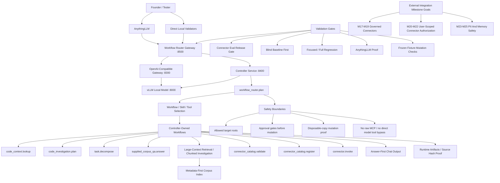

# Current Project Architecture

Status: durable orientation reference.

This diagram shows the current product shape for contextless readers. It is not a full implementation map. Use it to understand how founder prompts, AnythingLLM, the gateway, controller workflows, local model, validation gates, and future milestone goals relate.

## Current Boundaries

- The current product value is natural-language local-model work through deterministic routing, skills/tools, bounded evidence, answer-first chat output, and repeatable validation proof.
- The supported large-context path is governed 500k-token project usability through context strategy, retrieval, chunked investigation, artifact paging, and safety checks. It is not a raw 500k prompt guarantee.
- AnythingLLM is a tester-facing client surface. It should reach the workflow-router gateway when testing natural workflow behavior.
- Runtime artifacts are local proof records. They are not source of truth for product design unless summarized in tracked docs.
- Connector catalog validation, approval-gated connector registration, enabled local-stub connector mediation, connector eval release-gate validation, actor-bound connector invocation, user-scope checks for `oauth_user_scope` connectors, and replay-safe connector audit proof are available for governed manifest, registry append, dry-run/read-only proof, shippability checks, and user-scoped mediation proof. Real external connector execution, raw MCP access, enterprise-specific connectors, production OAuth token exchange, Kubernetes deployment, and persistent hidden memory are not currently shipped capabilities.

## Future Goal Position

The approved external-integration future goals are milestone goals, not implemented behavior:

- `EIG-1`: governed connector framework maps to `M17 -> M18 -> M19`.
- `EIG-2`: OAuth/user-scope identity propagation maps to `M20 -> M21 -> M22`; the current shipped slice provides explicit actor context, required-scope checks, and replay-safe audit for connector invocation without real OAuth provider integration.
- `EIG-3`: PII and memory safety maps to `M23 -> M24 -> M25`.

These goals should be implemented only through phases that preserve the existing single controller-owned path, fail-closed safety model, chat-quality validation, and contextless proof standards.

## Related References

- [Project Milestones](PROJECT_MILESTONES.md)
- [Actionable Workflow Roadmap](ACTIONABLE_WORKFLOW_ROADMAP.md)
- [Workflow Router README](../README.workflow-router.md)
- [Supplied Corpus QA README](../README.supplied-corpus-qa.md)
- [Gateway Feature README](../README.gateway.md)
- [Controller Service README](../README.controller-service.md)
