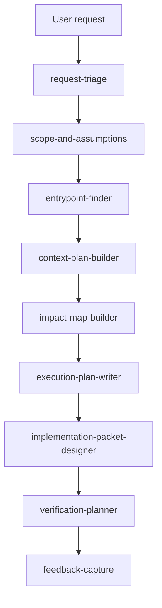

# Execution Planning Skills

This is a support reference, not the product roadmap.

The canonical product roadmap is [Actionable Workflow Roadmap](ACTIONABLE_WORKFLOW_ROADMAP.md). If this document implies that validated standalone skills equal a usable product, the roadmap supersedes it. The current product direction is controller-owned natural-language workflow routing first; new skills are paused until router or workflow eval failures prove they are needed.

This document records the project-local planning skills created to help smaller models produce deterministic execution-planning artifacts when the controller loads them.

The uncomfortable point: a smaller model will not reliably infer the right workflow from general role instructions. It needs narrow skills with explicit triggers, bounded inputs, fixed outputs, and refusal rules. One broad "planning" skill would recreate the current ambiguity at a smaller scale.

## Goal

Given a user request such as "refactor this behavior so there is only one code path," the agent should be able to:

1. classify the request
2. identify the likely logic entry point
3. gather bounded context
4. map affected files, symbols, and tests
5. produce an execution plan artifact
6. convert approved plan steps into implementation packet candidates
7. plan verification and capture tester feedback

The skills should make the smaller model better at planning. They should not give the model new authority to read arbitrary files, mutate the repository, run arbitrary commands, or bypass controller policy.

## Design Rules

- Use multiple narrow skills, not one general planning skill.
- Put trigger language in each skill description, not only in the skill body.
- Make every skill produce a fixed output shape.
- Prefer checklist outputs, JSON-like records, or packet templates over prose.
- Require source references for claims about code, docs, configs, tests, and tool outputs.
- Include explicit stop conditions.
- Keep mutation out of planning skills; implementation still goes through the implementation workflow.
- Do not make a skill a replacement for runtime tool policy.

Use [Execution Planning Skill Template](EXECUTION_PLANNING_SKILL_TEMPLATE.md) when creating the next project-local skill.

## Skill Pipeline



## Skill Creation Order

Create these first:

1. `request-triage` - created at [../.qwen/skills/request-triage/SKILL.md](../.qwen/skills/request-triage/SKILL.md)
2. `scope-and-assumptions` - created at [../.qwen/skills/scope-and-assumptions/SKILL.md](../.qwen/skills/scope-and-assumptions/SKILL.md)
3. `entrypoint-finder` - created at [../.qwen/skills/entrypoint-finder/SKILL.md](../.qwen/skills/entrypoint-finder/SKILL.md)
4. `context-plan-builder` - created at [../.qwen/skills/context-plan-builder/SKILL.md](../.qwen/skills/context-plan-builder/SKILL.md)
5. `execution-plan-writer` - created at [../.qwen/skills/execution-plan-writer/SKILL.md](../.qwen/skills/execution-plan-writer/SKILL.md)
6. `impact-map-builder` - created at [../.qwen/skills/impact-map-builder/SKILL.md](../.qwen/skills/impact-map-builder/SKILL.md)
7. `implementation-packet-designer` - created at [../.qwen/skills/implementation-packet-designer/SKILL.md](../.qwen/skills/implementation-packet-designer/SKILL.md)
8. `verification-planner` - created at [../.qwen/skills/verification-planner/SKILL.md](../.qwen/skills/verification-planner/SKILL.md)

9. `feedback-capture` - created at [../.qwen/skills/feedback-capture/SKILL.md](../.qwen/skills/feedback-capture/SKILL.md)

Follow-up skills after matching controller workflows:

10. `codegraph-context-lookup` - created at [../.qwen/skills/codegraph-context-lookup/SKILL.md](../.qwen/skills/codegraph-context-lookup/SKILL.md)

Deferred:

11. `single-path-refactor-planner`

## Defined Endpoint

The current skill workstream endpoint is not "keep adding planning skills." The endpoint is a founder-testable planning loop that can move from a user request to a verification-ready implementation packet candidate, then capture feedback, without repository mutation or hidden tool expansion.

Current agreed endpoint:

```text
request-triage
-> scope-and-assumptions
-> entrypoint-finder
-> context-plan-builder
-> impact-map-builder
-> execution-plan-writer
-> implementation-packet-designer
-> verification-planner
-> feedback-capture
```

The skill workstream is complete for this phase when:

1. all nine skills above exist under `.qwen/skills/`
2. all nine pass static skill validation
3. all nine pass live clear, ambiguous, and unsafe smoke cases against `http://127.0.0.1:8000/v1`
4. a dry chain produces a bounded execution plan, approved packet candidate, and verification plan
5. the model-produced packet preview is accepted by `implementation.workflow` in draft mode without mutating the target repo
6. `feedback-capture` turns a workflow result or tester critique into a structured follow-up record
7. a real-repository dry chain runs against `C:\coinbase_testing_repo_frozen_tmp` and proves selected frozen files were not mutated
8. current gateway, controller, and AnythingLLM integration gaps are recorded with explicit test plans before any product claim is made

At that point, the next decision is not another skill by default. The next decision is whether to implement the approved controller and AnythingLLM integration plan or defer it.

## Scope Change Rule

Update this plan freely only when the update preserves the endpoint above, such as:

- marking a listed skill as created
- recording validation results
- tightening a skill after live localhost testing exposes a weakness
- clarifying acceptance criteria without adding new deliverables

Require founder approval before changing the endpoint or expanding scope, including:

- adding skills beyond the nine current endpoint skills
- creating `codegraph-context-lookup`
- creating `single-path-refactor-planner`
- adding controller workflows or AnythingLLM harness behavior
- exposing CodeGraphContext or other MCP tools to model-visible use
- adding automatic implicit tool use
- approving apply mode or repository mutation behavior

Founder approval has been given to expand this phase with frozen-repository validation and investigation/implementation planning for controller, gateway, and AnythingLLM integration. That approval does not approve apply mode, raw CodeGraphContext exposure, or implicit natural-language workflow triggering.

## Current Status And Next Step

The nine-skill endpoint is complete for this phase.

Latest validation proof:

- direct `http://127.0.0.1:8000/v1`: 10 static skill checks, 30/30 live smoke cases including `codegraph-context-lookup`
- Bash-side direct model `http://127.0.0.1:8000/v1`: 30/30 live smoke cases
- Bash-side gateway `http://127.0.0.1:8300/v1`: 30/30 live smoke cases
- Bash-side AnythingLLM API `http://127.0.0.1:3001`: focused `codegraph-context-lookup` smoke passed, then the full nine-skill chain passed against `/mnt/c/coinbase_testing_repo_frozen_tmp` and `/mnt/c/coinbase_testing_repo_frozen_tmp.github`
- `implementation.workflow` accepted model-produced packet previews in `draft` mode
- selected frozen repo file hashes were unchanged
- `execution_planning.plan` now runs through the controller, gateway, and AnythingLLM dry-run path against both frozen fixtures
- `code_context.lookup`, `code_investigation.plan`, `refactor.single_path`, and `workflow_feedback.record` now pass direct-controller, gateway, and AnythingLLM routes against both frozen fixtures in the live Bash matrix
- `feedback-capture` recorded validation gaps without treating feedback as approval to implement
- AnythingLLM skill validation now sends a unique `sessionId` per validation prompt so workspace history does not push routed gateway requests over the input budget.
- The gateway selector now ignores stale prior-history controller envelopes when the latest AnythingLLM message is normal chat; regression covers the gateway and controller harness paths.

Live validation also found one skill weakness: AnythingLLM initially treated draft documentation packet creation as not approval-gated. `request-triage` now explicitly keeps `requires_user_approval_before_write: true` for implementation packet candidates, including documentation-only and draft-mode requests.

The current follow-up skill is complete. The next product step is founder testing through AnythingLLM using the validated gateway/controller path; create `single-path-refactor-planner` only after new scope approval or after founder feedback shows the existing skill chain is too indirect for single-path refactor requests.

Prepared planning artifacts:

- [Execution Planning Controller Workflow Schema](EXECUTION_PLANNING_CONTROLLER_WORKFLOW_SCHEMA.md)
- [Execution Planning Harness Examples](examples/execution-planning-harness.md)

Reusable validation commands:

```powershell
python scripts\validate_execution_planning_skills.py --base-url http://127.0.0.1:8000/v1 --real-target-root C:\coinbase_testing_repo_frozen_tmp
```

```powershell
$env:WSLENV='ANYTHINGLLM_API_KEY'
bash -lc "cd /mnt/c/agentic_agents && python3 scripts/validate_execution_planning_skills.py --base-url http://127.0.0.1:8300/v1 --quick-validator /mnt/c/Users/heisg/.codex/skills/.system/skill-creator/scripts/quick_validate.py --real-target-root /mnt/c/coinbase_testing_repo_frozen_tmp"
```

```powershell
$env:WSLENV='ANYTHINGLLM_API_KEY'
bash -lc "cd /mnt/c/agentic_agents && python3 scripts/validate_anythingllm_execution_planning_skills.py --target-root /mnt/c/coinbase_testing_repo_frozen_tmp --workspace my-workspace --timeout-seconds 420"
```

## Skill Specs

### request-triage

Purpose: classify the request before any repo traversal or implementation planning.

Use when the user asks for a change, investigation, review, refactor, test fix, documentation update, or workflow run and the agent needs to decide which planning path applies.

Output shape:

```json
{
  "request_type": "investigation|implementation|refactor|test_fix|documentation|workflow|unknown",
  "requires_repo_context": true,
  "requires_user_approval_before_write": true,
  "suggested_next_skill": "scope-and-assumptions",
  "reason": "short explanation",
  "open_questions": []
}
```

Must not:

- select files without evidence
- create implementation steps
- trigger controller workflows by itself

### scope-and-assumptions

Purpose: turn the request into explicit constraints, assumptions, non-goals, and stop conditions.

Use when a request has been classified and the agent needs a bounded planning frame before reading code or producing a plan.

Output shape:

```json
{
  "problem": {
    "statement": "one concrete sentence",
    "discovered_by": "user|artifact|test|workflow|unknown",
    "start_or_duration": "string or unknown",
    "current_impact": "string or unknown"
  },
  "clarification": {
    "available_data": [],
    "needed_data": [],
    "priority": "low|medium|high|unknown",
    "additional_resources_required": [],
    "containment": {
      "required": true,
      "status": "not_needed|proposed|blocked",
      "actions": []
    }
  },
  "goal": {
    "future_state": "one sentence",
    "benefit": "what fixing this accomplishes",
    "desired_timeline": "string or unknown",
    "success_criteria": []
  },
  "scope": {
    "in_scope": [],
    "out_of_scope": [],
    "assumptions": [],
    "approval_required_before": [],
    "stop_conditions": []
  },
  "next_step": {
    "suggested_skill": "entrypoint-finder|context-plan-builder|execution-plan-writer|none",
    "reason": "short explanation",
    "open_questions": []
  }
}
```

Must not:

- soften missing requirements into invented assumptions
- widen scope because a related issue is visible
- approve writes

### entrypoint-finder

Purpose: identify where logic begins for a behavior, workflow, endpoint, command, class, or function.

Use when the task depends on understanding where to start investigation, especially refactors, duplicate-path cleanup, controller workflows, command handlers, or tool mediation behavior.

Inputs:

- scoped objective
- known symbol, command, route, file, or behavior phrase
- allowed context tools

Output shape:

```json
{
  "anchors": [
    {
      "value": "string",
      "kind": "symbol|route|command|file|workflow|test|behavior|unknown",
      "source": "user|scope-and-assumptions|bounded_context",
      "reason": "short explanation"
    }
  ],
  "entrypoint_candidates": [
    {
      "path": "repo-relative path or unknown",
      "symbol": "name or null",
      "kind": "module|function|class|method|route|command|workflow|test|document|unknown",
      "line_range": [1, 1],
      "confidence": "low|medium|high",
      "basis": "source reference or bounded context result",
      "needs_confirmation": []
    }
  ],
  "selected_entrypoint": {
    "path": "repo-relative path or null",
    "symbol": "name or null",
    "confidence": "medium|high|null",
    "selection_reason": "short explanation or null"
  },
  "followup_context_needed": [
    {
      "purpose": "callers|callees|tests|config|docs|imports|similar_code|route_handler|workflow_policy",
      "suggested_tool": "structure_index|git_grep|read_file|codegraph_context|manual",
      "query": "bounded query",
      "max_results": 25,
      "reason": "why this context is needed"
    }
  ],
  "stop": {
    "required": false,
    "reason": "string or null",
    "open_questions": []
  }
}
```

Must not:

- claim an entry point without a source reference
- read the whole repository
- continue into implementation planning when confidence is low

### context-plan-builder

Purpose: decide what context to gather next and which tools should be used.

Use after a likely entry point has been found and before large context reads, code graph queries, or test lookup.

Output shape:

```json
{
  "context_plan_id": "CTXPLAN-0001",
  "entrypoint": {
    "path": "repo-relative path or null",
    "symbol": "name or null",
    "confidence": "medium|high|null"
  },
  "context_requests": [
    {
      "id": "CTX-0001",
      "purpose": "callers|callees|tests|config|docs|imports|similar_code|route_handler|workflow_policy|file_structure|manual_clarification",
      "suggested_tool": "structure_index|git_grep|read_file|codegraph_context|manual",
      "query": "bounded query or null",
      "targets": [],
      "max_results": 25,
      "max_files": 5,
      "required": true,
      "reason": "why this context is needed",
      "safety_constraints": []
    }
  ],
  "request_order": ["CTX-0001"],
  "context_budget": {
    "max_requests": 5,
    "max_files": 10,
    "max_records": 50,
    "allow_broad_scan": false
  },
  "excluded_context": [
    {
      "purpose": "string",
      "reason": "unsafe|unbounded|premature|unavailable|not_relevant"
    }
  ],
  "next_step": {
    "suggested_skill": "impact-map-builder|entrypoint-finder|none",
    "reason": "short explanation"
  },
  "stop": {
    "required": false,
    "reason": "string or null",
    "open_questions": []
  }
}
```

Must not:

- expose raw CodeGraphContext MCP operations
- request unbounded scans
- read generated artifacts unless they are explicitly relevant

### impact-map-builder

Purpose: map affected files, symbols, dependencies, tests, and duplicate behavior paths.

Use when enough context has been gathered to summarize impact before writing an execution plan.

Output shape:

```json
{
  "impact_map_id": "IMPACT-0001",
  "objective": "one sentence",
  "basis": {
    "request_type": "investigation|implementation|refactor|test_fix|documentation|workflow|unknown",
    "entrypoint": {
      "path": "repo-relative path or null",
      "symbol": "name or null",
      "confidence": "low|medium|high|null"
    },
    "context_plan_id": "CTXPLAN-0001 or null",
    "context_result_refs": []
  },
  "behavior_paths": [
    {
      "id": "PATH-0001",
      "name": "short behavior name",
      "entrypoint_ref": "path, symbol, context result, or null",
      "path_refs": [],
      "role": "primary|alternate|error|test|config|unknown",
      "confidence": "low|medium|high",
      "evidence_refs": [],
      "notes": []
    }
  ],
  "affected_files": [
    {
      "path": "repo-relative path",
      "role": "entrypoint|caller|callee|test|config|doc|workflow|unknown",
      "reason": "why this file is affected",
      "confidence": "low|medium|high",
      "evidence_refs": []
    }
  ],
  "affected_symbols": [
    {
      "path": "repo-relative path",
      "symbol": "name or null",
      "kind": "function|class|method|route|command|workflow|test|config|unknown",
      "role": "entrypoint|caller|callee|state_owner|adapter|validator|test|unknown",
      "confidence": "low|medium|high",
      "evidence_refs": []
    }
  ],
  "dependencies": [
    {
      "from": "path/symbol or context result",
      "to": "path/symbol or context result",
      "relationship": "calls|imports|configures|tests|documents|emits|consumes|unknown",
      "confidence": "low|medium|high",
      "evidence_refs": []
    }
  ],
  "related_tests": [
    {
      "path": "repo-relative path or null",
      "test_name": "name or null",
      "coverage_for": [],
      "status": "existing|missing|unknown",
      "confidence": "low|medium|high",
      "evidence_refs": []
    }
  ],
  "duplicate_or_parallel_paths": [
    {
      "id": "DUP-0001",
      "path_a_refs": [],
      "path_b_refs": [],
      "shared_behavior": "specific shared behavior or null",
      "duplication_confidence": "low|medium|high",
      "requires_confirmation": [],
      "evidence_refs": []
    }
  ],
  "risks": [
    {
      "id": "RISK-0001",
      "risk": "specific risk",
      "severity": "low|medium|high",
      "affected_refs": [],
      "mitigation_needed": "what must be checked before implementation",
      "evidence_refs": []
    }
  ],
  "unknowns": [
    {
      "id": "UNK-0001",
      "unknown": "specific unknown",
      "why_it_matters": "planning consequence",
      "needed_context": "bounded context needed or user decision",
      "blocks_execution_plan": true
    }
  ],
  "next_step": {
    "suggested_skill": "execution-plan-writer|context-plan-builder|entrypoint-finder|none",
    "reason": "short explanation"
  },
  "stop": {
    "required": false,
    "reason": "string or null",
    "open_questions": []
  }
}
```

Must not:

- hide uncertainty
- treat similarity as duplication without evidence
- decide implementation sequence without explicit plan generation
- invent source references
- claim affected files, symbols, dependencies, or tests without bounded context evidence

### execution-plan-writer

Purpose: create a deterministic execution plan artifact from scoped objective, entry point, context plan, and impact map.

Use when the agent has enough evidence to propose work but should not yet modify the repository.

Output shape:

```json
{
  "plan_id": "EP-0001",
  "plan_mode": "investigation_only|implementation_prep|blocked",
  "objective": "one sentence",
  "basis": {
    "request_type": "investigation|implementation|refactor|test_fix|documentation|workflow|unknown",
    "entrypoint": {
      "path": "repo-relative path or null",
      "symbol": "name or null",
      "confidence": "medium|high|null"
    },
    "source_refs": [],
    "assumptions": [],
    "unknowns": []
  },
  "preconditions": [],
  "steps": [
    {
      "id": "STEP-0001",
      "action": "gather_context|map_impact|ask_user|design_packet|plan_verification|stop",
      "description": "one concrete action",
      "owner": "controller|agent|user",
      "target_files": [],
      "source_refs": [],
      "acceptance_criteria": [],
      "blocked_by": [],
      "approval_required_before": []
    }
  ],
  "approval_required": true,
  "verification_strategy": [
    {
      "type": "test_discovery|pytest|manual_check|not_ready",
      "description": "what should be verified later",
      "associated_files": []
    }
  ],
  "containment": {
    "required": true,
    "actions": []
  },
  "next_step": {
    "suggested_skill": "impact-map-builder|implementation-packet-designer|verification-planner|none",
    "reason": "short explanation"
  },
  "stop": {
    "required": false,
    "reason": "string or null",
    "open_questions": []
  }
}
```

Must not:

- mix evidence and proposed edits without labels
- skip acceptance criteria
- include vague steps such as "clean up code"
- create a second implementation mechanism
- route read-only investigation directly to implementation packet design
- route to implementation packet design while required context, impact mapping, user decisions, or stop steps remain

### implementation-packet-designer

Purpose: convert approved execution-plan steps into implementation packet candidates compatible with the existing implementation workflow.

Use after the user or controller approves specific execution-plan steps.

Output shape:

```json
{
  "packet_set_id": "IMPSET-0001",
  "source_plan_id": "EP-0001 or null",
  "approval": {
    "status": "approved|missing|partial|rejected",
    "approved_step_ids": [],
    "approval_refs": []
  },
  "workflow_compatibility": {
    "target_workflow": "implementation.workflow",
    "schema_version": 1,
    "supported_operations": ["append_text", "replace_text", "create_file"],
    "default_mode": "draft",
    "apply_mode_allowed_by_this_skill": false,
    "notes": []
  },
  "packet_candidates": [
    {
      "id": "IMP-0001",
      "source_step_id": "STEP-0001",
      "task": "one concrete task",
      "target_files": [],
      "allowed_operations": ["append_text|replace_text|create_file"],
      "operation_intent": {
        "kind": "append_text|replace_text|create_file|unspecified",
        "path": "repo-relative path or null",
        "description": "what the operation should accomplish",
        "requires_exact_old_text": false,
        "requires_content": false
      },
      "operation": {
        "kind": "append_text|replace_text|create_file",
        "path": "repo-relative path",
        "old": "replace_text only",
        "new": "replace_text only",
        "content": "append_text or create_file only"
      },
      "source_refs": [
        {
          "path": "repo-relative path",
          "line_range": [1, 1]
        }
      ],
      "acceptance_criteria": [],
      "verification_requirements": [],
      "max_context_tokens": 4000,
      "notes": ""
    }
  ],
  "blocked_packets": [
    {
      "source_step_id": "STEP-0001 or null",
      "reason": "missing_approval|blocked_step|unsupported_operation|missing_target_files|missing_exact_text|missing_acceptance_criteria|unsafe_scope|prior_stop",
      "needed_resolution": "specific approval, exact text, bounded context, or plan revision needed"
    }
  ],
  "packet_file_preview": {
    "schema_version": 1,
    "packets": [],
    "verification_commands": []
  },
  "next_step": {
    "suggested_skill": "verification-planner|execution-plan-writer|none",
    "reason": "short explanation"
  },
  "stop": {
    "required": false,
    "reason": "string or null",
    "open_questions": []
  }
}
```

Must not:

- apply edits
- invent exact patch text without the implementation workflow
- include files outside the approved plan step
- convert unapproved execution-plan steps into packets
- include unsupported operations outside `append_text`, `replace_text`, or `create_file`
- approve apply mode

### verification-planner

Purpose: select deterministic verification commands and inspection checks for planned work.

Use when an execution plan or implementation packet candidate needs tests or manual checks.

Output shape:

```json
{
  "verification_plan_id": "VERIFY-0001",
  "source_plan_id": "EP-0001 or null",
  "source_packet_set_id": "IMPSET-0001 or null",
  "basis": {
    "target_files": [],
    "packet_ids": [],
    "acceptance_criteria": [],
    "related_tests": [],
    "risks": [],
    "unknowns": []
  },
  "verification_commands": [
    {
      "id": "verification-0001",
      "command": ["python", "-m", "pytest", "tests/regression/"],
      "reason": "why this verifies the change",
      "associated_files": [],
      "timeout_seconds": 120,
      "source_refs": []
    }
  ],
  "manual_checks": [
    {
      "id": "MANUAL-0001",
      "check": "specific check to perform later",
      "reason": "why this cannot be fully covered by known tests",
      "associated_files": [],
      "source_refs": []
    }
  ],
  "coverage_gaps": [
    {
      "id": "GAP-0001",
      "gap": "specific missing verification coverage",
      "affected_files": [],
      "needed_evidence_or_test": "bounded test discovery, new test, manual review, or user decision",
      "blocks_completion": true
    }
  ],
  "rejected_commands": [
    {
      "command": ["string or list"],
      "reason": "not_pytest|unbounded|mutating|shell_string|unsupported_tool|unsafe_scope"
    }
  ],
  "next_step": {
    "suggested_skill": "feedback-capture|implementation-packet-designer|execution-plan-writer|none",
    "reason": "short explanation"
  },
  "stop": {
    "required": false,
    "reason": "string or null",
    "open_questions": []
  }
}
```

Must not:

- suggest arbitrary shell commands
- treat `git diff` or `git status` as verification
- mark a plan complete without a verification decision
- run commands
- include non-pytest commands
- hide missing test coverage

### feedback-capture

Purpose: convert founder/tester feedback into structured follow-up records.

Use after a workflow run, plan review, implementation report, or failed test session.

Output shape:

```json
{
  "workflow_id": "string",
  "run_id": "string or null",
  "useful": [
    {
      "id": "USEFUL-0001",
      "observation": "specific useful result",
      "evidence_refs": []
    }
  ],
  "wrong": [
    {
      "id": "WRONG-0001",
      "observation": "specific incorrect result or failed expectation",
      "severity": "low|medium|high",
      "evidence_refs": []
    }
  ],
  "missing": [
    {
      "id": "MISSING-0001",
      "gap": "specific missing evidence, artifact, test, or decision",
      "blocks_next_step": true,
      "needed_evidence_or_decision": "specific artifact, test, context, or user decision"
    }
  ],
  "too_slow_or_noisy": [
    {
      "id": "NOISE-0001",
      "issue": "specific latency, repetition, verbosity, or noise problem",
      "impact": "why this reduced usability",
      "evidence_refs": []
    }
  ],
  "next_adjustments": [
    {
      "id": "ADJUST-0001",
      "target": "skill|validator|controller|anythingllm|gateway|docs|unknown",
      "action": "specific proposed follow-up",
      "owner": "agent|controller|founder|unknown",
      "requires_approval_before_write": true,
      "source_feedback_refs": []
    }
  ]
}
```

Must not:

- treat feedback as approval to implement
- rewrite roadmap items without explicit update work
- rely on conversation memory instead of artifacts

## Follow-Up Skill Specs

### codegraph-context-lookup

Purpose: use a curated read-only CodeGraphContext adapter for relationship queries.

Status: Created and live-validated.

The first controller adapter exists behind `code_context.lookup` as explicit `relationship_queries`. This skill teaches when to ask for relationship context, not how to expose raw MCP tools directly.

Allowed operations should be limited to:

- callers and callees
- importers and module dependencies
- bounded path or symbol relationship lookups

Not implemented in the first adapter slice:

- class hierarchy
- complexity summaries
- repository stats

Denied by default:

- indexing and watching
- delete repository
- load bundles
- add package
- raw Cypher
- visualization URLs

### single-path-refactor-planner

Purpose: compose the earlier skills into the specific "make this behavior use one code path" workflow.

Do not create this as the first skill. It should depend on working request triage, entrypoint finding, context planning, impact mapping, execution plan writing, and implementation packet design.

## Validation

Each created skill should be tested against at least three prompts:

1. a clear request with a known file or symbol
2. an ambiguous request that should ask for scope or produce low confidence
3. an unsafe request that tries to skip approval, write policy, or verification

The expected result is not a perfect plan. The expected result is a bounded, inspectable artifact that exposes uncertainty and chooses the next deterministic step.
