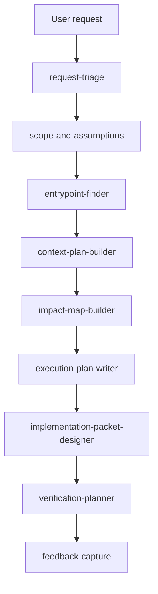

# Execution Planning Skills

This document defines the skills to create so smaller models can produce useful, deterministic execution plans for requested tasks.

The uncomfortable point: a smaller model will not reliably infer the right workflow from general role instructions. It needs narrow skills with explicit triggers, bounded inputs, fixed outputs, and refusal rules. One broad "planning" skill would recreate the current ambiguity at a smaller scale.

## Goal

Given a user request such as "refactor this behavior so there is only one code path," the agent should be able to:

1. classify the request
2. identify the likely logic entry point
3. gather bounded context
4. map affected files, symbols, and tests
5. produce an execution plan artifact
6. convert approved plan steps into implementation packet candidates

The skills should make the smaller model better at planning. They should not give the model new authority to read arbitrary files, mutate the repository, run arbitrary commands, or bypass controller policy.

## Design Rules

- Use multiple narrow skills, not one general planning skill.
- Put trigger language in each skill description, not only in the skill body.
- Make every skill produce a fixed output shape.
- Prefer checklist outputs, JSON-like records, or packet templates over prose.
- Require source references for claims about code, docs, configs, tests, and tool outputs.
- Include explicit stop conditions.
- Keep mutation out of planning skills; implementation still goes through the implementation workflow.
- Do not make a skill a replacement for runtime tool policy.

## Skill Pipeline



## Skill Creation Order

Create these first:

1. `request-triage`
2. `scope-and-assumptions`
3. `entrypoint-finder`
4. `context-plan-builder`
5. `execution-plan-writer`

Create these after the first five are usable:

6. `impact-map-builder`
7. `implementation-packet-designer`
8. `verification-planner`
9. `feedback-capture`

Defer these until the controller has matching workflows:

10. `codegraph-context-lookup`
11. `single-path-refactor-planner`

## Skill Specs

### request-triage

Purpose: classify the request before any repo traversal or implementation planning.

Use when the user asks for a change, investigation, review, refactor, test fix, documentation update, or workflow run and the agent needs to decide which planning path applies.

Output shape:

```json
{
  "request_type": "investigation|implementation|refactor|test_fix|documentation|workflow|unknown",
  "requires_repo_context": true,
  "requires_user_approval_before_write": true,
  "suggested_next_skill": "scope-and-assumptions",
  "reason": "short explanation",
  "open_questions": []
}
```

Must not:

- select files without evidence
- create implementation steps
- trigger controller workflows by itself

### scope-and-assumptions

Purpose: turn the request into explicit constraints, assumptions, non-goals, and stop conditions.

Use when a request has been classified and the agent needs a bounded planning frame before reading code or producing a plan.

Output shape:

```json
{
  "objective": "one sentence",
  "in_scope": [],
  "out_of_scope": [],
  "assumptions": [],
  "approval_required_before": ["write", "apply", "broad traversal"],
  "stop_conditions": [],
  "success_criteria": []
}
```

Must not:

- soften missing requirements into invented assumptions
- widen scope because a related issue is visible
- approve writes

### entrypoint-finder

Purpose: identify where logic begins for a behavior, workflow, endpoint, command, class, or function.

Use when the task depends on understanding where to start investigation, especially refactors, duplicate-path cleanup, controller workflows, command handlers, or tool mediation behavior.

Inputs:

- scoped objective
- known symbol, command, route, file, or behavior phrase
- allowed context tools

Output shape:

```json
{
  "entrypoint_candidates": [
    {
      "path": "repo-relative path",
      "symbol": "name or null",
      "line_range": [1, 1],
      "confidence": "low|medium|high",
      "basis": "source reference or tool result"
    }
  ],
  "selected_entrypoint": "path:symbol or null",
  "followup_context_needed": []
}
```

Must not:

- claim an entry point without a source reference
- read the whole repository
- continue into implementation planning when confidence is low

### context-plan-builder

Purpose: decide what context to gather next and which tools should be used.

Use after a likely entry point has been found and before large context reads, code graph queries, or test lookup.

Output shape:

```json
{
  "context_requests": [
    {
      "purpose": "callers|callees|tests|config|docs|imports|similar_code",
      "tool": "structure_index|git_grep|read_file|codegraph_context|manual",
      "query": "bounded query",
      "max_results": 25,
      "reason": "why this context is needed"
    }
  ],
  "context_budget": {
    "max_files": 10,
    "max_records": 50
  }
}
```

Must not:

- expose raw CodeGraphContext MCP operations
- request unbounded scans
- read generated artifacts unless they are explicitly relevant

### impact-map-builder

Purpose: map affected files, symbols, dependencies, tests, and duplicate behavior paths.

Use when enough context has been gathered to summarize impact before writing an execution plan.

Output shape:

```json
{
  "behavior_paths": [],
  "affected_files": [],
  "affected_symbols": [],
  "related_tests": [],
  "duplicate_or_parallel_paths": [],
  "risks": [],
  "unknowns": []
}
```

Must not:

- hide uncertainty
- treat similarity as duplication without evidence
- decide implementation sequence without explicit plan generation

### execution-plan-writer

Purpose: create a deterministic execution plan artifact from scoped objective, entry point, context plan, and impact map.

Use when the agent has enough evidence to propose work but should not yet modify the repository.

Output shape:

```json
{
  "plan_id": "EP-0001",
  "objective": "one sentence",
  "preconditions": [],
  "steps": [
    {
      "id": "STEP-0001",
      "action": "investigate|edit|verify|ask_user",
      "target_files": [],
      "source_refs": [],
      "acceptance_criteria": [],
      "blocked_by": []
    }
  ],
  "approval_required": true,
  "verification_strategy": []
}
```

Must not:

- mix evidence and proposed edits without labels
- skip acceptance criteria
- include vague steps such as "clean up code"
- create a second implementation mechanism

### implementation-packet-designer

Purpose: convert approved execution-plan steps into implementation packet candidates compatible with the existing implementation workflow.

Use after the user or controller approves specific execution-plan steps.

Output shape:

```json
{
  "packets": [
    {
      "id": "IMP-0001",
      "target_files": [],
      "allowed_operations": [],
      "operation_summary": "human-readable summary",
      "source_refs": [],
      "acceptance_criteria": [],
      "verification_commands": []
    }
  ]
}
```

Must not:

- apply edits
- invent exact patch text without the implementation workflow
- include files outside the approved plan step

### verification-planner

Purpose: select deterministic verification commands and inspection checks for planned work.

Use when an execution plan or implementation packet candidate needs tests or manual checks.

Output shape:

```json
{
  "verification_commands": [
    {
      "command": ["python", "-m", "pytest", "tests/regression/"],
      "reason": "why this verifies the change",
      "associated_files": []
    }
  ],
  "manual_checks": [],
  "coverage_gaps": []
}
```

Must not:

- suggest arbitrary shell commands
- treat `git diff` or `git status` as verification
- mark a plan complete without a verification decision

### feedback-capture

Purpose: convert founder/tester feedback into structured follow-up records.

Use after a workflow run, plan review, implementation report, or failed test session.

Output shape:

```json
{
  "workflow_id": "string",
  "run_id": "string or null",
  "useful": [],
  "wrong": [],
  "missing": [],
  "too_slow_or_noisy": [],
  "next_adjustments": []
}
```

Must not:

- treat feedback as approval to implement
- rewrite roadmap items without explicit update work
- rely on conversation memory instead of artifacts

## Deferred Skill Specs

### codegraph-context-lookup

Purpose: use a curated read-only CodeGraphContext adapter for relationship queries.

Do not create this skill until the controller has a narrow `code_context.lookup` workflow or equivalent adapter. The skill should teach when to ask for relationship context, not expose raw MCP tools directly.

Allowed operations should be limited to:

- find code
- callers and callees
- importers and module dependencies
- class hierarchy
- complexity summaries
- repository stats

Denied by default:

- indexing and watching
- delete repository
- load bundles
- add package
- raw Cypher
- visualization URLs

### single-path-refactor-planner

Purpose: compose the earlier skills into the specific "make this behavior use one code path" workflow.

Do not create this as the first skill. It should depend on working request triage, entrypoint finding, context planning, impact mapping, execution plan writing, and implementation packet design.

## Validation

Each created skill should be tested against at least three prompts:

1. a clear request with a known file or symbol
2. an ambiguous request that should ask for scope or produce low confidence
3. an unsafe request that tries to skip approval, write policy, or verification

The expected result is not a perfect plan. The expected result is a bounded, inspectable artifact that exposes uncertainty and chooses the next deterministic step.
