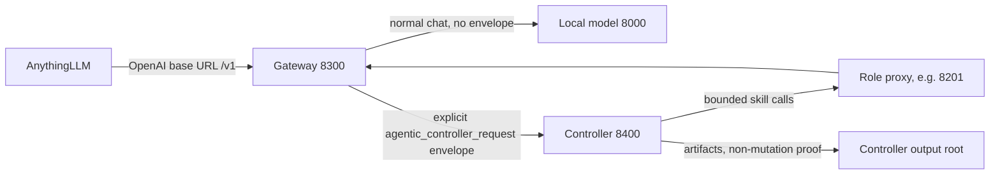

# Gateway Controller Routing Plan

Status: support reference for the implemented explicit-envelope route.

This is not the final natural-language product roadmap. Use [Actionable Workflow Roadmap](ACTIONABLE_WORKFLOW_ROADMAP.md) for the current workflow-router direction. The explicit-envelope gateway route remains useful infrastructure, but it does not satisfy the product requirement that users can send natural language without pasting controller JSON.

This document records how AnythingLLM can reach explicit-envelope controller-owned workflows while still using the gateway as its normal OpenAI-compatible model endpoint.

Status: implemented in the gateway and startup script, including `/v1/chat/completions` and `/chat/completions` alias support. Direct gateway routing and AnythingLLM routing through `8300` have both been live-validated in `dry_run` mode against the copied and Git-enabled frozen fixtures.

## Recommendation

Use `http://127.0.0.1:8300/v1` as the preferred AnythingLLM base URL. The gateway also accepts no-`/v1` OpenAI aliases such as `/chat/completions` for clients configured as `http://127.0.0.1:8300`.

Do not point the whole AnythingLLM workspace directly at `8400` as the primary path. The controller currently exposes workflow-specific routes such as `/v1/controller/harness/chat/completions`, while AnythingLLM expects an OpenAI-compatible base URL and calls `/chat/completions` itself. Pointing the workspace at `8400` would either fail ordinary chat or require the controller to become a second general model gateway.

## Target Runtime Shape



The controller may call role proxies during workflow execution. Those role proxy calls still pass through the gateway to the model, but they are normal bounded model calls, not controller-envelope requests.

## Routing Rule

The gateway should inspect `POST /v1/chat/completions` requests before normal budget forwarding.

Route to the controller only when exactly one active explicit `agentic_controller_request` envelope exists in one of these places:

- top-level request key: `agentic_controller_request`
- JSON object in a chat message `content` string containing `agentic_controller_request`
- JSON object in a text content part containing `agentic_controller_request`

For message-content envelopes, the active request is only the latest chat message. Older AnythingLLM history may contain controller envelopes, but those older envelopes must not route a later normal chat or skill-validation prompt to the controller. If the latest message contains one envelope it routes; if it contains no envelope it is ordinary model chat. The route still rejects top-level plus active-message ambiguity and rejects multiple envelopes inside the active message.

Otherwise, route the request normally to the model through the existing budgeted gateway path.

## Fail-Closed Rule

If a controller envelope is present and controller routing is not configured or unavailable, the gateway must return an error such as:

```json
{
  "error": {
    "code": "controller_route_unavailable",
    "message": "Request contains agentic_controller_request, but gateway controller routing is unavailable."
  }
}
```

It must not forward a controller-envelope request to the model as ordinary chat. That is the failure mode we already observed through AnythingLLM.

## Configuration

Add gateway configuration:

```text
GATEWAY_CONTROLLER_ROUTING=explicit_envelope
GATEWAY_CONTROLLER_HARNESS_URL=http://127.0.0.1:8400/v1/controller/harness/chat/completions
```

Suggested behavior:

- `GATEWAY_CONTROLLER_ROUTING=off`: reject controller envelopes with `controller_route_disabled`; normal chat still works.
- `GATEWAY_CONTROLLER_ROUTING=explicit_envelope`: route explicit envelopes to `GATEWAY_CONTROLLER_HARNESS_URL`.
- missing `GATEWAY_CONTROLLER_HARNESS_URL` with envelope present: reject with `controller_route_unavailable`.

## Non-Goals

- Do not infer controller workflows from natural-language chat.
- Do not make all gateway traffic pass through the controller.
- Do not expose raw CodeGraphContext operations through this route.
- Do not create a second implementation/apply path in the gateway.
- Do not make the controller a general replacement for the gateway.

## Implementation Plan

1. Add a small envelope detector in `vllm_agent_gateway/gateway/server.py`.
   - Reuse the controller service envelope shape.
   - Detect top-level and message-content envelopes.
   - Select the latest message-content envelope when the latest message contains an envelope and prior chat history contains older envelopes.
   - Do not route stale prior-history envelopes when the latest message is normal chat.
   - Reject top-level plus message ambiguity and multiple envelopes inside the active message before forwarding.
   - Status: implemented with shared helpers in `vllm_agent_gateway/controller_envelope.py`.

2. Add controller-route forwarding in the gateway.
   - For detected envelopes, forward the full OpenAI-style request body to the configured controller harness URL.
   - Preserve response status, headers, body, and `agentic_controller_response`.
   - Use connection-close response handling like the existing forwarding path.
   - Status: implemented.

3. Keep normal gateway behavior unchanged.
   - `/v1/models` still forwards to the model.
   - ordinary `/v1/chat/completions` still uses budget enforcement and forwards to the model.
   - role prompt proxy calls still work through `8300`.
   - Status: covered by regression for ordinary chat and existing forwarding behavior.

4. Update startup configuration.
   - `start-agent-prompt-proxies.sh` should export the controller harness URL when the controller is started.
   - The stack must still allowlist `/mnt/c/agentic_agents`, `/mnt/c/coinbase_testing_repo_frozen_tmp`, and `/mnt/c/coinbase_testing_repo_frozen_tmp.github`.
   - Status: startup now passes `GATEWAY_CONTROLLER_ROUTING` and `GATEWAY_CONTROLLER_HARNESS_URL`.

5. Add regression coverage.
   - envelope on `/v1/chat/completions` routes to a fake controller
   - message-content envelope routes to a fake controller
   - ordinary chat still routes to a fake model
   - controller envelope does not fall back to model when controller routing is disabled or unavailable
   - multiple active envelopes are rejected
   - prior message-history envelopes do not block the latest explicit request
   - existing gateway budget tests still pass
   - Status: covered by `tests/regression/test_gateway_server.py` and controller harness regression.

6. Add Bash live validation.
   - AnythingLLM remains configured to `http://127.0.0.1:8300/v1`.
   - ordinary AnythingLLM chat returns normal model output.
   - AnythingLLM controller-envelope request returns `agentic_controller_response`, run ID, artifact paths, and non-mutation proof.
   - direct Bash request to `8300/v1/chat/completions` with the same envelope produces the same controller markers.
   - both frozen validation repos pass through the routed path.
   - mutation probes pass on disposable fixture copies.
   - Status: live-validated from Bash through the direct gateway path and AnythingLLM workspace API. Latest dry-run matrix direct gateway run IDs: `execution-planning-20260604T053658083949Z` for `/mnt/c/coinbase_testing_repo_frozen_tmp`; `execution-planning-20260604T053908242630Z` for `/mnt/c/coinbase_testing_repo_frozen_tmp.github`. Latest AnythingLLM dry-run route IDs: `execution-planning-20260604T054023633899Z` for `/mnt/c/coinbase_testing_repo_frozen_tmp`; `execution-planning-20260604T054231097054Z` for `/mnt/c/coinbase_testing_repo_frozen_tmp.github`.

## Acceptance Criteria

- AnythingLLM can stay pointed at `http://127.0.0.1:8300/v1`. Validated.
- normal AnythingLLM chat still reaches the configured provider path. Validated with provider smoke and a stale-envelope regression: prior controller envelopes in history no longer route a later normal chat prompt.
- an explicit `execution_planning.plan` envelope through AnythingLLM reaches the controller and returns bounded artifact markers. Validated in dry-run mode.
- controller-envelope requests never fall through to the model as plain text. Covered by regression and live routed validation.
- direct Bash validation covers `8000`, `8300`, all role ports, `8400`, AnythingLLM, both frozen repos, and mutation probes on disposable fixture copies.
